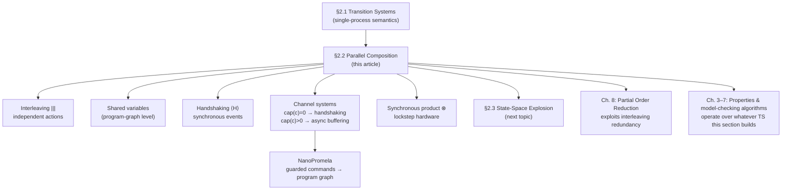

[[book-guidelines|↩ Back to guidelines]]

# Concurrency and Communication Modeling

## Why a single operator `‖` isn't enough

Chapter 2 has already given you transition systems and program graphs as a way to turn a single sequential process into a graph of states and labeled edges. The moment you have two or more processes running together, you need a way to combine their transition systems into one — call it $TS = TS_1 \parallel TS_2 \parallel \ldots \parallel TS_n$ — and you'd like $\parallel$ to be a single, well-behaved, commutative and associative operator, so that composing hierarchically ($TS_i = TS_{i,1} \parallel \ldots \parallel TS_{i,n_i}$) gives you the same answer regardless of how you group the pieces (p. 35–36).

The book's real content in this section is the discovery that **there is no one such operator** — there's a whole family, and the family is ordered by how much the processes are allowed to depend on each other:

1. **No interaction at all** — pure interleaving.
2. **Interaction through memory** — shared variables.
3. **Interaction through synchronized events** — handshaking.
4. **Interaction through buffered events** — channel systems, which generalize handshaking with nonzero-capacity FIFO buffers.
5. **Interaction through lockstep time** — synchronous parallel composition, which is a different axis entirely (all components must move together, rather than some subset of them synchronizing on shared actions).

And a genuinely surprising fact falls out of this hierarchy: **not all of these operators are associative.** Interleaving is. Handshaking, in general, is *not* — unless you fix the synchronization set once for the whole system. This single result is the reason the book bothers to define parallel composition so carefully instead of just waving at "processes run together": associativity isn't a free algebraic nicety, it's a property you have to earn from the semantics, and losing it means $(TS_1 \parallel TS_2) \parallel TS_3 \neq TS_1 \parallel (TS_2 \parallel TS_3)$ — the meaning of a system would depend on how you parenthesize its description, which would be a disaster for compositional modeling.

We'll build the hierarchy from the ground up, each layer paired with the exact machinery the book uses: structural operational semantics (SOS) rules, the state-space cost of each scheme, and the running examples (Peterson's algorithm, the Alternating Bit Protocol) that make the abstractions concrete.

---

## 1. Interleaving: concurrency as nondeterministic weaving

### The idea before the symbol

The simplest possible model of "two things happening at once" is to pretend they never actually happen *simultaneously* — instead, at every instant exactly one component takes a step, and which one is a matter of unconstrained, arbitrary choice. If $P$ and $Q$ are two nonterminating, fully independent processes, their concurrent execution is just some interleaving of their individual step sequences:

```
P Q P Q P Q Q Q P ...
P P Q P P Q P P Q ...
Q P P Q P P P Q ...
```

all equally valid (p. 37). This is the "one-processor view": you model concurrency as if a single scheduler nondeterministically picks who runs next, with *no* assumption about [[Fairness|fairness]], speed, or strategy (fairness constraints arrive only in Chapter 3 — here, even the execution that starves $Q$ forever is a legal execution).

**What breaks without it:** if you tried to model concurrency by picking one particular interleaving (say, always alternate P, Q, P, Q, ...), your model would silently assume a scheduling policy that the real system doesn't guarantee. Model checking that model would only tell you about *that* schedule, not about every schedule a real OS or hardware fabric might pick. Interleaving's entire purpose is to make the model checker responsible for exploring *every* possible schedule, so a property that holds is guaranteed regardless of scheduler behavior.

### The formal definition

For independent actions $\alpha$ and $\beta$ (touching disjoint parts of the state), the book states the justification for interleaving as an equation between effects:

$$
\text{Effect}(\alpha \mathbin{|\!|\!|} \beta, \eta) = \text{Effect}((\alpha ; \beta) + (\beta ; \alpha), \eta)
$$

i.e., running $\alpha$ and $\beta$ "concurrently" produces the same final state as running them in *either* sequential order — because they don't interfere. If $\alpha$ is `x := x+1` and $\beta$ is `y := y−2`, starting from $x=0, y=7$ gives $x=1,y=5$ no matter which order you pick (p. 37–38). **Independence is the load-bearing assumption**: the moment two actions touch the same variable, order matters, and interleaving alone is not sound (Section 2 below is exactly what happens when you drop this assumption).

Definition 2.18 (p. 38) makes this an operator on transition systems:

$$
TS_1 \mathbin{|\!|\!|} TS_2 = (S_1 \times S_2,\ Act_1 \cup Act_2,\ \rightarrow,\ I_1 \times I_2,\ AP_1 \cup AP_2,\ L)
$$

with $L(\langle s_1, s_2\rangle) = L(s_1) \cup L(s_2)$, and $\rightarrow$ given by two symmetric SOS rules — a component steps on its own, dragging the pair-state along unchanged in the other coordinate:

$$
\frac{s_1 \xrightarrow{\alpha}_1 s_1'}{\langle s_1, s_2\rangle \xrightarrow{\alpha} \langle s_1', s_2\rangle} \qquad\qquad \frac{s_2 \xrightarrow{\alpha}_2 s_2'}{\langle s_1, s_2\rangle \xrightarrow{\alpha} \langle s_1, s_2'\rangle}
$$

This is just the Cartesian product of state spaces with the transition relation "OR-ed" together — no synchronization, no shared state, nothing rules an action in or out based on what the other component is doing.

### Grounding

An SOS rule is, structurally, exactly an inference rule in a logic — which is why it maps onto Lean's `inductive` relations almost verbatim. The premise/conclusion shape *is* a constructor:

```lean
inductive InterleaveStep {S1 S2 A : Type}
    (step1 : S1 → A → S1 → Prop) (step2 : S2 → A → S2 → Prop) :
    (S1 × S2) → A → (S1 × S2) → Prop
  | left  {s1 s1' s2 a} : step1 s1 a s1' → InterleaveStep step1 step2 (s1, s2) a (s1', s2)
  | right {s1 s2 s2' a} : step2 s2 a s2' → InterleaveStep step1 step2 (s1, s2) a (s1, s2')
```

This is the same pattern you'll use over and over in this section: every "flavor" of parallel composition in the book is just a different `inductive` relation over pairs of states, and the differences between interleaving, handshaking, and the synchronous product are entirely in which constructors are allowed and what premises they demand.

In Rust, interleaving is the *scheduler* underneath any cooperative concurrency runtime that doesn't preempt — think of a `Vec<Box<dyn Iterator<Item = Action>>>` of process step-generators, and a driver loop that nondeterministically (or, for a model checker, *exhaustively*) picks one to advance:

```rust
enum Choice { Left, Right }

fn step(ts1: &mut ProcState, ts2: &mut ProcState, pick: Choice) {
    match pick {
        Choice::Left  => ts1.advance(),
        Choice::Right => ts2.advance(),
    }
}
```

The crucial engineering point — the one a model checker (or an exhaustive test harness) cares about — is that "nondeterministic choice" here does not mean "pick randomly and move on." It means: at verification time, *branch on every choice* and explore both resulting states. This is precisely the reachability-analysis mindset from abstract interpretation: the interleaving operator defines a branching structure over which a checker computes the set of *all* reachable states, not one sampled trajectory.

---

## 2. Shared-variable communication and the mutual exclusion problem

### What breaks without it

Interleaving quietly assumed independent actions. The moment two program graphs share a variable, that assumption is false, and naively interleaving their *transition systems* (rather than their *program graphs*) produces nonsense. The book's own counterexample (Example 2.20, p. 39): take $\alpha \equiv x := 2{\cdot}x$ and $\beta \equiv x := x+1$ starting from $x=3$. Interleaving the *unfolded* transition systems gives a global state $\langle x{=}6, x{=}4\rangle$ — two contradictory values for the same variable $x$ coexisting in one state. That's not a modeling quirk; it's a category error: the Cartesian product treats $x$ as if there were two independent copies of it, when there's really one.

### The fix: interleave the program graphs, not the transition systems

Definition 2.21 (p. 40) moves the operator one level down, to program graphs, so a *single* variable evaluation is threaded through both components:

$$
PG_1 \mathbin{|\!|\!|} PG_2 = (Loc_1 \times Loc_2,\ Act_1 \cup Act_2,\ \text{Effect},\ \rightarrow,\ Loc_{0,1}\times Loc_{0,2},\ g_{0,1}\wedge g_{0,2})
$$

with the SOS rule now threading a single evaluation $\eta$ through the guard-checking, so that a step of one component sees the effect of the other's prior steps:

$$
\frac{\ell_1 \xrightarrow{g:\alpha}_1 \ell_1'}{\langle \ell_1,\ell_2\rangle \xrightarrow{g:\alpha} \langle \ell_1',\ell_2\rangle}
$$

Crucially, $TS(PG_1 \mathbin{|\!|\!|} PG_2) \neq TS(PG_1) \mathbin{|\!|\!|} TS(PG_2)$ (p. 40) — unfolding *after* composing gives you the correct, consistent shared-variable semantics; unfolding *before* composing does not. This is a genuinely important lesson about compositionality: the order in which you apply "take the operational semantics" and "compose in parallel" is not interchangeable when state is shared.

The book then distinguishes **critical** actions (those touching a shared variable — conservatively, even just *reading* one counts) from **noncritical** actions (touching only local variables). Nondeterminism in the resulting transition system can now mean three different things (p. 42):

1. internal choice already present in one program graph,
2. genuine interleaving of two noncritical (unrelated) actions,
3. a **contention** — two enabled critical actions racing for the same shared variable.

Only case (3) is a scheduling decision that actually matters for correctness, and it's exactly what a mutual-exclusion protocol has to resolve. The book adds a necessary caveat (Remark 2.23, p. 41): all of this presumes actions are *atomic* — a single edge label like `x := x+1; y := 2x+1; if x<12 then z := ...` is treated as one indivisible step. Model the granularity wrong (e.g., split an atomic compound assignment into interleavable pieces) and correctness properties you prove can become false of the real system.

### Worked example: Peterson's algorithm

The semaphore example (binary lock $y \in \{0,1\}$, Example 2.24, p. 42) shows mutual exclusion working by construction but leaving *which* waiting process gets in next completely unresolved — an "abstract" scheduling decision deferred to implementation. Peterson's algorithm (1981) resolves it concretely using two Booleans $b_1, b_2$ (who's waiting) and a turn variable $x \in \{1,2\}$ (whose turn it is):

```
P1:  loop forever
       ...
       b1 := true; x := 2;      (* request, atomic *)
       wait until (x = 1 ∨ ¬b2)
       critical section
       b1 := false              (* release *)
       ...
     end loop
```

Two things the book insists you notice:

- **Atomicity of the request is not load-bearing for correctness** — but the *order* of the two assignments inside it is. If you do `x := ...` *before* `b := true` (instead of the reverse), a concrete interleaved execution violates mutual exclusion (p. 46, the state-sequence trace). This is exactly the kind of subtle ordering bug model checking exists to catch: it's invisible to informal reasoning but appears as a reachable bad state once you enumerate interleavings exhaustively.
- The reachable state space is a tiny fraction of the naive one: $7 \times 7 \times 2 = $ up to $72$ states by locations $\times$ variable evaluations, but only $10$ are reachable (p. 46) — an early, concrete instance of the "most of the product space is garbage" phenomenon that Section 2.3 (State-Space Explosion, the next topic) turns into a general argument.

### Grounding

Rust's `Mutex`/`Arc` primitives are the *implementation* answer to what Peterson's algorithm derives from first principles — worth building the naive version once so the "why do we need atomics/fences at all" question has a concrete referent:

```rust
use std::sync::atomic::{AtomicBool, AtomicU8, Ordering};

struct Peterson { b: [AtomicBool; 2], turn: AtomicU8 }

impl Peterson {
    fn lock(&self, me: usize) {
        let other = 1 - me;
        self.b[me].store(true, Ordering::SeqCst);
        self.turn.store(other as u8, Ordering::SeqCst);
        while self.b[other].load(Ordering::SeqCst)
              && self.turn.load(Ordering::SeqCst) == other as u8 {
            std::hint::spin_loop();
        }
    }
    fn unlock(&self, me: usize) { self.b[me].store(false, Ordering::SeqCst); }
}
```

The `Ordering::SeqCst` annotations are Rust's admission that the book's "critical vs. noncritical" distinction has real teeth on real hardware: without a strong enough memory ordering, the compiler or CPU is free to reorder the two stores in `lock`, reproducing exactly the bug the book demonstrates by hand. In Python, you'd sketch the same protocol with plain variables and a `while` spin — illustrative, but note that Python's GIL papers over the very race [[Probabilistic-Computation-Tree-Logic#The algorithm|the algorithm]] is designed to prevent, so it's a sketch of the *logic*, not a faithful model of the *hazard*.

---

## 3. Handshaking: synchronous message passing

### The idea before the symbol

Shared variables model communication *through memory*; handshaking models communication *through events*. Instead of reading and writing a common cell, two processes designate a set $H$ of "handshake actions" and agree that any action in $H$ can only happen when **both** participants are simultaneously ready to perform it — literally shaking hands (p. 47). Everything outside $H$ still interleaves freely and autonomously.

### Definition

Definition 2.26 (p. 48) gives $TS_1 \parallel_H TS_2$ over $H \subseteq Act_1 \cap Act_2$ (with $\tau \in H$ always, as a distinguished "no-op that never handshakes"), via two SOS rules:

$$
\text{(interleave, } \alpha \notin H \text{)} \quad \frac{s_1 \xrightarrow{\alpha}_1 s_1'}{\langle s_1,s_2\rangle \xrightarrow{\alpha} \langle s_1',s_2\rangle}
\qquad
\text{(handshake, } \alpha \in H \text{)} \quad \frac{s_1 \xrightarrow{\alpha}_1 s_1' \ \wedge\ s_2 \xrightarrow{\alpha}_2 s_2'}{\langle s_1,s_2\rangle \xrightarrow{\alpha} \langle s_1',s_2'\rangle}
$$

The second rule is the whole idea in one line: an $H$-action moves *both* components at once, and only fires if *both* premises hold. Note the degenerate cases the definition cleanly subsumes: $H = \emptyset$ collapses handshaking back to pure interleaving (Remark 2.27); the shorthand $TS_1 \parallel TS_2$ means $H = Act_1 \cap Act_2$ — synchronize on everything the two processes have in common.

Multiway handshaking generalizes this to $n$ components synchronizing over a common action set (modeling broadcast), and — the more common case — a family of pairwise handshake sets $H_{i,j} = Act_i \cap Act_j$ so that $TS_1 \parallel \ldots \parallel TS_n$ synchronizes component $i$ and $j$ exactly on their shared actions (p. 49).

### The associativity result

This is the section's headline theoretical fact (p. 48–49):

$$
TS_1 \parallel_H (TS_2 \parallel_{H'} TS_3) \;\neq\; (TS_1 \parallel_H TS_2) \parallel_{H'} TS_3 \qquad \text{in general, for } H \neq H'
$$

**Handshaking with an arbitrary, per-pair synchronization set is not associative.** Why should you care, beyond algebraic tidiness? Because if composition isn't associative, then "the meaning of a system built from $n$ components" isn't well-defined independent of how you group the composition — you could get a different transition system (hence a different set of model-checking results) depending on whether you build $((P_1 \parallel P_2) \parallel P_3)$ or $(P_1 \parallel (P_2 \parallel P_3))$, which is untenable for a modeling formalism meant to scale compositionally to large systems.

The rescue: **fix $H$ globally** — require *every* component to synchronize on the *same* handshake set across the whole system, rather than letting each pair negotiate its own $H_{i,j}$. Under that restriction, $\parallel_H$ is associative. This is why the "multiway handshaking" reading (all $n$ processes agree on one $H$) is the mathematically well-behaved special case, while pairwise negotiated synchronization sets — closer to what real process-calculus channel naming looks like — need the extra bookkeeping of Definition 2.26's generalized rules to stay sound, and still don't compose associatively as a flat operator.

### Worked examples

Two are worth internalizing because they recur later as canonical case studies:

- **Arbiter-based mutual exclusion** (Example 2.28, p. 50): rather than shared variables, a third process `Arbiter` mimics a semaphore, and $P_1, P_2$ synchronize with it via $H = \{\text{request}, \text{rel}\}$. $TS_{Arb} = (TS_1 \mathbin{|\!|\!|} TS_2) \parallel \text{Arbiter}$ guarantees mutual exclusion by construction, with the arbiter itself deciding contention.
- **Railroad crossing** (Example 2.30, p. 51): `Train ‖ Gate ‖ Controller`. This example is deliberately broken — the reachable transition system contains the execution `far,0,up --approach--> near,1,up --enter--> in,1,up`, i.e., the train can reach the crossing while the gate is still recorded as "up." The bug isn't a modeling mistake; it's a **fundamental expressiveness gap**: handshaking-based composition is completely time-abstract, so "closing the gate takes less time than the train needs to arrive" simply cannot be stated in this formalism. That real-time constraint has to wait for Chapter 9's timed automata. This is the book quietly telling you: *know what your formalism cannot say*, not just what it can.

### Grounding

Rust's synchronous (rendezvous) channels are handshaking made literal — a `send` blocks until a matching `recv` is ready, exactly mirroring the "both processes ready simultaneously" premise:

```rust
use std::sync::mpsc::sync_channel;

let (tx, rx) = sync_channel::<()>(0); // capacity 0 = pure handshake, no buffering
std::thread::spawn(move || { /* do work */ tx.send(()).unwrap(); });
rx.recv().unwrap(); // blocks until the sender is also ready — a handshake
```

That `sync_channel(0)` — capacity **zero** — is not incidental; it's exactly the boundary case the book uses to unify handshaking with the next topic.

---

## 4. Channel systems: generalizing handshaking with buffers

### The idea before the symbol

Handshaking forces sender and receiver to act at the exact same instant. Real communication — network sockets, message queues, pipes — usually lets the sender go on ahead and leave a message in a buffer for the receiver to pick up later. A **channel system** generalizes handshaking by attaching a **capacity** $\text{cap}(c) \in \mathbb{N} \cup \{\infty\}$ to each channel $c$: capacity $0$ means "no buffer, must rendezvous" (handshaking, exactly as before), capacity $>0$ means sender and receiver can act at different times — **asynchronous message passing** (p. 55). This single parameter is what unifies the two communication styles the book has been building toward into one formalism.

### Definition

A channel system $CS = [PG_1 \mid \ldots \mid PG_n]$ (Definition 2.31, p. 55) consists of program graphs extended with communication actions:

$$
Comm = \{\, c!v,\ c?x \mid c \in Chan,\ v \in \text{dom}(c),\ x \in Var \text{ with } \text{dom}(x) \supseteq \text{dom}(c) \,\}
$$

Global states are tuples $\langle \ell_1,\ldots,\ell_n,\eta,\xi\rangle$ — locations, a variable evaluation $\eta$, and a **channel evaluation** $\xi$ mapping each channel to a finite sequence of buffered values, with $\text{len}(\xi(c)) \le \text{cap}(c)$ always maintained. Definition 2.33 (p. 59) gives the transition relation; the executability conditions split exactly on capacity (Table 2.1, p. 56):

| action | executable if... | effect |
|---|---|---|
| $c!v$ | $c$ is not full | `Enqueue(c, v)` |
| $c?x$ | $c$ is not empty | `x := Front(c); Dequeue(c)` |

and when $\text{cap}(c) = 0$, "not full" degenerates to "another process is simultaneously offering the matching receive" — collapsing exactly to the handshaking rule from Section 3. So handshaking isn't a separate primitive at all in this framing; it's the $\text{cap}=0$ boundary of one general mechanism.

### Worked example: the Alternating Bit Protocol

The Alternating Bit Protocol (ABP, Example 2.32–2.34, pp. 57–59) is the book's flagship channel-system case study, and it earns the space: a sender $S$ and receiver $R$ communicate over an *unreliable*, unbounded channel $c$ (messages may be lost, never corrupted or reordered) and a *reliable* channel $d$ for acknowledgments. $S$ tags each message with a single alternating control bit $b \in \{0,1\}$; on timeout (modeled by a separate `Timer` process, itself synchronized with $S$ via **capacity-0** channels — handshaking nested inside a channel system!) $S$ retransmits. The full system is $ABP = [S \mid \text{Timer} \mid R]$.

The payoff observation (p. 59): $TS(ABP)$ has **infinitely many states**, because the timer can, in principle, fire a timeout on every single retransmission, so there's no bound on how many times a given message gets resent. This is worth sitting with — it's the book's first hint that even "simple," finite-looking protocols can generate infinite-state transition systems once you compose a handful of components, foreshadowing why practical model checking needs finite-state *abstractions* of protocols like ABP rather than checking them as literally specified.

Two smaller but important remarks:

- **Open channel systems** (Remark 2.35, p. 63): if a $\text{cap}(c)=0$ channel connects the system to an unmodeled *environment*, the receive rule's second premise (`another process is ready to send`) is replaced by *pure nondeterminism* over $\text{dom}(c)$ — the environment can supply any value at all. This is the standard "assume nothing about what you haven't modeled" move, and it's exactly the same idea that underlies environment abstraction in program analysis: an unmodeled caller is treated as adversarial, supplying worst-case inputs.
- Channel systems are explicitly the semantic basis of **Promela**, the input language of the SPIN model checker (p. 53) — this is not incidental historical trivia, it's the direct segue into the next subsection.

### Grounding

`std::sync::mpsc::channel()` (unbounded) versus `sync_channel(n)` (capacity $n$) versus `sync_channel(0)` (handshake) is a near-exact Rust mirror of the capacity parameter's three regimes:

```rust
use std::sync::mpsc::{channel, sync_channel};

let (tx, rx) = sync_channel::<u8>(4); // cap(c) = 4: genuine asynchronous buffering
tx.send(7).unwrap();   // succeeds immediately — buffer not full
// ... rx.recv() can happen arbitrarily later, mirroring send/receive at different times
```

A minimal ABP-flavored sketch in Python emphasizes just the retransmission logic without Rust's channel-type ceremony:

```python
def sender(chan_out, chan_in, messages, timeout):
    bit = 0
    for m in messages:
        while True:
            chan_out.put((m, bit))
            try:
                ack = chan_in.get(timeout=timeout)
                if ack == bit:
                    break  # acknowledged; move to next message
            except Empty:
                continue   # timeout: retransmit same (m, bit)
        bit ^= 1
```

---

## 5. NanoPromela: a language on top of the semantics

### Why the book needs this layer at all

Everything so far is a *mathematical* semantics — program graphs, channel systems, SOS rules. But a model checker's user doesn't want to draw a program graph by hand; they want to write something that looks like a program. NanoPromela is the book's minimal fragment of Holzmann's Promela (SPIN's input language) built to demonstrate exactly this translation: **a specification language plus a formal semantics that maps every program onto a program graph**, so that everything already built in this section (channel systems, the transition-system unfolding) applies automatically (p. 63–64).

### Syntax and the semantics of choice

The grammar (Figure 2.21, p. 65):

$$
\textit{stmt} ::= \text{skip} \mid x := \textit{expr} \mid c?x \mid c!\textit{expr} \mid \textit{stmt}_1;\textit{stmt}_2 \mid \text{atomic}\{\textit{assignments}\} \mid \text{if} \ldots \text{fi} \mid \text{do} \ldots \text{od}
$$

The two constructs worth pausing on are `if`/`fi` and `do`/`od`, because NanoPromela deliberately drops ordinary if-then-else and while-loops in favor of **guarded commands**:

$$
\texttt{if} :: g_1 \Rightarrow stmt_1 \ \ldots\ :: g_n \Rightarrow stmt_n \ \texttt{fi}
$$

means: nondeterministically choose among the $stmt_i$ whose guard $g_i$ currently holds — a **test-and-set** atomic step combining guard evaluation, choice, and the first action of the chosen branch (p. 66). If no guard holds, the command *blocks* (waiting for another process to change a shared variable and unblock it). Ordinary `if g then s1 else s2` is recovered as the special case `if :: g ⇒ s1 :: ¬g ⇒ s2 fi`. The `do`/`od` loop is the same idea iterated — repeat the nondeterministic guarded choice until no guard holds, at which point (unlike a blocking `if`) the loop simply **terminates** rather than waiting.

This is worth naming explicitly: **NanoPromela's core primitive is nondeterministic guarded choice, and both conditionals and loops are defined as special cases of it** — not the other way around, as in a conventional imperative language. That's a genuine inversion of the usual teaching order, and it's the right one for a specification language whose entire purpose is to expose scheduling nondeterminism rather than hide it.

The book re-derives Peterson's algorithm in NanoPromela (Example 2.36, p. 68) purely to make one point sharply: dropping the `atomic{...}` wrapper around `b1 := true; x := 2` and writing the assignments in the *wrong order* (`x := 2` before `b1 := true`) breaks mutual exclusion — the exact same bug as Section 2's hand-derivation, now visible as a one-line syntactic change. The vending-machine example (Example 2.37, p. 68) shows the other half of guarded choice's power: genuine nondeterminism arising from *multiple simultaneously-enabled* guards (insert-coin vs. refill), not just from parallel interleaving.

### Semantics: statement → program graph

The translation (p. 68–69) treats *substatements themselves* as locations of a program graph — `cond_cmd` is a location, and each guarded branch becomes an outgoing edge labeled by its guard and first action, terminating at a special `exit` location. A `do`/`od` loop's body-edges loop back to the loop statement itself, with one extra edge (guarded by the conjunction of all negated guards) leading to `exit` — precisely mirroring how a `while` loop unfolds into a program-graph cycle plus an exit edge.

### Grounding

The natural Rust shape for a guarded-command interpreter is an enum AST plus a step function that returns *all* enabled transitions rather than picking one — again, the model-checker's obligation to enumerate rather than sample:

```rust
enum Stmt {
    Skip,
    Assign(String, Expr),
    Send(String, Expr),
    Recv(String, String),
    Seq(Box<Stmt>, Box<Stmt>),
    Atomic(Vec<(String, Expr)>),
    If(Vec<(Expr, Stmt)>),
    Do(Vec<(Expr, Stmt)>),
}

fn enabled(guards: &[(Expr, Stmt)], env: &Env) -> Vec<&Stmt> {
    guards.iter().filter(|(g, _)| eval_bool(g, env)).map(|(_, s)| s).collect()
    // an empty result models `if` blocking, or `do` terminating —
    // the caller distinguishes the two by which construct it came from
}
```

This `enabled` function *is* the guarded-command semantics condensed to code: the book's "nondeterministic choice among guards that currently hold" becomes "the interpreter branches over every element of this vector" when driving exhaustive state exploration.

---

## 6. Synchronous parallel composition

### The idea before the symbol

Every operator so far assumes **time-abstraction**: nothing in the model says how long an action takes or whether two components run at comparable speeds. That's the right model for asynchronous software, but wrong for synchronous hardware, where every component — adders, inverters, multiplexers — is wired to a shared clock and takes exactly one (possibly idle) step per clock pulse (p. 75). You need an operator where **every** component moves on every step, in lockstep, rather than one component moving while the others wait.

### Definition

The synchronous product (Definition 2.42, p. 75), for $TS_1, TS_2$ sharing an action set, and a combinator $* : Act \times Act \to Act$ merging two simultaneous action names into one (assumed commutative and associative):

$$
TS_1 \otimes TS_2 = (S_1 \times S_2,\ Act,\ \rightarrow,\ I_1\times I_2,\ AP_1\cup AP_2,\ L), \qquad
\frac{s_1 \xrightarrow{\alpha}_1 s_1' \ \wedge\ s_2 \xrightarrow{\beta}_2 s_2'}{\langle s_1,s_2\rangle \xrightarrow{\alpha * \beta} \langle s_1',s_2'\rangle}
$$

Compare this rule directly against handshaking's second rule: there, one *shared* action $\alpha$ had to be enabled in both components simultaneously, and unsynchronized actions could still fire alone. Here, **both premises fire on every transition, unconditionally** — there is no "interleave for actions outside $H$" escape hatch at all. Every step is a joint step; the two operators sit at opposite ends of the "how much must the components agree to move" spectrum, with handshaking's $\parallel_H$ interpolating between them as $H$ ranges from $\emptyset$ (pure interleaving) to "everything" (fully synchronous-looking, but still structurally the handshaking rule, not $\otimes$).

### Grounding

This is the shape of a hardware description language's simulation semantics, or a `barrier`-synchronized SIMD/lockstep loop in software — every "lane" advances exactly once per global tick, and there's no such thing as one lane running ahead:

```rust
fn tick(c1: &mut Circuit, c2: &mut Circuit) {
    let (out1, out2) = (c1.compute_outputs(), c2.compute_outputs());
    c1.update_registers(); // both registers latch on the SAME clock edge
    c2.update_registers();
}
```

The two-`compute_outputs`-then-both-`update_registers` shape matters: it's what prevents $c_1$'s new register value from leaking into $c_2$'s combinational logic *within the same tick* — precisely the joint-premise discipline of the $\otimes$ rule, where both components' "before" states are read before either's "after" state is committed.

---

## Synthesis: where this section sits in the book's architecture



Every later chapter's algorithm — LTL/[[CTL-Model-Checking|CTL model checking]], equivalence checking, [[Partial-Order-Reduction|partial order reduction]], timed automata — takes a transition system as input and never asks how it was built. This section is the answer to "how was it built": it's the operational-semantics layer that turns a description of interacting processes into the single flat state-transition graph that everything downstream reasons about. The very next topic, State-Space Explosion, is a direct consequence of the constructions here: interleaving multiplies state counts across components, shared variables multiply across their domains, channel capacities multiply the buffer's own state space — the formula $|S| = |Loc|\cdot\prod_x|\text{dom}(x)|$ per component, compounded by $\prod_i |S_i|$ across components, is just this section's definitions counted. Chapter 8's partial order reduction, later in the book, is essentially a systematic exploitation of the fact — first demonstrated informally right here with Peterson's algorithm's $72 \to 10$ state collapse — that most of the interleavings the pure-interleaving operator generates are *redundant*: independent actions commute, so many orderings reach the same state, and you don't need to explore all of them.

**On the Focus Areas this book is tracked against:** this topic is tagged `static-analysis` in this book's learning-goals file, and that routing is earned by the material itself, not just its topical adjacency. The operational semantics built here — program graphs, channel evaluations, the SOS rules that generate $\rightarrow$ — is exactly the substrate that a **reachability analysis** or an **abstract interpreter** consumes: "is `crit1, crit2` reachable in $TS(PG_1 \mathbin{|\!|\!|} PG_2)$?" is a reachability query, and the entire discipline of proving mutual exclusion by showing a bad state is *unreachable* is, structurally, identical to proving a Hoare-style safety invariant by showing it's preserved by every transition of the composed system. If your eventual target is automated invariant generation over concurrent programs — the standing project's abstract-interpretation and Horn-clause goals — this section is where the state space you'll be over-approximating actually comes from: the channel-system and shared-variable composition rules given here are the ground truth that any sound abstraction of a concurrent program must simulate. The associativity failure of handshaking is also a genuine engineering warning for that project: if you ever build a compositional analysis that processes components pairwise and merges results, you must either fix a global synchronization discipline (as the book's associativity-restoring theorem requires) or prove your analysis is invariant to grouping some other way — otherwise the analysis's answer would depend on an implementation detail (traversal order) that has no business affecting soundness.

**[[Automata-Based-LTL-Model-Checking#Where this leads|Where this leads]] (within Chapter 2):** the very next section, §2.3, takes every construction here and asks how large $|S|$ gets — turning this chapter's operators from "how do I build the model" into "why is building the model, by itself, already the hard part."
