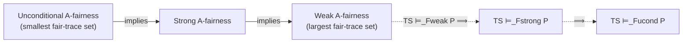
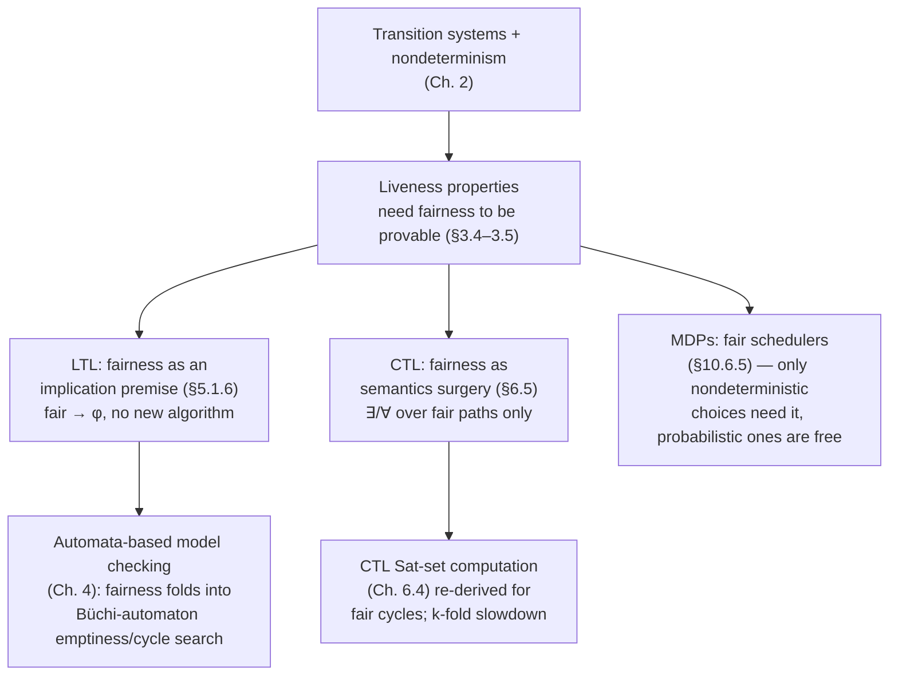

[[book-guidelines|↩ Back to guidelines]]

## Why a transition system needs a notion of "realistic" behavior

A transition system's nondeterminism is a modeling convenience, not a claim about the world. When you write `TrLight1 ||| TrLight2` (interleaving two independent traffic lights) or model a semaphore's queue as "any waiting process may be picked next," you are deliberately *underspecifying* the scheduler. That's the right move — you don't want to hard-code a scheduling policy into your correctness proof. But underspecification has a price: the set of paths a transition system admits now includes paths no real implementation would ever produce.

Concretely: `TrLight1 ||| TrLight2` admits a trace where light 1 blinks forever and light 2 never moves — a legal interleaving, but not a legal traffic intersection (nothing makes one process infinitely faster than another). A semaphore-based mutual exclusion transition system admits a trace where process $P_2$ requests entry and is refused forever while $P_1$ cycles through its critical section indefinitely — again a legal path through the transition relation, but not something an actual semaphore (backed by a wait queue) would do.

This is the central tension the book resolves in Chapter 3, §3.5: **liveness properties ("something good eventually happens," "no starvation") are frequently false of the transition system as literally specified, and true of the transition system as it will actually run.** The gap between the two is exactly the unrealistic paths — the ones where nondeterminism is resolved with an adversarial or degenerate bias. Fairness constraints are the formal device for excluding those paths from consideration, without having to refine the model down to a fully deterministic scheduler (which would over-specify and lose the abstraction's whole point).

*What breaks without this*: without any fairness constraint, essentially every "eventually" liveness property about a nondeterministic system becomes unprovable, not because it's false in any implementation you'd actually build, but because the semantics you're checking against includes implementations you'd never build (an adversary that always says no). You'd be forced to either abandon liveness verification for concurrent systems entirely, or fully determinize the model (destroying the abstraction that made model checking tractable in the first place, per Chapter 2's state-space-explosion discussion).

## Unconditional, strong, and weak fairness constraints

The book fixes ideas with the **action-based** formulation first (state-based fairness for LTL/CTL comes later, and is a forward reference covered below). For a transition system $TS = (S, Act, \rightarrow, I, AP, L)$ without terminal states, define for each state $s$ the set of actions *enabled* there:

$$\mathit{Act}(s) = \{\alpha \in Act \mid \exists s'.\, s \xrightarrow{\alpha} s'\}.$$

Fix a set of actions $A \subseteq Act$ you care about being treated fairly (e.g. $A = \{\mathit{enter}_2\}$, "process 2 gets to enter its critical section"). For an infinite execution fragment $\rho = s_0 \xrightarrow{\alpha_0} s_1 \xrightarrow{\alpha_1} \cdots$, [[Safety-Properties-and-Invariants#The book's definition|the book's Definition]] 3.43 gives three increasingly permissive notions (I'll name every quantifier in words, since the book leans on the shorthand $\exists^\infty$/$\forall^\infty$ without much ceremony):

- **Unconditional $A$-fairness** ("impartiality"): $\exists^\infty j.\ \alpha_j \in A$ — some action of $A$ is taken *infinitely often*, full stop, with no precondition about whether $A$ was even available.
$$\rho \text{ is unconditionally } A\text{-fair} \iff \exists^\infty j.\ \alpha_j \in A.$$

- **Strong $A$-fairness** ("compassion"): if $A$ is enabled *infinitely often* (possibly with gaps), some action of $A$ must actually be taken infinitely often.
$$\rho \text{ is strongly } A\text{-fair} \iff \Big(\exists^\infty j.\ \mathit{Act}(s_j) \cap A \neq \emptyset\Big) \implies \Big(\exists^\infty j.\ \alpha_j \in A\Big).$$

- **Weak $A$-fairness** ("justice"): if $A$ is enabled *continuously* from some point on (no gaps, ever), some action of $A$ must be taken infinitely often.
$$\rho \text{ is weakly } A\text{-fair} \iff \Big(\forall^\infty j.\ \mathit{Act}(s_j) \cap A \neq \emptyset\Big) \implies \Big(\exists^\infty j.\ \alpha_j \in A\Big).$$

Here $\exists^\infty j$ reads "for infinitely many $j$" and $\forall^\infty j$ reads "for all but finitely many $j$" (the book's phrasing: "for nearly all $j$"). The asymmetry between the two premises is the whole content of the definitions: strong fairness only needs $A$ to be *available every so often*; weak fairness needs $A$ to be *available with no interruption* before it obligates anything.

A worked distinction the book draws (Example 3.45, the semaphore mutex): a fragment where $enter_2$ is *never* enabled (because the scheduler happens to never let $P_2$ reach its waiting state) is vacuously strongly $\{enter_2\}$-fair — the premise of strong fairness ("infinitely often enabled") is false, so the implication holds trivially. But a fragment where $enter_2$ is enabled infinitely often yet never taken is **not** strongly fair, while it *can* still be weakly fair if there exist gaps where $enter_2$ is briefly disabled (weak fairness's stronger premise, "continuously enabled," fails to trigger).

*What breaks without the strong/weak distinction*: if you only had unconditional fairness available, you'd have no way to express "the process gets serviced whenever it's genuinely trying," only the much cruder "the process's action happens infinitely often regardless of whether it was ever even possible." Real scheduling fairness (round-robin, priority-with-aging) is a *strong*-fairness-shaped guarantee — it responds to sustained-but-intermittent demand — and weak fairness is exactly the right tool for a different, common shape of demand: "as long as this stays possible without interruption, do it eventually" (e.g. "if a process can always take a purely-local step, it will take one," used for interleaving semantics).

### Grounding: representing and checking fairness

Because a finite-state transition system's fairness question always reduces to properties of an *ultimately periodic* path (a finite prefix followed by an infinitely-repeated cycle — this is exactly the object nested DFS from Chapter 4 hunts for), checking any of the three fairness notions against a concrete lasso is decidable by inspecting just the cycle.

```rust
// A finite representation of an infinite (ultimately periodic) execution:
// prefix ++ cycle^ω. This is the standard "lasso" shape model checkers
// search for (cf. nested DFS, Ch. 4) — and it's exactly enough structure
// to decide any of the three fairness notions without unrolling forever.
struct Lasso<S> {
    prefix: Vec<(S, Action)>,
    cycle: Vec<(S, Action)>, // nonempty; repeats forever
}

type Action = u32;

fn enabled(act_of_state: &dyn Fn(&u32) -> Vec<Action>, s: &u32) -> Vec<Action> {
    act_of_state(s)
}

impl Lasso<u32> {
    /// States/actions that occur infinitely often are exactly those in `cycle`.
    fn occurs_infinitely_often(&self, a: Action) -> bool {
        self.cycle.iter().any(|(_, act)| *act == a)
    }

    fn enabled_infinitely_often(&self, act_of_state: &dyn Fn(&u32) -> Vec<Action>, a: Action) -> bool {
        self.cycle.iter().any(|(s, _)| enabled(act_of_state, s).contains(&a))
    }

    fn enabled_continuously_eventually(&self, act_of_state: &dyn Fn(&u32) -> Vec<Action>, a: Action) -> bool {
        // "eventually forever enabled" collapses, for a lasso, to "enabled at
        // every state of the cycle" — there's no later point to escape to.
        self.cycle.iter().all(|(s, _)| enabled(act_of_state, s).contains(&a))
    }

    fn unconditionally_fair(&self, a: Action) -> bool {
        self.occurs_infinitely_often(a)
    }

    fn strongly_fair(&self, act_of_state: &dyn Fn(&u32) -> Vec<Action>, a: Action) -> bool {
        !self.enabled_infinitely_often(act_of_state, a) || self.occurs_infinitely_often(a)
    }

    fn weakly_fair(&self, act_of_state: &dyn Fn(&u32) -> Vec<Action>, a: Action) -> bool {
        !self.enabled_continuously_eventually(act_of_state, a) || self.occurs_infinitely_often(a)
    }
}
```

The point worth internalizing: **fairness checking on a finite transition system is not a new algorithmic problem** — it's a predicate over the cycle of a lasso, the same object the automata-theoretic machinery of Chapters 4 and 5 is built to find. This is why fairness slots into the LTL/CTL model-checking pipeline later (below) rather than needing its own theory of algorithms.

In Lean, the book's $\exists^\infty$/$\forall^\infty$ quantifiers over an infinite stream of actions are literally the `Filter.atTop`-flavored "frequently"/"eventually" predicates, which is worth naming explicitly since it's the same abstraction Lean's `Mathlib` uses for asymptotic reasoning generally:

```lean
-- α ranges over an infinite trace of actions (a Stream' of the book's αⱼ),
-- P picks out "this action is in A" and Q picks out "A is enabled at step j".
-- ∃ᶠ (frequently) and ∀ᶠ (eventually, "for all but finitely many") over
-- Filter.atTop on ℕ are exactly the book's ∃^∞ j and ∀^∞ j.

def UnconditionallyFair (inA : ℕ → Prop) : Prop :=
  ∃ᶠ j in Filter.atTop, inA j

def StronglyFair (enabledA inA : ℕ → Prop) : Prop :=
  (∃ᶠ j in Filter.atTop, enabledA j) → ∃ᶠ j in Filter.atTop, inA j

def WeaklyFair (enabledA inA : ℕ → Prop) : Prop :=
  (∀ᶠ j in Filter.atTop, enabledA j) → ∃ᶠ j in Filter.atTop, inA j
```

Framing it this way makes the implication hierarchy (next section) a two-line consequence of `Filter.Frequently.mono`/`Filter.Eventually.frequently`, rather than something to re-derive from scratch — which is precisely the payoff the workbench's Lean-[[Concurrency-and-Communication-Modeling#Grounding|grounding]] priority is looking for: the book's informal "for nearly all $j$" is not an ad hoc turn of phrase, it's the standard eventually-filter, and treating it as such buys you the general machinery for free.

A quick Python sketch for the illustrative, non-load-bearing case — just enough to see the shape without Rust's ceremony:

```python
def strongly_fair(cycle_states, cycle_actions, enabled_of, a):
    ever_enabled = any(a in enabled_of(s) for s in cycle_states)
    taken = a in cycle_actions
    return (not ever_enabled) or taken
```

## Fairness assumptions over sets of actions

A single fairness constraint pins down one notion of fairness for one set of actions. Real systems need several constraints simultaneously — e.g. "strong fairness for who gets the critical section" *and* "weak fairness for who gets to request it." The book packages this as a **fairness assumption** (Definition 3.46): a triple

$$\mathcal{F} = (F_{ucond}, F_{strong}, F_{weak}), \qquad F_{ucond}, F_{strong}, F_{weak} \subseteq 2^{Act},$$

each component a *set of action-sets*, one for each fairness flavor. An execution $\rho$ is $\mathcal{F}$-fair if it is unconditionally $A$-fair for every $A \in F_{ucond}$, strongly $A$-fair for every $A \in F_{strong}$, and weakly $A$-fair for every $A \in F_{weak}$.

The choice of *how the action sets are grouped* is not cosmetic — it's the difference between a correct and an incorrect specification. The book's worked contrast (Example 3.47) is worth internalizing exactly because it's a trap a working verification engineer will actually fall into:

- $F_{strong} = \{\{enter_1, enter_2\}\}$ (one merged set) only forces *some* enter-action to happen infinitely often — a scheduler that always lets $P_1$ in and starves $P_2$ satisfies this fairness assumption, because $enter_1 \in \{enter_1, enter_2\}$ fires infinitely often.
- $F_{strong} = \{\{enter_1\}, \{enter_2\}\}$ (two separate singleton sets) forces *each* action individually to fire infinitely often — this is what actually captures "neither process starves."

The grouping *is* the specification. This generalizes directly to the "fair concurrency with synchronization" pattern (Example 3.51) used to justify the book's slogan

$$\text{concurrency} = \text{interleaving (nondeterminism)} + \text{fairness}:$$

$\{Act_1, \ldots, Act_n\}$ (strong fairness, one set per process) only guarantees each process eventually acts, not that any two of them ever *synchronize* — you need the finer-grained assumption $\{\{\alpha\} \mid \alpha \in Syn_{i,j}\}$, one singleton per synchronization action, to force communication itself to recur.

## The fairness implication hierarchy

Every unconditionally $A$-fair execution is strongly $A$-fair, and every strongly $A$-fair execution is weakly $A$-fair — the reverse does not hold in general:

$$\text{unconditional } A\text{-fairness} \implies \text{strong } A\text{-fairness} \implies \text{weak } A\text{-fairness}.$$

This is immediate from the definitions: strong fairness's premise ("infinitely often enabled") is weaker (easier to satisfy) than having no premise at all wouldn't be, and weak fairness's premise ("continuously enabled") is *harder* to satisfy than strong fairness's — a harder premise makes an implication easier to satisfy vacuously, so weak fairness is satisfied by strictly more executions. Set-theoretically, for a fixed $A$:

$$\{\text{unconditionally } A\text{-fair executions}\} \subseteq \{\text{strongly } A\text{-fair executions}\} \subseteq \{\text{weakly } A\text{-fair executions}\}.$$

This ordering on *sets of fair executions* inverts into an ordering on *what you can prove*. Because a fairness assumption's job is to restrict which paths must satisfy a property $P$, a *smaller* fair-trace set is a *stronger* restriction, hence an *easier* target to hit — but a weaker overall guarantee about the system. Concretely, for $\mathcal{F}_{ucond} = (F,\emptyset,\emptyset)$, $\mathcal{F}_{strong} = (\emptyset,F,\emptyset)$, $\mathcal{F}_{weak} = (\emptyset,\emptyset,F)$ built from the same $F$:

$$TS \models_{\mathcal{F}_{weak}} P \implies TS \models_{\mathcal{F}_{strong}} P \implies TS \models_{\mathcal{F}_{ucond}} P.$$

Read this as: **proving $P$ under weak fairness is the hardest and most valuable result** (weak fairness rules out the fewest paths, so $P$ has to survive the largest fair-trace set), while proving $P$ only under unconditional fairness is the cheapest and least informative (you got to throw away the most paths to make it true). This is exactly why the book's rule of thumb (§3.5.2) is: reach for weak fairness first when resolving pure interleaving nondeterminism (independent, uncontended actions), and only escalate to strong fairness when you need to force resolution of genuine *contention* between competing actions.



## Fair satisfaction and realizable fairness assumptions

Fixing a fairness assumption $\mathcal{F}$ changes the satisfaction relation itself. Let $\mathit{FairTraces}_\mathcal{F}(TS)$ be the traces of $\mathcal{F}$-fair paths starting in initial states. Definition 3.48:

$$TS \models_\mathcal{F} P \iff \mathit{FairTraces}_\mathcal{F}(TS) \subseteq P.$$

Unfair paths are simply *not asked to satisfy* $P$ — this is the whole mechanism, and it's why fairness lets you keep an underspecified, nondeterministic model while still proving liveness about it.

But this mechanism has an obvious failure mode: what stops you from choosing an $\mathcal{F}$ so restrictive that *no* path is fair, making $\mathit{FairTraces}_\mathcal{F}(TS) = \emptyset \subseteq P$ trivially, for *every* $P$ including false ones? The book's answer is **realizability** (Definition 3.54): $\mathcal{F}$ is realizable for $TS$ if every reachable state has at least one $\mathcal{F}$-fair path starting from it — equivalently, every finite execution prefix can be *completed* into a fair execution. Example 3.53 shows the failure mode directly: if action $\alpha$ can only ever be taken once (its edge is a one-shot, not revisitable), then the unconditional fairness assumption $\{\{\alpha\}\}$ ("$\alpha$ happens infinitely often") is unrealizable — no path can possibly satisfy it, so $\mathit{FairTraces}_{\{\{\alpha\}\}}(TS) = \emptyset$ and the model would "fairly satisfy" any property whatsoever, vacuously.

*What breaks without checking realizability*: your verification tool would happily report "property proved" under a fairness assumption that's actually an empty promise — a silent unsoundness bug, not a crash, which is the worst kind. This is precisely the class of error a trusted verification pipeline needs to rule out structurally, not just by convention.

The payoff for realizable assumptions is Theorem 3.55: **realizable fairness is irrelevant for safety properties.**

$$TS \models P_{safe} \iff TS \models_\mathcal{F} P_{safe} \quad \text{(for realizable } \mathcal{F}\text{)}.$$

The proof leans on the *suffix-closure* of fairness (a fair execution stays fair along every suffix, and a finite prefix can always be spliced onto a fair continuation reachable from where it ends — precisely what realizability guarantees) combined with safety's defining property: a violation always manifests as a finite bad prefix (Chapter 3, §3.3). If $TS \not\models P_{safe}$, some finite path $\pi$ already carries a bad prefix; realizability lets you extend $\pi$'s endpoint into a fair continuation, producing a genuinely fair trace that inherits the same bad prefix — so $TS \not\models_\mathcal{F} P_{safe}$ either. Example 3.56 shows this collapses immediately once you drop realizability: an unrealizable fairness assumption can make a system "fairly satisfy" `never a` even though `a` genuinely occurs on unfair (but real) paths — fairness silently erasing a genuine safety violation.

This theorem is why the book only ever bothers imposing fairness when proving *liveness* — safety verification (Chapter 3, §3.3; DFS-based invariant checking; the regular-safety automata reduction of Chapter 4) can and should proceed on the raw, unfair transition system, since a realizable fairness assumption can't change the answer.

## Fairness in LTL as an implication premise

Once temporal logic enters the picture (Chapter 5), fairness gets a second, *state-based* formulation, and — this is the book's headline observation about LTL — it requires **no new machinery whatsoever**. An LTL fairness constraint is just an LTL formula built from the always/eventually modalities over propositional (state) formulae $\Phi, \Psi$ (Definition 5.25):

$$
\begin{aligned}
\mathit{ufair} &= \Box\Diamond \Psi & &\text{(unconditional)}\\
\mathit{sfair} &= \Box\Diamond \Phi \rightarrow \Box\Diamond \Psi & &\text{(strong)}\\
\mathit{wfair} &= \Diamond\Box \Phi \rightarrow \Box\Diamond \Psi & &\text{(weak)}
\end{aligned}
$$

$\Box\Diamond\Psi$ reads "$\Psi$ infinitely often" and $\Diamond\Box\Phi$ reads "$\Phi$ eventually forever" — exactly the LTL renderings of the $\exists^\infty$/$\forall^\infty$ quantifiers from §3.5's action-based definitions, now over states rather than actions. A full fairness assumption is just their conjunction, $\mathit{fair} = \mathit{ufair} \land \mathit{sfair} \land \mathit{wfair}$ (each itself possibly a conjunction over several constraints), and the fair satisfaction relation (Definition 5.26) is

$$TS \models_\mathit{fair} \varphi \iff \forall \pi \in \mathit{FairPaths}(TS).\ \pi \models \varphi.$$

The mechanically important fact — flagged in a footnote the book is careful to add, since it looks almost too easy — is that this reduces to *ordinary* LTL model checking, no fair-path machinery required at the automaton level:

$$TS \models_\mathit{fair} \varphi \iff TS \models (\mathit{fair} \rightarrow \varphi).$$

You build the Büchi automaton for $\neg(\mathit{fair} \rightarrow \varphi) = \mathit{fair} \land \neg\varphi$ exactly as in Chapter 4's automata-based pipeline, run it against the product $TS \otimes A$, and search for an accepting cycle as always — fairness has been absorbed entirely into the formula. (The book notes that a *dedicated* fair-LTL algorithm is more efficient in practice than literally constructing $\mathit{fair} \rightarrow \varphi$, but that's an implementation optimization, not a change of semantics.) The mutual-exclusion-with-randomized-arbiter example (5.27) is the canonical illustration: `crit1 is entered infinitely often` is unprovable outright ($TS \not\models \Diamond\Box\,\neg crit_1$'s negation, i.e. the raw system admits "coin always lands tails"), but becomes provable once you impose $\mathit{fair} = \Box\Diamond\mathit{heads} \land \Box\Diamond\mathit{tails}$ as an implication premise.

## Fairness in CTL via quantification over fair paths

CTL cannot repeat the LTL trick, and the book is explicit about *why*: CTL's path formulae only allow $\bigcirc\Phi$ and $\Phi\,U\,\Psi$ immediately under a path quantifier — the Boolean connectives $\rightarrow$ and $\land$ needed to write "$\mathit{fair} \rightarrow \varphi$" or "$\mathit{fair} \land \varphi$" as a single path formula are **not legal at that syntactic level** (§6.5). You cannot smuggle fairness in as a formula premise; there is no formula to smuggle it into.

The book's fix operates on the *semantics* instead: redefine $\exists\varphi$ and $\forall\varphi$ to quantify over **fair paths only**, rather than all paths. A CTL fairness assumption (Definition 6.32) looks structurally like its LTL cousin but is built from CTL *state* formulae instead of atomic propositions:

$$\mathit{sfair} = \bigwedge_{1 \le i \le k} \big(\Box\Diamond \Phi_i \rightarrow \Box\Diamond \Psi_i\big),$$

with weak/unconditional analogues, and $\Phi_i, \Psi_i$ full CTL state formulae. This is *not itself a legal CTL formula* — the book is careful to call it "an LTL formula using CTL state formulae as atomic propositions," a genuine change of logic, evaluated by the LTL semantics against the *sequence of truth values* $\Phi_i$ takes along a path. The satisfaction relation is then re-derived clause by clause with fair paths substituted in (Definition 6.33):

$$
\begin{aligned}
s \models_\mathit{fair} \exists\varphi &\iff \pi \models_\mathit{fair} \varphi \text{ for some } \pi \in \mathit{FairPaths}(s)\\
s \models_\mathit{fair} \forall\varphi &\iff \pi \models_\mathit{fair} \varphi \text{ for all } \pi \in \mathit{FairPaths}(s)
\end{aligned}
$$

— every other clause ($a$, $\neg$, $\land$) is unchanged, because fairness only ever bites at the point where a path quantifier resolves nondeterminism. Algorithmically this has a real cost the book flags directly: the recursive $\mathit{Sat}$-set computation from §6.4 has to be re-derived for the fair case (fair $\exists\Box$, fair $\exists U$ become computations over *fair* cycles, not arbitrary reachability/cycles), and model checking under $k$ fairness constraints picks up a multiplicative blow-up proportional to $k$ — fairness is no longer "free," the way the $\mathit{fair} \to \varphi$ trick made it look for LTL.

This is one of the sharpest illustrations in the whole book of *why* linear-time and branching-time logics are not just two notations for the same thing (Chapter 6's broader theme): the same semantic idea (fairness) requires a formula-level trick in one logic and a semantics-level surgery in the other, purely because of what each logic's [[Timed-CTL-and-TCTL-Model-Checking#Syntax|syntax]] permits you to say at the path-formula level.

## Fair schedulers and fairness in Markov decision processes

The final forward reference (Chapter 10, §10.6.5) replaces "nondeterminism resolved unrealistically" with its probabilistic analogue: an MDP's nondeterministic choices are resolved by a **scheduler**, and an unfair scheduler can behave exactly as pathologically as an unfair transition-system path — e.g. in a randomized mutual-exclusion protocol, a scheduler that only ever offers the arbiter's coin-toss action to process 2 and never to process 1, making $P_1$'s critical-section entry probability zero even though the coin itself is fair.

The book's key observation here is asymmetric with the transition-system case: **probabilistic choices are already almost-surely strongly fair for free** (Theorem 10.25 territory) — if a state with a probabilistic branch is visited infinitely often, almost every path takes *every* one of its successors infinitely often, simply because each has positive probability at each visit. Fairness assumptions in MDPs are therefore needed *only* for the residual, genuinely nondeterministic choices (e.g. which process's turn it is), not for the probabilistic ones.

A scheduler is fair (Definition 10.130) if it *almost surely* generates fair paths — "almost surely," not "always," is the crucial relaxation a probabilistic setting forces on the definition:

$$\text{scheduler } \mathfrak{S} \text{ is fair w.r.t. } \mathit{fair} \iff \forall s.\ \Pr\nolimits^{\mathfrak{S}}_s\{\pi \in \mathit{Paths}(s) \mid \pi \models \mathit{fair}\} = 1.$$

The book proves a genuinely useful simplification (Lemma 10.131): **realizable fairness is irrelevant for *maximal* reachability probabilities** — $\sup$ over fair schedulers of $\Pr(s \models C\,U\,B)$ equals $\Pr_{\max}(s \models C\,U\,B)$ taken over *all* schedulers, because an optimal unfair scheduler can always be "patched" into a fair one that behaves identically until it would otherwise become permanently unfair, then switches to mimicking some background fair scheduler without ever touching the states that mattered for reachability. This is the probabilistic sibling of Theorem 3.55: just as realizable fairness doesn't change what's provable for safety, it doesn't change the *best-case* probability of reaching a target. It *does*, however, change **minimal** reachability probabilities — an adversarial minimizing scheduler is exactly the kind of "always refuse the useful action" strategy fairness is designed to rule out, so restricting to fair schedulers can genuinely raise the achievable minimum.

## Where this leads

Fairness is a piece of connective tissue, not a self-contained topic — its whole job in the book's architecture is to make later liveness verification *sound relative to what a real system does*, without paying for that soundness by over-specifying the model:



Within the workbench's static-analysis focus area, the load-bearing idea to carry forward is the **realizability check itself**: "does every reachable state admit at least one continuation satisfying constraint $C$?" is a reachability-analysis question in exactly the sense Chapter 4's invariant/persistence checking already trains you to ask, and it is the same shape of soundness gate a verification pipeline needs whenever it restricts the executions/schedules it will consider — an abstract interpreter that prunes "unrealistic" program behaviors (e.g. assuming a scheduler is round-robin, or that a loop's guard is eventually falsified) is implicitly imposing a fairness-shaped assumption, and Theorem 3.55 is the template for the question you must always ask before trusting the pruning: *is the assumption realizable, or did you just prove your property vacuously?* The strong/weak/unconditional trichotomy itself is less directly load-bearing for the compiler/elaborator project described in this workbench's learning goals, but the CTL-vs-LTL asymmetry in §6.5 — the same semantic content requiring a *syntactic* trick in one logic and a *semantic* redefinition in another — is a recurring lesson about how expressiveness constraints in a logic's grammar propagate into its model-checking algorithm's structure, which resurfaces directly once this vault reaches Chapters 5–6 ([[Linear-Temporal-Logic|Linear Temporal Logic]]; [[Computation-Tree-Logic|Computation Tree Logic]]) on their own terms.
