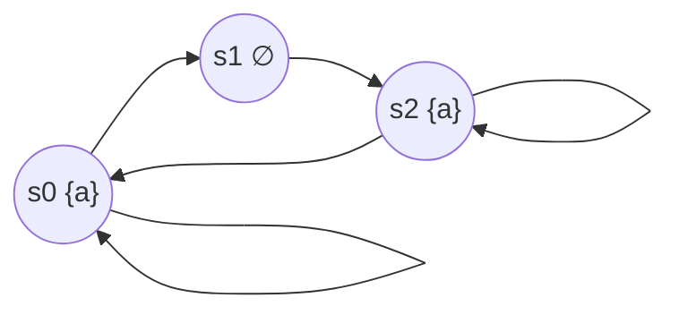

[[book-guidelines|↩ Back to guidelines]]

## Why bother comparing two logics that seem to do the same job?

By the time you reach this section, the book has spent two full chapters building two independent ways of writing temporal specifications. Chapter 5 gave you LTL: a formula like $\Diamond\Box a$ describes a *single infinite trace* — "eventually, this trace settles into always-$a$." Chapter 6 gave you CTL: a formula like $\forall\Box\exists\Diamond a$ describes a *branching computation tree* — "no matter which path you're on, you can always still steer back toward an $a$-state." Both look like reasonable languages for saying "eventually" and "always." A natural question follows immediately: are they secretly the same language in different clothing, just with LTL's implicit "for all paths" made explicit as $\forall$ in CTL?

This isn't idle curiosity. The two logics have wildly different model-checking behavior: LTL model checking is PSPACE-complete (Chapter 5), while [[CTL-Model-Checking|CTL model checking]] is polynomial-time (Chapter 6.4). If you could always mechanically translate one into the other, you'd never need the expensive LTL algorithm — just translate to CTL and run the cheap one. The fact that the book needs an entire section to settle this (and that the answer is "no, and here's exactly where and why") is what justifies CTL and LTL as two genuinely different tools rather than notational variants, and it's the reason later chapters bother introducing CTL* (6.8) as a logic that swallows both.

## What "equivalent" even means across two different logics

Before any symbol-pushing, you need a precise notion of "these two formulas say the same thing," because $\Phi$ (CTL) and $\varphi$ (LTL) don't even have the same kind of semantics — CTL formulas are evaluated at *states*, LTL formulas at *paths* (lifted to $\mathrm{TS} \models \varphi$ iff *every* path's trace lies in $\mathit{Words}(\varphi)$). [[Safety-Properties-and-Invariants#The book's definition|The book's Definition]] 6.17 sidesteps this by comparing them at the only level where both make a claim about a whole transition system:

$$
\Phi \equiv \varphi \quad \text{iff for every transition system } \mathrm{TS} \text{ over } AP:\quad \mathrm{TS}\models\Phi \iff \mathrm{TS}\models\varphi.
$$

This is a strong requirement — not "these two formulas agree on the transition systems we care about," but "these two formulas agree on *every* transition system, forever." That universality is exactly what will let the book prove *non*-equivalence by exhibiting a single transition system where the two formulas disagree.

## The tempting shortcut: just delete the quantifiers

Since $\forall$ and $\exists$ in CTL are the *explicit* form of what LTL treats implicitly (an LTL formula is checked against *all* paths by definition), the obvious guess is: take a CTL formula, strip every $\forall$ and $\exists$, and the LTL formula behind is what remains. $\forall\Diamond a$ becomes $\Diamond a$; that one clearly works, since "on every path, eventually $a$" is exactly what $\mathrm{TS}\models\Diamond a$ already means.

What's surprising is how strong a statement can be made about this shortcut. It isn't just "a good heuristic" — the book proves it's a dichotomy with no third option.

### Theorem 6.18 — the criterion

> Let $\Phi$ be a CTL formula, and $\varphi$ the LTL formula obtained by deleting every path quantifier ($\exists$, $\forall$) from $\Phi$. Then either $\Phi \equiv \varphi$, **or there is no LTL formula equivalent to $\Phi$ at all.**

Read that quantifier-dropping map as a single deterministic function
$$
\mathrm{drop} : \text{CTL formulae} \to \text{LTL formulae},
$$
and [[Liveness-Properties-and-the-Safety-Liveness-Decomposition#The theorem|the theorem]] says: $\mathrm{drop}(\Phi)$ is either *the* answer, or there is no answer. You never have to search the infinite space of LTL formulas hoping to stumble on some other equivalent — one candidate settles the question. That collapses "does a CTL formula have an LTL equivalent?" from an open-ended search problem into "does this one specific candidate check out?" This is the load-bearing fact that lets the rest of the section proceed by worked example instead of by exhaustive search.

### Where dropping quantifiers succeeds

The book confirms the criterion on a batch of familiar formulas — in each case $\mathrm{drop}(\Phi)$ is genuinely equivalent to $\Phi$:

- $a \equiv a$ (an atomic proposition needs no path quantifier to begin with),
- $\forall\Box a \equiv \Box a$,
- $\forall(a\,U\,b) \equiv (a\,U\,b)$,
- $\forall\Diamond a \equiv \Diamond a$,
- $\forall\bigcirc a \equiv \bigcirc a$,
- $\forall\Box\forall\Diamond a \equiv \Box\Diamond a$.

The last one is worth pausing on, since it's not obviously true just from [[Timed-CTL-and-TCTL-Model-Checking#Syntax|syntax]]. $\forall\Box\forall\Diamond a$ says: on every path, at every point reached, *every* continuation from there eventually sees $a$. Unwind that far enough and it collapses to "$a$ recurs infinitely often on every path" — the book proves this directly as Remark 6.8: $s \models \forall\Box\forall\Diamond a$ iff every path through $s$ visits an $a$-state infinitely often, which is precisely $\Box\Diamond a$'s LTL reading. The equivalence isn't a coincidence of notation; it's a genuine semantic fact that happens to survive quantifier-dropping.

### What breaks: dropping quantifiers is not always safe to *want*

The theorem doesn't say the drop always succeeds — only that *if* something works, it's the drop. Two of the book's counterexamples show the drop failing outright, which means (by the theorem) that **no** LTL equivalent exists for these CTL formulas at all.

**Lemma 6.19 — persistence.** Consider $\forall\Diamond\forall\Box a$ versus its quantifier-dropped candidate $\Diamond\Box a$. Take the three-state transition system



($s_0$ and $s_2$ both self-loop, and there's a detour $s_0 \to s_1 \to s_2$ available too.) The self-looping path $s_0^\omega$ has trace $\{a\}\{a\}\{a\}\ldots$, so $s_0 \models \Diamond\Box a$ — trivially, since it's *already* forever-$a$. But $\forall\Diamond\forall\Box a$ demands something stronger: it needs every path to eventually land on a state from which *every* possible future — not just the one you happened to be walking — stays in $a$ forever. No state here has that property, because from $s_0$ or $s_2$ you can *always* still choose to detour through the $\neg a$-state $s_1$. The path $s_0^* s_1 s_2^\omega$ witnesses this: it never reaches a state that has permanently foreclosed the option of visiting $s_1$. Since no state satisfies $\forall\Box a$, no path (including the trivial self-loop) satisfies $\Diamond\forall\Box a$, so $s_0 \not\models \forall\Diamond\forall\Box a$ even though $s_0\models\Diamond\Box a$. That's a direct semantic split between the CTL formula and its LTL candidate, so by Theorem 6.18, $\forall\Diamond\forall\Box a$ has **no** LTL equivalent whatsoever.

The moral: LTL's $\Diamond\Box a$ is a claim about *the one trace actually taken*. CTL's $\forall\Diamond\forall\Box a$ is a claim about *the options that remain available at every step* — it wants a point of no return, not just a lucky path. Branching-time quantification is sensitive to nondeterminism that never shows up in any single trace, which is exactly the kind of thing a linear-time logic structurally cannot see.

**Lemma 6.20 — eventually an $a$-state with only direct $a$-successors.** The same phenomenon recurs for $\forall\Diamond(a \land \forall\bigcirc a)$ versus $\Diamond(a \land \bigcirc a)$, using a transition system where $s_0$ branches to either $s_1$ (leading into a self-looping non-$a$ state $s_2$) or to $s_3 \to s_4$ (both $a$-labeled). Every actual path either goes the $s_0 s_1 (s_2)^\omega$ route or the $s_0 s_3 s_4$ route; the latter satisfies $\Diamond(a\land\bigcirc a)$, so the LTL formula holds along *a* path but — crucially, since LTL is a universal-path statement by default too — $\mathrm{TS}\models\Diamond(a\land\bigcirc a)$ genuinely holds here. Yet $\mathrm{TS}\not\models\forall\Diamond(a\land\forall\bigcirc a)$, because the path through $s_1$ never reaches a state whose *every* successor is an $a$-state (since $s_0$'s successors already include the non-$a$ state $s_1$, and no rescue is available for that branch). Same lesson: the CTL formula is making a claim robust to *all* nondeterministic choices, the LTL formula only about the trace that happens to unfold.

**Theorem 6.21(b), third example: $\forall\Box\exists\Diamond a$.** This one (a reachability-preservation property — "from every reachable state, an $a$-state is still reachable") is proved inequivalent to *any* LTL formula by direct contradiction rather than by inspecting $\mathrm{drop}$: assume some LTL $\varphi$ is equivalent to $\forall\Box\exists\Diamond a$, exhibit a transition system $\mathrm{TS}$ satisfying the CTL formula whose single reachable trace is $\emptyset^\omega$, then exhibit a *sub*-transition-system $\mathrm{TS}'$ (literally a subgraph of $\mathrm{TS}$, sharing that exact same trace $\emptyset^\omega$) that does **not** satisfy the CTL formula because it has severed the path back to $a$. Since $\varphi$ only ever sees traces, and both systems produce the identical trace, $\varphi$ cannot distinguish them — yet the CTL formula does. This is the sharpest illustration of the underlying reason CTL can express things LTL cannot: **LTL formulas are functions of the trace set alone; CTL formulas are sensitive to the branching structure that produced the trace**, even when two different branching structures happen to emit the same linear behavior.

### The mirror image: properties only LTL can express

Theorem 6.21(a) shows the reverse also fails — $\Diamond\Box a$ (and $\Diamond(a\land\bigcirc a)$) have *no* CTL equivalent either. The proof technique here is different in character and worth understanding on its own terms, because it's a general recipe for proving inexpressibility: **exhibit two infinite families of transition systems that agree on every CTL formula up to a given size, but disagree on the LTL property.**

Concretely, the book builds two inductively-defined families $\mathrm{TS}_n$ and $\mathrm{TS}_n'$ (Figures 6.7–6.9): both alternate between an $a$-state $t_i$ and a non-$a$-state $s_i$, chained together, but $\mathrm{TS}_n$ additionally has an edge $t_n \to s_n$ (letting a path return to the top and loop the whole chain again), while $\mathrm{TS}_n'$ lacks that edge. This difference is exactly what LTL's $\Diamond\Box a$ can detect: $\mathrm{TS}_n$ has a path that revisits a non-$a$-state ($s_n$) infinitely often, so $\mathrm{TS}_n \not\models \Diamond\Box a$; every path of $\mathrm{TS}_n'$ eventually runs out of "return" edges and is forced to settle into an $a$-only tail, so $\mathrm{TS}_n' \models \Diamond\Box a$.

But — and this is the crux of the argument — no CTL formula of length $\le n$ can tell $\mathrm{TS}_n$ and $\mathrm{TS}_n'$ apart. Intuitively, a bounded-length CTL formula can only "look" a bounded number of modal steps deep into the computation tree, and up to depth $n$ the two families are structurally identical (the extra back-edge in $\mathrm{TS}_n$ only becomes reachable/relevant after the $n$-th step). So if some CTL formula $\Phi$ of length $n$ were equivalent to $\Diamond\Box a$, it would have to agree with $\Diamond\Box a$ on both $\mathrm{TS}_n$ and $\mathrm{TS}_n'$ — but $\Diamond\Box a$ itself disagrees on them. Contradiction; no such $\Phi$ exists at any length. This "formulas of bounded size can't see arbitrarily deep loop structure" argument is essentially a hand-rolled Ehrenfeucht–Fraïssé-style indistinguishability proof, specialized to CTL's syntax.

## Grounding the distinction in code

The cleanest way to feel *why* these two logics diverge is to notice that their model-checking algorithms process completely different data shapes — and that difference is a direct computational shadow of the semantic gap just proven.

**Rust — CTL's fixed-point is graph reachability, and it doesn't care about individual traces.** Computing $\mathit{Sat}(\exists\Diamond a)$ (the "can eventually reach $a$" satisfaction set — the beating heart behind $\forall\Box\exists\Diamond a$'s inner $\exists\Diamond$) is exactly backward reachability on the state graph, the same shape of computation as a dataflow/reachability analysis in a compiler:

```rust
use std::collections::{HashSet, VecDeque};

/// Sat(∃◇a): backward BFS from every a-labeled state, ignoring which
/// specific path led anywhere — CTL only asks "is there a way back?"
fn sat_exists_eventually(
    states: &HashSet<u32>,
    predecessors: &dyn Fn(u32) -> Vec<u32>,
    labeled_a: &HashSet<u32>,
) -> HashSet<u32> {
    let mut sat: HashSet<u32> = labeled_a.clone();
    let mut frontier: VecDeque<u32> = labeled_a.iter().copied().collect();

    while let Some(s) = frontier.pop_front() {
        for pred in predecessors(s) {
            if sat.insert(pred) {
                frontier.push_back(pred);
            }
        }
    }
    sat // states in `sat` are exactly Sat(∃◇a)
}
```

Notice what this function never does: it never enumerates a single infinite path. It computes a *set of states*, closed under "some successor is already good" — that's the fixed-point definition of $\exists\Diamond$ from Section 6.4, and it's the same algorithmic pattern as an abstract-interpretation reachability pass computing which program points can reach an error state. This is precisely why $\forall\Box\exists\Diamond a$ is cheap (linear-time graph algorithm) while checking $\Diamond\Box a$ against the same system by an LTL-shaped procedure means reasoning about *runs*, not just sets of states.

Contrast that with an LTL-style runtime monitor for $\Diamond\Box a$, which genuinely does walk one path and asks "does this trace eventually stop seeing $\neg a$ forever":

```rust
/// A monitor for ◇□a over one concrete (finite, looping-back) execution.
/// Unlike Sat(∃◇a), this only ever looks at the single sequence of states
/// actually visited — it has no notion of "what else was reachable."
fn eventually_forever_a(trace: &[bool], loop_start: usize) -> bool {
    // trace[i] = whether `a` held at step i; the suffix from loop_start
    // repeats forever (this is how a finite lasso represents an ω-word).
    trace[loop_start..].iter().all(|&a| a)
}
```

The Rust contrast mirrors the proof exactly: `sat_exists_eventually` is blind to *which* path realizes reachability (a set-based, branching-sensitive computation); `eventually_forever_a` is blind to *what else was reachable* (a trace-based, branching-blind computation). Lemma 6.19's counterexample is precisely a system where these two blindnesses disagree.

**Lean — encoding the criterion itself.** Because Theorem 6.18 is literally a total function plus a correctness dichotomy, it's natural to state it as a Lean signature over an inductive CTL/LTL syntax:

```lean
inductive CTLFormula where
  | atom (a : String)
  | and (φ ψ : CTLFormula)
  | not (φ : CTLFormula)
  | existsNext (φ : CTLFormula)
  | forallNext (φ : CTLFormula)
  | existsUntil (φ ψ : CTLFormula)
  | forallUntil (φ ψ : CTLFormula)

-- The quantifier-dropping map: strip ∃/∀, leaving bare LTL-shaped syntax.
def dropQuantifiers : CTLFormula → LTLFormula
  | .atom a          => .atom a
  | .and φ ψ         => .and (dropQuantifiers φ) (dropQuantifiers ψ)
  | .not φ           => .not (dropQuantifiers φ)
  | .existsNext φ    => .next (dropQuantifiers φ)
  | .forallNext φ    => .next (dropQuantifiers φ)
  | .existsUntil φ ψ => .until (dropQuantifiers φ) (dropQuantifiers ψ)
  | .forallUntil φ ψ => .until (dropQuantifiers φ) (dropQuantifiers ψ)

-- Theorem 6.18, as a specification (not proved here — the book's proof
-- is semantic, over all transition systems, and omitted from the text too):
theorem drop_criterion (φ : CTLFormula) :
    Equivalent φ (dropQuantifiers φ) ∨
    ¬ ∃ ψ : LTLFormula, Equivalent φ ψ := by
  sorry
```

Stating it this way makes the dichotomy structurally visible: `dropQuantifiers` is total and syntax-directed (it *always* produces a candidate), and the theorem is a disjunction with no third case — you never need an existence proof that searches over `LTLFormula`, because the candidate is already in hand. This is the same shape of argument as showing a normalization function is "complete for equivalence-checking": one candidate, or nothing works.

**Python — a quick sanity check of the indistinguishability families.** A short simulation makes Theorem 6.21(a)'s $\mathrm{TS}_n$ vs. $\mathrm{TS}_n'$ construction concrete without committing to a full CTL evaluator:

```python
def build_chain(n, with_return_edge):
    """s_i (non-a) -> t_i (a) -> s_{i-1} chain; TS_n has an extra t_n -> s_n
    self-loop-ish return edge, TS_n' does not."""
    edges = {}
    for i in range(n, 0, -1):
        edges[f"s{i}"] = [f"t{i}"]
        edges[f"t{i}"] = [f"t{i}", f"s{i-1}"]
    edges["s0"] = ["t0"]
    edges["t0"] = ["t0"]
    if with_return_edge:
        edges[f"t{n}"].append(f"s{n}")  # the one structural difference
    return edges

# TS_n |= ◇□a fails (can revisit the non-a state s_n via the return edge);
# TS_n' |= ◇□a holds (every path is eventually forced into the all-a tail).
```

Running a trace generator over `build_chain(n, True)` versus `build_chain(n, False)` for increasing `n` is a fast way to *see* that the divergence is always "one edge, arbitrarily deep," which is exactly why no fixed-length CTL formula can be the discriminator — a CTL formula is a fixed finite object, but the depth at which the two families diverge grows without bound.

## Where this leads

This section is the hinge between two halves of the book's temporal-logic story. Everything before it (LTL in Chapter 5, CTL syntax/semantics/equivalence laws in 6.1–6.2) built the two logics in isolation; everything after it depends on treating them as *genuinely different tools*, not interchangeable notations:

- **CTL model checking (6.4)** exploits exactly the computational shape shown above — satisfaction sets as least/greatest fixed points over the state graph — to get a PTIME algorithm, in direct contrast to LTL's automata-based, PSPACE-complete procedure (5.2). The expressiveness gap explains *why* the complexity gap is not a missed optimization opportunity but a structural fact: you cannot smuggle LTL's trace-sensitivity into a purely fixed-point/graph algorithm, and you cannot smuggle CTL's branching-sensitivity into a purely automata-on-words algorithm.
- **[[Fairness|Fairness]] (6.5)** is awkward in CTL specifically because of the incomparability shown here: a fairness constraint is naturally an implication over infinite behavior (an LTL-shaped idea), and CTL's syntax rules out Boolean connectives at the path-formula level, forcing fairness to be built into the *semantics* (quantifying only over fair paths) rather than written as a formula — a direct consequence of the same branching/linear divide.
- **CTL\* (6.8)** exists precisely to dissolve this dichotomy: by allowing arbitrary nesting of path quantifiers with linear operators, it embeds both LTL (via $\varphi \mapsto \forall\varphi$) and CTL, and is strictly more expressive than both combined. This section's incomparability theorem is what makes CTL* a genuine unification rather than a cosmetic superset.

For the **Static Analysis & Abstract Interpretation** focus area, the mechanism here is directly load-bearing: the `Sat(∃◇a)`-style fixed-point computation shown above *is* the same reachability-analysis and invariant-generation machinery used in dataflow analysis and Horn-clause-based verification — a static analyzer answering "can this program point still reach a bad state under any scheduling?" is asking a CTL-shaped, branching question, not an LTL-shaped trace question. Conversely, a *specific-execution* runtime monitor or a property-based test oracle checking one observed run is inherently LTL-shaped. Recognizing which shape a given verification question has — "property of the branching structure" versus "property of one trace" — is the transferable skill this section is really teaching, underneath the specific CTL/LTL formulas.
