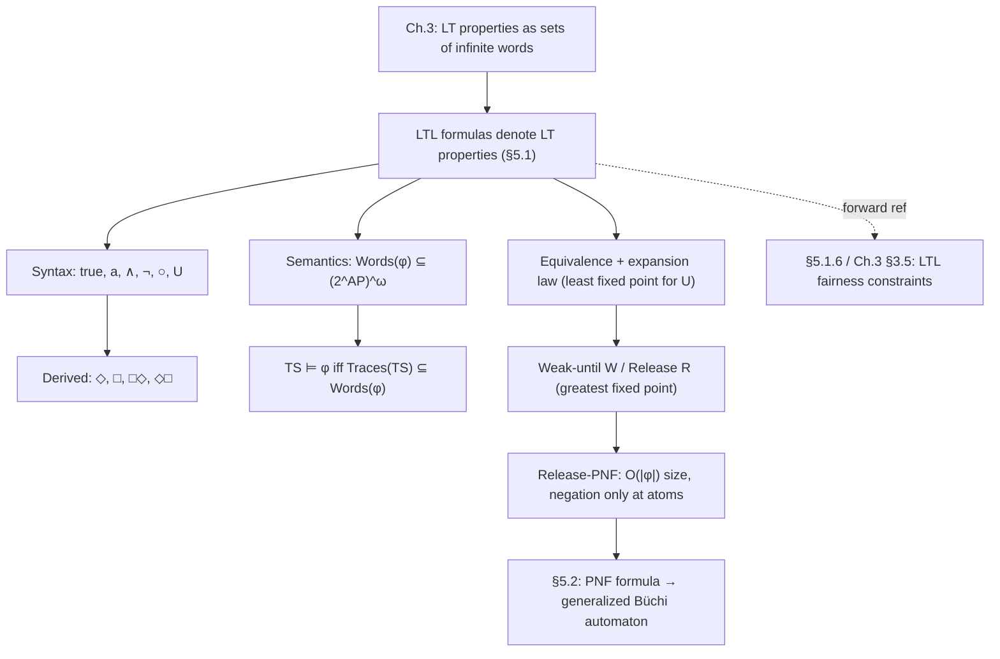

[[book-guidelines|↩ Back to guidelines]]

## Why a logic of infinite words, and why here

Chapter 3 of the book already gave you a way to *state* linear-time properties: an LT property is just a set of infinite words over $2^{AP}$, and a transition system satisfies it if every trace it can produce lands inside that set. That's mathematically clean, but useless as a specification language — nobody wants to hand a model checker a literal (infinite, usually uncountable) set of words. You need a finite, compositional *notation* for carving out LT properties, one where "the critical section is never entered by both processes" or "every request is eventually answered" can be written down directly, the way a regular expression lets you write down a language instead of enumerating it.

That's what Linear Temporal Logic (LTL) is: a specification formalism whose formulas each *denote* one LT property. It sits linearly-time (each moment has one successor moment, no branching) rather than branching-time — that's the axis Chapter 6's CTL will occupy instead, and Table 5.1 in the book fixes this distinction as the organizing question for Chapters 5–6: linear vs. branching, plus (starting in Chapter 9) real-time. The reason LTL comes before CTL in the book's development, despite CTL often being computationally cheaper to model-check, is that LTL's semantics (a language of words) is the direct continuation of the LT-property machinery from Chapter 3 — you're building the notation for something you've already defined, not defining something new from scratch.

One more framing point the book is careful about: "temporal" here does *not* mean real-time. LTL's modalities are **time-abstract** — they talk about order ("eventually," "until," "next"), not duration. You cannot say "the car stops within 3 microseconds of braking" in plain LTL; you can only say "eventually the car stops." (Section 5.1.3 shows how synchronous systems recover a discrete real-time reading of $\bigcirc$, and Remark 5.15 pushes this further — more below.) Keep this distinction sharp: it's exactly what separates LTL from the Timed CTL of Chapter 9.

## Syntax: two temporal primitives, everything else derived

[[Safety-Properties-and-Invariants#The book's definition|The book's Definition]] 5.1 gives LTL exactly two temporal operators beyond propositional logic:

$$\varphi ::= \mathbf{true} \mid a \mid \varphi_1 \land \varphi_2 \mid \neg\varphi \mid \bigcirc\varphi \mid \varphi_1\, U\, \varphi_2 \qquad (a \in AP)$$

- $\bigcirc\varphi$ ("next"): a unary prefix operator. $\bigcirc\varphi$ holds *now* if $\varphi$ holds at the *immediate successor* moment.
- $\varphi_1\, U\, \varphi_2$ ("until"): a binary infix operator. $\varphi_1\, U\, \varphi_2$ holds now if $\varphi_2$ becomes true at some future moment, and $\varphi_1$ holds at every moment strictly before that.

Everything else — disjunction, implication, biconditional, XOR — is the usual propositional-logic derivation from $\land$ and $\neg$ ($\varphi_1 \lor \varphi_2 \stackrel{\text{def}}{=} \neg(\neg\varphi_1 \land \neg\varphi_2)$, etc.). Precedence: unary operators ($\neg$, $\bigcirc$) bind tightest and equally strongly; $U$ binds tighter than $\land, \lor, \to$; $U$ is right-associative, so $\varphi_1\, U\, \varphi_2\, U\, \varphi_3$ means $\varphi_1\, U\, (\varphi_2\, U\, \varphi_3)$.

**What breaks without `until`.** With only $\bigcirc$ and propositional connectives you can say "exactly two steps from now, $p$ holds" ($\bigcirc\bigcirc p$), but you cannot say "eventually $p$ holds" for an *unbounded* future — that would require an infinite disjunction $p \lor \bigcirc p \lor \bigcirc\bigcirc p \lor \cdots$, which isn't a formula. `until` is the operator that gets you unbounded reachability-in-time as a single finite syntactic object, and it's the mechanism that makes both `eventually` and `always` derivable rather than primitive.

**[[Concurrency-and-Communication-Modeling#Grounding|Grounding]] — the AST.** This grammar is a completely ordinary recursive enum, exactly the kind of thing you'd build a small-step evaluator for:

```rust
#[derive(Clone, Debug, PartialEq, Eq)]
enum Ltl {
    True,
    Atom(String),                    // a ∈ AP
    Not(Box<Ltl>),
    And(Box<Ltl>, Box<Ltl>),
    Next(Box<Ltl>),                  // ○ φ
    Until(Box<Ltl>, Box<Ltl>),       // φ1 U φ2
}
```

In Lean, the same grammar as an inductive family, which is the natural home for the equivalence proofs later in this article (they become `theorem`s about this type rather than informal word-manipulations):

```lean
inductive Ltl (AP : Type) where
  | tt : Ltl AP
  | atom : AP → Ltl AP
  | not : Ltl AP → Ltl AP
  | and : Ltl AP → Ltl AP → Ltl AP
  | next : Ltl AP → Ltl AP
  | until : Ltl AP → Ltl AP → Ltl AP
```

### Derived modalities: eventually and always

$$\Diamond\varphi \stackrel{\text{def}}{=} \mathbf{true}\, U\, \varphi \qquad\qquad \Box\varphi \stackrel{\text{def}}{=} \neg\Diamond\neg\varphi$$

$\Diamond\varphi$ ("eventually") drops out of `until` for free: "true holds until $\varphi$" just means "$\varphi$ happens at some point, no constraint beforehand." $\Box\varphi$ ("always") is $\Diamond$'s de Morgan dual: "it is not the case that $\neg\varphi$ eventually holds" is exactly "$\varphi$ holds from now on forever."

Composing the two gives the pair of modalities that do essentially all of the interesting work in liveness specifications:

$$\Box\Diamond\varphi \;\;\text{“infinitely often }\varphi\text{”} \qquad\qquad \Diamond\Box\varphi \;\;\text{“eventually forever }\varphi\text{”}$$

$\Box\Diamond\varphi$ says: at *every* point $j$ in the run, there's *some* later point $i \geq j$ where $\varphi$ holds — you can never "outrun" $\varphi$, so it recurs forever. $\Diamond\Box\varphi$ is strictly stronger in shape (though logically incomparable in general — they quantify differently): from *some* point on, $\varphi$ holds at *every* subsequent point. These correspond exactly to $\exists^\infty j$ ("for infinitely many $j$") and $\forall^\infty j$ ("for almost all $j$, i.e. cofinitely many") — a distinction worth internalizing now because Chapter 5's later material on LTL fairness constraints (weak vs. strong fairness — see [[Fairness|Fairness]]) is built entirely out of these two shapes applied to different propositions.

## Semantics: LTL formulas as languages of infinite words

This is the payoff of the Chapter 3 framing: LTL's semantics is defined *first* as a language over infinite words, only afterward lifted to transition systems.

**Definition 5.6 (semantics over words).** For an LTL formula $\varphi$ over $AP$,

$$\mathit{Words}(\varphi) = \{\sigma \in (2^{AP})^\omega \mid \sigma \models \varphi\}$$

where $\models\, \subseteq (2^{AP})^\omega \times \mathrm{LTL}$ is the smallest relation satisfying (writing $\sigma = A_0A_1A_2\cdots$ and $\sigma[j\ldots] = A_jA_{j+1}A_{j+2}\cdots$ for the suffix starting at position $j$):

$$
\begin{aligned}
\sigma &\models \mathbf{true} \\
\sigma &\models a && \text{iff } a \in A_0 \\
\sigma &\models \varphi_1 \land \varphi_2 && \text{iff } \sigma \models \varphi_1 \text{ and } \sigma \models \varphi_2 \\
\sigma &\models \neg\varphi && \text{iff } \sigma \not\models \varphi \\
\sigma &\models \bigcirc\varphi && \text{iff } \sigma[1\ldots] \models \varphi \\
\sigma &\models \varphi_1\, U\, \varphi_2 && \text{iff } \exists j \geq 0.\ \sigma[j\ldots] \models \varphi_2 \text{ and } \sigma[i\ldots] \models \varphi_1 \text{ for all } 0 \leq i < j
\end{aligned}
$$

Note the subtlety the book flags explicitly: in the $\bigcirc\varphi$ clause, you must recurse on the *suffix* $\sigma[1\ldots]$, not on the single symbol $A_1$ — for a formula like $\bigcirc(a\, U\, b)$, evaluating the inner `until` needs the entire future, not one symbol.

From this, $\Diamond$ and $\Box$'s semantics fall out directly ($\sigma \models \Diamond\varphi$ iff $\exists j.\ \sigma[j\ldots]\models\varphi$; $\sigma\models\Box\varphi$ iff $\forall j.\ \sigma[j\ldots]\models\varphi$), and by induction $\sigma \models \Box\Diamond\varphi$ iff $\exists^\infty j.\ \sigma[j\ldots]\models\varphi$, $\sigma \models \Diamond\Box\varphi$ iff $\forall^\infty j.\ \sigma[j\ldots]\models\varphi$ — confirming the "infinitely often" / "almost always" readings are not just intuition, they're theorems.

**Lifting to transition systems (Definition 5.7).** Given $TS = (S, Act, \to, I, AP, L)$ *without terminal states* (the book's standing simplifying assumption — introduce a self-looping trap state if needed, so every path is infinite):

$$\pi \models \varphi \iff \mathit{trace}(\pi) \models \varphi \qquad\qquad s \models \varphi \iff \forall \pi \in \mathit{Paths}(s).\ \pi \models \varphi \qquad\qquad TS \models \varphi \iff \mathit{Traces}(TS) \subseteq \mathit{Words}(\varphi)$$

That last equation is definitional bedrock, not a theorem: $TS \models \varphi$ is *exactly* the Chapter-3 notion of $TS$ satisfying the LT property $\mathit{Words}(\varphi)$. LTL adds nothing new at the semantic level — it's purely a notation layer over machinery you already have. Unwinding the definitions: $TS \models \varphi$ iff $s_0 \models \varphi$ for every initial state $s_0$.

**A sharp trap: $TS \not\models \varphi$ does not mean $TS \models \neg\varphi$.** For paths, negation is total: $\pi \not\models \varphi \iff \pi \models \neg\varphi$, because $\mathit{Words}(\neg\varphi) = (2^{AP})^\omega \setminus \mathit{Words}(\varphi)$. But $TS \models \varphi$ universally quantifies over *all* paths from *all* initial states, and a nondeterministic $TS$ can easily contain one path satisfying $\varphi$ and a different path satisfying $\neg\varphi$ — in which case $TS \not\models \varphi$ **and** $TS \not\models \neg\varphi$ both hold (Remark 5.9's example: a transition system with an initial state branching into an $a$-forever path and a never-$a$ path satisfies neither $\Diamond a$ nor $\neg\Diamond a$). This is worth dwelling on because it's a recurring source of confusion once you start writing model checkers: "the checker returned false for $\varphi$" is not evidence for $\neg\varphi$; it's evidence that *some* path violates $\varphi$, full stop. What you *do* get for free: $TS \models \neg\varphi \implies TS \not\models \varphi$ (one direction only).

```python
# A five-line sketch of Words(.) as a *language membership test* over
# finite lasso-shaped word prefixes, to make the "language of infinite
# words" idea concrete before the heavier machinery below. Real infinite
# words are represented as (prefix, loop) pairs — this is exactly the
# lasso-word representation the automata-based model-checking chapter
# (§5.2) will formalize with Büchi automata.
def until_holds(word, phi1_holds, phi2_holds, j_max):
    # word: list of symbol-sets A_0, A_1, ... (finite prefix, for illustration)
    for j in range(j_max):
        if phi2_holds(word, j) and all(phi1_holds(word, i) for i in range(j)):
            return True
    return False
```

## Specifying properties: the payoff

Section 5.1.3 is where the notation earns its keep. A few patterns from the book's own running examples (mutual exclusion, dining philosophers, communication channels, leader election) that are worth internalizing as idioms, not one-off formulas:

- **Mutual exclusion (safety)**: $\Box(\neg\mathit{crit}_1 \lor \neg\mathit{crit}_2)$ — "always, at least one process is out of its critical section."
- **Liveness / non-starvation**: $\Box(\Diamond\mathit{crit}_1) \land \Box(\Diamond\mathit{crit}_2)$ for "each process enters its critical section infinitely often"; the weaker, more realistic $\Box(\Diamond\mathit{wait}_1 \to \Diamond\mathit{crit}_1)$ for "no starvation from waiting" (note this is $\Box(\Diamond\varphi \to \Diamond\psi)$, not $\Diamond(\varphi \to \psi)$ — the placement of $\Box$ outside is what makes it a *standing* guarantee rather than a one-shot implication).
- **Reliable-channel ordering**: $\Box(m \in S.out \to \bigcirc(m \in S.out\, U\, m \in R.in))$ — a message, once sent, *stays* in the sender's buffer until received; a plain $\Box(m\in S.out \to \Diamond(m \in R.in))$ would be satisfied by an implementation where the message vanishes and then mysteriously reappears at the receiver, since implication is a purely local/pointwise check with no ordering constraint between antecedent and consequent beyond "eventually."
- **Progress**: $\Box(\mathit{request} \to \Diamond\mathit{response})$ — "every request is eventually answered," the canonical response-property shape.
- **Program termination and partial correctness**: $\mathit{init} \to \Diamond\mathit{halt}$ (termination), and $\Box(\mathit{halt} \to (y = f(x)))$ (partial correctness, output equals the specified function of the input once halted) — the book is candid that this is a simplification requiring predicate-logic extensions for real programs, and that proving such formulas can be as hard as the halting problem in general.

**Real-time via `next`, for synchronous systems only (Remark 5.15).** For lock-step synchronous systems, $\bigcirc$ gets a literal "one clock tick" reading, and you can build bounded-time operators:

$$\bigcirc^k\varphi \stackrel{\text{def}}{=} \underbrace{\bigcirc\cdots\bigcirc}_{k}\varphi \qquad\qquad \Diamond^{\leq k}\varphi \stackrel{\text{def}}{=} \bigvee_{0\leq i\leq k}\bigcirc^i\varphi \qquad\qquad \Box^{\leq k}\varphi \stackrel{\text{def}}{=} \neg\Diamond^{\leq k}\neg\varphi$$

But this trick is fragile: it only works because a synchronous transition *is* one time unit. For asynchronous systems (the interleaving semantics from Chapter 2), $\bigcirc$ means "after the next arbitrary interleaved step by *some* component," which has no real-time meaning at all — the book's traffic-light-interleaving example shows $\bigcirc$-based formulas breaking under interleaving where `until`-based ones ($\mathit{green} \to (\mathit{green}\, U\, \mathit{yellow})$) survive. **Rule of thumb: reach for `until`, not `next`, whenever concurrency/interleaving is in play** — this is exactly the kind of "what looks like real-time but is actually just an ordering constraint" distinction that Chapter 9's genuinely continuous-time Timed CTL is built to handle properly, once discrete-tick tricks aren't good enough.

## Equivalence laws and the expansion law for `until`

**Definition 5.17.** $\varphi_1 \equiv \varphi_2$ iff $\mathit{Words}(\varphi_1) = \mathit{Words}(\varphi_2)$ — semantic equivalence, exactly parallel to propositional-logic equivalence (and LTL inherits all of propositional logic's equivalences, e.g. $\neg\neg\varphi \equiv \varphi$).

The book's Figure 5.7 collects the load-bearing temporal equivalences:

| Law | Statement |
|---|---|
| Duality | $\neg\bigcirc\varphi \equiv \bigcirc\neg\varphi$; $\neg\Diamond\varphi \equiv \Box\neg\varphi$; $\neg\Box\varphi \equiv \Diamond\neg\varphi$ |
| Idempotency | $\Diamond\Diamond\varphi \equiv \Diamond\varphi$; $\Box\Box\varphi \equiv \Box\varphi$; $\varphi\,U(\varphi\,U\,\psi) \equiv \varphi\,U\,\psi$; $(\varphi\,U\,\psi)\,U\,\psi \equiv \varphi\,U\,\psi$ |
| Absorption | $\Diamond\Box\Diamond\varphi \equiv \Box\Diamond\varphi$; $\Box\Diamond\Box\varphi \equiv \Diamond\Box\varphi$ |
| Distributivity | $\bigcirc(\varphi\,U\,\psi) \equiv (\bigcirc\varphi)\,U\,(\bigcirc\psi)$; $\Diamond(\varphi\lor\psi)\equiv\Diamond\varphi\lor\Diamond\psi$; $\Box(\varphi\land\psi)\equiv\Box\varphi\land\Box\psi$ |
| Expansion | $\varphi\,U\,\psi \equiv \psi \lor (\varphi \land \bigcirc(\varphi\,U\,\psi))$; $\Diamond\psi \equiv \psi \lor \bigcirc\Diamond\psi$; $\Box\psi \equiv \psi \land \bigcirc\Box\psi$ |

Two warnings the book is explicit about, because the natural guess is wrong both times: $\Diamond$ does **not** distribute over conjunction, and $\Box$ does **not** distribute over disjunction:

$$\Diamond(a\land b) \not\equiv \Diamond a \land \Diamond b \qquad\qquad \Box(a\lor b) \not\equiv \Box a \lor \Box b$$

$\Diamond(a \land b)$ demands *one moment* where both hold; $\Diamond a \land \Diamond b$ only demands each hold *at some (possibly different) moment*. This is exactly the temporal-logic analogue of $\exists x. (P(x) \land Q(x))$ vs. $(\exists x.\, P(x)) \land (\exists x.\, Q(x))$ in predicate logic — the same trap that catches people the first time they see quantifier scoping matter.

### The expansion law, in depth

The **expansion law** is the single most important idea in this subsection, because it's the mechanism the automata-based model-checking algorithm of §5.2 is built on (an NBA for $\varphi\,U\,\psi$ is essentially this recursion, compiled into automaton states). Structurally, it says $\varphi\,U\,\psi$ satisfies the recursive equation

$$\kappa \equiv \psi \lor (\varphi \land \bigcirc\kappa)$$

— an assertion about the current moment ($\psi$ holds now, or $\varphi$ holds now) combined with a purely temporal deferral of the rest ($\bigcirc\kappa$, the same property one step later). This is precisely the "base case / recursive case" shape from ordinary recursive definitions:

```rust
// Not runnable on infinite input directly (that's the whole point — you
// need automata/model-checking machinery, §5.2, to decide this for real),
// but this is the exact recursive shape the expansion law describes, and
// it *is* directly runnable against a finite prefix + a periodic "lasso"
// tail (the representation §5.2's Büchi automata construction targets).
fn until_expansion(sigma: &[Set<Atom>], phi: impl Fn(&[Set<Atom>]) -> bool + Copy,
                    psi: impl Fn(&[Set<Atom>]) -> bool + Copy) -> bool {
    psi(sigma) || (phi(sigma) && !sigma.is_empty() && until_expansion(&sigma[1..], phi, psi))
}
```

**Proof sketch (why the equivalence holds).** If $A_0A_1\cdots \models \varphi\,U\,\psi$, some $k\geq 0$ witnesses $\psi$ at position $k$ with $\varphi$ holding at all earlier positions. Case $k=0$: then $A_0A_1\cdots\models\psi$ directly. Case $k>0$: then $A_0\models$ (as part of) $\varphi$, and the suffix from $A_1$ still has $\varphi\,U\,\psi$ (witnessed by $k-1$) — i.e. $A_0A_1\cdots \models \varphi \land \bigcirc(\varphi\,U\,\psi)$. Union the two cases and you get the forward direction of the expansion law; the reverse direction is the symmetric unfold.

$\Diamond\psi \equiv \psi \lor \bigcirc\Diamond\psi$ is the $\varphi = \mathbf{true}$ specialization. $\Box\psi \equiv \psi \land \bigcirc\Box\psi$ then follows by chasing $\Box$'s definition through $\Diamond$'s expansion and De Morgan's law — a clean four-line derivation the book spells out explicitly (definition of $\Box$, expansion law for $\Diamond$, De Morgan, self-duality of $\bigcirc$).

**The crucial caveat — expansion is not a *characterization*.** The equation $\kappa \equiv a \land \bigcirc\kappa$ is satisfied by *both* $\kappa = \mathbf{false}$ and $\kappa = \Box a$ (check: $\mathbf{false} \equiv a \land \bigcirc\mathbf{false}$ holds vacuously; $\Box a \equiv a \land \bigcirc\Box a$ is the expansion law itself). So the recursive equation alone underdetermines the operator — you need to say *which* fixed point you mean:

$$\text{until } \varphi\,U\,\psi \text{ is the \emph{least} solution of } \kappa \equiv \psi \lor (\varphi \land \bigcirc\kappa) \qquad \text{(Lemma 5.18)}$$

"Least" means: for any LT property $P$ satisfying $\mathit{Words}(\psi) \cup \{A_0A_1\cdots \in \mathit{Words}(\varphi) \mid A_1A_2\cdots \in P\} \subseteq P$, you have $\mathit{Words}(\varphi\,U\,\psi) \subseteq P$ — every solution of the recursive inequation contains `until`'s language, so `until` is the smallest thing satisfying the recursion. The book's proof unwinds the witness index $k$ backward one step at a time, each step licensed by the "if $B_1B_2\cdots \in P$ and $\varphi$ holds at $B_0\ldots$ then $B_0B_1\cdots \in P$" closure condition — it's a finite induction because $k$ is finite, which is exactly *why* `until` demands an actual reaching-of-$\psi$ and can't be satisfied by "never."

This "least fixed point" framing is not decoration — it's the same idea as a **least fixed point of a monotone operator on a lattice** that appears throughout program analysis (Tarski/Kleene fixed-point theorems, dataflow analysis, abstract interpretation). If you've worked with `μ`-calculus-flavored reasoning or with a Datalog-style least model, this is the same mathematical object wearing temporal-logic clothes: `until`/`eventually` are $\mu$-formulas (least fixed points — "something happens, provably, in finitely many steps"), while `always`/`weak-until` (next section) are $\nu$-formulas (greatest fixed points — "nothing ever forces failure, though nothing needs to happen either"). This distinction is exactly the mechanism your abstract-interpretation project will lean on for reachability (least fixed point, `Do bad things provably happen?`) versus invariant-holding (greatest fixed point, `Is there any way to falsify this?`) — worth flagging explicitly since it's a `static-analysis`/`automated-reasoning` throughline, not an LTL-specific curiosity.

## Weak until, release, and positive normal form

**Motivation.** A **positive normal form (PNF)** pushes all negations down to the atoms — $\neg a \land ((\neg b \land c) \lor \neg a)$ is in PNF; $\neg(a \land \neg b)$ is not. PNF matters practically because the automata-construction algorithm in §5.2 is defined by structural recursion on PNF formulas — negation-at-the-top is not a case that construction handles directly, so *every* LTL formula needs to be pushable into this shape first, and it needs to be pushable *efficiently*.

Every propositional connective already has the dual it needs ($\land/\lor$ via De Morgan, $\mathbf{true}/\mathbf{false}$), and $\bigcirc$ is self-dual ($\neg\bigcirc\varphi \equiv \bigcirc\neg\varphi$, so no new operator is needed for it). But `until` is *not* self-dual, and pushing a negation through it,

$$\neg(\varphi\,U\,\psi) \equiv \big((\varphi \land \neg\psi)\,U\,(\neg\varphi \land \neg\psi)\big) \lor \big(\Box(\varphi \land \neg\psi)\big)$$

produces a formula that isn't itself in `until`-form — the right-hand side needs a fresh primitive. Reading the two disjuncts: either $\varphi$ "stops too early" before $\psi$ arrives (first disjunct — an *until*, since something eventually differs), or $\varphi$ holds forever and $\psi$ never does (second disjunct — an *always*, no eventuality at all). This is precisely the shape that motivates **weak until**:

$$\varphi\, W\, \psi \stackrel{\text{def}}{=} (\varphi\, U\, \psi) \lor \Box\varphi$$

$W$ has the same "hold $\varphi$ until $\psi$" reading as $U$, but *drops the obligation that $\psi$ ever actually occurs* — $\varphi$ holding forever is an acceptable way to satisfy $\varphi\,W\,\psi$. This is exactly the "unless" reading some other formalisms use for this connective.

**$U$ and $W$ are inter-derivable — same expressive power, different defaults:**

$$\Box\psi \equiv \psi\, W\, \mathbf{false} \qquad\qquad \varphi\,U\,\psi \equiv (\varphi\,W\,\psi) \land \Diamond\psi$$

so $W$ isn't a strictly more expressive primitive — it exists purely because restricting where negation can occur (PNF) makes the $U$/$W$ *choice* matter. And crucially, $W$ satisfies the **same expansion law shape** as $U$:

$$\varphi\,W\,\psi \equiv \psi \lor (\varphi \land \bigcirc(\varphi\,W\,\psi))$$

with $\Box\varphi \equiv \varphi \land \bigcirc\Box\varphi$ dropping out as the $\psi = \mathbf{false}$ special case. The semantic distinction from `until` is now sharp: **$\varphi\,W\,\psi$ is the greatest solution** of $\kappa \equiv \psi \lor (\varphi \land \bigcirc\kappa)$ (Lemma 5.19), the dual fixed point to `until`'s least one. Concretely, where the least-fixed-point proof for $U$ unwound a *finite* witness index $k$ backward, the greatest-fixed-point proof for $W$ works by contraposition on an *infinite* non-membership chain: assuming $A_0A_1\cdots \not\models \varphi\,W\,\psi$ (i.e. $\models \neg(\varphi\,W\,\psi) \equiv (\varphi\land\neg\psi)\,U\,(\neg\varphi\land\neg\psi)$, itself a genuine `until` with a finite witness $k$), the argument shows any $P$ satisfying the recursive inequation in the *reverse* direction must also exclude $A_0A_1\cdots$ — same backward-unwinding technique, now discharging a negative membership claim instead of a positive one. This asymmetry (finite witness for $\mu$, argument-by-contradiction-via-the-dual's-finite-witness for $\nu$) is the general pattern for least-vs-greatest fixed point proofs, not an LTL-specific trick.

**Weak-until PNF (Definition 5.20):**

$$\varphi ::= \mathbf{true} \mid \mathbf{false} \mid a \mid \neg a \mid \varphi_1\land\varphi_2 \mid \varphi_1\lor\varphi_2 \mid \bigcirc\varphi \mid \varphi_1\,U\,\varphi_2 \mid \varphi_1\,W\,\varphi_2$$

with $\Box\varphi \equiv \varphi\,W\,\mathbf{false}$ available as a derived case. The rewrite rules that push negation inward are the expected ones ($\neg\neg\varphi \to \varphi$, $\neg(\varphi\land\psi)\to\neg\varphi\lor\neg\psi$, $\neg\bigcirc\varphi\to\bigcirc\neg\varphi$, $\neg(\varphi\,U\,\psi) \to (\varphi\land\neg\psi)\,W\,(\neg\varphi\land\neg\psi)$), and Theorem 5.22 confirms every LTL formula has an equivalent weak-until-PNF form. **But there's a real cost**: the until-negation rule *duplicates* both $\varphi$ and $\psi$ on the right-hand side, so repeated negation-pushing through nested `until`s can blow the formula size up **exponentially**. This is a genuinely bad property for anything you intend to feed into an automaton-construction algorithm downstream.

**Release, the fix.** Define the dual of `until` directly, rather than trying to patch $W$'s duplication problem:

$$\varphi\, R\, \psi \stackrel{\text{def}}{=} \neg(\neg\varphi\, U\, \neg\psi)$$

Reading: $\psi$ must hold continuously, *unless and until* $\varphi$ becomes true, at which point the obligation on $\psi$ is "released." $\mathbf{false}\, R\, \varphi \equiv \varphi$ is a light sanity check on the definition: with an unsatisfiable release condition, $R$ degenerates to $\Box\varphi$. The book's semantic derivation (De Morgan + duality of $\exists/\forall$, six clean steps) lands on:

$$\sigma \models \varphi\,R\,\psi \iff \Big(\forall j.\ \sigma[j\ldots]\models\psi\Big) \;\lor\; \Big(\exists i.\ \sigma[i\ldots]\models\varphi \land \forall k\leq i.\ \sigma[k\ldots]\models\psi\Big)$$

— either $\psi$ holds forever, or $\psi$ holds up to and including the point where $\varphi$ finally kicks in. And $R$ has its own expansion law, structurally the same shape again: $\varphi\,R\,\psi \equiv \psi \land (\varphi \lor \bigcirc(\varphi\,R\,\psi))$ — note the top-level connective flips to $\land$ (matching $\Box$'s conjunctive expansion) since $R$, like $W$, is a greatest-fixed-point ("always unless released") operator.

Everything reduces through $R$: $\Box\varphi \equiv \mathbf{false}\,R\,\varphi$, $\varphi\,W\,\psi \equiv (\neg\varphi\lor\psi)\,R\,(\varphi\lor\psi)$, $\varphi\,U\,\psi \equiv \neg(\neg\varphi\,R\,\neg\psi)$, and conversely $\varphi\,R\,\psi \equiv (\neg\varphi\land\psi)\,W\,(\varphi\land\psi)$. **Release PNF (Definition 5.23)** replaces $W$ with $R$:

$$\varphi ::= \mathbf{true} \mid \mathbf{false} \mid a \mid \neg a \mid \varphi_1\land\varphi_2 \mid \varphi_1\lor\varphi_2 \mid \bigcirc\varphi \mid \varphi_1\,U\,\varphi_2 \mid \varphi_1\,R\,\varphi_2$$

and now the rewrite $\neg(\varphi\,U\,\psi) \to \neg\varphi\,R\,\neg\psi$ **duplicates nothing** — $\varphi$ and $\psi$ each appear once, negated, and everything else propagates linearly. Theorem 5.24: every LTL formula has an equivalent release-PNF formula of size $O(|\varphi|)$ — genuinely linear, not exponential. This is the version of PNF the model-checking algorithm actually wants, and it's a nice concrete illustration of a recurring lesson in formal-methods engineering: **two logically-equivalent normal-form choices can have wildly different asymptotic behavior**, and picking the right dual operator (release, not weak-until) is what separates a linear-time preprocessing pass from an exponential-blowup trap.

```lean
-- The dual operator introduced purely to keep PNF conversion linear —
-- exactly analogous to why a compiler IR might introduce a dedicated
-- "phi-node-free" dual form rather than force everything through one
-- constructor and pay for it in a later normalization pass.
inductive LtlPnf (AP : Type) where
  | tt | ff
  | atom : AP → LtlPnf AP
  | natom : AP → LtlPnf AP          -- ¬a, negation frozen at the leaf
  | and : LtlPnf AP → LtlPnf AP → LtlPnf AP
  | or : LtlPnf AP → LtlPnf AP → LtlPnf AP
  | next : LtlPnf AP → LtlPnf AP
  | until : LtlPnf AP → LtlPnf AP → LtlPnf AP
  | release : LtlPnf AP → LtlPnf AP → LtlPnf AP
```

## Where this leads



Section 5.1 is the notation layer; §5.2 (Automata-Based LTL Model Checking) is [[Probabilistic-Computation-Tree-Logic#The algorithm|the algorithm]] layer built directly on top of it — the release-PNF you just saw is exactly the input format the Büchi-automaton translation expects, and the expansion law is the recursive unfolding that automaton *states* encode (a Büchi-automaton state for $\varphi\,U\,\psi$ is essentially "which disjunct of the expansion law am I currently trying to satisfy"). The LTL-fairness-constraints material the book places at the end of this chapter (§5.1.6) is a *use* of the $\Box\Diamond$/$\Diamond\Box$ modalities developed here, not new machinery — see [[Fairness|Fairness]] for the full treatment (unconditional/strong/weak fairness, both action-based from Chapter 3 and the LTL-formula-based reformulation here). And the `until`-as-least-fixed-point / `weak-until`-and-`release`-as-greatest-fixed-point duality is worth carrying forward explicitly: it is the same $\mu$/$\nu$ distinction that organizes reachability versus invariant analysis in abstract interpretation (`static-analysis`) and shows up again, formula-shaped, in Craig-interpolation-driven refinement loops and constrained-Horn-clause solving (`automated-reasoning`/`sat-smt-csp`) — anywhere "does something bad provably happen" (least fixed point, finite witness) is being distinguished from "can I certify nothing bad ever happens" (greatest fixed point, no witness required, only the absence of a counterexample).
