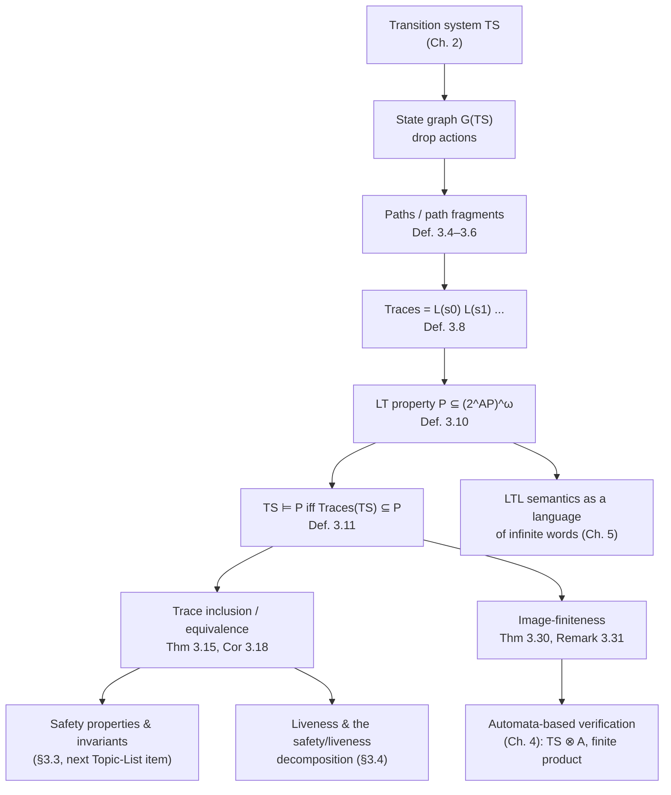

[[book-guidelines|↩ Back to guidelines]]

# Linear-Time Properties

## Why the book throws away half of the transition system

Chapter 2 spent its entire length building transition systems $TS = (S, \mathit{Act}, \rightarrow, I, AP, L)$ as rich objects: states, *actions* labeling every transition, initial states, and a labeling function $L : S \to 2^{AP}$ attaching atomic propositions to states. Actions were the whole point of that chapter — they are what let you model handshaking, channel communication, interleaving, and synchronous composition at all. So it is a little jarring that Section 3.2 opens by discarding them.

The move is deliberate, and it's worth sitting with the "why" before the "how." There are two ways to look at what a system does:

- **Action-based**: what matters is the sequence of *events* — which synchronizations fired, in what order.
- **State-based**: what matters is which *conditions* held, in sequence, regardless of which action caused the transition between them.

Almost every specification you actually want to write — mutual exclusion, deadlock-freedom, starvation-freedom, "the light is eventually green" — is a state-based claim. "At most one process is in its critical section" says nothing about *which* action put it there. Actions were the mechanism for building the model (Chapter 2's job); once the model exists, they're often just plumbing. Baier and Katoen make this explicit: *"Action labels of transitions are only necessary for modeling communication; thus, they are of no relevance in the following chapters."* From here through automata-based verification (Ch. 4), LTL (Ch. 5), and CTL (Ch. 6), the object being reasoned about is not $TS$ itself but the digraph you get by stripping $TS$ down to states and reachability — the **state graph**:

$$
G(TS) = (V, E), \quad V = S, \quad E = \{(s, s') \in S \times S \mid s' \in \mathit{Post}(s)\}.
$$

Multiple actions between the same two states collapse into one edge; initial-state and labeling information survive only because we carry $I$ and $L$ separately. This single move — throw away the action alphabet, keep the label alphabet $2^{AP}$ — is what makes it possible to compare *arbitrarily different* transition systems (different action sets, different granularities of modeling) using a single common currency: the sequence of proposition-sets they visit. That currency is the **trace**, and a **linear-time property** is nothing more than a rule about which sequences of proposition-sets are acceptable.

**What breaks without this abstraction**: if properties had to mention action names, then refining a design — replacing one internal synchronization protocol with a different, more detailed one — would silently invalidate every property proved about the original, even when the *observable* (state-labeled) behavior is identical. State-based properties are exactly the ones robust to "the implementation details changed but what a user can observe from atomic propositions did not."

## Paths and path fragments: executions with the actions erased

An execution fragment (Ch. 2) is an alternating sequence $s_0 \xrightarrow{\alpha_0} s_1 \xrightarrow{\alpha_1} s_2 \cdots$. Erase the $\alpha_i$ and you get a **path fragment**:

> **Definition 3.4 (Path Fragment).** A finite path fragment is a state sequence $\hat\pi = s_0 s_1 \dots s_n$ ($n \ge 0$) with $s_i \in \mathit{Post}(s_{i-1})$ for $0 < i \le n$. An infinite path fragment is $\pi = s_0 s_1 s_2 \dots$ with $s_i \in \mathit{Post}(s_{i-1})$ for all $i > 0$.

The book fixes a full vocabulary of position operators that recur everywhere afterward: $\mathrm{first}(\pi) = s_0$; $\pi[j] = s_j$; $\pi[..j] = s_0 \dots s_j$ (the $j$-th prefix); $\pi[j..] = s_j s_{j+1} \dots$ (the $j$-th suffix); and for finite $\hat\pi$, $\mathrm{last}(\hat\pi) = s_n$ and $\mathrm{len}(\hat\pi) = n$ (with $\mathrm{len}(\pi) = \infty$, $\mathrm{last}(\pi) = \bot$ for infinite $\pi$). A **maximal** path fragment is either infinite, or finite and ending in a terminal state — it cannot be extended. A **path** (Definition 3.6) is an *initial, maximal* path fragment: it starts in $I$ and cannot be prolonged. $\mathrm{Paths}(s)$ denotes maximal fragments starting at $s$; $\mathrm{Paths}(TS)$ the paths of the whole system.

A subtlety the book flags explicitly (footnote 2, p. 96): a "path" here is *not* the graph-theoretic notion of path. A digraph path is typically finite and need not be maximal; a transition-system path is always maximal and may be infinite. Keep this distinction sharp — it matters as soon as you start reasoning about "all paths from $s$" for liveness properties later in the chapter, where truncating to a finite prefix would silently change the property being checked.

### Grounding: paths as (possibly infinite) iterators

The maximal/possibly-infinite distinction maps directly onto a design decision every verification-tool author has to make: do you represent a run as a `Vec` or as a lazy stream? Rust's ownership model makes this concrete — you cannot materialize an infinite path as a `Vec<State>`, so a path fragment is naturally an iterator:

```rust
trait PathFragment {
    type State: Clone;
    /// Yields None only for a *maximal, finite* fragment that has ended.
    fn next_state(&mut self) -> Option<Self::State>;
}

/// A path is a PathFragment guaranteed to start at an initial state and
/// to be maximal — Rust's type system can't enforce "maximal" statically,
/// so this remains a documented invariant, exactly as it is a definitional
/// invariant (not a checkable one) in the book.
struct Path<S: Iterator<Item = StateId>> {
    states: S,
}
```

An `Iterator` that never returns `None` models an infinite path; one that does, models a finite maximal fragment ending in a terminal state (`Post(last) = ∅`). This is exactly the operational content of Definition 3.5 — "maximal" is "cannot be prolonged," and in Rust that's "the iterator's `next()` genuinely has nothing more to give," not merely "we stopped asking."

In Lean, the same idea is more naturally *coinductive*, since Lean lets you state the infinite case as a first-class type rather than encoding it via an iterator protocol:

```lean
-- A finite path fragment as a nonempty list of states respecting Post.
structure FinPathFragment (TS : TransitionSystem) where
  states : List TS.State
  nonempty : states ≠ []
  respects : ∀ i, (h : i + 1 < states.length) →
    states[i+1] ∈ TS.Post states[i]

-- An infinite path fragment as a stream respecting Post at every index.
structure InfPathFragment (TS : TransitionSystem) where
  states : Nat → TS.State
  respects : ∀ i, states (i+1) ∈ TS.Post (states i)
```

`Nat → TS.State` is literally the book's $\pi[j] = s_j$ notation, typed. This is the kind of definition where Lean is doing the least translation work of the three languages — [[Mathematical-Preliminaries#The formalism|the formalism]] *is* already a total function from indices to states, so `Nat → State` is not an analogy, it's the definition.

## Traces: what's actually observable

The book's justification for traces is worth quoting almost verbatim, because it states the epistemic stance the rest of the book takes: *"the states themselves are not 'observable', but just their atomic propositions."* An execution $s_0 \xrightarrow{\alpha_0} s_1 \xrightarrow{\alpha_1} \cdots$ becomes the word $L(s_0)\,L(s_1)\,L(s_2)\cdots$ — a sequence of *subsets of $AP$*, not of states or actions.

> **Definition 3.8 (Trace and Trace Fragment).** For $TS$ without terminal states, the trace of an infinite path fragment $\pi = s_0 s_1 \dots$ is $\mathrm{trace}(\pi) = L(s_0) L(s_1) \dots$; for a finite path fragment $\hat\pi = s_0 \dots s_n$, $\mathrm{trace}(\hat\pi) = L(s_0) \dots L(s_n)$.

$\mathrm{Traces}(s)$ and $\mathrm{Traces}(TS) = \bigcup_{s \in I} \mathrm{Traces}(s)$ collect these over all (maximal) paths; $\mathit{Traces}_{\mathit{fin}}(TS)$ is the analogous finite-trace set. The book makes a simplifying — and, it argues, essentially harmless — standing assumption here: **transition systems have no terminal states**, so every trace is infinite. If a real system does have terminal states, you either (a) treat their existence as a deadlock to be fixed before verification even starts, or (b) mechanically patch each terminal state $s$ with a fresh self-looping sink $s_{\mathrm{stop}}$, $s \to s_{\mathrm{stop}} \to s_{\mathrm{stop}} \to \cdots$, which preserves everything of interest while restoring the "always infinite" invariant. This patching trick is quietly important: it means every later theorem stated "for $TS$ without terminal states" loses no generality — it's a normal form, not a real restriction.

**Worked example (semaphore mutex, Example 3.9).** With $AP = \{\mathit{crit}_1, \mathit{crit}_2\}$, a path where $P_1$ and $P_2$ alternate through their critical sections produces the trace
$$
\varnothing\,\varnothing\,\{\mathit{crit}_1\}\,\varnothing\,\varnothing\,\{\mathit{crit}_2\}\,\varnothing\,\varnothing\,\{\mathit{crit}_1\}\cdots
$$
Notice how much of the original state (the values of the semaphore variable $y$, the exact program counters $n_1/w_1/c_1$) has vanished — only the two bits that actually matter to mutual exclusion survive. This projection is the entire reason the framework scales: verification never has to reconstruct "did the semaphore have value 0 or 1", only "was the mutex-relevant proposition true."

The book also generalizes traces to a *restricted* alphabet $AP' \subseteq AP$: $\mathrm{trace}_{AP'}(\pi) = (L(s_0) \cap AP')(L(s_1) \cap AP')\cdots$, used implicitly for the rest of the chapter whenever a property only cares about a subset of the available propositions (mutual exclusion only needs $\{\mathit{crit}_1, \mathit{crit}_2\}$, even if the transition system tracks far more).

### Grounding: traces as a projection functor

```rust
use std::collections::BTreeSet;

type Label = BTreeSet<Prop>; // L(s) ⊆ AP, as a concrete set

/// trace(π) restricted to AP' ⊆ AP — a pure projection, no state identity survives.
fn trace_ap<'a>(
    path: impl Iterator<Item = &'a Label> + 'a,
    ap_prime: &'a BTreeSet<Prop>,
) -> impl Iterator<Item = Label> + 'a {
    path.map(move |label| label.intersection(ap_prime).cloned().collect())
}
```

The Rust signature makes the "observability" claim literal: the function's *input* type carries full state labels, but nothing about state *identity* (no `StateId`, no pointer, no index) is even in scope — the projection is structurally incapable of depending on anything but the label. In Python, the same idea is a one-liner precisely because dropping type information costs nothing when there was none to begin with:

```python
def trace(path_labels, ap_subset=None):
    if ap_subset is None:
        return list(path_labels)
    return [frozenset(l) & ap_subset for l in path_labels]
```

## Linear-time properties: specifications *are* languages

This is the chapter's central definitional move, and it is disarmingly simple once traces exist:

> **Definition 3.10 (LT Property).** A linear-time property over $AP$ is a subset $P \subseteq (2^{AP})^\omega$.

That's it — a property is just a set of infinite words over the alphabet $2^{AP}$. "The system is correct" becomes "the system's traces all happen to lie in $P$":

> **Definition 3.11 (Satisfaction Relation).** $TS \models P$ iff $\mathrm{Traces}(TS) \subseteq P$. For a state, $s \models P$ iff $\mathrm{Traces}(s) \subseteq P$.

This reframing is worth dwelling on because it is what makes everything from Chapter 4 onward possible: once "property" means "language over $2^{AP}$," verifying $TS \models P$ becomes a question about set inclusion between two languages, and *languages* are exactly what automata theory (regular languages, $\omega$-regular languages, Büchi acceptance) already knows how to manipulate algorithmically. Chapter 4's entire program — build an automaton for the *bad* traces (i.e. for $(2^{AP})^\omega \setminus P$), take the product $TS \otimes A$, check for an accepting run — only makes sense because Definition 3.10 already recast "property" as "formal language."

**[[Concurrency-and-Communication-Modeling#Worked examples|Worked examples]] make the abstraction concrete.** For two traffic lights with $AP = \{\mathit{red}_1, \mathit{green}_1, \mathit{red}_2, \mathit{green}_2\}$:

- $P$ = "the first light is green infinitely often" = $\{A_0 A_1 \cdots \mid \mathit{green}_1 \in A_i \text{ for infinitely many } i\}$.
- $P'$ = "never both green" = $\{A_0 A_1 \cdots \mid \forall i.\ \mathit{green}_1 \notin A_i \text{ or } \mathit{green}_2 \notin A_i\}$.

Both are genuinely infinite sets of infinite words defined by a *predicate on the word*, not by an automaton or a formula — the book stresses this is deliberately the most elementary possible definition, to be superseded by LTL's [[Timed-CTL-and-TCTL-Model-Checking#Syntax|syntax]] in Chapter 5, but semantically LTL formulas will themselves just *denote* LT properties in exactly this sense.

**Mutual exclusion, formalized for real** (Example 3.13):
$$
P_{\mathit{mutex}} = \{A_0 A_1 A_2 \cdots \mid \{\mathit{crit}_1, \mathit{crit}_2\} \not\subseteq A_i \text{ for all } i \ge 0\}.
$$
And **starvation freedom** (Example 3.14) exposes a distinction that will become the whole subject of Chapters 6–7 (safety vs. liveness): the *finite-wait* property
$$
P_{\mathit{finwait}}: \forall j.\ \mathit{wait}_i \in A_j \Rightarrow \exists k \ge j.\ \mathit{crit}_i \in A_k
$$
is subtly different from the *infinitely-often* version
$$
P_{\mathit{nostarve}}: \Big(\overset{\infty}{\exists} j.\ \mathit{wait}_i \in A_j\Big) \Rightarrow \Big(\overset{\infty}{\exists} j.\ \mathit{crit}_i \in A_j\Big),
$$
where $\overset{\infty}{\exists}$ abbreviates "there are infinitely many." The semaphore-based mutex algorithm satisfies $P_{\mathit{mutex}}$ but *not* $P_{\mathit{nostarve}}$: the trace $\varnothing(\{\mathit{wait}_2\}\{\mathit{wait}_1,\mathit{wait}_2\}\{\mathit{crit}_1,\mathit{wait}_2\})^\omega$ is a genuinely reachable behavior in which process 2 waits forever while process 1 repeatedly cuts in — legal under $P_{\mathit{mutex}}$, illegal under $P_{\mathit{nostarve}}$. This single counterexample is why Section 3.5's [[Fairness|fairness]] machinery (outside this article's scope, but downstream of it) exists at all: without ruling out "unfair" infinite traces like this one, no scheduling algorithm can be proved starvation-free.

### Grounding: LT properties as predicates over (lazy) infinite streams

An LT property is a subset of $(2^{AP})^\omega$; the most literal Rust encoding is a predicate over a — necessarily lazy, since the set is infinite words — stream of labels. You cannot check membership by materializing the whole word, so real code always works with *finite approximations* (a lookahead bound, or an automaton-based recognizer, both covered in later chapters):

```rust
/// An LT property: conceptually P ⊆ (2^AP)^ω. We can't decide arbitrary
/// membership over an infinite stream, so this trait is deliberately
/// restricted to the two operationally meaningful queries.
trait LtProperty {
    /// Does this finite prefix already violate every possible continuation?
    /// (This is exactly the "bad prefix" idea the book introduces in §3.3 —
    /// LT properties in general need not have this checkable via prefixes.)
    fn refuted_by_prefix(&self, prefix: &[Label]) -> bool;
}

struct Mutex { crit1: Prop, crit2: Prop }

impl LtProperty for Mutex {
    fn refuted_by_prefix(&self, prefix: &[Label]) -> bool {
        prefix.iter().any(|a| a.contains(&self.crit1) && a.contains(&self.crit2))
    }
}
```

$P_{\mathit{mutex}}$ happens to be refutable by a finite prefix (it's a *safety* property, covered by the next Topic-List entry); $P_{\mathit{nostarve}}$ is not — no finite prefix ever proves "process 2 waits forever," which is precisely the safety/liveness fault-line this chapter is building toward.

In Lean, Definition 3.10 is close to a direct transcription, and stating Definition 3.11 as an actual theorem-provable proposition (rather than an English sentence) is where Lean earns its keep:

```lean
-- (2^AP)^ω as infinite streams of finite label sets.
def LTProperty (AP : Type) := (Nat → Finset AP) → Prop

def satisfies (TS : TransitionSystem) (P : LTProperty TS.AP) : Prop :=
  ∀ π ∈ TS.Traces, P π
-- literally "Traces(TS) ⊆ P", spelled as a ∀-statement over set membership.
```

## Trace inclusion and trace equivalence: the correspondence theorems

Section 3.2.4 asks the natural next question: if two transition systems have related trace sets, how are their LT-property satisfactions related? The answer is exact, not approximate, and it is [[Liveness-Properties-and-the-Safety-Liveness-Decomposition#The theorem|the theorem]] that gives trace inclusion its status as *the* semantic notion of "correct refinement" in this book.

> **Trace inclusion**: $\mathrm{Traces}(TS) \subseteq \mathrm{Traces}(TS')$. Read as "TS is a correct implementation of TS$'$" in stepwise design — $TS$ may resolve some of $TS'$'s nondeterminism (e.g. by fixing a scheduling policy) but may not exhibit any behavior $TS'$ didn't already allow.

> **Theorem 3.15 (Trace Inclusion and LT Properties).** For $TS, TS'$ without terminal states and the same $AP$: $\mathrm{Traces}(TS) \subseteq \mathrm{Traces}(TS')$ **iff** for every LT property $P$: $TS' \models P \Rightarrow TS \models P$.

The proof is genuinely two lines each direction (($\Rightarrow$) chase the inclusions through Definition 3.11; ($\Leftarrow$) instantiate $P := \mathrm{Traces}(TS')$ itself, which $TS'$ trivially satisfies, and derive the inclusion) — but the *content* is what matters: **trace inclusion is not merely sufficient for property preservation, it is exactly equivalent to it.** There is no other, looser relation between two transition systems that would guarantee "everything provable about the abstract design carries over to the refinement" — trace inclusion is not just *a* sound refinement relation, it is the *tightest possible characterization* of one, viewed purely at the level of LT properties.

**Worked application (Example 3.16):** take $TS_{\mathit{Sem}}$ and remove the transition $\langle w_1, w_2, y{=}1\rangle \to \langle w_1, c_2, y{=}0\rangle$ (process 1 now always wins when both are waiting). Removing a transition can only shrink $\mathrm{Traces}$, so $\mathrm{Traces}(TS) \subseteq \mathrm{Traces}(TS_{\mathit{Sem}})$ *for free*, syntactically — and Theorem 3.15 then hands you $TS \models P_{\mathit{mutex}}$ *without re-proving anything about the refined system*. This is the payoff the book is selling: once you've established the trace-inclusion relationship (often trivial, as here), every safety/liveness fact already proved about the abstract model transfers automatically.

Trace *equivalence* is the symmetric closure:

> **Definition 3.17.** $TS$ and $TS'$ are trace-equivalent w.r.t. $AP$ if $\mathrm{Traces}_{AP}(TS) = \mathrm{Traces}_{AP}(TS')$.

> **Corollary 3.18.** $\mathrm{Traces}(TS) = \mathrm{Traces}(TS')$ **iff** $TS$ and $TS'$ satisfy exactly the same LT properties.

The immediate consequence: *no LT property can ever distinguish trace-equivalent systems.* To prove two systems are *not* trace-equivalent, it suffices to exhibit one property one satisfies and the other doesn't — this is the standard technique used against Example 3.19's two vending machines (one nondeterministically dispenses soda-or-beer after payment; the other nondeterministically disables one of two selection buttons). Restricted to $AP = \{\mathit{pay}, \mathit{soda}, \mathit{beer}\}$, both machines produce exactly the alternating-$\mathit{pay}$-then-beverage traces — they are trace-equivalent, and Corollary 3.18 guarantees *in advance*, with no further proof effort, that no LT property will ever tell them apart, even though their internal transition structure (which button gets disabled vs. which output gets chosen) is visibly different.

### Grounding: trace inclusion as a soundness obligation

This correspondence is precisely the "soundness of abstraction/refinement" pattern that recurs across verification: showing a smaller relation between systems (or between a system and its model) implies preservation of *everything* expressible in a target logic. Concretely, in Rust, checking finite-trace inclusion for a finite $TS$ is a reachability computation on the product automaton — the same machinery Chapter 4 will formalize with actual automata:

```rust
/// A syntactic sufficient condition: if every transition of `refined`
/// is also a transition of `abstract_ts` (same states, subset of edges),
/// then Traces(refined) ⊆ Traces(abstract_ts) holds "for free" — no need
/// to enumerate and compare trace sets, by Theorem 3.15's contrapositive use.
fn is_transition_subset(abstract_ts: &TransitionSystem, refined: &TransitionSystem) -> bool {
    refined.edges().all(|e| abstract_ts.edges().contains(&e))
        && refined.initial_states().is_subset(&abstract_ts.initial_states())
}
```

This is exactly Example 3.16's argument, generalized: syntactic containment of the transition relation is a cheap, sufficient witness for the semantic trace-inclusion hypothesis that Theorem 3.15 actually needs.

In Lean, Theorem 3.15 is a genuine iff-proposition worth stating (even if you don't discharge the proof, writing the *statement* forces you to get the quantifier order right — a common source of bugs when this idea gets reimplemented informally in tooling):

```lean
theorem trace_inclusion_iff_property_preservation
    (TS TS' : TransitionSystem) (h1 : TS.NoTerminalStates) (h2 : TS'.NoTerminalStates)
    (hap : TS.AP = TS'.AP) :
    TS.Traces ⊆ TS'.Traces ↔
    ∀ P : LTProperty, satisfies TS' P → satisfies TS P
```

## Image-finiteness: when finite-trace inclusion is *enough*

Section 3.3.3 revisits trace inclusion once safety properties (bad prefixes, closure) are on the table, and asks a sharper question: full trace inclusion $\mathrm{Traces}(TS) \subseteq \mathrm{Traces}(TS')$ talks about *infinite* traces — can you get away with checking only *finite* traces instead? Finite objects are, after all, what algorithms actually enumerate.

> **Theorem 3.30 (Relating Finite Trace and Trace Inclusion).** If $TS$ has no terminal states and $TS'$ is **finite**, then $\mathrm{Traces}(TS) \subseteq \mathrm{Traces}(TS') \iff \mathit{Traces}_{\mathit{fin}}(TS) \subseteq \mathit{Traces}_{\mathit{fin}}(TS')$.

The ($\Rightarrow$) direction is immediate from monotonicity of prefix-taking. The ($\Leftarrow$) direction is the interesting one, and its proof is a genuine piece of mathematics worth understanding rather than skimming: given that every finite prefix of an infinite trace of $TS$ has a witnessing finite path in $TS'$, you need to *stitch together* an actual infinite path in $TS'$ realizing the whole infinite trace. The witnessing paths $\pi^m$ for longer and longer prefixes need not agree with each other (extending the witness for length $m$ needn't extend the witness for length $m{+}1$) — so the book runs a **diagonalization argument**: because $TS'$ is finite, only finitely many states can appear at each fixed index $n$ across all the $\pi^m$, so by pigeonhole there's always an infinite subset of witnesses agreeing on that index; intersecting these subsets across all $n$ (via the sequence of shrinking infinite index-sets $I_0 \supseteq I_1 \supseteq \cdots$) yields a single, coherent infinite path.

**Where finiteness is really doing the work**: the diagonalization needs, at each step, only *finitely many candidate successors* to apply pigeonhole to. The book immediately generalizes this:

> **Remark 3.31 (Image-Finite Transition Systems).** $TS'$ is called **AP-image-finite** (or just *image-finite*) if:
> (i) for every $A \subseteq AP$, $\{s_0 \in I \mid L(s_0) = A\}$ is finite, and
> (ii) for every state $s$ and every $A \subseteq AP$, $\{s' \in \mathit{Post}(s) \mid L(s') = A\}$ is finite.
>
> Theorem 3.30 holds with "$TS'$ finite" weakened to "$TS'$ image-finite."

This is the sharper, correct hypothesis: the diagonalization proof only ever needed *finitely many same-labeled candidates at each branching point*, never a globally bounded state count. Every finite transition system is trivially image-finite; so is every **AP-deterministic** system (Ch. 2's notion: at most one initial state and at most one successor per label, per action — so the "set of successors with label $A$" is always a singleton or empty, hence finite). Image-finiteness is thus the *exact* boundary condition, not merely a convenient stand-in for finiteness.

**Why the boundary matters (Example 3.32):** consider a finite $TS$ with a self-loop on a non-$b$ state that *can* leave to a $b$-labeled state, versus an infinite $TS'$ where the initial state has *infinitely many* successors, each starting a chain of a different, fixed length before reaching a $b$-state (formally: infinite branching at the root — not image-finite). Both systems agree on every finite trace $(\varnothing)^n$ for all $n$: $TS$ can always eventually take the $b$-transition, and $TS'$ has *some* branch of every finite length. But $TS$ has the infinite trace $(\varnothing)^\omega$ (loop forever, never reach $b$) while $TS'$ does not — every one of its paths is finite-then-$b$, or rather every branch commits to reaching $b$ after finitely many steps chosen at the root. So $\mathit{Traces}_{\mathit{fin}}(TS) \subseteq \mathit{Traces}_{\mathit{fin}}(TS')$ holds while $\mathrm{Traces}(TS) \subseteq \mathrm{Traces}(TS')$ **fails** — precisely because $TS'$'s infinite branching breaks image-finiteness, so Remark 3.31's hypothesis doesn't apply and the theorem's conclusion doesn't have to hold. Concretely: "eventually $b$" holds for $TS'$ but not $TS$; "never $b$" holds for $TS$ but not $TS'$ — two LT properties that finite-trace inclusion alone cannot tell apart, but full trace inclusion (correctly) does.

The book's own gloss on why this isn't just a corner case: $TS$ "could result from an infinite loop in a program," while $TS'$ "could model the semantics of a program fragment that nondeterministically chooses a natural number $k$ and then performs $k$ steps" — i.e. exactly the kind of unbounded-but-not-infinite-in-any-single-run nondeterminism that shows up whenever a program reads an unbounded integer from its environment.

### Grounding: image-finiteness as "the branching factor you're allowed to build tooling around"

Image-finiteness is the precise technical condition licensing an assumption that essentially all real model checkers make silently: *"successor enumeration terminates."* Any BFS/DFS-based state-space exploration (used throughout the book for invariant checking, nested DFS, etc.) is implicitly relying on `Post(s)` being enumerable in finite time for each visited `s` — that's exactly condition (ii) of image-finiteness, applied pointwise per label class:

```rust
trait ImageFinite {
    type State;
    type Prop;
    /// Must return a *finite* iterator — this is the operational content
    /// of Remark 3.31's condition (ii). A transition system whose
    /// successor function can only be approximated by an unbounded search
    /// (e.g. reading an unbounded integer, as in Example 3.32) is not
    /// usable here without first bounding or abstracting it.
    fn successors(&self, s: &Self::State) -> Vec<Self::State>;
    fn initial_states(&self) -> Vec<Self::State>; // condition (i)
}
```

Any explicit-state model checker's core data structure (worklist + visited-set) *requires* an `ImageFinite`-shaped interface to even type-check as "returns" rather than "may loop forever collecting successors of one state." Infinite branching at a single state (Example 3.32's $TS'$) is exactly the case such an interface cannot represent — you'd need `successors` to return an unbounded iterator, at which point per-state exploration itself becomes non-terminating and the entire explicit-state algorithmic toolkit of Chapters 4, 6, and 8 stops applying without first re-abstracting the model (e.g. bounding the integer, or switching to a symbolic/BDD representation as in §6.7, which sidesteps enumeration entirely).

In Python, the same distinction is visible as the difference between a generator that's guaranteed to terminate versus one that isn't — a good illustration precisely because Python won't stop you from writing the unsound version:

```python
def successors_bad(s):          # NOT image-finite: infinite generator
    k = 0
    while True:
        yield make_chain_of_length(k)
        k += 1

def successors_good(s):         # image-finite: list, provably finite
    return [t for t in transition_targets(s)]
```

## Where this leads



This section is the load-bearing floor of the entire book's semantic apparatus. Every later chapter that states "TS satisfies formula $\varphi$" — LTL in Chapter 5, CTL in Chapter 6, CTL$^*$, even the probabilistic logics of Chapter 10 — ultimately cashes out its semantics in terms of *this* chapter's $\mathrm{Traces}(TS) \subseteq P$ definition, either directly (LTL: $\mathit{Words}(\varphi)$ is an LT property in exactly Definition 3.10's sense) or by first reducing to it (CTL path formulas quantify over exactly the $\mathrm{Paths}(s)$ defined here). Trace equivalence and inclusion reappear explicitly as the *semantic yardstick* for the entire equivalence/abstraction machinery of Chapter 7 — bisimulation is characterized there as strictly *finer* than trace equivalence, and simulation is shown to preserve exactly trace *inclusion* (not full equivalence), a fact that only makes sense once you've internalized Theorem 3.15 and Corollary 3.18 as this chapter's precise, provable correspondence rather than an informal slogan. And image-finiteness resurfaces silently every time the book builds a product construction $TS \otimes A$ with a finite automaton $A$: the product is automatically image-finite whenever $TS$ is, which is exactly the hypothesis Chapter 4's persistence-checking (nested DFS) and Chapter 5's on-the-fly LTL model checking need to terminate.

For the standing goals this vault is organized around — a Rust-based verifier with a CSP/abstract-interpretation core (Focus Areas `static-analysis` and `automated-reasoning`) — two threads here are directly load-bearing rather than merely analogous:

- **Trace inclusion as a soundness contract** is the same shape of obligation as soundness-of-abstraction in abstract interpretation: proving $\mathrm{Traces}(TS) \subseteq \mathrm{Traces}(TS')$ is structurally the trace-semantics analogue of proving $\gamma(\alpha(S)) \supseteq S$ for a Galois connection — both are "this cheaper/smaller/more abstract object doesn't lose any behavior the real one has." Any invariant-generation pass built on top of an abstract domain inherits its soundness argument in exactly this "preserve all LT properties" sense, just phrased over lattices instead of trace sets.
- **Image-finiteness is the precondition for explicit-state search to type-check at all.** A CSP kernel searching for concrete counterexamples (Focus Area `sat-smt-csp`, per the workbench's standing project) needs its underlying transition relation to be image-finite — or to be explicitly bounded/abstracted until it is — before "enumerate successors and search" is even a well-defined terminating procedure. Chapter 9's real-time extension (uncountably many clock valuations) and Chapter 10's probabilistic extension both have to construct a *finite quotient* (regions; the underlying digraph) specifically to satisfy this same image-finiteness requirement before their model-checking algorithms can run — this chapter's Remark 3.31 is the first place in the book that names the condition those later constructions are all implicitly restoring.
