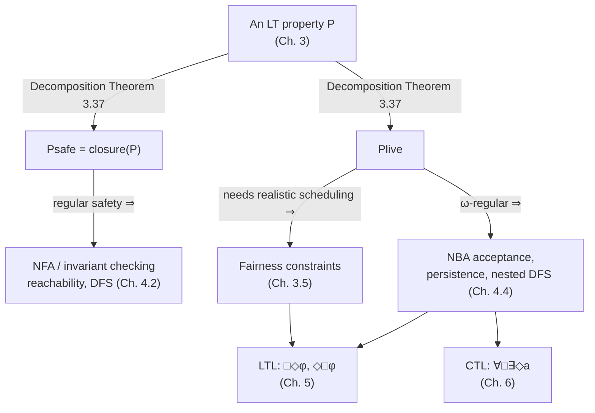

[[book-guidelines|↩ Back to guidelines]]

## Why safety alone is a cheat code

Section 3.3 gave you *safety*: "nothing bad ever happens," formalized as the property that any violation shows up in a finite prefix (a **bad prefix**). Safety properties are wonderful because they reduce to a decidable, purely reachability-shaped question — is there any reachable state (or finite behavior) that already constitutes the bad thing? Depth-first search suffices (Algorithm 3/4 from Section 3.3).

But safety has an embarrassing loophole: **the empty program satisfies every safety property.** A mutual-exclusion algorithm that deadlocks before either process ever enters its critical section never lets two processes be in the critical section simultaneously — vacuously safe. A traffic light that gets stuck on red forever never violates "a red phase is preceded by a yellow phase," because it never has *another* red phase to violate the requirement with. A system that does nothing is maximally, trivially correct, as long as "correct" is spelled out only in terms of bad things not happening.

This is exactly the gap liveness properties exist to close. Where safety properties are refuted by a finite prefix, **liveness properties can only be refuted by an infinite run** — they are promises about what eventually, or infinitely often, must occur, and no finite amount of stalling can falsify a promise about the infinite future. This is the book's Section 3.4, and it does two things: it pins down what "liveness" formally means (not just "eventually X," but *any* property with this refuted-only-at-infinity character), and it proves a structural theorem — the **Decomposition Theorem** — showing that safety and liveness are not just two examples of requirements but jointly *exhaustive*: every linear-time property, no matter how tangled, factors into a safety part and a liveness part.

## Liveness as unconstrained finite behavior

The book (following Alpern and Schneider's classical characterization) defines liveness not as "eventually something good happens" — that's just the most common *instance* — but structurally, in terms of what it does *not* do to finite behavior:

> **Definition 3.33 (Liveness Property).** An LT property $P_{live}$ over $AP$ is a liveness property whenever $\mathrm{pref}(P_{live}) = (2^{AP})^*$.

Recall from Section 3.3 that for a trace $\sigma$, $\mathrm{pref}(\sigma)$ is its set of finite prefixes, and $\mathrm{pref}(P) = \bigcup_{\sigma \in P} \mathrm{pref}(\sigma)$ lifts this to a whole property. Definition 3.33 says: a liveness property's prefix set is *everything* — every finite word over $2^{AP}$, without exception, is a prefix of some infinite word that satisfies $P_{live}$.

Unpack what that buys you. Take any finite trace you like — including one that looks maximally "bad" from $P_{live}$'s point of view (a process that has been waiting forever with no sign of progress so far). Definition 3.33 guarantees you can *always* extend it to an infinite trace that ends up satisfying $P_{live}$. No finite amount of evidence can convict a trace of violating a liveness property; the verdict is permanently deferred to the limit. This is the precise dual of a safety property's bad prefix: a safety violation is a *committed* finite mistake ("it already happened"), while a liveness property never commits — it only ever promises "there's still time."

**What breaks without this framing.** If you tried to define liveness merely as "the property is not a safety property," you'd get something far messier — LT properties come in flavors that are neither safety nor liveness (Figure 3.11 below has a region for exactly this). Definition 3.33 instead gives liveness a positive, freestanding characterization, independent of safety's definition, which is exactly what makes the Decomposition Theorem a nontrivial theorem rather than a definitional tautology.

### Grounding: prefixes as an unrefutable predicate

In Rust, you'd naturally model a *safety* checker as a predicate over finite prefixes that can return "already violated" — a state you can reach and latch:

```rust
enum SafetyVerdict {
    StillOk,
    Violated, // a bad prefix has been observed — sticky, monotone
}

trait SafetyMonitor<S> {
    fn step(&mut self, state: &S) -> SafetyVerdict;
}
```

A liveness property fundamentally *cannot* be implemented this way — there is no `step` you could ever call that legitimately returns "Violated," because Definition 3.33 guarantees any finite run so far is still extendable into a satisfying one. The type you'd need instead only makes sense over the whole infinite run:

```rust
// Liveness cannot be checked incrementally on a running prefix; it is a
// predicate on infinite traces, or (co-inductively) on the tail behavior.
trait LivenessProperty<S> {
    fn holds_on_infinite_trace(&self, trace: &InfiniteTrace<S>) -> bool;
}
```

This is not a limitation of Rust — it is the mathematical content of Definition 3.33 showing up as a type-level fact: safety is *inductive* (provable by exhibiting a finite witness of failure), liveness is *coinductive* (refuted only by producing, or reasoning about, an entire infinite behavior). This is precisely why practical liveness verification (Chapters 4, 8, and 10) routes through cycle detection and Büchi acceptance rather than plain reachability — you're hunting for a *repeating* structure, not a single bad state.

## Repeated eventually and starvation freedom

Example 3.34 grounds Definition 3.33 in the mutual-exclusion setting already used throughout Chapter 3, with atomic propositions $\{wait_1, crit_1, wait_2, crit_2\}$ ($wait_i$: process $P_i$ is waiting to enter; $crit_i$: $P_i$ is in its critical section). Three liveness properties, in increasing strength:

**Eventually.** Each process enters its critical section *at least once*:
$$(\exists j \geq 0.\ crit_1 \in A_j) \land (\exists j \geq 0.\ crit_2 \in A_j)$$

**Repeated eventually (infinitely often).** Each process enters its critical section *infinitely often*:
$$(\forall k \geq 0.\ \exists j \geq k.\ crit_1 \in A_j) \land (\forall k \geq 0.\ \exists j \geq k.\ crit_2 \in A_j)$$
abbreviated $\left(\overset{\infty}{\exists} j \geq 0.\ crit_1 \in A_j\right) \land \left(\overset{\infty}{\exists} j \geq 0.\ crit_2 \in A_j\right)$ — this notation is the ancestor of $\Box\Diamond\varphi$ ("infinitely often") in LTL (Chapter 5) and of the Büchi acceptance condition itself (Chapter 4): "visit $F$ infinitely often" *is* a repeated-eventually property, phrased over automaton states instead of atomic propositions.

**Starvation freedom.** *Every* time a process starts waiting, it eventually gets in:
$$\forall j \geq 0.\ \big(wait_1 \in A_j \Rightarrow (\exists k > j.\ crit_1 \in A_k)\big) \ \land\ \forall j \geq 0.\ \big(wait_2 \in A_j \Rightarrow (\exists k > j.\ crit_2 \in A_k)\big)$$

Note the strict ordering of strength: starvation freedom implies repeated eventually only if a process that finishes always waits again (otherwise "infinitely often in the critical section" could fail for a process that just stops asking); and repeated eventually implies plain eventually trivially. All three are liveness properties in the sense of Definition 3.33: given *any* finite trace — even one where a process has waited through the entire observed history without success — you can always append a continuation (e.g., "grant access to the starved process now, then alternate fairly forever after") that makes the extended infinite trace satisfy the property. The finite prefix, no matter how damning it looks, never forecloses the possibility of eventual compliance.

**What breaks without repeated-eventually as a distinct notion from eventually.** "Eventually enters the critical section" is satisfied by a run where $P_1$ enters once, at step 5, and then [[Probabilistic-Computation-Tree-Logic#The algorithm|the algorithm]] somehow blocks $P_1$ forever afterward. That is obviously not the liveness guarantee you actually want from a scheduler — you want it to keep serving $P_1$ forever, not just once as a formality. This is exactly why $\Box\Diamond\varphi$ ("infinitely often," repeated eventually) rather than plain $\Diamond\varphi$ is the property used later (Chapters 8 and 10) to state fair-scheduling and long-run-behavior guarantees for [[Markov-Decision-Processes|Markov decision processes]] and [[Fairness|fairness]] constraints — a single eventual success is a much weaker, and often useless, promise.

### Grounding: why you can't unit-test liveness

A Python sketch makes the undecidability-in-the-small concrete. Suppose you log a real execution and want to check "process 1 gets the critical section infinitely often":

```python
def repeated_eventually(trace_prefix, prop):
    """
    trace_prefix: a FINITE list of states observed so far.
    There is no correct implementation of this function for liveness
    properties: no matter how long trace_prefix is, both answers remain
    possible continuations.
    """
    # Any answer here is falsifiable by a not-yet-seen continuation.
    raise NotImplementedError(
        "Liveness properties are not decidable from a finite observation; "
        "Definition 3.33 guarantees the prefix set is *everything*."
    )
```

You can, however, check a *bounded approximation* ("has entered the critical section at least once in the last $N$ steps") — but that bounded check is itself a *safety* property (violated by a finite bad prefix of length $N$ of silence), not the original liveness property. This slippage — approximating an unbounded liveness requirement with a bounded, checkable safety surrogate — is a recurring theme in practical verification and testing, and it is precisely why the book turns to *automata-theoretic* acceptance conditions (Nondeterministic Büchi Automata, Chapter 4) rather than finite monitoring: NBA acceptance ("visit $F$ infinitely often along this specific run") is a genuine infinite-behavior condition that a *cycle-detection* algorithm (nested DFS) can certify without ever bounding the run length, because a finite transition system's infinite behavior is fully characterized by its reachable cycles.

## The decomposition theorem for linear-time properties

Here is the section's central result. It answers two questions posed explicitly in the text:

1. Are safety and liveness properties disjoint?
2. Is every LT property either a safety or a liveness property?

The answer to (1) is "almost" (next section), and the answer to (2) is a clean **no** — but the book converts that "no" into something more useful: every LT property, however impure, splits into a safety component and a liveness component whose *intersection* recovers it exactly.

### The tool: closure

Definition 3.26 (from Section 3.3, restated here because it is the load-bearing tool of this section) defines, for LT property $P$ over $AP$:

$$\mathrm{closure}(P) = \{\sigma \in (2^{AP})^\omega \mid \mathrm{pref}(\sigma) \subseteq \mathrm{pref}(P)\}$$

— the set of infinite traces none of whose finite prefixes is "impossible for $P$." Lemma 3.27 already established that $P$ is a safety property exactly when $\mathrm{closure}(P) = P$: a safety property already contains every trace compatible with its own prefixes; there is nothing more permissive that shares the same finite behavior.

**Lemma 3.36 (Distributivity of Union over Closure).** For any LT properties $P$, $P'$:
$$\mathrm{closure}(P) \cup \mathrm{closure}(P') = \mathrm{closure}(P \cup P')$$

This is the technical hinge of the decomposition proof — it lets you push a closure operation through a union, which is exactly the operation the theorem below needs to perform.

### The theorem

**Theorem 3.37 (Decomposition Theorem).** For any LT property $P$ over $AP$, there exist a safety property $P_{safe}$ and a liveness property $P_{live}$ (both over $AP$) such that
$$P = P_{safe} \cap P_{live}.$$

The proof is short and constructive, and worth walking through because the construction *is* the insight:

Start from the trivial fact $P \subseteq \mathrm{closure}(P)$ (every trace is compatible with its own prefixes). Then:
$$P = \mathrm{closure}(P) \cap P = \underbrace{\mathrm{closure}(P)}_{P_{safe}} \cap \underbrace{\Big(P \cup \big((2^{AP})^\omega \setminus \mathrm{closure}(P)\big)\Big)}_{P_{live}}$$

This is pure set algebra: $\mathrm{closure}(P) \cap \big(P \cup \overline{\mathrm{closure}(P)}\big) = (\mathrm{closure}(P) \cap P) \cup (\mathrm{closure}(P) \cap \overline{\mathrm{closure}(P)}) = P \cup \emptyset = P$, using $P \subseteq \mathrm{closure}(P)$.

- $P_{safe} := \mathrm{closure}(P)$ is a safety property essentially by definition (closure is idempotent: $\mathrm{closure}(\mathrm{closure}(P)) = \mathrm{closure}(P)$, so by Lemma 3.27 it's its own closure).
- $P_{live} := P \cup \big((2^{AP})^\omega \setminus \mathrm{closure}(P)\big)$ is a liveness property. Showing $\mathrm{pref}(P_{live}) = (2^{AP})^*$ reduces (by the same $\mathrm{pref}$/$\mathrm{closure}$ duality used throughout the chapter) to showing $\mathrm{closure}(P_{live}) = (2^{AP})^\omega$, i.e., *everything* is in its closure. Applying Lemma 3.36:
$$\mathrm{closure}(P_{live}) = \mathrm{closure}\big(P \cup \overline{\mathrm{closure}(P)}\big) \overset{\text{Lem. 3.36}}{=} \mathrm{closure}(P) \cup \mathrm{closure}\big(\overline{\mathrm{closure}(P)}\big) \supseteq \mathrm{closure}(P) \cup \overline{\mathrm{closure}(P)} = (2^{AP})^\omega$$
using $\mathrm{closure}(P') \supseteq P'$ for any $P'$ in the last inequality. Since closure never exceeds the whole space, this forces equality.

The book's worked example (the beverage vending machine of Figure 3.5) makes the split intuitive rather than purely algebraic: "the machine dispenses beer infinitely often, after initially dispensing soda three times in a row" is *literally* $P_{safe} \cap P_{live}$ in the informal sense already — "first three drinks are soda" is refuted by a 4-step bad prefix (safety), "beer infinitely often" can never be refuted by any finite observation (liveness). Theorem 3.37 says this isn't a lucky coincidence of a contrived example — *every* LT property, however entangled its safety-flavored and liveness-flavored requirements look on the surface, admits exactly this kind of clean factorization.

**Lemma 3.38 (Sharpest Decomposition)** adds that the $P_{safe}, P_{live}$ constructed this way are the *tightest* possible choice: for *any* valid decomposition $P = P_{safe}' \cap P_{live}'$, we have $\mathrm{closure}(P) \subseteq P_{safe}'$ and $P_{live}' \subseteq P \cup \overline{\mathrm{closure}(P)}$ — so $\mathrm{closure}(P)$ is the *strongest* safety property and $P \cup \overline{\mathrm{closure}(P)}$ the *weakest* liveness property that can appear in any decomposition of $P$. This matters practically: when a verification tool splits a specification into an invariant to check by reachability and a residual progress obligation to check separately (a pattern that recurs in Chapters 4, 8, and 10), Lemma 3.38 says there's a canonical, unimprovable way to do that split — you can't shrink the safety obligation or grow the liveness obligation and still recover $P$.

### Grounding: the decomposition as a Lean statement

Because this whole section is a set-theoretic argument about predicates on infinite streams, Lean's type theory is the most literal available translation — arguably more literal than a Rust encoding, since the statement quantifies over *properties* (sets of infinite traces), which Lean represents natively as `Set (Stream' (Set AP))` (or `ℕ → Set AP → Prop`), while Rust has no comparably direct way to talk about arbitrary predicates over infinite sequences.

```lean
variable {AP : Type} (P : Set (ℕ → Set AP))

def IsPrefixOf (finite_word : List (Set AP)) (σ : ℕ → Set AP) : Prop :=
  ∀ i, i < finite_word.length → finite_word.get! i = σ i

def prefSet (P : Set (ℕ → Set AP)) : Set (List (Set AP)) :=
  {w | ∃ σ ∈ P, IsPrefixOf w σ}

def isSafety (P : Set (ℕ → Set AP)) : Prop :=
  ∀ σ, σ ∉ P → ∃ w, IsPrefixOf w σ ∧ ∀ σ', IsPrefixOf w σ' → σ' ∉ P

def isLiveness (P : Set (ℕ → Set AP)) : Prop :=
  prefSet P = Set.univ   -- Definition 3.33, literally: every finite word is a prefix of P

def closureOf (P : Set (ℕ → Set AP)) : Set (ℕ → Set AP) :=
  {σ | ∀ w, IsPrefixOf w σ → w ∈ prefSet P}

theorem decomposition_theorem :
    ∃ Psafe Plive, isSafety Psafe ∧ isLiveness Plive ∧ P = Psafe ∩ Plive := by
  use closureOf P, P ∪ (closureOf P)ᶜ
  sorry -- the algebra above: closure_of_closure, and Lemma 3.36 as a `Set.union_distrib` step
```

The point of writing it this way is not to produce a finished Mathlib-quality proof but to show that the book's proof genuinely *is* a small piece of set-theoretic/topological reasoning that a proof assistant's kernel would check exactly as stated — closure operators, fixed-point-like idempotence ($\mathrm{closure} \circ \mathrm{closure} = \mathrm{closure}$), and distributivity lemmas, with no hidden semantic slack. Formalizing it is a useful sanity check on your own understanding of where the "sharpest decomposition" claim (Lemma 3.38) actually comes from: it's a direct corollary of $\mathrm{closure}(P)$ being the *least* safety property containing $P$ (a closure operator, in the order-theoretic sense, on the lattice of LT properties).

## Almost disjointness of safety and liveness

The first question from Section 3.4.2 — are safety and liveness disjoint? — is answered by:

**Lemma 3.35 (Intersection of Safety and Liveness Properties).** The only LT property over $AP$ that is both a safety and a liveness property is $(2^{AP})^\omega$ (the property satisfied by *every* trace — logically, "true").

*Proof sketch.* If $P$ is a liveness property, $\mathrm{pref}(P) = (2^{AP})^*$ (Definition 3.33), which forces $\mathrm{closure}(P) = (2^{AP})^\omega$ — every trace's prefixes are trivially "compatible" with $P$'s prefix set, since $P$'s prefix set is everything. If $P$ is *also* a safety property, Lemma 3.27 gives $\mathrm{closure}(P) = P$. Combine the two: $P = (2^{AP})^\omega$. $\blacksquare$

So safety and liveness are "almost disjoint" — they share exactly one degenerate property, the vacuous one that imposes no constraint at all. Every genuinely interesting requirement is either purely safety, purely liveness, or (per the Decomposition Theorem) a nontrivial mix of both, but never simultaneously and nontrivially both at once. This is what makes Figure 3.11's Venn diagram accurate: safety and liveness are two large, essentially non-overlapping regions inside the space of all LT properties, plus a residual region of properties that are neither (an LT property can fail to be a safety property — because no finite prefix commits to failure — while still ruling out *some* finite prefixes, which disqualifies it from being a liveness property too; such a property is neither pure safety nor pure liveness, only decomposable into both via Theorem 3.37).

<svg viewBox="0 0 640 340" xmlns="http://www.w3.org/2000/svg" font-family="Georgia, serif">
  <rect x="0" y="0" width="640" height="340" fill="none"/>
  <rect x="10" y="10" width="620" height="320" rx="10" fill="none" stroke="#888888" stroke-width="1.5"/>
  <text x="320" y="34" text-anchor="middle" font-size="15" fill="currentColor">All linear-time properties over AP — the space (2^AP)^ω</text>

  <ellipse cx="230" cy="200" rx="170" ry="110" fill="#5b8fd1" fill-opacity="0.18" stroke="#5b8fd1" stroke-width="2"/>
  <text x="140" y="140" font-size="14" fill="#3a6ea5">safety properties</text>
  <ellipse cx="150" cy="230" rx="70" ry="40" fill="#5b8fd1" fill-opacity="0.35" stroke="#5b8fd1" stroke-width="1.5"/>
  <text x="150" y="234" text-anchor="middle" font-size="12" fill="#20364d">invariants</text>

  <ellipse cx="410" cy="200" rx="170" ry="110" fill="#c97b4a" fill-opacity="0.18" stroke="#c97b4a" stroke-width="2"/>
  <text x="470" y="140" font-size="14" fill="#a35a2e">liveness properties</text>

  <circle cx="320" cy="200" r="6" fill="#555555"/>
  <text x="320" y="185" text-anchor="middle" font-size="11" fill="currentColor">(2^AP)^ω — "true"</text>
  <text x="320" y="222" text-anchor="middle" font-size="10" fill="currentColor">(Lemma 3.35: the only</text>
  <text x="320" y="235" text-anchor="middle" font-size="10" fill="currentColor">safety ∩ liveness property)</text>

  <text x="80" y="310" font-size="12" fill="currentColor">neither safety nor liveness</text>
  <text x="80" y="325" font-size="10" fill="currentColor">(decomposes into both parts, per Theorem 3.37)</text>
</svg>

**Remark 3.39 (Topological Characterization).** For readers with a topology background, the book adds a sharper picture: equip $(2^{AP})^\omega$ with the metric $d(\sigma_1, \sigma_2) = 1/2^n$ where $n$ is the length of the longest common prefix of two distinct infinite words (this is the standard Cantor-space metric — the same construction underlying, e.g., $p$-adic-style ultrametrics). Under the induced topology:

- **Safety properties are exactly the closed sets.** This is not a coincidence of naming: $\mathrm{closure}(P)$ in Definition 3.26 *is* the topological closure operator for this metric, and Lemma 3.27's "$P$ is safety iff $\mathrm{closure}(P) = P$" is literally the definition of a closed set.
- **Liveness properties are exactly the dense sets.** A dense set is one whose closure is the whole space — exactly $\mathrm{closure}(P_{live}) = (2^{AP})^\omega$, which is what the proof of Theorem 3.37 established for $P_{live}$.
- Theorem 3.37 is then a special case of the standard topological fact that any subset of such a space is the intersection of its closure with *some* dense set — the Decomposition Theorem is safety/liveness classification wearing point-set topology as a costume.

This reframing is genuinely useful, not just decorative: it tells you *why* the decomposition works for such a structural reason (it holds for closed/dense pairs in any topological space, not something special about temporal properties), and it explains why safety properties correspond so naturally to compactness-flavored, finitely-checkable reachability arguments (closed sets in a compact-like space are "locally decidable" via finite approximation) while liveness properties correspond to density arguments that inherently resist finite approximation.

## Where this leads

This chapter's classification is not academic bookkeeping — it is the fork in the road that determines *which algorithm* the rest of the book uses to verify a property:



- **Safety and reachability.** $P_{safe} = \mathrm{closure}(P)$ is exactly the object Chapter 4.2 model-checks via NFAs and invariant/reachability checking on a product transition system — and it's the object that Chapters 6, 7, and 19 preserve under abstraction, simulation, and bisimulation, because "no bad reachable behavior" is exactly the kind of finitely-witnessed fact those relations are built to protect.
- **Liveness and fairness.** Once you commit to a liveness obligation like repeated-eventually or starvation freedom, Section 3.5 (immediately following) shows you almost always need a **fairness assumption** to make it *provable* at all — an algorithm can satisfy mutual exclusion (safety) forever while an adversarial scheduler simply never lets a given process run, defeating starvation freedom without technically cheating on safety. Liveness properties are where "the scheduler is not actively malicious" has to be stated as an explicit hypothesis.
- **Liveness and automata.** The book's algorithmic answer to "how do you actually check an infinite-behavior property on a finite-state system" is the automata-theoretic machinery of Chapter 4: Büchi acceptance ("visit $F$ infinitely often") is repeated-eventually generalized to automaton runs, and persistence checking ("eventually forever $\Phi$") reduces to cycle detection — the finite-state analogue of the fact that an infinite behavior on a finite system is completely determined by which cycles it revisits forever.
- **Liveness inside the temporal logics.** LTL's $\Box\Diamond\varphi$ and $\Diamond\Box\varphi$ (Chapter 5) and CTL's $\forall\Box\forall\Diamond a$ (Chapter 6) are the syntactic vocabulary for stating exactly the liveness properties introduced informally here — repeated eventually and eventually-forever, respectively — and their model-checking algorithms are, under the hood, cycle-detection procedures inheriting directly from this section's insight that liveness is a statement about the *infinite tail* of a behavior, never its finite start.

**Static-analysis framing (this book's tagged Focus Area for this topic).** The safety/liveness split maps onto a distinction that recurs throughout abstract interpretation and program analysis more broadly: safety properties correspond to *invariant generation* — finding an inductive assertion (a Hoare-style loop invariant, or in Chapter 6's terms, a reachable-state predicate) that an over-approximating abstract interpreter can compute directly, because "no bad state is reachable" is exactly what a sound abstract domain over-approximates. Liveness properties correspond instead to *termination and progress analysis* — proving a program keeps making progress typically requires a well-founded ranking function (a decreasing measure into a well-ordered set), which is the classical analysis-side analogue of this chapter's fairness assumption: both devices exist to rule out infinite "doing nothing forever" behaviors that a purely reachability-based (safety-only) analysis cannot see, because reachability alone is blind to the difference between a state visited once and a state visited forever. If you build a static analyzer that only computes reachable-state invariants, you have built a *safety*-only analyzer by this chapter's exact definition — genuine liveness/termination guarantees require the ranking-function or fairness-constraint machinery this section shows is structurally necessary, not just a matter of a smarter abstract domain.
