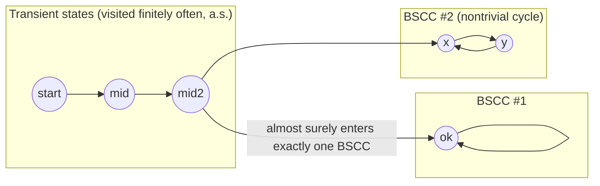

# Markov Chains and Probabilistic Verification

[[book-guidelines|↩ Back to guidelines]]

## Why probability, and why now

Every model so far in the book — transition systems, program graphs, timed automata — resolves uncertainty with **nondeterminism**: "the next state is *some* successor, we don't know which." That's the right tool when you genuinely don't know or don't care which branch is taken, or when you want a universal guarantee ("for *all* resolutions of the choice, the property holds"). But it is the wrong tool the moment you want to ask a question like: *what fraction of the time does this channel drop a message?*, or *what's the chance this randomized leader-election protocol terminates?* Nondeterminism only gives you yes/no answers — "it's possible" or "it's unavoidable" — never "how likely."

Concretely: take a lossy channel that drops a message with some small probability and retransmits until it succeeds. Model it as a transition system, and the CTL formula $\exists \Diamond \neg\text{delivered}$ ("there exists a run where the message is never delivered") is *true* — there is, after all, a nondeterministic execution that just keeps losing the message forever. But that fact is nearly useless for judging the protocol. What you actually want to know is that this bad run happens with probability *zero*, while successful delivery happens with probability *one* — and, quantitatively, that delivery happens within three retransmissions with probability $0.999$. Nondeterminism can't express any of this; it treats "always eventually drops the packet on a fair coin" the same as "always eventually drops the packet because the channel is physically severed." Probability is the refinement that separates these two situations.

Baier & Katoen's answer: keep the same state-based, automata-flavored machinery used throughout the book (states, labels, a satisfaction relation, $\exists/\forall$-style reasoning) but replace the nondeterministic transition relation with a **probability distribution over successors**. This is the **(discrete-time) Markov chain (MC)** — and, crucially, everything you'll build on it (linear equation systems for reachability, graph-theoretic components for long-run behavior) is designed to reduce back to techniques you already have: backward reachability, fixed-point computation, and SCC analysis.

## The core definition: Markov chains and the memoryless property

**What breaks without memorylessness.** If the "next state" distribution could depend on the *entire history* of how you got here, you'd lose everything that made transition systems tractable — no finite representation, no linear-algebraic reasoning, no fixed-point computation. The one structural commitment a Markov chain makes is that the future depends on the past **only through the present state** — this is the memoryless (Markov) property, and it's not a simplifying assumption bolted on afterward; it's baked into the definition itself.

**Definition 10.1 (Discrete-Time Markov Chain).** A Markov chain is a tuple $M = (S, P, \iota_{\text{init}}, AP, L)$ where:

- $S$ is a countable, nonempty set of states,
- $P : S \times S \to [0,1]$ is the **transition probability function**, satisfying $\sum_{s' \in S} P(s, s') = 1$ for every state $s$ — i.e., every row of $P$ is a distribution,
- $\iota_{\text{init}} : S \to [0,1]$ is the initial distribution, with $\sum_{s \in S} \iota_{\text{init}}(s) = 1$,
- $AP$ is a set of atomic propositions and $L : S \to 2^{AP}$ a labeling function, exactly as for transition systems.

$M$ is called finite if $S$ and $AP$ are finite. The row $P(s, \cdot)$ tells you where you can go from $s$ and with what likelihood; the column $P(\cdot, s)$ tells you what can enter $s$. For $T \subseteq S$, write $P(s, T) = \sum_{t \in T} P(s,t)$ for the one-step probability of landing somewhere in $T$. A state $s$ is **absorbing** if $P(s,s) = 1$ — once you're in, you never leave.

Where a transition system has $\text{Post}(s) = \{s' \mid s \xrightarrow{\alpha} s'\}$ for some action $\alpha$, a Markov chain has $\text{Post}(s) = \{s' \mid P(s,s') > 0\}$, and instead of *choosing* a successor, the system *samples* one according to $P(s,\cdot)$. Paths $\pi = s_0 s_1 s_2 \cdots$ are infinite sequences with $P(s_i, s_{i+1}) > 0$ for all $i$ — the underlying digraph (drop the probabilities, keep the edges where $P>0$) is exactly a transition system, and the book names this explicitly: $TS(M) = (S, \{\tau\}, \to, I, AP, L)$ with $s \xrightarrow{\tau} t$ iff $P(s,t) > 0$. This is the *qualitative* abstraction of $M$ — useful for asking "is this reachable at all," useless for asking "how likely."

**Rust [[Concurrency-and-Communication-Modeling#Grounding|grounding]].** The memoryless property is exactly what makes a Markov chain representable as a `HashMap<StateId, Vec<(StateId, f64)>>` rather than something history-indexed like `HashMap<Vec<StateId>, ...>`. The row-stochastic constraint is a runtime invariant you'd assert on construction:

```rust
struct MarkovChain {
    states: Vec<StateId>,
    // adjacency: for each state, its outgoing (successor, probability) pairs
    trans: Vec<Vec<(usize, f64)>>,
    init: Vec<f64>, // distribution over `states`
    labels: Vec<Vec<Prop>>,
}

impl MarkovChain {
    fn is_well_formed(&self) -> bool {
        self.trans.iter().all(|row| {
            let sum: f64 = row.iter().map(|(_, p)| p).sum();
            (sum - 1.0).abs() < 1e-9
        })
    }

    fn post(&self, s: usize) -> impl Iterator<Item = usize> + '_ {
        self.trans[s].iter().filter(|(_, p)| *p > 0.0).map(|(t, _)| *t)
    }
}
```

Notice `post` here throws away the probabilities and gives you exactly $TS(M)$ — the same struct serves both the qualitative graph view and the quantitative view, depending on which fields you read.

### Worked examples from the book

The book leans on four running examples worth internalizing, because each motivates a different later technique:

1. **A lossy communication protocol** (`start → try → {delivered, lost}`, with `lost → try` looping back): the natural home for reachability-probability computation (does the message *eventually* get through, and how fast?).
2. **Simulating a fair six-sided die with a fair coin** (Knuth–Yao): a tree of $\frac12/\frac12$ coin flips collapsing into six equiprobable absorbing outcomes — a clean illustration of how a probabilistic branching structure can realize an *exactly* prescribed target distribution.
3. **The dice game of craps**: nontrivial branching probabilities (e.g., $P(\texttt{start}, \texttt{won}) = \frac{2}{9}$ from the eight winning "come-out" combinations) that require the full apparatus (constrained reachability, iterative approximation) rather than hand computation.
4. **The IPv4 zeroconf protocol**: a real self-configuration protocol whose Markov chain has two absorbing outcomes, `ok` and `error` (address collision) — the running example for *qualitative* almost-sure reasoning later in the chapter.

## From "is it reachable" to "how likely is it": probability spaces over infinite paths

**What breaks without measure theory.** For a *finite* path fragment, "the probability of taking exactly this sequence of transitions" is just a finite product — no machinery needed. But most interesting events ("eventually delivered," "infinitely often reset") are properties of *infinite* paths, and there are uncountably many of those even in a two-state chain. You cannot assign a probability to each infinite path individually (most would have to be $0$, and uncountably many zeros don't sum sensibly) — you need to assign probabilities to *sets* of paths, and you need those sets to be closed under the Boolean operations ("not reaching," "reaching or reaching") you'll want to perform on them. That closure requirement is precisely what a $\sigma$-algebra buys you.

**Definition (informal, 10.9–10.10).** Outcomes are the infinite paths of $M$: $\text{Outc}_M = \text{Paths}(M)$. For a finite path fragment $\hat\pi = s_0 \cdots s_n$, the **cylinder set** $\text{Cyl}(\hat\pi)$ is the set of all infinite paths that start with $\hat\pi$ as a prefix — the natural "basic open set" of path space. The $\sigma$-algebra $E_M$ associated with $M$ is the smallest one containing every cylinder set. A unique probability measure $\Pr_M$ on $E_M$ is then pinned down by assigning cylinder sets their obvious probability:
$$
\Pr_M(\text{Cyl}(s_0 \cdots s_n)) = \iota_{\text{init}}(s_0) \cdot \prod_{0 \le i < n} P(s_i, s_{i+1}).
$$
Everything else — probabilities of "eventually reach $B$," "visit $B$ infinitely often," complements, countable unions — is *derived*, because those events are always expressible as countable combinations of cylinder sets, and a $\sigma$-algebra is exactly closed under those combinations. This is why the book bothers to prove, at some length, that events like $\Diamond B$ (reachability), $\Box\Diamond B$ (repeated reachability), and $\Diamond\Box B$ (persistence) are *measurable* — that guarantee is not automatic, it's the payoff of having built $E_M$ correctly.

**The load-bearing intuition, stripped of notation:** a cylinder set is "all the futures consistent with this observed prefix." Once you fix a finite prefix, its probability is a plain finite product — the memoryless property again — and every infinite-horizon question you'll ever ask reduces, in the limit, to a combination (union, complement, limit) of these finite-prefix probabilities. You never actually need to reason about an individual infinite path in isolation.

## Reachability probabilities: from infinite sums to linear equation systems

This is the chapter's first genuinely algorithmic payoff, and it's worth watching the derivation happen in three stages, because each stage discards a computational device the previous stage needed.

**Stage 1 — direct summation (impractical).** For the lossy-channel example, $\Pr(s \models \Diamond \texttt{delivered})$ literally sums over every finite retransmission count:
$$
\Pr^M(\Diamond\, \texttt{delivered}) = \sum_{n=0}^{\infty} \left(\tfrac{1}{10}\right)^n \cdot \tfrac{9}{10} = \frac{9/10}{1 - 1/10} = 1.
$$
This works here because the chain is simple enough to have a closed-form geometric series. It will not work for the craps game, where the branching structure has no such tidy closed form.

**Stage 2 — a linear equation system (the general technique).** Let $x_s = \Pr(s \models \Diamond B)$ be the unknown reachability probability from $s$. Case analysis on the first step gives, for every $s \notin B$ where $B$ is reachable at all:
$$
x_s = \sum_{t \in S \setminus B} P(s,t)\cdot x_t + \sum_{u \in B} P(s,u).
$$
In words: either you land in $B$ in one step (second sum), or you land in some non-$B$ state $t$ and then still need to reach $B$ from there (first sum, recursively using the very quantity you're solving for). Collect the "interesting" states $\tilde S = \text{Pre}^*(B) \setminus B$, and this system of equations for $(x_s)_{s \in \tilde S}$ is exactly the linear system
$$
(I - A)\, x = b, \qquad A = (P(s,t))_{s,t \in \tilde S}, \quad b_s = P(s, B).
$$
This is genuinely a *linear algebra* problem now — Gaussian elimination applies, once you've ensured $I - A$ is nonsingular (more on that below).

**Stage 3 — the least fixed point characterization (why it's *this* solution and not some other one).** $(I-A)x = b$ can have multiple solutions if $I - A$ is singular. The book resolves this by generalizing to **constrained reachability** $C \mathbin{U} B$ (reach $B$ while staying in $C$ until then — the probabilistic analogue of the CTL until operator) and proving:

**Theorem 10.15.** The probability vector $x = (\Pr(s \models C \mathbin{U} B))_{s \in S_?}$ is the **least fixed point** of $\Upsilon(y) = A y + b$ over $[0,1]^{S_?}$, and it is the limit of the monotone iteration $x^{(0)} = 0,\ x^{(n+1)} = \Upsilon(x^{(n)})$, where $x^{(n)}_s = \Pr(s \models C \mathbin{U}^{\le n} S_{=1})$ — the probability of reaching within $n$ steps.

**This is not a coincidence — it's the direct quantitative sibling of the CTL fixed point you already know.** Recall from Chapter 6 that $\exists(C \mathbin{U} B)$ is the *least* solution of the expansion law $\exists(C \mathbin{U} B) \equiv B \lor (C \land \exists\bigcirc \exists(C \mathbin{U} B))$, computed by the same kind of monotone backward iteration over sets, starting from $\emptyset$. Theorem 10.15 replaces "sets, ordered by $\subseteq$" with "probability vectors in $[0,1]^{S_?}$, ordered pointwise" and replaces "$\exists$ a successor in $X$" with "expected value over successors," but the fixed-point machinery — Kleene iteration from the bottom element, monotonicity guaranteeing convergence to the *least* fixed point — is identical. The reason the least (rather than some larger) fixed point is the *correct* answer both times is also the same: reachability is a property witnessed by *finite* evidence (a finite path to $B$), and finite-witness properties are always captured by the least fixed point, never a larger one — a state can spuriously satisfy a larger fixed point without any finite path actually reaching $B$ (Remark 10.18 constructs exactly such a spurious fixed point: a self-loop state with $x_t = x_t$ trivially satisfied by *every* value in $[0,1]$, when the correct answer is $x_t = 0$).

**Uniqueness (Theorem 10.19).** For finite $M$, if $S_{=0}$ is taken to be the *entire* set of states from which $B$ is CTL-unreachable (i.e., $S_{=0} = \text{Sat}(\neg\exists(C \mathbin{U} B))$, computable in $O(\text{size}(M))$ by a graph search — no probabilities needed for *this* part), then $(I-A)x = b$ has a **unique** solution, obtainable directly by Gaussian elimination instead of iterating to the limit. The proof is a nice piece of linear-algebra reasoning: it shows $A$ has no eigenvalue of magnitude $\ge 1$, so $I - A$ is invertible and, in fact, $(I-A)^{-1} = \sum_{n\ge 0} A^n$ (Remark 10.20) — the same Neumann-series idea that shows up whenever you're inverting "identity minus a substochastic/contracting operator."

**This is the same shape as Datalog/Constrained-Horn-Clause solving.** If you've built (or plan to build) a CHC solver or a fixed-point-based invariant generator: this section *is* that machinery, specialized to weighted (probabilistic) reachability instead of Boolean reachability. "Compute the least solution of $x = Ax + b$ over $[0,1]^n$ by Kleene iteration from $0$" is structurally the same computation as "compute the least model of a set of Horn clauses by iterating the immediate-consequence operator from $\emptyset$" — swap the semiring from $(\{0,1\}, \lor, \land)$ to $([0,1], +, \times)$ and [[Probabilistic-Computation-Tree-Logic#The algorithm|the algorithm]] doesn't change. This is exactly the kind of "same mechanism wearing different notation" the workbench's Static Analysis and SAT/SMT/CSP focus areas are tracking: reachability-as-fixed-point here is the probabilistic instance of the abstract-interpretation Kleene iteration you'd use for invariant generation, and the underlying equation system is the same linear/weighted-Horn-clause solving that shows up in constraint propagation.

```python
# Stage-2/3 in ~15 lines: Kleene iteration for reachability probabilities.
# States 0..n-1; trans[s] is a list of (successor, probability).
def reach_prob(trans, target, tol=1e-12, max_iter=10_000):
    n = len(trans)
    x = [1.0 if s in target else 0.0 for s in range(n)]
    for _ in range(max_iter):
        x_next = [
            1.0 if s in target else sum(p * x[t] for t, p in trans[s])
            for s in range(n)
        ]
        if max(abs(a - b) for a, b in zip(x, x_next)) < tol:
            return x_next
        x = x_next
    return x  # did not converge within max_iter — chain may be infinite/slow-mixing
```

This is deliberately the *iterative* (Stage 3) approach rather than a direct linear solve, because it's the one that generalizes to infinite Markov chains and mirrors the fixed-point story exactly; a production implementation would first compute $S_{=0}, S_{=1}$ by graph search (Theorem 10.19) and then hand $(I-A)x=b$ to a real linear solver for the finite, unique-solution case.

## Bottom strongly connected components and long-run behavior

Reachability probabilities answer "will it happen," parameterized by *how far you're willing to look*. Long-run behavior asks a different question: *forget the transient phase — where does the system end up living, forever, almost surely?* The answer turns out to require no probability arithmetic at all, only graph structure.

**Definition 10.26 (BSCC).** A **strongly connected component (SCC)** is a maximal set of states each reachable from every other. A **bottom SCC (BSCC)** is an SCC $T$ that, once entered, can never be left: $P(t, T) = 1$ for every $t \in T$. These are exactly the terminal SCCs of the underlying digraph — familiar from ordinary graph algorithms (Tarjan's SCC decomposition), just given a probabilistic reading.

**Theorem 10.25 (Probabilistic choice implies strong [[Fairness|fairness]]).** If a state $t$ is visited infinitely often along a path, then *almost surely* every finite path fragment starting at $t$ is also taken infinitely often. Consequence: for any successor $u$ of $t$, the transition $t \to u$ is taken infinitely often almost surely, given that $t$ recurs infinitely often. Randomization is, in effect, a *free* strong-fairness assumption — something Chapter 3 had to bolt onto nondeterministic transition systems by hand (recall the fairness hierarchy: unconditional/strong/weak) falls out automatically once every choice is probabilistic with nonzero weight.

**Theorem 10.27 (Limit behavior).** For every state $s$ in a *finite* Markov chain,
$$
\Pr^M_s\big(\{\pi \in \text{Paths}(s) \mid \text{inf}(\pi) \in \text{BSCC}(M)\}\big) = 1.
$$
That is: with probability $1$, the system eventually settles into *some* BSCC and then visits *every* state of that BSCC infinitely often. The proof leans directly on Theorem 10.25: if the set of infinitely-often-visited states weren't a BSCC, there'd be an escape edge out of it, and by strong fairness that edge would almost surely eventually be taken — contradiction.



This single theorem cracks open the whole qualitative side of the chapter:

- **Almost-sure reachability (Theorem 10.29).** $\Pr(s \models \Diamond B) = 1$ (for absorbing $B$) iff every state reachable from $s$ can still reach $B$ — i.e., $s \in S \setminus \text{Pre}^*(S \setminus \text{Pre}^*(B))$. Pure backward graph search, $O(\text{size}(M))$, **no probabilities examined**.
- **Qualitative constrained reachability (Corollary 10.31).** Both $S_{=0}$ and $S_{=1}$ for $C \mathbin{U} B$ are computable in linear time — $S_{=0}$ by a CTL-style backward search for $\neg\exists(C\mathbin{U}B)$, $S_{=1}$ by making $B$ and $S \setminus (C \cup B)$ absorbing and reducing to plain almost-sure reachability.
- **Qualitative repeated reachability (Corollary 10.33).** $\Pr(s \models \Box\Diamond B) = 1$ iff every BSCC reachable from $s$ intersects $B$ — check every reachable BSCC hits $B$, done.
- **Quantitative repeated reachability (Corollary 10.34).** Once you know *which* BSCCs count (those intersecting $B$), $\Pr(s \models \Box\Diamond B) = \Pr(s \models \Diamond U)$ where $U$ is the union of those BSCCs — repeated reachability *reduces to* ordinary reachability once the BSCC structure is known.
- **Persistence** $\Diamond\Box B$ is the mirror image: almost sure iff every reachable BSCC lies *entirely inside* $B$.

**The recipe, stated plainly:** decompose the reachable digraph into SCCs (a purely graph-theoretic, $O(|S| + |\to|)$ operation you already know from Tarjan/Kosaraju), classify each BSCC as "good" or "bad" relative to $B$, and then every qualitative question — reachability, repeated reachability, persistence, even $\omega$-regular liveness/fairness properties in general — reduces to *set membership among BSCCs*. The transition probabilities never enter the qualitative computation at all; they only reappear if you want a quantitative probability rather than a yes/no answer, at which point the BSCC-reachability reduction hands you back into Stage 2/3's linear-equation machinery.

**What breaks without finiteness.** Remark 10.35 is a deliberately unsettling coda: for infinite Markov chains, Theorem 10.27 is simply false. The example is a one-dimensional random walk ($P(n, n{+}1) = p$, $P(n, n{-}1) = 1-p$ for $n > 0$, with $0$ absorbing-ish at the boundary). For $p \le \frac12$ the walk returns to $0$ almost surely (recurrent); for $p > \frac12$ it drifts to infinity and $\Pr(n \models \Diamond 0) < 1$ while still being strongly connected in the graph-theoretic sense. Graph structure alone no longer determines the answer — the actual transition weights matter, because there's no finite BSCC to eventually trap the walk. This is the sharpest possible illustration of *why* the finite-BSCC machinery is doing real work rather than being a redundant detour: finiteness is exactly the hypothesis that turns "almost surely trapped somewhere" into a decidable, purely combinatorial question.

## Qualitative versus quantitative properties: the organizing distinction

Stepping back, the chapter's opening frames the whole enterprise around one dichotomy, and Section 10.1 is really the story of how each side gets its own algorithmic treatment:

| | **Qualitative** | **Quantitative** |
|---|---|---|
| **Asks** | Does this happen almost surely (prob. $1$) or almost never (prob. $0$)? | What *is* the probability (or an interval bound on it)? |
| **Example** | "The message is *eventually* delivered" (Example 10.13: prob. $1$ with no retransmission bound) | "The message is delivered *within 3 retransmissions* with probability $\ge 0.98$" |
| **Reduces to** | Graph analysis: BSCC classification, $\text{Pre}^*$/$\text{Post}^*$ searches | Linear equation systems / iterative fixed-point approximation over $[0,1]$ |
| **Complexity (finite $M$)** | Linear, $O(\text{size}(M))$ | Polynomial (linear system) or pseudo-polynomial in the step bound $n$ (bounded until) |
| **Ignores transition probabilities?** | Yes, entirely — only the support (nonzero) structure of $P$ matters | No — the actual weights are the object of computation |

Qualitative properties are the special case $J \in \{[0,0], [1,1]\}$ of a general quantitative bound; this framing is exactly what motivates Section 10.2's PCTL operator $P_J(\varphi)$ (out of this article's scope), which generalizes CTL's Boolean $\exists/\forall$ path quantifiers into a bound $J$ on a probability. The qualitative fragment recovers something CTL-shaped; the full quantitative logic is strictly more expressive — but that comparison belongs to the PCTL article.

## Where this leads

Section 10.1 is the load-bearing foundation for everything else in Chapter 10:

- **PCTL and PCTL\*** (10.2–10.4, separate article) add a formula-level probabilistic operator $P_J(\varphi)$ whose model-checking algorithm is *literally* "compute the reachability/until probabilities from this section, then compare against $J$" — Theorem 10.40's complexity bound is stated directly in terms of the machinery built here.
- **[[Probabilistic-Bisimulation-and-Markov-Reward-Models|Probabilistic bisimulation and Markov reward models]]** (10.4.2, 10.5) refine the equivalence and weight it by cost, but the underlying quotienting and expected-value computations are the same linear-algebraic backbone.
- **[[Markov-Decision-Processes|Markov decision processes]]** (10.6) reintroduce nondeterminism *on top of* probability; a scheduler resolves the nondeterminism, inducing an ordinary Markov chain — meaning every technique in this article (reachability via linear systems, BSCC-based long-run analysis) becomes the inner loop that MDP algorithms invoke once nondeterminism has been resolved.

**For the standing project:** this section is the cleanest illustration in the whole book of least-fixed-point reachability computation over a *weighted* domain rather than a Boolean one — directly transferable to the CSP kernel's domain/lattice propagation (`static-analysis`, `sat-smt-csp`) and to any Horn-clause-style invariant solver, since "iterate the immediate-consequence operator from the bottom element until convergence, and prove it's the *least* fixed point because the target property is witnessed by finite evidence" is exactly the argument you'll need whenever the abstract interpreter's fixed-point iteration needs a soundness proof, not just an implementation.
