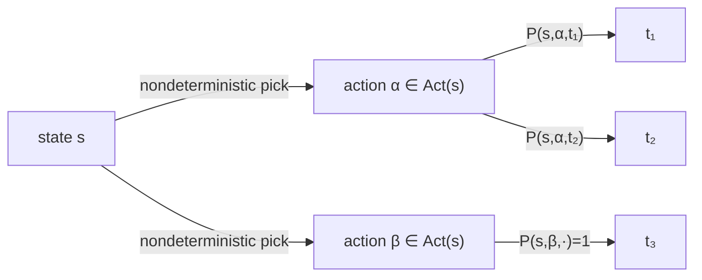
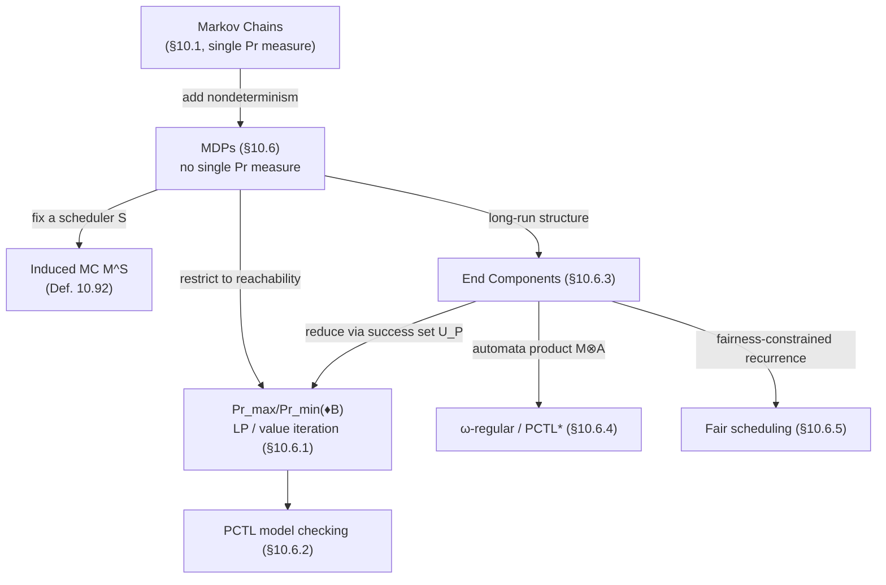

# Markov Decision Processes

[[book-guidelines|↩ Back to guidelines]]

## Why Markov chains aren't enough

A Markov chain commits to a single probability distribution over successors at every state. That's exactly right when the environment is genuinely stochastic and fully known — a lossy channel with a fixed drop probability, say. But two very different situations get flattened into "we don't know the exact probabilities":

1. **Interleaving concurrency.** When several processes run concurrently, the *scheduling* of which process moves next is not a random event with some frequency — it's an open choice that a real scheduler, adversary, or unknown environment resolves however it likes. Modeling it as "50/50" would be inventing information nobody has.
2. **Abstraction and unmodeled interfaces.** If you abstract a Markov chain by grouping states on the basis of atomic propositions rather than by probabilistic bisimulation, the transition probability between two groups is no longer a single number — it's a *range*. Similarly, a system's interface with its environment (a vending machine's customers, an adversarial scheduler) is often better treated as "could go either way" than assigned a made-up frequency.

The book's answer is to put nondeterminism and probability into the same model, layered rather than merged: at each state, first resolve a nondeterministic choice of *action*, then let that action's own fixed distribution pick the successor. This is a **Markov decision process (MDP)**. Markov chains become the special case where every state has exactly one available action — nondeterminism is switched off, and only sampling remains.

**What breaks without a two-layer model.** If you tried to encode nondeterminism-under-probability as a single flat probability distribution, you'd have to commit, at model-construction time, to a specific resolution policy that isn't actually part of the system's specification — baking an assumption about the scheduler into the model itself, silently. Keeping the two choices separate is what lets you later ask a worst-case question ("regardless of how the nondeterminism is resolved, does the good outcome still happen with high probability?") instead of an average-case one.

## The formal object: Definition 10.81

> **Definition 10.81 (Markov Decision Process).** An MDP is a tuple $M = (S, Act, P, \iota_{\text{init}}, AP, L)$ where:
> - $S$ is a countable set of states,
> - $Act$ is a set of actions,
> - $P : S \times Act \times S \to [0,1]$ is the transition probability function such that for all $s \in S, \alpha \in Act$: $\sum_{s' \in S} P(s,\alpha,s') \in \{0, 1\}$,
> - $\iota_{\text{init}} : S \to [0,1]$ is the initial distribution with $\sum_{s} \iota_{\text{init}}(s) = 1$,
> - $AP$ and $L : S \to 2^{AP}$ as usual.

An action $\alpha$ is **enabled** in $s$ iff $\sum_{s'} P(s,\alpha,s') = 1$ (not $0$ — every action is either "fully live" in a state or entirely absent, no partial availability). $Act(s)$ is the set of enabled actions, and it is *required* to be nonempty for every state — an MDP can never get stuck with no legal move. $\text{Post}(s,\alpha) = \{t \mid P(s,\alpha,t) > 0\}$ is the set of $\alpha$-successors.

Read operationally: land in state $s$; nondeterministically pick some $\alpha \in Act(s)$; then a random experiment governed by $P(s,\alpha,\cdot)$ selects the next state. Markov chains are exactly the MDPs where $|Act(s)| = 1$ for every $s$ — the action names become vestigial and can be dropped, so **Markov chains are a proper subset of MDPs**, not a separate formalism needing separate machinery.



**Rust [[Concurrency-and-Communication-Modeling#Grounding|grounding]].** The two-layer structure maps naturally onto a two-level lookup, and the invariant "every enabled action's row sums to exactly 1, every state has ≥1 enabled action" is exactly the kind of well-formedness check you'd assert once at construction time, mirroring `is_well_formed` for the Markov-chain case:

```rust
struct Mdp {
    states: Vec<StateId>,
    // per state: map from action to its (successor, probability) distribution
    trans: Vec<HashMap<ActionId, Vec<(StateId, f64)>>>,
    init: Vec<f64>,
    labels: Vec<Vec<Prop>>,
}

impl Mdp {
    fn enabled_actions(&self, s: usize) -> impl Iterator<Item = &ActionId> {
        self.trans[s].keys()
    }
    fn is_well_formed(&self) -> bool {
        self.trans.iter().enumerate().all(|(s, acts)| {
            !acts.is_empty() // Act(s) ≠ ∅ for all s
                && acts.values().all(|dist| {
                    let sum: f64 = dist.iter().map(|(_, p)| p).sum();
                    (sum - 1.0).abs() < 1e-9
                })
        })
    }
}
```

A Markov chain is then literally the special case `trans[s].len() == 1` for all `s` — no separate type needed, the same way the book treats it as a syntactic restriction rather than a different structure.

### Probmela: a modeling language for the two-layer structure

Just as (nano)Promela gives nondeterministic transition systems a guarded-command surface [[Timed-CTL-and-TCTL-Model-Checking#Syntax|syntax]], **Probmela** gives MDPs one. It keeps nanoPromela's core (assignments, `if–fi`, `do–od`, channel communication `c?x`/`c!expr`, atomic regions) and adds exactly three probabilistic primitives:

- **Random assignment** `x := random(V)`: picks $v \in V$ uniformly, i.e., with probability $1/|V|$ each.
- **Probabilistic choice** `pif [p₁] ⇒ stmt₁ … [pₙ] ⇒ stmtₙ fip`: a probabilistic analogue of `if–fi`, where branches are weighted by probabilities $p_i$ (summing to 1) rather than resolved by guards.
- **Lossy channels**: declaring a channel lossy with failure probability $p$ means `c!v` succeeds (inserts $v$) with probability $1-p$ and silently fails with probability $p$.

The nondeterminism in the resulting MDP comes from exactly the same source as in ordinary Promela: interleaving of concurrent processes, and any remaining `if`/`do` guard choices that are still guard-resolved rather than probabilistically resolved. A single Probmela process with no interleaving and only `pif` branching (e.g., the Knuth–Yao die-from-coin simulation) yields a plain Markov chain, since there's nothing left to resolve nondeterministically. Probmela is used purely as example-generation scaffolding in the book — Randomized dining philosophers, the alternating-bit protocol over a lossy channel, and randomized leader election are all specified this way and give MDPs whose correctness ("eventually only one leader remains," "eventually every hungry philosopher eats") becomes exactly the kind of scheduler-quantified reachability question this article builds up to.

## The central problem: an MDP has no single probability measure

Here is the fact that makes MDPs qualitatively different from Markov chains, and it's worth sitting with the book's own illustration. Suppose $s_0$ has two enabled actions: $\alpha$ tosses a fair coin, $\beta$ tosses a coin biased $\frac16/\frac56$. **What is the probability of eventually seeing tails?** The question is *senseless* as stated — it depends entirely on which action gets chosen, and nothing in the MDP specifies that. If $\alpha$ is chosen forever, the answer converges to something governed by a fair coin; if $\beta$ is chosen forever, by a biased one; and any interleaving of the two gives yet another answer. Unlike a Markov chain, whose transition function alone pins down $\Pr_M$ via cylinder sets, **an MDP's transition function underdetermines the probability measure over infinite paths** — nondeterminism has to be resolved *first*.

## Schedulers: what resolves the nondeterminism

> **Definition 10.91 (Scheduler).** A scheduler for $M$ is a function $\mathcal{S} : S^+ \to Act$ such that $\mathcal{S}(s_0 s_1 \cdots s_n) \in Act(s_n)$ for every finite path fragment $s_0 \cdots s_n$.

A scheduler looks at the entire history so far — not just the current state — and commits to an enabled action. (The literature also calls this an *adversary*, *policy*, or *strategy* — useful synonyms to recognize when this material shows up phrased in reinforcement-learning or game-theoretic terms.) A path $\pi = s_0 \xrightarrow{\alpha_1} s_1 \xrightarrow{\alpha_2} \cdots$ is an $\mathcal{S}$-path if every $\alpha_i$ actually matches what $\mathcal{S}$ would have picked given the prefix up to $s_{i-1}$.

**Fixing a scheduler collapses the MDP back into a Markov chain** — this is the crucial move, because it's what makes probability theory applicable again:

> **Definition 10.92 (Induced Markov Chain).** $M^{\mathcal{S}} = (S^+, P^{\mathcal{S}}, \iota_{\text{init}}, AP, L')$ where for $\sigma = s_0 \cdots s_n$: $P^{\mathcal{S}}(\sigma, \sigma s_{n+1}) = P(s_n, \mathcal{S}(\sigma), s_{n+1})$, and $L'(\sigma) = L(s_n)$.

The states of $M^{\mathcal{S}}$ are entire *histories* — this is why $M^{\mathcal{S}}$ is infinite even when $M$ is finite: it's the unfolding of $M$'s behavior tree under $\mathcal{S}$'s fixed resolution of nondeterminism. There is a one-to-one correspondence between $\mathcal{S}$-paths in $M$ and paths in $M^{\mathcal{S}}$, so all the machinery already built for Markov chains — the cylinder-set probability measure $\Pr^{M^{\mathcal{S}}}$, reachability, repeated reachability — transfers directly once you fix $\mathcal{S}$. Write $\Pr^{\mathcal{S}}(s \models \varphi)$ for the resulting probability under scheduler $\mathcal{S}$ starting at $s$.

Because ranging over *all* schedulers is what recovers worst-/best-case guarantees, the object of real interest is:
$$
\Pr^{\max}(s \models \Diamond B) = \sup_{\mathcal{S}} \Pr^{\mathcal{S}}(s \models \Diamond B), \qquad \Pr^{\min}(s \models \Diamond B) = \inf_{\mathcal{S}} \Pr^{\mathcal{S}}(s \models \Diamond B).
$$
This is precisely a worst-case analysis: the full class of schedulers covers every possible resolution of the nondeterminism, so bounding $\Pr^{\max}$ or $\Pr^{\min}$ is a statement that holds *regardless of how the nondeterminism gets resolved* — the probabilistic analogue of a $\forall$-quantified CTL guarantee.

**Grounding note (this is exactly a game-tree/search framing).** A scheduler is structurally a policy function over histories — precisely the object a Constraint Satisfaction / search-based reasoner would need to represent when searching for a counterexample resolution of nondeterminism that drives probability below (or above) a threshold. Computing $\Pr^{\max}$ or $\Pr^{\min}$ is a *verification-condition-style optimization*: it asks "does there exist a resolution of the open choices achieving/avoiding this probability bound," which is the same shape of question a CSP kernel asks when searching for a concrete counterexample assignment that breaks an invariant, except here the "assignment" is a policy rather than a valuation.

### Memoryless and finite-memory schedulers

Definition 10.91 is maximally general — an arbitrary, possibly uncomputable function of the entire history. The book's central technical payoff is that **this generality is never actually needed** for the properties of interest.

> **Definition 10.96 (Memoryless scheduler).** $\mathcal{S}$ is memoryless if $\mathcal{S}(s_0 \cdots s_n) = \mathcal{S}(t_0 \cdots t_m)$ whenever $s_n = t_m$ — the decision depends only on the *current* state, so $\mathcal{S} : S \to Act$.

> **Definition 10.97 (Finite-memory scheduler).** An fm-scheduler is a tuple $(Q, act, \Delta, start)$ where $Q$ is a finite set of *modes* (think: states of an auxiliary DFA), $act : Q \times S \to Act$ picks the action, $\Delta : Q \times S \to Q$ advances the mode, and $start : S \to Q$ picks a starting mode.

A memoryless scheduler is an fm-scheduler with $|Q|=1$. For finite $M$, the induced Markov chain of a memoryless scheduler is genuinely finite (state space $S$ itself), and for an fm-scheduler it's finite up to bisimulation (state space $S \times Q$) — this is what makes them algorithmically tractable, versus the infinite $M^{\mathcal{S}}$ that a general history-dependent scheduler produces.

**But memoryless schedulers are not always powerful enough.** Example 10.98 is the sharp counterexample: an MDP where state $s_0$ nondeterministically routes to either a lone-`a`-labeled loop or a lone-`b`-labeled loop. Every memoryless scheduler picks one branch forever, so $\Pr^{\mathcal{S}}(s_0 \models \Diamond a \wedge \Diamond b) = 0$ for *both* memoryless schedulers. Yet the (non-memoryless) fm-scheduler that alternates between the two branches every time it revisits $s_0$ achieves $\Diamond a \wedge \Diamond b$ almost surely. **What this shows**: memoryless schedulers suffice for *reachability* (Lemma 10.102 below) but not for general $\omega$-regular properties — you need at least finite memory once satisfaction depends on infinitely-repeated structure rather than a single target set.

(Randomized schedulers — returning a distribution over actions rather than a single one — are mentioned and then set aside: they can be approximated by deterministic ones and yield the same extremal probabilities, so nothing is lost by restricting attention to deterministic schedulers throughout.)

## Reachability probabilities (§10.6.1)

This is the workhorse computation: given target set $B \subseteq S$, compute $\Pr^{\max}(s \models \Diamond B)$ or $\Pr^{\min}(s \models \Diamond B)$ for every state $s$. Two facts anchor everything downstream: the answer is characterizable by a linear system, and a memoryless scheduler always suffices to *achieve* it.

### The equation system and its linear-programming reformulation

> **Theorem 10.100.** $(x_s)_{s \in S}$ with $x_s = \Pr^{\max}(s \models \Diamond B)$ is the *unique* solution of:
> - $x_s = 1$ if $s \in B$;
> - $x_s = 0$ if $s \not\models \exists\Diamond B$ (can't reach $B$ at all, even nondeterministically);
> - otherwise, $x_s = \max\left\{ \sum_{t} P(s,\alpha,t)\cdot x_t \;\middle|\; \alpha \in Act(s) \right\}$.

Compare this to the Markov-chain reachability equation you already know ($x_s = \sum_t P(s,t) x_t$): the only change is the outer $\max$ over enabled actions — the scheduler, at each state, picks whichever action locally maximizes expected reachability. This is a **Bellman-style optimality equation**, structurally identical to a value function in a discounted or reachability MDP as studied in reinforcement learning — worth naming explicitly since it's the same fixed-point shape.

> **Lemma 10.102 (Existence of optimal memoryless schedulers).** There exists a memoryless $\mathcal{S}$ achieving $\Pr^{\mathcal{S}}(s \models \Diamond B) = \Pr^{\max}(s \models \Diamond B)$ for *every* state $s$ simultaneously.

The proof is worth internalizing because it's not just "pick any action achieving the local max" — a subtlety the book flags explicitly: if $s$ has two actions both locally optimal, one might lead toward $B$ and the other might loop forever avoiding $B$, and picking the wrong one breaks reachability even though it satisfies the *equation*. The fix: restrict to the sub-MDP $M^{\max}$ keeping only locally-optimal actions, then select among *those* by shortest-path distance to $B$ in $M^{\max}$ — this guarantees the chosen action always makes strict progress toward $B$, not just local optimality.

**Value iteration.** Theorem 10.100 is a fixed-point equation, so it invites Kleene-style approximation from below:
$$
x_s^{(0)} = 0, \qquad x_s^{(n+1)} = \max\left\{ \sum_t P(s,\alpha,t)\cdot x_t^{(n)} \;\middle|\; \alpha \in Act(s)\right\},
$$
with $x_s^{(n)} \nearrow \Pr^{\max}(s \models \Diamond B)$ monotonically. This is exactly the probabilistic analogue of backward reachability fixed-point iteration in [[CTL-Model-Checking|CTL model checking]], just with $\max$-weighted-sum replacing set-union. A pleasant bonus: $x_s^{(n)} = \max_{\mathcal S} \Pr^{\mathcal S}(s \models \Diamond^{\le n} B)$ *exactly*, for every $n$ — so value iteration isn't merely converging to the right limit, each finite iterate has its own interpretation as a step-bounded reachability probability, achieved by an $n$-mode fm-scheduler.

> **Theorem 10.105 (Linear program).** $x_s = \Pr^{\max}(s \models \Diamond B)$ is the unique solution of: $x_s = 1$ ($s \in B$), $x_s = 0$ ($s \not\models \exists\Diamond B$), and otherwise $0 \le x_s \le 1$ with $x_s \ge \sum_t P(s,\alpha,t) x_t$ for every $\alpha \in Act(s)$ — subject to $\sum_s x_s$ **minimal**.

Why an *inequality* system plus a minimization, rather than just solving the equation system directly? Because the equation system's $\max$ is exactly what a linear inequality with a minimality side-condition encodes: any vector satisfying all the $\ge$-inequalities is an over-approximation of the true fixed point, and the *tightest* (sum-minimal) one collapses exactly onto the true solution — this is the standard LP encoding trick for turning a max-fixed-point into a linear program solvable by simplex or interior-point methods in polynomial time (Corollary 10.107). The min-reachability case (Theorem 10.109) is the dual construction: an equation system with $\min$ instead of $\max$, and correspondingly a maximization LP in Lemma 10.113 — reachability's floor rather than its ceiling.

### Qualitative analysis: the graph-only cases

Before solving any numeric linear system, it pays to identify the states where the answer is *forced* to $0$ or $1$ by pure graph reachability — this both simplifies the LP (removing already-known variables) and directly answers qualitative questions ("does $B$ hold almost surely?"). Three symbols matter:

- $S_{=1}^{\max} = \{s \mid \Pr^{\max}(s \models \Diamond B) = 1\}$ — computed by **Algorithm 45**, an iterative pruning of actions/states that provably can't reach $B$ under any scheduler, quadratic in the size of $M$.
- $S_{=0}^{\min} = \{s \mid \Pr^{\min}(s \models \Diamond B) = 0\}$ — computed by **Algorithm 46**, a linear-time backward closure: $T_0 = B$, $T_{n+1} = T_n \cup \{s \mid \forall \alpha \in Act(s)\, \exists t \in T_n.\, P(s,\alpha,t) > 0\}$ — a state joins once *every* enabled action has *some* chance of hitting the accumulated set.
- $S_{=1}^{\min}$ — characterized (Lemma 10.111) via the complement condition "some memoryless scheduler can avoid $B$ forever," reducible to a $\exists(\neg B \,\mathcal{U}\, T)$ reachability query in a derived sub-MDP $T$, itself computable in $O(\text{size}(M))$.

The recurring pattern — max-reachability needs "can $B$ be avoided by *some* choice," min-reachability needs "can $B$ be avoided by *some* memoryless scheduler acting consistently" — is the qualitative shadow of the quantitative $\max/\min$ asymmetry that runs through the whole section.

## PCTL model checking over MDPs (§10.6.2)

PCTL's *syntax* is unchanged from the Markov-chain setting (recall $P_J(\varphi)$, bounding the probability of a path formula $\varphi$ by an interval $J$). The *semantics* changes in exactly one place:
$$
s \models P_J(\varphi) \quad\text{iff}\quad \text{for all schedulers } \mathcal{S}\text{ for } M:\ \Pr^{\mathcal{S}}(s \models \varphi) \in J.
$$
Concretely: $s \models P_{\le p}(\varphi)$ iff $\Pr^{\max}(s \models \varphi) \le p$, and $s \models P_{\ge p}(\varphi)$ iff $\Pr^{\min}(s \models \varphi) \ge p$ — upper bounds are checked against the *worst-case-for-the-bound* extremal probability, lower bounds against the other extreme. For finite MDPs the $\sup$/$\inf$ are always achieved (max/min), because a finite-memory optimal scheduler always exists (Remark 10.114) — so strict bounds $<p$, $>p$ behave exactly as expected too.

**The model-checking algorithm is the Markov-chain algorithm with one substitution.** Recursively compute $\text{Sat}(\Psi)$ for state subformulae exactly as before; the only new step is computing $\text{Sat}(P_{\le p}(\Psi_1\,\mathcal{U}\,\Psi_2))$ by first computing $x_s = \Pr^{\max}(s \models \Psi_1\,\mathcal{U}\,\Psi_2)$ via §10.6.1's LP or value iteration (using $C = \text{Sat}(\Psi_1)$, $B = \text{Sat}(\Psi_2)$ — constrained reachability, Remark 10.114), then filtering $\{s \mid x_s \le p\}$. Overall time complexity (Theorem 10.115): $O(\text{poly}(\text{size}(M)) \cdot n_{\max} \cdot |\Phi|)$ — polynomial in the MDP, linear in formula length, and scaled by the largest step-bound $n_{\max}$ appearing in a step-bounded until.

### A genuinely new equivalence phenomenon

For Markov chains, $P_{\le p}(\varphi) \equiv_{MC} \neg P_{>p}(\varphi)$ trivially (a single probability is either $\le p$ or $>p$, nothing else to say). **This equivalence fails for MDPs**, and the reason is structurally important: $P_{\le p}(\varphi)$ universally quantifies over schedulers ("$\Pr^{\mathcal{S}} \le p$ for *all* $\mathcal{S}$"), while $\neg P_{>p}(\varphi)$ only says "not every scheduler exceeds $p$," i.e., "*some* scheduler achieves $\le p$" — a genuinely weaker statement once nondeterminism is present. In symbols: $\neg P_{>p}(\varphi)$ holds iff $\Pr^{\mathcal{S}}(s\models\varphi) \le p$ for *some* $\mathcal{S}$, not all. Consequently $P_{\le p}(\varphi) \equiv_{MDP} \neg P_{>p}(\varphi)$ is **not** valid — this is why the qualitative fragment for MDPs needs *four* independent operators $P_{=1}, P_{>0}, P_{<1}, P_{=0}$ (none derivable from the others), where for Markov chains two sufficed. This is also the mechanism behind Key Question 3 from the guidelines: it's exactly this scheduler-quantification gap that separates PCTL's qualitative fragment from CTL — $P_{>0}(\varphi)$ and $P_{=1}(\Diamond a)$ have no CTL equivalent, and $\exists\Box a$, $\forall\Diamond a$ have no qualitative-PCTL equivalent, because CTL's $\exists/\forall$ range over *paths* while PCTL's $P_J$ ranges over *schedulers* — a coarser, scheduler-mediated form of quantification that just happens to coincide with path quantification once nondeterminism disappears (Markov chains).

**[[CTL-Model-Checking#Counterexamples and witnesses|Counterexamples and witnesses]] generalize from paths to schedulers.** For CTL, a counterexample to $\forall\varphi$ is a witnessing path fragment. For MDPs, a counterexample to $P_{\le p}(\Psi_1 \mathcal{U} \Psi_2)$ (i.e., $\Pr^{\max} > p$) is a memoryless scheduler achieving that excess probability — the algorithms for computing $\Pr^{\max}$ construct such a scheduler *implicitly*, so extracting a counterexample is a byproduct, not extra work.

## Limiting behavior via end components (§10.6.3)

For Markov chains, the asymptotic-behavior anchor was: *almost every path eventually settles into a single BSCC and visits every state of it infinitely often* (Theorem 10.27). MDPs need a generalization that accounts for the scheduler, and the right structural notion is the **end component**.

> **Definition 10.116 (Sub-MDP).** A sub-MDP is a pair $(T, A)$ with $\emptyset \ne T \subseteq S$ and $A : T \to 2^{Act}$ such that $\emptyset \ne A(s) \subseteq Act(s)$ for $s \in T$, and — crucially — $s \in T, \alpha \in A(s) \Rightarrow \text{Post}(s,\alpha) \subseteq T$. This closure condition is what makes $(T,A)$ genuinely self-contained: once you commit to only ever using actions in $A$, you can never leave $T$.

> **Definition 10.117 (End component).** A sub-MDP $(T,A)$ is an end component iff its induced digraph $G_{(T,A)}$ is **strongly connected**.

This is the direct MDP analogue of a BSCC: probabilistically closed (Definition 10.116's closure condition mirrors "no outgoing edges" from a BSCC) *and* strongly connected (mirrors a BSCC's single-class recurrence structure), but parameterized by which *actions* are permitted per state, since more than one action might be available at a state within the same end component.

**Every end component is achievable as a recurrent set.** Lemma 10.119 constructs, for any end component $(T,A)$, a finite-memory scheduler that round-robins through $A(s)$ at each $s \in T$ — cycling through the available actions so that eventually every enabled action gets taken infinitely often — and thereby guarantees $\Pr^{\mathcal{S}}(\Box T \wedge \bigwedge_{t \in T} \Diamond t) = 1$: staying in $T$ forever while visiting every state of $T$ infinitely often, almost surely. The round-robin is essential, not incidental — a scheduler that only ever picked one action per state, even from an end component, could in principle keep the walk confined to a strict strongly-connected sub-part and never realize the whole component's recurrence.

> **Theorem 10.120 (Limiting Behavior of MDPs).** For every state $s$ and *every* scheduler $\mathcal{S}$: $\Pr^{\mathcal{S}}_s\{\pi \mid \text{Limit}(\pi) \in EC(M)\} = 1$,

where $\text{Limit}(\pi) = (T, A)$ collects the states visited infinitely often ($T$) and, for each such state, the actions taken infinitely often there ($A$). This is the precise generalization of "almost every path ends up in a BSCC" — here, **regardless of which scheduler resolves the nondeterminism**, almost every path's infinite tail traces out *some* end component. The proof idea transfers the Markov-chain argument directly: if a state-action pair $(t,\alpha)$ recurs infinitely often and $P(t,\alpha,u) > 0$, then $u$ is visited infinitely often almost surely too (geometric tail bound $(1-p)^n \to 0$) — so the recurrent set is automatically closed under the actions taken infinitely often within it, which is exactly the end-component closure condition.

### From limit LT properties to reachability

An LT property $P$ is a **limit LT property** if satisfaction depends only on which labelings recur infinitely often, not their order — repeated reachability $\Box\Diamond a$, persistence $\Diamond\Box b$, strong [[Fairness|fairness]], and Rabin conditions all qualify. Because Theorem 10.120 pins the relevant recurrent sets to end components, one can decide $T \models P$ once per end component and then reduce the whole quantitative question to *ordinary reachability* of the union of "good" end components:

> **Theorem 10.122.** Let $U_P$ = union of state sets of all end components $(T,A)$ with $T \models P$ (the **success set**), and $V_P$ analogously for $\neg(T \models P)$. Then:
> $$\Pr^{\max}(s \models P) = \Pr^{\max}(s \models \Diamond U_P), \qquad \Pr^{\min}(s \models P) = 1 - \Pr^{\max}(s \models \Diamond V_P).$$

This is a genuinely elegant reduction: an apparently infinitary, order-independent, $\omega$-regular question ("what's the probability the long-run recurrent structure is *good*") collapses to §10.6.1's finite, purely reachability-based apparatus — LP or value iteration, once $U_P$/$V_P$ are computed by graph analysis. Both extrema are achieved by finite-memory schedulers, so the whole theory stays within the tractable scheduler class.

**Sub-MDP terminology worth flagging for the Downstream connections below:** this "restrict to a strongly-connected, probabilistically-closed core, then reduce global behavior to reachability of that core" pattern is structurally the *same move* as reducing CTL$^*$/LTL model checking on ordinary transition systems to reachability of accepting states in a product automaton (Chapter 9) — end components are simply the probabilistic analogue of "accepting SCC" in that construction.

## Linear-time properties and PCTL$^*$ (§10.6.4)

Arbitrary $\omega$-regular $P$ (not just limit LT properties) is handled by the same **automata-product** idea used for Markov chains, but now with an *MDP* product instead of a Markov-chain product:

> **Notation 10.128 (Product MDP).** For finite $M$ and a deterministic Rabin automaton $\mathcal{A} = (Q, 2^{AP}, \delta, q_0, Acc)$ with $Acc = \{(L_1,K_1),\ldots,(L_k,K_k)\}$, $M \otimes \mathcal{A}$ has state space $S \times Q$, transitions that step $M$ and $\mathcal{A}$'s automaton state in lockstep (deterministically, on $\mathcal{A}$'s side), and labels each state by its current automaton state $q$.

The key fact making this work is a **one-to-one correspondence between schedulers for $M$ and for $M \otimes \mathcal{A}$** — a scheduler for the product just ignores the automaton component, and any scheduler for $M$ lifts uniquely (finite-memory-preservingly) to the product. Under this correspondence, $\text{trace}(\pi) \in \mathcal{L}^\omega(\mathcal{A})$ becomes exactly a Rabin acceptance condition $\bigvee_i (\Box\Diamond \neg L_i \wedge \Box\Diamond K_i)$ on the product — a limit LT property, so Theorem 10.122's machinery from the previous subsection applies directly:
$$
\Pr^{\max}_M(s \models P) = \Pr^{\max}_{M \otimes \mathcal{A}}(\langle s, \delta(q_0, L(s))\rangle \models \Diamond U_{\mathcal{A}}).
$$
The complexity is polynomial in $|M|$ but **double-exponential in $|\varphi|$** when $P$ is given as an LTL formula — the same blow-up source as Markov chains (LTL-to-DRA), and the book confirms optimality: the qualitative MDP model-checking problem ("$\Pr^{\max}(s \models \varphi) = 1$?") is **2EXPTIME**-complete (Theorem 10.129, Courcoubetis–Yannakakis), strictly harder in the worst case than the **PSPACE**-complete Markov-chain analogue — nondeterminism costs an exponential jump in complexity here, mirroring how LTL model checking on transition systems is already PSPACE while CTL is polynomial. PCTL$^*$ model checking then layers on top exactly as for Markov chains: bottom-up replacement of maximal state subformulae by fresh atomic propositions, then one LTL-style quantitative check per $P_J(\varphi)$.

## Fairness (§10.6.5)

A striking asymmetry closes the chapter section. Probabilistic choices are *automatically* almost-surely fair — any action taken infinitely often visits each of its successors infinitely often almost surely (this was already used inside the proof of Theorem 10.120). But **nondeterministic choices carry no such guarantee** — a scheduler is free to ignore one process's actions forever, e.g. always favoring process 2's moves in the randomized mutual-exclusion protocol, defeating any liveness guarantee for process 1.

> **Definition 10.130 (Fair scheduler).** $\mathcal{F}$ is fair w.r.t. an LTL fairness assumption $\textit{fair}$ if $\Pr^{\mathcal{F}}_s\{\pi \mid \pi \models \textit{fair}\} = 1$ for every state $s$.

Two results give the asymmetry its precise shape:

- **Fairness is irrelevant for $\Pr^{\max}$** (Lemma 10.131): $\sup_{\mathcal{F}\text{ fair}} \Pr^{\mathcal{F}}(s \models C\,\mathcal{U}\,B) = \Pr^{\max}(s \models C\,\mathcal{U}\,B)$, achieved by a fair fm-scheduler. Intuitively: an unfair optimal scheduler can always be "patched" to become fair after it has already achieved reachability, without lowering the probability, by splicing in a fair scheduler on the (measure-zero) event that it never does. This mirrors the transition-system fact that realizable fairness doesn't matter for *safety* properties (Theorem 3.55) — reaching $B$ via $C$ is itself a safety-flavored event.
- **Fairness is essential for $\Pr^{\min}$.** The book's counterexample: a state $s$ with actions $\alpha \to t$ (target) and $\beta \to$ self-loop; strong fairness $\Diamond u \to \Diamond t$ (vacuously true along the $\beta$-loop, since $u$ is never visited) forces $\Pr^{\min}(s \models \Diamond b) = 0$ under unconstrained schedulers, but **every** fair scheduler must eventually take $\alpha$, giving $\inf_{\mathcal{F}\text{ fair}} \Pr^{\mathcal{F}}(s \models \Diamond b) = 1$ — an enormous gap between the fair and unfair answers.

The reduction that recovers computability: $F_{=0}^{\min} = \{t \mid \Pr^{\mathcal{F}}(t \models \Diamond B) = 0 \text{ for some fair } \mathcal{F}\}$ is characterized (Lemma 10.132) via end components that are simultaneously $B$-avoiding *and* fair ($T \cap B = \emptyset$, $T \models \textit{fair}$) — reusing exactly the end-component machinery from §10.6.3. Theorem 10.133 then expresses fair-minimal reachability entirely via *unconstrained* maximal reachability of a derived constrained-until property, and Theorem 10.134 gives the cleanest possible closing statement: fair satisfaction reduces to ordinary satisfaction by conjoining/implying the fairness assumption directly into the formula —
$$
\min_{\mathcal{F}\text{ fair}} \Pr^{\mathcal{F}}(s \models \varphi) = \Pr^{\min}(s \models \textit{fair} \to \varphi), \qquad \max_{\mathcal{F}\text{ fair}} \Pr^{\mathcal{F}}(s \models \varphi) = \Pr^{\max}(s \models \textit{fair} \wedge \varphi).
$$
So fairness, despite looking like an extra layer of semantic bookkeeping, ultimately costs nothing beyond an implication/conjunction inside the formula being checked — everything downstream is still the ordinary (unfair) MDP machinery already built.

## Synthesis: where this sits, and where it leads



**Upstream.** Everything here presupposes Markov chains' probability-measure machinery (cylinder sets, the $\sigma$-algebra over paths) — fixing a scheduler is precisely what re-enables that machinery, since $M^{\mathcal{S}}$ is a bona fide Markov chain. PCTL's syntax and its Markov-chain semantics (covered elsewhere) is reused verbatim; only the interpretation of $P_J(\cdot)$ changes.

**Downstream.** Nothing past this section within Chapter 10 depends further on MDPs specifically — this is the chapter's capstone generalization, unifying reachability, PCTL, limiting behavior, $\omega$-regular verification, and fairness under one nondeterministic-probabilistic model.

**For the compiler/elaborator project (`static-analysis`, `sat-smt-csp`, `automated-reasoning`).** Three threads are worth carrying forward explicitly:

1. **Extremal fixed-point computation is the probabilistic sibling of abstract-interpretation fixed points.** Theorem 10.100's max-equation-system and its LP reformulation are *exactly* the shape of a Bellman/value-iteration computation over an abstract lattice with a $\max$/$\min$ join — the same fixed-point-with-widening intuition that underlies invariant generation via abstract interpretation, just instantiated over $[0,1]$-valued reachability probabilities instead of an abstract domain's partial order. If the compiler ever needs to reason about probabilistic or "worst-case over an adversarial scheduler" program behavior (e.g., randomized algorithms under a Hoare-triple-style contract), this is the fixed-point template to reuse.
2. **Schedulers as counterexample witnesses is a CSP-shaped idea.** Extracting a memoryless scheduler that violates $P_{\le p}(\varphi)$ is structurally the same task as the CSP kernel searching for a concrete counterexample assignment that violates a type invariant — both are "find a concrete resolution of an open choice space that witnesses a bound violation," and both come essentially free once the underlying optimization (LP here, constraint solving there) has already been run to find the extremal value.
3. **End components are the SCC/accepting-cycle detection pattern, generalized.** The whole "reduce a global $\omega$-regular/limit property to reachability of a syntactically-restricted recurrent core" strategy (end components → success set → ordinary reachability) is the same architecture as reachability-analysis-via-SCC-condensation in dataflow analysis, and directly the probabilistic analogue of the automata-product/accepting-SCC reduction used for LTL model checking on ordinary transition systems — recognizing this shared shape is the main transferable insight, more than any MDP-specific formula.
