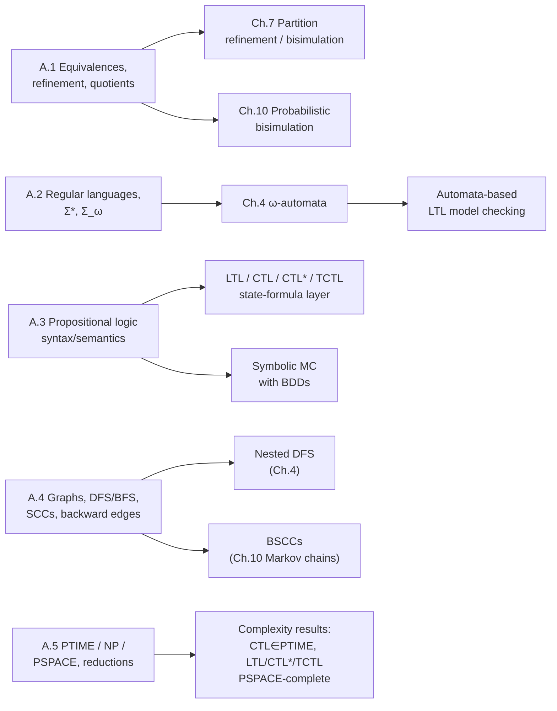

[[book-guidelines|↩ Back to guidelines]]

## Why this appendix earns a deep-dive

Appendix A is the book's toolbox, assembled in one place precisely so the other 900 pages
don't have to keep re-deriving it. That's also why it reads differently from every other
chapter in this vault: there is no single motivating problem, no running example, no
narrative arc. It's five short reference sections — notation, formal languages, propositional
logic, graphs, complexity theory — each answering a "what do I need to already know before
Chapter $N$ makes sense" question for a *different* later chapter.

The payoff of reading it carefully rather than skimming it as a glossary is that each
piece of machinery here is the literal ancestor of a named algorithm or complexity result
elsewhere in the book:

- **Equivalence refinement** (A.1) is the abstract shape of every **partition-refinement**
  algorithm the book builds later — bisimulation minimization of transition systems
  (Ch. 7) and probabilistic bisimulation of Markov chains both *are* algorithms that
  compute successively finer partitions and stop when refinement is no longer possible.
- **Regular languages and regular expressions** (A.2) are the syntactic seed of
  **$\omega$-automata theory** (Ch. 4) — the whole apparatus of Büchi automata and
  LTL-to-automata translation is "what happens to regular-expression-style reasoning when
  words become infinite."
- **Propositional logic's [[Timed-CTL-and-TCTL-Model-Checking#Syntax|syntax]]/semantics split** (A.3) is reused wholesale as the
  *state-predicate layer* underneath every temporal logic in the book (LTL, CTL, CTL$^*$,
  TCTL all extend propositional logic with temporal operators rather than reinventing
  atomic reasoning from scratch).
- **Graph traversal and SCCs** (A.4) underlie **nested depth-first search** for LTL
  model checking (Ch. 4) and the notion of a **bottom/terminal SCC** that shows up again
  as *bottom strongly connected components (BSCCs)* driving the long-run behavior of
  Markov chains (Ch. 10).
- **Deterministic vs. nondeterministic algorithms and PTIME/NP/PSPACE** (A.5) are the
  yardstick the book measures every model-checking algorithm against — [[CTL-Model-Checking|CTL model checking]]
  is shown PTIME-complete, LTL/CTL$^*$/PSPACE-complete satisfiability results and
  TCTL model checking's PSPACE bounds all cash out this section's definitions directly.

The sections below follow the book's own five-part structure (A.1–A.5), each opened with
the "why do I need this" framing before the formal statement — matching the book's own
compression while still explaining the motivating gap each construct fills.

---

## A.1 Relations, Equivalences, and Partitions

### The problem this solves

Model checking is obsessed with one recurring question: *when are two states/systems
"the same" for the purposes I care about?* Not literally identical — two states of a
traffic light and a semaphore might be "the same" behaviorally while having completely
different internal representations. You need a precise, composable notion of sameness
that (a) can be *coarser or finer* depending on how much detail you care about, and
(b) can be *computed* by an algorithm that iteratively distinguishes states until it
stabilizes. That's exactly what an equivalence relation, its equivalence classes, and the
refinement order between different equivalences give you.

### The formalism

A relation is just a set of tuples: for $k \geq 1$ and sets $X_1, \dots, X_k$, any subset
of $X_1 \times \dots \times X_k$ is a $k$-ary relation. For a binary relation $R$ on $X$
(written infix, $xRy$ for $(x,y) \in R$):

- **transitive**: $xRy \land yRz \Rightarrow xRz$
- **reflexive**: $xRx$ for all $x$
- **symmetric**: $xRy \Rightarrow yRx$
- **antisymmetric**: $xRy \land yRx \Rightarrow x = y$

An **equivalence relation** is transitive, reflexive, and symmetric. Its **equivalence
class** $[x]_R = \{y \in X \mid xRy\}$ groups together everything $R$-equivalent to $x$;
the **quotient space** $X/R = \{[x]_R \mid x \in X\}$ collects all these classes, and the
**index** of $R$ is $|X/R|$ — the number of classes ("finite index" if that's finite).
Crucially:
$$xRy \iff [x]_R = [y]_R \iff [x]_R \cap [y]_R \neq \emptyset$$
so the quotient space is always a partition: pairwise disjoint, nonempty, exhaustive.

**Refinement** is the ordering that makes "coarser/finer" precise: for two equivalences
$R, R'$ on $X$, $R$ is a refinement of $R'$ if $R \subseteq R'$ — meaning $R$ distinguishes
*more* elements than $R'$ (fewer pairs are related, so a smaller relation is the *finer*
one — an easy place for the notation to feel backwards on first read). $R$ is then said to
be **finer** than $R'$, and $R'$ **coarser** than $R$. If $R$ refines $R'$, every $R$-class
sits inside exactly one $R'$-class, and $|X/R'| \leq |X/R|$: refining a partition can only
grow (or hold steady) the number of blocks, never shrink it.

The **transitive-reflexive closure** $R^*$ of a relation $R$ is the smallest transitive,
reflexive relation containing $R$: $R^* = \bigcup_{n \geq 0} R^n$ where $R^0$ is the
identity and $R^{n+1}$ composes $R^n$ with $R$ one more step. If $R$ is symmetric, $R^*$
is automatically an equivalence.

A **preorder** is just reflexive + transitive (no symmetry required) — think "can reach"
or "simulates," where $A$ can relate to $B$ without $B$ relating back to $A$. Every
preorder $R$ has a canonical equivalence lurking inside it, its **kernel**
$R \cap R^{-1} = \{(x,y) \mid xRy \text{ and } yRx\}$ — "equivalent under the preorder"
means "each simulates/reaches the other."

### Grounding

In Rust, an equivalence relation over a finite set is most naturally realized as a
union-find (disjoint-set) structure — `find` implements $[x]_R$, and two elements being
in the same set *is* $xRy$:

```rust
struct UnionFind { parent: Vec<usize> }

impl UnionFind {
    fn find(&mut self, x: usize) -> usize {
        if self.parent[x] != x {
            self.parent[x] = self.find(self.parent[x]); // path compression
        }
        self.parent[x]
    }
    fn union(&mut self, a: usize, b: usize) {
        let (ra, rb) = (self.find(a), self.find(b));
        if ra != rb { self.parent[ra] = rb; } // merging two classes = coarsening
    }
}
```

Note the direction: `union` always makes the relation *coarser* (fewer, bigger classes —
never finer). A **partition-refinement** algorithm runs the opposite direction — it starts
coarse (often one giant block, "all states are equivalent until proven otherwise") and
*splits* blocks apart based on a distinguishing test, which is exactly why "refine" means
"go from few classes to more."

### Where this leads

This is the single most load-bearing subsection in the appendix for the rest of the book.
[[Partition-Refinement-Algorithms|Partition refinement]] (Ch. 7) for computing bisimulation
quotients of transition systems, and its probabilistic analogue for
[[Markov-Chains-and-Probabilistic-Verification|Markov chains]], are both literally: start
with the coarsest partition consistent with a labeling function, repeatedly split blocks
that fail a "successors agree" test, and terminate when no block splits further — i.e.,
when the current partition has reached its *finest* stable refinement. The
finer-than/coarser-than vocabulary from A.1 is exactly the vocabulary
[[Simulation-Preorders-and-Equivalence|simulation preorders and their kernels]] and
[[Bisimulation-Equivalence|bisimulation equivalence]] are stated in.

---

## A.2 Formal Languages

### The problem this solves

Once you're reasoning about system *behavior* rather than a single state, you need a way
to talk about sequences of observations — an execution trace is a word over some alphabet
of observable events or states. Regular languages give the simplest sufficiently
expressive way to describe *sets* of such traces symbolically (via regular expressions)
rather than by enumeration, and this machinery is the direct ancestor of the automata
theory the book needs once traces become infinite (which almost all interesting system
behaviors are).

### The formalism

An **alphabet** $\Sigma$ is a finite, nonempty set of symbols. A **word** over $\Sigma$ is
a finite or infinite sequence of symbols; the length-0 word is the **empty word** $\varepsilon$.
$\Sigma^*$ is all finite words, $\Sigma^\omega$ all infinite words, $\Sigma^+ = \Sigma^* \setminus \{\varepsilon\}$
the nonempty finite ones. A **language** is a set of finite words, $L \subseteq \Sigma^*$.

- **Prefix**: $v$ is a prefix of $w = A_1 \dots A_n$ if $v = A_1 \dots A_i$ for some $i \leq n$.
- **Suffix**: $v = A_i \dots A_n$ for some $i \geq 1$; for infinite $\sigma = A_0 A_1 \dots$
  the suffix starting at index $j$ is written $\sigma[j..]$.
- **Subword**: $A_i \dots A_j$ for $i \leq j$.

**Concatenation** glues words together by juxtaposition ($BA \cdot AAB = BAAAB$); lifted
to languages pointwise, $L_1.L_2 = \{w_1.w_2 \mid w_1 \in L_1, w_2 \in L_2\}$. **Kleene
star** $w^* = \{w^i \mid i \in \mathbb{N}\}$ (finite repetition, includes $\varepsilon$),
and $w^+ = w^* \setminus \{\varepsilon\}$ excludes it. Lifted to languages,
$L^* = \bigcup_{i \geq 0} L^i$, $L^+ = \bigcup_{i \geq 1} L^i$.

**Regular expressions** are defined inductively over $\Sigma$: $\emptyset$ and
$\varepsilon$ are regular expressions; each symbol $A \in \Sigma$ is one; and if $E, E_1,
E_2$ are regular expressions, so are $E_1 + E_2$ (union), $E_1.E_2$ (concatenation), and
$E^*$ (Kleene star) — with $E^+$ an abbreviation for $E.E^*$. The semantics is a language
$L(E)$:
$$L(\emptyset) = \emptyset, \quad L(\varepsilon) = \{\varepsilon\}, \quad L(A) = \{A\}$$
$$L(E_1 + E_2) = L(E_1) \cup L(E_2), \quad L(E_1.E_2) = L(E_1).L(E_2), \quad L(E^*) = L(E)^*$$

A language $L$ is **regular** if $L = L(E)$ for some regular expression $E$. For example,
$E = (A+B)^*.B.B.(A+B)^*$ over $\Sigma = \{A,B\}$ denotes exactly the finite words
containing the subword $BB$.

### Grounding

The inductive regex definition is a textbook ADT-plus-recursive-evaluator pattern:

```rust
enum Regex<A: Eq + Clone> {
    Empty,                              // ∅
    Epsilon,                            // ε
    Symbol(A),                          // a single letter
    Union(Box<Regex<A>>, Box<Regex<A>>),        // E1 + E2
    Concat(Box<Regex<A>>, Box<Regex<A>>),       // E1.E2
    Star(Box<Regex<A>>),                        // E*
}
```
The book's $L(\cdot)$ semantics is precisely the recursive `fn language(&self) -> ...`
evaluator you'd write over this enum — union maps to `.union()`, concatenation to the
pairwise-product set-builder, star to the language closure. This is worth internalizing
now: it is *exactly* the same inductive-syntax-plus-denotational-semantics pattern
Section A.3 reuses for propositional logic and the book reuses again for every temporal
logic.

### Where this leads

$\Sigma^\omega$ (infinite words) and the leap from regular-expression-style finite-word
reasoning to acceptance conditions over infinite runs is exactly what
[[Automata-over-Finite-and-Infinite-Words|$\omega$-automata]] formalize, which in turn
underlie [[Automata-Based-LTL-Model-Checking|automata-based LTL model checking]]
(translating an LTL formula into a Büchi automaton whose language is the formula's
infinite-word models).

---

## A.3 Propositional Logic

### The problem this solves

Every temporal logic in the book — LTL, CTL, CTL$^*$, PCTL, TCTL — is propositional
logic *plus temporal operators*. None of them re-derive what "and," "not," satisfaction,
or a truth-table-style semantics mean; they all inherit it from here. Getting the
syntax/semantics separation crisp in this appendix means every later logic chapter can
just say "as in A.3" for the propositional core and spend its own pages entirely on the
*new* temporal operators.

### The formalism

Given a finite set $AP$ of atomic propositions, the set of **formulae** is defined
inductively:

1. $\mathit{true}$ is a formula.
2. Any $a \in AP$ is a formula.
3. If $\Phi_1, \Phi_2, \Phi$ are formulae, so are $(\neg\Phi)$ and $(\Phi_1 \land \Phi_2)$.
4. Nothing else is a formula.

This is compactly restated as a BNF grammar — the **abstract syntax** convention the book
uses throughout:
$$\Phi ::= \mathit{true} \mid a \mid \Phi_1 \land \Phi_2 \mid \neg\Phi$$

Derived operators are defined by abbreviation, not as new syntax:
$$\Phi_1 \lor \Phi_2 \;\overset{\text{def}}{=}\; \neg(\neg\Phi_1 \land \neg\Phi_2) \qquad
\Phi_1 \to \Phi_2 \;\overset{\text{def}}{=}\; \neg\Phi_1 \lor \Phi_2$$
$$\Phi_1 \leftrightarrow \Phi_2 \;\overset{\text{def}}{=}\; (\neg\Phi_1 \land \neg\Phi_2) \lor (\Phi_1 \land \Phi_2) \qquad
\Phi_1 \oplus \Phi_2 \;\overset{\text{def}}{=}\; (\neg\Phi_1 \land \Phi_2) \lor (\Phi_1 \land \neg\Phi_2)$$

The **length** $|\Phi|$ of a formula counts its operators (used throughout the book for
stating algorithm complexity in terms of formula size, e.g. LTL-to-automaton translation
being exponential in $|\varphi|$).

**Semantics** requires fixing an interpretation of the atomic propositions: an
**evaluation** $\mu: AP \to \{0,1\}$. The **satisfaction relation** $\models$ is then
defined inductively:
$$\mu \models \mathit{true} \qquad
\mu \models a \iff \mu(a) = 1 \qquad
\mu \models \neg\Phi \iff \mu \not\models \Phi \qquad
\mu \models \Phi \land \Psi \iff \mu \models \Phi \text{ and } \mu \models \Psi$$

Note the shape: **syntax first (what a formula *is*, structurally), semantics second
(what it *means*, relative to an interpretation)**. This syntax/semantics split, stated
once here for the simplest possible logic, is the exact template every later chapter's
"Syntax of LTL" / "Semantics of LTL" pair of sections follows.

Evaluations correspond to subsets of $AP$ ($A_\mu = \{a \mid \mu(a)=1\}$), which lets the
book write $A \models \Phi$ interchangeably with $\mu_A \models \Phi$ — a convenience used
constantly when talking about which *sets* of atomic propositions satisfy a state formula.

Two formulae are **(semantically) equivalent**, $\Phi \equiv \Psi$, if they agree under
every evaluation. Standard laws hold: double negation, idempotency, commutativity,
associativity, absorption, De Morgan, distributivity (Figure A.3 in the book). $\Phi$ is
**satisfiable** if some $\mu \models \Phi$, **valid**/a **tautology** if *every*
$\mu \models \Phi$, and **unsatisfiable** otherwise — with the duality
$\Phi$ unsatisfiable $\iff \neg\Phi$ valid.

A **literal** is $a$ or $\neg a$. **Positive normal form (PNF)** pushes negation down to
literals only (via De Morgan + double negation), keeping both $\land$ and $\lor$ as basic
operators: $\Phi ::= \mathit{true} \mid \mathit{false} \mid a \mid \neg a \mid \Phi_1 \land \Phi_2 \mid \Phi_1 \lor \Phi_2$.
**CNF** ($\bigwedge_i \bigvee_j lit_{i,j}$) and **DNF** ($\bigvee_i \bigwedge_j lit_{i,j}$)
further specialize PNF, and every propositional formula has an equivalent CNF and an
equivalent DNF (via the distributivity laws).

### Grounding

The syntax-as-ADT / semantics-as-recursive-function pattern, in Rust:

```rust
enum Formula {
    True,
    Atom(String),
    Not(Box<Formula>),
    And(Box<Formula>, Box<Formula>),
}

fn eval(mu: &impl Fn(&str) -> bool, phi: &Formula) -> bool {
    match phi {
        Formula::True => true,
        Formula::Atom(a) => mu(a),
        Formula::Not(f) => !eval(mu, f),
        Formula::And(f1, f2) => eval(mu, f1) && eval(mu, f2),
    }
}
```
`eval` *is* the book's $\models$ relation, made total and executable — this is the direct
shape of the model-checking labeling procedures used throughout the book for
propositional sub-formulae of CTL/LTL state formulae.

In Lean, this correspondence is worth naming explicitly: `Formula` as an `inductive` type
and `eval` as a `def` by structural recursion is precisely how Lean itself represents
object-level propositional syntax before any tactic or decision procedure touches it, and
`Φ ≡ Ψ` (semantic equivalence under all evaluations) is what you'd prove with a `decide`-style
finite case-check or an explicit `Iff` proof over `∀ μ, ...` — the propositional skeleton
underneath any later definitional-equality argument about richer formulae.

### Where this leads

This section is the base case for **every** logic in the book: LTL and CTL's state formulae
are literally propositional formulae over $AP$; TCTL adds [[Real-Time-Systems-and-Timed-Automata#Clock constraints|clock constraints]] on top of the
same propositional core. The CNF/DNF and PNF machinery resurfaces directly in
[[Symbolic-Model-Checking-with-Binary-Decision-Diagrams|BDD-based symbolic model checking]]
(BDDs are, in effect, a canonical, shared representation squeezed out of exactly this
propositional syntax), and SAT/validity/satisfiability as defined here are the decision
problems whose complexity (A.5) anchors the book's PSPACE and NP-completeness results.

---

## A.4 Graphs

### The problem this solves

A transition system *is* a graph — states are vertices, transitions are edges — so every
question about "can the system reach a bad state," "does it loop forever," or "is this
part of the system decoupled from the rest" is, underneath, a graph-reachability, cycle-detection,
or SCC-decomposition question. This section fixes the vocabulary and states the
generic reachability algorithm skeleton that DFS and BFS are both instances of, so later
chapters can describe model-checking algorithms as graph algorithms without re-deriving
graph theory each time.

### The formalism

A **digraph** $G = (V, E)$ has vertices $V$ and an edge relation $E \subseteq V \times V$.
$\mathit{Post}(v) = \{w \mid (v,w) \in E\}$ (direct successors), $\mathit{Pre}(v) = \{w \mid (w,v) \in E\}$
(direct predecessors); $v$ is **terminal** if $\mathit{Post}(v) = \emptyset$.

A **path** is a sequence $v_0 v_1 \dots$ with $v_{i+1} \in \mathit{Post}(v_i)$; **simple**
if vertices are pairwise distinct. $\mathit{Post}^*(v)$ (also written $\mathit{Reach}(v)$)
is the set of all vertices reachable from $v$ via some finite path. A **cycle** is a finite
path $v_0 \dots v_r$ with $v_0 = v_r$, $r > 0$; $G$ is **acyclic** if it has none.

**Reachability analysis** (Algorithm 48 in the book) is stated as a generic
explore-and-frontier skeleton: maintain explored set $R$ and to-explore multiset $U$,
repeatedly pull an unexplored successor of some $v \in U$, and add unvisited successors to
both $R$ and $U$. **DFS and BFS are the same algorithm with different data structures for
$U$**: DFS uses a stack (LIFO), BFS a queue (FIFO). With an adjacency-list representation
the time complexity is $\Theta(N+M)$ where $N=|V|$, $M=|E|$.

DFS additionally supports **cycle detection via backward edges**: an edge $(v,u)$ is a
*backward edge* if $u$ is still on the DFS stack when $(v,u)$ is explored. The key fact:
**$G$ has a cycle iff DFS finds a backward edge** — and restricting to a fixed start vertex
$v_0$, $v_0$ lies on a cycle iff DFS finds a backward edge back to $v_0$ specifically. This
single fact is the seed of nested DFS on-the-fly LTL model checking (see below).

A set $C \subseteq V$ is **strongly connected** if every pair $v, w \in C$ is mutually
reachable ($v \in \mathit{Post}^*(w)$ and $w \in \mathit{Post}^*(v)$). A **strongly
connected component (SCC)** is a *maximal* strongly connected set. An SCC $C$ is
**trivial** if $C = \{v\}$ and $(v,v) \notin E$ (a single non-self-looping vertex); it is
**terminal** if no edge leaves $C$ for a different SCC. Fact: **$G$ is cyclic iff it has a
nontrivial SCC.** SCCs are computable in $\Theta(N+M)$ time via a DFS variant.

Also defined: (directed) **trees** (unique root $v_0$ with $\mathit{Pre}(v_0)=\emptyset$,
unique path from $v_0$ to every vertex; father/son terminology; finitely-branching and
binary-tree special cases), the **Hamiltonian path** problem (a path visiting every
vertex exactly once — flagged here specifically because A.5 uses it as an NP-hardness
example), and **undirected graphs** (edges as unordered 2-element subsets, with cycles
required to be simple to rule out trivial back-and-forth "cycles" $v\,w\,v$).

### Grounding

The reachability-skeleton-with-swappable-container idea is naturally a generic function
over a trait in Rust — DFS and BFS become the same code with a `VecDeque` used two
different ways:

```rust
use std::collections::{HashSet, VecDeque};

fn reach(v0: usize, post: impl Fn(usize) -> Vec<usize>, dfs: bool) -> HashSet<usize> {
    let mut r: HashSet<usize> = [v0].into_iter().collect();
    let mut u: VecDeque<usize> = VecDeque::from([v0]);
    while let Some(v) = if dfs { u.pop_back() } else { u.pop_front() } {
        for w in post(v) {
            if r.insert(w) { u.push_back(w); }  // insert() returns true iff w was new
        }
    }
    r
}
```
`dfs=true` pops from the back (stack/LIFO); `dfs=false` pops from the front (queue/FIFO) —
exactly the book's "same skeleton, different $U$" framing. Backward-edge cycle detection
needs the DFS *on-stack* set kept separate from the *ever-visited* set `r`, which is the
standard three-color (white/gray/black) DFS refinement most algorithms textbooks add on
top of this two-set version.

### Where this leads

This is the second most load-bearing section for the rest of the book. **Nested DFS**
(Ch. 4) for automata-based LTL model checking is a direct generalization of the
backward-edge cycle check above: it looks for a reachable cycle through an accepting state
in the product of the transition system and a Büchi automaton, using exactly the "DFS
finds a backward edge back to a distinguished vertex" fact stated here. **SCC
decomposition** reappears twice: once as an alternative (Tarjan-style) algorithm for LTL
model checking (checking whether any accepting SCC is nontrivial), and once, renamed,
in [[Markov-Chains-and-Probabilistic-Verification|Markov chain theory]] (Ch. 10), where a
**bottom SCC (BSCC)** — the probabilistic analogue of a *terminal* SCC defined here — is
exactly the structure that determines a Markov chain's long-run/steady-state behavior.
The Hamiltonian path problem, introduced almost as an aside here, is the reduction target
A.5 uses to build up its chain of NP-hardness results.

---

## A.5 Computational Complexity

### The problem this solves

Once the book proves a model-checking algorithm exists, the next question is always "how
expensive is it, and can it be done cheaper?" Answering that rigorously requires a
yardstick that doesn't depend on implementation details — Turing machines, abstracted here
into "deterministic algorithm" and "nondeterministic algorithm" — and named complexity
classes (PTIME, NP, PSPACE) that every later chapter's complexity theorem is stated
relative to.

### The formalism

The classes here classify **decision problems** — finite input, "yes"/"no" answer.
Running examples introduced explicitly: **SAT** (is a propositional formula satisfiable?),
the **Hamiltonian path problem**, the **cycle problem**, and **pattern matching**.

A **deterministic algorithm** has, at every configuration, a uniquely determined next step
(or halt). It **solves** a decision problem $P$ if for every input $w$: the computation
terminates and returns the correct answer. Time complexity $T_A: \mathbb{N} \to \mathbb{N}$
is the worst-case step count as a function of input size; space complexity $S_A$ analogously
for memory.

A **nondeterministic algorithm** may have several possible next steps per configuration
(so several possible computations per input). It solves $P$ if, for every input $w$:
**(1)** all computations terminate; **(2a)** if the correct answer is "yes," *at least one*
computation says "yes"; **(2b)** if the correct answer is "no," *all* computations say
"no." This is the **asymmetry** worth sitting with: nondeterminism gets to be lucky on the
"yes" side (one witnessing computation suffices) but must be unanimous on the "no" side
(every guess must fail to witness a "yes"). The book's own nondeterministic SAT algorithm
(guess an evaluation $\mu$, then deterministically check $\mu \models \Phi$) is the
canonical "guess and check" pattern this asymmetry is built for: guessing right proves
satisfiability outright; guessing wrong proves nothing (there might be a better guess), so
"no" is only correct when *every* guess fails.

**Complexity classes:**
- **PTIME (P)**: decision problems solvable by a deterministic polytime algorithm
  ($T_A(n) = O(\mathit{poly}(n))$).
- **NP**: solvable by a *nondeterministic* polytime algorithm.
- **PSPACE**: solvable by a *deterministic* polyspace algorithm.
- **NPSPACE**: solvable by a *nondeterministic* polyspace algorithm — and it's a
  (nontrivial, cited without proof) fact that $\text{PSPACE} = \text{NPSPACE}$.

Since a deterministic algorithm is a degenerate nondeterministic one, and $N$ steps use at
most $N$ memory units:
$$\text{PTIME} \subseteq \text{NP} \subseteq \text{PSPACE} = \text{NPSPACE}$$
Whether PTIME $=$ NP, and whether NP $=$ PSPACE, are (still, as of the book, and today)
open problems.

**coNP** is the class of problems whose *complement* (swap "yes"/"no") is in NP. Because
"yes" and "no" are symmetric for deterministic algorithms, $\text{PTIME} = \text{coPTIME}$
and $\text{PSPACE} = \text{coPSPACE}$ — but the same argument does *not* go through for NP,
because of exactly the (2a)/(2b) asymmetry above. Whether NP $=$ coNP is open.
$\text{PTIME} \subseteq \text{coNP} \subseteq \text{PSPACE}$.

Beyond polynomial resources: **EXPTIME** (deterministic, time bounded by $2^{p(n)}$) and
**2EXPTIME** (bounded by $2^{2^{p(n)}}$), with $\text{PSPACE} \subseteq \text{EXPTIME}
\subseteq \text{2EXPTIME}$.

**Reducibility and completeness.** $Q$ is **polynomially reducible** to $P$ if a polytime
deterministic transformation maps every input $w_Q$ to an input $w_P$ preserving the
yes/no answer. $P$ is **NP-hard** if every $Q \in \mathrm{NP}$ reduces to it; **NP-complete**
if additionally $P \in \mathrm{NP}$. Membership proofs are typically easy (exhibit a
guess-and-check nondeterministic algorithm); hardness proofs typically go by reduction from
a problem already known to be hard:
$$Q \text{ NP-hard}, \; Q \leq_p P \;\Rightarrow\; P \text{ NP-hard}$$
Cook's theorem: SAT is NP-complete (the seed result). The book sketches the reduction
chain SAT $\to$ 3SAT $\to$ Hamiltonian path $\to$ three-coloring, each step an example of
this technique. The same completeness apparatus generalizes to other classes —
**PSPACE-complete** (example given: the regular-expression *universality* problem, "does
$L(E) = \Sigma^*$?") and **coNP-complete** (example: propositional *validity*, via the
reduction $\Phi \to \neg\Phi$ from SAT, using the A.3 duality that $\Phi$ is unsatisfiable
iff $\neg\Phi$ is valid).

### Grounding

The "guess and check" pattern is worth writing out once in Rust as a genuinely
nondeterministic-*shaped* (if not asymptotically nondeterministic) brute-force SAT solver,
to make the (2a)/(2b) asymmetry concrete: [[Probabilistic-Computation-Tree-Logic#The algorithm|the algorithm]] below enumerates *all* guesses
rather than nondeterministically picking one, so it's a deterministic simulation of the
nondeterministic algorithm, exponential instead of "polynomial with lucky branching" —
exactly the gap NP is defined to abstract away:

```rust
fn brute_force_sat(vars: &[String], phi: &Formula) -> bool {
    let n = vars.len();
    for bits in 0u32..(1 << n) {
        let mu = |a: &str| {
            let idx = vars.iter().position(|v| v == a).unwrap();
            (bits >> idx) & 1 == 1
        };
        if eval(&mu, phi) { return true; } // one witnessing guess suffices — this is (2a)
    }
    false // every guess failed — this is (2b)
}
```

### Where this leads

This section supplies the *units of measurement* for essentially every complexity claim
later in the book: CTL model checking is PTIME (in $|TS| \cdot |\Phi|$); LTL satisfiability
and model checking are PSPACE-complete; CTL$^*$ model checking is PSPACE-complete; TCTL
model checking over timed automata is also shown PSPACE-complete (via the region
construction). Every one of those results is a direct instance of "exhibit a
polyspace/polytime algorithm, then show hardness by reduction" — the exact two-step recipe
defined here. The NP/PSPACE-completeness proof technique (reduction chains from SAT and
from the universality problem) is reused nearly verbatim when the book proves hardness for
these logics' decision problems.

---

## Synthesis: why an appendix is worth its own article



The reason this appendix rewards close reading rather than a glance is that it isn't
generic background — each subsection is load-bearing for a *specific* named result
elsewhere in the book, and the book's later chapters lean on this vocabulary without
re-explaining it. Concretely for the standing project goals this vault tracks
(`static-analysis`, `sat-smt-csp`): the **equivalence-refinement machinery (A.1)** is the
same abstract pattern as computing a Galois-connection-derived abstract domain's
canonical representatives — a partition-refinement loop is structurally an
abstract-interpretation fixed-point computation with a finite lattice of partitions instead
of a numeric/relational abstract domain. The **deterministic-vs-nondeterministic /
guess-and-check framing (A.5)** is precisely the conceptual seed of the CSP kernel's job
described in this workbench's learning goals: proving bug *absence* is the "for all
computations" (2b)-shaped deterministic/PTIME-style over-approximation regime, while
searching for a concrete counterexample is the "at least one" (2a)-shaped
nondeterministic/NP-style regime — model checking's PTIME/PSPACE landscape is the same
absence-vs-presence asymmetry the abstract-interpretation-plus-CSP architecture is built
around, just instantiated for temporal-logic decision problems instead of program
invariants.
