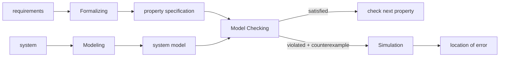

# Model Checking Fundamentals

[[book-guidelines|↩ Back to guidelines]]

## Why verification is a first-class engineering problem before it is a technique

Before the book gives you a single formal definition, it spends its first six pages making an economic and safety argument, and that argument is worth taking seriously because it explains *why model checking looks the way it does*. The Pentium II FDIV bug cost Intel roughly $475 million. A software error in Denver airport's baggage system delayed the airport's opening for nine months at $1.1 million/day. The Therac-25 radiation-therapy machine's control software killed six patients between 1985 and 1987 through a race condition between operator input and beam calibration. Ariane-5 self-destructed 36 seconds after launch because a 64-bit floating-point value was converted into a 16-bit integer that couldn't hold it.

None of these were "hard" bugs in the sense of requiring deep mathematical insight to describe. They were the kind of error that a sufficiently exhaustive check would have caught. That observation — that whole classes of catastrophic failures come from *unexplored corners of a state space*, not from exotic logic — is the entire motivation for model checking. If you're building a verifier, a type checker, or an abstract interpreter, this is the same motivation you inherit: the value of your tool is proportional to how much of the space of possible behaviors it actually covers, not how clever any one check is.

The book also gives you a piece of engineering economics that generalizes past model checking specifically: the cost of fixing a defect grows roughly two orders of magnitude between design time and field deployment (design-phase fixes: ~$1,000; field-discovered fixes: ~$12,500, in the book's cited data, with software maintenance fixes cited elsewhere at ~500× a design-time fix). This is the same argument for static verification broadly — a refinement-type checker or an abstract interpreter that catches a violated invariant at compile time is not just "nice to have," it is capturing that same cost gradient.

## What a "verification technique" actually promises

The book is careful — almost legalistic — about what verification does and doesn't claim. Its running definition of the whole enterprise:

> System verification is used to establish that the design or product under consideration possesses certain properties... A defect is found once the system does not fulfill one of the specification's properties. The system is considered to be "correct" whenever it satisfies all properties obtained from its specification.

The load-bearing sentence, stated explicitly as a standalone principle in the text, is:

> **Correctness is always relative to a specification, and is not an absolute property of a system.**

This sounds almost too obvious to state, but it has real teeth. "This program is correct" is meaningless without an implicit "...with respect to *this* specification." If your specification is incomplete, a "correct" result is vacuous outside the properties you actually stated. This is precisely the distinction a type system draws too: a well-typed program isn't a *correct* program, it's a program that satisfies the specific invariants the type system encodes. A Rust program that type-checks can still divide by zero, deadlock, or violate a business invariant the type system never saw — same caveat, different formalism.

**[[Concurrency-and-Communication-Modeling#Grounding|Grounding]] (Rust).** Think of a specification as any predicate the toolchain is willing to check mechanically. A trait bound is a (very restricted) specification:

```rust
fn sorted_insert<T: Ord>(v: &mut Vec<T>, x: T) {
    let pos = v.binary_search(&x).unwrap_or_else(|e| e);
    v.insert(pos, x);
}
```

`T: Ord` is a specification that the compiler checks exhaustively over *all* possible instantiations of `T` — that's a form of model checking's "systematic, exhaustive" character, just restricted to a much narrower property (a total order exists) than a temporal-logic formula. The function is "correct" relative to that bound; it says nothing about whether `binary_search`'s preconditions are met by every caller, which would need a richer specification (a refinement type, a Hoare contract) to state and check.

## Verification versus validation

The book draws a distinction that's easy to blur and that it insists on keeping sharp:

> **Verification** amounts to check that the design satisfies the requirements that have been identified, i.e., verification is "check that we are building the thing right." In **validation**, it is checked whether the formal model is consistent with the informal conception of the design, i.e., validation is "check that we are verifying the right thing."

Model checking is a *verification* technology: given a formal model and a formal property, it can exhaustively determine whether the model satisfies the property, with mathematical certainty (modulo tool bugs and resource limits — see below). It has essentially nothing to say about *validation*: whether that formal model and that formal property actually correspond to what the engineer meant, or to what the real system does. Validation is comparatively informal — inspection, review, testing the model against intuition — and the book flags it as a genuinely hard problem that model checking doesn't touch.

This distinction maps directly onto a familiar split in verification tooling: a type checker or SMT-backed verifier can *prove* your annotated preconditions/postconditions hold given the code — that's verification. It cannot tell you that the precondition you wrote captures what you actually wanted the function to do. Writing `requires x > 0` when you meant `requires x >= 0` is a validation failure the checker will happily "verify" past.

**Grounding (Lean).** This split is exactly the elaborator/kernel distinction pushed one level up. Lean's kernel *verifies* that a term has the type it claims (trusted, small, exhaustive checking against fixed typing rules). Whether the *statement* (the type) you asked it to check is [[Liveness-Properties-and-the-Safety-Liveness-Decomposition#The theorem|the theorem]] you actually wanted to prove is a validation question no kernel can answer — that's why theorem statements themselves get reviewed by humans, the same way model-checking specifications do.

## The model-checking process: three phases, one exhaustive core

The book's central definition, given as a boxed principle:

> **Model checking is an automated technique that, given a finite-state model of a system and a formal property, systematically checks whether this property holds for (a given state in) that model.**

Three structural facts are packed into this sentence, each with consequences:

1. **Finite-state.** The technique is fundamentally an exhaustive-search procedure over a finite object. This is why it terminates (unlike, say, general theorem proving) but also why its Achilles' heel — as you'll see below — is the *size* of that finite object.
2. **A formal property.** The property has to be stated in a language precise enough to be checked mechanically — the book's chosen language family, developed over the rest of the book, is temporal logic (LTL, CTL, CTL*, TCTL, PCTL). Temporal logic is introduced here as "an extension of traditional propositional logic with operators that refer to the behavior of systems over time" — the "model" in "model checking" is literally the model-theoretic sense: checking that a structure (the transition system) is a model of a logical formula.
3. **Systematically checks.** No sampling, no heuristic coverage target — every relevant state gets examined.

The book decomposes the resulting workflow into three named phases (Figure 1.4 in the source, reproduced here structurally):



- **Modeling phase.** Build the system model in the checker's modeling language; run a quick simulation as a sanity check (catches the crude modeling errors cheaply, before the expensive exhaustive run); formalize the property in the property-specification language.
- **Running phase.** Execute the model checker — "a solely algorithmic approach in which the validity of the property under consideration is checked in all states of the system model."
- **Analysis phase.** Three possible outcomes, each with a distinct next action:
  - *Property satisfied* → move to the next property.
  - *Property violated* → the checker returns a **counterexample**; analyze it, then determine whether the root cause is a **modeling error** (the model doesn't reflect the real design — fix the model, and note that this can invalidate previously-passed properties, forcing re-verification), a **design error** (the system itself is wrong — fix the design), or a **property error** (the formalized property doesn't capture the intended informal requirement — fix the property; since the model didn't change, previously-verified properties don't need re-checking).
  - *Out of memory* → the state space didn't fit; apply reduction, abstraction, or symbolic techniques (the subject of the book's Chapters 6–8) and retry.

The book also names a fourth, non-technical activity threaded through all three phases: **verification organization** — version control over models, properties, and results, because a real verification effort produces many model variants, many properties, and many diagnostic traces that need to stay traceable to each other.

**What breaks without the modeling-error/design-error/property-error distinction.** If you don't triage *why* a check failed, you risk one of two failure modes: (a) "fixing" a property until it stops complaining (masking a real design error as a property error), or (b) endlessly re-verifying already-passed properties every time you touch the model, because you never separated "the model changed" from "the property changed." Both are productivity sinks that show up constantly in real CI-integrated verification pipelines, not just textbook model checking.

## Counterexamples as debugging information, not just a failure signal

The book is emphatic that a counterexample is not merely a "no": it's the single feature that distinguishes model checking's diagnostic value from black-box pass/fail testing.

> If a state is encountered that violates the property under consideration, the model checker provides a counterexample that indicates how the model could reach the undesired state. The counterexample describes an execution path that leads from the initial system state to a state that violates the property being verified.

Concretely, a counterexample is a finite execution — a path from an initial state, through the transition relation, to a violating state — that the user can replay in a simulator to understand exactly what went wrong. This is listed later as one of model checking's core *strengths*: "it provides diagnostic information in case a property is invalidated; this is very useful for debugging purposes." Contrast this with, e.g., a random test failure, which tells you *that* an input broke the system but not necessarily a minimal, causally-clear trace of *why*.

**Worked illustration from the book (Example 1.1, concurrency and atomicity).** Three concurrent processes share an integer `x`:

```
proc Inc   = while true do if x < 200 then x := x + 1 fi od
proc Dec   = while true do if x > 0   then x := x - 1 fi od
proc Reset = while true do if x = 200 then x := 0     fi od
```

The intended invariant is $0 \le x \le 200$ at all times. It looks true by inspection — but it isn't, because the test-then-act sequences aren't atomic. A counterexample scenario: $x = 200$; `Dec` tests $x > 0$ (passes) but hasn't yet decremented; `Reset` interleaves, tests $x = 200$ (passes), and resets $x$ to $0$; control returns to `Dec`, which now decrements the *already-reset* value, producing $x = -1$. The invariant is violated, and the violating trace — the specific interleaving of the three processes' steps — *is* the counterexample. This is the book's first demonstration that concurrency bugs are fundamentally about *interleavings* that a sequential reading of the code would never surface, which is exactly why exhaustive state exploration (rather than "read the code carefully") is the right tool.

**Grounding (Rust).** This is precisely the shape of a data race a borrow checker *cannot* see, because it's a runtime interleaving issue over shared mutable state behind, say, a `Mutex` — the type system guarantees no data race at the memory-safety level (no two threads touch the same memory without synchronization) but says nothing about the *logical* atomicity of the check-then-act pattern above:

```rust
use std::sync::{Arc, Mutex};

fn dec(x: &Mutex<i64>) {
    let val = *x.lock().unwrap();   // read
    if val > 0 {
        // <-- another thread's Reset can run here, between read and write
        *x.lock().unwrap() -= 1;    // write
    }
}
```

Rust's type system prevents the *unsynchronized* version of this bug (you cannot forget the lock) but not the *logical race* above, where each critical section is individually safe yet the composition is wrong. Finding this kind of bug is exactly what a model checker's exhaustive interleaving search — not a type system — is built for; it's also exactly the kind of property (`always $0 \le x \le 200$`, an *invariant* in the book's later terminology, Chapter 3) that a CTL/LTL model checker is designed to check by exploring every possible schedule.

**Grounding (Python — quick sketch, not load-bearing).** A five-line brute-force interleaving explorer makes the same point without Rust's ceremony:

```python
from itertools import permutations

def step(x, action):
    if action == 'inc' and x < 200: return x + 1
    if action == 'dec' and x > 0:   return x - 1
    if action == 'reset' and x == 200: return 0
    return x

for order in permutations(['dec', 'reset']):
    x = 200
    for a in order:
        x = step(x, a)
    assert 0 <= x <= 200, f"counterexample: x=200, order={order} -> x={x}"
```

Running this immediately produces the assertion failure for `order = ('dec', 'reset')` — a two-line "counterexample" for a toy version of the book's example. Real model checkers do this exhaustively over the full nondeterministic interleaving space of arbitrarily many processes, using the automata-theoretic and symbolic machinery developed over the rest of the book (Chapters 4, 6, 8), not brute enumeration.

## Strengths and weaknesses: the same mechanism cuts both ways

The book lists these as two separate bullet lists, but the deeper point — flagged explicitly in the guidelines' own key questions — is that **the strengths and the central weakness both derive from the same "explore everything" strategy.** Exhaustiveness is what makes model checking unbiased toward *likely* errors (unlike testing, which concentrates effort where developers expect bugs) — but exhaustiveness over a state space that grows exponentially in the number of variables and concurrent components is also *exactly* what produces the **state-space explosion problem**, the book's declared central obstacle (developed fully in Chapter 2 and addressed across Chapters 6–8).

**Strengths (verbatim structure from the book):**
- General applicability — hardware, software, embedded systems alike.
- **Partial verification** — properties are checked individually; no complete specification is required before you can start getting value.
- Insensitivity to error likelihood — unlike testing/simulation, which are statistically biased toward probable failure modes.
- Diagnostic counterexamples (discussed above).
- Potential for "push-button" automation — doesn't inherently require deep user expertise to *run* (though setting up good models/properties does).
- Sound mathematical basis — grounded in graph algorithms, data structures, and logic, not heuristics.

**Weaknesses:**
- Poor fit for data-intensive systems (state explodes over large/infinite data domains) — this is precisely the gap that abstract interpretation and SMT-backed symbolic techniques exist to close.
- Decidability limits for infinite-state systems or undecidable/semi-decidable abstract-data-type reasoning.
- **Verifies the model, not the system** — a direct restatement of "any verification using model-based techniques is only as good as the model of the system," stated as a standalone principle in the text; garbage model in, meaningless "correct" out.
- No completeness guarantee — only stated properties are checked; unexamined properties are simply unknown, not implicitly guaranteed.
- **State-space explosion** — the central weakness, addressed at length starting in Chapter 2.
- Requires abstraction expertise to make large models tractable.
- The tool itself is unverified in general — "a model checker may contain software defects" (the book notes some advanced procedures have been formally proven correct with theorem provers specifically to close this gap — a direct anticipation of the "trusted kernel" idea).
- Cannot handle arbitrary or parameterized generalizations (a model checker verifies fixed-size instances; it cannot in general conclude a property for *all* $n$ components without separate techniques such as induction or proof assistants).

The book's closing verdict, stated as its own boxed principle, is worth internalizing precisely because it's a claim about epistemic limits, not a sales pitch:

> **Model checking is an effective technique to expose potential design errors.** ... one can never achieve absolute guaranteed correctness for systems of realistic size.

**What breaks without this framing.** If you treat "the model checker passed" as "the system is correct" full stop, you've silently dropped three qualifiers the book is careful to keep: correctness is *relative to the stated properties* (no completeness guarantee), *relative to the model* (not the real system), and *relative to a checker you're trusting not to have bugs of its own*. Every one of these gaps has a direct analogue in a compiler/theorem-prover trusted computing base: a proof assistant's kernel could itself be buggy (hence "de Bruijn's criterion" — keep the kernel small and auditable), a refinement-type checker only verifies what you bothered to annotate, and a static analyzer only reasons about the abstract model, not the compiled binary running on real hardware.

## Alternative verification techniques: what model checking is being compared against

The book surveys the pre-existing landscape before introducing model checking, and the comparison sharpens what's actually new about the technique:

- **Peer review** (software): static, manual inspection without execution. Empirically catches 31–93% of defects (median ~60%), used in ~80% of projects, but structurally weak against concurrency and algorithmic defects — precisely the class of bug the `Inc`/`Dec`/`Reset` example above exhibits, because a human reading sequential code doesn't naturally enumerate interleavings.
- **Testing** (software): dynamic — runs the compiled software against chosen inputs and compares output to spec. Consumes 30–50% of project cost. The book's key epistemic point, stated as a maxim of the field: **"testing can only show the presence of errors, not their absence."** Exhaustive testing of all execution paths is infeasible, so any real test suite is necessarily a sample.
- **Simulation** (hardware, and generally): like testing but applied to a *model* of the system (e.g., in Verilog/VHDL) rather than the fabricated artifact; same fundamental limitation as testing — a stimulus-driven sample of the state space, not an exhaustive one.
- **Emulation** (hardware): a reconfigurable hardware system is configured to behave like the circuit under test and then extensively tested — essentially "testing," but performed on a hardware stand-in rather than the fabricated chip itself.
- **Structural analysis** (hardware): synthesis, timing analysis, equivalence checking — the book flags these but doesn't develop them further here.

The unifying contrast the book draws: peer review, testing, simulation, and emulation are all either *purely static and unaided by execution* or *sample-based and execution-driven*. Model checking is neither — it's automated, exhaustive, and works over a formal model rather than the artifact itself, which is what buys it the completeness-within-scope guarantee that testing structurally cannot offer, at the cost of the state-space explosion problem that sampling-based techniques don't have to pay (because they never attempt full coverage in the first place).

## Where this leads

Chapter 1 is entirely pre-formal: it motivates the enterprise and names the vocabulary (model, property, counterexample, verification, validation, state-space explosion) without yet giving a single mathematical definition. Everything that follows in the book cashes out these promises formally:

- **Chapter 2** gives the actual mathematical object behind "finite-state model": the transition system $TS = (S, Act, \rightarrow, I, AP, L)$, and shows exactly how "state-space explosion" arises quantitatively (exponential in variables and in the number of parallel components) — turning today's informal worry into a precise, provable obstacle.
- **Chapters 3–4** formalize "property" as a *linear-time property* (a language over $2^{AP}$) and classify properties into the safety/liveness split that underlies almost everything downstream, including a precise, checkable notion of "invariant" — the formal descendant of the $0 \le x \le 200$ example above.
- **Chapters 5–6** give the temporal logics (LTL, CTL, CTL*) gestured at here as "an extension of propositional logic with operators referring to system behavior over time," together with the actual model-checking *algorithms* that realize the "systematically checks" clause of the chapter's central definition.
- **Chapters 6–8** are the book's direct answer to this chapter's named central weakness — symbolic (BDD-based) model checking, equivalence/simulation-based abstraction, and [[Partial-Order-Reduction|partial order reduction]] all exist specifically to fight state-space explosion.
- **Chapters 9–10** extend the same modeling-property-checking triad to real-time systems (timed automata, TCTL) and probabilistic systems (Markov chains, PCTL, MDPs) — showing the framework introduced informally here is general enough to absorb richer notions of "system" without changing its basic shape.

**Connection to the learning goals.** This chapter is tagged under both the `static-analysis` and `sat-smt-csp` Focus Areas in this book's learning-goals file, and the connection is direct even though Chapter 1 predates any of the book's own algorithmic machinery: model checking's core discipline — *exhaustively proving a property holds by exploring all reachable states of a finite abstraction* — is exactly the soundness argument your compiler's abstract interpreter will need to make for its over-approximating analysis passes (the `static-analysis` payoff), while the chapter's counterexample concept is the conceptual ancestor of what your CSP kernel is meant to do on the other side of the same coin: searching for a concrete, satisfying assignment that proves a property's *violation* is reachable. The verification/validation distinction is also worth keeping close at hand for the elaborator project specifically: a metavariable unifier or bidirectional type checker can be *verified* to correctly implement its stated typing rules, but whether those typing rules are the *right* ones for the refinement-type language you want to build is a validation question no kernel, unifier, or model checker can settle for you.
