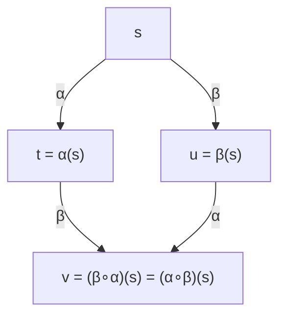
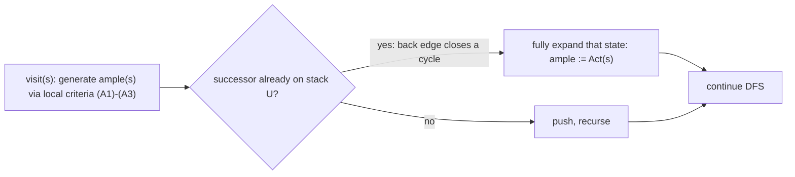

# Partial Order Reduction

[[book-guidelines|↩ Back to guidelines]]

## Why interleaving is a lie your checker doesn't need to believe

A transition system for $n$ concurrent processes running independently is built by interleaving: at every reachable state, you fork a successor for *every* enabled action of *every* process, in *every* order. If each process performs $k$ local actions before synchronizing, there are $\binom{nk}{k,k,\dots,k}$ — roughly $n!$ for the simplest case — distinct orderings of those actions, and your explicit-state model checker will dutifully build a state for each one. This is the sharpest form of state-space explosion: it isn't caused by any one process being complicated, it's caused by concurrency itself, by the mere fact that you *don't know* which process runs first.

Here's the first-principles observation the whole chapter is built on: **most of the time, you don't care which process runs first.** If process $P_1$ executes `x := x + 1` and, independently, process $P_2$ executes `y := y - 3`, the two possible interleavings — $\alpha\beta$ and $\beta\alpha$ — land you in the exact same final state. The intermediate state (where only one assignment has happened) is invisible to any property that only inspects `x` and `y` in their final values. If your specification never looks at that intermediate state, exploring both orderings is pure waste: you paid for two paths through the diamond in Figure 8.1 (below) when the one path already tells you everything you need.



Partial order reduction (POR) is the systematic exploitation of this diamond: at each state, explore only a subset of the enabled actions — an **ample set** — large enough to still see everything a temporal-logic formula could distinguish, small enough to actually shrink the state space. Scaled up, instead of a full transition system with $n!$-many interleavings of two action sequences $\alpha_1\alpha_2$ and $\beta_1\beta_2$, you keep a single representative path, and the win compounds: the full system grows exponentially in the number of processes, the reduced one grows linearly.

The engineering problem the rest of this chapter solves is: *what has to be true of the ample sets you pick, so that reducing this way doesn't silently break the property you're trying to verify?* That question has two different answers depending on whether you're checking a linear-time property (LTL) or a branching-time one (CTL/CTL$^*$) — and the gap between those two answers, illustrated by a genuinely surprising counterexample, is one of the more instructive moments in the book.

**What breaks without this.** Without POR, model checking an asynchronous system with $n$ loosely-coupled processes each with $k$ local steps costs you a state space on the order of $k^n$ (or worse, factorial in interleavings) even though the "real" independent behavior is linear in $n$. This is why explicit-state model checkers like SPIN treat POR as a first-class, always-on optimization rather than an afterthought.

## 1. Independence of actions

Throughout the chapter, $TS = (S, \mathit{Act}, \to, I, AP, L)$ is a finite, **action-deterministic** transition system without terminal states: for any state $s$ and action $\alpha$, there is at most one $\alpha$-successor, written $\alpha(s)$ when it exists. (Action-determinism is not a real restriction — you get it for free by tagging each action with the identity of the process that performs it, as `request1` vs. `request2` rather than a shared `request`.) The set of actions enabled at $s$ is $\mathit{Act}(s) = \{\alpha \mid \exists s'.\ s \xrightarrow{\alpha} s'\}$.

[[Bisimulation-Equivalence#The formal definition|The formal definition]] of independence names precisely the diamond intuition above:

> **Definition 8.3 (Independence of Actions).** Actions $\alpha \neq \beta$ are **independent** in $TS$ if for every state $s$ with $\alpha, \beta \in \mathit{Act}(s)$:
> $$
> \beta \in \mathit{Act}(\alpha(s)) \quad\text{and}\quad \alpha \in \mathit{Act}(\beta(s)) \quad\text{and}\quad \alpha(\beta(s)) = \beta(\alpha(s)).
> $$
> Otherwise they are **dependent**.

Two clauses are doing separate jobs here. The first two ("$\beta$ stays enabled after $\alpha$, and vice versa") rule out one action *disabling* the other — you can't skip an interleaving if doing so would silently drop a transition that was about to happen. The third ("commuting successors agree") is the actual diamond-closes-up condition. Both are needed: an action pair that commutes but can disable each other is *not* independent, because omitting the disabled branch changes the set of reachable states.

The definition lifts to a set of actions: $\beta$ is independent of $A \subseteq \mathit{Act}$ if $\beta$ is independent of every $\alpha \in A$.

**Two concrete sources of independence** (Examples 8.4–8.5):

- **Parallel composition without synchronization.** For $TS_1 \parallel_H TS_2$ (handshaking on the action set $H$), any $\alpha \in \mathit{Act}_1 \setminus H$ and $\beta \in \mathit{Act}_2 \setminus H$ are automatically independent — they belong to disjoint processes and don't rendezvous.
- **Disjoint variable footprints.** For program graphs, if action $\alpha$'s guard doesn't mention any variable that $\beta$ modifies, and $\alpha$ doesn't modify any variable $\beta$'s process reads, then $\alpha$ and $\beta$ are independent — regardless of which process they belong to.

The book's running example is a semaphore-based mutual-exclusion algorithm (Figure 8.3) with actions $\mathit{request}_i$ (waiting), $\mathit{enter}_i$ (entering the critical section, decrementing the semaphore $y$), and $\mathit{rel}$ (releasing, incrementing $y$). $\mathit{request}_1$ and $\mathit{request}_2$ touch no shared state, so they're independent. But $\mathit{enter}_1$ and $\mathit{enter}_2$ both read and write $y$: in a state where both are enabled ($y = 1$), executing $\mathit{enter}_1$ disables $\mathit{enter}_2$ (now $y = 0$) — a textbook dependency, and exactly the interaction a reduction must never gloss over.

**Rust [[Concurrency-and-Communication-Modeling#Grounding|grounding]].** The independence check is naturally an interference/aliasing analysis over an action's read/write footprint — the same shape as a borrow-checker-adjacent overlap test:

```rust
struct Footprint {
    reads: HashSet<VarId>,
    writes: HashSet<VarId>,
}

fn independent(a: &Footprint, b: &Footprint) -> bool {
    // conservative syntactic test: no read/write or write/write overlap
    a.writes.is_disjoint(&b.reads)
        && b.writes.is_disjoint(&a.reads)
        && a.writes.is_disjoint(&b.writes)
}
```

This is *sound but incomplete* in exactly the way the book flags in Section 8.2.3: two actions that provably never coexist as enabled in any reachable state could still be treated as independent even if their footprints overlap, but detecting that requires a global reachability argument you don't have during static analysis. The syntactic test above is a conservative **overapproximation of the dependency relation** — call actions dependent whenever you can't *prove* independence, never the other way around.

## 2. Permuting and adding independent actions in executions

The whole soundness argument for POR rests on three lemmas that let you rearrange or extend an execution without changing its behavior up to stutter-equivalence. These are the mechanical core of the chapter — everything else is bookkeeping to make sure the lemmas are applicable.

**Permuting an independent action across a whole run (Lemma 8.6).** If $s = s_0 \xrightarrow{\beta_1} s_1 \xrightarrow{\beta_2} \cdots \xrightarrow{\beta_n} s_n$ is an execution fragment and $\alpha \in \mathit{Act}(s)$ is independent of *every* $\beta_i$, then $\alpha$ can be shifted to the very front:
$$
s = s_0 \xrightarrow{\alpha} t_0 \xrightarrow{\beta_1} t_1 \xrightarrow{\beta_2} \cdots \xrightarrow{\beta_n} t_n, \qquad t_i = \alpha(s_i).
$$
The proof is a straightforward induction: at each step, independence of $\alpha$ and $\beta_{i+1}$ guarantees $\alpha$ stays enabled after $\beta_{i+1}$ fires, $\beta_i$ stays enabled after $\alpha$ fires, and the successors agree — precisely because Definition 8.3's third clause holds pointwise at every $s_i$. Lemma 8.7 is the infinite-execution version: if $\alpha$ is independent of an *entire infinite* action sequence $\beta_1\beta_2\dots$, the same shift works, because action-determinism lets you take the limit of finite prefixes.

**Adding a stutter action changes nothing observable (Lemmas 8.10–8.11).** A **stutter action** (Definition 8.8) is one whose transitions never change the state's atomic-proposition labeling: $L(s) = L(\alpha(s))$ whenever $\alpha \in \mathit{Act}(s)$. Combine this with independence: if $\alpha$ is *both* a stutter action *and* independent of $\beta_1,\dots,\beta_n$, then the execution with $\alpha$ shifted to the front is not just reachable — it is **stutter-equivalent** to the original (their traces differ only in how many times each label repeats). The proof is a direct trace comparison: both traces have the shape $A_0^+A_1^+\cdots A_n^+$, just with the repeat of $A_0$ counted differently.

This distinction between a *stutter step* (a specific transition $s \to t$ with $L(s) = L(t)$) and a *stutter action* (one whose transitions are *always* stutter steps) matters: `x := 2*x` is a stutter action only if you also don't observe the program counter, and even then, whether a *specific* transition happens to be a stutter step can depend on the current value of `x` (Remark 8.9) — but for POR you need the *action itself* to be uniformly non-observable, because you're reasoning about it syntactically, without knowing which state it'll fire from.

**Why this matters:** these lemmas are the formal license to say "I don't need to explore both orderings" — Lemma 8.6/8.7 says the reordering is *always possible* when independence holds, and Lemma 8.10/8.11 says it's *free* (produces a stutter-equivalent trace) when the moved action is additionally a stutter action. Everything from here on is about engineering ample-set selection rules so that these two preconditions always line up.

## 3. The ample set approach

Rather than exploring every $\alpha \in \mathit{Act}(s)$ at a state $s$, fix a subset $\mathit{ample}(s) \subseteq \mathit{Act}(s)$ and explore only that. This defines a reduced transition relation:
$$
s \Rightarrow s' \iff \exists \alpha \in \mathit{ample}(s).\ s \xrightarrow{\alpha} s',
$$
and $\widehat{TS} = (\widehat S, \mathit{Act}, \Rightarrow, I, AP, L)$ is the transition system reachable under $\Rightarrow$ from the initial states — critically, $\widehat{TS}$ is generated *without ever building* $TS$, so peak memory is bounded by $|\widehat{TS}|$, not $|TS|$.

The correctness requirement is: **$\widehat{TS}$ and $TS$ must be equivalent with respect to the formulae you intend to check.** For linear-time properties, "equivalent" means **stutter trace equivalence** ($TS \asymp \widehat{TS}$), which is exactly the granularity that $\mathrm{LTL}_{\setminus\bigcirc}$ (LTL without the next-operator) can see — a fact carried over from Chapter 7 (Corollary 7.93): stutter-trace-equivalent systems satisfy exactly the same $\mathrm{LTL}_{\setminus\bigcirc}$ formulae. Dropping $\bigcirc$ is not an arbitrary restriction; it's the price of admission for POR, because the reduction fundamentally scrambles *which step* something happens on while preserving *that* it happens — and $\bigcirc$ is precisely the operator that can see individual steps.

The proof strategy for $TS \asymp \widehat{TS}$ is an explicit, constructive rewriting of executions: given an arbitrary execution $\rho_0$ in $TS$, build a sequence $\rho_0 \to \rho_1 \to \rho_2 \to \cdots$, each stutter-equivalent to the last, that converges to an execution $\hat\rho_0$ actually living in $\widehat{TS}$. At each step you look at the earliest point where $\rho_i$ diverges from an ample-set choice and apply one of two transformations:

- **Case 1** (some later action in the suffix belongs to $\mathit{ample}(s)$): shift that action to the front via Lemma 8.6/8.10 — pull the already-scheduled ample action past the finite prefix of non-ample actions in front of it.
- **Case 2** (no action in the suffix ever belongs to $\mathit{ample}(s)$): insert a *fresh* ample action at the front via Lemma 8.7/8.11.

Both cases require the moved-or-inserted action to be independent of everything it's hopping over, and to be a stutter action. That's exactly what the four ample-set conditions below are designed to guarantee.

## 4. The nonemptiness, dependency, stutter, and cycle conditions

Four constraints — **(A1)–(A4)** — are imposed on every ample-set choice; violating any one of them can break stutter-trace equivalence, and the book gives a concrete counterexample for each.

$$
\begin{aligned}
\textbf{(A1) Nonemptiness: } &\emptyset \neq \mathit{ample}(s) \subseteq \mathit{Act}(s) \\[4pt]
\textbf{(A2) Dependency: } &\text{for any finite execution } s \xrightarrow{\beta_1}\!\cdots\!\xrightarrow{\beta_n} s_n \xrightarrow{\alpha} t \text{ in } TS,\\
&\text{if } \alpha \text{ depends on } \mathit{ample}(s), \text{ then } \beta_i \in \mathit{ample}(s) \text{ for some } 0 < i \leq n \\[4pt]
\textbf{(A3) Stutter: } &\text{if } \mathit{ample}(s) \neq \mathit{Act}(s), \text{ every } \alpha \in \mathit{ample}(s) \text{ is a stutter action} \\[4pt]
\textbf{(A4) Cycle: } &\text{for any cycle } s_0 s_1 \cdots s_n \text{ in } \widehat{TS} \text{ and } \alpha \in \mathit{Act}(s_i),\\
&\text{some } s_j \text{ on the cycle has } \alpha \in \mathit{ample}(s_j)
\end{aligned}
$$

**(A1)** is trivial bookkeeping — $\widehat{TS}$ inherits $TS$'s absence of terminal states only if you never pick an empty ample set.

**(A2)** is the load-bearing condition, and it's worth dwelling on *why* a merely nonempty subset isn't good enough. It says: in *every* execution of the full $TS$ (not just the reduced one), any action $\alpha$ that is *dependent* on $\mathit{ample}(s)$ cannot occur before some action of $\mathit{ample}(s)$ has fired. Read contrapositively: as long as you haven't yet run one of your chosen ample actions, only actions *independent* of the ample set are allowed to happen. This is exactly the hypothesis Lemma 8.6/8.7 need — "independent of everything in the way" — manufactured to order by (A2) rather than checked after the fact. **Lemma 8.14** derives the cleaner corollary: (A2) implies every $\alpha \in \mathit{ample}(s)$ is independent of *all* of $\mathit{Act}(s)\setminus\mathit{ample}(s)$, for any reachable, non-fully-expanded $s$. It's tempting to just impose *that* weaker-looking condition directly (the book calls this variant (A2′) in Remark 8.19) — a purely local, single-state independence check instead of a global reachability property. Remark 8.19 shows this is **not sufficient**: a concrete transition system satisfies (A2′), (A3), (A4), and still fails $TS \asymp \widehat{TS}$, because (A2′) only forbids an ample action from being disabled by non-ample ones *at the current state*, but says nothing about the *entire finite execution* before the dependent action fires. This is the single most important cautionary example in the section — a plausible-looking simplification of (A2) is unsound.

**(A3)** ensures the actions you're shifting or inserting are stutter actions, satisfying Lemma 8.10/8.11's other precondition. If a state is *fully expanded* ($\mathit{ample}(s) = \mathit{Act}(s)$, Notation 8.16), (A3) imposes nothing — there's no reduction happening there, so there's nothing to prove stutter-equivalent.

**(A4)** rules out **action starvation**: without it, a state's ample set could perpetually postpone an enabled action forever by always choosing to loop around a cycle without it. Example 8.20 makes this concrete with two interleaved counters $TS_1 \parallel TS_2$, where action $\beta$ is a stutter action independent of a cyclic sequence $\alpha_1\alpha_2\alpha_3$: choosing $\mathit{ample}(s) = \{\alpha_{i+1}\}$ at every point on the cycle *never* schedules $\beta$, so the trace $\emptyset\{a\}\{a\}\{a\}\cdots$ (which requires $\beta$ eventually firing) is simply unreachable in $\widehat{TS}$ — a genuine loss of behavior, witnessed by the LTL$_{\setminus\bigcirc}$ formula $\Box\neg a$ holding in $\widehat{TS}$ but not in $TS$.

**Theorem 8.13** ties it together: if (A1)–(A4) hold, $TS \asymp \widehat{TS}$, and since stutter-trace equivalence is finer than $\mathrm{LTL}_{\setminus\bigcirc}$-equivalence, $\widehat{TS} \models \varphi \iff TS \models \varphi$ for any $\mathrm{LTL}_{\setminus\bigcirc}$ formula $\varphi$.

## 5. Dynamic partial order reduction

**Dynamic (on-the-fly) POR** computes $\widehat{TS}$ *during* model checking rather than as a separate pass. For invariant checking ($TS \models \Box\Phi$), this is a modified depth-first search: on visiting a state $s$, generate $\mathit{ample}(s)$ (satisfying (A1)–(A3), locally checkable) rather than the full $\mathit{Act}(s)$, and push only those successors.

(A4) is global — it talks about cycles in $\widehat{TS}$, which you're still in the middle of building — so it's replaced with a strictly stronger, DFS-friendly surrogate:

> **(A4′) Strong cycle condition.** Any cycle in $\widehat{TS}$ contains at least one *fully expanded* state ($\mathit{ample}(s) = \mathit{Act}(s)$).

**Lemma 8.23** shows (A4′) $\Rightarrow$ (A4) given (A1)–(A3): if some action $\beta$ is enabled somewhere on a cycle but is never in any ample set along it, then $\beta$ (independent of every ample action on the cycle, by Lemma 8.14) stays enabled all the way around, contradicting that some state on the cycle is fully expanded. The payoff is algorithmic: **(A4′) is exactly what a DFS *back-edge* detects.** When the search finds a transition $s \xrightarrow{\alpha} s'$ where $s'$ is already on the DFS stack — the signature of closing a cycle — you retroactively enlarge $\mathit{ample}(s')$ (or any state on the cycle) to the *full* $\mathit{Act}(s')$, forcing it fully-expanded and satisfying (A4′) for that cycle without ever having needed to see the whole cycle in advance.



Algorithm 38 (invariant checking) is exactly ordinary DFS with `ample(s)` substituted for `Act(s)` in the successor-generation step, plus this back-edge patch-up. Algorithm 39/40 extend the same idea to **nested DFS**, the standard Büchi-emptiness algorithm for full LTL model checking (checking $\widehat{TS} \otimes A_{\lnot\varphi}$) — the outer search still uses ample sets, and the inner (accepting-cycle) search likewise treats any back edge as a signal to fully expand.

Example 8.24 (a two-process mutual-exclusion busy-wait) walks through this by hand: initially both processes have an independent, stutter "skip" action available; picking `ample(s0) = {δ0}` (i.e., prioritizing process 0's skip) is a valid, non-trivial reduction, but at the next state the *only* available singleton choice would close a cycle, so [[Probabilistic-Computation-Tree-Logic#The algorithm|the algorithm]] is forced to widen the ample set there instead of shrinking it further — illustrating that the reduction is locally adaptive, not a fixed heuristic applied uniformly.

**On computing (A2) itself.** Section 8.2.3's central negative result, **Theorem 8.25**, is that checking (A2) exactly, for an arbitrary ample-set choice, is exactly as hard as deciding a reachability property $TS \models \exists\Diamond a$ — i.e., as expensive as the state-space exploration POR exists to avoid. The proof is a reduction: augment $TS$ with two new dependent actions $\alpha$ (enabled only at $a$-states) and $\beta$ (a global self-loop, independent of everything), pick $\mathit{ample}(s_0) = \{\beta\}$ at the initial state and fully expand everywhere else; then (A2) is violated at $s_0$ **iff** some $a$-state is reachable from $s_0$. This is why practical POR never checks (A2) directly — it checks *sufficient, syntactically-verifiable local conditions* instead:

- **(A2.1)**: every action of process $P_j$ ($j \neq i$) is independent of $\mathit{Act}_i(s)$ — checkable once and for all from the static dependency overapproximation $D$.
- **(A2.2)**: no currently-disabled action $\beta$ of $P_i$ can be *enabled* by some other process's activity — i.e., $\beta$'s guard doesn't reference variables another process can modify, $\beta$ isn't a blocked channel/handshake action another process could unblock, and no reachable edge of another process modifies a variable in $\beta$'s guard or is $\beta$'s complementary send/receive.

**Lemma 8.27** proves (A2.1) + (A2.2) $\Rightarrow$ (A2) for $\mathit{ample}(s) = \mathit{Act}_i(s)$ (all of process $i$'s enabled actions), by contraposition: if a dependent action fired without a preceding ample action, trace back to the *first* action of process $i$ in the offending sequence — its enabling was caused by some other process, which is exactly what (A2.2) forbids. The upshot is Algorithm 41: pick a candidate process $i$, check that its enabled actions are all stutter actions and mutually independent of every other process's enabled actions (A2.1), and that no disabled action of $i$ can be woken up by anyone else (A2.2) — all of this decidable by inspecting the (small) program graphs, never the (huge) transition system.

## 6. Static partial order reduction

Dynamic POR interleaves reduction with search; **static POR** instead transforms the high-level program description ($\mathrm{PG}_1 \parallel\!\parallel\!\cdots\!\parallel\!\parallel\ \mathrm{PG}_n$) *before* verification, producing a new set of program graphs whose ordinary transition system already *is* $\widehat{TS}$. This buys composability with other static reductions (symbolic/BDD encoding, bisimulation minimization) that a DFS-embedded reduction can't offer as cleanly.

The obstacle is (A4)/(A4′): there's no DFS stack to detect back edges with, since you're not searching anything yet — you're rewriting a syntactic description. The fix is to designate a set of **sticky actions** $A_{\mathrm{sticky}} \subseteq \mathit{Act}$ whose job is to force full expansion wherever they appear as candidates, guaranteeing every cycle gets broken:

$$
\textbf{(S1) Visibility: } \mathit{Vis} \subseteq A_{\mathrm{sticky}} \qquad
\textbf{(S2) Cycle-breaking: } \text{every cycle in } \widehat{TS} \text{ contains an action in } A_{\mathrm{sticky}}
$$

together with a new per-state condition replacing both (A3) and (A4′) at once:

$$
\textbf{(A3/4) Sticky condition: } \mathit{ample}(s) \neq \mathit{Act}(s) \implies \mathit{ample}(s) \cap A_{\mathrm{sticky}} = \emptyset.
$$

**Lemma 8.29** shows (S1)+(S2)+(A3/4) $\Rightarrow$ (A3) and (A4′): (A3) follows because a non-sticky ample action, by (S1)'s contrapositive, must be a stutter action; (A4′) follows because (S2) guarantees a sticky action sits on every cycle, and (A3/4) says that whenever a sticky action *is* in some state's ample set, that state must be fully expanded — so the cycle can't avoid a fully-expanded state.

The mechanical transformation (Section 8.2.4, "Program Graph Reduction") realizes this by threading a fresh Boolean flag $\mathit{ample}_i$ through each process $\mathrm{PG}_i$:

1. Mark every edge carrying a sticky action as `sticky`; mark an edge `good` if its action is independent (per the static dependency overapproximation $D$) of every other process's actions and doesn't reference variables they can modify; mark a *location* `ample` if all its outgoing edges are `good` (and non-sticky), and its guards are jointly exhaustive.
2. Rewrite each edge's action to atomically set $\mathit{ample}_i := \texttt{true}$ if it leads into an `ample` location, `false` otherwise.
3. Strengthen every edge's guard with $h_i = \bigwedge_{j<i}\lnot\mathit{ample}_j \wedge \mathit{ample}_i$ (process $i$'s enabled actions serve as the ample set) or, at fully-expanded locations, with $f = \bigwedge_j \lnot\mathit{ample}_j$.

The resulting composition $\widehat{\mathrm{PG}} = \widehat{\mathrm{PG}}_1 \parallel\!\parallel\!\cdots\!\parallel\!\parallel\ \widehat{\mathrm{PG}}_n$ has a transition system whose *reachable fragment*, once you erase the bookkeeping $\mathit{ample}_i$ variables (justified by the invariant in **Lemma 8.30**: $\eta \models \mathit{ample}_i \iff$ the current location of $\mathrm{PG}_i$ is marked `ample`), is exactly the $\widehat{TS}$ that dynamic POR would have built on the fly. Example 8.31 works this out for two counting processes that each loop $0 \to N$ and then toggle a shared observable flag: the increment/reset-skip actions are invisible and independent across processes, so only the flag-toggling actions need to be sticky, and the transformed program graphs make one process's counting loop run to completion (via $h_i$) before yielding the turn, breaking every cycle exactly at the toggle.

## 7. Branching-time ample sets for CTL and CTL$^*$

Here the chapter delivers its sharpest lesson: **(A1)–(A4), sufficient for LTL$_{\setminus\bigcirc}$, are not sufficient for CTL$_{\setminus\bigcirc}$.** Stutter trace equivalence is a *linear-time* notion — it only compares sets of traces — while CTL/CTL$^*$ quantify over branching structure, and a reduction that preserves every trace can still collapse branching points that a $\forall$/$\exists$-path formula can tell apart.

**Example 8.41** exhibits this directly. Take a state $s_0$ with three enabled actions $\alpha, \beta, \gamma$ where $\beta, \gamma$ are stutter actions independent of $\{\alpha,\}$ but $\beta(s_0)$ can only reach a $b$-labeled state and $\gamma(s_0)$ can only reach a $c$-labeled state, while $\alpha(s_0)$ can reach *both*. Choosing $\mathit{ample}(s_0) = \{\beta,\gamma\}$ (dropping only $\alpha$) satisfies (A1)–(A4) — it's a completely legitimate LTL reduction — yet it deletes the branching point where a path can still choose between reaching $b$ or reaching $c$. The formula
$$
\Phi = \forall\Box\bigl(a \to (\forall\Diamond b \lor \forall\Diamond c)\bigr)
$$
holds in $\widehat{TS}$ (every remaining $a$-state has a direct successor in the deleted-but-remembered $b$ or $c$ label) but fails in $TS$ (the branching state $u$ can reach *both*, so *neither* disjunct is a $\forall$-guaranteed outcome from $u$). $TS$ and $\widehat{TS}$ satisfy different CTL$_{\setminus\bigcirc}$ formulae despite being stutter-trace equivalent — a clean demonstration that $\asymp$ (linear) is strictly coarser than what CTL needs.

The fix that *does* work in the same example is $\mathit{ample}(s_0) = \{\alpha\}$ — a **singleton**. The reasoning: $\alpha$ is a stutter action, so $s_0$ and $\alpha(s_0)$ carry the same label, and *every other action enabled at $s_0$* ($\beta$, $\gamma$) is also enabled at $\alpha(s_0)$ (by independence) and leads to an equivalent successor. In other words, $s_0 \approx^{div} \alpha(s_0)$ (divergence-sensitive stutter bisimilar) — you haven't erased a branch, you've just delayed observing it by one silent step. This generalizes to a fifth condition:

$$
\textbf{(A5) Branching condition: } \mathit{ample}(s) \neq \mathit{Act}(s) \implies |\mathit{ample}(s)| = 1.
$$

**Theorem 8.43**: (A1)–(A5) together give $TS \approx^{div} \widehat{TS}$ (divergence-sensitive stutter bisimulation, from Chapter 7 §7.8.3), which coincides exactly with CTL$^*_{\setminus\bigcirc}$-equivalence — so the reduction is sound for both CTL$_{\setminus\bigcirc}$ and the strictly more expressive CTL$^*_{\setminus\bigcirc}$ in one shot.

Note how much sharper (A5) is than it might look: Example 8.42's counterpoint shows that even a well-chosen singleton at $s_0$ can be undone by a *bad* singleton choice one step later. Picking $\mathit{ample}(\alpha(s_0)) = \{\delta\}$ where $\delta$ is *not* a stutter action violates (A3), and the resulting $\widehat{TS}$ again separates from $TS$ under a CTL$_{\setminus\bigcirc}$ formula — (A5) doesn't supersede (A3), it stacks on top of it. All five conditions are simultaneously necessary; this chapter is a rare case in the book where nearly every relaxation the reader might reasonably guess at is explicitly shown, by counterexample, to be unsound.

The proof of Theorem 8.43 (Lemmas 8.44–8.52) constructs the witnessing normed bisimulation via **forming paths**: sequences of ample-only transitions in $TS$ that "catch up" to a corresponding path in $\widehat{TS}$, with the norm functions $\nu_1,\nu_2$ measuring how many such catch-up steps remain — the same proof-engineering pattern (build an explicit relation, bound its "distance to convergence") used for the LTL correctness proof in Section 4, now upgraded to bisimulation rather than trace inclusion.

**Rust grounding for the branching case.** The (A5) singleton restriction has a natural typestate reading: a state is either *fully expanded* (an ordinary `enum` of all enabled actions) or *reduced*, in which case the ample set is provably a single choice — you could encode this as

```rust
enum AmpleChoice<A> {
    FullyExpanded(Vec<A>),
    Reduced(A),   // A5: singleton, guaranteed a stutter action by A3
}
```

making the branching condition a type-level invariant rather than a runtime assertion — the same discipline the book applies proof-theoretically by naming (A5) as a distinct, independently-checkable condition rather than folding it into (A3)/(A4).

## Where this leads

This chapter closes the arc that Chapter 7 (equivalences and abstraction) opened: stutter trace equivalence and divergence-sensitive stutter bisimulation, introduced there as abstract notions of "close enough for LTL" and "close enough for CTL$^*$," turn out to be exactly the right yardsticks for measuring whether a *concrete, algorithmically-generated* reduced transition system is safe to model-check in place of the real one. The independence relation, the ample-set conditions, and the sticky-action machinery are, in effect, a worked example of how an abstract equivalence notion gets operationalized into a static-analysis pass over a program's [[Timed-CTL-and-TCTL-Model-Checking#Syntax|syntax]] — the same move the book later makes with symbolic/BDD-based reductions and, in the following chapter, with the discretization of dense-time behavior in timed automata (partial order reduction and time-abstracting reductions attack the same state-space-explosion problem from different angles).

For the learning goals this vault is tracking under `static-analysis`: the (A2.1)/(A2.2) local criteria and the sticky/good/ample edge-marking pass over program graphs are a genuine instance of the "over-approximate a global property with a cheap syntactic one, verify soundness once and for all" discipline that also underlies CEGAR loops and abstract-interpretation-based invariant generation — Theorem 8.25's hardness result ("checking (A2) exactly costs as much as reachability") is the same shape of argument that motivates every abstract domain in program analysis: exact dependency/interference analysis is undecidable-hard in the limit, so you build a provably-sound overapproximation ($D \supseteq$ true dependency) instead and pay for its imprecision in reduction quality rather than in unsoundness. If the compiler project in this vault's standing goals ever needs to reason about *when two effects can be reordered* — for optimization, for concurrent-execution soundness, or for counterexample search over interleavings — this chapter's independence relation and its two-tier (syntactic overapproximation + cheap local sufficient conditions) proof strategy is the direct blueprint.
