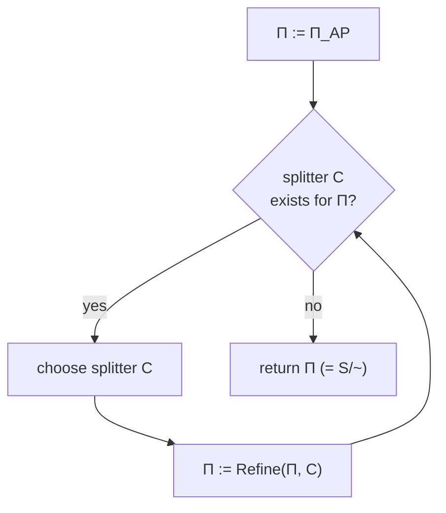

[[book-guidelines|↩ Back to guidelines]]

# Partition Refinement Algorithms

## Why an algorithm is needed at all

Chapter 7 spends its first two sections proving something genuinely useful: [[Bisimulation-Equivalence|bisimulation equivalence]] $\sim$ is exactly the right notion of "these two transition systems (or these two states of one transition system) can't be told apart by any CTL$^*$ formula." That gives you a *license* to replace a huge transition system $TS$ by its bisimulation quotient $TS/\!\sim$ and still get correct verification answers, because $TS \sim TS/\!\sim$ and $TS \models \varphi \iff TS/\!\sim \,\models \varphi$ for any CTL, CTL$^*$, or LTL formula $\varphi$.

But a license is not a mechanism. Definition 7.6-style bisimulation relations are *existentially* quantified — "$TS_1 \sim TS_2$ iff there **exists** a relation $R$ satisfying the matching conditions." That's a perfect definition for proving theorems about bisimulation and a useless one for actually computing $\sim$. You can't enumerate all relations on $S \times S$ and check each one; there are $2^{|S|^2}$ of them. What you need is a *constructive* characterization: start from some large equivalence relation that is obviously coarser than $\sim$ (or is guaranteed to be its superset), and mechanically shrink it, block by block, until it stabilizes at exactly $\sim$.

That's what this section is: not a new fact about what bisimulation *is*, but an algorithm for *computing* it — and, in its second half, an argument for why a smarter bookkeeping strategy turns a linear-in-$|S|$ algorithm into a logarithmic-in-$|S|$ one, using an idea (always recurse on the smaller half) that shows up everywhere in computer science once you know what to look for: Hopcroft's DFA-minimization algorithm, union-find with union-by-size, small-to-large merging on trees.

The mechanism the book builds is called **partition refinement**: represent the current best guess at $\sim$ as a partition of the state space into blocks of "currently indistinguishable" states, and repeatedly split blocks apart when new evidence (a transition to a block that only *some* of the block's states can reach) shows they aren't actually equivalent.

## Partitions, blocks, and the finer/coarser order

The book first nails down vocabulary that will carry the rest of the section (Definition 7.29).

> **Partition, block, superblock.** A partition of $S$ is a set $\Pi = \{B_1, \ldots, B_k\}$ of pairwise-disjoint, nonempty sets whose union is $S$. Each $B_i \in \Pi$ is a **block**. A set $C \subseteq S$ is a **superblock** of $\Pi$ if $C = B_{i_1} \cup \cdots \cup B_{i_\ell}$ for some blocks of $\Pi$ — i.e., $C$ is any union of whole blocks.

Write $[s]_\Pi$ for the unique block of $\Pi$ containing state $s$. Two partitions are ordered by refinement:

$$
\Pi_1 \text{ is finer than } \Pi_2 \quad\text{(equivalently, } \Pi_2 \text{ coarser than } \Pi_1\text{)} \quad\text{iff}\quad \forall B_1 \in \Pi_1\, \exists B_2 \in \Pi_2.\; B_1 \subseteq B_2.
$$

Every block of the coarser partition is a disjoint union of blocks of the finer one — "finer" literally means "made of smaller pieces stacked to build the same whole." This is the same finer/coarser vocabulary from the [[Mathematical-Preliminaries|Mathematical Preliminaries]] appendix (Topic 29), now doing real algorithmic work: a partition-refinement algorithm is a process that only ever moves in one direction along this order, splitting blocks and never merging them.

Partitions and equivalence relations are two views of the same object (Remark 7.30): the quotient space $S/R$ of an equivalence relation $R$ is a partition, and conversely a partition $\Pi$ induces the equivalence $R_\Pi = \{(s_1,s_2) \mid [s_1]_\Pi = [s_2]_\Pi\}$. [[Probabilistic-Computation-Tree-Logic#The algorithm|The algorithm]] works entirely in "partition" language because splitting a set into two pieces is an operation with an obvious data structure (a list, or later, a doubly-linked list supporting $O(1)$ move-out), whereas "refine a relation" doesn't suggest one.

**What breaks without a canonical characterization of $\sim$ as a fixed point of splitting:** if you tried to compute bisimilarity by literally checking, for each candidate relation, whether it satisfies the existential matching condition, you'd have no stopping criterion short of exhaustive search over an exponential space. The refinement view gives you a *monotone decreasing* sequence of partitions in a *finite* lattice (partitions of a finite set, ordered by fineness, form a finite lattice), which terminates by a simple counting argument — that's the entire computational payoff of Definition 7.29.

## The AP-partition as initial partition

Bisimilar states must, at minimum, be labeled identically — that's the first conjunct of the bisimulation matching condition, and it costs nothing to check up front. So the obvious starting point, coarser than $\sim$ by construction, is:

> **Definition 7.31 (The AP-partition).** $\Pi_{AP}$ is the partition induced by $R_{AP} = \{(s_1,s_2) \in S\times S \mid L(s_1) = L(s_2)\}$ — group states purely by which atomic propositions they satisfy.

Since $L(s) \subseteq AP$, there are at most $2^{|AP|}$ possible labels, so $\Pi_{AP}$ has at most $2^{|AP|}$ blocks (in practice far fewer, since most label combinations aren't realized).

**Computing $\Pi_{AP}$ efficiently.** The naive approach — for each pair of states, compare labels — is $O(|S|^2 \cdot |AP|)$. The book does better with a data structure that should look familiar to anyone who has implemented a trie: build a binary decision tree of depth $|AP| = k$, where the vertex at depth $i$ asks "is $a_{i+1} \in L(s)$?" and the two children correspond to "no" and "yes." Each state $s$ is dropped down the tree along the path dictated by its own labeling; the leaf it lands on accumulates the block of states sharing that label. Algorithm 29 in the book is exactly this: a single pass over $S$, each state costing $\Theta(|AP|)$ to traverse from root to leaf, giving:

> **Lemma 7.33.** $\Pi_{AP}$ can be computed in time $\Theta(|S|\cdot|AP|)$.

This is essentially building a hash/trie keyed by label-set and bucketing states into it — the $2^{|AP|}$-leaf decision tree is just an explicit, order-respecting way to realize that hash without needing $AP$-sized bit-vector hashing machinery. The book's worked example (Example 7.32, Figure 7.10/7.11) is a 7-state system over $AP=\{a,b\}$ that resolves, after three insertions, into blocks $\{s_0,s_2,s_5,s_6\}$ (labeled $\{a\}$), plus the singleton-ish groups for $\{a,b\}$ and $\emptyset$.

```rust
use std::collections::HashMap;

/// A minimal transition-system-shaped structure: state ids 0..n,
/// a labeling function, and (for later sections) a successor relation.
struct TransitionSystem {
    n_states: usize,
    labels: Vec<u64>,       // bitmask over AP, one entry per state
    successors: Vec<Vec<usize>>,
}

/// Algorithm 29: compute Pi_AP by bucketing states on their label bitmask.
/// The book's decision tree and a hash map achieve the same Theta(|S|*|AP|)
/// bound in practice (|AP| bits hashed per state); the trie is preferable
/// only when you want a *canonical, order-independent* leaf structure.
fn initial_partition(ts: &TransitionSystem) -> Vec<Vec<usize>> {
    let mut buckets: HashMap<u64, Vec<usize>> = HashMap::new();
    for s in 0..ts.n_states {
        buckets.entry(ts.labels[s]).or_default().push(s);
    }
    buckets.into_values().collect()
}
```

## Splitters and stability

Coarser than $\sim$ isn't good enough — $\Pi_{AP}$ ignores one-step behavior entirely. The book's characterization of exactly when a partition *is* $S/\!\sim$ is the load-bearing result of this section (Lemma 7.34):

> **Lemma 7.34 (Coarsest partition).** $S/\!\sim$ is the coarsest partition $\Pi$ of $S$ such that
> (i) $\Pi$ is finer than $\Pi_{AP}$, and
> (ii) for all blocks $B, C \in \Pi$: either $B \cap \mathrm{Pre}(C) = \emptyset$ or $B \subseteq \mathrm{Pre}(C)$.

Here $\mathrm{Pre}(C) = \{s \in S \mid \mathrm{Post}(s)\cap C \neq \emptyset\}$ is the set of states with *at least one* successor in $C$. Condition (ii) is doing all the work: it says every block, with respect to every other block (or superblock — the book shows condition (ii) automatically extends to superblocks too), is **uniform** in its ability to reach that block — either *all* of $B$'s states can step into $C$, or *none* can. If some states of $B$ can reach $C$ and others can't, that asymmetry is a certificate that those two groups of states are *not* bisimilar, no matter how identically labeled they are — one group has behavior the other lacks.

This licenses the terminology that structures the rest of the algorithm (Definition 7.37):

> **Splitter, stability.** Let $\Pi$ be a partition and $C$ a superblock of $\Pi$.
> 1. $C$ is a **splitter** for $\Pi$ if some block $B \in \Pi$ has both $B \cap \mathrm{Pre}(C) \neq \emptyset$ and $B \setminus \mathrm{Pre}(C) \neq \emptyset$ — i.e., $C$ "cuts" $B$.
> 2. Block $B$ is **stable with respect to** $C$ if it is *not* cut this way.
> 3. $\Pi$ is stable with respect to $C$ if every block is stable w.r.t. $C$.

$S/\!\sim$ is exactly **the coarsest partition that is finer than $\Pi_{AP}$ and stable with respect to every one of its own blocks.** That's a fixed-point characterization you can actually compute toward: as long as *some* splitter exists, the current partition is provably strictly coarser than $S/\!\sim$ (Lemma 7.38) — meaning it's still too coarse, still conflating some non-bisimilar states — so cut along that splitter and try again. Once no splitter exists, you're done, and you're done at exactly the right answer, not merely at *some* stable fixed point (Lemma 7.34's "coarsest" clause is precisely what rules out stopping too early at a stable-but-too-coarse partition).

**What breaks without condition (ii):** imagine skipping the stability check and just refining by label alone. Two states with identical labels but with successors in genuinely distinct behavioral classes would stay lumped together forever — you'd compute $\Pi_{AP}$ and declare victory, silently merging non-bisimilar states. The classic vending-machine counterexample from earlier in the chapter (Example 7.28) is exactly this: two label-identical states are provably non-bisimilar because one can reach a state offering *both* beer and soda while the other can't — that's a $\mathrm{Pre}$-based distinction, invisible to a labels-only partition.

## The refinement operator

Turning "find a splitter, cut the offending block" into an operator you can iterate:

> **Definition 7.35 (The refinement operator).** For partition $\Pi$ and superblock $C$ of $\Pi$:
> $$
> \mathrm{Refine}(\Pi, C) = \bigcup_{B \in \Pi} \mathrm{Refine}(B, C), \qquad \mathrm{Refine}(B,C) = \{\, B\cap\mathrm{Pre}(C),\; B\setminus\mathrm{Pre}(C) \,\} \setminus \{\emptyset\}.
> $$

Every block is independently split into "the part that can step into $C$" and "the part that can't," dropping whichever half turns out empty. If $B$ is already uniform with respect to $C$, $\mathrm{Refine}(B,C) = \{B\}$ — no-op, as it should be.

```rust
use std::collections::HashSet;

/// Refine(B, C): split block B into (B ∩ Pre(C)) and (B \ Pre(C)).
/// Returns 1 or 2 nonempty subblocks.
fn refine_block(
    block: &[usize],
    pre_c: &HashSet<usize>,
) -> Vec<Vec<usize>> {
    let (can_reach, cannot): (Vec<usize>, Vec<usize>) =
        block.iter().partition(|s| pre_c.contains(s));
    [can_reach, cannot].into_iter().filter(|v| !v.is_empty()).collect()
}

/// Pre(C) = states with >=1 successor in C.
fn pre(ts: &TransitionSystem, c: &HashSet<usize>) -> HashSet<usize> {
    (0..ts.n_states)
        .filter(|&s| ts.successors[s].iter().any(|t| c.contains(t)))
        .collect()
}

fn refine(ts: &TransitionSystem, partition: &[Vec<usize>], c: &HashSet<usize>) -> Vec<Vec<usize>> {
    let pre_c = pre(ts, c);
    partition.iter().flat_map(|b| refine_block(b, &pre_c)).collect()
}
```

The key correctness fact (Lemma 7.36) is that if $\Pi$ is finer than $\Pi_{AP}$ and coarser than $S/\!\sim$, then $\mathrm{Refine}(\Pi,C)$ is *strictly* finer than $\Pi$ (whenever $C$ actually splits something) and *still* coarser than $S/\!\sim$ — you never accidentally overshoot and split apart two truly bisimilar states. This is the loop invariant that makes the whole enterprise sound:

$$
S\times S \;\supseteq\; R_{\Pi_0} \;\supsetneq\; R_{\Pi_1} \;\supsetneq\; R_{\Pi_2} \;\supsetneq\; \cdots \;\supsetneq\; R_{\Pi_i} \;=\; \sim_{TS}.
$$



Since $S$ is finite and each real split strictly shrinks a block, this loop (Algorithm 30 in the book) terminates after at most $|S|-1$ splits — once every block is a singleton, nothing more can be cut.

## A first partition-refinement algorithm and its cost

Algorithm 30 leaves the *splitter search strategy* unspecified — "choose a splitter" is not yet an algorithm, just a schema. Algorithm 31 pins down the simplest reasonable strategy: at each round, re-refine against *every* block of the previous partition $\Pi_{old}$ as a splitter candidate, and repeat until nothing changes.

```
Π := Π_AP
Π_old := {S}
repeat
    Π_old := Π
    for all C in Π_old:
        Π := Refine(Π, C)
until Π == Π_old
return Π
```

The cost analysis is a nice instance of amortized-per-state accounting. Refine$(\Pi,C)$ costs $O(|\mathrm{Pre}(C)|+|C|)$ (Lemma 7.40) if you implement it by walking, for each $s' \in C$, the adjacency list of *predecessors* $\mathrm{Pre}(s')$ and moving each such predecessor out of its current block — the natural array-list-of-blocks-plus-adjacency-list representation makes this concrete and cheap. Summing this over one full outer iteration (refining against every block of $\Pi_{old}$, which partitions $S$) costs $O(M + |S|)$, where $M = \sum_{s}|\mathrm{Pre}(s)|$ is the number of edges. Since there are at most $|S|$ outer iterations (each round splits off at least one new singleton in the worst case), the total is $O(|S|\cdot(M+|S|))$, which — assuming the graph isn't pathologically sparse ($M \geq |S|$) — collapses to:

> **Theorem 7.41.** Algorithm 31 computes $S/\!\sim$ in time $O(|S|\cdot(|AP|+M))$.

Linear in $|S|$. Good, but the section's title promises something better, and delivers it.

## Logarithmic-time refinement via smaller-half splitting

The wasteful step in Algorithm 31 is refining against *every* block of $\Pi_{old}$ each round, including blocks that are enormous and therefore expensive to process, even though a block and its complement carry exactly the same splitting information — refining with respect to $C$ and refining with respect to $S \setminus C$ (relative to the same superblock) produce the same partition. **So only ever recurse on the smaller of the two halves.**

This is the "always recurse on the smaller half" trick, and it is worth pausing on why it's a completely general recipe, not something specific to bisimulation: whenever a piece of work is proportional to the size of a set you just produced by cutting a larger set in half-or-less, that piece of work can only recur $O(\log n)$ times *for any fixed element*, because the set containing that element shrinks by at least a constant factor every time it's touched. It's the same argument behind small-to-large merging and union-by-size, and Hopcroft's classical DFA-minimization algorithm is the direct historical ancestor of this section — the book even flags the resemblance to [[Automata-over-Finite-and-Infinite-Words#DFA minimization|DFA minimization]] back at the very start of §7.3.

Concretely: when a block $C'$ of $\Pi_{old}$ gets decomposed into $C_1 = C' \cap \mathrm{Pre}(D)$ and $C_2 = C' \setminus \mathrm{Pre}(D)$, only the smaller of $C_1, C_2$ — call it $C$, so $|C| \leq |C'|/2$ — is kept as a future splitter candidate. But then you can't naively refine with respect to $C$ alone, because $\Pi$ needs to become stable with respect to *both* $C$ and $C'\setminus C$ to preserve the loop invariant; refining twice, sequentially, against $C$ and then $C'\setminus C$ would be correct but wasteful. So the book introduces a **ternary refinement operator** that does both cuts in one pass:

> **Definition (ternary refinement, informally Def. following Lemma 7.40).** For $B \subseteq \mathrm{Pre}(C')$:
> $$
> \mathrm{Refine}(B, C, C'\!\setminus\! C) = \{B_1, B_2, B_3\}\setminus\{\emptyset\}, \quad\text{where}
> $$
> $$
> B_1 = B\cap\mathrm{Pre}(C)\cap\mathrm{Pre}(C'\!\setminus\! C), \qquad
> B_2 = (B\cap\mathrm{Pre}(C))\setminus\mathrm{Pre}(C'\!\setminus\! C), \qquad
> B_3 = (B\cap\mathrm{Pre}(C'\!\setminus\! C))\setminus\mathrm{Pre}(C).
> $$

In words: states of $B$ that can reach *only* $C$ ($B_2$), states that can reach *only* $C'\setminus C$ ($B_3$), and states that can reach *both* ($B_1$). If $B\cap\mathrm{Pre}(C')=\emptyset$, $B$ is already stable with respect to both halves and isn't touched at all.

<svg viewBox="0 0 480 220" xmlns="http://www.w3.org/2000/svg" font-family="sans-serif" font-size="13">
  <rect x="10" y="20" width="200" height="180" rx="8" fill="none" stroke="#888" stroke-width="1.5"/>
  <text x="20" y="15" fill="#888">block B</text>

  <rect x="270" y="20" width="90" height="80" rx="6" fill="none" stroke="#3a7" stroke-width="1.5"/>
  <text x="278" y="14" fill="#3a7">C</text>
  <rect x="270" y="120" width="90" height="80" rx="6" fill="none" stroke="#c73" stroke-width="1.5"/>
  <text x="270" y="212" fill="#c73">C' \ C</text>

  <circle cx="60" cy="55" r="14" fill="#3a7" opacity="0.75"/>
  <text x="52" y="59" fill="#fff" font-size="11">B2</text>
  <line x1="74" y1="55" x2="270" y2="55" stroke="#3a7" stroke-width="1"/>

  <circle cx="60" cy="180" r="14" fill="#c73" opacity="0.75"/>
  <text x="52" y="184" fill="#fff" font-size="11">B3</text>
  <line x1="74" y1="180" x2="270" y2="160" stroke="#c73" stroke-width="1"/>

  <circle cx="60" cy="115" r="16" fill="#666" opacity="0.85"/>
  <text x="49" y="119" fill="#fff" font-size="11">B1</text>
  <line x1="76" y1="110" x2="270" y2="65" stroke="#666" stroke-width="1"/>
  <line x1="76" y1="120" x2="270" y2="165" stroke="#666" stroke-width="1"/>
</svg>

*B1 reaches both halves, B2 reaches only C, B3 reaches only C′∖C — the three ways a state in B can relate to the split.*

Algorithm 32's loop invariant is stronger than Algorithm 31's: not just "$\Pi$ finer than $\Pi_{AP}$, coarser than $S/\!\sim$," but "$\Pi$ is stable with respect to every block in $\Pi_{old}$" — that's exactly what licenses choosing the splitter candidate $C$ from the *current* $\Pi$ (not $\Pi_{old}$) with $|C| \leq |C'|/2$ for its $\Pi_{old}$-superblock $C'$, and guarantees the invariant persists.

The book's worked Example 7.42 (Figures 7.15/7.16, an 8+2+3-state system) is worth internalizing precisely because it shows the size-based bookkeeping in action: at the first split, the *white* states (11 of them) are correctly rejected as a splitter candidate because they're more than half of the superblock $S$, forcing the algorithm to use the smaller block $\{v_1,v_2\}$ instead; at the second split, $B_2$ (7 states) is again rejected as "too large relative to its own superblock in $\Pi_{old}$," while $B_1=\{u_7\}$ is accepted. The bookkeeping is entirely local — no global size comparison, just "is this candidate at most half its own most recent superblock."

**Implementing the counters.** The efficient version of $\mathrm{Refine}(\Pi,C,C'\setminus C)$ (Lemma 7.43) avoids recomputing $\mathrm{Pre}(C)$ and $\mathrm{Pre}(C'\setminus C)$ from scratch by maintaining, for each state $s$ and each *live* superblock $C'$, a counter $\delta(s,C') = |\mathrm{Post}(s)\cap C'|$ — literally an incremental reference count of "how many of my successors currently sit in this block." When $C$ peels off from $C'$, you only need to walk $C$'s predecessor edges once to compute $\delta(s,C)$ for $s \in \mathrm{Pre}(C)$, then derive $\delta(s, C'\setminus C) = \delta(s,C') - \delta(s,C)$ by subtraction — no second graph walk. This is the same incremental-counter trick used in Dijkstra/topological-sort implementations and in worklist algorithms for dataflow analysis generally: maintain a per-node summary statistic and update it by delta rather than recomputing from the graph each time.

```rust
use std::collections::HashMap;

/// Incremental successor-count bookkeeping, mirroring the book's delta(s, C').
/// delta[s][block_id] tracks |Post(s) ∩ block|.
struct Counters {
    delta: HashMap<(usize, usize), usize>, // (state, block_id) -> count
}

impl Counters {
    fn split_off(&mut self, ts: &TransitionSystem, c: &[usize], c_id: usize, cprime_id: usize) {
        // Walk C's predecessor edges once: delta(s, C) += 1 for s in Pre(c_states)
        let c_set: std::collections::HashSet<_> = c.iter().copied().collect();
        for s in 0..ts.n_states {
            let hits = ts.successors[s].iter().filter(|t| c_set.contains(t)).count();
            if hits > 0 {
                *self.delta.entry((s, c_id)).or_insert(0) += hits;
                let old = *self.delta.get(&(s, cprime_id)).unwrap_or(&0);
                self.delta.insert((s, cprime_id), old.saturating_sub(hits));
                // delta(s, C' \ C) = delta(s, C') - delta(s, C), by subtraction, no second walk.
            }
        }
    }
}
```

(This sketch trades some of the book's array/adjacency-list constant-factor cleverness for HashMap clarity — the asymptotics are what matter here, not a production-grade implementation.)

**The complexity argument that makes this logarithmic** is genuinely elegant and worth walking through in full, because the trick generalizes far beyond this one algorithm. Define $K(s)$ = the number of blocks $C$ containing $s$ for which $\mathrm{Refine}(\Pi, C, \ldots)$ is ever invoked over the whole run. The claim is:

$$
K(s) \leq \log|S| + 1 \quad \text{for every state } s.
$$

*Why:* let $C_1, C_2, \ldots$ be the successive splitter blocks containing $s$ across the run, in order. By construction, each is at most half the size of the previous one: $|C_{i+1}| \leq |C_i|/2$, and $|C_1|\leq |S|$. So if $K(s)=k$, then

$$
1 \leq |C_k| \leq \frac{|C_{k-1}|}{2} \leq \frac{|C_{k-2}|}{4} \leq \cdots \leq \frac{|C_1|}{2^{k-1}} \leq \frac{|S|}{2^{k-1}},
$$

giving $2^{k-1}\leq|S|$, i.e. $k \leq \log|S| + 1$. Each individual invocation touching state $s$ (as an element of $\mathrm{Pre}(C)$) costs $O(|\mathrm{Pre}(s)|+1)$, so summing $K(s)\cdot(|\mathrm{Pre}(s)|+1)$ over all states and bounding $K(s)$ uniformly by $\log|S|+1$ gives $O((\log|S|+1)\cdot(M+|S|)) = O(M\log|S|)$. Add the $\Theta(|S|\cdot|AP|)$ cost of the initial partition, and:

> **Theorem 7.44.** Algorithm 32 computes $S/\!\sim$ in time $O(|S|\cdot|AP| + M\log|S|)$.

That's the Hopcroft-style bound: from linear-in-$|S|$ to logarithmic-in-$|S|$, purchased entirely by never processing a state as part of a splitter more than $O(\log|S|)$ times — a potential-function argument (the "potential" being $\log$ of block size) rather than any change to what the algorithm computes.

```python
# Illustrative sketch (not load-bearing): a naive but readable partition-refinement
# loop, useful for testing Rust implementations against on small hand-built examples.
def refine(states, pre_of, block):
    reach, no_reach = set(), set()
    for s in block:
        (reach if pre_of[s] & set(block_target) else no_reach).add(s)
    return [b for b in (reach, no_reach) if b]

def bisimulation_quotient(states, ap_of, succ_of):
    partition = initial_partition_by_label(states, ap_of)  # Pi_AP
    changed = True
    while changed:
        changed = False
        for c in list(partition):            # smaller-half selection omitted for clarity
            new_partition = []
            for b in partition:
                pre_c = {s for s in b if succ_of[s] & set(c)}
                no_pre_c = b - pre_c
                new_partition += [x for x in (pre_c, no_pre_c) if x]
            if new_partition != partition:
                partition, changed = new_partition, True
    return partition
```

## Computing quotients versus checking trace equivalence

The section closes by using the quotienting algorithm for a second purpose beyond abstraction: deciding whether two *given* transition systems $TS_1, TS_2$ are bisimilar. Build the disjoint union $TS = TS_1 \oplus TS_2$ (introduced earlier in the chapter, p. 457), compute its bisimulation quotient with Algorithm 32, and check that for every equivalence class $C$,

$$
C \cap I_1 = \emptyset \iff C \cap I_2 = \emptyset,
$$

i.e., every block either contains some initial state from both systems or from neither. This reduces bisimilarity-checking to one quotienting run plus a linear scan:

> **Corollary 7.45.** Checking $TS_1 \sim TS_2$ takes $O((|S_1|+|S_2|)\cdot|AP| + (M_1+M_2)\log(|S_1|+|S_2|))$.

Compare this against the corresponding question for the coarser, weaker relation — trace equivalence. You might expect trace equivalence to be *easier* to check, since it asks less (it doesn't require branching-structure preservation, just equal sets of linear behaviors). It is not:

> **Theorem 7.46.** Deciding $\mathrm{Traces}_{fin}(TS_1) = \mathrm{Traces}_{fin}(TS_2)$, and deciding $\mathrm{Traces}(TS_1) = \mathrm{Traces}(TS_2)$, are both **PSPACE-complete**.

The proof is a polynomial two-way reduction to and from the NFA language-equivalence problem (itself PSPACE-complete, ultimately traceable to the exponential blow-up of the powerset/subset construction — Topic 9's central complexity fact resurfacing here as the reason trace equivalence is hard). Every finite transition system $TS$ is turned into an NFA $A_{TS}$ over the alphabet $2^{AP}\cup\{\tau\}$ whose language encodes $TS$'s traces almost verbatim (a $\tau$-terminated word per finite trace, an infinite word per infinite trace), and conversely every NFA is turned into a transition system whose traces encode its language. Since NFA equivalence has no known polynomial algorithm (it's PSPACE-complete precisely because checking language equality — unlike checking language *inclusion* one way via determinization — has no small witness to check quickly), and the constructions above are polynomial in both directions, trace equivalence inherits the full PSPACE-completeness.

This is the sharpest possible statement of *why bisimulation earns its keep as an equivalence*, beyond the logical-preservation argument of §7.2: **bisimilarity is checkable in near-linear time via partition refinement; trace equivalence, despite being logically coarser and intuitively "simpler," is PSPACE-complete.** The finer relation is the tractable one. That's not a coincidence — it's exactly because bisimulation's local, stepwise matching condition is amenable to a monotone-refinement fixed-point computation, whereas trace equivalence is a genuinely global statement about two (implicitly exponential, via the subset construction) sets of words.

## Where this leads

Partition refinement is the computational engine underneath every quotienting result the book proves a preservation theorem for. Section 7.6 (Simulation-Quotienting Algorithms) adapts this exact machinery — partitions, splitters, a refinement operator — to compute simulation preorders, though the asymmetry of simulation (a preorder, not an equivalence) makes the bookkeeping more involved than the bisimulation case treated here. Section 7.8.4 (Stutter Bisimulation Quotienting) does the same again for divergence-sensitive stutter bisimulation, this time splitting against "stutter cycles" and "exit states" rather than plain $\mathrm{Pre}$-sets. Chapter 10's probabilistic bisimulation quotienting (Topic 27) is the same idea once more, with $\mathrm{Pre}$-membership replaced by equal cumulative transition *probability* to a target block. In every case, the shape of the argument is unchanged: find an equivalence with a clean logical-preservation theorem, then show it's computable as the fixed point of a monotone partition-splitting process, then (optionally) show the splitting can be organized so that no state is touched more than $O(\log|S|)$ times.

For the **Static Analysis & Abstract Interpretation** focus area this book serves in the standing project: partition refinement is a fully concrete instance of computing a *canonical abstraction* of a large concrete state space, and the fixed-point vocabulary here — a monotone-decreasing sequence of partitions in a finite lattice, halted at the coarsest partition satisfying a stability predicate — is the same fixed-point vocabulary that will reappear, generalized, as Galois-connection-based abstract interpretation: a partition of $S$ *is* an abstraction function (each block collapses to one abstract state), the "coarsest partition satisfying stability" *is* the coarsest sound abstraction for the property class being preserved, and the splitter/refine loop *is* a CEGAR-shaped refinement loop in miniature — refine the abstraction only when a "spurious" merge (two states wrongly deemed equivalent, i.e. an unstable block) is discovered, exactly as CEGAR refines an abstract domain only when a spurious counterexample is found. The complexity lesson — that the *tractability* of an equivalence depends on whether it admits a local, monotone-refinement characterization, not on how logically strong it is — is a recurring one for the compiler's invariant-generation passes: an abstract domain with weak, per-step transfer functions will usually out-scale one that requires reasoning about global path sets, exactly as bisimulation (local, near-linear) outperforms trace equivalence (global, PSPACE-complete) here.
