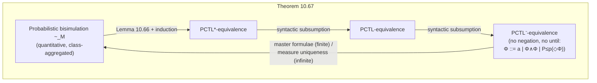

# Probabilistic Bisimulation and Markov Reward Models

[[book-guidelines|↩ Back to guidelines]]

## Recall: what you already have from PCTL and ordinary bisimulation

Two pieces of machinery are assumed background here. First, from Chapter 7: [[Bisimulation-Equivalence|bisimulation equivalence]] $\sim_{TS}$ on a transition system is the coarsest equivalence that preserves CTL/CTL$^*$ truth (Theorem 7.20), computed via partition refinement, and used to replace a large state space with a smaller quotient without losing any property you can state in the logic. Second, from earlier in this chapter: a (finite) Markov chain $M = (S, P, \iota_{init}, AP, L)$ replaces nondeterministic transitions with a genuine probability distribution $P(s, \cdot)$ over successors, and PCTL is the quantitative analogue of CTL, replacing $\exists/\forall$ with a probability-bound operator $P_J(\varphi)$.

This article asks the natural next question about both pieces at once: **does bisimulation-style state-space reduction still work when transitions carry probabilities, and does it still line up exactly with logical equivalence — now for PCTL instead of CTL?** The answer is yes, and it's the quantitative mirror image of Chapter 7's Theorem 7.20, right down to the proof shape. The chapter then turns to a second, independent extension: instead of asking "what's the probability of an event," ask "what's the *expected value* of some numeric quantity accumulated along the way" — the machinery of Markov reward models. The book covers both under one section header (10.4.2 and 10.5) because the second genuinely depends on nothing from the first; they're two separate answers to "now that I have a Markov chain, what more can I compute about it."

---

## Part I — Probabilistic Bisimulation

### What breaks if you reuse ordinary bisimulation on a Markov chain

Definition 7.7's bisimulation on transition systems says: two states are equivalent if they carry the same label, and every transition of one can be *matched* by some transition of the other into an equivalent state (and vice versa). That's a purely qualitative, existential condition — "there exists a matching successor." It throws away exactly the information a Markov chain adds: *how likely* each successor is.

Concretely, consider a state $s_1$ that moves to class $C$ with probability $0.9$ and to class $D$ with probability $0.1$, versus $s_2$ that moves to $C$ with probability $0.1$ and $D$ with probability $0.9$. Ordinary (nonprobabilistic) bisimulation on the underlying transition system $TS(M)$ — which just forgets the numbers and keeps the "can move to" relation — would happily call $s_1$ and $s_2$ equivalent: each has a transition into $C$ that the other can match, and one into $D$ that the other can match. But no PCTL formula referring to $C$ or $D$ would agree — $s_1 \models P_{\geq 0.85}(\Diamond C)$ while $s_2$ badly fails it. Reusing qualitative bisimulation on a Markov chain is therefore *unsound* as a state-reduction technique if you care about quantitative properties: it can conflate states a PCTL query needs to tell apart.

### The fix: equal cumulative probability per equivalence class

The fix, as with PCTL's fix to CTL, is surgical. Keep the "equal label" requirement, and replace "each transition matched by some transition" with "equal *total* probability of moving into each equivalence class."

> **Definition 10.60 (Bisimulation for Markov Chains).** Let $M = (S, P, \iota_{init}, AP, L)$ be a Markov chain. A probabilistic bisimulation on $M$ is an equivalence relation $R$ on $S$ such that for all $(s_1, s_2) \in R$:
> 1. $L(s_1) = L(s_2)$.
> 2. $P(s_1, T) = P(s_2, T)$ for each equivalence class $T \in S/R$,
>
> where $P(s, T) = \sum_{t \in T} P(s, t)$ is the probability of moving from $s$ directly into *some* state of $T$. States $s_1, s_2$ are bisimulation-equivalent ($s_1 \sim_M s_2$) if some probabilistic bisimulation relates them.

Two structural points are worth dwelling on, because both differ from the nonprobabilistic case:

**(a) $R$ must be an equivalence relation up front, by fiat, not just by construction.** For ordinary transition systems a bisimulation relation need not itself be symmetric or transitive (only the *coarsest* one, $\sim_{TS}$, is proven to be an equivalence, as a theorem). Here, condition 2 literally quantifies over "equivalence classes $T \in S/R$" — the definition is self-referential in a way that only typechecks if $R$ already partitions $S$. You can't defer "is this an equivalence" to a later theorem; it's baked into what a probabilistic bisimulation *is*.

**(b) Symmetric roles, asymmetric-looking arithmetic.** $P(s_1, T) = P(s_2, T)$ doesn't require $s_1$ and $s_2$ to have identical outgoing edges — only identical *aggregate mass per class*. This is what makes the fix work: two states can distribute probability differently among the individual members of $T$ (which the equivalence itself has already agreed are interchangeable) while still being bisimilar, as long as the totals per class match.

**What breaks without the equivalence-class framing (rather than a raw state-to-state comparison):** if you instead demanded $P(s_1, t) = P(s_2, t)$ for every *individual* state $t$, you'd get something closer to graph isomorphism — useless as a reduction, since it could never merge two structurally different-looking states even when they are behaviorally indistinguishable. Aggregating by class is what lets the relation actually shrink the state space, exactly as it did for ordinary bisimulation.

### Worked example: the craps game

The book's running craps-game Markov chain (states `start`, the point totals $\{4,10\}, \{5,9\}, \{6,8\}$, and absorbing `won`/`lost`) bisimulation-quotients into exactly six classes:

$$\{\mathit{start}\},\ \{\mathit{won}\},\ \{\mathit{lost}\},\ \{4,10\},\ \{5,9\},\ \{6,8\}$$

The reasoning is entirely mechanical once you have Definition 10.60: `won` and `lost` are singleton classes because they're the only states with those particular labels; `start` is alone because it's the only state that moves to `won` with probability $\frac{2}{9}$ on its first roll; and, e.g., states `5` and `9` merge because — despite being reached by different dice rolls — from that point on they have *identical* probability of eventually reaching `won` versus cycling versus reaching `lost`. The book states this precisely as: states $4{,}10$ and $6{,}8$ are provably *not* bisimilar, witnessed by the PCTL formula $P_{<\frac16}(\Diamond\, \mathit{won})$, which holds at $4,10$ but fails at $6,8$ — turning "not bisimilar" into something you can point to concretely, a decidable check, rather than an appeal to intuition.

### Extending to two Markov chains, and to paths

Just as with transition systems, bisimulation of individual states lifts to bisimulation of two entire chains $M_1, M_2$ (over the same $AP$): form the disjoint union $M = M_1 \uplus M_2$, and declare $M_1 \sim M_2$ iff their initial distributions agree on every bisimulation class of $M$: $\iota^1_{init}(T) = \iota^2_{init}(T)$ for every class $T$.

The book also lifts bisimulation to **infinite paths** (Definition 10.64): $\pi_1 \sim_M \pi_2$ iff they are *statewise* bisimilar, $s_{i,1} \sim_M s_{i,2}$ for every index $i$. This is the hook that connects state-level bisimulation to the actual probability measure over paths, via a genuinely new piece of machinery: the **bisimulation-closed $\sigma$-algebra** $\mathcal{E}^M_\sim$ (Definition 10.65), generated by cylinder sets over *equivalence classes* rather than individual states, $\mathrm{Cyl}(T_0 T_1 \ldots T_n)$. A set of paths is bisimulation-closed if membership never depends on which representative of a class you happened to land in — formally, $\Pi \in \mathcal{E}^M_\sim$ iff $\pi_1 \in \Pi \wedge \pi_1 \sim_M \pi_2 \implies \pi_2 \in \Pi$.

The payoff (**Lemma 10.66**) is that bisimilar states induce the *same probability measure* on every bisimulation-closed event: $s_1 \sim_M s_2 \implies Pr_{s_1}(\Pi) = Pr_{s_2}(\Pi)$ for all $\Pi \in \mathcal{E}^M_\sim$. The proof leans on a standard measure-theory uniqueness fact (a measure on a $\sigma$-algebra closed under intersection is determined by its values on generating sets), then checks agreement directly on cylinder sets: $Pr_{s_1}(\mathrm{Cyl}(T_0 \ldots T_n)) = P(T_0,T_1) \cdots P(T_{n-1},T_n) = Pr_{s_2}(\mathrm{Cyl}(T_0 \ldots T_n))$, using exactly Definition 10.60's class-aggregated transition probabilities.

### The quotient chain

> **Definition 10.62 (Bisimulation Quotient).** $M/{\sim_M} = (S/{\sim_M},\ P',\ \iota'_{init},\ AP,\ L')$ where $P'([s]_\sim, [t]_\sim) = P(s, [t]_\sim)$, $\iota'_{init}([s]_\sim) = \sum_{s' \in [s]_\sim} \iota_{init}(s')$, and $L'([s]_\sim) = L(s)$.

This is well-defined precisely *because* Definition 10.60's second clause guarantees $P(s,T) = P(s',T)$ for any $s \sim s'$ — pick any representative of $[s]_\sim$ and you get the same outgoing distribution on the quotient. The quotient is computed, in practice, by the same partition-refinement family of algorithms covered for ordinary transition systems (Chapter 7, §7.3) — the splitter/stability machinery generalizes directly, now testing "does this block send equal cumulative probability into that block" instead of "can every state in this block reach that block."

### The centerpiece: bisimulation coincides with PCTL/PCTL$^*$ equivalence

This is the quantitative analogue of Theorem 7.20, and it's [[Liveness-Properties-and-the-Safety-Liveness-Decomposition#The theorem|the theorem]] that makes the whole construction worth having rather than a curiosity.

> **Theorem 10.67.** For a Markov chain $M$ and states $s_1, s_2$, the following are equivalent:
> (a) $s_1 \sim_M s_2$;
> (b) $s_1, s_2$ are PCTL$^*$-equivalent;
> (c) $s_1, s_2$ are PCTL-equivalent;
> (d) $s_1, s_2$ are PCTL$^-$-equivalent, where PCTL$^-$ is the fragment $\Phi ::= a \mid \Phi_1 \land \Phi_2 \mid P_{\leq p}(\Diamond\Phi)$ — **no negation, no until, just atomic propositions, conjunction, and a bounded-reachability probability bound.**

Two things here are sharper than the nonprobabilistic Theorem 7.20, and both are worth internalizing because they say something structural about *why* probabilities make bisimulation easier to characterize logically, not harder:

**Negation disappears from the distinguishing fragment.** In the CTL case (Chapter 7, Remark 7.23), the minimal distinguishing fragment still needs full propositional logic — conjunction *and* negation — even though `until` can be dropped. Here, PCTL$^-$ drops negation entirely and the coincidence still holds. Intuitively: a probability bound $P_{\leq p}$ already carries an implicit "or greater," so the numeric ordering on $[0,1]$ does double duty that Boolean negation would otherwise have to provide.

**The result needs no finiteness assumption.** Theorem 7.20 is stated (and, in its full form, needs Lemma 7.25's extra work) for finitely-branching systems. Theorem 10.67 holds for *any* Markov chain, arbitrarily infinite, at the cost of a genuinely different proof technique for the hard direction: instead of building one finite "master formula" per equivalence class (which would require an infinite conjunction over infinitely many classes), the book takes $\mathcal{E}_S$, the smallest $\sigma$-algebra generated by all PCTL$^-$ satisfaction sets, and argues *any two probability measures agreeing on a $\cap$-closed generating family agree everywhere on the $\sigma$-algebra it generates* — a measure-theoretic uniqueness argument standing in for the combinatorial "conjoin every separating formula" trick that only worked because Chapter 7's state spaces were finite.

The proof structure is otherwise the expected chain: **(a)$\Rightarrow$(b)** uses Lemma 10.66 directly — bisimilar states agree on every bisimulation-closed event, and structural induction on PCTL$^*$ [[Timed-CTL-and-TCTL-Model-Checking#Syntax|syntax]] shows every formula's satisfaction set is bisimulation-closed. **(b)$\Rightarrow$(c)$\Rightarrow$(d)** are free, by sublogic inclusion. **(c)$\Rightarrow$(a)** for *finite* chains reuses Chapter 7's master-formula idea, now built from PCTL: for classes $T \neq U$ under PCTL-equivalence, find a separating formula $\Phi_{T,U}$, conjoin them into a master formula $\Phi_T$ with $\mathit{Sat}(\Phi_T) = T$ exactly, and read off $P(s_1,T) = P(s_2,T)$ from $s_1 \models P_{\leq p}(\Diamond \Phi_T) \iff s_2 \models P_{\leq p}(\Diamond \Phi_T)$ at $p = P(s_1,T)$. **(d)$\Rightarrow$(a)** for the general (possibly infinite) case is the measure-theoretic argument above.

**What this buys you, concretely:** to prove two states of a Markov chain are *not* bisimilar, you never need to reach for full PCTL$^*$, or even full PCTL — a single formula of the form $P_{\leq p}(\Diamond \Phi)$ always suffices if one exists at all. And to justify replacing $M$ by the (potentially much smaller) quotient $M/{\sim_M}$ before running a PCTL$^*$ model checker, Theorem 10.67 is the entire soundness argument, in exactly the same shape as Chapter 7's Corollary 7.27 for CTL$^*$.



### Grounding: computing and trusting a probabilistic quotient

**Rust.** The engineering shape is identical to the CTL case, just with a probability-mass equality test replacing a reachability-set equality test inside the refinement loop:

```rust
/// A block of the current partition; refined until stable.
struct Block { id: usize, states: Vec<StateId> }

/// A stability test corresponding to Definition 10.60, clause 2:
/// does every state in `block` send equal cumulative probability
/// into `target`? If not, `block` must be split (it is a "splitter").
fn is_stable_wrt(model: &MarkovChain, block: &Block, target: &Block) -> bool {
    let mut mass_per_state: Vec<f64> = block
        .states
        .iter()
        .map(|&s| model.cumulative_prob(s, &target.states)) // P(s, T)
        .collect();
    mass_per_state
        .windows(2)
        .all(|w| (w[0] - w[1]).abs() < f64::EPSILON)
}

/// Partition refinement for probabilistic bisimulation: start from the
/// AP-partition (as in the nonprobabilistic case), then repeatedly find
/// an unstable (block, splitter) pair and split `block` by the exact
/// P(s, splitter) value each state carries, until no splitter remains.
fn probabilistic_bisimulation_quotient(model: &MarkovChain) -> Vec<Block> {
    // Same splitter-driven loop as Chapter 7's Refine(Pi, C); only the
    // predicate inside `is_stable_wrt` changed from set-based reachability
    // to floating/rational probability-mass equality.
    todo!()
}
```

The one real implementation trap this glosses over: floating-point equality of `P(s, T)` values is not what the math actually asks for. A faithful implementation keeps transition probabilities as exact rationals (or works over a fixed finite-precision domain and checks equality with an explicit, justified tolerance), because Definition 10.60's condition 2 is an *exact* equality, not an approximate one — get this wrong and the quotient silently over- or under-merges states, breaking the very soundness guarantee (Theorem 10.67) you built the quotient to exploit.

**Lean.** The formal shape of the soundness obligation you'd actually want to discharge, mirroring the `bisim_preserves_CTLStar` sketch from Chapter 7 but now over a probability measure:

```lean
-- Sketch of the obligation, not a full formalization of PCTL* syntax.
theorem prob_bisim_preserves_measure
    {S} (M : MarkovChain S) (s₁ s₂ : S)
    (h : ProbBisimilar M s₁ s₂) (Π : Set (Path S)) (hΠ : BisimClosed M Π) :
    M.Pr s₁ Π = M.Pr s₂ Π := by
  sorry -- Lemma 10.66's measure-theoretic uniqueness argument

theorem prob_bisim_iff_PCTLminus_equiv
    {S} (M : MarkovChain S) (s₁ s₂ : S) :
    ProbBisimilar M s₁ s₂ ↔
      ∀ (φ : PCTLMinusFormula), Satisfies M s₁ φ ↔ Satisfies M s₂ φ := by
  sorry -- Theorem 10.67, the (a) ↔ (d) direction
```

This is worth naming explicitly against the **Static Analysis / Abstract Interpretation** focus area: probabilistic bisimulation quotienting *is* an abstraction step in the abstract-interpretation sense — it maps a concrete (large) state space to an abstract (small) one via a Galois-connection-flavored "merge states that are indistinguishable under the query language" recipe, and Theorem 10.67 is exactly the soundness theorem an abstract-interpretation framework would need to state and discharge once, up front, to license running any downstream PCTL$^*$ analysis on the smaller abstract model instead of the concrete one.

---

## Part II — Markov Reward Models

### Why probabilities alone aren't enough

PCTL and probabilistic bisimulation answer questions of the shape "what's the probability that...". Plenty of real questions aren't about probability at all: *expected* number of retransmissions before a message gets through, *average* time between failures of a multiprocessor system, *expected* power drawn by a battery-powered embedded device over a run. These are quantitative in a different sense — they ask for an expected value of some accumulated numeric quantity, not a probability mass. Nothing in PCTL as defined so far can express this; you need a new piece of structure layered on top of the Markov chain.

### Markov reward models and cumulative reward

> **Definition 10.69 (Markov Reward Model, MRM).** An MRM is a pair $(M, \mathit{rew})$ where $M$ is a Markov chain with state space $S$ and $\mathit{rew}: S \to \mathbb{N}$ assigns each state a non-negative integer reward. Intuitively, $\mathit{rew}(s)$ is earned *on leaving* $s$.

For a finite path $\pi = s_0 s_1 \ldots s_n$, the **cumulative reward** is

$$\widehat{\mathit{rew}}(\pi) = \mathit{rew}(s_0) + \mathit{rew}(s_1) + \cdots + \mathit{rew}(s_{n-1})$$

— note the last state $s_n$'s own reward is *not* counted, consistent with "reward is earned on leaving a state" (if you never leave $s_n$, you never collect its reward).

The single reward function is deliberately general enough to encode wildly different measures depending on what you set $\mathit{rew}$ to be, and the book's own zeroconf-protocol example (a station probing for a free IP address) makes this concrete with three separate reward functions over the *same* underlying chain:

- $\mathit{rew}_1$: assigns waiting time (a large constant `E` to the collision state, `n·r` to the final timeout state, `r` to each probing state) — measures elapsed time.
- $\mathit{rew}_2$: assigns $1$ to each probing state — counts the number of probes sent.
- $\mathit{rew}_3$: assigns $1$ only to the failed-attempt state — counts failures specifically.

**What breaks without a per-application reward function (rather than one fixed built-in metric):** a Markov chain that had "time" or "cost" wired directly into its transition structure would need re-modeling for every new question you wanted to ask about the same system. Decoupling the reward function from the chain means one $M$ supports arbitrarily many *independent* numeric questions ($\mathit{rew}_1, \mathit{rew}_2, \mathit{rew}_3, \ldots$) without touching the underlying probabilistic model at all — the reward function is a separate, composable annotation layer.

### Cost-bounded reachability: expected reward until a target

> **Definition 10.71 (Expected Reward for Reachability).** For $B \subseteq S$: if $Pr(s \models \Diamond B) < 1$, then $\mathit{ExpRew}(s \models \Diamond B) = \infty$. Otherwise, $\mathit{ExpRew}(s \models \Diamond B) = \sum_{r=0}^{\infty} r \cdot Pr_s\{\pi \mid \pi \models \Diamond B \wedge \mathit{rew}(\pi, \Diamond B) = r\}$, where $\mathit{rew}(\pi, \Diamond B)$ is the cumulative reward earned along $\pi$ up to (not including) the first $B$-state, or $\infty$ if $B$ is never reached.

This convergence isn't automatic-looking (an infinite sum, over an infinite set of paths, of a quantity that can itself be unbounded) — but it does converge for *any* reward function whenever $Pr(s \models \Diamond B) = 1$, because probabilities shrink geometrically along a path while rewards only add up linearly; the tail of the sum is dominated by rapidly-vanishing probability mass.

**Computing it, for finite chains, is a linear equation system** — the same recipe as unconstrained reachability probabilities in §10.1, now with a reward term added:

$$x_s = \begin{cases} 0 & \text{if } s \in B \\ \mathit{rew}(s) + \sum_{u \in \mathit{Post}(s)} P(s,u)\cdot x_u & \text{if } s \in S_{=1} \setminus B \end{cases}$$

restricted to $S_{=1} = \{s \mid Pr(s \models \Diamond B) = 1\}$ (computed first via the graph-theoretic BSCC analysis from §10.1.2), and the same nonsingularity argument used for plain reachability probabilities (Theorem 10.19) guarantees a unique solution $x = (I-A)^{-1}b$.

**Worked example (Knuth–Yao die-from-a-coin, revisited).** Reusing the seven-state chain that simulates a fair six-sided die with fair coin flips, assign reward $1$ to the two "round" states $s_{1,2,3}, s_{4,5,6}$ and $0$ elsewhere, so $\mathit{ExpRew}(s \models \Diamond B)$ counts *expected number of rounds* until an outcome is produced. Solving the resulting $5\times 5$ linear system gives $x_{s_0} = \frac{4}{3}$ — matching the closed-form check via the geometric-series identity $\sum_{r\geq 1} r \cdot \frac34 \cdot (\frac14)^{r-1} = \frac43$, which the book derives independently by differentiating $f(x) = \sum x^r = \frac{1}{1-x}$. Two independent derivations landing on the same number is exactly the kind of cross-check worth doing once you have both a closed-form and an algorithmic route to the same quantity.

**Cost-bounded reachability *probability*** is the natural companion question — not the expectation, but $Pr(s \models \Diamond^{\leq r} B)$, "probability of reaching $B$ within cumulative reward $\leq r$." This is solved by a *family* of linear equation systems indexed by the budget $r$: $x_{s,r} = 1$ if $s \in B$; $0$ if $B$ is unreachable from $s$ or $\mathit{rew}(s) > r$ already overspends the budget in one step; and otherwise $x_{s,r} = \sum_u P(s,u)\cdot x_{u,\, r - \mathit{rew}(s)}$. When every reward is strictly positive, this recursion strictly decreases $r$, so the vectors $x_0, x_1, \ldots, x_r$ can be computed in order, each from the previous ones — no simultaneous solve needed at all. Zero-reward states are the wrinkle: they can leave $x_{s,r}$ depending on other $x_{u,r}$ *at the same budget*, forcing one genuine linear-system solve per budget level $r$ (isolated to just the zero-reward states, $S_0$), interleaved with the closed-form propagation for positive-reward states. Complexity stays polynomial in $|M|$ and linear in $r$ — the budget dimension is handled iteratively, not by blowing up the state space by a factor of $r$.

**PRCTL.** Both quantities slot into a reward-aware extension of PCTL, **PRCTL** (Probabilistic Reward CTL, Definition 10.76), which adds an expectation operator $E_R(\Phi)$ with semantics $s \models E_R(\Phi) \iff \mathit{ExpRew}(s \models \Diamond\, \mathit{Sat}(\Phi)) \in R$, alongside a reward-bounded until $\Phi_1\, U^{\leq r}\, \Phi_2$ for the probability-of-cost-bound question. A single PRCTL formula like $E_{\leq 1.5}(\mathit{outcome}) \wedge \bigwedge_i P_{=1/6}(\Diamond\, i) \wedge P_{\geq 15/16}(\Diamond^{\leq 2}\, \mathit{outcome})$ can therefore say, in one breath: "average cost to finish is at most 1.5, every outcome is equally likely, and 15/16 of the time we finish within budget 2" — three genuinely different flavors of quantitative claim (expectation, plain probability, cost-bounded probability) in a single specification language.

### Long-run properties: what happens on the infinite horizon

Cost-bounded reachability is inherently about *finite* prefixes — reward accumulated before hitting a target. The second half of §10.5 asks a structurally different question: on the *infinite* horizon, what fraction of time does the system spend in each state, and what reward rate does that imply?

**Long-run distributions.** Let $\theta_n(s,t) = Pr_s\{s_0 s_1 \ldots \mid s_0 = s \wedge s_n = t\}$ be the transient ("after exactly $n$ steps") probability of being in $t$ having started in $s$ — already available from §10.1's matrix-power machinery. The **long-run average probability** is the Cesàro average of this sequence:

$$\theta(s,t) = \lim_{n\to\infty} \frac{1}{n}\sum_{i=1}^{n}\theta_i(s,t)$$

**What breaks if you just take $\lim_{n\to\infty}\theta_n(s,t)$ directly (without the Cesàro averaging):** the book's own two-state ping-pong example ($s \to t \to s \to t \to \cdots$ deterministically) shows $\theta_n(s,t)$ alternates forever between $0$ and $1$ depending on parity — the plain limit simply does not exist. Averaging over the whole prefix smooths this oscillation out: $\theta(s,t) = \frac12$ is well-defined even though no single $\theta_n(s,t)$ ever equals $\frac12$. (When the plain limit *does* exist, as in the book's second example — a chain that mixes rather than oscillates — it agrees with $\theta(s,t)$; Cesàro averaging is a genuine generalization, not a different answer.)

**Computing $\theta$ reduces, once again, to linear equation systems**, but now over each **bottom strongly connected component (BSCC)** separately — the graph-theoretic structure inherited directly from §10.1.2's qualitative reachability analysis. Within a BSCC $T$, the long-run distribution is the *unique* stationary distribution over $T$'s own transition matrix:

$$\sum_{t\in T} x_t = 1 \qquad\qquad \sum_{t\in T} x_t \cdot P(t,u) = x_u \ \text{ for all } u\in T$$

— a balance equation stating "the probability mass flowing into $u$ from the stationary distribution equals the mass already sitting at $u$." For states $s$ outside any BSCC, the long-run distribution factors cleanly through *which* BSCC gets reached: $\theta(s,t) = Pr(s \models \Diamond T)\cdot x_t$ for $t\in T$, reusing the already-computed reachability probability from §10.1.1 as a weight on that BSCC's own stationary vector.

**Expected long-run reward between visits to $B$.** Layering a reward function back on top of $\theta$ gives the final construction of the section:

$$\mathit{LongRunER}_s(B) = \sum_{t\in B} \theta(s,t)\cdot \mathit{ExpRew}^{\geq 1}(t \models \Diamond B)$$

where $\mathit{ExpRew}^{\geq 1}(t \models \Diamond B) = \mathit{rew}(t) + \sum_u P(t,u)\cdot\mathit{ExpRew}(u \models \Diamond B)$ is a "one-step-forced" variant of the cost-bounded-reachability expectation from Part II's first half — forcing at least one transition before you're allowed to count as "already there," which matters because $t\in B$ itself. Read as a sentence: *weight the expected cost of one full $B$-to-$B$ round trip starting from each $B$-state $t$, by how often the system is actually sitting at $t$ in the long run.* If $B$ marks failure states and reward is $1$ everywhere outside $B$, $\mathit{LongRunER}_s(B)$ is literally the mean time between failures — precisely the motivating example from the section's opening paragraph, now fully cashed out in terms of computable linear-algebra primitives. PRCTL's final piece, the operator $L_R(\Phi)$ with $s \models L_R(\Phi) \iff \mathit{LongRunER}_s(\mathit{Sat}(\Phi)) \in R$, exposes this at the specification-language level.

### Grounding: reward computation as a static-analysis fixed-point problem

**Rust.** Every quantity in Part II — expected reward, cost-bounded probability, long-run distribution — reduces to *solving a linear equation system derived from a graph analysis*, which is exactly the computational shape of a dataflow-analysis fixed point: partition states by a graph property (here, "almost-surely reaches $B$," or "belongs to this BSCC"), then solve for the unique fixed point of a linear recurrence over that partition.

```rust
/// Definition 10.71's equation system, solved once S_=1 is known.
/// This is structurally identical to solving a system of dataflow
/// equations at a fixed point — same "collect predecessors, weight by
/// an edge quantity, sum" recurrence, just with probabilities instead
/// of a lattice join.
fn expected_reward_until(
    chain: &MarkovChain,
    reward: &RewardFn,
    reaches_b_almost_surely: &BitSet, // S_=1, from BSCC analysis (§10.1.2)
    target: &BitSet,                  // B
) -> Vec<f64> {
    // Build (I - A) x = b over states in S_=1 \ B, where
    //   A[s][u] = P(s, u),  b[s] = reward(s),
    // and x[s] = 0 for s in B by definition.
    // Solved by any dense/sparse linear solver — Gaussian elimination
    // suffices for the sizes in the book's examples.
    todo!()
}
```

**Python.** A tiny illustrative sketch of the cost-bounded-reachability-probability recursion, useful precisely because it makes explicit how positive-reward states let you propagate $x_{s,r}$ forward in $r$ without ever re-solving a linear system — only the zero-reward states need that:

```python
def cost_bounded_reach_prob(chain, reward, B, budget):
    """Pr(s |= diamond^{<=budget} B) for every state s, computed by
    increasing r from 0 to `budget` (Section 10.5.1's recursion)."""
    x = {r: {} for r in range(budget + 1)}
    for r in range(budget + 1):
        for s in chain.states:
            if s in B:
                x[r][s] = 1.0
            elif not chain.can_reach(s, B) or reward[s] > r:
                x[r][s] = 0.0
            elif reward[s] > 0:
                # strictly decreasing budget -> just look up an earlier row
                x[r][s] = sum(
                    chain.prob(s, u) * x[r - reward[s]][u]
                    for u in chain.states
                )
            # zero-reward states with reward[s] == 0 and rew(s) <= r:
            # left as a linear system over S_0, solved separately per r.
    return x[budget]
```

This asymmetry — positive-reward states solved by forward substitution, zero-reward states requiring an actual linear solve — is the same pattern that shows up whenever a fixed-point computation has both "strictly progressing" and "stationary" components: you always want to isolate the smallest possible subsystem that genuinely needs simultaneous solving, and propagate everything else by substitution. That's a recurring efficiency move in dataflow/abstract-interpretation fixed-point solvers generally, not something specific to Markov chains.

---

## Where this leads

**Backward dependencies:** Part I leans on Chapter 7's bisimulation and partition-refinement machinery (generalizing the splitter/stability tests to probability-mass equality) and on this chapter's own PCTL/PCTL$^*$ semantics. Part II leans on §10.1's reachability-probability linear-equation-system technique and its BSCC-based graph analysis, applied twice more — once for expected reward, once for long-run distributions.

**Forward dependencies:** Chapter 10 moves next to **[[Markov-Decision-Processes|Markov Decision Processes]]**, where nondeterminism returns alongside probability, resolved by a scheduler; extremal (min/max) versions of exactly the reachability-probability and long-run-behavior questions asked here reappear, now optimized over all schedulers rather than computed for a single fixed chain. The PRCTL-style reward operators sketched here foreshadow the corresponding reward-aware extensions the book gestures toward for MDPs.

**On the standing project (Focus Area: `static-analysis`):** the throughline of this whole article is that both halves — bisimulation quotienting and reward computation — are instances of the same two general moves your compiler's static-analysis passes will need. Probabilistic bisimulation is an *abstraction* step: merge concrete states that are indistinguishable to the query language, backed by an explicit soundness theorem (10.67) in the same shape as any abstract-interpretation Galois-connection soundness argument — you always need "the abstraction preserves exactly what the analysis can observe" stated and proved once, up front. Reward computation is a *fixed-point-over-a-graph-partition* problem: determine a reachability-style partition first (here, $S_{=1}$ or a BSCC), then solve a linear recurrence restricted to it — precisely the two-phase shape ("compute the graph structure, then solve the numeric fixed point on top of it") that invariant generation over Horn clauses or Hoare-style dataflow analyses will reuse, just with a lattice join replacing a probability sum.
