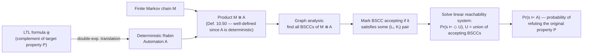

[[book-guidelines|↩ Back to guidelines]]

# Probabilistic [[Computation-Tree-Logic|Computation Tree Logic]]

## Recall: what a Markov chain gives you, and what it doesn't

Before PCTL, you should already have Chapter 10's basic machinery in place (§10.1, covered elsewhere): a (finite) Markov chain $M = (S, P, \iota_{init}, AP, L)$ replaces a transition system's nondeterministic step relation with a genuine *probability distribution* over successors — $P(s, s')$ is the probability of moving from $s$ to $s'$, and $\sum_{s' \in S} P(s, s') = 1$ for every non-absorbing $s$. Infinite paths through $M$ get a probability measure $Pr_s$ built from cylinder sets (fix a finite prefix, sum the probability mass of every infinite continuation), and reachability of a target set $B$ reduces to either a linear equation system or, for the qualitative question "does $B$ get hit almost surely (probability 1)?", a purely graph-theoretic BSCC (bottom strongly connected component) analysis: from any state, almost every path eventually gets absorbed into some BSCC and then visits *every* state of that BSCC infinitely often (this is Theorem 10.27 in the book, and it will do a lot of quiet work below).

What that machinery does *not* give you is a **logic** — a compositional language for stating properties like "eventually, always" and getting a decision procedure back. CTL was that logic for plain transition systems. The obvious question: what does CTL become when the underlying model is a Markov chain instead of a transition system? That's PCTL.

## What breaks if you just reuse CTL on a Markov chain

CTL's two path quantifiers, $\exists\varphi$ ("some path satisfies $\varphi$") and $\forall\varphi$ ("every path satisfies $\varphi$"), are Boolean questions about a *set* of paths: is it empty, or is it everything? A Markov chain hands you something richer than a bare set of paths — every path carries a probability — and $\exists/\forall$ throw that information away. Concretely:

- $\exists\varphi$ becomes almost content-free once every state has *some* infinite path leaving it (true of any non-deadlocked Markov chain): "some execution reaches the goal" is nearly always true, even if that execution occurs with probability $10^{-9}$.
- $\forall\varphi$ becomes needlessly strict: "every execution reaches the goal" fails the moment even one bizarrely unlucky, probability-zero path misbehaves — even though *almost every* execution you'd ever actually observe succeeds.

Neither extreme is what you usually want to ask about a randomized protocol, a fault-tolerant system, or a randomized algorithm. You want "reaches the goal with probability $\geq 0.99$," or "loses the message with probability $0$." That is a *quantitative* question sitting strictly between $\exists$ and $\forall$, and CTL's [[Timed-CTL-and-TCTL-Model-Checking#Syntax|syntax]] has no slot for it.

## PCTL syntax: replacing path quantifiers with a probability bound

PCTL's fix is surgical: keep CTL's two-tiered syntax (state formulae vs. path formulae) intact, and replace the pair of quantifiers $\{\exists, \forall\}$ with a single **probabilistic operator** $P_J(\varphi)$, where $\varphi$ is a path formula and $J \subseteq [0,1]$ is a rational-bounded interval.

> **Definition 10.36 (Syntax of PCTL).** State formulae:
> $$\Phi ::= \mathit{true} \mid a \mid \Phi_1 \land \Phi_2 \mid \neg\Phi \mid P_J(\varphi)$$
> Path formulae:
> $$\varphi ::= \bigcirc \Phi \mid \Phi_1 \, U \, \Phi_2 \mid \Phi_1 \, U^{\leq n} \, \Phi_2$$
> where $a \in AP$, $J \subseteq [0,1]$ is an interval with rational endpoints, and $n \in \mathbb{N}$.

Everything here is familiar from CTL except two things. First, as in CTL, the temporal operators $\bigcirc$ (next) and $U$ (until) are *syntactically forced* to sit immediately inside a $P_J$ — you can't write a bare path formula as a state formula, exactly as CTL forbids a bare $\bigcirc a$ without an $\exists$/$\forall$ in front. Second, PCTL adds a genuinely new operator absent from CTL: **step-bounded until**, $\Phi_1 U^{\leq n} \Phi_2$, meaning "$\Phi_2$ is reached within at most $n$ steps, and $\Phi_1$ holds at every state visited strictly before that." This exists because for Markov chains — unlike transition systems — *when* something happens changes its probability, so a bare unbounded $U$ and a step-bounded $U^{\leq n}$ are genuinely different quantities to compute, not just stylistic variants.

Notation you'll see constantly: $P_{\leq 0.5}(\varphi)$ abbreviates $P_{[0,0.5]}(\varphi)$, $P_{=1}(\varphi)$ abbreviates $P_{[1,1]}(\varphi)$, $P_{>0}(\varphi)$ abbreviates $P_{]0,1]}(\varphi)$. The derived operators are exactly as in CTL: $\Diamond\Phi := \mathit{true}\,U\,\Phi$, $\Diamond^{\leq n}\Phi := \mathit{true}\,U^{\leq n}\Phi$, and $\Box$ (always) falls out by duality — flipping "eventually the bad thing happens with probability $\leq p$" into "eventually the bad thing's negation happens with probability $\geq 1-p$":
$$P_{\leq p}(\Box\Phi) = P_{\geq 1-p}(\Diamond\neg\Phi).$$

**Rust framing.** The syntax is a completely standard recursive sum type — exactly the AST you'd write for CTL, plus one new constructor:

```rust
enum PctlPath {
    Next(Box<PctlState>),
    Until(Box<PctlState>, Box<PctlState>),
    BoundedUntil(Box<PctlState>, Box<PctlState>, u64), // the new operator: n
}

enum PctlState {
    True,
    Atom(String),
    And(Box<PctlState>, Box<PctlState>),
    Not(Box<PctlState>),
    Prob(Interval, PctlPath), // P_J(phi) — replaces CTL's Exists/Forall
}

struct Interval { lo: Rational, hi: Rational } // J ⊆ [0,1]
```

If you've already built a CTL AST, this is a two-line diff: delete `Exists`/`Forall` from the path-quantifier layer, add one `Interval` field to whatever wraps a path formula, and add `BoundedUntil`.

## The probabilistic operator as a quantitative path quantifier

The semantics makes the "quantitative $\exists/\forall$" framing precise. States satisfy Boolean combinations as usual; the interesting clause is:

> **Definition 10.38 (Satisfaction relation).**
> $$s \models P_J(\varphi) \quad\text{iff}\quad Pr(s \models \varphi) \in J, \qquad \text{where } Pr(s \models \varphi) = Pr_s\{\pi \in \mathit{Paths}(s) \mid \pi \models \varphi\}.$$

Path-formula satisfaction ($\pi \models \bigcirc\Phi$, $\pi \models \Phi_1 U \Phi_2$, $\pi \models \Phi_1 U^{\leq n}\Phi_2$) is defined identically to CTL/LTL, state-by-state along the path. The only new machinery is that $Pr(s \models \varphi)$ has to actually *be* a number — which requires the set $\{\pi \mid \pi \models \varphi\}$ to be measurable (an element of the $\sigma$-algebra $\mathcal{E}_M$ built from cylinder sets). **Lemma 10.39** confirms this holds for every PCTL path formula: next-step events are finite unions of cylinder sets, bounded-until events are finite unions over paths of length $\leq n$, and unbounded until is a countable union over $n$ of the bounded case — so measurability is inherited "for free" from the way PCTL's grammar is stratified.

Now the quantitative-quantifier picture becomes literal. CTL's $\exists\varphi$ asserts *some* path in the (possibly infinite) set of paths satisfies $\varphi$ — a claim about whether that set is empty. CTL's $\forall\varphi$ asserts the complement is empty. $P_J(\varphi)$ asks a strictly finer question: not "is the set of $\varphi$-paths empty?" but "*how much probability mass* does it carry?" $\exists$ and $\forall$ are recovered as the two extreme, degenerate intervals — but, crucially, **not exactly**:

$$s \models P_{=1}(\bigcirc a) \iff s \models \forall\bigcirc a \qquad\qquad s \models P_{>0}(\bigcirc a) \iff s \models \exists\bigcirc a$$

These hold for the *next*-step and (as shown below) *reachability* modalities. But they fail in general for iterated/persistent properties, which is the crux of the expressiveness gap discussed further down.

**What breaks without a genuine probability bound (not just $>0$/$=1$):** you cannot express "the message is delivered within 3 retries with probability at least $0.99$" using $\exists$/$\forall$ at all — that statement isn't equivalent to *either* extreme. Example 10.37 in the book gives exactly this kind of formula for an unreliable channel:
$$P_{=1}(\Diamond\, \mathit{delivered}) \;\land\; P_{=1}\big(\Box\,(\mathit{try\_to\_send} \rightarrow P_{\geq 0.99}(\Diamond^{\leq 3}\, \mathit{delivered}))\big)$$
— "almost surely some message eventually gets delivered, **and** almost surely every send attempt succeeds within 3 steps with probability $\geq 0.99$." Note the *nesting*: an outer $P_{=1}$ wrapping an inner $P_{\geq 0.99}$ as an atomic state predicate. This nesting is exactly as legal, and exactly as essential, as nesting $\forall\Box\exists\Diamond$ was in plain CTL — it's how you say "in *every* reachable configuration, this quantitative guarantee holds."

A dice-from-a-coin example (Example 10.37) shows how naturally probabilities interact with disjointness constraints: $\bigwedge_{1\le i\le 6} P_{=1/6}(\Diamond\, i)$ says each of six outcomes should occur with equal probability — a statement about the *joint shape* of a probability distribution that has no CTL analogue whatsoever, quantitative or not.

## PCTL model checking: bottom-up on the parse tree, exactly like CTL

### The algorithm

The decision problem — given finite $M$, state $s$, PCTL formula $\Phi$, does $s \models \Phi$? — is solved the same way [[CTL-Model-Checking|CTL model checking]] is solved (Algorithm 13 in the book): recursively compute $\mathit{Sat}(\Psi)$ for every subformula $\Psi$ of $\Phi$, bottom-up over the parse tree. The propositional fragment ($\mathit{true}$, atoms, $\land$, $\neg$) is handled identically to CTL — set intersection, complementation, membership tests.

The only case requiring new machinery is $\Psi = P_J(\varphi)$: compute the *actual probability* $Pr(s \models \varphi)$ for every state $s$, then threshold:
$$\mathit{Sat}(P_J(\varphi)) = \{s \in S \mid Pr(s \models \varphi) \in J\}.$$

Each shape of $\varphi$ reduces to a numerical-linear-algebra primitive already available from the reachability machinery in §10.1:

| Path formula $\varphi$ | How $Pr(s \models \varphi)_{s \in S}$ is computed |
|---|---|
| $\bigcirc \Psi$ | **one matrix–vector multiplication**: $Pr(s \models \bigcirc\Psi) = \sum_{s' \in \mathit{Sat}(\Psi)} P(s,s')$, i.e. $P \cdot \mathbf{b}$ where $\mathbf{b}$ is the characteristic (0/1) vector of $\mathit{Sat}(\Psi)$ |
| $\Phi\,U^{\leq n}\,\Psi$ | $O(n)$ vector–matrix multiplications (iterate the bounded-reachability recurrence $n$ times) |
| $\Phi\,U\,\Psi$ | solve **one linear equation system** of size $N \times N$, $N = \lvert S \rvert$ |

Because the propositional layer is polynomial and each temporal subformula costs at most a linear-system solve (polynomial in $\lvert S \rvert$), the whole thing is:

> **Theorem 10.40.** $M \models \Phi$ is decidable in time $O(\mathit{poly}(\mathit{size}(M)) \cdot n_{max} \cdot \lvert \Phi \rvert)$, where $n_{max}$ is the largest step bound appearing in any $U^{\leq n}$ subformula of $\Phi$ ($n_{max} = 1$ if there is none).

This is the direct probabilistic analogue of CTL's $O(\mathit{size}(TS)\cdot\lvert\Phi\rvert)$ bound: same bottom-up shape, same asymptotic linearity in formula size, with the extra $n_{max}$ factor purely a cost of unrolling bounded-until and a polynomial (rather than linear) per-node cost from solving linear systems instead of doing graph reachability. For the important special case of **qualitative** thresholds ($=1$, $>0$) the book notes you don't need to solve equations at all — graph-based BSCC reachability (Corollary 10.29, reused from §10.1) suffices, which is both cheaper and numerically exact (no floating-point linear-algebra error).

```rust
// Bottom-up Sat computation — the shape is identical to a CTL model checker;
// only the `Prob` arm does genuinely new numerical work.
fn sat(m: &MarkovChain, phi: &PctlState) -> BitSet {
    match phi {
        PctlState::True => BitSet::all(m.num_states()),
        PctlState::Atom(a) => m.states_labeled(a),
        PctlState::And(l, r) => sat(m, l) & sat(m, r),
        PctlState::Not(inner) => !sat(m, inner),
        PctlState::Prob(interval, path) => {
            let prob: Vec<f64> = match path {
                PctlPath::Next(psi) => {
                    let b = sat(m, psi);
                    m.transition_matrix().mul_bitvec(&b) // one mat-vec product
                }
                PctlPath::BoundedUntil(phi1, psi, n) => {
                    bounded_until_prob(m, &sat(m, phi1), &sat(m, psi), *n) // O(n) iterations
                }
                PctlPath::Until(phi1, psi) => {
                    unbounded_until_prob(m, &sat(m, phi1), &sat(m, psi)) // solve Ax = b
                }
            };
            (0..m.num_states()).filter(|&s| interval.contains(prob[s])).collect()
        }
    }
}
```

### Witnesses and counterexamples

CTL's diagnostic story — when a formula fails, point at the offending path — needs adjustment, because a single path proves nothing about a *probability*. The natural probabilistic notion of a witness is a **finite set of paths whose combined probability mass crosses the threshold**. For $s \models P_{\leq p}(\Diamond\Psi)$ to be *refuted* (i.e. to witness $s \not\models P_{\leq p}(\Diamond\Psi)$, meaning $Pr(s \models \Diamond\Psi) > p$), you exhibit a finite set $\Pi$ of finite path fragments, each reaching $\Psi$, whose probabilities sum to more than $p$:
$$\Pi = \{s_0 s_1 \dots s_n \mid s_0 = s,\; s_i \not\models \Psi \text{ for } i<n,\; s_n \models \Psi\}, \qquad \sum_{\hat\pi \in \Pi} P(\hat\pi) > p.$$
Example 10.41 makes this concrete: three finite paths with probabilities $0.2, 0.2, 0.15$ (summing to $0.55 > 0.5$) witness $s_0 \not\models P_{\leq 1/2}(\Diamond b)$ in a small chain. Crucially, **counterexamples are not unique** — swapping one witnessing path for another with the same or greater probability still works, unlike CTL where a counterexample path is at least canonical in its role (a single lasso is either a counterexample or it isn't). This is the probabilistic analogue of a **proof certificate**: instead of a single derivation, you certify a *quantitative* claim with an auditable, checkable lower bound on accumulated evidence — the same shape of argument that shows up wherever you need to certify "this bound holds" rather than "this fact holds" (e.g. certifying a numeric weakest-precondition bound rather than a Boolean invariant).

For the *dual* direction, $s \models P_{\geq p}(\Diamond\Psi)$ refuted, you instead collect finite paths that permanently avoid $\Psi$ (ending in a BSCC disjoint from $\mathit{Sat}(\Psi)$) whose mass exceeds $1-p$ — using the same duality ($Pr(\Diamond\Psi) = 1 - Pr(\Box\neg\Psi)$) that recurs throughout this chapter.

## The qualitative fragment, and why it is *not* just CTL in disguise

Restrict $P_J$ to only the two qualitative bounds $>0$ and $=1$ (with $=0$ and $<1$ derivable by negation), and drop step-bounded until (it has no natural qualitative reading):

> **Definition 10.42.** $\Phi ::= \mathit{true} \mid a \mid \Phi_1\land\Phi_2 \mid \neg\Phi \mid P_{>0}(\varphi) \mid P_{=1}(\varphi)$, with $\varphi ::= \bigcirc\Phi \mid \Phi_1\,U\,\Phi_2$.

The tempting conjecture is that this qualitative fragment is *just CTL with $\exists$ relabeled as $P_{>0}$ and $\forall$ as $P_{=1}$*. It's tempting because it's *almost* true — and the two places it fails are exactly where the qualitative/quantitative divide runs.

**It agrees with CTL for next-step and (unconstrained/constrained) reachability:**
$$s \models P_{=1}(\bigcirc a) \iff s \models \forall\bigcirc a, \qquad s \models P_{>0}(\Diamond a) \iff s \models \exists\Diamond a, \qquad s \models P_{>0}(a\,U\,b) \iff s\models\exists(a\,U\,b).$$
The proof of the reachability case is genuinely simple and worth internalizing because it's the template for all these equivalences: $s \models \exists\Diamond a$ means some *finite* path fragment $s_0\dots s_n$ reaches an $a$-state; but every finite path fragment has strictly positive probability (it's a specific product of nonzero transition probabilities), so the cylinder set it generates already witnesses $Pr(s \models \Diamond a) > 0$. Existence of *one* finite witness path is enough to push probability above zero.

**It disagrees with CTL for iterated properties — $\Box$ and repeated $\Diamond$:**
$$s \models P_{=1}(\Diamond a) \;\;\not\Longleftrightarrow\;\; s \models \forall\Diamond a.$$
Only the $\Rightarrow$ direction of the *strong* claim survives ($\forall\Diamond a \Rightarrow P_{=1}(\Diamond a)$, trivially — if literally every path succeeds, certainly almost every path does). The reverse fails on a two-state chain with a self-loop: from $s$, transition to $\{a\}$-state $s_1$ with probability $\frac12$ and self-loop back to $s$ with probability $\frac12$. Every *finite* prefix has a chance of hitting $a$ next, so almost surely $a$ eventually holds ($P_{=1}(\Diamond a)$ holds) — but the single infinite path $s^\omega$ (always take the self-loop) is a legitimate path that never visits $a$, so $\forall\Diamond a$ fails. **Lemma 10.44** proves formally that *no* CTL formula is equivalent to $P_{=1}(\Diamond a)$ at all (not just this specific $\forall\Diamond a$ candidate), using a random-walk Markov chain $M_p$ where the *same underlying graph* (hence the same CTL truth values, since CTL only sees $TS(M)$, the graph with probabilities erased) yields different PCTL truth values depending on whether the drift probability $p$ is above or below $\frac12$ — a fact CTL is structurally blind to because it never looks at transition weights.

Conversely, **Lemma 10.45** shows the qualitative fragment *loses* expressive power CTL has: no qualitative PCTL formula is equivalent to $\forall\Box\Diamond a$ (or, dually, $\exists\Box a$). The proof is a clean "distinguishability via nesting depth" argument: build a family of Markov-chain pairs $(M_n, M_n')$ that agree on states $t_0,\dots,t_{n-1}$ but differ at the far end (one has a self-looping state $s_n$, the other a plain state $t_n$ funneling into the shared chain), such that *any* qualitative PCTL formula of nesting depth $< n$ cannot tell $s_n$ from $t_n$ apart — yet a CTL formula ($\forall\Box\Diamond a$) trivially can, because $s_n s_n s_n\dots$ is a legal (if probability-zero) path violating it while no such path exists from $t_n$.

**The takeaway — and what breaks without treating them as incomparable, not nested:** the two logics are genuinely **incomparable**, not one a sublogic of the other. Their common ground is next-step and plain (un-iterated) reachability; the moment you need "eventually forever" ($\forall\Box\Diamond a$) you need CTL's zero-tolerance semantics over *every* path including probability-zero anomalies, and the moment you need "with probability 1, possibly excusing a measure-zero set of pathological runs" ($P_{=1}(\Diamond a)$) you need something CTL cannot express at all. The reason: qualitative PCTL is *blind to self-loops that never get taken with any real frequency* (probability-zero infinite executions), while CTL treats every syntactically-possible path, however implausible, as equally disqualifying. This is exactly the same gap that motivates *[[Fairness|fairness]] constraints* on transition systems elsewhere in the book — and indeed the text shows that under an appropriate strong-fairness assumption ($s_{fair}$, "if $s$ recurs infinitely often, every successor of $s$ recurs infinitely often too"), $P_{=1}(\Box(a\,U\,b))$ and $\forall_{s_{fair}}(a\,U\,b)$ *do* coincide — fairness is precisely the syntactic patch that rules out the zero-probability self-loop pathology CTL otherwise can't ignore. Qualitative PCTL, on finite Markov chains, behaves like "CTL plus a canonical strong-fairness assumption baked directly into the semantics," free of charge.

Two properties famous for being *inexpressible in CTL at all* (repeated reachability $\exists\Box\Diamond a$'s persistence dual, and universal persistence $\forall\Diamond\Box a$) turn out to be PCTL-definable for finite chains — because finiteness guarantees almost every path funnels into some BSCC and then hits every BSCC state infinitely often (again, Theorem 10.27 doing the heavy lifting):
$$s \models P_J\big(\Diamond\, P_{=1}(\Diamond a)\big) \iff Pr(s \models \Diamond a) \in J \qquad \text{(Theorem 10.47, repeated reachability)}$$
$$s \models P_J\big(\Diamond\, P_{=1}(\Box a)\big) \iff Pr(s \models \Diamond\Box a) \in J \qquad \text{(Theorem 10.48, persistence)}$$
Both encode "almost surely, eventually you land inside a BSCC where the property holds forever" — turning a global, infinite-horizon claim into a nested finite-horizon reachability computation, which is exactly why they're PCTL-checkable in polynomial time despite talking about infinite behavior.

## Linear-time properties: computing probabilities via deterministic Rabin automata

Bounded reachability and until cover a lot, but not everything — you sometimes want the probability of an arbitrary $\omega$-regular ("linear-time") property $P$, e.g. an LTL formula. The strategy is the direct probabilistic descendant of automata-based LTL model checking on transition systems (product construction + graph analysis) — with one indispensable change forced by the probabilistic setting.

**Why the automaton must be deterministic.** Ordinary automata-based LTL model checking builds the product of a transition system with a *nondeterministic* Büchi automaton (NBA) and asks a graph-reachability question — nondeterminism is harmless there because you only care about *existence* of an accepting run. In a Markov chain, the product $M \otimes A$ is only itself a well-defined Markov chain (transition probabilities that sum to 1) if $A$ has **at most one** successor per state per symbol — i.e. $A$ must be *deterministic*. An NBA's product with $M$ would need to "probabilistically split" along multiple nondeterministic choices with no well-defined probability to assign each branch. This single constraint is why this section exists at all: it's not enough to reuse the automata already built for the non-probabilistic setting, because deterministic Büchi automata (DBAs) are **strictly less expressive** than general $\omega$-regular languages — DBAs can't even express plain persistence ($\Diamond a$).

**The fix: deterministic Rabin automata (DRAs).** A DRA $A = (Q, \Sigma, \delta, q_0, Acc)$ has an acceptance condition given by a *set of pairs* $Acc = \{(L_1,K_1),\dots,(L_k,K_k)\}$, $L_i, K_i \subseteq Q$; a run is accepting if for **some** pair $i$, states in $L_i$ occur only finitely often while states in $K_i$ occur infinitely often — i.e. the run satisfies $\bigvee_i (\Diamond\Box\neg L_i \land \Box\Diamond K_i)$. This is exactly expressive enough to be deterministic *and* capture all $\omega$-regular properties:

> **Theorem 10.55.** The languages accepted by DRAs are exactly the $\omega$-regular languages.

(An NBA of size $n$ can be determinized into an equivalent DRA of size $2^{O(n\log n)}$ — the classical Safra-style construction, cited but not reproduced in the book.)

**The pipeline, step by step:**



Concretely: (1) represent $\neg P$ (or the bad prefixes, for a regular safety property — a DFA suffices there, no Rabin condition needed) as a DRA $A$; (2) form the product Markov chain $M \otimes A$, whose states are pairs $\langle s,q\rangle$ and whose probabilities are exactly $M$'s (the deterministic automaton just "tags along" recording its own state per Definition 10.50 — it never affects probabilities, since there's no branching to resolve); (3) find $M \otimes A$'s BSCCs by a standard graph algorithm; (4) a BSCC $T$ is **accepting** iff, for some pair $(L_i,K_i)$, $T$ never touches $S\times L_i$ but does touch $S\times K_i$ — checking this is a finite membership test per BSCC, not a probabilistic computation; (5) let $U$ be the union of accepting BSCCs, and solve the reachability system for $Pr(\langle s,q_s\rangle \models \Diamond U)$ using the ordinary linear-equation machinery from §10.1.1.

> **Theorem 10.56.** $Pr^M(s \models A) = Pr^{M\otimes A}(\langle s,q_s\rangle \models \Diamond U)$.

The reasoning underneath is a **projection lemma**: because $A$ is deterministic, every path $\pi$ in $M$ has a *unique* corresponding run in $A$, so lifting $\pi$ to $\pi^+ = \langle s_0,q_1\rangle\langle s_1,q_2\rangle\cdots$ in the product preserves probability exactly ($Pr^M_s(\Pi) = Pr^{M\otimes A}_{s,q_s}(\Pi^+)$) while making the acceptance condition into a plain reachability question about which BSCC gets absorbed into. The overall time complexity is $O(\mathit{poly}(\mathit{size}(M), \mathit{size}(A)))$ — polynomial once the automaton exists.

**What this costs you.** Translating an LTL formula $\varphi$ into a DRA can blow up **doubly exponentially** in $\lvert\varphi\rvert$ (there exist formulas whose smallest DRA has $2^{2^n}$ states); more advanced techniques bring this down to single-exponential, but no better, because:

> **Theorem 10.58.** The *qualitative* model-checking problem for finite Markov chains and LTL ("does $\Pr(M \models \varphi) = 1$?") is **PSPACE-complete** (Vardi).

Since ordinary LTL model checking on transition systems is already PSPACE-complete, this says the probabilistic version is no harder in the worst case — but you also can't hope to avoid at least an exponential automaton construction along the way, since that's baked into how LTL relates to automata in the first place.

## PCTL$^*$: dropping the "one probability operator per temporal step" restriction

PCTL forces every temporal operator to be immediately preceded by $P_J$ — you cannot write $\bigcirc\Box a$ as a bare path formula, only wrapped, and you cannot Boolean-combine two path formulae before wrapping them. **PCTL$^*$** removes both restrictions, the same way CTL$^*$ generalizes CTL:

> **Definition 10.59 (Syntax of PCTL$^*$).** State formulae: $\Phi ::= \mathit{true} \mid a \mid \Phi_1\land\Phi_2 \mid \neg\Phi \mid P_J(\varphi)$. Path formulae: $\varphi ::= \Phi \mid \varphi_1\land\varphi_2 \mid \neg\varphi \mid \bigcirc\varphi \mid \varphi_1\,U\,\varphi_2$.

Now $\varphi$ inside $P_J(\varphi)$ is a genuine **LTL formula** whose atomic propositions may themselves be arbitrary PCTL$^*$ state formulae — so $P_{\ge 0.9}(\Box\Diamond a \lor \bigcirc(P_{=1}(\Diamond b)))$ is syntactically legal, mixing arbitrary LTL path structure with arbitrary nesting depth of probability bounds. PCTL sits inside PCTL$^*$ as the syntactic sub-fragment where every temporal operator is directly wrapped by a $P_J$; PCTL$^*$ is *strictly* more expressive than both plain LTL-with-probability-bounds and PCTL (it subsumes the repeated-reachability/persistence encodings of Theorems 10.47–10.48 as first-class syntax rather than as PCTL-derived tricks — $P_J(\Diamond\Phi)$ and $P_J(\Diamond P_{=1}(P_{=1}(\Diamond\Phi)))$ become provably equivalent, $\equiv_f$, rather than needing a separate ad hoc proof each time).

**Model checking PCTL$^*$ is exactly CTL$^*$'s algorithm plus the DRA-based LTL machinery from the previous section, composed.** Bottom-up over the parse tree of $\Phi$: propositional nodes as usual; for a node $P_J(\varphi)$, first replace every *maximal state subformula* of $\varphi$ by a fresh atomic proposition (their satisfaction sets are already known, by the bottom-up order — exactly CTL$^*$'s trick for handling arbitrarily nested path formulae), yielding a genuine LTL formula $\varphi'$ over these fresh atoms; then invoke the §10.3 DRA-based probability computation on $\varphi'$ to get $Pr(s \models \varphi')$ for every $s$; finally threshold by $J$.

The complexity inherits directly from that composition:

> Model checking PCTL$^*$ is **double-exponential** in $\lvert\varphi\rvert$ (from the LTL-to-DRA translation) and **polynomial** in $\mathit{size}(M)$ — improvable to single-exponential in $\lvert\varphi\rvert$ with the alternative DRA-construction techniques mentioned above, but (by Theorem 10.58) no further, since even the qualitative fragment of plain LTL model checking is already PSPACE-complete.

This is the precise quantitative counterpart of CTL$^*$'s own EXPTIME-completeness (driven by exactly the same underlying cost: eliminating path quantification over arbitrary LTL subformulae requires an automaton construction whose size is exponential in formula size) — PCTL$^*$ pays that cost once *per* $P_J$-wrapped LTL subformula, same as CTL$^*$ pays it once per $\exists/\forall$-wrapped one.

## Where this leads

```
        CTL  ──quantify probability instead of ∃/∀──▶  PCTL
         │                                                │
    drop "temporal op. must sit                    drop "temporal op. must sit
    directly under ∃/∀"                             directly under P_J"
         │                                                │
         ▼                                                ▼
        CTL*  ──quantify probability instead of ∃/∀──▶  PCTL*
```

Structurally, PCTL/PCTL$^*$ are obtained from CTL/CTL$^*$ by the single systematic substitution "replace the path-quantifier pair $\{\exists,\forall\}$ with the probability operator $P_J$" — every algorithmic idea (bottom-up parse-tree evaluation, automata-based handling of arbitrary linear-time subformulae, reduction to graph/BSCC analysis for the qualitative corner cases) transfers over almost unchanged, with numerical linear algebra replacing Boolean set operations wherever an actual probability, rather than a yes/no answer, is needed. What this section depends on: the reachability and BSCC theory of §10.1 (Theorem 10.27 is invoked repeatedly, silently, every time an infinite-horizon question gets reduced to a finite one), and the automata-theoretic LTL machinery of Chapter 4/5 (NBA-to-DRA determinization). What depends on it, forward in the book: probabilistic bisimulation (§10.4.2) is shown to coincide exactly with PCTL/PCTL$^*$ logical equivalence — the quantitative analogue of CTL/CTL$^*$-vs-bisimulation from Chapter 7 — and Markov *decision* processes (§10.6) reuse this entire model-checking apparatus, reinterpreting $P_J(\varphi)$ as ranging over all resolutions of nondeterminism (schedulers) rather than a single fixed probability measure.

For the standing project (`static-analysis`, `automated-reasoning`): the PCTL model-checking algorithm is a direct instance of the "bottom-up evaluation over a syntax tree" pattern that also underlies type checking and judgment derivation — computing $\mathit{Sat}(\Psi)$ per subformula here is structurally the same recursive-descent-over-an-AST discipline your elaborator uses to compute a type per subterm, just with a probability threshold instead of a type-equality check as the leaf-level decision. The witness/counterexample machinery (finite path sets whose probability mass crosses a threshold) is the probabilistic sibling of a **proof certificate**: a checkable, finite piece of evidence for a quantitative claim, in the same spirit as a resolution refutation certifying UNSAT or a Craig interpolant certifying an invariant — worth keeping in mind if the CSP kernel ever needs to report *not* "counterexample found" but "counterexample found with confidence/coverage $X$." And the DRA-based reduction of an $\omega$-regular probability question to a *reachability* computation on a product automaton is the same "compile the property into an automaton, then answer a decidable graph question about the product" recipe that underlies symbolic-automaton-based reachability analysis generally — the object your abstract-interpretation and CEGAR machinery will eventually need whenever a specification is temporal rather than a single-state invariant.
