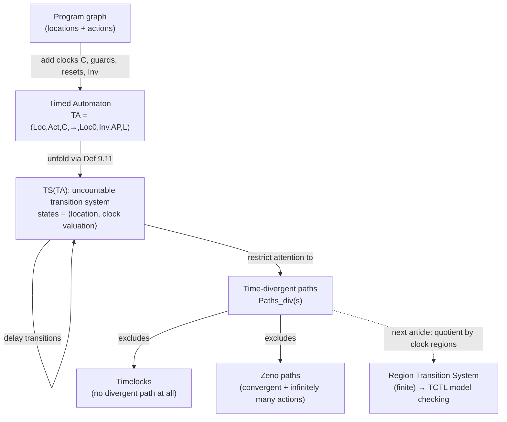

[[book-guidelines|↩ Back to guidelines]]

# Real-Time Systems and Timed Automata

## What breaks without a clock

Every model checker we've built up to this chapter answers questions about *order*: can a bad state ever be reached, does a good state eventually happen, is a request always followed by a response. None of those questions can express: "the gate must close within 2 minutes of the train's approach signal." A plain transition system has no notion of *how long* a computation took to reach a state — only *that* it reached it, and via how many steps.

You could fake time by discretizing it: introduce a `tick` action and say "action $\alpha$ takes $k$ time units" by inserting $k-1$ ticks before or after it. This works for synchronous, lock-step hardware, where you're happy to say one time unit = one clock pulse, and $\bigcirc^k\Phi$ ("$\Phi$ holds after exactly $k$ ticks") does the job with LTL/CTL exactly as-is. But it's the wrong model for asynchronous systems — distributed protocols, device drivers, physical processes — where components run at genuinely different, unsynchronized speeds and there is no natural common tick. Worse, discretization forces you to commit to a minimum time granularity up front, and the resulting transition systems blow up combinatorially with the tick count.

The book's example makes the real gap vivid (Example 9.1, p.674): a railroad crossing with three interleaved processes — `Train`, `Gate`, `Controller` — composed as $Train \parallel Gate \parallel Controller$. Without timing information, the composite transition system genuinely cannot tell you whether, after the `approach` signal fires, the train reaches the crossing *before or after* the gate finishes closing. The interleaving semantics of parallel composition preserves *causal* order but throws away *duration* — and duration is exactly what the safety property ("gate closed whenever train is on the crossing") depends on. Once you attach real numbers to the assumption — "the train takes more than 2 minutes to arrive; the controller signals the gate after exactly 1 minute; closing takes at most 1 minute" — the property becomes provable. That's the whole motivation for this chapter: keep transition systems (and their model-checking machinery) but arm them with continuous, real-valued time.

## Clocks: a very restricted kind of variable

The mechanism the book reaches for is not "add a real-valued program variable" in general — it's something much more disciplined: a **clock**.

> A clock is a real-valued variable that can only be *inspected* (compared against a constant) or *reset to zero*. Once reset, it increases automatically at rate exactly 1 with the passage of time — you cannot assign it an arbitrary value, and you cannot pause it independently of global time.

This restriction is what keeps the theory tractable later (it's the reason the region-construction in §9.3 — out of scope here — terminates at all): if clocks were arbitrary real variables you could encode undecidable arithmetic. A clock's *value at any instant* is simply "time elapsed since its last reset" — think of a stopwatch you can start (reset) and read, but never rewind to a specific value or freeze.

**Rust [[Concurrency-and-Communication-Modeling#Grounding|grounding]].** A clock is naturally a typestate-flavored value, not a raw `f64`:

```rust
#[derive(Clone, Copy, Debug)]
struct ClockId(usize);

// A valuation assigns each clock its current elapsed time.
#[derive(Clone, Debug)]
struct Valuation(Vec<f64>); // indexed by ClockId

impl Valuation {
    fn advance(&self, d: f64) -> Valuation {
        // delay transition: every clock advances by d
        Valuation(self.0.iter().map(|v| v + d).collect())
    }
    fn reset(&self, clocks: &[ClockId]) -> Valuation {
        let mut v = self.0.clone();
        for c in clocks { v[c.0] = 0.0; }
        Valuation(v)
    }
}
```

The API surface deliberately exposes only `advance` (uniform, whole-vector) and `reset` (targeted, per-clock) — mirroring the book's rule that clocks may only be inspected or reset, never assigned an arbitrary value or advanced independently of one another.

### Clock constraints

Conditions on clock values gate actions (guards) and bound how long you may dwell in a location (invariants — see below). Definition 9.2 fixes the grammar:

$$g ::= x < c \mid x \le c \mid x > c \mid x \ge c \mid g \wedge g, \qquad c \in \mathbb{N},\ x \in C$$

$CC(C)$ is the set of all clock constraints over clock set $C$; a constraint with no conjunction (a single atomic comparison) is called *atomic*, and $ACC(C)$ is the set of these. Shorthand like $x \in [c_1, c_2)$ abbreviates $(x \ge c_1) \wedge (x < c_2)$. The book restricts to comparisons of a clock against a constant (not clock-difference constraints like $x - y < c$) purely to keep the exposition — and later the region construction — simpler; rational constants are also fine since they can be rescaled to naturals by a common denominator without affecting decidability.

## Timed automata: a program graph wearing a stopwatch

**Definition 9.3.** A timed automaton is a tuple
$$TA = (Loc, Act, C, \rightarrow,\ Loc_0,\ Inv,\ AP,\ L)$$
where $Loc$ is a finite set of locations (with $Loc_0 \subseteq Loc$ the initial ones), $Act$ a finite set of actions, $C$ a finite set of clocks, $\rightarrow\ \subseteq Loc \times CC(C) \times Act \times 2^C \times Loc$ the edge relation, $Inv: Loc \to CC(C)$ assigns each location an invariant, and $(AP, L)$ label locations with atomic propositions exactly as for ordinary transition systems.

An edge $\ell \xrightarrow{g:\alpha,D} \ell'$ reads: "from $\ell$, when clock constraint $g$ (the *guard*) holds, take action $\alpha$, move to $\ell'$, and reset every clock in $D$ to zero." So a timed automaton *is* a program graph — the underlying control-flow skeleton is unchanged — except each edge carries a guard and a reset set instead of (or alongside) a data-variable condition/update, and each location carries an *invariant* that the current clock valuation must continue to satisfy for as long as control stays there.

**Rust grounding**, extending the sketch above:

```rust
struct Edge {
    guard: ClockConstraint,
    action: ActionId,
    reset: Vec<ClockId>,
    target: LocationId,
}

struct TimedAutomaton {
    locations: Vec<LocationId>,
    initial: Vec<LocationId>,
    invariants: HashMap<LocationId, ClockConstraint>, // Inv : Loc -> CC(C)
    edges: HashMap<LocationId, Vec<Edge>>,
    labels: HashMap<LocationId, HashSet<AtomicProp>>,
}
```

This is exactly a labeled program-graph struct you'd already have for untimed model checking, plus `ClockConstraint` fields on edges and the `invariants` map — the clock discipline is bolted on, not a redesign.

### Guards versus location invariants: the one distinction that does all the work

Example 9.4 (the single-clock automaton in Fig. 9.5) is worth internalizing carefully because the guard/invariant distinction is easy to conflate and the book is emphatic about it:

- A **guard** $g$ on an edge says an edge is *permitted* to fire when $g$ holds. It never forces anything — if the automaton could just idle instead (invariant `true`), it may sit in the location forever even once the guard becomes satisfied.
- An **invariant** $Inv(\ell)$ says time is *not allowed to progress* past the point where $Inv(\ell)$ would become false. This is the *only* mechanism in the whole formalism that can force a transition.

Concretely: guard $x \ge 2$ with $Inv(\ell) = true$ lets the self-loop fire any time after $x$ reaches 2, or never — the automaton can dawdle at $\ell$ indefinitely (Fig. 9.5a/b). Add invariant $x \le 3$ to the *same* guard $x \ge 2$, and now the outgoing edge *must* fire somewhere in the window $[2,3]$ — not deterministically at a fixed instant, but forced out before $x$ exceeds 3 (Fig. 9.5c/d). Strengthening the *guard* instead, to $2 \le x \le 3$ while leaving $Inv(\ell) = true$, does **not** reproduce this — the transition becomes takeable in that window, but is still optional; the automaton can let time run past $x=3$ forever without ever taking it (Fig. 9.5e/f).

> **What breaks without invariants:** if [[Mathematical-Preliminaries#The formalism|the formalism]] only had guards, you could specify upper *deadlines* on when something is *allowed*, but never a genuine upper deadline by which something *must* happen. Every liveness-flavored real-time requirement ("respond within 30 seconds") needs a forcing mechanism, and invariants are it.

The gate automaton (Example 9.5, Fig. 9.6) shows why you sometimes need an *extra location* purely to host an invariant: to force "closing the gate takes at most 1 time unit" measured from the moment `lower` fires, you can't just guard a direct `up → down` edge with $x \le 1$ (that clock's value doesn't track *when `lower` happened* correctly across other transitions) — you insert an intermediate location `comingdown` with $Inv(comingdown) = x \le 1$, reset $x$ on entry, and let the location invariant itself do the forcing.

**Rust framing:** this is a state-machine analogue of the difference between a `bool` precondition (guard: "may transition") and a scheduled deadline / watchdog timer (invariant: "must have transitioned by"). If you were compiling this to a real embedded scheduler, guards become `if` conditions on transition functions; invariants become deadline checks a supervisor thread enforces regardless of whether the guarded transition function chooses to act.

### Parallel composition: handshaking, but now clocks merge too

Definition 9.7 extends the transition-system parallel-composition operator $\parallel_H$ (Def. 2.26 from Ch. 2) to timed automata. For $TA_1 \parallel_H TA_2$ with disjoint clock sets $C_1 \cap C_2 = \emptyset$ and disjoint atomic propositions:

- Locations become pairs: $Loc_1 \times Loc_2$.
- **Invariants conjoin:** $Inv(\ell_1,\ell_2) = Inv_1(\ell_1) \wedge Inv_2(\ell_2)$ — both components' deadlines must simultaneously hold; time may progress in the composite only while *neither* constituent's invariant is violated.
- For a synchronizing action $\alpha \in H$: both components must be able to fire $\alpha$ simultaneously, the resulting guard is the **conjunction** $g_1 \wedge g_2$ of both guards, and the reset set is the **union** $D_1 \cup D_2$.
- For $\alpha \notin H$: the usual interleaved autonomous firing, one component moves, the other's location and clocks are untouched.

This is a direct, mechanical lift of ordinary handshaking composition — the only new content is that guards conjoin (an $H$-action needs both sides' timing conditions satisfied) and invariants conjoin (both sides' deadlines are live at once). The associativity of $\parallel_H$ carries over unchanged, so $TA_1 \parallel_H TA_2 \parallel_H \dots \parallel_H TA_n$ is well defined for compatible (disjoint-clock, disjoint-AP) automata.

The railroad-crossing composite $(Train \parallel_{H_1} Controller) \parallel_{H_2} Gate$ (Example 9.8, Fig. 9.9) is the running worked example: composing the three timed pieces produces exactly the reachability result the untimed version couldn't establish — the state `⟨in,1,up⟩` (train in the crossing, gate still up) turns out to be **unreachable**, because the composed clock arithmetic ($y > 2$ required to enter, but $z \le 1$ invariant and simultaneous resets of $y,z$ force $z > 2$ to be impossible) rules it out. This is the payoff of the whole formalism: a safety property that was *unprovable* on the untimed transition system becomes provable purely from the clock constraints.

**Rust grounding:** composing two `TimedAutomaton` values is a cross-product construction over locations with pointwise-conjoined invariant lookups and a guard-conjunction rule keyed on shared action names — structurally identical to how you'd implement product automata for ordinary CSP-style process composition, just with an `and()` combinator threaded through the guard/invariant types instead of only through the state space.

## From timed automaton to transition system: the actual semantics

A timed automaton is a finite object, but what it *means* — the thing model checking actually operates on — is the (generally infinite, generally uncountable) transition system it unfolds into. A **state** is a pair $\langle \ell, \eta \rangle$: a location plus a full clock valuation.

**Definition 9.9 (Clock valuation).** $\eta : C \to \mathbb{R}_{\ge 0}$, assigning each clock its current real value. Notation like $\eta+d$ means "every clock advanced by $d$" (formally $(\eta+d)(x) = \eta(x)+d$), and $\mathrm{reset}\ x\ \mathrm{in}\ \eta$ zeroes clock $x$ and leaves the rest unchanged.

**Definition 9.10 (Satisfaction of clock constraints).** The relation $\models\ \subseteq Eval(C) \times CC(C)$ is defined structurally exactly like a logic's satisfaction relation:
$$\eta \models true; \quad \eta \models x<c \iff \eta(x)<c; \quad \eta \models \neg g \iff \eta \not\models g; \quad \eta \models g\wedge g' \iff \eta\models g \text{ and } \eta \models g'$$

This is a deliberate and useful parallel to note: a clock constraint's satisfaction relation is structured *exactly* like a propositional/modal-logic satisfaction relation, over a different domain (valuations instead of Kripke states). If you've internalized `⊨` for CTL/LTL, this is the same recursive pattern one level down.

**Definition 9.11 (Transition system semantics).** Given $TA = (Loc, Act, C, \rightarrow, Loc_0, Inv, AP, L)$, define $TS(TA) = (S, Act', \rightarrow, I, AP', L')$:

- $S = Loc \times Eval(C)$ — a state is location *and* full clock snapshot.
- $Act' = Act \cup \mathbb{R}_{\ge 0}$ — the label alphabet now includes every non-negative real, standing for "let this much time pass."
- $I = \{\langle \ell_0,\eta\rangle \mid \ell_0 \in Loc_0,\ \eta(x)=0 \text{ for all } x\}$ — every clock starts at zero.
- $AP' = AP \cup ACC(C)$, $L'(\ell,\eta) = L(\ell) \cup \{g \in ACC(C) \mid \eta \models g\}$ — atomic clock facts become observable propositions too, which is exactly what will let TCTL formulas reference clock constraints directly (out of this article's scope, but this is where the hook is installed).

Two transition rules generate $\rightarrow$:

$$\text{discrete: } \langle \ell,\eta\rangle \xrightarrow{\alpha} \langle \ell',\eta'\rangle \text{ if } \exists\, \ell \xrightarrow{g:\alpha,D} \ell' \text{ in } TA,\ \eta\models g,\ \eta'=\mathrm{reset}\ D\ \mathrm{in}\ \eta,\ \eta'\models Inv(\ell')$$
$$\text{delay: } \langle \ell,\eta\rangle \xrightarrow{d} \langle \ell,\eta+d\rangle \text{ for } d\in\mathbb{R}_{\ge 0} \text{ if } \eta+d \models Inv(\ell)$$

Read this as: two fundamentally different ways to move. A **discrete transition** is an instantaneous edge-firing — location changes, some clocks reset, zero time elapses, and the guard/post-invariant checks gate it exactly as you'd expect. A **delay transition** is *staying put* while time passes — the location is unchanged, *every* clock advances uniformly by $d$, and the only requirement is that the invariant remains satisfied throughout (in practice: at the landing valuation $\eta+d$, since $Inv$ is typically monotone-friendly over intervals in these examples).

This two-kind-of-transition split is the single most important structural fact in the chapter — it's why $TS(TA)$ is uncountably infinite and infinitely branching even though $TA$ itself is a small finite graph: from almost any state there are uncountably many valid delay transitions (any real $d \ge 0$ small enough to keep the invariant true), plus whatever finitely many discrete ones are guard-enabled. It's also why "multiple actions can happen in zero time" (Remark 9.14) — nothing in the semantics stops several discrete transitions firing back-to-back at a single time instant, since each contributes $d=0$ elapsed time.

**Why this matters for model checking (thread for `static-analysis`/`sat-smt-csp`):** $TS(TA)$ is exactly the kind of infinite-but-structured state space that abstract-interpretation-flavored reasoning is built for — you cannot enumerate it, but you *can* quotient it into finitely many equivalence classes (clock regions, §9.3, out of scope here) that are bisimilar with respect to the propositions that matter. This is the same move as an abstract domain over a lattice: instead of tracking $\eta \in \mathbb{R}_{\ge 0}^{|C|}$ exactly, you track a finite abstraction (integer part + fractional-part ordering) that's provably sound and complete for the properties you care about. If you're building a CSP/abstract-interpretation kernel, this chapter's region idea (even though its mechanics live in the next article) is worth flagging now as *the* canonical example of turning an uncountable concrete domain into a finite, verification-adequate abstract one via an equivalence relation rather than interval/polyhedra approximation.

**Rust sketch of the semantics as an explicit-step function** (illustrative — you would never literally enumerate delay transitions; this shows the two-rule structure as code):

```rust
enum Label { Action(ActionId), Delay(f64) }

fn discrete_step(ta: &TimedAutomaton, l: LocationId, eta: &Valuation, e: &Edge)
    -> Option<(LocationId, Valuation)>
{
    if eta.satisfies(&e.guard) {
        let eta2 = eta.reset(&e.reset);
        if eta2.satisfies(&ta.invariants[&e.target]) {
            return Some((e.target, eta2));
        }
    }
    None
}

fn delay_step(ta: &TimedAutomaton, l: LocationId, eta: &Valuation, d: f64)
    -> Option<Valuation>
{
    let eta2 = eta.advance(d);
    ta.invariants[&l].satisfies(&eta2).then_some(eta2)
}
```

The light-switch example (9.12) is the book's cleanest illustration that different execution *sequences* can realize the same real-world *behavior*: splitting one 1-time-unit delay into two consecutive delays ($d_1+d_2$) yields the same landing state as one $d_1+d_2$ delay in a single step (Remark 9.13's algebraic identity $\langle\ell,\eta\rangle \xrightarrow{d_1+d_2} \langle\ell,\eta+d_1+d_2\rangle$ equals composing $\xrightarrow{d_1}$ then $\xrightarrow{d_2}$). Later notation ($\Rightarrow^d$, Notation 9.26) formally quotients this redundancy away by treating any set of delay transitions summing to $d$ as equivalent — this is exactly the piece of bookkeeping the TCTL semantics (next article) needs to be well-defined.

## Which paths are physically meaningful: divergence, timelock, zenoness

$TS(TA)$'s state space is uncountable, and *not every path through it is a realistic system behavior*. Three named pathologies, all defined via how time behaves along an infinite path, are what §9.1.2 is really about.

### Elapsed time and time-divergence

**Definition 9.15 (ExecTime).** For an infinite execution $\rho = s_0 \xrightarrow{\tau_0} s_1 \xrightarrow{\tau_1} \dots$ where each $\tau_i$ is either an action (contributing $0$) or a delay $d$ (contributing $d$), $ExecTime(\rho) = \sum_{i=0}^\infty ExecTime(\tau_i)$ — the total real time consumed along the whole path.

**Definition 9.16.** An infinite path is **time-divergent** if $ExecTime(\pi) = \infty$; otherwise it's **time-convergent**.

Why should you care about convergent paths at all? Because the semantics *permits* them, and they're physically absurd. The light-switch example produces the convergent execution $\text{off},0 \xrightarrow{1/2} \text{off},\tfrac12 \xrightarrow{1/4}\text{off},\tfrac34 \xrightarrow{1/8}\dots$ — infinitely many steps whose delays sum to exactly $1$. Formally legal (each step is a valid delay transition), but it describes a system that "runs infinitely fast" as real time approaches 1, never actually reaching $t=1$ or beyond. Real hardware cannot do this. So the semantic convention is:

> $Paths^{div}(s) = \{\pi \in Paths(s) \mid \pi \text{ is time-divergent}\}$. Model-checking analysis of timed automata is restricted to $Paths^{div}$ — convergent paths are acknowledged to exist in $TS(TA)$ but simply excluded from consideration, the same way fair-CTL restricts attention to fair paths.

That's a load-bearing analogy the book makes explicitly (and it resurfaces almost verbatim when TCTL's path quantifiers are restricted to divergent paths in §9.2 — again out of this article's scope, but worth flagging the connection now): "ignore the unrealistic paths, quantify only over the realistic ones" is a pattern you've already seen once.

### Timelock: a state with no way to keep time moving

**Definition 9.19.** State $s$ in $TS(TA)$ **contains a timelock** if $Paths^{div}(s) = \emptyset$ — every path leaving $s$ is time-convergent (or, degenerately, $s$ is terminal). $TA$ is **timelock-free** if no *reachable* state contains a timelock.

This is strictly worse than a convergent path existing — it says *no* realistic continuation exists from $s$ at all. Two illustrative failure modes (Examples 9.20):

- $Switch_1$ (Fig. 9.12): the light stays on for $t \in [1,2)$, with $Inv(on) = x \le 2$. The state $\langle on, 2\rangle$ is reachable (take the boundary), but at $x=2$ the only exit guard is $1 \le x < 2$ (already violated) and the invariant $x \le 2$ forbids any further delay. $\langle on,2\rangle$ is a genuine terminal state — a **dead end**, timelocked by construction.
- $Switch_2$ (Fig. 9.13): relax the invariant to $Inv(on)=x<3$. Now $\langle on,2\rangle$ is *not* terminal — it has an infinite (but time-convergent!) chain of delay transitions creeping toward $x=3$: $\langle on,2\rangle,\langle on,2.9\rangle,\langle on,2.99\rangle,\dots$. Every one of those paths is convergent, so $Paths^{div}(\langle on,2\rangle) = \emptyset$ anyway — the state is timelocked *despite not being terminal*. This is the subtler failure mode: a state can have infinitely many outgoing transitions and still be a timelock, because none of the resulting infinite paths manage to let time actually diverge.

> **What breaks without timelock-freedom as a design discipline:** a timelocked reachable state is a system-design bug — it says "if you get here, real-world time literally cannot continue to elapse," which is nonsensical for anything modeling a physical or real-time process. It's the timed-automata analogue of a deadlock, but even sneakier, since (as $Switch_2$ shows) it can hide behind infinitely many outgoing transitions rather than announcing itself as a dead end.

### Zeno paths: infinitely fast, not just infinitely creeping

Zenoness is a related but distinct pathology, about *actions* rather than pure time-passing:

**Definition 9.21.** An infinite path $\pi$ is **zeno** if it is time-convergent *and* infinitely many actions from $Act$ are executed along it.
**Definition 9.22.** $TA$ is **non-zeno** if $TS(TA)$ has no initial zeno path.

Since discrete transitions take zero time, nothing in the raw semantics stops a system from firing infinitely many actions while real elapsed time stays bounded — the Example 9.23 light-switch variant ($Switch_3$) lets a user mash the "on" button infinitely often (or faster and faster) without ever consuming a full time unit. This is the formal counterpart of "requires infinitely fast processors" — not realizable by any physical implementation, and (unlike ordinary time-convergent delay-only paths) specifically an artifact of unconstrained discrete-transition firing.

The fix pattern the book gives (Example 9.23, $Switch_4$): impose a strictly-positive minimum invariant/guard delay $c>0$ between repeated actions on any cycle, which forces each pass around that control cycle to consume a fixed positive chunk of real time — making an infinite-action path automatically time-divergent, hence not convergent, hence not zeno by definition.

This intuition is exactly formalized as a checkable sufficient condition:

**Lemma 9.24 (Sufficient criterion for nonzenoness).** If, for every control cycle $\ell_0 \xrightarrow{g_1:\alpha_1,C_1} \ell_1 \to \dots \to \ell_n = \ell_0$ in $TA$, there exists a clock $x \in C$ that (1) gets reset somewhere on the cycle, and (2) has a guard or invariant elsewhere on the cycle that forces $x$ to reach some threshold $c \in \mathbb{N}_{>0}$ before the cycle can complete again — then $TA$ is non-zeno.

The proof idea (which is worth internalizing as a technique, not just a result): if every control cycle is forced to burn at least $c>0$ real time units, then a path that traverses infinitely many actions must traverse infinitely many cycles, hence accumulate unboundedly much elapsed time — i.e., it's automatically time-divergent, and time-divergent paths are (by definition) not zeno. This is a purely **local, per-cycle, static check** — no reachability analysis or global fixpoint needed — which is precisely why it's practical: **Lemma 9.24's condition is compositional** — if $TA$ and $TA'$ both satisfy it, so does $TA \parallel_H TA'$, because every control cycle in the product decomposes into a cycle in one constituent (or is entirely within one, since a cross-cycle in the product corresponds to cycling in one or both factors). This is exactly the kind of local, syntactically-checkable, compositionally-preserved soundness certificate you'd want as a decidable *underapproximation* of the (algorithmically hard, in general) nonzenoness property — checking Lemma 9.24 is analogous to a lightweight, cheap static analysis pass that certifies a stronger, harder global property by induction over the syntactic structure of composed programs, rather than by exploring the (infinite) state space directly.

The railroad-crossing composite is verified non-zeno this way in Example 9.25: every one of `Train`, `Gate`, `Controller`'s control cycles resets a clock and later forces a $\ge 1$-time-unit guard before the cycle can repeat, so each is individually non-zeno, and by compositionality so is the full parallel composition.

## Synthesis: what this buys, and what it costs



Attaching clocks to program graphs buys exactly the expressive power the railroad-crossing example needed: quantitative deadlines ("within 2 minutes"), expressed compositionally (parallel composition of separately-authored timed components), interpreted via a two-mode transition-system semantics (discrete steps for logic, delay steps for the passage of time) that is a strict conservative generalization of ordinary transition systems (set $C=\emptyset$ and you're back to a plain program graph). The cost is that the resulting semantic object, $TS(TA)$, is uncountably infinite and infinitely branching, and comes with genuinely new failure modes — timelock and zenoness — that have no counterpart in the untimed theory and must be checked for (via, e.g., Lemma 9.24's compositional static test) before you can trust that the model is a faithful description of a real-time-critical system at all.

**[[Automata-Based-LTL-Model-Checking#Where this leads|Where this leads]].** Section 9.1's semantics — $TS(TA)$, time-divergent paths, timelock-freedom, non-zenoness — is the exact foundation the next section needs: Timed CTL (§9.2) is defined by restricting path quantification to $Paths^{div}$ (precisely the same "throw away the unrealistic paths" move made here), and its model-checking algorithm (§9.3) works by quotienting the uncountable $TS(TA)$ into a *finite* bisimilar region transition system — the tractable, checkable answer to the "uncountably many states" problem this article raises but doesn't resolve.

**Connection to the standing project (`static-analysis`).** The region-quotient idea foreshadowed here — replace an uncountable concrete state space with a finite abstraction that is provably behavior-preserving for the properties you care about — is a direct structural cousin of what an abstract-interpretation-based invariant generator has to do to over-approximate an unbounded (or infinite) concrete domain soundly. It's also worth banking the Lemma 9.24 pattern specifically: a local, syntactic, compositional sufficient condition that certifies a global liveness-flavored property (non-zenoness) without state-space exploration is the same shape of argument you'd want for cheap, scalable soundness certificates in a Hoare-style invariant-generation or reachability-analysis pass — check a per-loop/per-cycle local condition, get a compositionally-preserved global guarantee for free.
