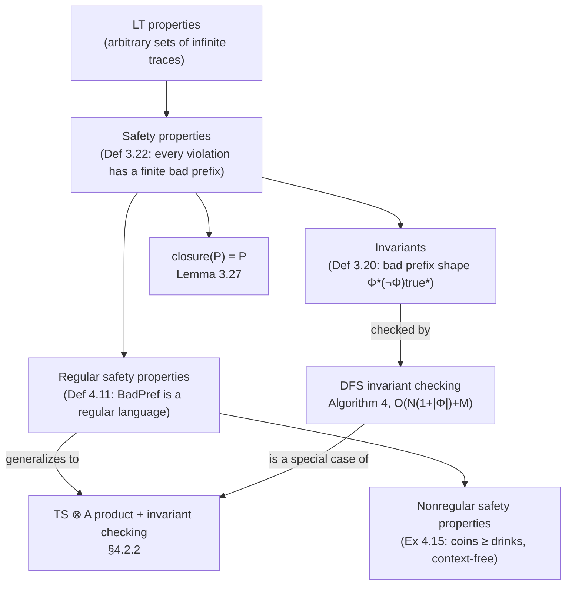

# Safety Properties and Invariants

[[book-guidelines|↩ Back to guidelines]]

## Why you need a notion of "bad" at all

Suppose you've built a transition system model of a concurrent program — the mutual-exclusion protocol, the dining philosophers, an ATM. You now want to *verify* something about it. The first, most naive idea is: enumerate every possible infinite execution and check that each one is "good." But infinite executions are, well, infinite — you can't literally check an infinite object trace by trace. So the entire enterprise of model checking depends on finding classes of requirements that are *checkable* despite quantifying over infinite behavior.

Safety properties are the answer for an enormous and practically dominant class of requirements: "mutual exclusion never fails," "the traffic light is never red without having just been yellow," "the ATM never dispenses cash without a PIN having been entered first." What all of these share is a structural fact that has nothing to do with what they say and everything to do with *when* they can be violated: if one of these properties fails on some infinite run, the failure is witnessed by a *finite* stretch of that run. You don't need to watch forever to know something has gone wrong — a fixed, finite amount of bad behavior is enough to convict the whole infinite trace. That single structural fact is what makes safety properties amenable to finite-state algorithms (reachability search) rather than the more expensive $\omega$-automata machinery liveness properties will require later in the book (Chapters 4 and 5).

The book builds this idea in two passes. First it isolates the special case where "bad" is a purely local, state-based notion — an **invariant** — and gives you a DFS algorithm for it. Then it generalizes to the full class of **safety properties**, of which invariants are only the simplest kind, and characterizes them abstractly via prefixes and closure. Finally (jumping ahead one section, in Chapter 4) it asks: of all safety properties, which ones can actually be checked by a finite automaton? The answer — *regular* safety properties — is what makes the DFS-style algorithm generalize from invariants to a much larger class.

## Invariants as reachable-state conditions

### The idea before the notation

The simplest safety requirements are really requirements about *states*, not about behavior over time: "no state where two processes are both in their critical section," "no state where every philosopher is waiting for a chopstick." You don't care about the order in which states were visited or what happened along the way — you only care that a fixed condition $\Phi$ holds in *every* state your system can ever actually reach. This is an **invariant**.

Crucially, "every reachable state" is doing real work here. $\Phi$ need not hold in *all* states of the system's state space — only the ones a real execution starting from an initial state could ever land in. A state graph can have plenty of $\lnot\Phi$-states that are simply unreachable garbage, and the invariant is unbothered by them.

### The book's definition

Baier & Katoen state this as a special case of a general **LT property** (a linear-time property — a set of infinite words over $2^{AP}$, i.e., a specification of "acceptable" infinite traces):

> **Definition 3.20 (Invariant).** An LT property $P_{inv}$ over $AP$ is an *invariant* if there is a propositional logic formula $\Phi$ over $AP$ such that
> $$P_{inv} = \bigl\{\, A_0 A_1 A_2 \ldots \in (2^{AP})^\omega \mid \forall j \ge 0.\ A_j \models \Phi \,\bigr\}.$$
> $\Phi$ is called an *invariant condition* (or *state condition*) of $P_{inv}$.

and immediately unpacks what satisfaction of an invariant means operationally for a transition system $TS$:
$$
TS \models P_{inv} \iff \mathrm{trace}(\pi) \in P_{inv} \text{ for all paths } \pi \text{ in } TS
\iff L(s) \models \Phi \text{ for all } s \in \mathrm{Reach}(TS).
$$

So "invariant" literally means what the English word suggests: $\Phi$ is invariant under every transition in the reachable fragment of the system — if $\Phi$ holds at a source state $s$ of a transition $s \xrightarrow{\alpha} s'$, it holds at $s'$ too, and it holds at every initial state to begin with. Mutual exclusion is $\Phi = \lnot crit_1 \lor \lnot crit_2$; deadlock-freedom for the dining philosophers is $\Phi = \lnot wait_0 \lor \lnot wait_1 \lor \lnot wait_2 \lor \lnot wait_3 \lor \lnot wait_4$ (there always exists a philosopher not stuck waiting for a chopstick).

Notice what this buys you algorithmically: since $\mathrm{Reach}(TS)$ is finite for a finite transition system, checking an invariant is *exactly* a graph reachability problem — visit every reachable state once, evaluate $\Phi$ there, done. No automaton over infinite words required.

### Grounding: invariants as a Rust type-state check

If you think of a transition system as a graph where states carry labels (the atomic propositions true there), an invariant is simply a predicate you fold over every reachable node:

```rust
use std::collections::HashSet;
use std::hash::Hash;

/// A finite transition system, given implicitly via its successor function.
trait TransitionSystem {
    type State: Eq + Hash + Clone;
    fn initial_states(&self) -> Vec<Self::State>;
    fn successors(&self, s: &Self::State) -> Vec<Self::State>;
    /// Evaluate the invariant condition Φ at a given state.
    fn satisfies_phi(&self, s: &Self::State) -> bool;
}
```

The invariant condition $\Phi$ here is nothing more than `satisfies_phi`, a pure state predicate — it has no memory of the path taken to reach `s`. That statelessness is exactly what Definition 3.20 is capturing formally: an invariant is a *state* property lifted to a trace property, not an intrinsically temporal one.

## Bad prefixes and minimal bad prefixes

### Why invariants aren't the whole story

Invariants are a strict subclass of the properties people actually call "safety." The book's own counterexample is instructive: an ATM requirement — "money is only dispensed after a correct PIN has been entered" — is *not* an invariant, because whether the current state is "bad" depends on the *history* leading up to it (has a PIN already been entered on this run?), not on the state's own label in isolation. Yet everyone's intuition says this is still a safety property: once cash comes out without a preceding PIN, the run is irrevocably ruined, and that ruin is witnessed by a finite prefix.

This is the generalization the book makes: instead of "a state condition $\Phi$ must always hold," a safety property says "any infinite word that violates the property does so because of something that already went wrong in some *finite prefix* of it."

### The formal definition

> **Definition 3.22 (Safety Properties, Bad Prefixes).** An LT property $P_{safe}$ over $AP$ is a *safety property* if for all words $\sigma \in (2^{AP})^\omega \setminus P_{safe}$ there exists a finite prefix $\hat\sigma$ of $\sigma$ such that
> $$P_{safe} \cap \{\, \sigma' \in (2^{AP})^\omega \mid \hat\sigma \text{ is a finite prefix of } \sigma' \,\} = \varnothing.$$
> Any such finite word $\hat\sigma$ is a *bad prefix* for $P_{safe}$. A *minimal bad prefix* is a bad prefix none of whose proper prefixes is itself a bad prefix — i.e., a bad prefix of minimal length. Write $\mathrm{BadPref}(P_{safe})$ and $\mathrm{MinBadPref}(P_{safe})$ for the sets of all bad prefixes and minimal bad prefixes.

In words: $\hat\sigma$ is bad if *no* infinite continuation of $\hat\sigma$ can ever be back in $P_{safe}$ — the damage is done and unrecoverable. This is a genuinely strong condemnation clause: it's not that the current continuation happens to be bad, it's that *every possible future* is now bad.

Every invariant is trivially a safety property under this definition: the minimal bad prefixes for $P_{inv}$ with condition $\Phi$ are exactly the words $A_0 A_1 \ldots A_n$ where $A_0, \ldots, A_{n-1} \models \Phi$ but $A_n \not\models \Phi$ — i.e., everything was fine until the very last step. But now you can also express history-sensitive properties. The book's traffic-light example is worth internalizing precisely because it's *not* an invariant:

> "A red phase must be immediately preceded by a yellow phase," over $AP = \{red, yellow\}$: $\forall i \ge 0,\ red \in A_i \Rightarrow (i > 0 \land yellow \in A_{i-1})$.

Minimal bad prefixes here include $\varnothing\,\varnothing\,\{red\}$ and $\varnothing\,\{red\}$ — both end the instant a red phase appears without an immediately preceding yellow. But $\{yellow\}\{yellow\}\{red\}\{red\}\varnothing\{red\}$, while bad, is *not minimal*, since $\{yellow\}\{yellow\}\{red\}\{red\}$ is already a (shorter) bad prefix contained inside it. This is the key discipline of "minimal": once the first violation occurs, everything appended afterward is bad too, but only the *first* occurrence counts toward minimality.

The book also gives the crucial reformulation connecting safety properties back to finite behavior:

> **Lemma 3.25.** For $TS$ without terminal states and safety property $P_{safe}$:
> $$TS \models P_{safe} \iff \mathrm{Traces}_{fin}(TS) \cap \mathrm{BadPref}(P_{safe}) = \varnothing.$$

This is [[Liveness-Properties-and-the-Safety-Liveness-Decomposition#The theorem|the theorem]] that turns "check an infinitary property" into "check a finite-trace intersection-emptiness problem" — the same move Chapter 4 will exploit algorithmically for regular safety properties (below).

### Grounding: bad prefixes as a streaming monitor

A useful way to internalize "bad prefix" for the ATM/traffic-light kind of property is as a **runtime monitor**: a small state machine that consumes the trace symbol by symbol and moves into a permanent "rejected forever" sink the instant a bad prefix has been seen.

```python
class TrafficLightMonitor:
    """Rejects the instant a `red` phase appears without an immediately
    preceding `yellow` phase — i.e. detects a minimal bad prefix."""
    def __init__(self):
        self.prev_yellow = False
        self.violated = False   # sink state: once True, stays True forever

    def step(self, labels: set[str]) -> bool:
        if self.violated:
            return False
        if "red" in labels and not self.prev_yellow:
            self.violated = True
            return False
        self.prev_yellow = "yellow" in labels
        return True
```

Notice this monitor has exactly the shape of the two-state NFA the book draws in Figure 3.9 for this property: one "OK so far" region and one absorbing "already bad" state. That correspondence — bad-prefix set as a language, monitor as its recognizer — is precisely the seed of the regularity question addressed below.

## Prefix closure and the closure characterization of safety

### Motivation: an "extensional" definition of safety

Definition 3.22 defines safety operationally, in terms of prefixes that doom a word. The book then gives an equivalent, more *topological* characterization, useful because it doesn't require exhibiting bad prefixes explicitly — it only asks a fixed-point-like question about the property as a set.

> **Definition 3.26 (Prefix and Closure).** For $\sigma \in (2^{AP})^\omega$, $\mathrm{pref}(\sigma) = \{\hat\sigma \in (2^{AP})^* \mid \hat\sigma \text{ is a finite prefix of } \sigma\}$, lifted to sets of traces by $\mathrm{pref}(P) = \bigcup_{\sigma \in P} \mathrm{pref}(\sigma)$. The **closure** of LT property $P$ is
> $$\mathrm{closure}(P) = \{\sigma \in (2^{AP})^\omega \mid \mathrm{pref}(\sigma) \subseteq \mathrm{pref}(P)\}.$$

$\mathrm{closure}(P)$ is the largest superset of $P$ you get by adding back in every infinite trace whose finite prefixes were *already* achievable by some trace of $P$ — even if that exact infinite trace itself never belonged to $P$. Always $P \subseteq \mathrm{closure}(P)$.

> **Lemma 3.27.** $P$ is a safety property $\iff \mathrm{closure}(P) = P$.

The intuition for why this must be true is worth spelling out because it's a genuinely satisfying piece of reasoning, not just algebra. If $P$ has a "gap" — some $\sigma \notin P$ all of whose finite prefixes are nonetheless legitimate prefixes of $P$-traces — then no finite amount of observation can ever condemn $\sigma$: every prefix you look at is one some accepted trace also has, so no prefix is *bad*. That's exactly a violation of safety (an unwitnessed rejection), and exactly what $\mathrm{closure}(P) \ne P$ detects. Conversely, if $P$ is genuinely closed, every excluded trace must be excluded by some finite, irrecoverable prefix — which is the definition of safety.

This is the same shape of argument as showing a set is closed under limits in a topological space (hence the name "closure") — a safety property is precisely one where you cannot "sneak up on" a violation only in the limit.

### Corollary you get almost for free: finite-trace inclusion

Because safety properties are closure-closed, the book derives a clean correspondence between *finite*-trace inclusion of transition systems and preservation of *all* safety properties (Theorem 3.28, Corollary 3.29): $TS$ and $TS'$ agree on every safety property iff they have exactly the same finite traces, even if their infinite-trace sets differ. This is practically important for refinement-based design: to inherit all safety guarantees when refining a preliminary design $TS$ into $TS'$, it suffices to check the (usually much easier) condition $\mathrm{Traces}_{fin}(TS) \subseteq \mathrm{Traces}_{fin}(TS')$, rather than full trace inclusion.

### Grounding: closure as least-fixed-point reasoning

If you've internalized "closed under limits of a directed union" from denotational semantics or domain theory, $\mathrm{closure}(P) = P$ is the same discipline applied to a set of infinite streams instead of a poset of approximations: $P$ is safety iff it contains every infinite trace that its finite approximations "promise." A Lean sketch of the defining property, useful mainly to see that this is a genuinely first-order statement about prefix sets rather than anything exotic:

```lean
-- σ ranges over infinite traces (streams of label-sets), P over sets of such streams.
def pref (σ : Stream (Set AP)) : Set (List (Set AP)) :=
  {p | ∃ n, p = (σ.take n)}

def IsSafety (P : Set (Stream (Set AP))) : Prop :=
  ∀ σ, σ ∉ P → ∃ (n : ℕ), ∀ σ', σ.take n = σ'.take n → σ' ∉ P
  -- "some finite prefix already excludes every continuation"
```

This is deliberately the *bad-prefix* reading (Definition 3.22) rendered as a proposition rather than the closure reading (Lemma 3.27) — the book's proof of Lemma 3.27 is precisely the (nontrivial, two-directional) argument that these two propositions are logically equivalent.

## Invariant checking by depth-first search

### From "state condition" to "graph algorithm"

Because an invariant only constrains reachable states, checking $TS \models P_{inv}$ reduces to: (1) enumerate $\mathrm{Reach}(TS)$, and (2) check $\Phi$ at each one. Any forward graph traversal — DFS or BFS — does step (1); the book chooses DFS because the search stack conveniently doubles as a **counterexample trail**.

> **Algorithm 4 (Invariant checking by forward DFS).**
> Maintain a set $R$ of visited states and a stack $U$. Repeatedly pop the top of $U$; if all its successors are already in $R$, pop it for good and check $\Phi$ there; otherwise push an unvisited successor. The moment a state $s_n \not\models \Phi$ is found, abort and return the *stack content, read bottom to top*, as the counterexample $s_0 s_1 \ldots s_n$ — an actual initial path fragment of the system that violates the invariant.

This last detail is the practically decisive design choice: a bare "no, it's violated" is nearly useless to an engineer; a concrete executable trace that reproduces the bug is what makes model checking valuable as a *debugging* tool, not just a certification tool.

> **Theorem 3.21 (Time Complexity).** Algorithm 4 runs in $O\bigl(N \cdot (1 + |\Phi|) + M\bigr)$, where $N = |\mathrm{Reach}(TS)|$, $M = \sum_{s} |\mathrm{Post}(s)|$ is the number of transitions in the reachable fragment, and $|\Phi|$ is the cost of evaluating the formula at one state.

The $O(N+M)$ part is just DFS reachability; the $N \cdot |\Phi|$ term is the one-time cost of evaluating the (typically small, fixed) formula $\Phi$ once per visited state. Crucially, this is *linear* in the size of the reachable state space — the entire enterprise of model checking safety properties rides on this fact, since the whole difficulty in practice is that $N$ itself can be astronomically large (the "state-space explosion" problem covered elsewhere in the book), not that the per-state check is expensive.

### Grounding: a faithful Rust implementation

```rust
use std::collections::HashSet;
use std::hash::Hash;

enum InvariantResult<S> {
    Holds,
    Violated { counterexample: Vec<S> }, // s0 s1 ... sn, sn violates Φ
}

fn check_invariant<S, F, G, H>(
    initial: &[S],
    successors: F,
    satisfies_phi: G,
) -> InvariantResult<S>
where
    S: Eq + Hash + Clone,
    F: Fn(&S) -> Vec<S>,
    G: Fn(&S) -> bool,
{
    let mut reached: HashSet<S> = HashSet::new();

    for s0 in initial {
        if reached.contains(s0) {
            continue;
        }
        // `stack` mirrors Algorithm 4's U: entries not yet fully expanded.
        let mut stack: Vec<S> = vec![s0.clone()];
        reached.insert(s0.clone());

        while let Some(top) = stack.last().cloned() {
            let unvisited_succ = successors(&top)
                .into_iter()
                .find(|s| !reached.contains(s));

            match unvisited_succ {
                Some(s_new) => {
                    reached.insert(s_new.clone());
                    stack.push(s_new);
                }
                None => {
                    // Post(top) ⊆ R: safe to pop and check Φ here.
                    stack.pop();
                    if !satisfies_phi(&top) {
                        // Reconstruct the counterexample the way Algorithm 4
                        // does: the *current* stack, bottom to top, followed
                        // by the offending state itself.
                        let mut counterexample = stack.clone();
                        counterexample.push(top);
                        return InvariantResult::Violated { counterexample };
                    }
                }
            }
        }
    }
    InvariantResult::Holds
}
```

Two things are worth flagging as direct translations of the book's prose into code, since they're easy to get subtly wrong:

- [[Probabilistic-Computation-Tree-Logic#The algorithm|The algorithm]] checks $\Phi$ **on pop**, not on push — a state is only certified once its entire subtree has been explored and found $R$-contained. This is why the counterexample trail is exactly the remaining stack contents at the moment of failure: it's the path from some initial state down to the still-unresolved node that just failed.
- `reached` (the book's $R$) is populated *eagerly*, at push time, not at pop time — this is what prevents the DFS from ever re-expanding the same state twice, which is what gives the $O(N + M)$ bound rather than something exponential in path length.

## Regular versus nonregular safety properties

### The generalization Chapter 4 needs

Section 3.3 gives you a DFS algorithm for *invariants* specifically, because an invariant's bad-prefix language has an extremely simple shape: $\Phi^*(\lnot\Phi)\,\mathrm{true}^*$ — "fine, fine, ..., fine, then one violation, then anything." Chapter 4 asks the natural follow-up question: for which *general* safety properties does an analogous finite-automaton-driven algorithm still work? The answer turns on whether the bad-prefix language is *regular*.

> **Definition 4.11 (Regular Safety Property).** A safety property $P_{safe}$ is *regular* if $\mathrm{BadPref}(P_{safe})$ is a regular language over $2^{AP}$.

Every invariant is regular for exactly the reason above — $\Phi^*(\lnot\Phi)\,\mathrm{true}^*$ is manifestly a regular expression, recognized by the two-state NFA in Figure 4.3 (self-loop on $\Phi$, transition to an accepting sink on $\lnot\Phi$, self-loop on $\mathrm{true}$ there). But regularity is a strictly broader class than invariance: the traffic-light property and mutual-exclusion property are both regular (Examples 4.13, 4.14) despite not being invariants, because their bad-prefix languages, while more structured than $\Phi^*(\lnot\Phi)\mathrm{true}^*$, are still finite-state recognizable — the traffic-light monitor sketched above *is* that NFA, essentially.

A subtlety worth internalizing precisely because it simplifies the proof burden in practice:

> **Lemma 4.12.** $P_{safe}$ is regular $\iff \mathrm{MinBadPref}(P_{safe})$ is regular.

So you never need to separately worry about "all bad prefixes" versus "just the minimal ones" — regularity of one gives you regularity of the other for free (self-loops on the accept states of a minimal-bad-prefix NFA turn it into a full-bad-prefix NFA, and conversely trimming outgoing transitions from accept states of a bad-prefix DFA gives a minimal-bad-prefix recognizer).

### Where regularity breaks: the vending-machine counterexample

> **Example 4.15 (A Nonregular Safety Property).** "The number of inserted coins is always at least the number of dispensed drinks," over $AP = \{pay, drink\}$. Its minimal bad prefixes constitute the language
> $$\{\, \mathit{pay}^n\, \mathit{drink}^{n+1} \mid n \ge 0 \,\},$$
> which is **context-free but not regular** — no finite automaton can recognize it, because doing so would require unbounded counting (matching an arbitrary number of `pay`s against exactly one more `drink`), which is the textbook pumping-lemma failure mode for regular languages.

This is a genuinely important boundary to internalize, not a curiosity: it tells you *why* the finite-automaton-based verification algorithm the book builds next (§4.2.2 — take the product $TS \otimes A$ of the transition system with an NFA $A$ recognizing $\mathrm{BadPref}(P_{safe})$, then reduce to invariant checking on the product, in time linear in $|TS| \cdot |A|$) has a hard boundary. Safety properties requiring unbounded counting, stack discipline, or other non-finite-state memory (this vending-machine property is a hallmark context-free-but-not-regular pattern, structurally identical to $\{a^n b^n\}$) fall outside what the automata-theoretic model-checking machinery of Chapter 4 can decide directly — you would need a pushdown or counter-automaton extension, or a different verification technique (e.g. an explicit numeric invariant like $\#pay \ge \#drink$ checked via arithmetic reasoning rather than automaton product).

### Grounding: regularity as a recognizability question, and why it matters for the toolchain

For anyone building an automated-reasoning/CSP backend, this is a very concrete instance of a distinction you will keep re-deriving: "can this obligation be discharged by a finite-state monitor/automaton" versus "does it need a counter, a stack, or an unbounded-domain constraint solver." The book's own resolution — reduce regular-safety verification to invariant checking on a product automaton $TS \otimes A$ — is structurally the same move as compiling a regular-expression *runtime assertion* into a DFA product with your program's control-flow graph; it's also the same shape of reduction that lets bounded-model-checking / CEGAR tools discharge finite-state safety obligations cheaply while falling back to full SMT/CHC solving exactly when a counting argument (as in the coins-vs-drinks property) is required.

```python
import re

# Regularity of the traffic-light bad-prefix language is witnessed directly:
# minimal bad prefixes are words of the form A0...An with red in An,
# yellow in A_{n-1} -- exactly Φ*(¬Φ) for Φ = ¬red, generalized with history.
# The vending-machine language, by contrast, has NO such regex: any attempt
# to write one for {pay^n drink^(n+1)} would need unbounded repetition tied
# across two positions, which `re` (a genuinely regular engine) cannot express
# without backreferences that step outside regularity altogether.
pattern = re.compile(r'(\{\}|\{a\}|\{a,b\})*\{b\}(\{\}|\{a\}|\{b\}|\{a,b\})*')
```

## Where this leads



Within the book's own arc, this section is the hinge between two very different verification styles. Everything before it (Chapters 1–2) is about *modeling*; everything from here through Chapter 4 is about turning a modeled system into something an algorithm can certify or refute. The DFS invariant-checking algorithm here is the very first executable verification procedure in the book, and it's the direct ancestor of the CTL and LTL model-checking algorithms of Chapters 5–6, which are, at their core, elaborate ways of reducing a temporal-logic formula to a reachability or automaton-product problem exactly like the ones built here. The closure characterization (Lemma 3.27) also sets up Chapter 3's later decomposition theorem: *every* LT property factors into a safety part and a liveness part, and "liveness" is subsequently *defined* as the properties whose closure is trivial (the whole space) — you cannot understand what liveness is (Topic 7 in this book's list) without first pinning down exactly what safety is here.

For the standing project (a Rust verifier with an embedded constraint/CSP kernel and abstract-interpretation-based invariant generation), three threads from this section carry over directly, spanning all three tagged Focus Areas:

- **Static analysis / abstract interpretation** — Algorithm 4's DFS *is* reachability analysis in the most literal sense available anywhere in the book; it is the finite-state ancestor of the fixpoint iteration your abstract interpreter will run over an infinite or symbolic domain to discover invariants automatically, rather than checking a hand-supplied $\Phi$.
- **SAT/SMT/CSP** — the regular-vs-nonregular boundary (Definition 4.11, Example 4.15) is exactly the boundary your CSP/solver backend needs to reason about explicitly: finite-state safety obligations reduce to automaton-product reachability (cheap, decidable, no solver needed), while counting-style obligations like $\#pay \ge \#drink$ are the simplest possible instance of the kind of linear-arithmetic constraint your CSP kernel will need to handle once "the checker" outgrows pure automaton matching.
- **Automated reasoning** — Lemma 3.25's reduction ($TS \models P_{safe} \iff \mathrm{Traces}_{fin}(TS) \cap \mathrm{BadPref}(P_{safe}) = \varnothing$) and the counterexample-producing variant of DFS are the model-checking-world's version of proof search with certificate extraction: a "no" answer isn't just a bit, it's a witness (the stack-derived path), in the same spirit as a resolution refutation or an SMT model that certifies unsatisfiability/satisfiability rather than asserting it opaquely.
