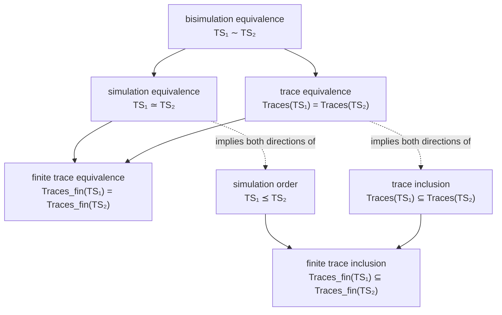

[[book-guidelines|↩ Back to guidelines]]

## What breaks with bisimulation

[[Bisimulation-Equivalence|Bisimulation]] gives you a wonderfully clean theorem: two finite, terminal-state-free transition systems are bisimilar exactly when they satisfy the same CTL\* formulae. That's the strongest possible abstraction result — collapse a huge system down to its bisimulation quotient $TS/\!\sim$, verify the (hopefully small) quotient, and you've verified everything expressible in CTL\* about the original. The catch is in the word "exactly." Bisimulation requires *mutual* mimicry: whenever $s_1 \sim s_2$, every transition out of $s_1$ must be matched by one out of $s_2$ landing in a bisimilar state, **and vice versa**. That symmetry is precisely what makes the quotient so informative — and precisely what makes it so hard to *find* a small one. A single spurious asymmetry between two states (one has an extra outgoing edge the other can't match) is enough to keep them apart, no matter how similar the rest of their behavior is.

This matters enormously for the book's running abstraction use case. Recall the Bakery algorithm's infinite transition system $TS_{Bak}$ (Example 7.13, p. 461): it happens to admit a *finite bisimulation quotient*, but the book is explicit that this is a special structural accident, not the general case. Generally, when you abstract an infinite (or just very large) transition system — say, by throwing away the precise value of an integer variable and remembering only its sign — the resulting abstract system is *not* bisimilar to the concrete one. It typically has *more* behavior than the concrete system, because the abstraction has merged states that used to be distinguishable, and a merged abstract state inherits the union of all the concrete transitions its members had. The concrete system can no longer "match" all of the abstract system's moves, because some of those moves only exist because of the merge. Symmetric mimicry is simply too strong a requirement to survive a many-to-one abstraction.

What you actually want from an abstraction is weaker and directional: every behavior the *concrete* system can produce should be reproducible by the *abstract* system (so that abstract verification is sound for the concrete system), but the reverse need not hold — the abstract system is allowed to have spurious extra behavior, since that behavior just represents information you deliberately threw away. That one-directional notion is **simulation**. It is Chapter 7's second major relation (after bisimulation in §7.1–7.3), and it is the formal backbone of essentially every abstraction technique used later in the model-checking literature, including the abstraction-refinement loops (CEGAR) built on top of over-approximating abstract transition systems.

## The simulation order between transition systems

### Definition, symbol by symbol

The book defines simulation the same way it defined bisimulation — coinductively, as the *greatest* relation satisfying certain local step conditions, rather than by hand-constructing one. Fix transition systems $TS_i = (S_i, Act_i, \rightarrow_i, I_i, AP, L_i)$ for $i = 1, 2$ over a shared set of atomic propositions $AP$.

> **Definition 7.47 (Simulation Order).** A *simulation* for $(TS_1, TS_2)$ is a binary relation $R \subseteq S_1 \times S_2$ such that
> - **(A)** $\forall s_1 \in I_1.\, \exists s_2 \in I_2.\, (s_1, s_2) \in R$
> - **(B)** for all $(s_1, s_2) \in R$:
>   1. $L_1(s_1) = L_2(s_2)$
>   2. if $s_1' \in \mathit{Post}(s_1)$, then there exists $s_2' \in \mathit{Post}(s_2)$ with $(s_1', s_2') \in R$.
>
> $TS_1$ is *simulated by* $TS_2$ (equivalently, $TS_2$ *simulates* $TS_1$), written $TS_1 \preceq TS_2$, if some simulation $R$ for $(TS_1, TS_2)$ exists.

Read condition (B.2) carefully against bisimulation's version: bisimulation additionally requires the symmetric clause ("if $s_2' \in \mathit{Post}(s_2)$, then there exists $s_1' \in \mathit{Post}(s_1)$ with…"). Dropping that clause is the *entire* difference between the two relations, and it's what makes $\preceq$ a **preorder** — reflexive and transitive (Lemma 7.49, by the same argument as bisimulation's Lemma 7.4) — rather than an equivalence. $TS_2$ is allowed to have transitions $s_1$ simply cannot follow along with; $TS_1$ is not.

**What breaks without asymmetry.** If you tried to define abstraction using bisimulation instead, you'd be demanding that the abstract system replay *no* behavior the concrete system lacks — but an abstraction that merges states necessarily invents such behavior (a merged state has the combined outgoing edges of everything merged into it). Insisting on symmetry here isn't just inconvenient, it's mathematically impossible for any nontrivial abstraction. Simulation is the minimal relaxation that keeps the direction you actually need — concrete-behavior-implies-abstract-behavior — while discarding the direction abstraction structurally cannot satisfy.

### A worked example: two vending machines

Example 7.48 makes the asymmetry concrete. Take $AP = \{pay, beer, soda\}$ and two vending machines: $TS_1$ pays, then *nondeterministically* dispenses either beer or soda (no user choice); $TS_2$ pays, then goes to a neutral state from which the user can choose beer *or* soda. The relation
$$R = \{(s_0,t_0), (s_1,t_1), (s_2,t_1), (s_3,t_2), (s_4,t_3)\}$$
is a simulation for $(TS_1, TS_2)$: every $TS_1$-transition is matched, because $t_1$ (via nondeterminism, not user choice — a simulation doesn't distinguish who resolves the choice) can go to either $t_2$ or $t_3$ just like $s_1$ and $s_2$ can. So $TS_1 \preceq TS_2$. But $TS_2 \not\preceq TS_1$: state $t_1$ can choose to dispense beer *or* soda, and no single state of $TS_1$ can match both options — $s_1$ only ever leads to beer, $s_2$ only ever leads to soda. $TS_2$ has behavior ("offer both drinks from the same state") that $TS_1$ structurally cannot replay. This is the general shape of every simulation counterexample: find a transition on the "bigger" side with no matching transition on the "smaller" side.

Interestingly, if you coarsen $AP$ to $\{pay, drink\}$ (i.e., stop distinguishing beer from soda), the asymmetry disappears and $TS_1 \simeq TS_2$ — showing that simulation, like bisimulation, is always relative to a chosen set of observable propositions.

### Grounding: checking a simulation

**Rust.** A transition system is naturally a graph with a labeling function; checking whether a *candidate* relation $R$ is a simulation is a straightforward, mechanical verification of Definition 7.47's two conditions — a good target for a typestate-flavored verifier:

```rust
use std::collections::{HashMap, HashSet};

struct TransitionSystem {
    states: Vec<u32>,
    post: HashMap<u32, HashSet<u32>>,
    labels: HashMap<u32, HashSet<String>>,
    initial: HashSet<u32>,
}

/// Checks whether `r` witnesses ts1 ⪯ ts2, per Definition 7.47.
fn is_simulation(ts1: &TransitionSystem, ts2: &TransitionSystem, r: &HashSet<(u32, u32)>) -> bool {
    // (A) every initial state of ts1 is related to some initial state of ts2
    let cond_a = ts1.initial.iter().all(|&s1| {
        ts2.initial.iter().any(|&s2| r.contains(&(s1, s2)))
    });

    // (B) every related pair agrees on labels and can step in lockstep
    let cond_b = r.iter().all(|&(s1, s2)| {
        let same_label = ts1.labels[&s1] == ts2.labels[&s2];
        let steps_matched = ts1.post.get(&s1).map_or(true, |succs1| {
            succs1.iter().all(|s1p| {
                ts2.post.get(&s2).map_or(false, |succs2| {
                    succs2.iter().any(|s2p| r.contains(&(*s1p, *s2p)))
                })
            })
        });
        same_label && steps_matched
    });

    cond_a && cond_b
}
```

Note what's absent compared to a bisimulation checker: there's no clause running the same quantifiers with $TS_1$ and $TS_2$ swapped. That missing half of the code *is* [[Liveness-Properties-and-the-Safety-Liveness-Decomposition#The theorem|the theorem]].

**Lean.** Because $\preceq$ is defined as the *greatest* relation closed under the step conditions, the textbook way to state it in a proof assistant is as a coinductively-defined relation — the same pattern bisimulation uses, just with an asymmetric step rule:

```lean
-- One step of the "is this a simulation" functor, as a monotone operator on
-- relations `S₁ → S₂ → Prop`. The simulation order is its greatest fixed point.
def SimStep (post1 : S₁ → Set S₁) (post2 : S₂ → Set S₂)
    (L1 : S₁ → Set AP) (L2 : S₂ → Set AP)
    (R : S₁ → S₂ → Prop) : S₁ → S₂ → Prop :=
  fun s1 s2 => L1 s1 = L2 s2 ∧ ∀ s1' ∈ post1 s1, ∃ s2' ∈ post2 s2, R s1' s2'

-- ⪯ is the greatest post-fixed point of SimStep (Knaster–Tarski), i.e. the
-- union of all relations R with R ≤ SimStep R — exactly Definition 7.47's
-- "there exists a simulation R".
```

This is the honest Lean-side reading of "coinductive definition as greatest fixed point": you don't get a free `coinductive` keyword the way you would in Coq, but `SimStep` being monotone in $R$ (it only ever asks for $\exists$-quantified membership in $R$, never negates it) is exactly what licenses taking its greatest fixed point via the Knaster–Tarski theorem — the same machinery Lean's own `OrderHom.gfp` exposes, and the same move the book itself is implicitly relying on when it says "the simulation order is the union of all simulations" (Lemma 7.59, below).

## Abstraction functions and abstract transition systems

This is where simulation earns its keep, and where the book's own motivation lines up exactly with the **static-analysis** focus area's central concern: producing a smaller, sound over-approximation of a system and discharging properties on that approximation instead.

### Definition and the soundness lemma

> **Definition 7.50 (Abstraction Function).** Let $TS = (S, Act, \rightarrow, I, AP, L)$ and let $\overline{S}$ be a set of abstract states. $f : S \rightarrow \overline{S}$ is an abstraction function if for all $s, s' \in S$: $f(s) = f(s')$ implies $L(s) = L(s')$.

The one non-negotiable rule: you're only allowed to merge states that already look the same to the observer (agree on $L$). Merge two differently-labeled states and the resulting abstract state's labeling is simply undefined — the construction below wouldn't make sense.

> **Definition 7.51 (Abstract Transition System).** The abstract transition system $TS_f = (\overline{S}, Act, \rightarrow_f, I_f, AP, L_f)$ induced by $f$ is: $\rightarrow_f$ has $f(s) \xrightarrow{\alpha}_f f(s')$ whenever $s \xrightarrow{\alpha} s'$; $I_f = \{f(s) \mid s \in I\}$; $L_f(f(s)) = L(s)$.

And the theorem that makes the whole enterprise sound:

> **Lemma 7.52.** $TS \preceq TS_f$, via the relation $R = \{(s, f(s)) \mid s \in S\}$.

The proof is one line once you see it: $L(s) = L_f(f(s))$ holds by construction, and every concrete transition $s \to s'$ is, *by definition* of $\rightarrow_f$, mirrored by an abstract transition $f(s) \to_f f(s')$ — so $R$ trivially satisfies condition (B.2). The abstract system can never fail to match a concrete step, because every abstract edge exists *precisely because* some concrete edge forced it into being. What it *can* do is have extra edges — e.g. two concrete states $s, t$ that got merged into $f(s) = f(t)$ contribute the union of their outgoing edges to the one merged abstract state, so $f(s)$ may now "offer" a transition that neither $s$ nor $t$ individually had a matching counterpart for from the other's perspective. That's the exact same phenomenon as the vending-machine example above, now happening *systematically* every time two states with different behavior get folded together.

**What breaks without this lemma.** If abstraction functions didn't provably preserve $\preceq$, "verify the abstract system instead of the concrete one" would be an unjustified leap of faith. Lemma 7.52 is the soundness certificate: it's the reason $TS \models \forall\varphi \Rightarrow$ (nothing directly — you still need the logic-preservation result in §7.5) but combined with that result, it's the reason a **positive answer on the abstract system transfers back to the concrete one** for the right class of properties. This is the load-bearing beam under every abstraction-based verification technique that follows in the literature, including predicate abstraction and CEGAR-style refinement loops in the `sat-smt-csp` focus area: they all construct *some* abstraction function $f$, verify $TS_f \models \Phi$, and invoke exactly this transfer.

### Two worked examples from the book

**The automatic door opener** (Example 7.53). A concrete transition system tracks a location $\ell \in \{0,1,2,3,4\}$ (progress through a 3-digit code) and an `error` counter $\in \{0,1,2\}$. Abstraction function $f$ collapses `error ∈ {0,1}` into a single abstract value `≤1`, leaving `error = 2` untouched. Because $0$ and $1$ are equally labeled (neither has yet triggered the alarm), this is a legal abstraction function, and $TS \preceq TS_f$ by Lemma 7.52. A second, coarser abstraction function $g$ throws away `error` entirely, collapsing all three values into one abstract state per location — again legal, again $TS \preceq TS_g$, and now the abstract system has only 6 states instead of 15.

**Data abstraction on a program** (Example 7.54). This one is the closer to your day-to-day tooling. Take the program

```
0  while x > 0 do
1    x := x - 1;
2    y := y + 1;
   od;
3  if even(y) then return "1" else return "0" fi;
```

and abstract the concrete domains $x, y \in \mathbb{N}$ down to $\mathrm{dom}_{abstract}(x) = \{\texttt{gzero}, \texttt{zero}\}$ and $\mathrm{dom}_{abstract}(y) = \{\texttt{even}, \texttt{odd}\}$ — i.e., track only the *sign* of $x$ and the *parity* of $y$. The concrete statement `y := y + 1` becomes the deterministic abstract flip `y := (y == odd) ? even : odd`. But `x := x - 1` becomes genuinely **nondeterministic** in the abstract program — `x := gzero or x := zero` — because from "$x$ is currently `gzero`" alone you can't determine whether decrementing lands back on `gzero` or hits `zero`. This nondeterminism is exactly the "spurious extra behavior" from the general discussion above, made syntactically visible: the abstract program has a branch the concrete program never actually takes on a *given* run, but which some run *could* take, and the abstraction can't tell those apart. Formally, $R = \{(s, f(s))\}$ is again a simulation, so $TS \preceq TS_f$.

**[[Concurrency-and-Communication-Modeling#Grounding|Grounding]].** This is a direct hit for the `static-analysis` focus area, and the sign/parity abstraction is a miniature abstract-interpretation domain in its own right.

```python
# A 3-line sketch of the abstract transfer function for "x := x - 1"
# under the {gzero, zero} domain from Example 7.54 — genuinely
# nondeterministic (returns the *set* of possible abstract successors,
# exactly mirroring the book's "x := gzero or x := zero").
def abstract_decrement(x_abs: str) -> set[str]:
    if x_abs == "zero":
        return {"zero"}          # 0 - 1 underflows to 0 in ℕ; guarded by x > 0 anyway
    return {"gzero", "zero"}     # can't tell if we land back above 0 or hit exactly 0
```

```rust
// A Rust sketch of an abstraction function as a genuine `From`-like
// projection — the type-level analogue of Definition 7.50's constraint
// that f must respect the labeling (here: the sign must be a pure
// function of the concrete integer, never of anything else).
#[derive(PartialEq, Eq, Clone, Copy, Debug)]
enum Sign { GtZero, Zero }

fn abstract_sign(x: i64) -> Sign {
    if x > 0 { Sign::GtZero } else { Sign::Zero }
}
// abstract_sign is trivially a valid abstraction function: it factors
// through equality on the observable predicate `x > 0`, so
// abstract_sign(a) == abstract_sign(b) implies a and b agree on that predicate.
```

The Rust and Python snippets are two views of the same fact: an abstraction function is a (possibly many-to-one) map on states, and the *soundness* of using it downstream depends entirely on whether the abstract transition relation is built by "existentially closing over" all concrete transitions of every merged state — which is exactly what makes the abstract semantics an **over-approximation**, the same over-approximation move that underlies abstract interpretation generally.

## Simulation equivalence versus bisimulation equivalence

Any preorder induces an equivalence relation — its *kernel*, the pairs related in both directions.

> **Definition 7.56 (Simulation Equivalence).** $TS_1 \simeq TS_2$ if $TS_1 \preceq TS_2$ and $TS_2 \preceq TS_1$.

The book also restates both $\preceq$ and $\simeq$ as relations *on the states of a single* $TS$ (Definition 7.58: $s_1 \preceq_{TS} s_2$, $s_1 \simeq_{TS} s_2$), exactly paralleling how bisimulation got both a two-system version and a single-system version. Lemma 7.59 shows $\preceq_{TS}$ is the coarsest simulation and the union of all simulations on $TS$ — literally "the greatest relation satisfying the step conditions," cashing out the coinductive definition concretely.

**Simulation equivalence is coarser than bisimulation equivalence** — every $\sim$-pair is a $\simeq$-pair (Theorem 7.64), but not conversely. Example 7.63 shows why: take $TS_1$ with an initial $a$-state branching to two different $\emptyset$-states, one leading to $b$ and the other to $c$; let $TS_2$ have an initial $a$-state going to a *single* $\emptyset$-state that can nondeterministically reach either $b$ or $c$. Every behavior of $TS_1$ is a behavior of $TS_2$ and vice versa, so $TS_1 \simeq TS_2$ — but no single state of $TS_2$ can be bisimilar to $TS_1$'s branching state, because bisimulation must match branching structure exactly, and merging the two successor branches into one state loses that structure irreversibly. Simulation equivalence only cares that the *set of reachable behaviors* matches in both directions, not that the branching *shape* producing them does.

**Why this matters for abstraction, again:** simulation equivalence yields a *coarser* (smaller) quotient than bisimulation equivalence would, precisely because it doesn't insist on preserving branching structure — only preserving what's reachable. A smaller quotient is a better abstraction, provided you're only interested in the class of properties simulation equivalence actually preserves (§7.5 nails this down exactly).

### The simulation quotient, and a genuine subtlety

Definition 7.60 defines $TS/\!\simeq$ by collapsing $\simeq$-equivalence classes, with the transition rule
$$B \rightarrow_{\simeq} C \iff \exists s \in B.\, \exists s' \in C.\, s \rightarrow s'$$
— an *existential* rule, unlike bisimulation's quotient, where the analogous *universal* statement ($\forall s \in B\, \exists s' \in C\, s \to s'$) would also hold. This existential-only guarantee is genuinely delicate: Remark 7.62 constructs an infinite transition system where a *naively* defined quotient ($R^{-1} = \{([s]_\simeq, s)\}$, i.e. simply reading the relation backwards) fails to be a simulation for $(TS/\!\simeq, TS)$, because a transition in the quotient can be witnessed by *one* member of an equivalence class while another member has no matching successor at all. The fix (Theorem 7.61) uses instead $R' = \{([s]_\simeq, t) \mid s \preceq t\}$ — related not to *an arbitrary* representative, but to anything that *simulates* the class — and this does work in general, giving $TS \simeq TS/\!\simeq$ unconditionally. Interestingly, the simpler, more natural-looking construction from Remark 7.62 only recovers full equivalence when $TS$ is **finite** (the "maximal successor" argument needs finiteness to guarantee a maximal element exists). This is a good reminder that coinductive constructions that look obviously correct by analogy with an inductive cousin can quietly need extra hypotheses.

## AP-deterministic transition systems

Bisimulation and simulation equivalence coincide exactly on one well-behaved class of systems:

> **Definition 7.65 (AP-Determinism).** $TS$ is $AP$-deterministic if (1) at most one initial state carries any given labeling $A \subseteq AP$, and (2) for any state $s$, at most one direct successor of $s$ carries any given labeling.

Determinism, in other words, means the *label sequence alone* pins down which state you're in at every step — there's never a choice between two differently-reachable-but-identically-labeled continuations. Example 7.63's $TS_1$ (the branching-but-simulation-equivalent one) is explicitly **not** $AP$-deterministic, since its initial state has two distinct $\emptyset$-labeled successors — that's exactly the freedom that let $\sim$ and $\simeq$ diverge.

> **Theorem 7.66.** If $TS_1, TS_2$ are $AP$-deterministic, then $TS_1 \sim TS_2 \iff TS_1 \simeq TS_2$.

This is a genuinely useful practical fact: for a large and common class of systems (anything where each observable trace uniquely determines the run producing it — true of most sequential, non-branching program models), you never have to worry about which of the two equivalences to use; they agree, and (by Corollary 7.72(c), next) they also coincide with plain trace equivalence.

## How simulation relates to trace inclusion, and why that preserves safety

This is the section that turns simulation from "a relation between transition systems" into "a justification for abstraction-based verification of specific properties" — and it's where the book is careful to draw a line that many informal treatments blur.

> **Theorem 7.67.** $TS_1 \preceq TS_2 \implies \mathit{Traces}_{fin}(TS_1) \subseteq \mathit{Traces}_{fin}(TS_2)$.

*Proof idea:* Lemma 7.55 (path-fragment lifting) says that whenever $(s_1,s_2) \in R$ for a simulation $R$, every finite or infinite path fragment from $s_1$ can be "lifted" step-by-step to a same-length, statewise-$R$-related path fragment from $s_2$ (Figure 7.22 in the book draws this as a ladder diagram — each rung of $TS_1$'s path has a matching rung on $TS_2$'s side, related by $R$, and the whole thing "can be completed to" a full commuting ladder). Since $R$-related states share a label, the two path fragments produce identical *finite* traces.

> **Corollary 7.68 (Simulation Preserves Safety Properties).** For $TS_1, TS_2$ without terminal states and a safety LT property $P_{safe}$: $TS_1 \preceq TS_2$ and $TS_2 \models P_{safe}$ implies $TS_1 \models P_{safe}$.

This is the theorem the whole abstraction enterprise cashes out to: **verify the abstract system is safe, and the concrete system inherits safety, for free.** No new proof obligation on the concrete side.

**Why doesn't this extend to arbitrary trace inclusion, and hence to liveness?** Example 7.69 gives a sharp counterexample: let $TS_1$'s initial $a$-state branch to a *terminal* $\emptyset$-state $s_2$ or to another $\emptyset$-state $s_3$ leading on to $\{b\}$; let $TS_2$ be identical except its analogue of $s_2$, namely $t_2$, is **not terminal** (it has some further, unlabeled continuation). Then $TS_1 \preceq TS_2$ (terminal states are simulated by *any* equally-labeled state), but $\{a\}\emptyset \in \mathit{Traces}(TS_1)$ — a maximal, terminating trace — while $\{a\}\emptyset \notin \mathit{Traces}(TS_2)$, because in $TS_2$ that state isn't terminal, so no *maximal* trace of $TS_2$ ends there. Termination is exactly the kind of information a simulation is free to be silent about: a simulation only has to match *finite prefixes* of behavior, not whether that behavior was allowed to *stop*.

> **Theorem 7.70.** If $TS_1 \preceq TS_2$ and $TS_1$ has no terminal states, then $\mathit{Traces}(TS_1) \subseteq \mathit{Traces}(TS_2)$.

Remove terminal states from the picture and the counterexample's entire mechanism disappears — every path is now infinite, path-fragment lifting applies to infinite paths directly, and full trace inclusion (hence *every* LT property, safety or liveness) transfers. This no-terminal-states hypothesis recurs throughout the section; it is doing real work every time, not boilerplate.

> **Corollary 7.72.** (a) $TS_1 \simeq TS_2 \Rightarrow \mathit{Traces}_{fin}(TS_1) = \mathit{Traces}_{fin}(TS_2)$. (b) without terminal states, $TS_1 \simeq TS_2 \Rightarrow \mathit{Traces}(TS_1) = \mathit{Traces}(TS_2)$. (c) for $AP$-deterministic systems, $TS_1 \simeq TS_2 \iff \mathit{Traces}(TS_1) = \mathit{Traces}(TS_2)$.

Putting Theorem 7.66 and Corollary 7.72(c) together: on $AP$-deterministic systems, **bisimulation, simulation equivalence, and trace equivalence all coincide.** All the structural distinctions this chapter labors to draw collapse into one notion exactly when nondeterminism (in the "distinct successors with the same label" sense) is absent.

The book packages the whole comparison as a Hasse diagram (Figure 7.27) — edges point from finer (more distinguishing) relations down to coarser ones:



(The dotted edges are not in the book's diagram but make explicit that each equivalence in the top half is literally "its corresponding preorder in both directions" — $\simeq \,=\, \preceq \cap \preceq^{-1}$, and likewise for trace equivalence versus trace inclusion.)

## The universal fragment $\forall CTL^*$ and its existential dual

Bisimulation got a beautiful logical characterization: bisimilar iff CTL\*-equivalent. Does simulation get one too?

**Why not with all of CTL\*.** The book gives a genuinely elegant impossibility argument (not hand-waved — reproduced here in full since it's short and sharp). Suppose some logic fragment $\mathcal{L}$ closed under negation could characterize $\preceq_{TS}$: $s_1 \preceq_{TS} s_2 \iff$ for all $\Phi \in \mathcal{L}$, $s_2 \models \Phi \Rightarrow s_1 \models \Phi$. Take $s_1 \preceq_{TS} s_2$. For any $\Phi \in \mathcal{L}$:
$$s_1 \models \Phi \implies s_1 \models \neg\neg\Phi \implies^{\text{(*)}} s_2 \models \neg\neg \Phi \implies s_2 \models \Phi$$
where (*) uses $s_2 \models \neg\Phi \Rightarrow s_1 \models \neg\Phi$, i.e., the contrapositive of the assumed characterization applied to $\neg\Phi \in \mathcal{L}$ (closure under negation). But that chain says $s_2 \preceq_{TS} s_1$ too — i.e., **any negation-closed logic characterizing $\preceq$ would force it to be symmetric**, which it provably isn't (Example 7.48/7.63). So the only way to logically characterize an asymmetric relation is with an asymmetric (non-negation-closed) logic.

**What breaks without dropping negation:** this is the crux of why simulation needs its own bespoke fragment rather than reusing CTL\* wholesale — it's not a technical inconvenience, it's a theorem that a negation-closed logic is *categorically the wrong kind of tool* for characterizing a preorder that isn't an equivalence.

> **Definition 7.74 (Universal Fragment $\forall CTL^*$).** State formulae in positive normal form (negation only on atomic propositions) using only universal path quantification:
> $$\Phi ::= \mathbf{true} \mid \mathbf{false} \mid a \mid \neg a \mid \Phi_1 \land \Phi_2 \mid \Phi_1 \lor \Phi_2 \mid \forall\varphi$$
> $$\varphi ::= \Phi \mid \bigcirc\varphi \mid \varphi_1 \land \varphi_2 \mid \varphi_1 \lor \varphi_2 \mid \varphi_1\, U\, \varphi_2 \mid \varphi_1\, R\, \varphi_2$$
> $\forall CTL$ restricts path formulae to $\Phi \mid \Phi_1 U \Phi_2 \mid \Phi_1 R \Phi_2$ (no nesting of $\bigcirc$ outside a state formula). $\Diamond$ and $\Box$ derive as usual ($\Diamond\varphi = \mathbf{true}\,U\,\varphi$, $\Box\varphi = \mathbf{false}\,R\,\varphi$).

Because PNF forces the release operator $R$ to appear as a primitive (you can't push a negation through $U$ to get $R$ if negation isn't available on compound formulae), $\forall CTL^*$ is exactly rich enough to state safety properties ("$\forall\Box\Phi$") while being unable to state their negation.

> **Lemma 7.75.** Every LTL formula has an equivalent $\forall CTL^*$ formula (put it in PNF and prefix with $\forall$).
> Conversely, $\forall CTL^*$ is strictly more expressive than LTL — e.g. $\forall\Diamond\forall a$ (a branching-time statement: *every* path eventually reaches a state from which *every* path satisfies $a$) has no LTL equivalent.

### The characterization theorem

> **Theorem 7.76.** For a finite $TS$ without terminal states and states $s_1, s_2$: **(a)** $s_1 \preceq_{TS} s_2$ **(b)** for all $\forall CTL^*$ formulae $\Phi$, $s_2 \models \Phi \Rightarrow s_1 \models \Phi$ **(c)** the same restricted to $\forall CTL$ — are all equivalent.

The (a)$\Rightarrow$(b) direction is the "easy," constructive half — it follows from lifting simulation along paths (the same Lemma 7.55 machinery, generalized from labels to whole $\forall CTL^*$ formulae by structural induction; the no-terminal-states hypothesis is essential here because $\forall\varphi$ needs *full* path lifting, not just finite-prefix lifting). The (c)$\Rightarrow$(a) direction is the interesting one, and it mirrors bisimulation's *master-formula* technique (used earlier for Theorem 7.20, the CTL\*-characterizes-bisimulation result): for each state $u$, construct a single $\forall CTL$ formula $\Phi_u$ whose satisfaction set is *exactly* the downward closure $u{\downarrow} = \{t \mid (t,u) \in R\}$ under the logically-defined relation $R$. Because the transition system is finite, $\Phi_u$ is a *finite* conjunction of pairwise-distinguishing formulae, and once you have a master formula per state you can express "$s_2$'s successors, taken together, cover all of $s_1$'s possible successors" as a single $\forall CTL$ formula ($\forall\bigcirc\bigvee_i \Phi_i$) and push it through $R$ to conclude $s_1$'s actual successor lands inside some $u_i{\downarrow}$ — exactly condition (B.2) of Definition 7.47. This is a genuinely clever finite encoding of an infinite-looking universal statement ("for every $\forall CTL^*$ formula...") into a *single, finite* witness formula, which is what makes the (c)$\Rightarrow$(a) implication (the "hard" direction, going from *finitely many* formulae to *the actual relation*) work at all.

**A worked example.** Example 7.77: let $TS_1$'s initial $\{a\}$-state have two successors, one $\emptyset$ and one $\{a\}$ (terminal); let $TS_2$'s initial $\{a\}$-state have a self-loop plus the same two successors. Then $TS_1 \preceq TS_2$ but $TS_2 \not\preceq TS_1$ (the self-loop is unmatched — same asymmetric-branching pattern as every earlier example). The distinguishing $\forall CTL$ formula is
$$\Phi = \forall\bigcirc(\forall\Box\neg a \lor \forall\Box a),$$
satisfied by $TS_1$'s initial state (every immediate successor is *either* always-$\neg a$ forever *or* always-$a$ forever) but violated by $TS_2$'s (the self-loop successor can reach both an $a$-state and a $\neg a$-state, so neither disjunct holds there).

### The dual: $\exists CTL^*$

Using the CTL\* duality $\forall\varphi \equiv \neg\exists\neg\varphi$, the same order can be read in reverse existential terms:

> **Definition 7.78 / Theorem 7.79.** $\exists CTL^*$ restricts existential path quantification instead of universal. Then $s_1 \preceq_{TS} s_2 \iff$ for all $\exists CTL^*$ (or $\exists CTL$) formulae $\Phi$: $s_1 \models \Phi \Rightarrow s_2 \models \Phi$.

Note the flipped direction of implication relative to Theorem 7.76 — here it's the *smaller* (simulated) side's satisfaction that transfers *up* to the simulating side. This is the natural "possibility" reading: if some existential (reachability-flavored) property can *possibly* happen in the concrete system, the abstract system must also admit it as a possibility — exactly matching the intuition that abstraction adds spurious possible behavior but never removes actual behavior. $\forall CTL^*$ and $\exists CTL^*$ are simply two mirror-image lenses on the same order $\preceq$.

## Where this leads

Structurally, §§7.4–7.5 sit between bisimulation (§7.1–7.3, [[Bisimulation-Equivalence]]) and the algorithmic machinery of §7.6 (partition-refinement for computing the simulation preorder/quotient — [[Partition-Refinement-Algorithms]] in this vault), and they set up §7.7–7.8's stutter-insensitive relations, which relax bisimulation the *other* way (allowing a single step to be matched by a whole path of internal moves, rather than relaxing the mutual-mimicry requirement). Everything downstream that talks about "abstraction preserving a property" is quietly appealing to Corollary 7.68 and Theorem 7.76: verify $\forall CTL^*$ (in particular, any safety property) on a smaller, over-approximating abstract system, and the concrete system inherits it — no extra proof step, no separate soundness argument to construct per project.

For the `static-analysis` focus area, this chapter is close to the theoretical foundation you'll eventually want underneath predicate abstraction and CEGAR: an abstraction function (Definition 7.50) is a very direct ancestor of a Galois-connection abstraction map in abstract interpretation, and Lemma 7.52's soundness argument ("every concrete transition forces a matching abstract one, but not conversely") is the transition-system-level shadow of the abstract-interpretation soundness theorem you'll prove for your own over-approximating analysis passes — the reason a "may" abstract semantics never misses a real bug. For `sat-smt-csp`, the asymmetry story here — $\preceq$ preserves safety/reachability-in-one-direction but not liveness or exact trace equivalence — is exactly the caveat a CEGAR loop has to respect: when abstract model checking reports "property violated," that counterexample may be *spurious*, precisely because the abstract system's extra behavior (the very thing that made $TS \preceq TS_f$ nontrivial) can manufacture a violating trace the concrete system never actually has. Theorem 7.76's master-formula construction, meanwhile, is a nice finite-state cousin of the counterexample-generation machinery you'll want when your own verifier needs to explain, in the source language's own terms, exactly *why* an abstract state isn't a valid abstraction of a concrete one.
