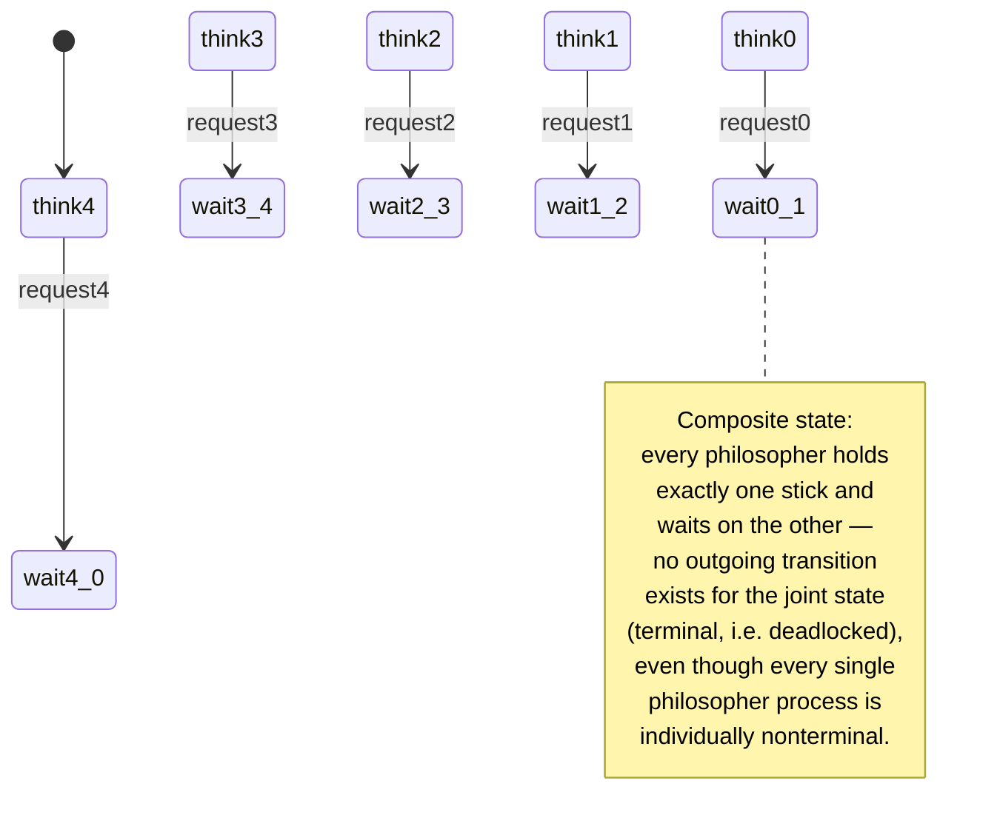

[[book-guidelines|↩ Back to guidelines]]

# State-Space Explosion

## Why this problem exists at all

Every technique in this book rests on one operational move: replace "does the system behave correctly" with "does every reachable state of a finite structure satisfy a formula." Chapter 2 spent 60-odd pages building the machinery to construct that finite structure — transition systems from program graphs, from circuits, from parallel composition via interleaving, handshaking, channels, and synchronous product. Section 2.3 is the chapter's reckoning: having shown *how* to build the model, it now asks *how big* the model gets. The answer is the reason model checking is hard in practice even though it's conceptually simple, and it is why roughly two-thirds of the rest of the book (partition refinement, bisimulation/simulation abstraction, symbolic BDD-based checking, partial-order reduction) exists at all. Baier and Katoen are blunt about this in the chapter summary: state-space explosion is "known under the heading state explosion and is another evidence for the fact that verification problems are particularly space-critical."

The core observation is deceptively simple, and that's exactly the danger: each individual modeling decision (add a variable, add a process) looks harmless, but the state count is a *product*, not a sum, over those decisions. Nothing in the model needs to be exotic for the reachable state space to become astronomically larger than anything you can enumerate. What breaks without appreciating this: you write a "toy" model with ten program locations, three booleans, and five bounded integers, expect a manageable state count, and get $8{,}000{,}000$ states before you've modeled anything interesting — and a single 50-bit array pushes that past $2^{50}$. The book uses exactly this example (p. 78) to make the point concrete before it becomes a slogan.

## Where the exponential comes from: three independent sources

The book decomposes the blowup into three sources, each traceable to a specific construction from earlier in Chapter 2. This decomposition matters more than the headline "it's exponential" — each source has a different mitigation, and those mitigations map directly onto later chapters.

### 1. Variables in a program graph

Recall a program graph's unfolding into a transition system (Definition 2.15-ish machinery, Ch. 2.1.2): states are pairs $\langle \ell, \eta \rangle$ of a control location $\ell \in Loc$ and a variable evaluation $\eta$ over $\mathit{Var}$. If every variable $x \in \mathit{Var}$ has a finite domain, the number of states is

$$
|Loc| \cdot \prod_{x \in \mathit{Var}} |\mathrm{dom}(x)|.
$$

For $N$ variables each with a domain of $k$ values, that product is bounded by $k^N$ — **exponential in the number of variables**, not in anything about the program's control structure. This is the "what breaks" case above: it's a statement about the *Cartesian product* $\eta \in \prod_x \mathrm{dom}(x)$ that a variable evaluation ranges over, and Cartesian products of finite sets multiply, they don't add. If any single variable has an infinite domain (unbounded integers, reals), the transition system is infinite outright, and the book notes this typically yields *undecidable* verification problems — a boundary condition, not just a performance one.

The same shape recurs for [[Transition-Systems-as-System-Models#Sequential hardware circuits|sequential hardware circuits]] (Ch. 2.1.2, p. 26): a circuit's states are joint evaluations of its input variables and registers, so $N$ inputs and $K$ registers give $2^{N+K}$ states.

### 2. Parallel composition of components

Every parallel operator introduced in §2.2 — interleaving $|||$, shared-variable composition, handshaking $\|_H$, channel composition, synchronous product $\otimes$ — builds the composite state space as the **Cartesian product of the local state spaces**:

$$
S = S_1 \times S_2 \times \cdots \times S_n, \qquad |S| = |S_1| \cdot |S_2| \cdots |S_n|.
$$

$N$ components with $k$ local states each give $k^N$ composite states — the book's phrase is that this "may easily run out of control" even for small $N$. This is structurally the *same* multiplicative mechanism as source 1 (a Cartesian product of per-component domains, rather than per-variable domains), which is worth internalizing: state-space explosion is not two unrelated phenomena that happen to both be called "explosion" — it is one phenomenon (products of independent choices) manifesting at two different granularities (variable values, component states).

### 3. Channel capacity

For channel systems $CS = [PG_1 | \cdots | PG_n]$ over variables and channels $\mathit{Chan}$, the state count folds in both of the above *and* a third factor — the buffer contents of each channel:

$$
\prod_{i=1}^{n} |PG_i| \cdot \prod_{c \in \mathit{Chan}} |\mathrm{dom}(c)|^{\mathrm{cp}(c)}
$$

which the book restates, for $L$ locations per component, $M$ variables with domain size $\le m$, and $K$ bit-channels of capacity $k$, as

$$
L^n \cdot m^M \cdot 2^{K \cdot k}.
$$

The worked example (Example 2.44, the Alternating Bit Protocol with capacity-10 channels) lands at roughly $2 \cdot 8 \cdot 6 \cdot 4^{10} \cdot 2^{10} \approx 3 \cdot 2^{35} \approx 10^{11}$ states — from a protocol whose *specification* fits on one page. An unbounded channel (infinite capacity) again makes the state space infinite, same as an unbounded variable domain.

**A note the book is careful to make** (and which is easy to miss): the number of *atomic propositions* used to label states is a separate combinatorial concern, but it "plays only a secondary role" in practice, because you never need to enumerate the labeling function explicitly — truth values of atomic formulas are derived on demand from the state itself. The explosion that actually bites is in $|S|$, the state count, not in $|AP|$.

## Deadlock: a definition that only makes sense once you have a composite system

Chapter 3 opens (§3.1) with a concept that is easy to state informally but that the book insists on defining precisely at the level of the *composite* transition system, because that precision is exactly what will let later chapters (invariant checking, CTL's $\forall\Box$, etc.) treat "deadlock-freedom" as a checkable property rather than a vague design goal.

A **terminal state** of a transition system is a state with no outgoing transitions — for a *sequential* program without an infinite loop, reaching one is normal (it just means the program finished). But for a parallel system built by composing components, [[Safety-Properties-and-Invariants#The book's definition|the book's definition]] of **deadlock** is:

> A deadlock occurs if the complete system is in a terminal state, although at least one component is in a (local) nonterminal state.

The asymmetry is the whole point: the *composite* system has stopped (no $\rightarrow$-successor exists for the joint state), yet some individual component still has moves it *would* make if only its synchronization partner cooperated. This is not "the system finished," it's "the system got stuck because of how its parts depend on each other" — a property of the *interaction*, not of any one component in isolation, which is exactly why it can't be detected by looking at components separately and is exactly why it needs the composite state space (with all its explosion) to check at all.

Two [[Concurrency-and-Communication-Modeling#Worked examples|worked examples]] anchor this:

- **Faulty traffic lights** (Example 3.1): two lights synchronize on actions $\alpha$ (change to green) and $\beta$ (change to red). Starting both lights red is enough to deadlock the pair — one is waiting to synchronize on $\alpha$, the other is waiting to synchronize on $\beta$, and neither action is jointly enabled. A one-bit initialization mistake, invisible in either component's transition system read on its own, becomes a terminal composite state.
- **Dining philosophers** (Example 3.2, Dijkstra): five philosophers, five chopsticks, each philosopher needs both neighboring sticks to eat. The "obvious" design — pick up left, then right — deadlocks whenever all five simultaneously grab their left stick: every philosopher now holds one stick and waits forever for the other, a genuinely *symmetric*, cyclic-wait terminal state. The book walks through the exact action sequence ($\mathrm{request}_4, \mathrm{request}_3, \dots$, in any order) that reaches it, and then shows two successive refinements — making sticks available to only one philosopher at a time, then adding a "deference" boolean $x_i$ so a thinking philosopher's neighbor can borrow a stick — that respectively buy deadlock-freedom and then fault-tolerance (deadlock-freedom even if one philosopher never leaves the *think* state).



Notice why deadlock belongs in the same Topic-List entry as state-space explosion, even though the book presents them one chapter apart: deadlock is a property you can only *check* by exploring the composite state space, so it inherits the exact same explosion problem as everything else — a deadlock detector that must materialize $S_1 \times \cdots \times S_n$ before it can look for a terminal joint state is doomed by the same $k^N$ wall as any other reachability query. This is also precisely why deadlock-freedom later reduces to invariant checking (Chapter 3's own machinery: "no reachable state is terminal-with-a-nonterminal-component" is a state predicate) — invariant checking by DFS is the book's *first* answer to "how do you check something over an exponential state space without paying the full exponential in the worst realized case," a theme that recurs and sharpens through nested DFS (Ch. 4), symbolic/BDD encoding (Ch. 6), and partial-order reduction (Ch. 8).

## Grounding: making the multiplication (and the wall) concrete

### Rust — the Cartesian product, made to actually blow up

The cleanest way to *feel* state-space explosion rather than just read the formula is to build the composite state space the way the book does — as a genuine Cartesian product of per-component (or per-variable) domains — and watch `usize` overflow or your process exhaust memory well before you reach anything resembling a realistic system.

```rust
/// A single component's local state space size, |S_i|.
/// (In the book's terms: |Loc| * product of variable-domain sizes.)
#[derive(Clone, Copy)]
struct ComponentSpace {
    locations: u64,
    variable_domains: &'static [u64], // sizes of each dom(x)
}

impl ComponentSpace {
    fn size(&self) -> u128 {
        let var_product: u128 = self
            .variable_domains
            .iter()
            .map(|&d| d as u128)
            .product();
        self.locations as u128 * var_product
    }
}

/// The parallel composition |S| = |S_1| * ... * |S_n| — Section 2.3's
/// "Parallelism" paragraph, expressed exactly: multiplication, not addition.
fn composite_size(components: &[ComponentSpace]) -> u128 {
    components.iter().map(|c| c.size()).product()
}

fn main() {
    // The book's own numbers: 10 locations, 3 booleans, 5 bounded ints in {0..9}.
    let program = ComponentSpace {
        locations: 10,
        variable_domains: &[2, 2, 2, 10, 10, 10, 10, 10],
    };
    assert_eq!(program.size(), 8_000_000);

    // Now compose N=5 identical copies as if they ran in parallel — this is
    // exactly the k^N blowup from Section 2.3's "Parallelism" paragraph.
    let five_in_parallel = vec![program; 5];
    let total = composite_size(&five_in_parallel);
    // 8,000,000^5 ≈ 3.28 * 10^34 states — already unrepresentable in any
    // enumerable data structure, from a system whose *description* is five
    // lines long.
    println!("{total}");
}
```

The point of writing it this way rather than just quoting $k^N$ is architectural: any real state-space-search tool (a bounded model checker, a symbolic executor, an abstract interpreter's concrete-collecting-semantics fallback) has to represent `composite_size` — or, worse, actually *enumerate* it — somewhere in its reachability engine. Seeing the `u128` overflow risk in code is the same lesson as the book's "$8{,}000{,}000 \to 800{,}000 \cdot 2^{50}$" jump: the wall isn't a performance nuisance to be optimized away, it's a size class that no exhaustive enumeration will ever reach, for any real system, on any hardware. That's the actual argument for every abstraction and reduction technique later in the book — and, if you're building a checker of your own, for yours too.

### Python — a quick reachability-search sketch to see the wall in wall-clock time

Where Rust above computes the *closed-form* count, a short breadth-first search makes the practical consequence visible: even just *materializing* reachable states (never mind checking a property over them) becomes infeasible almost immediately.

```python
from itertools import product

def reachable_states(n_components, states_per_component):
    """Naively enumerate the composite state space S_1 x ... x S_n,
    mirroring Section 2.3's |S| = |S_1| * ... * |S_n| — but by actually
    constructing the set, not just counting it."""
    local_spaces = [range(states_per_component)] * n_components
    return list(product(*local_spaces))  # this *is* the Cartesian product

# n=4, k=10 -> 10,000 states: instant.
# n=8, k=10 -> 100,000,000 states: minutes, and gigabytes of Python tuples.
# n=12, k=10 -> a trillion states: this call will not return.
states = reachable_states(n_components=4, states_per_component=10)
print(len(states))  # 10_000
```

This is deliberately the *naive* algorithm — no on-the-fly exploration, no sharing, no abstraction — because that's the point: it is exactly [[Probabilistic-Computation-Tree-Logic#The algorithm|the algorithm]] that "systematically checks whether the property holds," i.e. exhaustive model checking in its most literal reading, and it is exactly what §2.3 is warning you cannot be your only strategy.

A note on the third [[Concurrency-and-Communication-Modeling#Grounding|grounding]] language: this particular topic — a combinatorial counting argument about Cartesian products of finite sets — doesn't have a natural, non-strained Lean rendering. Lean's strengths (dependent types, definitional equality, elaboration) aren't what's load-bearing here; the content is closer to a complexity-theoretic observation than a type-theoretic one. It resurfaces meaningfully once the book gets to *symbolic* encodings (Ch. 6's switching functions and OBDDs, where a state set literally becomes a Boolean formula whose satisfying assignments are the states — much closer to something worth modeling in a proof assistant), so it's deferred there rather than forced now.

## Where this leads

State-space explosion is the single obstacle that most of the book's later machinery exists to defeat, from three different angles that are worth naming explicitly since they don't converge on one technique:

- **Don't build the whole space, check on the fly:** nested DFS for Büchi-automaton emptiness (Ch. 4), on-the-fly LTL model checking (Ch. 5) — explore only as much of $S$ as a counterexample search actually needs.
- **Represent the space more cleverly, not smaller:** symbolic/BDD-based [[CTL-Model-Checking|CTL model checking]] (Ch. 6, §6.7) encodes $S$ as a switching function rather than an explicit set, so that structurally regular (even if numerically enormous) state sets can be represented compactly.
- **Don't explore the whole space, because you don't need to:** bisimulation/simulation quotienting (Ch. 7) and partial-order reduction (Ch. 8) exploit, respectively, behavioral redundancy between states and independence between concurrently-enabled actions to explore a provably-equivalent but much smaller structure.

For the standing project this vault is tracking — a Rust-based dependent/refinement-type checker with an embedded automated theorem prover and CSP kernel — this topic is the direct motivating argument for *why* you need both halves of that architecture rather than either alone (tagged here under **Static Analysis & Abstract Interpretation** and **SAT/SMT/CSP**, per this book's learning-goals file). The abstract interpreter's job is precisely to avoid ever materializing the concrete Cartesian-product state space described above — it works over an abstract lattice whose size is chosen independently of $k^N$, trading precision for tractability, which is a *soundness-preserving* answer to explosion (it may miss nothing, at the cost of possibly reporting false alarms). The CSP kernel's job is the complementary, *completeness-preserving* answer: rather than exhaustively searching $S$ for a counterexample, it uses domain/lattice propagation to prune the same combinatorial product down to a tractable search, finding one concrete satisfying (bug-witnessing) assignment without ever enumerating the rest. Reading Chapter 2's three exponential-growth sources side by side with your own compiler's design is the cleanest way to see that "prove absence via over-approximation" and "prove presence via efficient concrete search" are not two independent features bolted together — they are the two historically-standard escapes from the exact wall this section names, aimed at the two sides of the same verification question.
