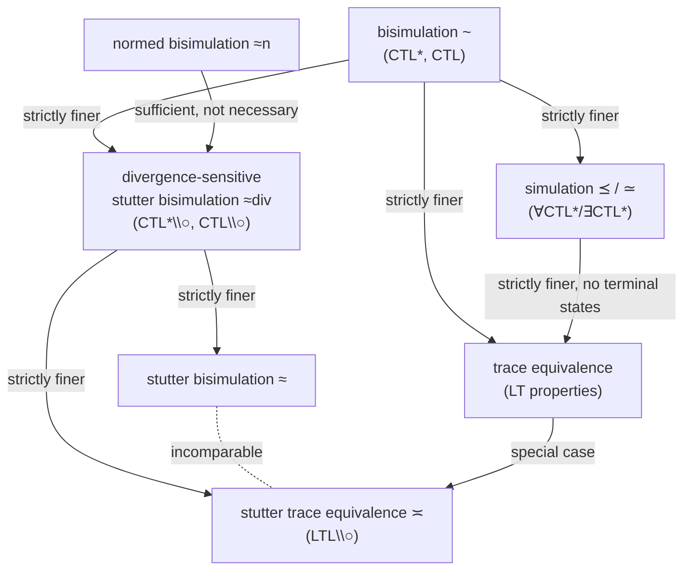

# Stutter Equivalences

[[book-guidelines|↩ Back to guidelines]]

## What breaks without this: the abstraction problem

Every equivalence built so far in Chapter 7 — bisimulation ($\sim$), simulation ($\preceq$), trace equivalence — shares one silent assumption: a single step in one system must be matched by a single step in the other. That assumption is exactly what makes those relations *strong*. It is also exactly what makes them useless for the single most common abstraction move in verification: replacing a burst of internal computation with the "same" observable behavior at a coarser grain.

Concretely: suppose you model a network protocol at a high level with a single atomic action `x := y!` (send `y` and store the tag in `x`), and separately you model the actual implementation, which computes that value iteratively —

```
i := y; z := 1;
while i > 1 do
    z := z * i; i := i - 1;
od
x := z;
```

These two systems are not trace-equivalent — they don't even have the same *number* of steps between "start" and "`x` has the right value" — so no strong relation from earlier sections can identify them. Yet intuitively they're "the same system at different resolutions": the entire loop is functionally a single invisible unit of work, as long as you only care about atomic propositions over `x` and `y`. This chapter's whole point is to make that intuition precise, without throwing away the guarantees that made bisimulation and simulation useful in the first place — namely, that *some* interesting class of formulas is still preserved across the abstraction.

There is a second, more practical motivation, and it will resurface with full force in the very next chapter ([[Partial-Order-Reduction|Partial Order Reduction]], Chapter 8): if you're allowed to abstract away sequences of internal transitions, the *quotient* system can be dramatically smaller than any quotient obtainable under a strong relation. Compare this to garbage collection or dead-code elimination in a compiler: you're not just proving two programs equivalent, you're using that proof to justify actually deleting the redundant structure. Stutter equivalences are the "compiler pass" that model checking runs before the real work of automata-theoretic verification, and Chapter 8's partial-order reduction algorithms are stated directly in terms of the equivalences developed here.

## Stutter steps: naming the "invisible" transitions

The formalization starts from the cheapest possible observation. Recall a transition system $TS = (S, \mathit{Act}, \rightarrow, I, AP, L)$ labels each state $s$ with the set $L(s) \subseteq AP$ of atomic propositions true there. A transition changes *nothing observable* exactly when it doesn't change the label.

> **Definition (Stutter Step).** A transition $s \rightarrow s'$ is a *stutter step* if $L(s) = L(s')$.

That's it — no notion of "internal action" or "$\tau$-transition" as in process calculi; stutter-ness is entirely a fact about the labeling function, derivable from the *state graph* alone. This is a deliberate design choice: it means stutter equivalence can be defined purely on traces (words over $2^{AP}$), the same object used for ordinary trace equivalence in Chapter 3, rather than requiring extra syntactic machinery to mark which actions are "silent."

**Rust analogy.** Think of $L$ as a `#[derive(PartialEq)] struct Snapshot { .. }` extracted from your program's full state after each step. A stutter step is one where `snapshot_before == snapshot_after` — the state changed (registers, program counter, whatever), but nothing you're allowed to *observe* did. This is precisely the situation a compiler's dead-store elimination pass reasons about: instructions that mutate memory no live-out variable will read.

## Stutter equivalence of paths and traces

A single stutter step is uninteresting. The real content is in how you *aggregate runs* of them. The book's move: instead of comparing traces symbol-by-symbol, compare them up to grouping consecutive repeated blocks.

> **Definition (Stutter Equivalence of Paths).** For infinite paths $\pi_1, \pi_2$ without terminal states, $\pi_1 \asymp \pi_2$ if there is an infinite sequence $A_0 A_1 A_2 \ldots$ of subsets of $AP$ and positive naturals $n_0, n_1, \ldots$ and $m_0, m_1, \ldots$ such that
> $$
> \mathit{trace}(\pi_1) = A_0^{n_0} A_1^{n_1} A_2^{n_2} \cdots \qquad \mathit{trace}(\pi_2) = A_0^{m_0} A_1^{m_1} A_2^{m_2} \cdots
> $$

In words: both traces decompose into the *same sequence* of "blocks" of atomic-proposition sets, but each block may repeat a different (positive) number of times in each trace. Finite path fragments get the analogous definition using the language $A_0^+ A_1^+ \cdots A_n^+$. Crucially, consecutive $A_i$'s need *not* be distinct — the definition doesn't require alternation, it just tolerates it.

**Worked example from the book (semaphore mutex).** Take the semaphore-based mutual exclusion system $TS_{Sem}$ with $AP = \{\mathit{crit}_1, \mathit{crit}_2\}$. Two different interleavings that agree on "who enters the critical section first, and that they alternate strictly" give traces like
$$
\mathit{trace}(\pi_1) = \emptyset^3\{\mathit{crit}_1\}\emptyset\{\mathit{crit}_2\}\emptyset^3\{\mathit{crit}_1\}\cdots, \qquad
\mathit{trace}(\pi_2) = \emptyset^2\{\mathit{crit}_1\}^2\emptyset^2\{\mathit{crit}_2\}\emptyset\{\mathit{crit}_1\}\cdots
$$
Different run-lengths for $\emptyset$ and $\{\mathit{crit}_1\}$, same underlying block sequence $\emptyset, \{\mathit{crit}_1\}, \emptyset, \{\mathit{crit}_2\}, \emptyset, \{\mathit{crit}_1\}, \ldots$ — hence $\pi_1 \asymp \pi_2$. This is the formal version of "these two schedules only differ in exactly how long each process dawdles inside its own critical section."

**Lifting to transition systems.** Two systems are stutter trace equivalent if each one's traces can always be matched by a stutter-equivalent trace of the other:
$$
TS_1 \preceq_\asymp TS_2 \iff \forall \sigma_1 \in \mathit{Traces}(TS_1)\, \exists \sigma_2 \in \mathit{Traces}(TS_2).\, \sigma_1 \asymp \sigma_2
$$
and $TS_1 \asymp TS_2$ iff $TS_1 \preceq_\asymp TS_2$ and $TS_2 \preceq_\asymp TS_1$. Note $\mathit{Traces}(TS_1) \subseteq \mathit{Traces}(TS_2)$ trivially implies $TS_1 \preceq_\asymp TS_2$ — ordinary trace inclusion is a special case (take every block-run-length to match exactly).

**Rust/type-checking angle.** This is worth pausing on because it is *literally* the same shape of relation as "two ASTs are alpha/beta/eta-equivalent up to some normalization" — you don't compare programs syntactically, you compare their normal forms under a rewrite that's allowed to collapse redundant repeated structure. If you were implementing a bisimulation checker for a Rust-hosted model checker, stutter equivalence checking on traces reduces to *run-length-decode-then-compare-block-sequences*, a five-line function:

```python
def block_sequence(trace):
    # trace: list of frozenset[AtomicProp]
    blocks = []
    for label in trace:
        if not blocks or blocks[-1] != label:
            blocks.append(label)
    return blocks

def stutter_equivalent(trace1, trace2):
    return block_sequence(trace1) == block_sequence(trace2)
```
(This is the finite-prefix intuition; the book's actual definitions are about full infinite traces, which needs more care around where infinitely-repeating tails align — but the algorithmic core, "run-length-decode and compare," is exactly this.)

## LTL without next: why $\bigcirc$ has to go

Here's the crux theorem, and it's worth deriving *why* before stating it. Stutter equivalence deliberately destroys exact step-counts. But the LTL next operator $\bigcirc\varphi$ means "$\varphi$ holds at the *very next* position" — a statement that is only meaningful if step-counts are meaningful. So take
$$
\sigma_1 = A\,B\,B\,B\,\ldots \qquad \sigma_2 = A\,A\,A\,B\,B\,B\,B\,\ldots
$$
with $A \ne B$. These are stutter-equivalent (block sequence $A, B$ in both), but $\sigma_1 \models \bigcirc b$ for $b \in B \setminus A$ while $\sigma_2 \not\models \bigcirc b$ (its second position is still an $A$-block). So $\bigcirc$ is not preserved. The book's theorem says this is the *only* thing that breaks:

> **Notation ($LTL_{\setminus\bigcirc}$).** The fragment of LTL with no occurrence of $\bigcirc$.
>
> **Theorem 7.92.** For $\sigma_1, \sigma_2 \in (2^{AP})^\omega$: $\sigma_1 \asymp \sigma_2 \implies (\sigma_1 \models \varphi \iff \sigma_2 \models \varphi)$ for every $LTL_{\setminus\bigcirc}$ formula $\varphi$.

The proof is structural induction on $\varphi$; the only nontrivial case is until, $\varphi_1 U \varphi_2$, and it works precisely because until's semantics only refers to *some* future index $j$ with $\varphi_2$ holding there and $\varphi_1$ holding at all earlier indices — a statement about "eventually, in the right order," which is exactly what survives re-partitioning of block run-lengths. $\bigcirc$ pins down a specific index; $U$ only pins down a specific *block*.

**Corollary for transition systems.** $TS_1 \asymp TS_2 \implies TS_1 \equiv_{LTL_{\setminus\bigcirc}} TS_2$, and more usefully: if $TS_1 \preceq_\asymp TS_2$, then for any $LTL_{\setminus\bigcirc}$ formula $\varphi$, $TS_2 \models \varphi \implies TS_1 \models \varphi$. This one-directional version is exactly the shape you need for abstraction-based verification: check the property on the *coarser* system, conclude it for the concrete one, without needing full equivalence.

## Stutter-insensitive linear-time properties

Theorem 7.92 generalizes past LTL entirely. Define:

> **Definition (Stutter-Insensitive LT Property).** LT property $P$ is stutter-insensitive if $[\sigma]_\asymp \subseteq P$ for every $\sigma \in P$ — i.e., $P$ is closed under the equivalence classes of $\asymp$.

Every $LTL_{\setminus\bigcirc}$-definable property is stutter-insensitive (that's a restatement of Theorem 7.92), but the converse fails: the book gives the example of "words over $\{a,b\}$ containing an odd number of occurrences of the subword $ab$" — a stutter-insensitive property that is *not* $LTL_{\setminus\bigcirc}$-expressible (its stutter-insensitive closure needs to count parity, and plain LTL can't count). So $LTL_{\setminus\bigcirc}$ is a strict, but the "natural syntactic," subclass of the stutter-insensitive properties. This is analogous to the gap between "recognizable by a DFA" and "regular" versus richer classes in formal-language theory — the [[Timed-CTL-and-TCTL-Model-Checking#Syntax|syntax]] undershoots the semantic closure condition it's trying to capture.

The general preservation statement, more powerful than the LTL-specific corollary: for any stutter-insensitive $P$,
$$
TS_1 \preceq_\asymp TS_2 \text{ and } TS_2 \models P \implies TS_1 \models P.
$$

## Stutter bisimulation: matching a step with a path

Section 7.7 handled the *linear-time* (trace-based) side. Section 7.8 does the branching-time analogue, and this is where the real conceptual jump happens. Ordinary bisimulation (Chapter 7.1) requires: if $s_1 \to t_1$, there must be a *matching single transition* $s_2 \to t_2$ with $t_1, t_2$ equivalent. Stutter bisimulation relaxes "single transition" to "some path fragment through states internal to $s_2$'s equivalence class":

> **Definition 7.95 (Stutter Bisimulation).** $R \subseteq S \times S$ is a stutter bisimulation for $TS$ if for all $(s_1, s_2) \in R$:
> 1. $L(s_1) = L(s_2)$.
> 2. If $s_1 \to t_1$ with $(t_1, s_1) \notin R$, there is a finite path fragment $s_2\, u_1 \cdots u_n\, t_2$ ($n \ge 0$) with $(t_1, u_i) \in R$ for all $i$ and $(t_1, t_2) \in R$.
> 3. Symmetric counterpart of (2).

Read condition (2) operationally: "if $s_1$'s move takes it *out* of its current equivalence class into $t_1$'s class, $s_2$ must be able to get to some equally-classed $t_2$ — but it's allowed to spend an arbitrary (finite) number of stutter steps *within its own class* first." States entirely internal to a class impose *no* obligation on each other — that asymmetry is the seed of the incomparability result below. The coarsest such relation, $\approx_{TS}$ ("stutter-bisimilar"), is — like ordinary bisimilarity — an equivalence relation and itself a stutter bisimulation (Lemma 7.96), obtained as the union of all stutter bisimulations.

**Worked example (Peterson's algorithm).** In $TS_{Pet}$, the two symmetric initial states $\langle n_1, n_2, x{=}1\rangle$ and $\langle n_1, n_2, x{=}2\rangle$ turn out stutter-bisimilar (they differ only in which process the mutex-variable currently favors — invisible under $AP=\{\mathit{crit}_1,\mathit{crit}_2\}$), while a state where process 1 just exited the critical section with $x{=}2$ is *not* stutter-bisimilar to a state where process 1 just exited with $x{=}1$: one can loop back into the critical section immediately, the other cannot, and no sequence of stutter steps can manufacture that capability out of nothing. This is a good sanity check for the definition: stutter bisimulation abstracts *timing*, not *branching structure that determines future capability*.

**Why this doesn't just recover $\preceq_\asymp$: divergence.** Here is the sharp, somewhat surprising result of the chapter:

> **Theorem 7.104.** $\asymp$ and $\approx$ are *incomparable*.

The failure direction that matters is $\approx \not\Rightarrow \asymp$-preservation-of-LTL, illustrated by a two-state system $s_0 \xrightarrow{} s_1$ ($L(s_0)=\emptyset$, $L(s_1)=\{a\}$, both looping on themselves) versus $t_0 \xrightarrow{} t_1$ with the same labels but no self-loop on $t_0$: these are stutter-bisimilar (a stutter cycle at $s_0$ imposes no obligation), but $t_0 \models \Diamond a$ while $s_0 \not\models \Diamond a$ (the path that spins forever on $s_0$ never reaches $a$). **What breaks:** condition (2) of Definition 7.95 only constrains transitions that *leave* an equivalence class; a state that can loop forever *inside* its class is under no obligation to ever leave, and stutter bisimulation has nothing to say about that. This is exactly the notion of a **divergent** state:

> **Definition 7.106 (Divergence).** $s$ is $R$-divergent if there's an infinite path from $s$ staying entirely within $[s]_R$. $R$ is divergence-sensitive if $(s_1,s_2)\in R$ and $s_1$ $R$-divergent implies $s_2$ is too.

## Divergence-sensitive stutter bisimulation: fixing the gap

$\approx^{div}$ is defined exactly like $\approx$ but restricted to divergence-sensitive relations. It is strictly finer than $\approx$ (Lemma 7.113) and, crucially, strictly finer than $\asymp$ as well (Theorem 7.119) — divergence sensitivity is precisely the extra bite needed to make the branching-time relation imply the linear-time one. Concretely, the alternating-bit-protocol example in the book is illuminating: the raw protocol has hundreds of reachable states; its $\approx$-quotient collapses to four sender/receiver-mode combinations, but that quotient *lies* about liveness — it claims $\forall\Box\Diamond(\mathit{smode}=0) \land \forall\Box\Diamond(\mathit{smode}=1)$ (mode alternates forever) even though the real protocol can, with vanishing but nonzero probability abstracted away, drop a message forever and get stuck in mode 0. The $\approx^{div}$-quotient splits the lying states apart and gets it right.

The payoff theorem is the logical characterization that makes all of this worth the bookkeeping:

> **Theorem 7.128.** For finite $TS$ without terminal states, $s_1 \approx^{div}_{TS} s_2 \iff s_1 \equiv_{CTL^*_{\setminus\bigcirc}} s_2 \iff s_1 \equiv_{CTL_{\setminus\bigcirc}} s_2$.

This is the exact analogue, one level down, of the flagship Chapter 7.2 result that plain bisimulation $\sim$ coincides with full $CTL^*$-equivalence. Strip the next operator from your logic, and the corresponding coarsest-preserving-equivalence strips down from bisimulation to divergence-sensitive stutter bisimulation. One genuinely interesting asymmetry in the proof: ordinary bisimulation/CTL correspondence is provable using only the *next* operator as the distinguishing formula; here, since next is gone, the proof has to fall back on *until* to build distinguishing formulas — a reminder that "the modal operator doing the logical characterization work" and "the modal operator excluded from the fragment" needn't be the same one.

**Practical upshot, worked example.** In the producer-consumer system, the concrete transition system $TS(m,n)$ (state space exponential in buffer size $m$ and batch size $n$) is $\approx^{div}$-equivalent to a much smaller abstraction $TS_{abstract}(m,n)$ (polynomial in $m,n$) that only tracks the count of free buffer slots rather than full buffer contents. Because $\approx^{div}$ coincides with $CTL^*_{\setminus\bigcirc}$-equivalence, you can model-check a $CTL^*_{\setminus\bigcirc}$ property like $\forall\Box\forall\Diamond(\mathit{prod\_and\_cons})$ ("always eventually producer and consumer are simultaneously mid-phase") entirely on the small abstraction and transfer the (refuting, in this case) verdict back to the concrete system for free. This is *the* pattern that predictive-abstraction/CEGAR-flavored verification tools rely on, decades later.

## Normed bisimulation: local witnesses instead of global search

Establishing $\approx^{div}$ directly requires reasoning about *whole equivalence classes* and *global* divergence — expensive to check by hand or, more importantly, by an automated tool trying to *discover* a witnessing relation rather than verify a given one. **Normed bisimulation** trades some generality for locality: instead of asking "does a path fragment exist to a matching state," it asks for an explicit natural-number "countdown" that certifies termination of the matching process by pure local descent.

> **Definition 7.120 (Normed Bisimulation, essence).** A triple $(R, \nu_1, \nu_2)$ with $\nu_i : S_1\times S_2 \to \mathbb{N}$, such that for every step $s_1 \to t_1$ from a related pair $(s_1,s_2)$, *one* of:
> - **(N1)** $s_2$ has a matching step $s_2 \to t_2$ with $(t_1,t_2)\in R$ — done in one hop, or
> - **(N2)** $(t_1, s_2) \in R$ still (stayed in class) but the norm strictly decreased: $\nu_1(t_1,s_2) < \nu_1(s_1,s_2)$, or
> - **(N3)** $s_2$ can take an internal stutter step to some $t_2$ with $(t_1,t_2)\in R$ and $\nu_2(t_1,t_2) < \nu_2(t_1,s_2)$.

This is precisely a **well-founded induction / decreasing-measure** argument, of the exact same shape used to prove termination of a recursive function or of a rewriting system: $\nu_1, \nu_2$ are ranking functions bounding "how many more stutter steps are allowed before a real move must occur," and since $\mathbb{N}$ is well-founded, the countdown can't stall forever — which is exactly why $\approx^n$ (normed bisimulation) implies $\approx^{div}$ (Lemma 7.122 / Corollary 7.123) but not conversely: it's a *sufficient*, easier-to-produce-and-check *certificate*, not the coarsest possible relation. The refinement to **step-dependent** normed bisimulation (Definition 7.124, using a norm $\nu(s_1', s_1, s_2)$ that also depends on the specific successor $s_1'$ being matched) recovers full equivalence with $\approx^{div}$ (Theorem 7.126) at the cost of a richer bookkeeping structure.

**Why this matters for your compiler/verifier project.** This is the general pattern behind almost every "prove two systems equivalent using a decreasing measure" argument you'll encounter in a Rust verifier's soundness proofs — the same shape as proving a *simulation relation with a ranking function* in refinement-based compiler correctness, or proving termination of an elaborator's unification loop by exhibiting a strictly-decreasing metavariable-instantiation measure. A `Rust`-shaped way to think about it: `ν` is exactly a `#[derive(PartialOrd)]` "fuel" value threaded through a step function, and (N2)/(N3) are the two cases of "fuel strictly decreased, so eventually we're forced into case (N1)." This section is explicitly reused as a proof technique in Chapter 8 (Partial Order Reduction) to certify that the *ample-set method*'s reduced transition system stays divergence-stutter-bisimilar to the original.

## Computing the quotients: partition refinement, again

Section 7.8.4 gives an algorithm for actually *computing* $S/\!\approx$ and $S/\!\approx^{div}$, reusing the partition-refinement machinery from Chapter 7.3 (bisimulation quotienting) but with a different notion of splitter, because "matched by a path fragment" instead of "matched by one transition" changes what "stable" means.

Key definitions:
- **$\mathit{Pre}^*_\Pi(C)$**: states that can reach block $C$ via a path staying *entirely inside their own current block*.
- **$\Pi$-splitter**: $C$ splits $B$ if $B \ne C$, some state of $B$ can reach $C$ directly, but not *every* state of $B$ can reach $C$ while staying in $B$.
- **Refinement**: split $B$ into $B \cap \mathit{Pre}^*_\Pi(C)$ and $B \setminus \mathit{Pre}^*_\Pi(C)$.

[[Probabilistic-Computation-Tree-Logic#The algorithm|The algorithm]] (Algorithm 37) is a straightforward `while(splitter exists) { refine }` loop, terminating in at most $|S|$ iterations since each refinement strictly increases the number of blocks. The interesting engineering content is making each iteration cheap: rather than computing the *whole* set $\mathit{Pre}^*_\Pi(C)$ per check (expensive — it's a reachability query), the book shows (Lemma 7.141, "Local Splitter Criterion") that after first collapsing all **stutter cycles** (SCCs consisting purely of stutter steps — Definition 7.137, all their states are automatically pairwise $\approx^{div}$-equivalent by Lemma 7.138) into single states, splitter-detection reduces to a *local* check on **exit states** (`Bottom(B)`, states in $B$ with no successor remaining inside $B$) against the *direct* predecessor set $\mathit{Pre}(C)$ — an $O(|\mathit{Pre}(C)|)$ check rather than a graph-reachability computation. This mirrors a classic compiler-optimization pattern: precompute SCC/loop structure once (à la loop-invariant code motion or SCC-based strongly-connected dataflow), then do all subsequent analysis on the acyclic condensation, which admits cheap topological-order algorithms. Overall complexity: $O(|S| \cdot (|AP| + M))$, same asymptotic shape as ordinary bisimulation quotienting (Chapter 7.3), where $M$ is the number of edges.

Computing $S/\!\approx^{div}$ specifically reuses $S/\!\approx$ via a clean reduction: build a **divergence-sensitive expansion** $\widehat{TS}$ by adding one fresh sink state $s_{div}$ (uniquely labeled, hence never confusable with anything else) with a transition from every state lying on a stutter cycle into $s_{div}$, and a self-loop on $s_{div}$. Theorem 7.147 shows plain $\approx$ on $\widehat{TS}$ coincides exactly with $\approx^{div}$ on $TS$ — divergence gets reified as literal reachability of a distinguished "I diverge" state, turning a semantic property (existence of an infinite path) into a syntactic, locally-checkable one (an edge to $s_{div}$). This is a nice example of the general verification trick "compile a temporal/asymptotic property into a structural one by adding an observer state" — the same idea underlying Büchi-automaton acceptance-condition encodings elsewhere in the book.

## Where the relations sit, all at once



The book's own Figure 7.51 packages the complexity story alongside the logical one: checking $\sim$, $\preceq$, $\approx$, and $\approx^{div}$ are all **PTIME** (as is quotienting, via partition refinement), while checking plain trace equivalence is **PSPACE-complete**. Stutter bisimulation and its divergence-sensitive refinement thus give you a genuinely cheaper *and* semantically well-founded abstraction mechanism compared to reasoning about traces directly — you get an LTL-equivalent-modulo-next answer in polynomial time, where the corresponding purely trace-based question would cost you exponentially more in the worst case.

## Where this leads

Chapter 8 (Partial Order Reduction) is built almost entirely on the vocabulary developed here: the *ample-set method*'s linear-time soundness condition is stated as "the reduced system $\widehat{TS}$ satisfies $TS \asymp \widehat{TS}$," directly reusing stutter trace equivalence to justify exploring only a representative subset of interleavings per state; and the branching-time (CTL/CTL$^*$) variant of the ample-set method is stated as requiring $TS \approx^{div} \widehat{TS}$, because plain $\asymp$ is not enough to preserve CTL. The "stutter action" notion from Definition 7.85 reappears verbatim as one of the four ample-set constraints (condition A3). In other words: everything in this chapter is not an isolated curiosity about weak equivalence — it is the exact soundness contract that the book's flagship state-space-explosion countermeasure has to discharge.

Within this workbench's static-analysis focus area, this chapter is a clean instance of "soundness of an abstraction, stated as a preserved-property theorem, discharged via a locally-checkable witness relation" — structurally the same shape as a Galois-connection soundness proof in abstract interpretation, or a bisimulation-based justification for a compiler optimization pass. The normed-bisimulation technique in particular — certifying a coarsening via a decreasing local measure rather than a global fixed-point computation — is a pattern worth carrying directly into invariant-generation and abstraction-refinement work: whenever you want to claim "collapsing these states is sound," ask whether a small ranking function can certify it locally before reaching for a full quotienting algorithm.
