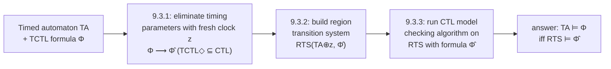
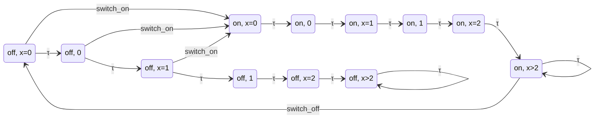

[[book-guidelines|↩ Back to guidelines]]

# Timed CTL and TCTL Model Checking

## Why CTL isn't enough

A [[Computation-Tree-Logic|CTL]] formula like $\forall\Box(\text{approach} \rightarrow \forall\Diamond \text{gate-down})$ says a gate *eventually* closes after a train approaches. It says nothing about *how fast*. For a railroad crossing, "eventually" is worthless — you need "within 2 minutes." CTL's path quantifiers range over a discrete transition system where "one step" has no duration; there's no slot in the logic for a real-numbered bound. To state and check quantitative timing requirements you need two things: a system model with an actual notion of elapsed time, and a logic whose modalities can carry a time budget. Chapter 9 builds both. Section 9.1 (assumed background here) gives you **timed automata**: program graphs extended with real-valued **clocks** that measure elapsed time, **guards** that gate discrete transitions on clock values, per-location **invariants** that force progress, and a transition-system semantics $TS(TA)$ built from alternating **discrete transitions** (instantaneous, guarded, may reset clocks) and **delay transitions** $\ell,\eta \xrightarrow{d} \ell,\eta{+}d$ (time elapses, all clocks advance uniformly). A path is **time-divergent** if it lets time grow without bound; it's **zeno** if it packs infinitely many actions into a bounded amount of time (physically unrealizable, and something a well-formed timed automaton should exclude).

Sections 9.2 and 9.3 are what this article covers: the logic **TCTL** built on top of that model, and the technique — the **region construction** — that makes checking it decidable at all, despite $TS(TA)$ having uncountably many states.

## TCTL: CTL with a stopwatch on `until`

### What breaks without a timed `until`

Suppose you try to bolt real time onto CTL by just adding [[Real-Time-Systems-and-Timed-Automata#Clock constraints|clock constraints]] as atomic propositions — you can already say $\exists\Diamond(x \geq 3)$ using $x$ as an ordinary proposition once it's in scope. That gets you *some* timing statements, but not the one you actually want most often: "$b$ happens somewhere in the window $(1,2]$, and up until then only $a$ (or the target itself) holds." Plain `until` has no notion of *when*; it only orders events. You need the interval attached to the operator that already talks about ordering, not smuggled in as a side proposition. That's exactly what TCTL's timed until does.

### Syntax

Timed CTL formulae are, like CTL, split into **state formulae** $\Phi$ and **path formulae** $\varphi$:

$$
\Phi ::= \text{true} \mid a \mid g \mid \Phi \land \Phi \mid \neg\Phi \mid \exists\varphi \mid \forall\varphi
$$
$$
\varphi ::= \Phi \; U^J \; \Phi
$$

where $a \in AP$ is an atomic proposition, $g$ is an atomic clock constraint (an element of $ACC(C)$, e.g. $x \le 3$), and $J \subseteq \mathbb{R}_{\geq 0}$ is an interval with natural-number bounds — $[n,m]$, $(n,m]$, $[n,m)$, or $(n,m)$, with $m = \infty$ allowed for right-open intervals. Two structural facts distinguish this grammar from CTL's:

1. **Clock constraints are first-class atoms.** $g$ sits alongside $a$ as something a state formula can be built from directly — this is how a timed automaton's clock values enter the logic at all.
2. **There is no next-step operator $\bigcirc$.** Time is continuous (dense: between any two reals there's a third), so there is no "next instant" to point at. Removing $\bigcirc$ isn't a stylistic choice, it's forced by the semantic domain.

The derived timed modalities read the way you'd hope:

$$
\Diamond^J \Phi \stackrel{\text{def}}{=} \text{true } U^J\, \Phi, \qquad
\exists\Box^J \Phi \stackrel{\text{def}}{=} \neg\forall\Diamond^J \neg\Phi, \qquad
\forall\Box^J \Phi \stackrel{\text{def}}{=} \neg\exists\Diamond^J \neg\Phi.
$$

Shorthand intervals are used freely: $\Diamond^{\leq 2}$ means $\Diamond^{[0,2]}$, $\Box^{>8}$ means $\Box^{(8,\infty)}$. And for the untimed interval $J=[0,\infty)$, the timing requirement is vacuous — $\Phi\,U^{[0,\infty)}\,\Psi$, $\Diamond\Phi$, and $\Box\Phi$ collapse back to the ordinary CTL operators. This is the seam the whole model-checking algorithm in 9.3 will exploit: a TCTL formula with *no* nontrivial intervals is secretly just CTL over an enriched proposition set.

Two examples from the book, preserved in the book's own notation, show what the logic buys you. For the railroad crossing (with locations `near`, `far`, `in` of the automaton `Train`, and `up`/`down` of `Gate`):

$$
\forall\bigl((\text{near} \land (y{=}0)) \rightarrow \forall\Box^{\leq 2}\,\neg\text{in}\bigr)
$$

says the train needs at least two minutes to reach the crossing after signalling its approach (clock $y$ marks the signal instant), and

$$
\forall\bigl(\text{far} \rightarrow \forall\Diamond^{\leq 1}\,\forall\Box^{\leq 1}\,\text{up}\bigr)
$$

says that once the train is far away, within one minute the gate is up, and stays up for at least one more minute. Neither statement has any CTL rendering — there's no proposition in plain CTL that can encode "within 1 minute."

### Semantics: quantifying over time-divergent paths only

Here's the subtlety that makes TCTL genuinely different from "CTL plus clock atoms," and it echoes something you may already have seen in [[Fairness]]: **path quantifiers range only over time-divergent paths.**

$$
s \models \exists\varphi \quad\text{iff}\quad \pi \models \varphi \text{ for some } \pi \in \mathit{Paths}^{div}(s)
\qquad
s \models \forall\varphi \quad\text{iff}\quad \pi \models \varphi \text{ for all } \pi \in \mathit{Paths}^{div}(s)
$$

Time-*convergent* paths — ones where infinitely many delays sum to a finite total, so the path "freezes" at a finite time horizon — are simply invisible to $\exists$ and $\forall$. This is structurally identical to fair-CTL's decision (Ch. 6.5) to quantify only over fair paths: in both cases, a class of "physically unrealistic" paths is carved out of the semantics rather than ruled out syntactically. The payoff mirrors fair CTL too: a state's set of time-divergent paths is exactly the set of paths the formula $\exists\text{true}$ is true on, so **timelock-freedom** — every state has *some* way to let time diverge — is expressible as a TCTL tautology check: $TA$ is timelock-free iff every reachable state satisfies $\exists\text{true}$.

The satisfaction relation for the timed until is where the real content is. For a time-divergent path $\pi \in s_0 \xrightarrow{d_0} s_1 \xrightarrow{d_1} \cdots$:

$$
\pi \models \Phi\,U^J\,\Psi \quad\text{iff}\quad \exists i{\geq}0.\; s_i{+}d \models \Psi \text{ for some } d\in[0,d_i] \text{ with } \Bigl(\sum_{k<i} d_k\Bigr) + d \in J,
$$
$$
\text{and } \forall j{\leq}i.\; s_j{+}d' \models \Phi \lor \Psi \text{ for any } d' \in [0,d_j] \text{ with } \Bigl(\sum_{k<j} d_k\Bigr)+d' \leq \Bigl(\sum_{k<i} d_k\Bigr)+d.
$$

Read past the indices: a $\Psi$-state is reached at some time point *inside* $J$, and **every state visited strictly before that point satisfies $\Phi \lor \Psi$**, not just $\Phi$.

**Why $\Phi \lor \Psi$ and not $\Phi$ alone?** In LTL/CTL, $\Phi\,U\,\Psi$ is equivalent to $(\Phi \lor \Psi)\,U\,\Psi$, so the distinction is moot there. In TCTL it isn't, because the *time* at which $\Psi$ first becomes true and the time at which $\Psi$ is *required* to be true (i.e. falls inside $J$) can differ. The book's own example (Fig. 9.16): a timed automaton with $\mathit{Inv}(\ell)= x{<}1$ so location $\ell$ can't be left before $3$ time units pass; label $\ell$ with $a$, $\ell'$ with $b$. Consider $\forall(a\,U^{>1}\,b)$ and the path

$$
\pi = \langle \ell,0\rangle \xrightarrow{0.5} \langle \ell,0.5\rangle \xrightarrow{2.5} \langle \ell',0\rangle \to \cdots
$$

The automaton reaches $\ell'$ (where $b$ holds) at global time $0.5$ — *before* the window $(1,\infty)$ opens — but keeps delaying inside $\ell'$ until past time $1$. So $b$ becomes witnessable inside $J$ only because the path *stayed* somewhere $b$ already held. A semantics requiring plain $a$ on the prefix would reject this path (state $\langle\ell',0.3\rangle$ satisfies $b$, not $a$), even though intuitively "the target was reached in time." Requiring $\Phi \lor \Psi$ instead of $\Phi$ is precisely what accommodates dwelling inside the target region while waiting for the clock to catch up to the required interval.

From this, the timed always/eventually read off directly:

$$
\pi \models \Diamond^J \Phi \iff \exists i.\, s_i{+}d \models \Phi \text{ for some } d \text{ with time-of-}(s_i{+}d) \in J
\qquad
\pi \models \Box^J \Phi \iff \forall i.\, s_i{+}d \models \Phi \text{ for all } d \text{ with time-of-}(s_i{+}d) \in J.
$$

Satisfaction lifts to the automaton the usual way: $TA \models \Phi$ iff every initial state $\langle \ell_0, \eta_0\rangle$ (all clocks at $0$) satisfies $\Phi$.

**A trap worth naming explicitly** (Remark 9.34 in the book): a TCTL formula with only $[0,\infty)$ intervals *looks* like a CTL formula, but $TS(TA) \models_{\text{TCTL}} \Phi$ and $TS(TA) \models_{\text{CTL}} \Phi$ can disagree, because $\models_{\text{CTL}}$ quantifies over *all* paths (time-convergent ones included) while $\models_{\text{TCTL}}$ silently drops them. A light switch that's never switched off has a time-convergent path staying in `on` forever without violating any CTL always-formula about eventually going `off` — but it can't undermine the TCTL version, since that path isn't in the game.

## TCTL model checking: reduce to CTL on a finite quotient

$TA \models \Phi$ unfolds to $TS(TA) \models \Phi$, and $TS(TA)$ has uncountably many states (one per real-valued clock tuple) and uncountable branching (a delay transition exists for every $d \in \mathbb{R}_{\geq0}$). A textbook graph search is not an option. The strategy, in one line:

$$
TA \models_{\text{TCTL}} \Phi \quad\text{iff}\quad \underbrace{RTS(TA,\Phi)}_{\text{finite}} \models_{\text{CTL}} \bar\Phi
$$

Build a **finite** transition system $RTS(TA,\Phi)$ — the **region transition system** — together with a CTL formula $\bar\Phi$ derived from $\Phi$, such that checking $\bar\Phi$ on $RTS(TA,\Phi)$ with an ordinary CTL model checker answers the original question. Two separate problems have to be solved to make this work, matching the book's two subsections:

1. **Get rid of the timing intervals in $\Phi$** so what's left is checkable by plain CTL machinery (§9.3.1).
2. **Get rid of the uncountable state space of $TS(TA)$** by collapsing it to a finite bisimulation quotient (§9.3.2), then run the CTL algorithm on that quotient (§9.3.3).



### 9.3.1 — Eliminating timing parameters

The idea: introduce one **fresh clock** $z$ (unused elsewhere) whose only job is to measure elapsed time against the interval $J$ of whatever until-subformula is currently being checked. Reset $z$ to $0$ right when you start "asking" about $\Phi\,U^J\,\Psi$, and then $J$ becomes a statement about $z$'s current value — an ordinary atomic clock constraint.

**Theorem 9.37 (Elimination of Timing Parameters).** For timed automaton $TA$ over clocks $C$, fresh clock $z \notin C$, and $TA{\oplus}z$ the automaton with clock set $C \cup \{z\}$:

$$
s \models_{\text{TCTL}} \exists(\Phi\,U^J\,\Psi) \iff s\{z{:=}0\} \models_{\text{TCTL}} \exists\bigl((\Phi\lor\Psi)\,U\,((z\in J)\land\Psi)\bigr)
$$

(and symmetrically for $\forall$), where $s\{z{:=}0\}$ is $s$'s state in $TS(TA{\oplus}z)$ with $z$ initialized to $0$. Since $z$ is never reset again while measuring this subformula, its value at any later point along the path *is* the elapsed time since the reset — so "$z \in J$" is exactly the timing side-condition the timed until needed, now expressed as a plain clock constraint rather than an interval annotation on the modality.

Do this for every until-subformula of $\Phi$ (each can share the same clock $z$, reused sequentially — the bottom-up algorithm in 9.3.3 makes this precise) and you get $\bar\Phi$: a formula with **no** interval other than $[0,\infty)$. Call the class of such formulae $\mathrm{TCTL}^\Diamond$. Since clock constraints can be treated as atomic propositions, $\mathrm{TCTL}^\Diamond \subseteq \mathrm{CTL}$ — literally, syntactically. For instance $\exists\Diamond^{\leq2}\Phi$ becomes $\exists\Diamond((z{\leq}2)\land\Phi)$, and $\forall\Box^{\leq2}\Phi = \neg\exists\Diamond^{\leq2}\neg\Phi$ becomes $\exists\Box((z{\leq}2)\rightarrow\Phi)$ (Example 9.38). This is the whole point of §9.3.1: it turns "how do I model-check a *timed* modality" into "how do I model-check CTL," deferring all remaining difficulty to the state space.

### 9.3.2 — Region transition systems: quotienting by clock equivalence

$\bar\Phi$ is CTL-shaped, but it's still being asked of $TS(TA{\oplus}z)$, which is still infinite. The fix is a **finite bisimulation quotient**. You want an equivalence $\sim_c$ on clock valuations such that:

- **(A)** equivalent valuations satisfy the same clock constraints occurring in $TA$ and $\Phi$;
- **(B)** equivalent states have "equivalent" time-divergent paths (so satisfaction of *path* formulae transfers too, not just atomic ones);
- **(C)** there are only finitely many equivalence classes.

**Building the equivalence, one constraint at a time.** Let $c_x$ be the largest constant any clock $x$ is ever compared against (in $TA$ or $\Phi$).

- *Observation 1.* An atomic constraint $g$ is $x{<}c$ or $x{\leq}c$ for $c\in\mathbb{N}$. Whether $\eta \models g$ depends only on $\lfloor\eta(x)\rfloor$ and whether $\mathrm{frac}(\eta(x))=0$ — never on the fractional part's exact value. So a first candidate equivalence just matches integer parts and "is-it-exactly-an-integer." This is already infinite-to-finite in principle but still too coarse: it says nothing about how two clocks' fractional parts relate to each other, which matters once they need to synchronize (e.g. both hitting an integer at the same delay).
- *Observation 2.* Once a clock's value exceeds its own maximal constant $c_x$, its exact value never matters again — only "it's past $c_x$" does. This is what makes the quotient finite at all: clocks are compared against a *bounded* set of constants, so beyond that bound everything collapses to one **unbounded region**.
- *Observation 3.* Two valuations must also agree on the **relative order of fractional parts** across clocks — this is what's needed for property (B): whether $x$ or $y$ will reach its next integer value first determines which discrete transitions become enabled *next* as time passes, so it has to be preserved by the equivalence for successor-region computations to be well defined.

Putting the three together:

**Definition 9.42 (Clock Equivalence $\sim_c$).** $\eta \sim_c \eta'$ iff either

- for every $x\in C$, $\eta(x) > c_x$ and $\eta'(x) > c_x$ (both "past the bound," on every clock), **or**
- for all $x,y \in C$ with $\eta(x),\eta'(x)\leq c_x$ and $\eta(y),\eta'(y)\leq c_y$:
  - $\lfloor\eta(x)\rfloor = \lfloor\eta'(x)\rfloor$ and $\mathrm{frac}(\eta(x)){=}0 \iff \mathrm{frac}(\eta'(x)){=}0$,
  - $\mathrm{frac}(\eta(x)) \leq \mathrm{frac}(\eta(y)) \iff \mathrm{frac}(\eta'(x)) \leq \mathrm{frac}(\eta'(y))$.

An equivalence class of $\sim_c$ is a **clock region**; lifting to states ($\langle\ell,\eta\rangle \sim_c \langle\ell',\eta'\rangle$ iff $\ell=\ell'$ and $\eta\sim_c\eta'$) gives **state regions**, written $[s]$ or $[\eta]$.

**Theorem 9.46 (Number of Regions).** The count is bounded both ways:

$$
|C|! \cdot \prod_{x\in C} c_x \;\;\leq\;\; \bigl|\mathit{Eval}(C)/\!\sim_c\bigr| \;\;\leq\;\; |C|! \cdot 2^{|C|-1} \cdot \prod_{x\in C}(2c_x+2)
$$

The proof represents each region canonically as a triple $\langle J, \wp, D\rangle$: an interval $J_x$ per clock (which of $[0,0], (0,1), [1,1], \dots, [c_x,c_x], (c_x,\infty)$ it falls in), a permutation $\wp$ ordering the clocks currently in *open* intervals by their fractional parts, and a set $D$ flagging which consecutive clocks in that ordering happen to share a fractional part exactly. That's a genuinely finite object — but it's **exponential in the number of clocks** (a factorial-times-exponential blowup: for $|C|{=}n$ clocks all bounded by $2$, the region count is already at least $n!\cdot 2^n$ — $8$ for $n{=}2$, $3840$ or more for $n{=}5$). This exponential is the price of decidability, and it's exactly why real tools (UPPAAL, Kronos) don't materialize the region graph directly — more on that below.

**Why does this equivalence actually work as a bisimulation, not just a syntactic convenience?**

**Lemma 9.48.** If $\eta \sim_c \eta'$, then $\eta \models g \iff \eta' \models g$ for every clock constraint $g$ occurring in $TA$ or $\Phi$ — this is property (A), and it's immediate from how the equivalence was built (integer parts and fractional-part order are exactly what atomic constraints can distinguish).

**Theorem 9.50 (Clock Equivalence is a Bisimulation).** Treating clock constraints as atomic propositions, $\sim_c$ is a bisimulation over $AP \cup ACC(TA) \cup ACC(\Phi)$: any discrete or delay transition from $\langle\ell,\eta_1\rangle$ can be matched by an equally-labeled transition from any $\langle\ell,\eta_2\rangle$ with $\eta_1\sim_c\eta_2$, landing in an equivalent successor. The discrete case is routine (guards and resets respect $\sim_c$ by Lemma 9.48). The delay case is where the "order the fractional parts" clause earns its keep (Remark 9.51 in the book): without it, two valuations agreeing on integer parts could still diverge on *which* clock crosses its next integer boundary first, which would let one delay transition be matched while a *different* one from the other side lands in a genuinely different region — breaking the back-and-forth condition bisimulation requires. This is called a **time-abstract bisimulation**: it forgets *how much* time elapsed on a delay transition and remembers only that time passed and where it landed.

**The quotient itself.** With $\sim_c$ in hand, define the **region transition system**

$$
RTS(TA,\Phi) = (S^r, Act\cup\{\tau\}, \rightarrow^r, I^r, AP^r, L^r), \qquad S^r = S/\!\sim_c = \{[s] \mid s\in S\},
$$

with two kinds of transitions on regions:

$$
\langle\ell,r\rangle \xrightarrow{\alpha}^r \langle\ell', \mathrm{reset}\,D\,\mathrm{in}\,r\rangle \quad\text{if } \ell\xrightarrow{g:\alpha,D}\ell' \wedge r\models g \wedge (\mathrm{reset}\,D\,\mathrm{in}\,r)\models Inv(\ell'),
$$
$$
\langle\ell,r\rangle \xrightarrow{\tau}^r \langle\ell,\mathrm{succ}(r)\rangle \quad\text{if } r\models Inv(\ell) \wedge \mathrm{succ}(r)\models Inv(\ell),
$$

where $\mathrm{succ}(r)$ is the unique region reached by letting time pass minimally out of $r$ (unbounded regions loop to themselves: $\mathrm{succ}(r_\infty)=r_\infty$). Discrete transitions become discrete edges labeled by the original action; every delay transition — regardless of how long the delay is — becomes a single $\tau$-labeled step to the *successor region*, because within a fixed region no clock crosses an integer boundary, so nothing observable changes; only crossing into the successor region is a distinguishable event. This is exactly why $\mathrm{succ}$ is well defined and unique (time only moves forward through regions in one order) and why a single unbounded delay in $TS(TA)$ can correspond to a *chain* of $\tau$-steps through several regions in $RTS(TA,\Phi)$ (e.g. a $2.578$ time-unit delay through a single clock $x$ with $c_x{=}2$ decomposes as $\{0\}\to(0,1)\to\{1\}\to(1,2)\to\{2\}\to(2,\infty)$, six $\tau$-steps for one delay).

The light-switch example makes the whole picture concrete. For a switch with clock $x$, $c_x{=}2$, six clock regions per location ($\{0\},(0,1),\{1\},(1,2),\{2\},(2,\infty)$), so twelve state regions total:



Every infinite time-divergent path in the real automaton eventually reaches the unbounded region and cycles on its $\tau$-self-loop there — which is precisely how Lemma 9.57 in the book characterizes time-divergence at the region level: a path is time-convergent iff it eventually gets stuck forever in one *bounded* region (never advancing to `succ`), and time-divergent iff it keeps advancing through regions (in particular, if it settles anywhere, it settles into $r_\infty$, the only region allowed to self-loop meaningfully forever). That gives a second concrete payoff beyond model checking a fixed formula: **Theorem 9.62**, timelock-freedom of a non-zeno $TA$ reduces to checking that $RTS(TA)$ has no reachable terminal state — an ordinary reachability check on a finite graph.

Two clocks make the geometry vivid — this is what the book's own region diagrams (Figs. 9.20–9.22) look like for $c_x{=}2, c_y{=}1$: corner points where both clocks are exact integers, open line segments where one clock is exact and the other strictly between integers, and open regions (triangles/squares, split further by which fractional part is larger) where both are strictly between integers.

<svg viewBox="0 0 340 220" xmlns="http://www.w3.org/2000/svg" font-family="sans-serif" font-size="11">
  <!-- axes -->
  <line x1="40" y1="180" x2="320" y2="180" stroke="#8a8a8a" stroke-width="1.5"/>
  <line x1="40" y1="180" x2="40" y2="20" stroke="#8a8a8a" stroke-width="1.5"/>
  <text x="325" y="184" fill="#8a8a8a">x</text>
  <text x="24" y="24" fill="#8a8a8a">y</text>
  <!-- grid lines at integer x = 0,1,2 (unbounded past 2) -->
  <line x1="100" y1="20" x2="100" y2="180" stroke="#5b8fd6" stroke-width="1" stroke-dasharray="3,3"/>
  <line x1="220" y1="20" x2="220" y2="180" stroke="#5b8fd6" stroke-width="1" stroke-dasharray="3,3"/>
  <!-- grid line at integer y = 1 (unbounded past 1) -->
  <line x1="40" y1="100" x2="320" y2="100" stroke="#d67a5b" stroke-width="1" stroke-dasharray="3,3"/>
  <!-- diagonal splitting fractional-part ordering within each unit square -->
  <line x1="40" y1="180" x2="100" y2="100" stroke="#8a8a8a" stroke-width="1"/>
  <line x1="100" y1="180" x2="160" y2="100" stroke="#8a8a8a" stroke-width="1"/>
  <line x1="100" y1="100" x2="160" y2="20" stroke="#8a8a8a" stroke-width="1" opacity="0.35"/>
  <!-- labels -->
  <circle cx="40" cy="180" r="2.5" fill="#c25b5b"/>
  <circle cx="100" cy="180" r="2.5" fill="#c25b5b"/>
  <circle cx="220" cy="180" r="2.5" fill="#c25b5b"/>
  <circle cx="40" cy="100" r="2.5" fill="#c25b5b"/>
  <circle cx="100" cy="100" r="2.5" fill="#c25b5b"/>
  <circle cx="220" cy="100" r="2.5" fill="#c25b5b"/>
  <text x="6" y="196" fill="#6f6f6f">0</text>
  <text x="96" y="196" fill="#6f6f6f">1</text>
  <text x="216" y="196" fill="#6f6f6f">2 = c_x</text>
  <text x="6" y="104" fill="#6f6f6f">1 = c_y</text>
  <text x="50" y="150" fill="#6f6f6f">frac(x)&gt;frac(y)</text>
  <text x="52" y="130" fill="#6f6f6f" opacity="0.8">open triangle</text>
  <text x="108" y="150" fill="#6f6f6f">frac(x)&lt;frac(y)</text>
  <text x="230" y="150" fill="#6f6f6f">unbounded in x</text>
  <text x="60" y="70" fill="#6f6f6f">both unbounded (r∞)</text>
</svg>

*(Sketch of the two-clock region pattern for $c_x{=}2,\,c_y{=}1$: corner points where both clocks hit an integer, open segments along the grid lines, and the diagonal splitting each unit square into the two open triangles where the fractional parts are ordered one way or the other — the third clause of Definition 9.42 at work.)*

### 9.3.3 — Running CTL on the region graph, and the complexity payoff

**Theorem 9.61 (Correctness).** For non-zeno $TA$ and $\mathrm{TCTL}^\Diamond$ formula $\bar\Phi$: $TA \models_{\text{TCTL}} \bar\Phi \iff RTS(TA,\bar\Phi) \models_{\text{CTL}} \bar\Phi$. The proof is structural induction mirroring the [[CTL-Model-Checking|CTL model-checking]] recursion itself, using Lemma 9.57's characterization of time-divergence-at-the-region-level to show that a time-divergent path in $TS(TA)$ and its region-level shadow in $RTS(TA,\bar\Phi)$ satisfy the same until-subformulae.

The full algorithm (Algorithm 44 in the book) is a **recursive descent over the parse tree of $\Phi$**, exactly like ordinary CTL model checking — the only twist is bookkeeping for the shared fresh clock $z$:

- Build $R = RTS(TA{\oplus}z, \Phi)$ once.
- For each subformula $\Psi$ of $\Phi$, in increasing size order, compute $\mathrm{Sat}_R(\Psi)$:
  - Boolean cases are the obvious set operations on already-computed satisfaction sets.
  - $\exists(\Psi_1\,U^J\,\Psi_2)$: run the **plain CTL** until-algorithm on $R$ for the formula $\exists\bigl((a_{\Psi_1}\lor a_{\Psi_2})\,U\,((z{\in}J)\land a_{\Psi_2})\bigr)$, where $a_{\Psi_i}$ are the fresh atomic propositions already assigned to $\Psi_1,\Psi_2$'s satisfaction sets.
  - Then re-label: a state region $[s]$ gets proposition $a_\Psi$ exactly when $[s\{z{:=}0\}] \models \Psi$-with-$z$-reset — this is the operational meaning of "reset $z$ right before checking this subformula."
- $TA \models \Phi$ iff every initial region is labeled $a_\Phi$.

**Theorem 9.68 (Time Complexity).** $O\bigl((N+K)\cdot|\Phi|\bigr)$, where $N,K$ are the number of states/transitions of the region transition system — linear in formula size and in region-graph size, precisely mirroring plain CTL's $O(|TS|\cdot|\Phi|)$ bound. But $N$ and $K$ are themselves exponential in the number of clocks and their maximal constants (Theorem 9.46), so the **overall** time complexity of TCTL model checking is exponential in the number of clocks even though it is linear once the region graph is fixed. This is the same shape of result the book gave for LTL in Chapter 5 — "linear in the object you built, but the object you built can be exponentially large in the input" — just with clocks playing the role formula-size played there.

**Theorem 9.69.** TCTL model checking is **PSPACE-complete** (proof outsourced to Alur–Courcoubetis–Dill in the bibliographic notes; not reproduced in the chapter). It sits at the same complexity class as plain LTL model checking and CTL$^*$ model checking — a reminder that "decidable" and "tractable in practice" are different promises, and that the region construction buys you the former, not automatically the latter.

## What a real tool does instead

The bibliographic notes are worth pulling forward here because they head off a natural misreading: nobody actually builds $RTS(TA,\Phi)$ explicitly in a real model checker. Its exponential blow-up in the number of clocks (Theorem 9.46) makes it a proof device, not an implementation strategy. Production tools like **UPPAAL** and **Kronos** instead represent *unions* of regions — called **zones** — symbolically as conjunctions of difference constraints $x-y \prec c$, stored in a **difference bound matrix (DBM)**, and explore the zone graph on the fly rather than materializing all individual regions up front. The region equivalence is still the *theory* that justifies why a finite exploration terminates and is sound; DBM-based zones are the *engineering* answer to making that finite exploration small enough to run.

## Grounding the construction

**Rust — canonical region representation as a hashable key.** The region-counting proof (Theorem 9.46) already hands you the right data structure: a region is uniquely determined by (a) which bracketed interval each clock's value falls in, and (b) a permutation-plus-tie-flags ordering the clocks currently in open intervals by fractional part. That's naturally a `struct` you can derive `Eq`/`Hash` for and drop straight into a `HashMap` as the state type of a backward-fixpoint CTL solver — the same kind of solver you'd write for the ordinary [[CTL-Model-Checking|CTL Sat-set algorithm]], just running over regions instead of raw states:

```rust
#[derive(Clone, PartialEq, Eq, Hash, Debug)]
enum ClockInterval {
    Exact(u32),           // η(x) = c
    Open(u32),            // c < η(x) < c+1
    Unbounded,            // η(x) > c_x
}

#[derive(Clone, PartialEq, Eq, Hash, Debug)]
struct ClockRegion {
    intervals: Vec<ClockInterval>,   // one per clock, indexed consistently
    frac_order: Vec<usize>,          // permutation of open-interval clock indices,
                                      // ordered by ascending fractional part
    ties: Vec<bool>,                 // ties[i] = frac(clock at frac_order[i])
                                      //           == frac(clock at frac_order[i+1])
}

impl ClockRegion {
    /// Definition 9.42, encoded directly: classify a concrete valuation
    /// into its equivalence class under ~_c, given the max constants c_x.
    fn of(valuation: &[f64], max_consts: &[u32]) -> ClockRegion {
        let intervals = valuation.iter().zip(max_consts).map(|(&v, &c)| {
            if v > c as f64 { ClockInterval::Unbounded }
            else if v.fract() == 0.0 { ClockInterval::Exact(v as u32) }
            else { ClockInterval::Open(v.floor() as u32) }
        }).collect();

        let mut open: Vec<usize> = (0..valuation.len())
            .filter(|&i| valuation[i] <= max_consts[i] as f64 && valuation[i].fract() != 0.0)
            .collect();
        open.sort_by(|&a, &b| valuation[a].fract().partial_cmp(&valuation[b].fract()).unwrap());

        let ties = open.windows(2)
            .map(|w| (valuation[w[0]].fract() - valuation[w[1]].fract()).abs() < 1e-9)
            .collect();

        ClockRegion { intervals, frac_order: open, ties }
    }

    /// Definition 9.54: the unique delay-successor region (τ-transition target).
    fn succ(&self) -> ClockRegion { /* advance the "youngest" open clock past its boundary */ todo!() }
}
```

Two things this makes concrete that are easy to lose in the algebra: `ClockRegion` deriving `Eq`/`Hash` *is* the clock equivalence relation, reified as a Rust value you can put in a set; and `succ` being a total function of one argument (not a relation) *is* Theorem 9.50's delay-transition case — time-abstract bisimulation guarantees there's exactly one successor region to compute, never a branch.

**Lean — the region relation as a `Setoid`, and $RTS$ as a `Quotient`.** Lean's kernel machinery for quotient types is a strikingly literal match for what §9.3.2 is doing informally. Clock equivalence is an equivalence relation by construction (Definition 9.42 is visibly reflexive/symmetric/transitive), so it's a `Setoid`; the region transition system's state space $S/\!\sim_c$ is then *definitionally* a `Quotient` of $TS(TA)$'s state space:

```lean
structure ClockEval (C : Type) := (val : C → ℝ)

def clockEquiv (maxConst : C → ℕ) : ClockEval C → ClockEval C → Prop :=
  fun η η' => sorry  -- Definition 9.42's three-part condition

instance (maxConst : C → ℕ) : Setoid (ClockEval C) :=
  ⟨clockEquiv maxConst, sorry⟩  -- prove refl/symm/trans once, from the definition

def ClockRegion (C : Type) (maxConst : C → ℕ) := Quotient (inferInstanceAs (Setoid (ClockEval C)))
```

Once `ClockRegion` is a `Quotient`, Lean's `Quotient.lift` is exactly the tool needed to prove Lemma 9.48: a clock-constraint predicate `satisfies : ClockEval C → Prop` that respects `clockEquiv` (which the lemma establishes) automatically descends to a well-defined predicate on `ClockRegion C`, for free, via `Quotient.lift`. That's the same mechanism Lean's own elaborator uses whenever a definition needs to be independent of a chosen representative — the region construction is, underneath the timed-automata dressing, an ordinary quotient-respects-the-relation argument.

**Python — the ordering check, for intuition.** A five-line sketch of just the "third clause" of Definition 9.42, since it's the one clause that's easy to get wrong (and Remark 9.51 exists precisely because it's easy to drop):

```python
def frac_order_matches(v1, v2, maxc):
    open_clocks = lambda v: [i for i, x in enumerate(v) if x <= maxc[i] and x % 1 != 0]
    key = lambda v: sorted(open_clocks(v), key=lambda i: v[i] % 1)
    return key(v1) == key(v2)  # same relative fractional-part ordering
```

## Where this leads

Structurally, this chapter is a synthesis of machinery from three earlier chapters, applied to a new domain: the recursive-descent *algorithm* is Chapter 6's CTL model checking verbatim; the *justification* that a quotient preserves the logic is Chapter 7's bisimulation-preserves-CTL$^*$ theorem, specialized to a bisimulation built from clock constraints instead of atomic propositions; and the *complexity result* — decidable but exponential in a size parameter, ultimately PSPACE-complete — echoes the LTL story from Chapter 5 (there, exponential in formula size via the automaton construction; here, exponential in the number of clocks via the region construction). Downstream, the chapter's own summary is honest that this is a foundation, not an endpoint: real tools trade the region graph for the DBM/zone representation sketched above, and probabilistic extensions of timed models (continuous-time Markov chains) build on the discrete/delay-transition split introduced here.

For the standing project: this topic sits squarely in the **Static Analysis & Abstract Interpretation** focus area, and it's worth being explicit about *why*, since the connection is more than superficial. The region equivalence is, in every load-bearing sense, an **abstract domain**: it takes an infinite (here, uncountable) concrete state space and maps it to a finite, *sound* abstraction — sound because the abstraction is proven to be a bisimulation, i.e. it never merges states that disagree on any property expressible in the logic being checked. That's the same shape of guarantee a Galois connection gives an abstract interpreter, and the DBM/zone representation used by real timed-automata tools is a direct cousin of the interval/octagon/polyhedra domains used in numeric abstract interpretation — both represent an infinite set of concrete valuations via a small set of difference constraints. If the CSP kernel in your compiler project ever needs to reason about time-bounded or counter-bounded reachability (a natural read of "domain/lattice propagation... handling integer... equations"), the region-then-zone refinement story here is a fully worked-out precedent for how to go from "provably finite but too big" to "practically small," which is exactly the tension abstract-domain design always faces.
