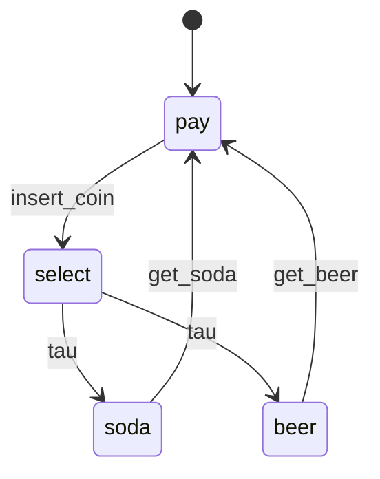

[[book-guidelines|↩ Back to guidelines]]

# Transition Systems as System Models

## Why you need a model before you can check anything

Model checking's whole pitch is "systematically explore every reachable state of the system and see if the property holds." But you cannot explore the reachable states of a physical circuit or a running C program directly — there's no API for "give me all the states of this soldered board." You need a *mathematical* object that stands in for the system: something with a well-defined notion of state, a well-defined notion of how state changes, and enough label information to talk about properties at all.

That's what a transition system is, and almost nothing else in the book works without it: LTL and CTL formulas are evaluated over transition systems, safety/liveness properties are defined as sets of behaviors of a transition system, and every later modeling device (program graphs, channel systems, timed automata, Markov chains) is either a transition system in disguise or a machine for producing one. So this section is deliberately unglamorous — it's the substrate.

What breaks without a formal definition: if "state" and "transition" stay informal, two people modeling the same traffic light get two different-looking diagrams and there's no way to say whether they're both faithful models, or whether a claimed property ("the light is never red and green simultaneously") is actually a *statement about the transition system* rather than a vague description of the picture. A precise transition-system definition turns "check this property" into a decidable graph-search problem instead of an argument about diagrams.

## Definition 2.1: the transition system itself

The book's formal definition (Definition 2.1, p. 21):

A transition system $TS$ is a tuple
$$TS = (S, \mathit{Act}, \rightarrow, I, AP, L)$$
where:

- $S$ is a set of **states**,
- $\mathit{Act}$ is a set of **actions**,
- $\rightarrow \;\subseteq\; S \times \mathit{Act} \times S$ is a **transition relation**,
- $I \subseteq S$ is a set of **initial states**,
- $AP$ is a set of **atomic propositions**, and
- $L : S \to 2^{AP}$ is a **labeling function**.

$TS$ is **finite** if $S$, $\mathit{Act}$, and $AP$ are all finite.

Notation: instead of $(s, \alpha, s') \in {\rightarrow}$ the book writes $s \xrightarrow{\alpha} s'$.

A few things worth naming explicitly, because the book leans on them without re-explaining each time:

- **Why actions at all?** $\mathit{Act}$ exists specifically to name *how* a transition happened, which becomes essential once you compose systems in parallel (Section 2.2) — two components synchronize by taking transitions with the same action label. Within a single, sequential system, action names are often irrelevant, and the book freely collapses them to a single symbol $\tau$ ("something happened, don't care what") when they don't matter.
- **Why atomic propositions and labels, separate from states?** $AP$ and $L$ exist so that properties can be stated *about* states without caring how those states are represented internally. Given a propositional logic formula $\Phi$ over $AP$, a state $s$ satisfies it via
  $$s \models \Phi \iff L(s) \models \Phi,$$
  i.e. you evaluate $\Phi$ against the *set* of propositions $L(s)$ true at $s$, treating $L(s)$ as an assignment. This indirection is what lets CTL/LTL formulas later be evaluated over any transition system uniformly, regardless of what a "state" concretely is (register values, program counter + variables, whatever).
- **The transition relation is genuinely a relation, not a function.** $\rightarrow \subseteq S \times \mathit{Act} \times S$ permits a state to have zero, one, or many outgoing transitions on the same or different actions. This is not a modeling defect to be patched — it's load-bearing.

### Nondeterminism is the point, not a wrinkle

The book is emphatic about this (p. 22–23): when a state has more than one outgoing transition, "the next transition is chosen in a purely nondeterministic fashion" — no probability, no preference, just an unconstrained choice. This single relational (rather than functional) transition step is what lets one transition system encode:

1. **Interleaving of parallel components** — running $A \parallel B$ means nondeterministically choosing whose turn it is to step next; nondeterminism *is* the interleaving operator's mechanism (previewed here, built out fully in §2.2).
2. **Conflict** — two processes racing for a shared resource is exactly two enabled transitions from the same state.
3. **Abstraction / underspecification** — an early-design model that hasn't committed to an implementation choice yet can leave multiple transitions enabled, each corresponding to a design option not yet resolved.
4. **An unpredictable environment** — a human user, or an unknown scheduler, is modeled as an entity that resolves nondeterministic choices from outside the model.

Rust readers: this is precisely the shape of a nondeterministic finite automaton's transition function, generalized. If you've ever written a regex NFA where `delta: HashMap<(State, Option<char>), HashSet<State>>` returns a *set* of successor states rather than one, you've already built a $\rightarrow$ relation. The type signature difference between an NFA-shaped `HashMap<(S, A), HashSet<S>>` and a DFA-shaped `HashMap<(S, A), S>` is exactly the difference the book will formalize next as "deterministic" vs. general transition systems.

### Worked example: the beverage vending machine

The book's running example (Example 2.2, p. 21) is deliberately small: a vending machine that, after a coin is inserted, nondeterministically dispenses beer or soda.

$$S = \{\mathit{pay}, \mathit{select}, \mathit{soda}, \mathit{beer}\}, \qquad I = \{\mathit{pay}\}$$
$$\mathit{Act} = \{\mathit{insert\_coin}, \mathit{get\_soda}, \mathit{get\_beer}, \tau\}$$



Two choices of $AP$/$L$ for the *same* underlying $(S, \mathit{Act}, \rightarrow, I)$ illustrate that atomic propositions are chosen relative to the property you care about, not baked into the "true" model:

- **State names as propositions**: $L(s) = \{s\}$ for every state — maximally informative, but verbose.
- **Coarser, property-driven propositions**: to check "the machine only delivers a drink after a coin is inserted," it suffices to use $AP = \{\mathit{paid}, \mathit{drink}\}$ with
  $$L(\mathit{pay}) = \varnothing,\quad L(\mathit{soda}) = L(\mathit{beer}) = \{\mathit{paid}, \mathit{drink}\},\quad L(\mathit{select}) = \{\mathit{paid}\}.$$

This is a genuinely useful modeling habit: pick the coarsest labeling that still lets you state the properties under study — a smaller $AP$ means a smaller effective observation and often a much smaller quotient when later chapters build bisimulations and minimizations on top of $L$.

A Rust sketch of the definition, typed so the nondeterminism is visible in the type itself:

```rust
use std::collections::{HashMap, HashSet};
use std::hash::Hash;

struct TransitionSystem<S, A, P> {
    states: HashSet<S>,
    actions: HashSet<A>,
    // multimap: (state, action) -> set of successor states
    transitions: HashMap<(S, A), HashSet<S>>,
    initial: HashSet<S>,
    atomic_props: HashSet<P>,
    label: HashMap<S, HashSet<P>>, // L : S -> 2^AP
}

impl<S: Eq + Hash + Clone, A: Eq + Hash + Clone, P: Eq + Hash + Clone> TransitionSystem<S, A, P> {
    fn post(&self, s: &S, a: &A) -> HashSet<S> {
        self.transitions.get(&(s.clone(), a.clone())).cloned().unwrap_or_default()
    }
    fn is_terminal(&self, s: &S) -> bool {
        self.actions.iter().all(|a| self.post(s, a).is_empty())
    }
}
```

The `HashSet<S>` return type of `post` — rather than `S` or `Option<S>` — is the entire content of "transition systems are nondeterministic." Making it deterministic later is a type-level change (`post: (S, A) -> Option<S>`), not just a semantic constraint.

## Definition 2.3: Post and Pre

Two derived operators the rest of the book uses constantly:

$$\mathit{Post}(s, \alpha) = \{\, s' \in S \mid s \xrightarrow{\alpha} s' \,\}, \qquad \mathit{Post}(s) = \bigcup_{\alpha \in \mathit{Act}} \mathit{Post}(s, \alpha)$$

$$\mathit{Pre}(s, \alpha) = \{\, s' \in S \mid s' \xrightarrow{\alpha} s \,\}, \qquad \mathit{Pre}(s) = \bigcup_{\alpha \in \mathit{Act}} \mathit{Pre}(s, \alpha)$$

and both extend pointwise to sets $C \subseteq S$: $\mathit{Post}(C) = \bigcup_{s \in C}\mathit{Post}(s)$, similarly for $\mathit{Pre}$.

These are not decoration — $\mathit{Post}$ is exactly the successor function a reachability/BFS algorithm calls, and $\mathit{Pre}$ is what a backward analysis (e.g. computing "states that can reach a bad state," central to [[CTL-Model-Checking|CTL model checking]]'s $\mathrm{EU}$/$\mathrm{AU}$ fixpoint computations later in the book) calls. If you've implemented a worklist-based dataflow analysis, `Post` and `Pre` are literally the forward and backward transfer relations you iterate over.

**Definition 2.4 (terminal state):** $s$ is *terminal* iff $\mathit{Post}(s) = \varnothing$ — no outgoing transitions at all. For a sequential program this is ordinary termination. The book flags (p. 24, forward reference to §3.1) that for transition systems modeling *parallel* systems, terminal states are usually a defect to be checked against (deadlock), not a desired outcome — a nice preview of why "no more moves" means something different depending on what you're modeling.

## Determinism in transition systems (Definition 2.5)

Nondeterminism is the general case, but it's useful to name when the *observable* behavior collapses to something deterministic, because two different notions of "observable" give two different determinism criteria:

1. **Action-deterministic**: $|I| \le 1$ and $|\mathit{Post}(s, \alpha)| \le 1$ for every state $s$ and action $\alpha$ — at most one outgoing transition per action label. This is the "observer only sees actions" view.
2. **AP-deterministic**: $|I| \le 1$ and $|\mathit{Post}(s) \cap \{s' \mid L(s') = A\}| \le 1$ for every state $s$ and label-set $A \in 2^{AP}$ — at most one successor per *observable label*, regardless of which action produced it. This is the "observer only sees state labels" view.

These are genuinely different constraints on the same underlying relation: a transition system can have two distinct successors with different actions but the *same* label $A$, which is action-deterministic-violating in neither reading unless you check both criteria against the same observation channel. The book's point is that "deterministic" is meaningless without first fixing what's observable — actions, or labels, or (in Chapter 7, on simulation/bisimulation) some other equivalence on states entirely.

Rust readers: this maps directly onto choosing between an `enum`-based typestate machine (`fn get_soda(self) -> PayState` — single successor, statically enforced, action-deterministic by construction) versus a `HashMap<(S, A), HashSet<S>>` (general relation, must be checked for determinism at runtime or via a separate validation pass). Most compiler IRs are deliberately built as the former precisely so later passes don't have to reason about nondeterminism at all.

Lean readers: an action-deterministic transition system is exactly an inductively-defined single-step relation `step : S → A → Option S` — this is the shape of a small-step operational semantics function you'd define for a toy language kernel, and it's worth noticing now because §2.1.2's Structured Operational Semantics rules generalize this into a *relation* precisely when nondeterminism (e.g. two applicable reduction rules) needs to be representable.

## Executions and execution fragments (Section 2.1.1)

A single transition system encodes *many* possible behaviors — one for each way the nondeterminism could be resolved. **Executions** formalize "one possible behavior, made concrete."

**Definition 2.6 (execution fragment).** A finite execution fragment is an alternating state/action sequence
$$\hat\pi = s_0 \alpha_1 s_1 \alpha_2 \ldots \alpha_n s_n \quad\text{such that } s_i \xrightarrow{\alpha_{i+1}} s_{i+1} \text{ for all } 0 \le i < n,$$
written $\hat\pi = s_0 \xrightarrow{\alpha_1} \cdots \xrightarrow{\alpha_n} s_n$. A lone state $s$ (length $n=0$) counts as a legal execution fragment. An **infinite execution fragment** is the same pattern continued forever: $\rho = s_0 \xrightarrow{\alpha_1} s_1 \xrightarrow{\alpha_2} \cdots$.

**Definition 2.7 (maximal / initial).** An execution fragment is **maximal** if it cannot be extended further: either it's finite and ends in a terminal state, or it's infinite. It's **initial** if $s_0 \in I$.

**Definition 2.9 (execution).** An execution is an initial *and* maximal execution fragment — i.e. it genuinely starts where the system can start, and genuinely runs as far as the system allows (forever, or until stuck).

The book's running example makes the distinctions concrete (Example 2.8, p. 25): of three fragments built from the vending machine,
- $\rho_1$ (starting at `pay`, cycling coin→dispense forever) is initial and, being infinite, maximal → it *is* an execution.
- $\rho_2$ starts at `select`, not an initial state → maximal but not initial, so *not* an execution even though it never gets stuck.
- $\hat\pi$ (a finite fragment ending at `soda`, a non-terminal state) is initial but *not* maximal, since more transitions are still enabled from `soda` → not an execution.

This three-way distinction (initial vs. maximal vs. both) is exactly the kind of thing that's easy to elide informally and then get subtly wrong in a proof — "the execution reaches $s$" silently assumes both properties, and later soundness arguments about safety properties (Chapter 3) are stated over the set of *all executions*, so getting this definition exactly right upfront avoids a whole class of later errors.

**What breaks without the initial/maximal distinction:** if you only required "maximal," you could not distinguish "runs forever starting from where the system is allowed to start" (the actual behaviors of the system) from "runs forever starting from an arbitrary state" (a fragment of some other system's behavior grafted on). Safety and liveness properties are properties of *executions* specifically — get the definition loose and you'd be checking properties against behaviors the system can't actually produce.

### Reachable states (Definition 2.10)

$$\mathit{Reach}(TS) = \{\, s \in S \mid \exists \text{ initial, finite execution fragment } s_0 \xrightarrow{\alpha_1} \cdots \xrightarrow{\alpha_n} s_n = s \,\}$$

This is the single most computationally important definition in the section: $\mathit{Reach}(TS)$ is exactly what a BFS/DFS from $I$ using $\mathit{Post}$ computes, and it's the reason model checking is at all tractable in practice — you only ever need to explore $\mathit{Reach}(TS)$, not all of $S$, and the entire "state-space explosion problem" that closes Chapter 2 is really a statement about how large $\mathit{Reach}(TS)$ tends to get relative to how compactly the model is described.

```python
def reach(initial, post):
    seen = set(initial)
    frontier = list(initial)
    while frontier:
        s = frontier.pop()
        for s2 in post(s):
            if s2 not in seen:
                seen.add(s2)
                frontier.append(s2)
    return seen
```

Every explicit-state model checker's core loop is a variant of this five-line function, parameterized by whatever `post` a program graph, channel system, or synchronous product unfolds into.

## Modeling hardware and software as transition systems (Section 2.1.2)

Having pinned down the abstract definition, the book spends the rest of the section showing the definition is not just elegant but *operational* — you can mechanically derive a transition system from two very different concrete artifacts: a hardware circuit, and a program.

### Sequential hardware circuits

**Worked example (2.11):** a circuit with input $x$, output $y$, register $r$, output function $\lambda_y = \neg(x \oplus r)$ and register-update function $\delta_r = x \lor r$. States are evaluations of $\{x, r\}$ — there is no separate "circuit state" object; the state space *is* $\mathit{Eval}(x, r) \cong \{0,1\}^2$. Initial states allow either value of $x$ (unconstrained input) but fix $r = 0$: $I = \{\langle x{=}0,r{=}0\rangle, \langle x{=}1,r{=}0\rangle\}$. Actions are irrelevant here (no communication to model), so $\mathit{Act} = \{\tau\}$.

The general recipe (generalizing to $n$ inputs, $m$ outputs, $k$ registers):

$$S = \mathit{Eval}(x_1,\ldots,x_n,r_1,\ldots,r_k) \cong \{0,1\}^{n+k}$$
$$I = \{(a_1,\ldots,a_n,c_{0,1},\ldots,c_{0,k}) \mid a_i \in \{0,1\}\} \quad\text{(inputs free, registers fixed at their reset value)}$$
$$(a_1,\ldots,a_n,c_1,\ldots,c_k) \xrightarrow{\tau} (a_1',\ldots,a_n',c_1',\ldots,c_k') \iff c_j' = \delta_{r_j}(a_1,\ldots,a_n,c_1,\ldots,c_k)$$

with $a_1',\ldots,a_n'$ left *completely* unconstrained (the environment's next input is nondeterministic input, not something the circuit controls), and labeling $L$ built from the switching functions $\lambda_{y_i}$ evaluated at each state.

Notice what nondeterminism is doing here: it isn't modeling an error or an unknown design choice, it's modeling an **environment** — the incoming bit stream is not under the circuit's control, so the transition relation simply doesn't constrain it. This is the "unpredictable environment" use case from earlier made concrete, and it's exactly the same trick a compiler backend uses to model "the value returned by a `syscall`" or "the outcome of a race" as an unconstrained nondeterministic choice in a verification IR.

### Data-dependent (software) systems, and why guards need their own layer

Naively you could model `if x % 2 == 1 then x := x+1 else x := 2*x` by throwing away the condition and just letting the transition system nondeterministically pick either branch. The book explicitly calls this out as a bad idea (p. 29): you get an extremely coarse transition system where "only a few relevant properties can be verified" — you've thrown away exactly the information (which branch is actually taken) that most properties depend on.

The fix is a two-layer approach: define an intermediate **program graph** with *guarded* transitions, then mechanically **unfold** it into a transition system. This mirrors a pattern you'll recognize from compilers: a program graph is like a control-flow graph annotated with branch conditions (an IR *before* symbolic execution or unrolling), and unfolding is exactly the step that turns "CFG + variable domains" into an actual (possibly infinite) state graph — the same move `symbolic execution` makes when it forks along guards.

#### Program graphs (Definition 2.13)

A program graph over a set $\mathit{Var}$ of typed variables is a tuple
$$PG = (\mathit{Loc}, \mathit{Act}, \mathit{Effect}, \to, \mathit{Loc}_0, g_0)$$
where:
- $\mathit{Loc}$ is a set of **locations** (control points — like CFG basic blocks),
- $\mathit{Effect} : \mathit{Act} \times \mathit{Eval}(\mathit{Var}) \to \mathit{Eval}(\mathit{Var})$ gives the semantics of each action as a state-transformer on variable evaluations,
- $\to \;\subseteq \mathit{Loc} \times \mathit{Cond}(\mathit{Var}) \times \mathit{Act} \times \mathit{Loc}$ is the **conditional transition relation**, written $\ell \xrightarrow{g:\alpha} \ell'$ ($g$ the **guard**, a Boolean condition over $\mathit{Var}$; when $g$ is a tautology it's dropped and written $\ell \xrightarrow{\alpha} \ell'$),
- $\mathit{Loc}_0 \subseteq \mathit{Loc}$ initial locations, $g_0 \in \mathit{Cond}(\mathit{Var})$ an initial condition on variables.

Behavioral reading: at location $\ell$ with evaluation $\eta$, nondeterministically pick among all $\ell \xrightarrow{g:\alpha} \ell'$ with $\eta \models g$; performing that transition updates the evaluation to $\mathit{Effect}(\alpha, \eta)$ and moves control to $\ell'$. If no guard holds, the system is stuck at $\ell$ — this is precisely a guarded-command language (à la Dijkstra) reinterpreted as a graph.

**Domains stay abstract on purpose.** $\mathit{dom}(x)$ is allowed to be infinite even though real machine integers are finite — the book explicitly defers the finite-representation decision (bit-widths etc.) to a later design stage. This matters for the theory: a program graph over unbounded integers can unfold into an *infinite* transition system, which is exactly the boundary where classical (finite-state) model checking stops applying and you need abstraction, symbolic representations, or restriction to a decidable theory — i.e., this is the precise point where a CSP/SMT-flavored approach to reachability becomes necessary rather than optional. Tracking whether a guard set is satisfiable over $\mathit{dom}(x)$, and whether Effect update composition stays within a decidable arithmetic fragment, is exactly the kind of concern a linear/non-linear constraint solver is built to answer once you leave the toy finite-domain examples of this chapter.

**Worked example (2.14, the vending machine as a program graph):** two locations $\{\mathit{start}, \mathit{select}\}$, two variables $n_{\mathit{soda}}, n_{\mathit{beer}} \in \{0,\ldots,\mathit{max}\}$, guarded edges like
$$\mathit{select} \xrightarrow{n_{\mathit{soda}} > 0 : \mathit{sget}} \mathit{start}, \qquad \mathit{select} \xrightarrow{n_{\mathit{soda}}=0\,\wedge\,n_{\mathit{beer}}=0 : \mathit{ret\_coin}} \mathit{start}$$
with $\mathit{Effect}(\mathit{sget}, \eta) = \eta[n_{\mathit{soda}} := n_{\mathit{soda}}-1]$ etc. This is a genuinely different (and much richer) object than the earlier bare-actions vending machine — the earlier example had 4 states total; unfolding *this* graph with $\mathit{max}=2$ already produces the multi-layered graph in the book's Figure 2.3, because now each combination of (location, $n_{\mathit{soda}}$, $n_{\mathit{beer}}$) is a distinct state.

```rust
struct ProgramGraph<L, A, V> {
    locations: Vec<L>,
    initial_locations: Vec<L>,
    initial_condition: fn(&V) -> bool,               // g0
    effect: fn(&A, &V) -> V,                          // Effect
    edges: Vec<(L, fn(&V) -> bool, A, L)>,            // l --g:alpha--> l'
}
```

### Unfolding a program graph into its transition system (Definition 2.15)

This is the formal bridge: every program graph *induces* a transition system $TS(PG)$.

$$TS(PG) = (S, \mathit{Act}, \to, I, AP, L) \text{ where}$$
$$S = \mathit{Loc} \times \mathit{Eval}(\mathit{Var})$$
$$I = \{\langle \ell,\eta\rangle \mid \ell \in \mathit{Loc}_0,\ \eta \models g_0\}$$
$$AP = \mathit{Loc} \cup \mathit{Cond}(\mathit{Var}), \qquad L(\langle\ell,\eta\rangle) = \{\ell\} \cup \{g \in \mathit{Cond}(\mathit{Var}) \mid \eta \models g\}$$

and the transition relation is defined via a **Structured Operational Semantics (SOS)** rule (Remark 2.16, notation the book reuses constantly from here on):

$$\dfrac{\ell \xrightarrow{g:\alpha} \ell' \ \wedge\ \eta \models g}{\langle \ell,\eta\rangle \xrightarrow{\alpha} \langle \ell', \mathit{Effect}(\alpha,\eta)\rangle}$$

Reading the notation itself (this is worth spelling out since the book uses it silently afterward): everything above the line is the **premise**; the conclusion below the line holds whenever the premise does. A rule with a tautological (always-true) premise is called an **axiom** and the line/premise can be dropped. When the book says "the relation $\to$ is defined by the following axioms and rules," it means $\to$ is the *smallest* relation closed under those rules — an inductive definition, exactly the same "smallest set closed under these constructors" reading you'd give a Lean `inductive` declaration or an inference-rule presentation of a type system's typing judgment `Γ ⊢ e : T`.

Lean readers: this SOS rule is definitionally a constructor of an inductive relation:

```lean
inductive Step (pg : ProgramGraph) : (Loc × Eval) → Act → (Loc × Eval) → Prop
  | step {l l' : Loc} {g : Cond} {α : Act} {η : Eval} :
      pg.edge l g α l' → g.holds η →
      Step pg (l, η) α (l', pg.effect α η)
```

The single constructor `step` *is* the SOS rule; `Step` being `Prop`-valued rather than a function is exactly what encodes "this is a relation, not a deterministic step function" — nondeterminism from Definition 2.1 reappears here as "the constructor's premises can be satisfied by more than one edge simultaneously," and Lean's own operational-semantics developments (e.g. in its metaprogramming/tactic-evaluation internals, or any toy-language formalization in Mathlib-adjacent work) use exactly this shape.

One design point the book flags explicitly and that's easy to miss: $AP = \mathit{Loc} \cup \mathit{Cond}(\mathit{Var})$ is enormous by construction (every location, every possible Boolean condition over the variables), but in practice "only a small part of $AP$ is necessary" for any given property — so the definition gives you the *full* space of what's expressible, and every concrete use case projects down to a small working subset. This is the same "define the general case, then work in a small fragment" move you see in a type system's judgment forms versus what a specific well-typed program actually needs to invoke.

## Where this leads

Everything downstream of this section treats $(S, \mathit{Act}, \rightarrow, I, AP, L)$ as the common target object:

- **Section 2.2 (Parallelism and Communication)**, which begins on the very next page of the source, defines composition operators $\parallel$ that build one transition system out of several — interleaving, shared variables, handshaking, channels, synchronous product — all of which are defined as operations *on* the tuple $(S,\mathit{Act},\to,I,AP,L)$ this section just pinned down. Program graphs specifically compose *before* unfolding (interleaving program graphs, not their unfolded transition systems) precisely because unfolding first would already have baked in an arbitrary interleaving order — get this section's definitions loose and that composition story doesn't typecheck.
- **Section 2.3 (State-Space Explosion)** is a direct quantitative consequence of $S = \mathit{Loc} \times \mathit{Eval}(\mathit{Var})$: the state count multiplies across variable domains and locations, and again across parallel components' state spaces — this section's Cartesian-product state-space definition *is* the reason the count explodes combinatorially.
- **Chapter 3 (Safety and liveness)** defines properties as sets of executions (Definition 2.9's object, generalized) and safety properties in terms of $\mathit{Reach}(TS)$ and finite prefixes — reusing this section's execution/reachability machinery verbatim.
- **Chapters 4–6 (automata-based verification, LTL, CTL)** all evaluate temporal formulas over the labeling $L: S \to 2^{AP}$ defined here; the entire model-checking algorithm apparatus is "compute something about $\mathit{Reach}(TS)$ and $L$."

Against this book's Focus Areas: this topic sits squarely in **Static Analysis & Abstract Interpretation** (transition systems as the semantic domain that reachability analysis, invariant generation, and model checking all operate over) and in **SAT/SMT/CSP** (guard evaluation in program graphs — "does $\eta \models g$ hold" — is exactly the satisfiability query a constraint solver answers, and once variable domains stop being small and finite, unfolding a program graph into an explicit transition system is no longer feasible, which is precisely the gap that symbolic/SMT-based and abstract-interpretation techniques are built to close). The SOS-rule notation introduced here (Remark 2.16) is also the same inference-rule formalism underlying judgment forms and typing/operational-semantics rules in type theory — the same "premise over conclusion, smallest relation closed under the rules" reading applies whether the conclusion is a program-graph transition or a typing judgment `Γ ⊢ e : T`.
