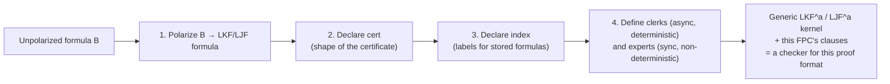
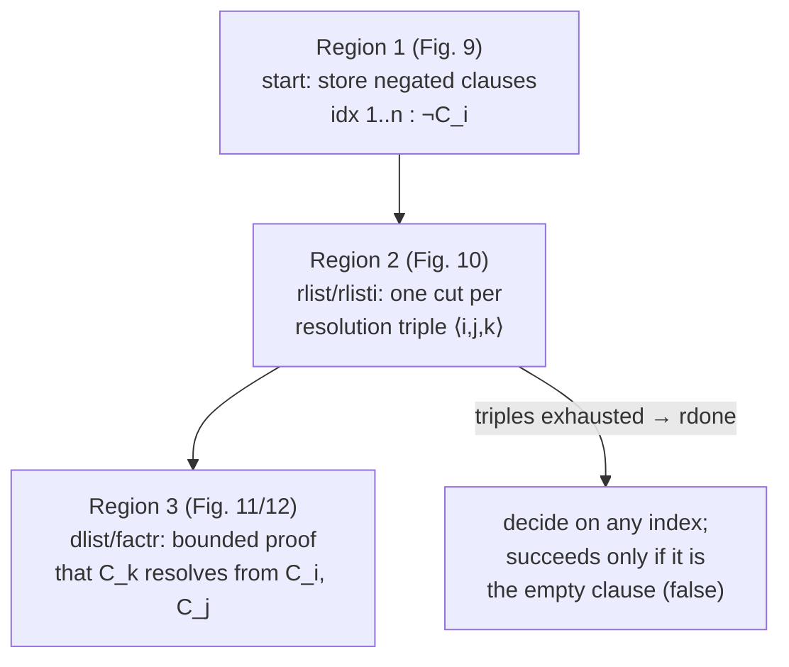

# Case Studies in Proof Certificate Design

[[book-guidelines|↩ Back to guidelines]]

## Why case studies at all

Chapters 4–6 of the paper hand you a *machine*: the augmented [[Focused-Sequent-Calculus|focused sequent calculus]] $LKF^a$, decorated with a certificate term $\Xi$, indexed storage, and two families of relations — **clerks** (deterministic bookkeeping during the asynchronous phase) and **experts** (the non-deterministic decisions during the synchronous phase). What that machine does not tell you is whether it's actually *useful*. A framework that can only elegantly re-derive its own inference rules is a curiosity. The test of a "foundational" proof-certificate framework is whether the five knobs — polarization, `cert`, `index`, clerks, experts — are expressive enough to reconstruct the wildly different proof formats that real theorem provers, SAT solvers, and type checkers actually emit: CNF refutations, resolution proofs, typed λ-terms, Horn-clause derivations, Frege-style linear proofs.

This is exactly the role of Chapters 7–9. Each case study runs through the same four-step recipe (stated at the top of Chapter 7, p. 17):

1. **Polarize** the connectives — since $LKF$ gives every connective two polarized versions, you must decide, *for this proof format*, whether disjunction (say) is invertible or not.
2. **Declare `cert`** — the datatype of certificate terms, i.e., what the exported proof evidence actually looks like as data.
3. **Declare `index`** — the datatype of labels used to address stored formulas.
4. **Define clerks and experts** — the relations that make the kernel's generic rules behave like *this* proof format's rules.

A predicate with no defining clauses denotes the empty relation — so leaving a clerk or expert undefined for some shape of certificate is a real design choice: it means "no valid proof ever produces this shape here."

**[[Clerks-and-Experts-as-an-Augmented-Kernel#What breaks without this|What breaks without this]] recipe:** without a fixed discipline for introducing a new proof format, every new prover would need its own bespoke, hand-verified checker — exactly the fragmentation the paper is trying to kill (Chapter 13's complaint about "ad hoc, technology-based proof sharing"). The case studies are the existence proof that one recipe, run seven different ways, covers propositional decision procedures, first-order resolution, simply typed λ-calculus, Horn-clause logic programming, and Hilbert-style Frege proofs.



Grounding this in Rust terms first, since it's the cleanest match for how a checker is actually built: a clerk or expert is a predicate, but operationally it's a **step function** — `fn clerk(cert: &Cert, ...) -> Option<(Cert, Index)>` for a deterministic clerk, or `fn expert(cert: &Cert, ...) -> impl Iterator<Item = (Cert, Choice)>` for a non-deterministic expert that the kernel must search over. Declaring `cert` and `index` is declaring two Rust `enum`s; declaring the clerks and experts is implementing pattern-matching functions over those enums that the *generic* kernel calls at fixed points. This is precisely the "grammar / parser-generator" analogy the paper leans on throughout: the kernel is the parser-generator, and each FPC is a grammar you feed it.

---

## 1. A CNF decision procedure as an FPC (§7.1, p. 17, Fig. 7)

### The motivating question

Chapter 3 (pp. 7–9) already gave you `LKneg`: a decision procedure for propositional classical logic built entirely from *invertible* rules (plus `init`). It's exponential-time and needs zero external guidance — it's essentially CNF conversion followed by a check that every clause contains a literal and its negation. The first case study asks: can the *generic* $LKF^a$ machine, with the right FPC, be made to behave exactly like `LKneg`?

### The design

Polarize every connective negatively: $\land, t, \lor, f$ become $\land^-, t^-, \lor^-, f^-$. Negative polarization forces these connectives into the *asynchronous* (invertible) phase — which is exactly the "no choices, no certificate needed" behavior `LKneg` has.

Because there are no choices to record, both `cert` and `index` are declared as **one-element types**:

```
type lit    index.
type cnf    cert.
```

The entire certificate is just the token `cnf` — it carries no information whatsoever, because none is needed. The four clerks (`andNeg_kc`, `orNeg_kc`, `false_kc`, `store_kc`) and three experts (`release_ke`, `initial_ke`, `decide_ke`) are given trivial defining clauses that just thread `cnf` through unchanged (Fig. 7, p. 17).

**What breaks without this:** if you tried to reuse the *positively* polarized versions of $\land, \lor$ here, the synchronous phase would require an expert to non-deterministically pick a disjunct or a conjunct pairing — turning a linear-time bookkeeping exercise back into search. Polarity choice is not cosmetic; it's the lever that decides whether a connective costs you certificate bits or costs you checker search time.

**Load-bearing observation for the automated-reasoning thread:** this is the cleanest illustration in the whole paper of the *inverse relationship between certificate size and checker work*. A "certificate" that carries zero information is not a degenerate case — it's the FPC recipe correctly recovering the fact that `LKneg` needs no proof evidence at all, only compute time. Soundness here is immediate "by erasure": any $LKF^a$ derivation using the `cnf` certificate erases (Chapter 5's erasure map) to a plain $LKF$ derivation of the negatively-polarized formula, which is classically valid. Completeness follows from a simple invariant: if $\Xi \vdash \Gamma \Uparrow \Theta$ is provable, $\Xi$ is always `cnf` and $\Theta$ is a multiset of `lit`-indexed literals; a `decide`/`init` pair can only succeed when some literal $L$ and its complement $\neg L$ are both in $\Theta$.

**Rust sketch** — the entire "certificate" carries no payload, so the type is a unit struct; all the "cleverness" lives in the kernel's generic dispatch, not in this FPC's data:

```rust
struct CnfCert; // isomorphic to the single constructor `cnf`

enum CnfIndex { Lit } // isomorphic to the single constructor `lit`

// Every clerk/expert is the identity on CnfCert — there is nothing to decide.
fn and_neg_clerk(c: &CnfCert) -> CnfCert { CnfCert }
fn store_clerk(c: &CnfCert) -> (CnfCert, CnfIndex) { (CnfCert, CnfIndex::Lit) }
```

The Rust triviality *is the point*: a one-inhabitant certificate type is a direct signal, readable off the type signature alone, that this FPC provides a decision procedure rather than a search-guided checker.

---

## 2. Oracle strings for LKpos proofs (§7.2, p. 17, Fig. 8)

### The motivating contrast

`LKpos` (Chapter 3.2) is `LKneg`'s dual: fully *non-invertible* treatment of disjunction via a `restart` rule, giving an unbounded search space — but paired with an **oracle string** (a sequence of left/right choices) it becomes a near-linear-time *certificate-guided* check, because the oracle removes exactly the search. The second case study reconstructs this as an FPC, and it's the first place where the certificate actually carries information.

### The design

Polarize $\land, \lor$ (and their units) *positively*. `index` now has two inhabitants: `root` (labels the restart formula) and `lit` (labels stored negative literals). `cert` is built from a small oracle grammar (Fig. 8, p. 17):

```
kind oracle              type.
type emp                 oracle.
type l, r                oracle -> oracle.
type c                   oracle -> oracle -> oracle.
kind cert                type.
type start, restart      oracle -> cert.
type consume             oracle -> cert.
```

`start`/`restart` connect to $LKF^a$'s `decide`/`store` structural rules; `consume` walks the oracle: `orPos_ke` peels an `l`/`r` off the oracle to pick a disjunct, `andPos_ke` splits a `c Left Right` into two continuation oracles for the two conjuncts, and `release_ke` hands control from `consume` back to `restart` once the oracle for one "round" is used up — directly mirroring `LKpos`'s literal restart rule.

**What breaks without this:** if `l`/`r`/`c` were *not* threaded as an explicit oracle argument, `orPos_ke` and `andPos_ke` would have to guess which disjunct/conjunct split leads to a proof — turning the checker back into the same unbounded search `LKpos` has without oracle strings. The oracle constructors are, structurally, nothing but a serialized *trace of an already-made search decision* — the certificate is doing exactly the job Poincaré's Principle (Chapter 2) says a certificate should do: recording the choice so the checker never has to re-derive it.

**Rust grounding:** the oracle is literally a binary tree of "which way did the search go," so it grounds cleanly as a recursive enum consumed by a state machine:

```rust
enum Oracle {
    Empty,
    Left(Box<Oracle>),
    Right(Box<Oracle>),
    Conj(Box<Oracle>, Box<Oracle>),
}

enum Cert {
    Start(Oracle),
    Restart(Oracle),
    Consume(Oracle),
}

// or_pos_expert consumes one bit of the oracle to resolve a non-deterministic choice
fn or_pos_expert(c: &Cert) -> Option<(Cert, Side)> {
    match c {
        Cert::Consume(Oracle::Left(rest))  => Some((Cert::Consume((**rest).clone()), Side::Left)),
        Cert::Consume(Oracle::Right(rest)) => Some((Cert::Consume((**rest).clone()), Side::Right)),
        _ => None,
    }
}
```

This is a direct instance of a pattern you'll want for the CSP/verification-condition side of your own project too: **a proof certificate is a replay log for a search procedure**, and a checker that consumes that log does no search of its own — it only validates that the log is internally consistent with the rules. The same shape reappears, scaled up, in the resolution FPC next.

---

## 3. Binary resolution refutations as an FPC (§7.3, pp. 17–22, Figs. 9–12, Example 2)

This is the richest and most consequential case study for the automated-reasoning thread: it's the direct ancestor of "the theorem prover's clause/resolution engine" your project's learning goals name as downstream payoff.

### The proof format being certified

A **resolution clause** is a closed formula built from universal quantifiers around a disjunction of literals (the empty disjunction is `false`). A **resolution refutation certificate**, per the paper's own definition (p. 18), bundles:

1. The proposed theorem $\neg C_1 \lor \cdots \lor \neg C_n$ (a disjunction of negated clauses).
2. A list of *derived* clauses $C_{n+1}, \ldots, C_p$.
3. A list of triples $\langle i,j,k \rangle$, each claiming $C_k$ is a binary resolvent (with factoring) of $C_i$ and $C_j$.

For this to be a genuine refutation, one derived clause (usually $C_p$) must be the empty clause $false$.

### Polarization and the three "regions" of the certificate

Clauses are polarized negatively (disjunction and $false$ as $\lor^-, f^-$); negated clauses are polarized positively (an existentially-quantified positive conjunction of literals). The checker's work then splits into three structurally distinct regions, each with its own `cert` constructors and clerk/expert clauses:

**Region 1 — storing the theorem (Fig. 9).** The `start` certificate constructor drives a purely asynchronous phase that stores each negated clause $\neg C_i$ under index `idx i`:
$$
\frac{(\texttt{start}\ (n{+}1)\ R) \vdash (\texttt{idx}\ 1):\neg C_1, \ldots, (\texttt{idx}\ n):\neg C_n \Uparrow}{(\texttt{start}\ 1\ R) \vdash {} \Uparrow \neg C_1 \lor \cdots \lor \neg C_n}
$$

**Region 2 — a chain of cuts (Fig. 10).** Once the disjunction is fully stored, the only available rules on an empty right-hand-side are `cut` and `decide`. Every resolution triple $\langle i,j,k \rangle$ becomes one instance of the `cut` rule, introducing the resolvent $C_k$ as the cut formula:
$$
\frac{(\texttt{dlist}\ [i,j]) \vdash \Gamma \Uparrow C_k \qquad (\texttt{rlisti}\ R\ k) \vdash \Gamma \Uparrow \neg C_k}{(\texttt{start}\ (n{+}1)\ (\texttt{resol}\ i\ j\ k{::}R)) \vdash \Gamma \Uparrow{}}\ \text{cut}
$$
The left premise defers to Region 3 ("prove $C_k$ follows from $C_i, C_j$"); the right premise recurses on the remaining triples. When the triple list empties, the `decide` expert is allowed to pick *any* stored index non-deterministically, but the certificate term becomes `rdone`, and `rdone` only succeeds against $t^+$ — which happens only if the picked clause is the empty clause $false^-$. This is a nice piece of certificate design: rather than *naming* which clause must be empty, the FPC makes any successful termination *force* it to be the empty one, by construction.

**Region 3 — checking one resolution step (Fig. 11, plus factoring in Fig. 12).** A short, bounded sub-proof (at most three `decide` rules) checks that $C_k$ really is a binary resolvent of $C_i$ and $C_j$: dissolve $C_k$ into eigenvariables and stored literals, non-deterministically decide on $\neg C_i$ or $\neg C_j$, and close with a literal that has a complement in context.



### The load-bearing omission: no quantifier instantiation in the certificate

The paper is explicit (p. 21) that the certificate *deliberately* leaves out how quantifiers are instantiated during resolution. This is safe specifically because **first-order unification is decidable and the checker is implemented in a logic-programming language** — so `λProlog`'s own unification and backtracking reconstruct the missing substitution as a byproduct of proof search, rather than needing it spelled out. This is a direct preview of the trade-off you'll hit designing your own metavariable unifier: information that is *mechanically reconstructible* by a decidable procedure doesn't belong in the certificate — putting it there only bloats the proof object for no soundness benefit.

### Soundness without a converse guarantee

The chapter ends (p. 22) with a genuinely important caveat: this checker is **sound but not complete-as-uniqueness** — it accepts more than "true" most-general-unifier resolvents. The paper's own counterexample:
$$
\forall x[p(x) \lor r(f(x))] \text{ and } \forall x[\lnot p(f(x)) \lor q(x)] \text{ resolve to } \forall x[r(f(f(x))) \lor q(x)],
$$
but the checker *also* accepts
$$
\vdash \exists x[\lnot p(x) \land \lnot r(f(x))], \exists x[p(f(x)) \land \lnot q(x)] \Uparrow \forall x[r(f(f(f(x)))) \lor q(f(x)) \lor s(f(x))],
$$
an entailment using a non-most-general unifier and an extra literal. This is *not* a soundness bug — the accepted formula genuinely follows — but it shows the certificate format checks "is this a valid entailment shaped like a resolution step" rather than "is this exactly the canonical MGU resolvent." **Soundness (nothing false is accepted) and completeness-as-uniqueness (only the intended object is accepted) are different properties, and an FPC can give you the first without the second.** This distinction matters directly for verification-condition discharge: a VC checker being sound is necessary; being "precise" about which proof term it accepts is a separate, often unnecessary, property.

**Rust grounding**, since this is exactly checker/verifier-shaped material the style guide asks to prioritize in Rust: model the three regions as an explicit state machine over an enum, with the kernel driving transitions and the certificate supplying the non-deterministic choices as data rather than search:

```rust
enum ResCert {
    Start { next_idx: i32, steps: Vec<ResolStep> },
    RList(Vec<ResolStep>),
    RListI { cut_idx: i32, rest: Vec<ResolStep> },
    RDone,
    DList(Vec<i32>),        // indices [i, j] under scrutiny in Region 3
    Factor(i32),            // factoring within a single clause
    FDone,
}

struct ResolStep { i: i32, j: i32, k: i32 } // ⟨i, j, k⟩ resolution triple
```

`lemma : int -> form -> o` in the source (Fig. 10) is worth flagging explicitly: it's *not* part of the kernel — it's extra code the certificate author supplies, a lookup table from an index to a formula. In Rust terms that's just a `HashMap<i32, Formula>` bundled alongside the certificate; the paper is showing that an FPC's "certificate" can freely include auxiliary relations beyond the bare `cert`/`index` datatypes, as long as the clerks/experts are defined to consult them.

---

## 4. Simply typed λ-terms in η-long β-normal form as certificates (§8.3, pp. 25–27, Figs. 15–16)

### First principles: Curry–Howard, made operational

The Curry–Howard correspondence — a simply typed λ-term *is* a natural-deduction proof of its type, read as a minimal-logic formula — is usually presented as a static, structural analogy. Here it becomes something more demanding: a claim that a λ-term, in a specific normal form, can be handed directly to a proof *checker* as the certificate term $\Xi$ in $LJF^a$, and the checker will accept it exactly when the corresponding formula is provable.

Two ingredients make this land. First, restrict to **η-long β-normal form**: every subterm has the shape $\lambda x_1 \ldots \lambda x_n.(h\ t_1 \ldots t_m)$ where the head $h$ has a *primitive* result type once fully applied. Second, use **de Bruijn indexes**: a bound-variable occurrence is replaced by the count of binders between the occurrence and its binder, so the term carries no variable names at all — just structure and small integers (Fig. 15, p. 26 gives worked examples, e.g. $\lambda x \lambda y.(x\ y) \mapsto \lambda\lambda(1\ 0)$, typed $(i \to j) \to i \to j$).

### Why the λ-binder can be dropped from the certificate

Here's the key structural observation (p. 26): under a suitable polarization (all atoms negative), the $\lambda$-abstraction corresponds exactly to the *invertible* implication-right rule of $LJF$ — an asynchronous rule. Asynchronous rules don't need certificate guidance (they're deterministic, per the clerk/expert split from Chapter 5). So the certificate doesn't need to record the $\lambda$'s at all; only the **head-variable offset** — which stored assumption the term applies — matters, because that's what drives the one non-deterministic step, `decideL`, choosing which assumption to focus on.

This licenses a genuinely elegant encoding. Define, for a term $t$, a variable-to-integer map $\theta$, and a depth $d$:
$$
[[\theta \mid \lambda x_1 \ldots \lambda x_n (h\ t_1 \ldots t_m)]]_d = \langle \theta'(h), [\,[[\theta' \mid t_1]]_{d'}, \ldots, [[\theta' \mid t_m]]_{d'}\,]\rangle
$$
where $d' = d+n$ and $\theta'$ extends $\theta$ mapping each $x_i \mapsto d+i$. The result is a nested pair of "head offset" and "list of argument sub-certificates" — precisely what the `deb` type in Fig. 16 encodes:

```
kind deb        type.
type apply      int -> list deb -> deb.
type lc         int -> deb -> cert.
type args       int -> list deb -> cert.
type idx        int -> index.

storeL_jc  (lc C D) (lc C' D) (idx C) :- C' is C + 1.
decideL_je (lc C (apply H A)) (args C A) (idx V) :- V is C - H - 1.
initialL_je (args C []).
arr_je     (args C (A::As)) (lc C A) (args C As).
```

`storeL_jc` increments the level counter $C$ every time an assumption is stored (recording how many binders deep we are); `decideL_je` converts the head's de Bruijn offset $H$ back into the absolute index $V = C - H - 1$ of the assumption it refers to — this arithmetic *is* the checker's implementation of variable lookup by de Bruijn index, executed at proof-checking time instead of term-evaluation time.

**What breaks without this offset arithmetic:** without translating the relative offset $H$ into the absolute index $V$, the checker would have no way to connect "the $H$-th enclosing binder" (a statement about term structure) to "the assumption stored under index $l$" (a statement about the sequent's left zone) — the two numbering schemes (de Bruijn depth vs. store-order index) would silently drift apart as soon as the proof nested more than one implication.

### The soundness/completeness asymmetry, again

Just as with resolution, this FPC is **sound but does not verify the full λ-term structure**: the paper gives the deliberately jarring example (p. 27) that if $B$ is the trivial formula $t$, the sequent is provable using the de Bruijn structure $\langle 0, [\langle 0, []\rangle]\rangle$ even though that structure decodes to the *self-application* $\lambda x(x\ x)$ — which is not even simply typable! The FPC's job is to certify **theoremhood of the formula**, not **well-typedness of the term** — those are different checking problems, and conflating them is a design mistake this example is specifically flagging. (§8.4 sketches the extension needed to certify full λ-term structure, via a positive "delay" operator $\partial(\cdot)$ around implications — worth knowing exists, but the paper treats it as a variation rather than developing it fully.)

### Lean grounding — this is the section where Lean is the primary lens

This whole case study is a checker-side view of exactly what a dependently typed kernel's `isDefEq`/type-checking loop does, minus dependent types: given a term and a claimed type, decide provability by structural recursion, using De Bruijn indices to avoid variable capture. In Lean's own kernel, every bound variable *is* represented by a de Bruijn index internally (`Expr.bvar n`), and elaboration performs exactly the "which enclosing binder does this reference" arithmetic that `decideL_je` performs here. The FPC's `lc C D` — carrying a level counter alongside the term — is the checker-side analogue of Lean's local context depth tracked during type-checking. Conceptually:

```lean
-- Illustrative, not literal Lean source: the shape of the correspondence.
-- A de Bruijn–indexed term is checked against a type by exactly the kind
-- of "offset into context" lookup `decideL_je` performs.
def lookupBVar (ctx : List Expr) (n : Nat) : Option Expr :=
  ctx.get? n   -- the same "count binders, index into context" move
```

The connective naming convention in the source (`_j` suffix for "intuitionistic," `arr` for implication) is worth internalizing as vocabulary if you read more `λProlog`-based proof-checking literature — it recurs throughout §8.

---

## 5. Justified Horn clause proofs (§9.1, pp. 30–33, Figs. 18–20)

### The shift in what's being checked

Chapters 7–8's FPCs all answer "is this formula a theorem?" Chapter 9 opens with an important reframing (p. 30): a kernel that succeeds on a certificate guarantees *only* theoremhood — nothing about the certificate's internal structure. Some applications need more: not just "is $A$ derivable from these Horn clauses," but "does this **specific sequence of derivation steps**, each explicitly justified by earlier steps, actually derive $A$?" This is a strictly *stronger* structural property than provability, and it's the FPC framework showing it can enforce that strength when needed.

### Definitions

A **Horn clause** is $\forall x_1 \ldots \forall x_m (A_1 \supset \cdots \supset A_n \supset A_0)$ with all $A_i$ atomic. A **Horn clause entailment** is $H_1 \supset \cdots \supset H_n \supset A$ where the $H_i$ are Horn clauses and $A$ is atomic. A **justified Horn clause proof** is a sequence of indexed triples $(\text{label}, \text{atom}, \text{justification})$, where each justification names *which specific earlier clause and which specific earlier atoms* license this new atom.

**Example 3 (p. 30)**, a graph reachability derivation, makes this concrete: given facts `adj a b`, `adj b a`, `adj a c`, `adj c d`, plus Horn clauses defining `path`, the justified proof of `path a d` is the labeled sequence:
$$
(7)\ \texttt{path a b}\ \langle 5,[1]\rangle,\ (8)\ \texttt{path b a}\ \langle 5,[2]\rangle,\ (9)\ \texttt{path a a}\ \langle 6,[7,8]\rangle,\ \ldots,\ (13)\ \texttt{path a d}\ \langle 6,[11,12]\rangle.
$$
Each justification $\langle r, [i_1,\ldots,i_k]\rangle$ says "clause $r$ applied to the atoms already established at indices $i_1,\ldots,i_k$."

### Why `finish` naming specific indexes is the load-bearing design choice

The certificate encodes each triple as `tup I Atom Rule Premises` and drives checking through six constructors: `load` (peels off the $n$ implications via alternating $\supset_r$/$S_l$), `jlist` (turns each justification into one `cut`, threading the newly-derived atom into context for the rest — Fig. 19), and `apply`/`args`/`finish` (checks that a Horn clause, applied to specific stored premises, really does derive the claimed atom).

The critical clause is `initialR_je (finish P) P`: it forces the `init` rule to succeed *only* against the exact index `P` named in the justification, not against *any* atom that happens to match. Fig. 20 (p. 33) shows this concretely: the two `init` rules deriving `path a a` from the transitivity axiom are guided by `(finish (i 7))` and `(finish (i 8))` — meaning the premises **must** be the formulas stored precisely at indices 7 and 8, not "some two path-facts that happen to be around."

**What breaks without this:** if the certificate only asserted "*some* earlier atoms suffice" rather than naming them, the checker would be reduced to a full Horn-clause *prover* — searching over all previously derived atoms for a match — defeating the entire point of supplying a certificate. Naming specific indices is what converts "prove $A$ follows from these Horn clauses" (a search problem) into "verify this specific already-found derivation" (linear-time replay). This is Poincaré's Principle again, now applied to logic-programming-style derivations rather than propositional search.

### Why this matters for your project specifically

This is close to the most directly transferable case study in the whole topic for a Hoare-triple / Horn-clause verification pipeline: **your abstract interpreter's job is to *generate* Constrained Horn Clauses encoding verification conditions, and your trusted checker's job is to *verify* a claimed derivation of `false` (or of the postcondition) from those CHCs** — which is structurally identical to checking that `path a d` is justified from the `adj`/`path` clauses above. The `finish`-style "name your exact premises" discipline is exactly what you'd want your own CHC-refutation checker to enforce, rather than re-running a solver to confirm a claimed derivation is valid.

**Rust grounding**, since a justified-proof checker is squarely checker-shaped:

```rust
struct Justification { rule: ClauseId, premises: Vec<AtomId> }
struct Step { label: AtomId, atom: Atom, just: Justification }

// Checking one step is a lookup, not a search: fetch the named clause,
// fetch the named premises (by their exact indices), and confirm
// substitution + modus-ponens chaining actually yields `atom`.
fn check_step(kb: &KnowledgeBase, derived: &HashMap<AtomId, Atom>, step: &Step) -> bool {
    let clause = kb.clause(step.just.rule);
    let premises: Vec<&Atom> = step.just.premises.iter()
        .map(|id| &derived[id])   // must already be established — no search
        .collect();
    clause.applies_to(&premises, &step.atom)
}
```

---

## 6. Frege proofs encoded via Horn clause entailment (§9.2, pp. 33–34)

### The reduction

A **Frege proof** in propositional logic is a list of formulas where each entry is either an axiom-schema instance or follows from earlier entries by a rule (classically, modus ponens). The paper picks three familiar Hilbert-style axiom schemas —
$$
X \supset Y \supset X,\qquad (X\supset(Y\supset Z))\supset((X\supset Y)\supset(X\supset Z)),\qquad ((X\supset\bot)\supset\bot)\supset X
$$
— and shows a Frege derivation of $\bot \supset w$ in ten lines (p. 34).

The reduction to Chapter 9.1's machinery is genuinely slick: introduce an object-level **provability predicate** `pv : i -> iform`, encode implication as a constructor `ar : i -> i -> i` on an object-level syntax type `i` (so formulas of the *object* logic are just *data* at the meta level), and encode modus ponens plus the three axiom schemas as a single Horn clause entailment:
$$
(\forall X \forall Y.\ pv(X) \supset pv(X \mathbin{\texttt{ar}} Y) \supset pv(Y)) \supset (\text{axiom 1}) \supset (\text{axiom 2}) \supset (\text{axiom 3}) \supset pv(\bot \mathbin{\texttt{ar}} w).
$$
The ten-line Frege proof becomes, verbatim, a `list just` of exactly the same shape as Example 3's graph-reachability derivation — checking a Frege proof *is* checking a justified Horn clause proof, with `pv` given positive polarity as required by the encoding.

**Why this is the paper's strongest argument for "foundational":** nothing about the Chapter 9.1 machinery was built with Frege proofs in mind — it was built for reachability in a toy graph. The fact that a *completely different, historically important proof format* (Hilbert/Frege systems, predating sequent calculus itself) drops out of the same justified-Horn-clause checker with only a change of Horn-clause *content* (not of clerks, experts, or kernel) is exactly what "technology-independent, proof-theoretic" is supposed to mean, as opposed to "yet another format-specific parser." The paper explicitly notes this generalizes freely to other object logics (e.g. swap in modal-logic axiom schemas and modal Frege proofs get the same treatment for free).

**What this buys you conceptually:** meta-encoding an object-level provability predicate as ordinary first-order (Horn-clause) data, and reducing "is this a valid proof in system $\mathcal{S}$" to "does this data satisfy a fixed entailment," is the same move you'll make repeatedly when building a trusted kernel that needs to stay agnostic to *which* logic or type theory sits on top of it — it's a lightweight, proof-theoretic alternative to writing a bespoke checker per object system.

---

## 7. The mimic FPC and completeness of atomic initial rules (§8.5, pp. 28–30, Fig. 17)

### The problem this solves

Gentzen's original (unfocused) sequent calculus allows an `init` rule at *any* formula: $B \vdash B$ closes a branch immediately, whatever $B$'s shape. Focused systems like $LJF$/$LKF$ are stricter — `init` only applies to **atomic** formulas (Fig. 13/14's `initl`/`initr`). This restriction is what makes focusing well-behaved (it's what forces the asynchronous/synchronous phase discipline in the first place), but it raises an obvious question: do you lose provability power by disallowing non-atomic `init`? The answer is no — but *proving* that in a focused system is significantly harder than it looks, and the mimic FPC is built specifically to make that hardness visible and checkable.

### Why it's easy in unfocused LJ and hard in focused LJF

In unfocused Gentzen LJ, completeness of atomic initials is a straightforward induction on formula structure: pair a left-introduction with the matching right-introduction to shrink $B \vdash B$ to smaller formulas, e.g.
$$
\frac{B \vdash B \qquad C \vdash C}{B \supset C, B \vdash C} \Rightarrow \frac{}{B \supset C \vdash B \supset C___}
$$
(and similarly for $\land$). Each step is *local*: one left rule immediately paired with one right rule.

In a *focused* system, that locality is gone. A whole asynchronous phase runs several introduction rules in sequence (say $\supset$-right, then $\lor^+$-left, then $\land^-$-right) before the *synchronous* phase can apply the mirror-image rules ($\supset$-left, $\lor^+$-right, $\land^-$-left) — and the synchronous phase must apply them **in the same order** the asynchronous phase used, or the reconstructed initial won't line up. The clerks have to *record* the sequence of asynchronous steps taken, precisely so the experts can *replay* that exact sequence during the synchronous phase.

### The mechanism

The mimic FPC (Fig. 17, p. 29) handles sequents of the shape $\Gamma \Uparrow F \vdash F \Uparrow$ — literally, proving a formula equal to itself, restricted to only atomic `init`. Its certificate constructors — `aphaseL`/`aphaseR` (recording the asynchronous-phase trace, as a list of indexes) and `sphaseL`/`sphaseR` (replaying that trace during the synchronous phase) — carry exactly the bookkeeping needed: as each asynchronous rule fires on one occurrence of $F$ (say, splitting off the left branch $mL\ I$ of a conjunction, or the right branch $mR\ I$), a matching entry is threaded through so the corresponding synchronous rule can find the *same* mirrored subformula, in the *same* position, once `decideL`/`decideR` refocuses on the stored mirror.

The key structural invariant (spelled out on p. 29): **whatever rule can `store` a formula on one side can, at the exact same subformula-position, only be closed by `release` or `init` on the other side** — and whatever can `release` on one side can only be closed by `decide` on the other. The mimic FPC's clerks and experts are precisely the executable encoding of that invariant, tracked via the current index `I` threaded as the first argument to `aphaseL`/`aphaseR`.

**What breaks without this:** without the recorded trace, the synchronous phase would have no way to know *which* occurrence of $F$'s subformulas to introspect next, or in what order — it would need to search over all the ways the asynchronous phase could have proceeded, which for a formula with $n$ connectives is combinatorially many orderings. The mimic FPC turns "prove completeness of atomic initials" from a meta-theoretic argument about focused proof systems into a certificate-checkable, linear-time replay — the mimic FPC is, in a real sense, a *certificate for a meta-theorem*, not for an object-level formula.

### Why this is worth internalizing for your elaborator

This is arguably the deepest single idea in the whole topic for your Focus Area on `type-theory` + `automated-reasoning`: **a focused proof system's `init` rule being atomic-only is exactly analogous to a bidirectional type checker only allowing definitional-equality checks between atomic (rigid/neutral) terms**, with all the structural congruence pushed into inference/checking-mode propagation instead. Lean's kernel `isDefEq` does not compare two arbitrary compound terms by recursively descending in lock-step at *every* node either — it reduces to weak-head normal form and compares heads, structurally mirroring the "peel off the outer connective on both sides in matching order" discipline the mimic FPC enforces. The mimic FPC is a genuine, formally verified instance of the pattern "push equality/identity checks down to atoms, and prove that doing so loses no generality" — which is precisely the property you need to trust before restricting *your* elaborator's definitional-equality check to a similarly atomic-only core.

---

## Where this leads

Chapters 7–9's case studies are the empirical payload that makes Chapters 4–6's machinery credible — without them, "clerks and experts" is just notation. They also set up two threads the paper picks up immediately afterward:

- **Chapter 10** (hosting $LKF^a$ on an $LJF^a$ kernel) reuses *exactly* the clerk/expert-translation technique demonstrated informally here (e.g., the resolution FPC's Region 2/3 split, the mimic FPC's phase-tracking) to mechanically derive intuitionistic clerks/experts from classical ones — so a single trusted kernel can check both logics.
- **Chapter 11** (the reference checker) is a direct payoff of every `λProlog` snippet shown in these case studies: because clerks/experts were written as Horn clauses from the start, they translate almost verbatim into an executable logic program, and the resolution FPC's reliance on unification-and-backtracking (for the implicit quantifier instantiation, §7.3) is called out there as the one feature "most difficult to eliminate."

For your standing project, the throughline across all seven case studies is the same lesson stated seven different ways: **a proof certificate should record exactly the information a decidable procedure cannot reconstruct on its own, and nothing more** — CNF needs none; oracle strings need one bit per disjunctive choice; resolution needs the pairing/order of clause combination but not the unifier; λ-terms need the head-variable offset but not the binder; justified Horn proofs need the exact premise indices but not a re-search; Frege proofs need nothing beyond an encoding into the Horn-clause format already built; and the mimic FPC needs only the trace of an asynchronous phase to replay it symmetrically. This is the design principle (`automated-reasoning`, with `type-theory` for the λ-term and mimic cases) you'll want at the center of your own compiler's proof-certificate format for discharging Hoare-triple verification conditions: certificate size should track *exactly* the non-determinism your CSP/CHC-solving backend actually resolved, and no more.
