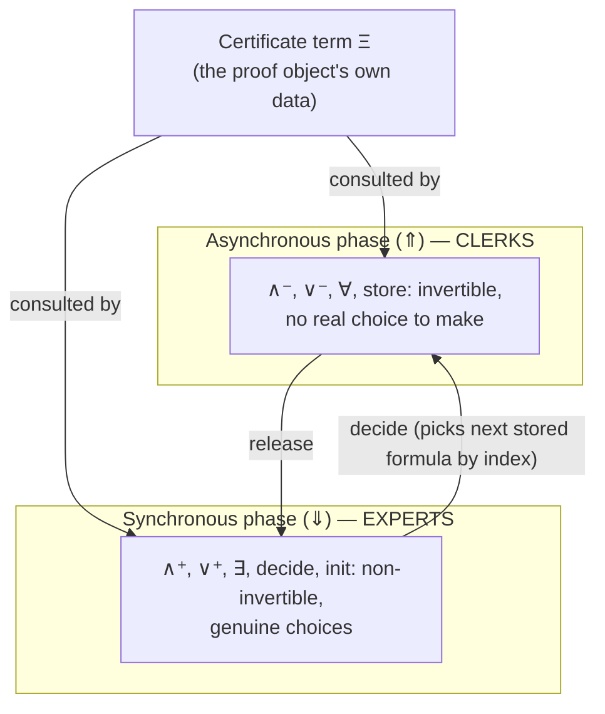

[[book-guidelines|↩ Back to guidelines]]

## What breaks without this

Chapter 4 gave us LKF, the [[Focused-Sequent-Calculus|focused sequent calculus]] for classical logic. LKF alone answers one question — "is this sequent provable?" — but not a more practically urgent one: "does this *specific* proof, handed to me by an external prover, actually establish that?" A bare proof checker that only knows the LKF inference rules has exactly two ways to behave when it hits a choice point (which disjunct to prove, which stored formula to `decide` on, what witness to pick for an existential): it can search exhaustively — which is exponential, and defeats the entire purpose of being handed a proof instead of a theorem — or it can trust an unverified oracle blindly, which throws away soundness. Neither option is acceptable, and neither is "specific to LKF" — it is the generic problem every checker for every non-invertible proof system faces.

What's needed is a *seam* in the proof system itself: a place where a proof's own encoded information can be consulted at exactly the points where LKF's rules are non-deterministic, while everything else about LKF's soundness guarantee stays untouched. That seam is what Chapter 5 builds, and it is why the paper doesn't just bolt "read some bits from the proof object" onto LKF informally — it defines a new proof system, $LKF^a$ ("LKF augmented"), where that consultation is itself a first-class inference-rule premise. Chapter 6 then names the two kinds of consultation — clerks and experts — and gives them, together with certificate terms and indexes, formal status as three of the five parameters that define a Foundational Proof Certificate (FPC).

## From LKF to $LKF^a$: three augmentations

The paper is explicit that $LKF^a$ is obtained from LKF by exactly three orthogonal changes (p. 12–13), each visible directly in Figure 6's rule schemas:

1. **Certificate terms $\Xi$.** Every sequent gains an extra decoration, written $\Xi$, $\Xi_1$, or $\Xi_2$ depending on the rule. These are terms of a type called `cert` — the actual data the proof format is choosing to say. Where LKF's sequents were $\vdash \Gamma \Uparrow \Theta$ and $\vdash \Gamma \Downarrow B$, $LKF^a$'s are $\Xi \vdash \Gamma \Uparrow \Theta$ and $\Xi \vdash \Gamma \Downarrow B$.
2. **Indexed storage.** The first zone $\Gamma$ changes from a multiset of bare formulas to a multiset of pairs $l : B$ — a formula tagged with an *index* $l$. The `store` and `decide` structural rules, which move formulas into and out of that zone, now traffic in these tagged pairs.
3. **A clerk/expert premise on every rule.** With one exception (the introduction rule for $t^-$, which needs no information at all since it has no premises to justify), every $LKF^a$ inference rule gets one extra premise: an atomic formula whose head predicate is subscripted either $c$ (a **clerk**) or $e$ (an **expert**). This predicate is the actual mechanism that inspects $\Xi_0$ (the certificate available before the rule fires) and licenses — or fails to license — the specific instance of the rule, typically producing continuation certificates $\Xi_1, \Xi_2, \dots$ for the premises.

Figure 6 spells this out rule by rule. Reading a representative slice (using the paper's own notation):

$$
\frac{\Xi_1 \vdash \Gamma \Uparrow A, B, \Theta \quad \lor_c(\Xi_0, \Xi_1)}{\Xi_0 \vdash \Gamma \Uparrow A \lor^- B, \Theta} \qquad
\frac{\Xi_1 \vdash \Gamma \Downarrow B_i \quad \lor_e(\Xi_0, \Xi_1, i)}{\Xi_0 \vdash \Gamma \Downarrow B_1 \lor^+ B_2}
$$

$$
\frac{\Xi_1 \vdash \Gamma, l:C \Uparrow \Theta \quad \mathrm{store}_c(\Xi_0, \Xi_1, l)}{\Xi_0 \vdash \Gamma \Uparrow C, \Theta} \qquad
\frac{\Xi_1 \vdash \Gamma \Downarrow P \quad l:P \in \Gamma \quad \mathrm{decide}_e(\Xi_0, \Xi_1, l)}{\Xi_0 \vdash \Gamma \Uparrow \cdot}
$$

Note the pattern: the negative disjunction rule (asynchronous, invertible — it *has* to fire, there is nothing to decide) is governed by a clerk, $\lor_c$. The positive disjunction rule (synchronous, a genuine choice of $i \in \{1,2\}$) is governed by an expert, $\lor_e$, which additionally receives the choice $i$ as an argument to justify. `store` — moving a formula into the asynchronous zone and assigning it an index — is clerk-governed. `decide` — picking *which* stored formula to bring back into focus, addressed by index $l$ — is expert-governed. This is not a coincidence; it *is* the definition of the clerk/expert split, and it lines up exactly with the asynchronous/synchronous split from Chapter 4.

**Why soundness is free.** This is one of the paper's cleanest moves. $LKF^a$ is defined so that erasing every $\Xi$ decoration, deleting every clerk/expert premise, and flattening every $l:B$ pair back to bare $B$ recovers exactly LKF. So *any* $LKF^a$ derivation, no matter what clerks and experts you plug in, is already an LKF derivation once you squint away the certificate machinery. You get soundness of the whole augmented system "for free," by construction, without having to separately prove a soundness theorem for every new FPC you invent later. This is the load-bearing engineering property of the whole framework: a kernel implementer only has to trust the *fixed*, once-and-for-all-verified erasure map, never the individual clerk/expert definitions someone plugs in for a new proof format.

An implementation of $LKF^a$ — the fixed machinery of Figure 6, parametrized by a not-yet-chosen clerk/expert theory — is what the paper calls a **kernel**.



## The tax-office analogy

The paper motivates the split with an analogy worth taking seriously rather than skimming past (p. 12): imagine a tax office auditing a pile of financial documents against a tax code. The office splits work between two kinds of staff. **Experts** dig into the pile and *extract information* — they decide which thread of transactions to pursue and when to release their findings for storage. **Clerks** take what the experts released and *do bookkeeping on it* — indexing it, filing it, computing derived values — without making any investigative judgment calls of their own.

Map this directly onto focused proof search: the synchronous phase is exactly the "investigative" work — deciding which disjunct is true, which existential witness to guess, which previously-filed formula to reopen by `decide`. That is expert territory. The asynchronous phase is exactly the "bookkeeping" work — mechanically breaking a conjunction into two branches, unfolding a universal quantifier, filing a formula away with a fresh index via `store`. That is clerk territory. Even the vocabulary lines up on the nose: `decide`, `release`, and `store` are literally the structural-rule names inherited straight from LKF's own terminology (Chapter 4), which the tax-office story then re-uses without translation.

## Deterministic clerks, non-deterministic experts

The clerk/expert split is not just organizational — it is a **behavioral guarantee with teeth**, and it is the reason the framework can promise checking efficiency at all:

- **Clerks compute.** Because they operate only during the fully invertible asynchronous phase, a clerk's job is to *compute* something — an index to assign, which branch of a two-premise asynchronous rule to continue on — never to *guess* something. A well-designed clerk predicate is a deterministic function in relational clothing: given $\Xi_0$, there is exactly one $\Xi_1$ (or $\Xi_1, \Xi_2$) it licenses. This is precisely the "corridor" side of the maze-vs-corridor analogy from Chapter 2: no communication with an external oracle is needed, because there is nothing to decide.
- **Experts may guess, and may guess badly on purpose.** Because synchronous rules encode real proof-search choices, expert predicates are allowed — even expected, in the general framework — to be genuinely non-deterministic relations, not functions. The paper is blunt about this (p. 14–15): "experts may not exhibit actual expert behavior." A disjunction expert can be defined to suggest *both* branches; an existential expert can be defined to suggest *every* term in a domain, effectively delegating the actual search to the checker's backtracking engine rather than to information encoded in the certificate. This is a deliberate design freedom, not a wart: a certificate author trades off *how much the certificate says* against *how much search the checker must perform* to reconstruct the missing pieces. A certificate that names the exact resolvent at every step needs almost no search; a certificate that just says "try everything" needs full proof search, but is trivial to produce.

The clerk/expert distinction therefore operationalizes the earlier informal contrast between "corridor" (deterministic, information-free) and "maze" (non-deterministic, communication-heavy) computation from Chapter 2 into an actual typing discipline on inference-rule premises.

## Indexes: the addressing mechanism

Indexes are the third piece the augmentation introduces, and they exist to solve a very specific bookkeeping problem: once a formula is filed away by `store`, how does a later `decide` refer back to it? The paper's answer is intentionally minimal — an index is simply *any term of type `index`* (p. 14). It commits to nothing else:

- Indexes can be numbers (de Bruijn indexes, clause numbers in a resolution refutation).
- Indexes can be structured terms denoting an occurrence of a subformula.
- Indexes need **not** uniquely determine which formula they name. Multiple stored formulas can legally share the same index label. When that happens, `decide`'s act of "dereferencing" an index — looking up *the* formula it names — can itself be non-deterministic: given the label, the checker may have to search among several candidates.
- Formulas can be used as their own indexes, in which case dereferencing is trivially deterministic (the label *is* the thing named).

This is a genuinely useful design knob, not an incidental detail: it means certificate authors can choose exactly how much addressing precision to bake into a proof format. A format that uses formulas-as-indexes pushes all the addressing cost onto the certificate (verbose, but zero-search); a format that reuses one generic label for many stored formulas pushes addressing cost onto the checker's search (compact certificates, more reconstruction work at check time). The `lit` index used throughout the Chapter 7 CNF-decision-procedure FPC is the extreme compact end of this spectrum — every stored literal is filed under the *same* index `lit`, so `decide` must search among all literals tagged `lit` for one whose negation is also present, recovering exactly the non-deterministic literal selection of the original decision procedure from Chapter 3.

## A concrete worked instance: the trivial CNF FPC

Chapters 5–6 present the machinery abstractly; the paper's own first fully-worked instance (§7.1, immediately following) is worth pulling forward here because it shows the clerk/expert split in its most degenerate — and therefore clearest — form. To emulate the purely-invertible CNF decision procedure of Chapter 3 as an FPC:

```prolog
type lit    index.
type cnf    cert.

andNeg_kc   cnf cnf  cnf.        % clerk: ∧⁻ splits into two branches, both certified "cnf"
orNeg_kc    cnf  cnf.            % clerk: ∨⁻ continues with the same certificate
false_kc    cnf  cnf.            % clerk: f⁻ continues with the same certificate
store_kc    cnf cnf lit.         % clerk: every stored formula is filed under index "lit"

release_ke  cnf  cnf.            % expert: release always succeeds trivially
initial_ke  cnf lit.             % expert: init succeeds against any "lit"-tagged formula
decide_ke   cnf cnf lit.         % expert: decide non-deterministically picks a "lit"-tagged formula
```

Both `cert` and `index` have exactly *one* constructor each (`cnf` and `lit`). The certificate literally carries no information beyond "I am doing CNF decision procedure." All four clerks are deterministic one-line continuations — there is nothing to compute beyond "keep going with `cnf`." The three experts, by contrast, are where all the work happens: `decide_ke` is the non-deterministic search over every `lit`-tagged stored formula that the earlier discussion predicted, and it is precisely what makes this decision procedure exponential in the worst case — the certificate contributes zero guidance, so the checker's search reconstructs the entire proof from scratch. This is the FPC-level restatement of Chapter 3's observation that LKneg checks "for free" but at exponential cost: an *empty* certificate (`cnf` says nothing) forces *maximal* expert search.

## Grounding the mechanism

**Rust: clerks and experts as trait-dispatched relations.** The clerk/expert split maps naturally onto a distinction Rust programmers already have vocabulary for: a clerk is a *pure function* (or infallible pattern match) over the certificate type; an expert is a *search procedure* that may return zero, one, or many continuations for the checker to try.

```rust
// The certificate type is whatever an FPC author declares `cert` to contain.
// Clerks never fail non-deterministically: they compute the next certificate(s)
// or reject the rule instance outright.
trait Clerk<C> {
    /// e.g. store_kc(Xi0, Xi1, l): compute the continuation certificate
    /// and the index to file the formula under.
    fn store(&self, xi0: &C) -> Option<(C, Index)>;
    fn and_neg(&self, xi0: &C) -> Option<(C, C)>; // two branches, both deterministic
}

// Experts return an iterator of candidate continuations: zero means "this rule
// instance is not licensed by this certificate," more than one means genuine
// backtracking search, exactly mirroring λProlog's own backtracking semantics.
trait Expert<C> {
    fn decide(&self, xi0: &C, stored: &[(Index, Formula)]) -> Box<dyn Iterator<Item = (C, Index)>>;
    fn or_pos(&self, xi0: &C) -> Box<dyn Iterator<Item = (C, Branch)>>;
}
```

A kernel written this way is exactly the erasure-map argument from Chapter 5 turned into an engineering discipline: the *checker driver* — the part that walks the $LKF^a$ rule schema — never changes across FPCs, and it is the only code that has to be trusted. Swapping FPCs is swapping the `Clerk`/`Expert` trait implementations, never the driver. This is also precisely why non-determinism is quarantined to `Expert`: a Rust `Iterator`-returning method is an honest admission "this may need backtracking," whereas the `Clerk` methods returning `Option` (not an iterator) is an honest admission "this is a computation, not a search" — the type signatures alone reconstruct the paper's deterministic/non-deterministic distinction without needing a comment to explain it.

**Lean: clerks and experts as inductively defined relations.** The paper's own choice of $\lambda$Prolog for specifying clerks and experts (Chapter 6, closing pages) is worth reading in Lean terms, since $\lambda$Prolog's Horn clauses and Lean's `inductive` `Prop`-valued relations are doing structurally the same job — both are ways of writing down a *relation*, not necessarily a function, and letting the proof-search engine (Prolog's SLD resolution; Lean's tactic-driven or `decide`-driven search) find witnesses.

```lean
-- decide_ke (mirroring the λProlog clause from §7.1's CNF FPC):
-- non-deterministic because the same certificate `cnf` can pair with
-- many different stored indexes.
inductive DecideExpert : Cert → Cert → Index → Prop
  | cnf_any (l : Index) : DecideExpert Cert.cnf Cert.cnf l

-- A clerk, by contrast, is provably a *function* dressed as a relation —
-- exactly one output certificate per input, which Lean lets you state
-- and prove as a real theorem about the relation, not just hope for.
theorem storeClerk_deterministic :
    ∀ xi0 xi1 xi1' l l', StoreClerk xi0 xi1 l → StoreClerk xi0 xi1' l' → xi1 = xi1' ∧ l = l' := by
  intro xi0 xi1 xi1' l l' h1 h2
  cases h1; cases h2; rfl
```

The point of writing it this way is not decoration: it makes the paper's informal claim — "clerks compute, experts may not" — into a *checkable proposition* about the relation Lean has in hand, which is exactly the kind of "does the specification actually have the property I'm claiming" question your own elaborator's metavariable-unification code will eventually need to ask about its own constraint-solving relations (see closing synthesis).

## Where this leads

Clerks and experts, together with polarization, certificate terms, and indexes, are the **five FPC parameters** that Chapter 6 formally names — this topic *is* three of those five, with polarization and certificate-term signatures as the remaining two, worked out concretely across the case studies of Chapter 7 (CNF, oracle strings, resolution) and Chapter 8 (simply typed $\lambda$-terms as intuitionistic certificates, via $LJF^a$). Chapter 10's result — that a single $LJF^a$ kernel can host classical-logic checking by mechanically deriving $LJF^a$ clerks/experts from $LKF^a$ ones via Chaudhuri's translation — depends entirely on clerks and experts being *syntactically uniform, relationally specified* objects: mechanical translation of a specification only makes sense because the specification is written in a small, closed vocabulary (Horn clauses over `cert` and `index`) rather than as ad hoc executable code.

For the standing project (**Automated Reasoning**): this is the paper's actual trusted-computing-base argument made precise. The kernel — the fixed $LKF^a$ driver plus the erasure-map soundness proof — is the *entire* thing you need to trust; clerks and experts for a new format are new, unverified relations, but they can never compromise soundness because they only ever gate *whether* a rule fires, never *what* the rule concludes. This is the exact shape you want for your own theorem-prover's proof-reconstruction layer: a small, fixed, once-proven-sound kernel, driven by pluggable, possibly-non-deterministic search relations for each proof format your CSP/resolution backends emit, rather than a monolithic checker that has to be re-trusted every time a new certificate format shows up.

For **Type Theory**: the deterministic/non-deterministic split between clerks and experts is the same split your elaborator's bidirectional typing will need between *checking* (mostly deterministic, clerk-shaped: given a type and a term, verify) and *inference/unification* (genuinely search-laden, expert-shaped: given a term with metavariables, find an assignment). The `decide` rule's non-deterministic index dereferencing — searching among several stored formulas sharing a label — is structurally the same problem as Miller's own pattern-unification fragment picking among candidate solutions for a metavariable: both are cases where "the specification is a relation, and search finds the witness," and both are exactly the kind of place where restricting to a tractable fragment (as pattern unification does for higher-order unification) is what keeps the search from becoming the exponential worst case the CNF FPC above deliberately illustrates.
