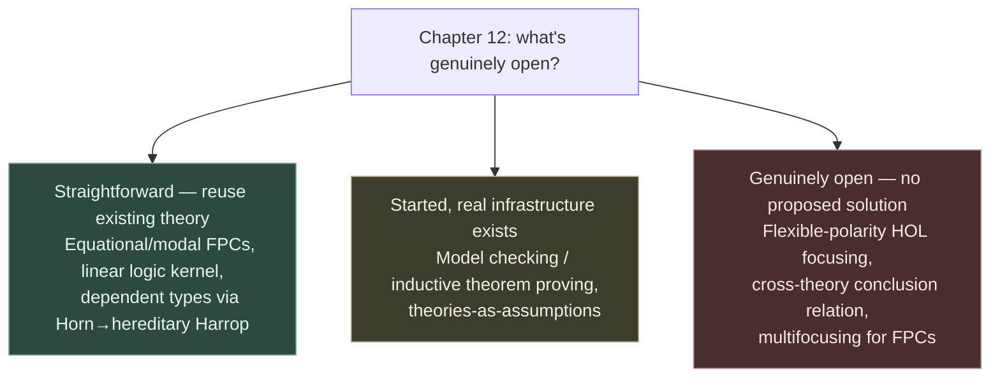

[[book-guidelines|↩ Back to guidelines]]

## What breaks without this

Every prior chapter demonstrated the FPC framework working *within* a deliberately narrow scope: first-order classical and intuitionistic logic, single-focus derivations, one proof system encoded at a time (CNF certificates, resolution refutations, simply typed $\lambda$-terms, Frege proofs). That narrowness was a methodological choice, not a limitation the authors were unaware of — you don't validate a new semantic framework by immediately stretching it to its breaking point. But a framework that only works inside the box it was demonstrated in isn't actually a *foundation*; it's a worked example. Chapter 12's job is to look honestly at the walls of that box and ask, for each one, whether it's load-bearing (a genuine limit of the proof-theoretic machinery) or just unexplored (a direction nobody has walked yet).

This matters for anyone deciding whether to build on FPCs rather than just admire them. If the extensions sketched here turn out to require rebuilding the calculus from scratch, that's a very different risk profile than if they're "straightforward, given what we already have." The chapter is explicit and calibrated about which is which — and that calibration is the actual content worth extracting, more than any single extension in isolation.

## Six directions, in increasing distance from what's already proven

The chapter is organized as four subsections, but it's more useful to read it as a single list ordered by how much new theory each direction actually requires beyond what Chapters 1–11 already established.

**1. More FPC case studies (§12.1) — genuinely straightforward.** Equational rewriting and paramodulation certificates, and modal-logic labeled proofs (leaning on prior focused-proof-system results for modal logics), are both flagged as extensions where the theory *already exists elsewhere* and just needs to be plugged into the FPC pattern the paper established. The more interesting case here is **dependently typed $\lambda$-calculi** — $\lambda\Pi$ and LF — because the paper sketches an actual two-step recipe rather than gesturing vaguely:

1. Encode the dependently typed calculus into intuitionistic (first-order) logic — this is exactly the kind of theory-as-assumptions encoding discussed in §12.3 (below), and it's already known to work for type theories.
2. Generalize the **justified Horn clause** certificate format from [[Case-Studies-in-Proof-Certificate-Design|Chapter 9]] to a **justified hereditary Harrop formula** format.

Step 2 is worth pausing on precisely, because it answers one of the chapter's own posed Key Questions: *why* does dependent-type checking need a strictly richer justification format than the Horn clause one already built for propositional Frege proofs? A Horn clause body is a conjunction of atoms — flat, unstructured, no binders, no nested implication. A **hereditary Harrop formula** (the formula class $\lambda$Prolog itself is built on) allows nested implications and universal quantifiers in clause bodies — `D ::= A | G ⊃ D | ∀x. D`, roughly. That extra structure is exactly what a dependent type-checking judgment needs: checking a $\Pi$-type's codomain, or a dependent application, routinely requires *hypothetically* extending the context with a fresh variable and *then* checking a subgoal under that extended context — a scoped, nested obligation that a flat Horn clause body simply cannot express. So "generalize Horn clauses to hereditary Harrop formulas" isn't cosmetic; it's swapping in the minimal amount of extra logical structure needed to represent binder-scoped subgoals as first-class citizens of the justification, rather than as an ad hoc addition bolted on top.

```lean
-- The shape a justified hereditary-Harrop-formula certificate is reaching for:
-- checking `Πx : A, B x` requires a subgoal *scoped under a fresh x : A*,
-- not a flat conjunction of independent atoms.
-- This is exactly what Lean's own kernel does when it type-checks a Pi type:
def checkPi (ctx : Context) (A : Expr) (B : Expr) : MetaM Unit := do
  let x ← mkFreshFVarId
  let ctx' := ctx.push x A          -- hypothetical extension, scoped to B
  checkType (ctx'.instantiate x) B  -- subgoal only valid *under* that extension
```

The paper also notes this typed-$\lambda$-calculus line has independently grown *further* extensions in the literature — LFSC and LFP — that let a type checker offload certain computations instead of demanding they appear explicitly inside the typed term. That's a strong signal the encoding direction is fertile, not speculative.

**2. A linear logic kernel (§12.1, closing paragraph) — straightforward, and already prototyped.** This is the chapter's clearest "we could do this tomorrow" claim: focusing for linear logic is well understood (citing Andreoli's original focusing work), so building an $LKF^a$/$LJF^a$-style kernel for linear logic is described as "a rather straightforward exercise." More tellingly, the authors reveal that their *actual first attempt* at this whole project was broader than what shipped in this paper — they initially tried to build a kernel for the **LKU system**, which mixes linear, classical, and intuitionistic logic in one framework. They backed off that ambition once [[Relating-Classical-and-Intuitionistic-Proof-Checking|Chapter 10's]] result — that an $LJF^a$ kernel can host $LKF^a$ checking directly — showed the extra flexibility of a unifying LKU-based kernel wasn't *necessary* to get classical and intuitionistic checking from one trusted base. This is a genuinely useful engineering lesson, independent of the logic: **don't build the maximally general system first if a narrower result gives you the practical payoff you actually needed.** The paper tried the ambitious version, found a cheaper path to the same practical goal, and only *then* wrote up the narrower, provably-sufficient result — flagging the more general one as future work rather than a prerequisite.

**3. Beyond first-order logic (§12.2) — a genuine open problem, honestly flagged as such.** This is where the chapter's tone shifts from "straightforward exercise" to "not yet studied." Two sub-directions:

- *Model checkers and inductive theorem provers*, reaching past first-order provability into properties like reachability and bisimulation. The proof-theoretic foundation cited (Baelde's work adding least/greatest fixed-point operators to linear logic) is real infrastructure, and the paper notes initial results already exist for certifying model checking and inductive theorem proving — so this is "started, not finished," not "unstarted."
- *Higher-order logic focusing with flexible polarity assignment.* This is the sharpest admission of an actual gap: sequent calculi for higher-order classical/intuitionistic logic are well studied, and focusing *can* be extended to higher-order logic — but only so far, using a **monolithic polarity assignment** (every connective and atom globally negative, or globally positive). The paper's own framework depends critically on *flexible*, per-formula polarity choice — recall from [[Focused-Sequent-Calculus|Chapter 2]] that polarization is precisely the lever certificate designers use to encode different proof strategies as different focusing disciplines. A monolithic-polarity higher-order focusing system would forfeit exactly that lever. So extending FPCs to higher-order logic isn't blocked by "focusing doesn't exist for HOL" — it's blocked by "the flexible-polarity version of focusing, which is what FPC actually needs, hasn't been worked out for HOL yet." That's a precise, falsifiable open problem, not vague future-work boilerplate.

**4. Theories (§12.3) — a scoping decision more than an unsolved problem.** Most real theorems aren't proved in bare first-order logic; they're proved *relative to a theory* — set theory (Mizar's foundation), arithmetic, or, notably, type theory and higher-order logic themselves, which the paper points out can be viewed as theories encoded in first-order logic. The standard move — treating a theory as a set of additional assumptions available to the proof — means checking proofs *in* logic is a genuine first step toward checking proofs *from* a theory, so nothing here is wasted by staying first-order. What's left open is harder and more structural: how do you relate conclusions derived from *different* theories to each other? That's flagged as needing its own treatment, with no proposed solution offered — an honest "we don't know yet," distinct from the "we know how, just haven't done it" tone of §12.1.

**5. Multifocusing and expansion trees (§12.4) — parallelism the sequential kernel design doesn't capture.** Every kernel built so far processes a focused derivation as a strictly sequential decide/synchronous-phase/decide/... loop: one formula under focus at a time. But a proof genuinely can have *independent* parallel structure — several formulas that could be focused on in any order, or simultaneously, without one depending on the other's resolution. **Expansion trees** and **proof nets** are proof-system representations designed from the ground up to make minimal commitments about inference-rule *ordering*, capturing exactly that parallelism instead of forcing an arbitrary sequentialization. **Multifocusing** — focusing on several positive formulas at once rather than committing to just one — is [[Case-Studies-in-Proof-Certificate-Design#The mechanism|the mechanism]] that lets a focused sequent calculus itself express that same parallelism, rather than papering over it with an arbitrary left-to-right choice. The paper notes a single-focus FPC treatment of expansion trees already exists elsewhere; multifocusing itself remains open for the FPC setting specifically.

**6. The multicut rule (§12.4) — the chapter's most concrete piece of new proof theory.** This is the one direction the chapter doesn't just describe but actually states as an inference rule:

$$\dfrac{\Delta_1 \longrightarrow B_1 \quad \cdots \quad \Delta_n \longrightarrow B_n \qquad B_1, \ldots, B_n, \Gamma \longrightarrow C}{\Delta_1, \ldots, \Delta_n, \Gamma \longrightarrow C} \; mc \quad (n \geq 1)$$

Read left to right: you have $n$ independently-established lemmas $B_1, \ldots, B_n$ (each with its own assumption set $\Delta_i$), and a main proof of $C$ that's allowed to use all $n$ of them as hypotheses alongside $\Gamma$. The ordinary binary cut rule from [[Focused-Sequent-Calculus|Chapter 2]] only lets you discharge *one* lemma at a time — using $n$ lemmas means chaining $n$ binary cuts in some sequential order. The paper's Key Question here is exactly *why* that chaining is a problem worth a dedicated rule, and the answer is about **independence, not expressiveness**: a sequence of binary cuts is logically equivalent to one multicut, but it forces you to pick a linear order among lemmas that were, in fact, proved independently of each other. That imposed order silently manufactures a **spurious dependency** — cut 2 now formally "depends on" cut 1 having already happened, even though nothing about their actual proofs required that. If a certificate format cares about faithfully representing the proof's real dependency structure (say, for parallel proof checking, or for attributing exactly which lemma a failure traces back to), forcing an arbitrary serialization actively destroys information the multicut rule would have preserved.

The chapter closes with the same idea applied at a larger grain: kernels should eventually be extended to treat **previously proved theorems** as reusable building blocks (theorem libraries feeding other provers) and to **relegate trust to external computational systems** for specific sub-steps — the paper's example is the now-common pattern of simply trusting an SMT solver's output as one oracle-checked step inside a larger proof, rather than re-deriving everything the SMT solver did from first principles. Both are described as needing only "(simple) modifications" to the existing kernel design — the multicut rule is the proof-theoretic device that would make "independently-proved external lemma" a first-class, dependency-accurate citizen of a certificate, rather than something you have to awkwardly serialize into the existing single-cut machinery.

## The chapter's own calibration, read as a map

Reading straight through, the six items sort cleanly into three tiers of "how much new theory is actually required":



This calibration is itself a useful modeling habit worth borrowing: when you extend your own formal framework, distinguish "I could do this next week using machinery that already exists" from "there's promising partial infrastructure" from "I genuinely don't know how to do this yet" — and say which is which, explicitly, rather than presenting every future-work bullet with the same confident tone.

## Where this leads

Chapter 12 is the bridge between the paper's demonstrated results and [[Trusted-Kernels-and-Proof-Sharing|Chapter 13's]] positioning against prior art — together they form the paper's closing argument for why FPC is worth adopting despite covering, strictly, only first-order classical and intuitionistic logic so far. The multicut rule and the hereditary-Harrop generalization are the two most technically concrete threads; everything else is a direction with a stated starting point rather than a finished construction.

For the standing project, the **dependent types via hereditary Harrop formulas** direction is directly load-bearing (`type-theory`): it's the paper's own proposed bridge from propositional/first-order proof certificates to something that could eventually certify a dependently typed elaborator's output, which is precisely the trusted-kernel role a Rust-based dependent/refinement-type compiler's proof-checking backend would need to fill. The **multicut rule** (`automated-reasoning`) is worth flagging for the theorem-prover component specifically: any design where independently-derived lemmas (or externally-trusted oracle results, like an SMT-discharged verification condition) get folded into a larger proof should represent that independence structurally, the same way multicut does here, rather than serializing it into an arbitrary chain of single-lemma substitutions that would misrepresent — and potentially complicate debugging of — the real dependency graph. The relegate-trust-to-external-provers remark, finally, is the paper's own version of exactly the SMT-oracle pattern the CSP kernel's verification-condition discharge (`sat-smt-csp`) will need to formalize.
