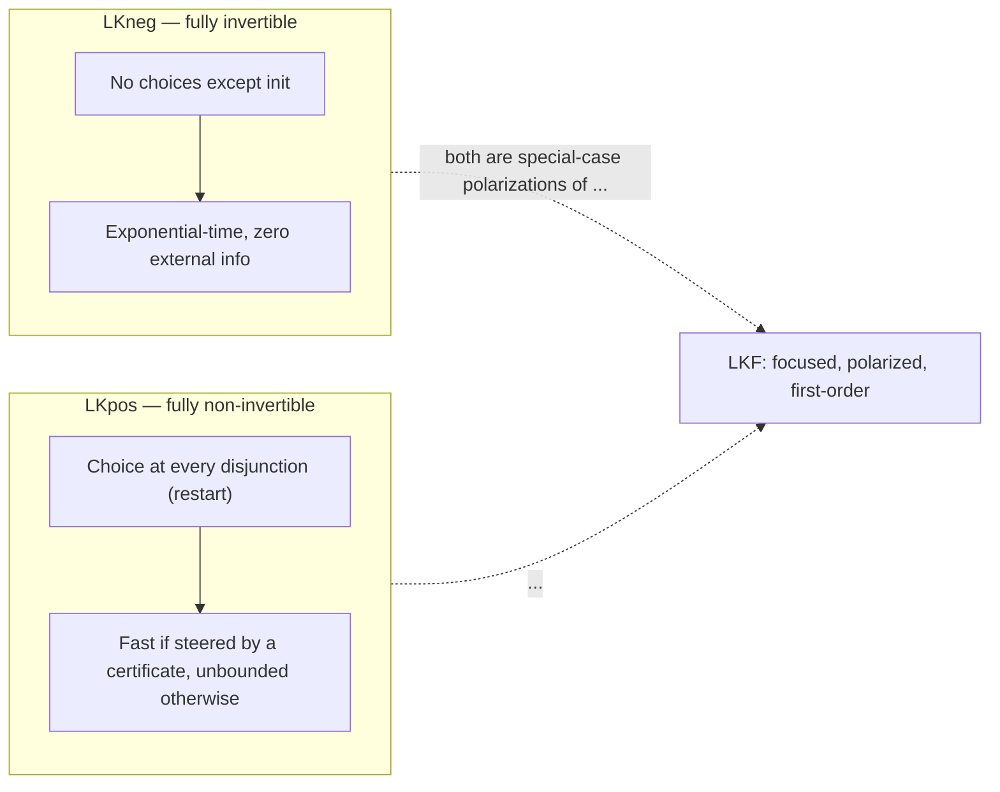
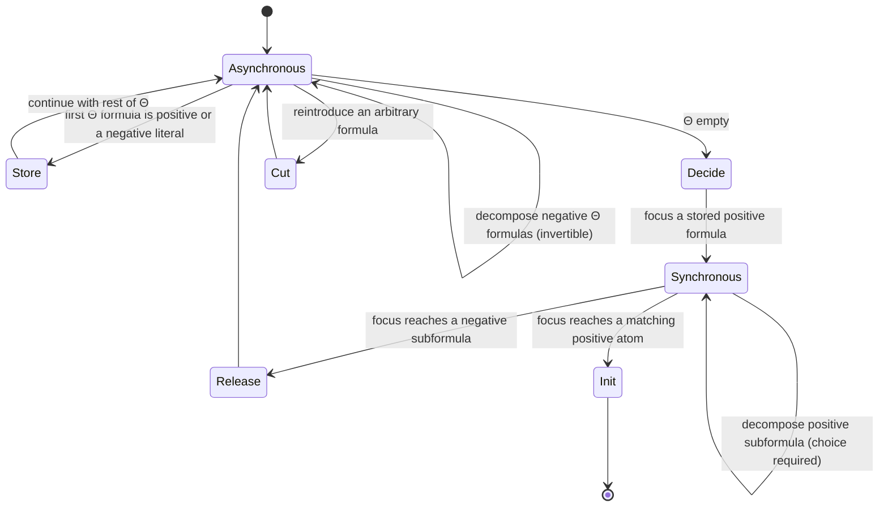

[[book-guidelines|↩ Back to guidelines]]

## Why ordinary sequent calculus is the wrong granularity to check

Take a plain, unfocused Gentzen sequent calculus for classical logic and hand it to two different people who both want to use it as a *checker's protocol* — one machine building a proof, one machine (or human) supervising and only willing to say "yes, apply that rule" or "no, don't." You immediately hit a dilemma that has nothing to do with the logic being wrong and everything to do with the calculus giving you too many, or too few, choice points.

If you restrict yourself to only the *invertible* rules of classical logic — the ones where, if the conclusion is provable, every possible instantiation of the premises is also provable — the supervisor never has to make a real decision. Every step is forced. But this buys determinism at the cost of an exponential blowup: an invertible-only calculus is essentially conjunctive-normal-form conversion, and CNF conversion can explode. If instead you keep the *non-invertible* rules (say, an unrestricted disjunction-introduction, where choosing wrong can dead-end the proof), you get short proofs but the supervisor now has to answer a question — "left or right disjunct?" — at every single one of them, and answering that question might itself require search.

The paper opens this topic by making that dilemma concrete with two toy propositional calculi, **LKneg** and **LKpos**, before showing that they are just the two extreme instantiations of a single underlying design: the **focused sequent calculus**. Focusing (originally due to Andreoli, specialized here to first-order classical and intuitionistic logic as **LKF** and **LJF** by Liang and Miller) is the proof-theoretic answer to "how do you organize a sequent calculus so that determinism and non-determinism are cleanly separated, instead of interleaved rule-by-rule?" That separation is exactly what later chapters exploit to build a small, trusted proof-checking kernel that can be *retargeted* at wildly different proof formats — but the retargeting only works because the calculus underneath already has this phase structure baked in. This article is about that calculus itself.

## What breaks without focusing: LKneg and LKpos as failed compromises

**LKneg** (Fig. 1 in the paper) is a one-sided sequent calculus using only the invertible introduction rules for conjunction and disjunction. A sequent has the form $\vdash \Delta ; \Gamma$, where $\Delta$ is a multiset of literals already "settled" and $\Gamma$ is a list of formulas still to be decomposed. Crucially: **given a formula $B$, the bottom-up derivation $\Pi_B$ is completely determined** — there is exactly one legal proof tree to build, up to the one exception described below. Checking a proof is just checking that every premise of $\Pi_B$ contains a complementary literal pair. This is, structurally, CNF conversion followed by tautology-checking on each clause, and it costs exponential time.

The one place LKneg is *not* fully determined is the `init` rule: given a multiset of literals, there might be more than one way to split it into $\Delta, A, \neg A$. For example, $(p \lor p) \lor \lnot p$ admits two different proofs depending on which occurrence of $p$ you pick.

**LKpos** (Fig. 2) makes the opposite bet. Its sequent $\vdash B ; \Delta ; C$ carries the whole original formula $B$ around as a fixed reference, uses non-invertible disjunction introduction, and has a `restart` rule that both stores a negated literal and re-copies $B$ to start over. This is *not* a decision procedure in the same sense — the `restart` rule can drive genuinely unbounded search (try proving $\vdash \lnot p$ and watch it loop). But when a disjunction is hit, there is exactly one real question: left or right? Miller observes that the entire "content" of an LKpos proof, read bottom-up, is the sequence of left/right answers to that one recurring question. That sequence can be reified as a **certificate term** — a tree built from nullary `emp`, unary `l`/`r`, and binary `c` constructors (Fig. 3), or equivalently, reorganized as a pair of **oracle strings** $\langle I, O \rangle$ where $O$ is a suffix of $I$ and the consumed prefix records the choices made so far (Fig. 4). The formula $(\lnot p \lor q) \lor p$, for instance, has the LKpos proof witnessed by the term $l(l(r(\mathsf{emp})))$.

**Why this matters as a design lesson, not just a curiosity:** the same formula $(\lnot p \lor C) \lor p$, checked in LKneg, forces the checker to silently build a derivation that is exponential in the size of $C$ before it can even name the complementary pair. Checked in LKpos with the certificate $l(l(r(\mathsf{emp})))$, the checker is steered straight to a proof *independent of $C$*, in near-linear time — at the price of the certificate author having to supply that information externally. **A proof system, in other words, is simultaneously an interaction protocol.** How much a certificate says trades directly against how long checking takes. This tradeoff is the entire reason the paper (and this topic) exists: LKF is built precisely so that a *single* proof system can host both extremes (and everything in between) by letting the *polarity* of each connective occurrence decide, locally, whether it behaves like LKneg's forced rule or LKpos's certificate-hungry rule.



## Polarized formulas: making "which rule is forced" a property of the formula

LKF's move is to stop treating connective choice-behavior as a global property of the calculus and make it a **local, per-occurrence** property of the formula: **polarity**. Take an ordinary classical formula and replace every occurrence of a propositional connective or constant with a *polarized* version, tagged $+$ or $-$: an occurrence of $\lor$ becomes $\lor^+$ or $\lor^-$, similarly for $\land$, $t$, $f$. If $B$ has $n$ connective/constant occurrences, there are $2^n$ distinct polarizations of $B$ — polarity is a proof-search *engineering decision*, not part of the formula's meaning. Quantifiers don't get a choice: $\exists$ is always positive, $\forall$ is always negative. The de Morgan duality extends to the polarized connectives too: $t^-/f^+$, $t^+/f^-$, $\lor^+/\land^-$, $\lor^-/\land^+$, $\forall/\exists$. Negation itself is eliminated from the syntax — every formula is kept in negation-normal form, and $\lnot B$ for a compound $B$ just means "take the de Morgan dual of everything inside."

A formula is **positive** if its top connective is one of $\lor^+, \land^+, t^+, f^+, \exists$, or it's an atom; **negative** if its top connective is $\lor^-, \land^-, t^-, f^-, \forall$, or it's a negated atom.

**What breaks without polarity:** without it, you're back to LKneg-or-LKpos as a single global choice for the whole formula — you can't get LKneg's determinism on the parts of a proof that are cheap to determine and LKpos's certificate-steered shortcuts on the parts that benefit from external guidance, within *one* proof of *one* formula. Polarity is what lets a single LKF derivation behave like LKneg in some subtrees and like LKpos in others, switching locally as connectives of different polarity are encountered.

**Rust grounding.** Polarity is exactly the kind of "small closed enum baked into the type" that a Rust proof-search kernel wants, because it lets the *type checker* — not a runtime `if` — guarantee that asynchronous-phase code never accidentally tries to apply a synchronous rule:

```rust
#[derive(Clone, Copy, PartialEq, Eq)]
enum Polarity { Pos, Neg }

enum Formula {
    Atom(Pred, Polarity),          // atomic formulas carry their own fixed polarity
    And(Box<Formula>, Box<Formula>, Polarity), // ∧+ or ∧-
    Or(Box<Formula>, Box<Formula>, Polarity),  // ∨+ or ∨-
    True(Polarity),
    False(Polarity),
    ForAll(Box<dyn Fn(Term) -> Formula>),      // always negative
    Exists(Box<dyn Fn(Term) -> Formula>),      // always positive
}

impl Formula {
    fn polarity(&self) -> Polarity {
        use Formula::*;
        match self {
            Atom(_, p) | And(_, _, p) | Or(_, _, p) | True(p) | False(p) => *p,
            ForAll(_) => Polarity::Neg,
            Exists(_) => Polarity::Pos,
        }
    }
}
```

A phase-correct kernel then simply refuses (at the type level, or at least at a single central assertion) to call the synchronous introduction rules on anything reporting `Polarity::Neg`, and vice versa for asynchronous rules on `Polarity::Pos` compound formulas.

## LKF: one calculus, two sequent shapes, two alternating phases

LKF's sequents come in two shapes. The **up-arrow sequent** $\vdash \Gamma \Uparrow \Theta$ has $\Gamma$ (a multiset — the **storage zone**) on the left and $\Theta$ (a *list*) on the right; the **down-arrow sequent** $\vdash \Gamma \Downarrow B$ has a single formula $B$ "under focus" instead of a list. Both can be read as ordinary one-sided sequents ($\vdash \Gamma, \Theta$ and $\vdash \Gamma, B$ respectively) — the arrows are bookkeeping about *where in the algorithm* you are, not extra logical content. Introduction rules only ever touch the first element of the right-hand zone.

Proofs alternate between two **phases**:

- **Asynchronous phase** (Fig. 5, top block): all rules are invertible, and every rule stays within $\Uparrow$-sequents. Negative connectives ($\land^-, \lor^-, t^-, f^-, \forall$) are decomposed here, deterministically, one at a time, off the front of $\Theta$.
- **Synchronous phase** (Fig. 5, second block): rules require real choices and live on $\Downarrow$-sequents. Positive connectives ($\land^+, \lor^+, t^+, \exists$) are decomposed here — disjunction-introduction picks a disjunct, existential-introduction picks a witness term.

Three **structural rules** are the glue between the phases:

- **store**: when the first formula $C$ to the right of $\Uparrow$ is a positive formula or a negative literal (i.e., something with *no* invertible introduction rule available), it gets moved into the left-hand storage zone $\Gamma$ instead of being decomposed. This is how "I can't make progress on this right now" gets recorded without stalling the proof.
- **decide**: at the end of an asynchronous phase (right zone empty, $\vdash \Gamma \Uparrow \cdot$), pick a *positive* formula $P$ already sitting in storage and put it under focus, starting a new synchronous phase: $\vdash \Gamma \Downarrow P$.
- **release**: when the formula under focus stops being positive (you've decomposed down to a negative subformula $N$), focus is dropped and control returns to the asynchronous phase: $\vdash \Gamma \Uparrow N$.

Two **identity rules** close things off: **init**, $\vdash \lnot P_a, \Gamma \Downarrow P_a$ — an atom under focus matches its negation already sitting in storage — and **cut**, which reintroduces an arbitrary formula $B$ by proving both $\vdash \Gamma \Uparrow B$ and $\vdash \Gamma \Uparrow \lnot B$ and concluding $\vdash \Gamma \Uparrow \cdot$.

A sharp structural fact worth internalizing: **`decide` is the only place contraction happens.** Negative non-literal formulas are treated *linearly* — never duplicated, never discarded except by weakening at `init`. Only positive formulas get contracted, and that contraction is exactly what `decide`'s "pick a formula from storage but keep it in storage" step performs. This is why the polarity assignment for atoms (fixed to positive in LKF) is not an arbitrary convention: it's what lets an atomic formula be reused across multiple `init` applications the way classical logic's unrestricted contraction rule requires.



### Theorem 1: soundness, completeness, and cut-elimination — for free, at any polarization

The paper states (citing Liang and Miller) that for a classical first-order formula $B$: (1) if $B$ is a theorem, then **for every polarization** $\hat B$ of $B$, the sequent $\vdash \cdot \Uparrow \hat B$ has an LKF proof; (2) conversely, an LKF proof of any polarization of $B$ implies $B$ is a theorem; (3) every LKF-provable sequent has a **cut-free** LKF proof.

This is the load-bearing result of the whole topic: it says polarity is a genuinely free choice — LKneg falls out as the special case where *every* connective is polarized negatively (the `restart`-free, fully invertible calculus), and LKpos falls out as the special case where every connective is polarized positively (with LKpos's `restart` rule revealed as exactly the composition of LKF's `store` immediately followed by `decide`). You get to choose, per-connective, exactly where on the LKneg–LKpos spectrum you sit, and completeness doesn't care which choice you made. This is also *why* the calculus can support cut: clause (3) says cut is eliminable in principle (so it adds no proof-theoretic power), while the paper keeps cut in the presentation anyway because later chapters use it operationally, as a controlled way to reintroduce lemmas into a certificate-driven derivation.

### Atoms versus molecules: the synthetic inference rule

Individually, each LKF rule is a small, checkable step. But a `decide` application doesn't just add one inference — it *commits* to unfolding an entire alternating sequence of synchronous-then-asynchronous steps until the next `decide` or `init`. The paper's Example 1 makes this concrete. Suppose $\Gamma$ contains $a \land^+ b \land^+ \lnot c$ (with atoms positively polarized, negated atoms therefore negative literals). A `decide` on this formula forces exactly this derivation shape:

<svg viewBox="0 0 640 260" xmlns="http://www.w3.org/2000/svg" font-family="ui-monospace, monospace" font-size="13">
  <style>
    .node { fill: #e8e8e8; stroke: #666666; stroke-width: 1; }
    text { fill: #222222; }
    .lbl { fill: #555555; font-size: 11px; font-style: italic; }
    line { stroke: #888888; stroke-width: 1; }
  </style>
  <!-- root -->
  <rect class="node" x="230" y="220" width="180" height="28" rx="4"/>
  <text x="320" y="238" text-anchor="middle">⊢ Γ ⇑ ·</text>
  <text x="420" y="238" class="lbl">decide</text>
  <line x1="320" y1="220" x2="320" y2="190"/>
  <!-- decide premise -->
  <rect class="node" x="200" y="162" width="240" height="28" rx="4"/>
  <text x="320" y="180" text-anchor="middle">⊢ Γ ⇓ a ∧⁺ b ∧⁺ ¬c</text>
  <line x1="260" y1="162" x2="150" y2="130"/>
  <line x1="320" y1="162" x2="320" y2="130"/>
  <line x1="380" y1="162" x2="470" y2="130"/>
  <!-- init a -->
  <rect class="node" x="90" y="104" width="110" height="26" rx="4"/>
  <text x="145" y="121" text-anchor="middle">⊢ Γ ⇓ a</text>
  <text x="145" y="98" class="lbl" text-anchor="middle">init</text>
  <!-- init b -->
  <rect class="node" x="265" y="104" width="110" height="26" rx="4"/>
  <text x="320" y="121" text-anchor="middle">⊢ Γ ⇓ b</text>
  <text x="320" y="98" class="lbl" text-anchor="middle">init</text>
  <!-- release ¬c -->
  <rect class="node" x="415" y="104" width="130" height="26" rx="4"/>
  <text x="480" y="121" text-anchor="middle">⊢ Γ ⇓ ¬c</text>
  <text x="480" y="98" class="lbl" text-anchor="middle">release</text>
  <line x1="480" y1="104" x2="480" y2="76"/>
  <!-- store -->
  <rect class="node" x="415" y="48" width="130" height="26" rx="4"/>
  <text x="480" y="65" text-anchor="middle">⊢ Γ ⇑ ¬c</text>
  <text x="480" y="42" class="lbl" text-anchor="middle">store</text>
  <line x1="480" y1="48" x2="480" y2="20"/>
  <rect class="node" x="405" y="0" width="150" height="26" rx="4"/>
  <text x="480" y="17" text-anchor="middle">⊢ Γ, ¬c ⇑ ·</text>
</svg>

Read bottom-up: `decide` puts $a \land^+ b \land^+ \lnot c$ under focus; the synchronous $\land^+$ rule forks into three branches; two of those close immediately by `init` (provided $\Gamma$ already contains $\lnot a$ and $\lnot b$); the third releases focus back to the asynchronous phase and stores $\lnot c$. This whole four-rule fragment is what actually gets "used" whenever you decide on this one formula, and it corresponds to a single **synthetic inference rule**:

$$\frac{\vdash \lnot a, \lnot b, \lnot c, \Gamma' \Uparrow \cdot}{\vdash \lnot a, \lnot b, \Gamma' \Uparrow \cdot}$$

— i.e., "if $\Gamma$ already has $\lnot a, \lnot b$, deciding on $a \land^+ b \land^+ \lnot c$ replaces the goal with the same goal plus $\lnot c$." A **molecule** (a synthetic inference rule / whole focusing phase, in the "atoms, molecules, and chemistry" vocabulary from Chapter 1) is this bundled unit — the actual thing a proof-search algorithm treats as one indivisible step, versus the individual sequent-calculus **atoms** (introduction, structural, identity rules) it's built from. The paper flags an important asymmetry here: checking an *individual* rule application is always cheap, but checking a *synthetic* rule can be exponential — the synthetic rules corresponding to the whole LKneg system are an example — so molecules are not automatically "inference rules" in Cook's sense of polynomially checkable steps. This distinction is exactly why the FPC framework (the next topic) needs its clerk/expert machinery: it has to say, precisely, which parts of a molecule's construction a certificate must witness explicitly and which parts a trusted kernel is allowed to search for on its own.

## LJF: the same architecture, the intuitionistic constraints

LJF is what you get when you rebuild this whole apparatus for intuitionistic logic, where the classical restriction "at most one formula on the right of the sequent" has to be honored everywhere. Two structural differences fall directly out of that restriction, and both are worth internalizing because they are the two places LJF's design is *not* a mechanical copy-paste of LKF's:

**1. Disjunction loses its negative polarity option.** LKF gave you both $\lor^+$ and $\lor^-$. Intuitionistically, there is no useful negative disjunction — instead, the *negative* two-place connective slot is filled by implication $\supset$ (always negative, with no unit), and disjunction is simply $\lor$ (understood as $\lor^+$), with unit $f$ instead of $f^+$. Conjunction and truth still get both polarities ($\land^+, \land^-, t^+, t^-$), and $\forall$/$\exists$ keep the same polarities as in the classical case.

**2. Sequents are two-sided with four zones, and the right-hand storage is linear.** LJF sequents are written $\Gamma \Uparrow \Theta \vdash R$ or $\Gamma \Downarrow B \vdash R$ (left-focused: $\Gamma \Downarrow N \vdash R$; right-focused: $\Gamma \vdash P \Downarrow$) — $\Gamma$ (left storage, a multiset) and $R$ (the single right-hand conclusion) both persist across a derivation, exactly reflecting intuitionistic logic's single-conclusion discipline. The `storeL` rule works just like LKF's `store`, indexing a formula into the left multiset. But `storeR` is different in kind: since there can be at most *one* formula stored on the right at any time, storing there is a **linear** operation — no index is even needed, because there's nothing to disambiguate. `decideR` simply consumes whatever single formula is stored on the right.

Everything else transports over structurally. `initL`/`initR` are the two identity rules (matching a negative or positive atom respectively against what's already committed); `decideL`/`decideR` and `releaseL`/`releaseR` mirror LKF's `decide`/`release`, now split by side; `cut` still reintroduces an arbitrary formula through both an up-sequent and its dual. The invariants the paper states for any LJF derivation of $\Uparrow \cdot \vdash B \Uparrow$ are worth stating explicitly because they're the intuitionistic analogue of "atoms are always positive" in LKF: every $\Gamma$ appearing in the proof is a multiset of *negative formulas and positive atoms*, and every right-hand $R$ is a *positive formula or negative literal*. Polarity, in other words, isn't just a per-formula tag here — it's an invariant the whole proof maintains about what kind of formula is allowed to sit where.

**What breaks without the linear `storeR`:** if the right zone were allowed to accumulate multiple stored formulas the way the left zone does, you'd have silently reconstructed *classical* multiple-conclusion sequents inside an intuitionistic system — the single-conclusion restriction is intuitionistic logic's entire distinguishing structural feature, so LJF has to encode it as a *shape* constraint on storage, not just a side condition checked after the fact.

$LJF^a$, the augmented version (Fig. 14, mirroring $LKF^a$ from Chapter 5, previewed here because the augmentation pattern is identical), attaches a clerk predicate to every asynchronous/structural-store premise and an expert predicate to every synchronous/identity/release premise, plus a certificate-term $\Xi$ threaded through every sequent and indexes $l$ attached to left-stored formulas only (again — nothing on the right needs one). This is the same "asynchronous = clerks = deterministic bookkeeping, synchronous = experts = non-deterministic investigation" split as LKF, just typed to intuitionistic zone shapes.

**Rust/Lean grounding — phases as a typestate machine.** The asynchronous/synchronous alternation is a natural fit for Rust's typestate pattern: a `Sequent<Phase>` type parameterized by a phase marker, where only phase-appropriate methods compile:

```rust
struct Async; struct Sync_; // phase markers (Sync_ to avoid the keyword)

struct Sequent<Phase> {
    storage: Vec<(Index, Formula)>,   // Γ, indexed
    goal: GoalZone,                    // Θ (list) in Async, single formula in Sync_
    _phase: std::marker::PhantomData<Phase>,
}

impl Sequent<Async> {
    fn decompose_negative(self) -> Sequent<Async> { /* invertible, no choice */ todo!() }
    fn store(self, idx: Index) -> Sequent<Async> { todo!() }
    fn decide(self, idx: Index) -> Sequent<Sync_> { todo!() } // only legal transition out
}

impl Sequent<Sync_> {
    fn decompose_positive(self, choice: LeftOrRight) -> Sequent<Sync_> { todo!() }
    fn release(self) -> Sequent<Async> { todo!() }
    fn init(&self) -> bool { todo!() }
}
```

The compiler then statically rules out the entire class of bugs "applied a synchronous rule during the asynchronous phase" — which is exactly the invariant Theorem 1 and the LJF invariants above are stating semantically. On the Lean side, the honest correspondence is with a **judgment-indexed inductive family**: `LKFProof : Sequent → Prop` (or, if you want the certificate to double as a proof witness, `LKFProof : Sequent → Type`) with one constructor per rule in Fig. 5/Fig. 13 — cut-elimination (Theorem 1, clause 3) is then a theorem *about* that inductive family (a function `LKFProof s → LKFProof' s` into a cut-free variant), not something you get automatically from the datatype's shape, mirroring how Lean's own kernel treats normalization as a metatheoretic property proved about the type theory rather than baked into `Expr`.

## Where this leads

Focusing is the substrate everything else in this paper stands on. **Chapter 5** takes exactly the phase/rule structure documented here and threads a certificate term $\Xi$, an indexing scheme, and clerk/expert predicate calls through every single rule — producing $LKF^a$ and $LJF^a$ (previewed above for LJF) without changing the underlying logic at all: soundness of the augmented systems is proved "for free" by erasing the certificate machinery and recovering exactly the LKF/LJF derivations built here. **Chapters 6–9** then show that an enormous variety of real proof formats (CNF decision procedures, resolution refutations, simply-typed $\lambda$-terms via Curry–Howard, Frege proofs) are nothing more than *specific choices of polarization plus specific clerk/expert definitions* layered on top of this one calculus — which is only possible because Theorem 1 guarantees every polarization is equally sound and complete. **Chapter 10**'s classical-on-intuitionistic hosting result depends on the phase-by-phase correspondence between LKF and (Chaudhuri-translated) LJF derivations being provable at exactly this level of structural detail, not just at the level of overall theoremhood.

For the **Automated Reasoning** focus area specifically: this is the concrete mechanism behind "focused sequent calculus" and "proof certificates" as standing threads in the learning goals — the molecule/synthetic-rule distinction developed here (Example 1) is the direct proof-theoretic ancestor of what a resolution-style or Horn-clause-style *proof reconstruction* engine has to do: decide how much of a derivation step the kernel searches for internally (the "clerk"/asynchronous, corridor-like part) versus how much a certificate or an external solver must supply explicitly (the "expert"/synchronous, maze-like part). If the eventual Rust-based verifier embeds its own theorem prover, this store/decide/release/init/cut skeleton — not the specific classical or intuitionistic connectives — is the reusable architectural piece: it is, in effect, the general shape of *any* proof-search kernel that wants to separate "what can be computed" from "what must be searched or asked."
