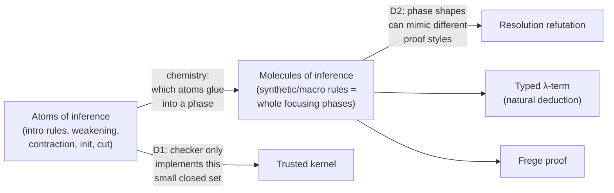

[[book-guidelines|↩ Back to guidelines]]

## The problem: everyone's "proof" means something different

Suppose you build a resolution prover, someone else builds a natural-deduction
based constructive prover, and a third party builds an SMT solver. Each one, when
it succeeds, wants to hand you *evidence* that the formula it worked on is a
theorem. But that evidence looks totally different in each case: a list of
resolvent triples, a typed $\lambda$-term, a DPLL trace with unit propagations.
If you want to write a single checker that a mathematician (or another piece of
software) can trust, do you write three checkers? Ten? One per prover, forever,
each one only as trustworthy as the person who wrote it?

This is exactly the situation programming languages were in before context-free
grammars existed: syntax was defined *by a parser*, not by an independent
specification, so "what counts as valid Pascal" was whatever your particular
Pascal parser accepted. Grammars fixed that by giving syntax a specification
independent of any one implementation, so many people could write parsers for
the same language and cross-check each other. Denotational, operational, and
natural semantics later did the analogous thing for *meaning*.

Miller, Chihani, and Renaud's Foundational Proof Certificates (FPC) framework is
the same move applied to *proof evidence*. Instead of "a resolution refutation
is whatever my resolution prover happens to emit," you get a formal, prover-
independent semantics: a document (the certificate) plus a specification of how
that document unfolds into an actual sequent-calculus derivation. Any correctly
implemented checker for that specification is trustworthy, regardless of who
wrote the prover that produced the certificate, and — this is the sharp
consequence — regardless of who wrote the *checker*, since the specification
itself is small, fixed, and independently verifiable. This is directly the
`trusted kernels` and `proof certificates` thread this project cares about: it's
[[Case-Studies-in-Proof-Certificate-Design#The mechanism|the mechanism]] by which a verifier can accept proof evidence from a metavariable
unifier or a resolution engine without absorbing that engine's full complexity
into its own trusted computing base.

## Proof certificates as exported documents of proof evidence

The paper's own definition (§1.1, p. 3):

> By the term *proof certificate* we mean an exported document that contains the
> proof evidence discovered by a computational logic system.

Two things to notice immediately. First, "exported": a certificate is not the
prover's internal search state, it's a document the prover writes out once it
has *found* a proof — the analogue of a compiler emitting an object file rather
than exposing its parse tree. Second, "contains the proof evidence discovered":
the certificate doesn't have to contain a *complete* low-level derivation. It
only has to contain enough evidence that a checker, doing bounded additional
work, can reconstruct one. That's the hinge the whole framework swings on, and
it's why the paper insists on calling this "foundational" rather than merely
"technological" — the semantics comes from proof theory (the sequent calculus),
not from any implementation choice of any particular tool.

**[[Clerks-and-Experts-as-an-Augmented-Kernel#What breaks without this|What breaks without this]] idea.** Without a shared certificate format,
proof-sharing degenerates into pairwise translators: prover A's team writes a
converter that consumes prover B's proof scripts directly. That converter breaks
the moment B changes its internal proof-object representation in a minor
version bump — which the paper explicitly flags (Ch. 13) as the failure mode of
ad hoc, technology-based proof sharing. A certificate format defined
proof-theoretically, independent of any prover's internals, doesn't have this
fragility: the semantics is pinned to the sequent calculus, which isn't going to
change between versions of anybody's software.

```rust
// The shape of the idea, not the paper's actual data structure:
// a certificate is data + a reference to *how to interpret* that data.
struct ProofCertificate<Cert> {
    proof_object: Cert,          // e.g. a resolution triple list, a lambda term...
    fpc_spec: FpcSpecId,         // which five-parameter semantics governs `proof_object`
}
// A checker doesn't need to know anything about the *prover* that produced
// `proof_object` — only about the FPC named by `fpc_spec`.
```

## The atoms-molecules-chemistry metaphor and the four desiderata

Before stating what a "good" certificate format must guarantee, the paper sets
up vocabulary borrowed from chemistry (§1.3, pp. 4-5). Plain Gentzen sequent
calculus gives you very fine-grained pieces: introduction rules for each
connective, the structural rules (weakening, contraction), and the identity
rules (`init`, `cut`). Call these the **atoms of inference**. A raw sequent
proof is a big pile of these atoms glued together in whatever order the prover
happened to need — "rather chaotic in structure," as the paper puts it, because
one inference rule's occurrence doesn't predict what its neighbor will be.

*Focused* proof systems (Andreoli's insight, generalizing Gentzen/Girard) group
these atoms into two alternating kinds of phases: an **asynchronous phase**
(fully deterministic — every rule in it is invertible, order doesn't matter) and
a **synchronous phase** (where real proof-search choices get made). A whole
phase — a maximal run of atoms glued together by focus — is what the paper calls
a **molecule of inference**, also called a *synthetic rule* or *macro-level
rule*. The "chemistry" is the set of rules for which atoms are allowed to stick
together into which molecules.

Why does this matter for defining certificate *semantics* rather than just for
efficient proof search? Because the paper's four desiderata (D1–D4, p. 4) are
stated *in terms of* this atoms/molecules split:

- **D1 (simple checkability):** a checker only has to implement the (small,
  closed) set of atoms of inference plus the (small, closed) chemistry rules for
  combining them into phases — not a bespoke algorithm per proof format.
- **D2 (broad coverage):** because the chemistry has flexibility in how atoms
  combine into phases, different molecule shapes can be made to match the
  reasoning steps of very different proof styles (resolution, natural
  deduction, Frege proofs, ...) using the *same* underlying atoms.
- **D3 (denotes a real structural-proof-theory proof):** ultimately checking a
  certificate elaborates it into an actual sequent-calculus derivation — so a
  proof certificate isn't an ad hoc format floating free of proof theory; it
  inherits proof theory's meta-theory (cut-elimination, etc.) for free.
- **D4 (allows proof reconstruction from partial detail):** a certificate can
  leave details out, and the checker is allowed — expected — to search for the
  missing pieces, as long as that search stays *within* the space of legal
  molecules (it won't stumble into unintended combinations of atoms).

The tension D1–D4 jointly resolve: a checker that "trusts everything" (accepts
whatever the prover claims) satisfies D2 and D4 trivially but fails D1 and D3 —
there's no proof-theoretic content being checked at all. A checker that
insists on *full* reconstruction of every atomic step from nothing satisfies D1
and D3 but makes D4 (and often D2) impossible — you've just reinvented "the
certificate must literally be the whole derivation," which defeats the point of
having compact certificates. D1–D4 together say: the checker's trusted core is
small and fixed (D1, D3), but *how much work that core has to do per certificate*
is a dial the certificate author controls (D2, D4) — from "spell out everything"
to "just enough to prune the search."



## Proof checking as computation and interaction

Chapter 2 (pp. 6-7) reframes what a "checker" is actually doing while it
processes a certificate, using two ideas: **Poincaré's Principle** and a
robot-in-a-building analogy.

Poincaré's Principle says a proof needn't spell out *routine computation* — a
checker can verify $2+2=4$ without the proof supplying the addition steps. This
generalizes what "computation" is allowed to mean inside a checker: it doesn't
have to be purely functional/deterministic. Non-determinism, in the sense of
relational (logic) programming, is also a legitimate computational resource
during checking — and, crucially, it can *shrink* certificates. The paper's own
comparison: a nondeterministic finite automaton can be exponentially smaller
than the deterministic automaton for the same language; similarly, letting the
checker search nondeterministically for missing detail can let a certificate
skip encoding that detail explicitly at all.

**What breaks without this reframing.** If you insist checking must be
deterministic top to bottom, then every choice point in the original proof
search (which disjunct to pick, which clause to resolve against which) must be
recorded explicitly in the certificate — certificates balloon in size in
proportion to how much choice the original proof search had, even when that
choice is easy for the checker to rediscover on its own.

The **robot-in-an-office-complex** analogy makes the deterministic/
non-deterministic split concrete and previews the paper's formal machinery:

- Moving down a **corridor**: deterministic, no communication needed. The robot
  gets one instruction ("traverse this corridor") and executes autonomously.
  This is the **asynchronous phase**.
- Navigating a **maze of offices**: choice-laden, requires ongoing
  communication ("turn left," "take the second door") to avoid dead ends. This
  is the **synchronous phase**.
- A robot with better sensors can be given vaguer instructions ("find the
  second left turn") — i.e., giving the checker more built-in search capability
  lets certificate authors get away with less explicit detail. This is D4 (proof
  reconstruction) made physical.

This is not just a pedagogical aside — it is a direct preview of the paper's
central formal distinction (Chapter 4 onward): asynchronous phases will be
governed by **clerks** (deterministic bookkeeping, like the corridor-walking
robot) and synchronous phases by **experts** (choice-making, communication-
heavy, like the maze-searching robot). The analogy is doing real conceptual
work: it tells you *why* the framework splits its trusted machinery into two
qualitatively different kinds of agent before you've seen a single inference
rule.

## Kernels as trusted implementations of an augmented focused proof system

Chapter 5 (pp. 12-13) is where "atoms and chemistry" cashes out as an actual
proof system you can implement. The paper takes LKF — the Liang–Miller focused
sequent calculus for classical logic — and *augments* it into $LKF^a$ along
three orthogonal axes:

1. **Certificate decoration.** Every sequent gets an extra argument, written
   $\Xi$ (or $\Xi_1, \Xi_2$ at premises) — a *certificate term*. This is the
   piece of the proof object currently "in scope" at that point in the
   derivation.
2. **Indexed storage.** The zone that used to hold a plain multiset of stored
   formulas now holds pairs $l : B$ — a formula $B$ tagged with an *index* $l$.
   `store` and `decide` now explicitly manipulate indexes, not just formulas.
3. **Clerk/expert premises.** Every rule of LKF (except the introduction rule
   for $t^-$) picks up one extra premise: an atomic side-condition whose
   predicate is either a **clerk** predicate (subscript $c$, governs
   asynchronous rules) or an **expert** predicate (subscript $e$, governs
   synchronous rules). These predicates are what actually *define* what a given
   certificate term means at that point in the proof.

The paper gives this an evocative analogy: a tax office where **experts**
dig through a pile of financial documents deciding what to examine and when to
release findings (this is exactly what happens during the synchronous phase —
choice-laden extraction of information from a certificate term), while
**clerks** take what the experts released and mechanically file/index it (the
deterministic bookkeeping of the asynchronous phase — computing indexes,
routing branches).

Formally, $LKF^a$ is *conservative* over LKF: you can recover ordinary LKF from
it by erasing every $\Xi$, deleting every clerk/expert premise, and collapsing
every indexed pair $l:B$ back to bare $B$. Every $LKF^a$ derivation is therefore
already an LKF derivation with extra annotation, which is exactly why
**soundness of $LKF^a$ is free**: you don't need a separate soundness proof for
the augmented system, you just observe the erasure map and inherit LKF's own
soundness/completeness/cut-elimination theorem.

> **Definition (Kernel).** "An implementation of the augmented focused proof
> system $LKF^a$ will be called a *kernel* (for LKF)." (p. 13)

This is a load-bearing definition for the `trusted kernels` connection this
project cares about. A kernel is genuinely tiny and *fixed*: it only has to
correctly implement the (small, closed) set of $LKF^a$ inference rules —
`store`, `release`, `decide`, `init`, `cut`, and the polarized connective
introductions. It does **not** need to know anything about resolution, natural
deduction, or any particular proof style. Everything format-specific — what
counts as a legal certificate term, what the clerks and experts actually
compute — is supplied *externally*, as a plug-in specification (the FPC of
Chapter 6). This is the direct analogue of an LCF-style prover's trusted
abstract datatype of `thm`: the kernel's soundness argument is short and
closed once, and every new proof format is checked by *retargeting the plug-in*,
never by re-auditing the kernel.

```mermaid
flowchart TB
    subgraph Fixed, small, audited once
        K["Kernel = implementation of LKFᵃ<br/>(store, release, decide, init, cut,<br/>polarized connective rules)"]
    end
    subgraph "Swappable per proof format (an FPC)"
        F1["Polarization"]
        F2["Certificate terms (type cert)"]
        F3["Indexes (type index)"]
        F4["Clerk predicates<br/>(asynchronous phase)"]
        F5["Expert predicates<br/>(synchronous phase)"]
    end
    F1 & F2 & F3 & F4 & F5 -->|"parameterize"| K
    K -->|checks| C1[Resolution certificate]
    K -->|checks| C2["λ-term certificate"]
    K -->|checks| C3[Frege-proof certificate]
```

If you're picturing a Rust verifier: this is precisely the shape you want for a
trusted core that must stay small while supporting many front-ends. A `Kernel`
struct implements the fixed inference rules; a `trait Fpc { type Cert; type
Index; fn clerk(...) -> ...; fn expert(...) -> ...; }` is the pluggable part.
Swapping which `impl Fpc` you hand the kernel is exactly swapping which proof
format you're willing to check — without touching, or re-auditing, the kernel
itself.

```rust
// Illustrative sketch of the Kernel/FPC separation LKF^a implies.
// Not the paper's own formalism — just the same shape in Rust terms.
trait Fpc {
    type Cert;   // certificate terms (schema variable Ξ in the paper)
    type Index;  // indexes (schema variable l)

    // Asynchronous-phase bookkeeping (deterministic in spirit, but the
    // *signature* doesn't forbid nondeterminism -- clerks CAN backtrack).
    fn store_clerk(&self, xi0: &Self::Cert) -> Option<(Self::Cert, Self::Index)>;
    fn and_neg_clerk(&self, xi0: &Self::Cert) -> Option<(Self::Cert, Self::Cert)>;

    // Synchronous-phase choice-making.
    fn decide_expert(&self, xi0: &Self::Cert) -> Vec<(Self::Cert, Self::Index)>;
    fn or_pos_expert(&self, xi0: &Self::Cert) -> Vec<(Self::Cert, bool)>; // which disjunct
    fn init_expert(&self, xi0: &Self::Cert) -> Vec<Self::Index>;
}

struct Kernel; // implements LKF^a's fixed rule set once, generically over any Fpc
```

## The five FPC parameters

Chapter 6 (pp. 13-17) states precisely what "plugging in a proof format" means:
you fix five parameters, collectively called an **FPC** (Foundational Proof
Certificate). A proper proof certificate is then a *pair*: a specific proof
object, plus a reference to the FPC that gives it meaning — exactly analogous
to shipping a source file together with the grammar/compiler that defines what
it means.

**1. Polarization.** LKF requires every connective and atom occurrence to carry
an explicit polarity ($+$ or $-$); ordinary provers don't produce polarized
formulas, so the FPC author must first choose a polarization scheme. This
choice is not cosmetic — it has direct proof-theoretic consequences:

- The `decide` rule is the *only* place contraction happens in LKF. So anything
  you want to be **contractible** (reusable more than once — think: a
  resolution clause you might resolve against twice) must be given **positive**
  polarity.
- Conversely, if you want a whole block of structure to be processed
  *deterministically*, with no branching choice recorded in the certificate —
  e.g., reducing a formula straight to conjunctive normal form — give its
  connectives **negative** polarity, since negative connectives are handled by
  the fully invertible asynchronous rules.
- Even atoms get a polarity choice, independent of the connectives around them:
  LKF as given polarizes all atoms positively, but §8.1 shows an alternative
  treatment.

This is the paper's own version of a fact that shows up all over proof theory
and type theory: *polarity is a design knob that trades expressiveness for
determinism*, the same tension a bidirectional type checker faces when
deciding which judgment forms are "inference mode" (compute a type, roughly
synchronous/choice-driven) versus "checking mode" (verify against a given type,
roughly asynchronous/deterministic).

**2. Certificate terms.** The type `cert` — every constructor with target type
`cert` denotes a distinguishable "region" of the checking/reconstruction
process. These are the actual data threaded through $\Xi$ at every step; the
paper's own language: "they are, in essence, the containers of a proof's
evidence."

**3. Indexes.** The type `index`, used by `store` (assign an index to a newly
stored formula) and `decide` (address a previously stored formula by its
index). The paper is explicit that indexes need not uniquely determine
formulas — several stored formulas can share an index, in which case
dereferencing at `decide` time is *non-deterministic* (the checker must search
among the candidates). If you instead use formulas themselves as indexes,
dereferencing becomes deterministic "for free."

**4. Experts.** Predicates governing the synchronous phase: given a
certificate term, extract information from it (e.g. "which disjunct?" or "what
existential witness term?") and produce continuation certificates for the
premises. The paper is emphatic that experts need not behave like real
"experts" — an `or` expert is allowed to offer *both* disjuncts as candidates,
an `exists` expert is allowed to suggest *every* term, deferring the actual
decision to the checker's search. This is the formal expression of D4: an FPC
author can write an expert that says "I don't know, you (the checker) figure it
out," and the checker's own backtracking search does the work the certificate
declined to spell out.

**5. Clerks.** Predicates governing the asynchronous phase: deterministic
computation such as assigning indexes at `store`, or choosing which premise
branch continues the proof in a two-premise rule.

The paper's own naming convention for these predicates is worth internalizing
since it recurs through every example in the paper: a token built from the
connective/structural-rule name, the string `_k`, and either `e` (expert) or
`c` (clerk) — e.g. `orNeg_kc` is the $\lor^-_c$ clerk from the augmented-LKF
figure, and swapping `_k` for `_j` (as in `store_jc`) marks the intuitionistic
(LJF-based) version of the same predicate family.

Miller and coauthors specify all of this concretely in **$\lambda$Prolog**, and
give three reasons that matter beyond mere convenience: (a) it's *typed*, so
`cert`/`index`/formula constructors get explicit signatures; (b) clerks and
experts are naturally *relations* defined by Horn clauses, which is exactly
what $\lambda$Prolog's core logic-programming layer gives you; (c) its
**$\lambda$-tree syntax** handles formula-level binders (quantifiers) and
proof-level binders (eigenvariables) declaratively, without needing separate
machinery like explicit Skolemization. None of this is $\lambda$Prolog-specific
magic, though — the paper is careful to say this is "Church's Simple Theory of
Types" underneath; $\lambda$Prolog syntax is a convenient notation, not a
hidden dependency.

```
kind    oracle       type.
type    emp          oracle.
type    l, r         oracle -> oracle.
type    c            oracle -> oracle -> oracle.
```
This is real λProlog syntax from the paper (§6, p. 15): `kind` introduces a new
type; `type` declarations introduce its constructors. `l` and `r` build oracle
values recording "went left" / "went right" through a disjunction (recall
§3.2's oracle strings); `c` pairs up the oracles for both branches of a
conjunction. Reading a clerk/expert clause like this is exactly like reading an
algebraic-datatype declaration:

```rust
// The λProlog snippet above is, structurally, exactly this Rust enum:
enum Oracle {
    Emp,
    L(Box<Oracle>),
    R(Box<Oracle>),
    C(Box<Oracle>, Box<Oracle>),
}
```

For a reader with Lean/dependent-types background: $\lambda$-tree syntax
(binder `x\ t` for $\lambda x. t$, with `sigma`/`pi` decomposing $\exists$/
$\forall$ into a binder plus a quantifier constant) is doing the same job
higher-order abstract syntax does in Lean/Twelf-style metaprogramming — it
lets substitution under a binder be handled by the meta-language's own
substitution, rather than forcing the FPC author to hand-roll de Bruijn
arithmetic every time a certificate needs to talk about a bound eigenvariable.
This is precisely the kind of "the book's own machinery is doing unification's
job without naming it as such" moment worth flagging: unifying certificate
terms against clerk/expert clause heads, with $\lambda$-tree syntax handling
the binders, *is* higher-order pattern unification at work under the hood of
proof reconstruction.

## Proof checking as computation and interaction (formalized) — clerks vs. experts as corridors vs. mazes, cashed out

Putting Chapters 2, 5, and 6 together: the corridor/maze analogy of Chapter 2
was not decoration, it is now the literal operational description of $LKF^a$.
Every asynchronous rule's extra premise is a **clerk** predicate — deterministic,
communication-free, "walk the corridor." Every synchronous rule's extra premise
is an **expert** predicate — potentially non-deterministic, "search the maze,"
and the certificate term is the (possibly partial) map the maze-searcher gets
handed. A **kernel** executing an FPC is, quite literally, the robot: it
alternates between mechanically traversing corridors (clerks) and, upon hitting
a junction (a `decide`), consulting the certificate/expert for which door to
try — falling back on its own backtracking search whenever the expert declines
to say.

## Proof reconstruction versus mere provability checking

There's a distinction the paper is careful to keep separate from "is this
formula a theorem": *what does successfully checking a certificate actually
guarantee about the certificate's internal content?* Chapter 9 opens by naming
this precisely (p. 30):

> "In the end, when the checker has successfully executed a given FPC over a
> given proof certificate, the only guarantee our kernel provides is that the
> formula is, in fact, a theorem. The kernel, in and of itself, does not
> guarantee any other properties about certificates."

This matters because *mere provability checking* and *proof reconstruction* are
genuinely different jobs, even though the same kernel machinery does both:

- **Mere provability checking** asks only: does *some* legal $LKF^a$ derivation
  exist consistent with this certificate and this formula? The resolution-
  refutation FPC (§7.3) is the paper's own cautionary example here — its
  checker is sound (accepts only valid derivations) but not "complete" in the
  strongest sense: it can accept a certificate that names a resolution/
  unification step that isn't the *most general* unifier, because the checker
  only verifies "some unifier exists making this consistent," not "this is
  exactly the derivation the prover found." Quantifier instantiation is
  deliberately left out of the certificate entirely, and safely so, precisely
  *because* first-order unification's completeness guarantees the checker can
  always rediscover a witnessing substitution on its own — that's D4's
  "leave out routine computation" applied concretely.
- **Proof reconstruction** is the *work* the checker does to fill in what the
  certificate left out — deciding which door in the maze, dereferencing
  a non-unique index, guessing an existential witness — in order to actually
  produce that legal derivation. This is where backtracking search,
  non-deterministic clerks/experts, and $\lambda$Prolog-style unification earn
  their keep.

The sharpest illustration of *forcing stronger guarantees than bare theoremhood*
is Chapter 9's **justified Horn clause proof**: an ordinary proof of a Horn
clause entailment only certifies "the conclusion follows"; a *justified* proof
additionally requires each derived atom to carry an explicit justification —
a specific earlier rule index plus the *specific* list of earlier-atom indexes
it was derived from (the tuples `⟨rule, [premise indexes]⟩` in the paper's path
example, p. 30). Checking such a certificate is stronger than checking mere
provability of the entailment: it additionally forces the proof to expose,
step by step, exactly which named prior facts justified each new fact — which
is precisely the format the paper then reduces **Frege-proof checking** to
(§9.2), demonstrating that the FPC framework's "foundational" ambition extends
past *theoremhood* to policing arbitrary structural discipline on the proof
itself, entirely by choice of certificate format — no change to the kernel
required.

For this project's elaborator: this is the same fork you'll face in a
metavariable unifier's proof-producing path — a `check` mode that only
confirms "this term type-checks" versus a mode that additionally demands the
elaborator justify *each* metavariable resolution by naming exactly which
earlier constraint/substitution licensed it. The former is provability
checking; the latter is what you'd want if the trusted kernel later needs to
audit *how* a term was elaborated, not just *that* it type-checks.

## Where this leads

This topic is the scaffolding everything else in the paper hangs off. Chapters
3-4 (LKneg/LKpos, then full LKF) are the un-augmented proof theory this
chapter's $LKF^a$ builds on top of; Chapter 7's worked FPCs (CNF decision
procedure, oracle strings, resolution refutations) are the five parameters
instantiated concretely; Chapter 8 repeats the whole apparatus for
intuitionistic logic (LJF/$LJF^a$) and shows typed $\lambda$-terms as
certificates — the most directly relevant material for this project's
elaborator, since Curry-Howard makes "certificate = typed term" and "certificate
= proof" the same sentence. Chapter 10's result — that one $LJF^a$ kernel can
host classical-logic checking too, via Chaudhuri's polarized translation — is
the strongest evidence that "small fixed kernel, swappable FPC" really
delivers on its promise of a single trusted core for many logics. For the
`automated-reasoning` focus area specifically: the clerk/expert split, the
polarity-as-contractibility rule, and the "leave out what the checker can
recompute" discipline (D4) are the direct conceptual ancestors of how a
resolution/CHC engine embedded in a Rust verifier should structure its own
proof-producing output — as certificates against a small fixed checker, not as
raw internal traces.
