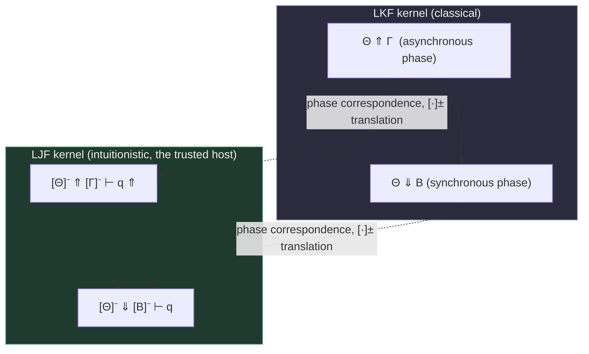

[[book-guidelines|↩ Back to guidelines]]

## Why bother relating the two logics at all

Zoom out to the FPC framework's whole pitch: a small, trusted kernel checks proof evidence by pairing an augmented focused calculus ($LKF^a$ for classical logic, $LJF^a$ for intuitionistic logic — see [[Focused-Sequent-Calculus]] and [[Clerks-and-Experts-as-an-Augmented-Kernel]]) with a certificate specification. But "small and trusted" is a claim about the *kernel*, and if you need two separate kernels — one classical, one intuitionistic — you've doubled your trusted computing base for no good reason. Every line of kernel code is a line someone has to audit before they'll trust anything the checker says "yes" to. So the question this chapter asks is sharp and practical: **can one kernel check evidence for both logics?**

This isn't an idle question about logic-shopping. It's the same instinct that makes you write one parser combinator library instead of two near-identical ones for two near-identical grammars — except here the stakes are "provers trust this code with mathematical certainty," not "this code doesn't crash." Miller's answer is: yes, and specifically, **host the classical kernel on top of the intuitionistic one**, not the other way around. The rest of the chapter is about *why* that direction, and *how* to make the hosting precise enough that you can mechanically derive one set of clerks/experts from the other instead of writing them by hand and hoping.

**What breaks without a precise relationship.** You could, in principle, informally reuse pieces of an intuitionistic checker to approximate a classical one, but "approximate" is exactly what a trusted kernel cannot be. If the correspondence between the two calculi is only true "on average" or "for provable formulas," you've silently reintroduced the thing FPCs exist to eliminate: a checker whose correctness depends on trusting the implementor's judgment rather than on a proof. The chapter's entire technical apparatus — polarized formulas, a specific translation, and a *phase*-level (not just theorem-level) correspondence theorem — exists to close that gap.

## Recap: two sibling calculi, not two unrelated ones

You don't need the full definitions of LKF and LJF here (that's [[Focused-Sequent-Calculus]]'s job), but the one fact this chapter leans on is: **Gentzen's original unfocused LK and LJ already differ by exactly one syntactic restriction.** Both use two-sided sequents, contexts, structural rules, and eigenvariables identically; LJ is just LK with "at most one formula on the right." Liang and Miller's focused versions, LKF and LJF, inherit this family resemblance — they're restrictions of a *common* focusing framework, not two calculi that happen to look similar. That's the structural fact that makes hosting plausible in the first place: you're not bridging two alien systems, you're specializing one design in two different ways.

## The single-conclusion restriction *is* an exponential

Here's the first genuinely new idea in this chapter, and it's worth sitting with because it reframes "intuitionistic" as something more structural than "no excluded middle." Take the classical left-implication rule:

$$\frac{\Gamma_1 \longrightarrow A, \Delta_1 \qquad \Gamma_2, B \longrightarrow \Delta_2}{\Gamma_1, \Gamma_2, A \supset B \longrightarrow \Delta_1, \Delta_2} \; {\supset}_L$$

Impose LJ's "at most one formula on the right" restriction and $\Delta_1$ is forced to be empty. Now compare that to how **linear logic's exponential** `!` behaves at an introduction rule:

$$\frac{{!}\Gamma_1 \vdash {!}A, \Delta_1 \qquad {!}\Gamma_2 \vdash B, \Delta_2}{{!}\Gamma_1, {!}\Gamma_2 \vdash {!}A \otimes B, \Delta_1, \Delta_2}$$

If the left premise's conclusion is required to be bang-marked (`!A`), the same forcing happens: $\Delta_1$ must be empty. **The single-conclusion restriction and the linear-logic exponential are enforcing the identical shape of constraint.** Concretely: LJ's left-hand context is *classical* (contraction/weakening allowed freely, like `!`-boxed formulas), while its right-hand side is *linear* (at most one formula, no free duplication). Intuitionistic logic isn't "classical logic minus a law," in this reading — it's "classical logic where the succedent has been put on a linear-logic diet." That's exactly why direct translations of *intuitionistic* logic into *classical* logic (Gödel's classical S4 modal encoding, Girard's linear-logic `!` encoding) all need to smuggle in extra machinery: they have to re-manufacture the exponential distinction that LJ gets for free from its own restriction. Going the other way — classical into intuitionistic — needs no such extra machinery, which is the first hint about which hosting direction is going to work cleanly.

## Why not just use a double-negation translation?

The classical-into-constructive direction has three textbook answers already: **Gödel's**, **Gentzen's**, and **Kolmogorov's** double-negation translations. All three map a classical formula to an intuitionistically-provable formula (roughly, by doubly-negating enough subformulas that excluded middle becomes intuitionistically derivable via $\lnot\lnot(A \lor \lnot A)$). If you already have three working translations, why does the paper build a fourth?

Because **double-negation translations are theorem-level, not phase-level.** They tell you: *the translated formula is intuitionistically provable if and only if the original is classically provable.* That's a fact about provability, and it's exactly the wrong granularity for a proof-*reconstruction* kernel. Recall from [[Foundational-Proof-Certificates-(FPC)-Framework]] that FPC checking isn't just "yes/no, is this provable" — it has to follow a *specific* certificate through a *specific* sequence of clerk/expert decisions, including down failed branches during reconstruction. If a small LKF proof (say, one with two `decide` rules) gets double-negation-translated into a *much bigger or differently-shaped* LJF proof, then an LKF certificate doesn't tell the LJF kernel anything useful about how to navigate its own search — you've lost exactly the "efficient checking, not just correctness" property the whole FPC framework was built to preserve. Worse, these translations are usually presented for *unpolarized* formulas, and this entire book's machinery — clerks, experts, phases — is built on top of *polarized* formulas from the ground up. A translation that doesn't respect polarity can't slot into a polarized kernel without redesign.

So the paper reaches for something structurally stronger: a translation, due to **Kaustuv Chaudhuri**, that was built specifically to preserve *focusing phases*, one-to-one, formula by formula and proof-step by proof-step.

## Chaudhuri's translation: $[\![\cdot]\!]^+$ and $[\![\cdot]\!]^-$

Fix one negative atom $q$ that never appears in the input — it plays the role of "the" intuitionistic conclusion that every translated sequent proves. Every other atom, whatever its polarity was in the LKF formula, becomes **positive** on the LJF side. Two mutually-recursive maps, $[\![\cdot]\!]^+$ (for positive-context translation) and $[\![\cdot]\!]^-$ (for negative-context translation), do the rest:

$$
\begin{aligned}
[\![t^+]\!]^+ &= t & [\![t^-]\!]^- &= f\\
[\![f^+]\!]^+ &= f & [\![f^-]\!]^- &= t\\
[\![B \vee^+ C]\!]^+ &= [\![B]\!]^+ \vee [\![C]\!]^+ & [\![B \vee^- C]\!]^- &= [\![B]\!]^- \wedge^+ [\![C]\!]^-\\
[\![B \wedge^+ C]\!]^+ &= [\![B]\!]^+ \wedge^+ [\![C]\!]^+ & [\![B \wedge^- C]\!]^- &= [\![B]\!]^- \vee [\![C]\!]^-\\
[\![\exists x.A]\!]^+ &= \exists x.[\![A]\!]^+ & [\![\forall x.A]\!]^- &= \exists x.[\![A]\!]^-\\
[\![A^+]\!]^+ &= A^+ & [\![A^-]\!]^- &= A^+\\
[\![N]\!]^+ &= [\![N]\!]^- \supset q & [\![P]\!]^- &= [\![P]\!]^+ \supset q
\end{aligned}
$$

Read this operationally rather than trying to memorize it symbol by symbol:

- **Positive stays positive, structurally.** A positive LKF connective ($\vee^+$, $\wedge^+$, $\exists$) translated in a positive context ($[\![\cdot]\!]^+$) becomes the *literal same-shaped* LJF connective. No trickery — LJF has essentially the same positive connectives LKF does, so positive-in-positive is a homomorphism.
- **Negative flips through de Morgan duality, then gets wrapped.** A negative connective translated in a negative context ($[\![\cdot]\!]^-$) turns into its *dual*'s translation ($\vee^-$ becomes $\wedge^+$ of the sub-translations, $\wedge^-$ becomes plain $\vee$, $\forall$ becomes $\exists$). This is the same "negation-normal-form" move you already know from LKF's own polarity machinery — negative connectives are secretly positive connectives wearing a "we're really talking about the negation of this" hat.
- **The last line is the load-bearing one.** *Any* negative formula $N$, translated positively, becomes $[\![N]\!]^- \supset q$ — a negative implication into the fixed marker atom $q$. Symmetrically for a positive formula translated negatively. This is where "the whole formula becomes provable *from* the classical side by refuting into $q$" gets encoded: $q$ is acting like a fixed "false" that every branch of the translated derivation is implicitly disproving into, which is precisely the shape a **continuation-passing** encoding takes in compiler terms — every negative subformula becomes "a function to the answer type $q$." If you've ever compiled expressions to CPS or implemented `Result<T, !>`-style never-type continuations in Rust, this is the same move, just inside formula syntax instead of inside a compiler IR.

The key theorem this buys (Chaudhuri, Theorem 12, cited by the paper) is **phase correspondence, not just theorem correspondence**: an LKF-phase ending in $\vdash \Theta \Uparrow \Gamma$ corresponds *exactly* to an LJF-phase ending in $[\![\Theta]\!]^- \Uparrow [\![\Gamma]\!]^- \vdash q \Uparrow$, and likewise for the synchronous sequent form $\vdash \Theta \Downarrow B$ against $[\![\Theta]\!]^- \Downarrow [\![B]\!]^- \vdash q$. "Phase correspondence" is the strictly stronger claim the double-negation translations couldn't give you: not just "provable iff provable," but **"this specific chunk of deterministic-or-choice-laden proof search on one side is exactly mirrored, phase for phase, on the other side."** A `decide` in LKF corresponds to a `decide` in LJF at the matching point in the search; an asynchronous run of forced rules in LKF corresponds to an asynchronous run in LJF. That's what makes it safe to run an LKF certificate *through* the translation and have it steer the LJF kernel correctly, not just land on the right true/false answer eventually.

Two small technical footnotes the paper flags explicitly, because they matter for an actual implementation: Chaudhuri's original setting treats sequent zones as multisets, while this book's zones are ordered lists — the phase correspondence survives that change unmodified. And the `storeR` rule (recall from [[Focused-Sequent-Calculus]] that LJF's single-conclusion asymmetry makes `storeR` linear where `storeL` is not) is applied, under this translation, only to the fixed atom $q$ — never to any "real" translated formula.



## From a formula translation to a mechanical kernel translation

A formula-level and phase-level correspondence is necessary but not yet sufficient for the FPC framework's real goal, which is *executable*: given an LKF's clerks and experts (the deterministic/non-deterministic decision predicates from [[Clerks-and-Experts-as-an-Augmented-Kernel]]), can you **mechanically generate** the corresponding LJF clerks and experts, rather than hand-writing a second, independently-fallible set? Because the correspondence is proved at the level of individual LKF *rules* mapping to small groups of LJF rules (not just "provable formula maps to provable formula"), the answer is yes — and the paper gives the mapping as a literal λProlog rewrite, reproduced here with the LKF-side predicate on the right of `:-` and the newly-derived LJF-side predicate on the left:

| LJF predicate (derived) | defined in terms of LKF predicate |
|---|---|
| `andPos_jc` | `orNeg_kc` |
| `andPos_je` | `andPos_ke` |
| `decideL_je` | `decide_ke` |
| `initialR_je` | `initial_ke` |
| `or_jc` | `andNeg_kc` |
| `or_je` | `orPos_ke` |
| `releaseR_je` | `release_ke` |
| `some_jc` | `all_kc` |
| `some_je` | `some_ke` |
| `storeL_jc` | `store_kc` |
| `true_jc` | `false_kc` |
| `true_je` | `true_ke` |
| `arr_jc`, `storeR_jc`, `arr_je`, `initialL_je` | fixed/free (no LKF counterpart — these govern the $q$-scaffolding itself) |

Notice the diagonal, de-Morgan-shaped pattern in the naming: `or_jc` (an LJF *clerk*, asynchronous) is defined via `andNeg_kc` (an LKF *clerk* for negative conjunction), and `andPos_jc` via `orNeg_kc` — exactly the dual-connective swap the $[\![\cdot]\!]^-$ equations predicted. **This table is not an independent design; it's a compiled artifact of the formula translation.** In implementation terms, this is the difference between hand-writing a second backend for your compiler versus writing one small *lowering pass* that adapts your existing backend's interface — the second backend's "trait implementation" is derived, clause by clause, from the first, and a bug in the derivation is *by construction* a bug in a shared, auditable four-line rule, not two independently-drifting 200-line kernels.

**Rust framing.** If clerks/experts are trait objects — `trait LkfClerk { fn decide(...) -> Cert; }` — this table is exactly an *adapter* `impl LjfClerk for LkfAdapter<C: LkfClerk>` that dispatches each LJF method by calling the wrapped LKF method under the dual connective. You get an `LjfClerk` implementation "for free" for any type that already implements `LkfClerk`, with the translation table playing the role of the blanket-impl's method bodies. The trusted intuitionistic kernel never needs bespoke classical-logic code — it just needs one small, fixed adapter, which is the entire point of "hosting."

## The one case that isn't free: cut

Every rule above translates by a uniform recipe *except* cut, and the reason is illuminating rather than incidental. Cut in $LKF^a$ has two shapes — one for a negative cut formula $N$, one for a positive cut formula $P$ — because the two premises of a cut in a polarized calculus play asymmetric roles depending on which side gets the "positive" (synthesizing) formula and which gets its negation. Figure 23 of the paper spells out how each of those two shapes translates into the corresponding $LJF^a$ cut instance — and *which* premise inherits the $[\![\cdot]\!]^-$-translated formula depends on the polarity of the formula the LKF cut expert actually returns, which is only known **at run time**, not at translation-definition time. That's why the mechanical clause for `cut_je` has to branch on polarity explicitly:

```prolog
cut_je C C1 C2 F :- cut_ke C C1 C2 D,
                    ( isNeg D, negate D P, trans- P F ;
                      isPos D,              trans- D F ).
```

Read this as: *first ask the already-trusted LKF cut expert (`cut_ke`) what formula `D` it wants to cut on; then, depending on whether `D` turned out negative or positive, either negate it and translate ($\mathit{trans}^- \; P \; F$ where $P$ is $D$'s negation-normal-form negation) or translate it directly.* Everything about *how* to pick the cut formula is still delegated entirely to the LKF expert — the LJF side adds no new decision-making capability, only a polarity-dependent repackaging of the answer. This is a nice small proof that "mechanically derived" doesn't mean "syntactically uniform for every rule" — it means "derivable by a fixed, checkable procedure," and sometimes that procedure has an `if`.

## What this buys, and what it costs

**The payoff, stated precisely:** you can build and audit *one* trusted kernel — the intuitionistic $LJF^a$ one — and get classical-logic checking for free by composing it with (1) the $[\![\cdot]\!]^\pm$ formula translation and (2) the mechanically-derived clerk/expert table above. The trusted computing base doesn't grow when you add classical-logic support; only the (untrusted, or at least separately-checkable-by-erasure — see [[Clerks-and-Experts-as-an-Augmented-Kernel]]) translation layer does. This is the same shape of argument as the **de Bruijn criterion** discussed elsewhere in the book ([[Foundational-Proof-Certificates-(FPC)-Framework]]): trust concentrates in one small artifact, everything else is compiled down to it and inherits its guarantees by construction rather than by separate proof.

**The direction is not arbitrary.** Recall the exponential argument from earlier: LJ's single-conclusion restriction already *is* a linear-logic-shaped constraint that LK doesn't have. That extra structure is exactly what gives LJF "room" to represent classical proofs faithfully (via the fixed atom $q$ acting as the always-available linear "conclusion slot") — going the other way would require LKF to somehow manufacture an exponential distinction it doesn't have, which is precisely why direct intuitionistic-into-classical translations need borrowed machinery (S4 modal logic, or linear logic's own `!`) that classical-into-intuitionistic does not.

## Where this leads

This chapter is the paper's clearest demonstration that the FPC framework's "small kernel, many certificate formats" promise (Chapter 1's whole motivation) also survives crossing a *logic* boundary, not just a proof-*format* boundary — the same "atoms, molecules, chemistry" decomposition that lets one $LKF^a$ kernel check CNF decisions, resolution refutations, and Frege proofs (see [[Case-Studies-in-Proof-Certificate-Design]]) is precise enough to let one $LJF^a$ kernel additionally host all of *those*, transitively, through this translation. It's also the paper's most direct link to the **linear logic** thread that resurfaces in the Future Work chapter (the LKU system, unifying multiple logics under one focusing framework) — the single-conclusion-as-exponential observation here is the seed of that later, more general unification.

For the standing project's trusted-kernel and elaborator work: this is the clearest worked example in the book of the **judgment-forms-as-shared-ancestor** thread — a type checker and a proof checker are the same kind of object here, and "hosting one logic's checker on another's" is structurally the same move as hosting a subtyping-relation checker on a more expressive kernel's `isDefEq`, or deriving a restricted elaborator's unification rules mechanically from a more general pattern-unifier instead of writing two unifiers by hand. The polarity-driven, mechanically-derivable adapter pattern here (clerks/experts translated by a fixed table, with one deliberate `if` for the genuinely polymorphic case of cut) is a direct model for how a refinement-type checker's verification-condition generator might itself be hosted on a more general dependent-type kernel's judgment forms, rather than implemented as an independent, separately-trusted pass.
