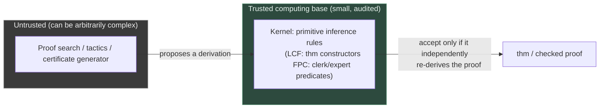

[[book-guidelines|↩ Back to guidelines]]

## What breaks without this

Every earlier chapter of the paper has been building a *specification* — the augmented focused calculi $LKF^a$/$LJF^a$, the clerk/expert relational contract, the FPC framework's claim to describe "any reasonable proof format." Chapter 13 steps back and asks a question the specification itself can't answer: is any of this actually *new*? Trusted-kernel theorem provers already exist. Proof-sharing standards already exist. If you're about to adopt FPCs as your trusted computing base, you need to know what problem they solve that the prior art doesn't — otherwise you're reinventing a wheel, possibly a worse one.

What breaks if you skip this comparison is a design mistake that's easy to make and expensive to unmake: building (or choosing) a proof-checking architecture that is *technology-specific* — tied to one prover's internal proof format — when your actual requirement is *technology-independent* interchange. The paper's central argument in this chapter is that most existing approaches to "trust a proof from elsewhere" are ad hoc in exactly this way, and that ad-hocness has a concrete failure mode: fragility across versions. If prover A's proof-checking code is hand-written to parse prover B's native proof script format, then the day prover B changes that format, A's checker silently or loudly breaks. This is the same brittleness you'd get from writing a parser for a language by pattern-matching on one compiler's error messages instead of its grammar.

## The de Bruijn criterion: the shared ancestor idea

The chapter opens by naming [[Case-Studies-in-Proof-Certificate-Design#The design|the design]] principle that every subsequent example is a variation on: the **de Bruijn criterion**. A theorem prover satisfies it if it contains a small, trusted subsystem — a *kernel* — that checks alleged proofs, while the rest of the prover (proof search, tactics, heuristics, automation) is free to be large, complex, and *untrusted*, because nothing it produces is accepted until the kernel has independently verified it.

The LCF family of provers (Coq, Isabelle, the HOL provers) is the paper's standing example, and it's worth being precise about why this separation matters rather than just naming it. In an LCF-style system, "theorem" is an **abstract datatype**: the only way to construct a value of type `thm` is to call one of a small, fixed set of primitive inference-rule constructors exposed by the kernel module. Tactics, decision procedures, and arbitrarily elaborate proof search can all be layered on top in ordinary, untrusted code — because no matter how convoluted that code is, it can only ever produce a `thm` by routing through the kernel's narrow, audited interface. You don't have to trust the tactic engine; you only have to trust that the kernel's primitive rules are individually sound, and that there are few enough of them to actually check by hand.

This is precisely the same shape the paper has spent twelve chapters building: $LKF^a$/$LJF^a$'s clerk and expert predicates *are* the kernel's primitive interface, and any FPC — however elaborate the surrounding certificate-generation logic that produced it — is only accepted if it drives that fixed kernel to a successful check. The **trusted computing base** (TCB) is exactly what a de Bruijn-criterion kernel is designed to minimize: the set of code you must believe is correct in order to believe every theorem the system ever proves. Everything outside the kernel — proof search, certificate generation, heuristics — is explicitly *not* part of the TCB, because its output is always re-derived through the kernel rather than trusted directly.

This is why the paper can say, in Chapter 14's summary, that the augmented focused proof system is *both* "a formal definition of those proof systems" *and* "an executable specification" — the same dual role an LCF kernel plays for whatever object logic it encodes.

## Why "having a kernel" isn't the same problem as "sharing proofs"

Having a de Bruijn kernel solves trust *within* one prover. It does not, by itself, solve trust *between* provers — and the chapter is careful to separate these as genuinely different engineering problems, because most existing theorem provers get the first one right and the second one wrong or not at all:

> "Most of the theorem provers that contain kernel subsystems do not generally provide their proofs in a format that can be exported, checked, and used by other systems."

A kernel that only ever talks to its own prover's proof-search engine has no reason to expose a stable, external proof format — its internal representation can be as ad hoc and implementation-specific as convenient, because nothing outside the prover ever needs to read it. The moment you want prover A to check something prover B claims to have proved, you need a genuinely different artifact: a **proof certificate** that is meaningful independent of either prover's internals — which is exactly what the paper's FPC framework has been constructing all along, just now framed against the alternatives that already exist for this second problem.

The paper sketches the shared shape of a cross-prover trust protocol: prover B, in order to not be blindly trusted by prover A, must emit a certificate demonstrating that it *found* a proof; prover A checks that certificate using its own (trusted) checking logic. Crucially, A never needs to trust B's implementation — only the individual certificate, checked independently each time. Two examples the chapter cites make the ad hoc failure mode concrete:

- An SMT prover modified to output proof evidence as **Isabelle proof scripts**, checked by Isabelle itself.
- A SAT/SMT prover modified to output proof evidence checkable **within Coq**.

Both are real, working integrations — and both are pinned to the shape and evolution of one specific target prover's internal proof language. If Isabelle's proof-script format changes in a later release, the SMT-to-Isabelle bridge silently stops being trustworthy until someone updates it by hand. That's the concrete cost of "ad hoc and technology-based": correctness of the bridge is coupled to two independently-evolving codebases, with no shared specification either side is obligated to honor.

## The proof-sharing standards, compared against FPC's own claim

The chapter surveys four projects that each try to do better than ad hoc, prover-to-prover bridges — and situating FPC against each one sharpens exactly what "technology-independent" is supposed to buy you.

**OpenTheory.** Narrowest in scope: a shared standard *theory library* specifically for the HOL family of provers. It solves duplication of effort across HOL-like systems, but by construction only within that family — it presupposes a HOL-shaped logic on both ends.

**LFSC** ("Logical Framework with Side Conditions"). An extension of the dependently typed logical framework LF, built specifically to check proof evidence coming out of SMT provers, with an available checker. It has real production traction — used to check proofs from two different SMT provers — but it is purpose-built for the SMT proof-format problem specifically, not a general framework for arbitrary proof systems in arbitrary logics.

**MMT.** Broader: a logic-*independent* framework in which proof systems themselves can be defined, analyzed, implemented, and checked, which is what lets it build proof checkers that don't presuppose any one theorem prover's internals. This is structurally the closest existing idea to FPC's own ambition — both aim to be parametric over *which* logic and proof system you're checking.

**Dedukti.** Built on a still richer logical framework, $\lambda\Pi$-modulo, which bakes in constructive, dependently typed $\lambda$-calculus plus induction (arithmetic) as native machinery. Several real systems — Coq, HOL, FoCaLize, Matita, iProver, Zenon — have been retrofitted to emit Dedukti-checkable proofs, which is a strong existence proof that a sufficiently expressive shared framework *can* attract multi-prover adoption in practice.

So where does FPC actually differ from MMT and Dedukti, its closest competitors? The chapter's answer is about the *foundation* the generality is built on, not about the generality itself:

> "Our goal here has been to provide a technology-independent means of defining the semantics of a range of proof formats in classical and intuitionistic logics."

FPC's technology independence is grounded specifically in **proof theory** — a fixed, [[Focused-Sequent-Calculus|focused sequent calculus]] ($LKF^a$/$LJF^a$) augmented by a *relational specification interface* (clerks and experts) that any proof format is required to instantiate. MMT's independence comes from abstracting over logics at the framework-definition level; Dedukti's comes from a maximally expressive single logical framework ($\lambda\Pi$-modulo) that other systems' logics get encoded into. FPC's bet is narrower and more proof-theoretic: fix *one* well-understood focused calculus as the semantic bedrock, and let clerks/experts — not an extension of the encoding logic itself — carry the format-specific variation. Whether that bet pays off better than MMT's or Dedukti's broader machinery is exactly the kind of comparative question the chapter raises but candidly doesn't resolve; the paper is explicit that it has "not been concerned with exploring the many ways that such specifications can be converted into effective proof checkers" — that's [[Logic-Programming-as-an-Implementation-Substrate|Chapter 11's]] partial answer, and future work's larger one (see below).

## Where this leaves the FPC framework, honestly

It's worth being precise about what this chapter does and doesn't claim. It does not argue FPC is strictly more powerful than MMT or Dedukti, or that LFSC and OpenTheory are somehow deficient for being narrower. It argues something more specific: that FPC's technology independence is *proof-theoretically motivated* rather than framework-engineering-motivated — a semantics for "what proof formats mean" built directly on focusing and polarity, the same machinery the paper spent Chapters 2–3 establishing, rather than on a new logical framework designed from scratch for the checking problem. That's a genuine difference in *kind* of foundation, even where the *practical* reach (which proof formats you can actually encode) may end up comparable.

The chapter closes by flagging the gap between "we have a semantics" and "we have a deployed checking ecosystem" honestly: FPC's clerk/expert specifications are, in principle, directly implementable as logic programs — which is exactly what [[Logic-Programming-as-an-Implementation-Substrate|Chapter 11]] demonstrates for a reference implementation — but the paper is explicit that turning that into the kind of practical, efficient, widely-adopted checker infrastructure that LFSC or Dedukti already have is future work, not a solved problem here. [[Case-Studies-in-Proof-Certificate-Design|Chapter 12's]] closing remarks on relegating trust to external provers (e.g., letting an FPC kernel treat an SMT solver's output as a trusted oracle for one sub-step, the way LFSC-checked SMT proofs already do in practice) are the paper's own acknowledgment that FPC and the existing proof-sharing ecosystem aren't really in competition — a mature FPC-based kernel would likely need to interoperate with, not replace, exactly the standards this chapter surveys.

## Where this leads

This is the paper's "prior art" chapter, and its role in the argument is closural rather than generative — it doesn't introduce new machinery, it justifies the machinery built in every chapter before it by showing what problem existing trusted-kernel and proof-sharing designs leave unsolved. [[Foundational-Proof-Certificates-(FPC)-Framework|Chapter 1's]] four desiderata for proof certificates and this chapter's comparison against LFSC/MMT/Dedukti are two views of the same claim, made at the start and the end of the paper. Chapter 14's one-paragraph conclusion is the paper's own summary of exactly this thread: augmenting LJF/LKF with clerks and experts gives *both* a formal semantics and an executable specification — the de Bruijn-criterion kernel property — for "a range of proof systems," which is the technology-independence this chapter has just spent three pages arguing is genuinely lacking elsewhere.

For the standing project here, this chapter is the direct justification for treating **trusted kernels** (`automated-reasoning`, `type-theory`) as a first-class architectural concern rather than an implementation afterthought: a Rust-based verifier with an embedded theorem prover is exactly the two-part system this chapter describes (untrusted constraint/proof search feeding a small, audited kernel), and the de Bruijn criterion is the concrete design discipline — keep the kernel's primitive rule set small and auditable, and route every proof-search or elaboration result through it rather than trusting search-side code directly — that determines whether that verifier's soundness claim is actually worth anything. The LFSC/Dedukti comparison is also the closest existing precedent for the "let an SMT solver's output be a trusted oracle for one verification-condition discharge step" pattern the CSP-kernel design will eventually need, connecting directly to the `sat-smt-csp` focus area's downstream payoff of solver-backed verification-condition discharge.
