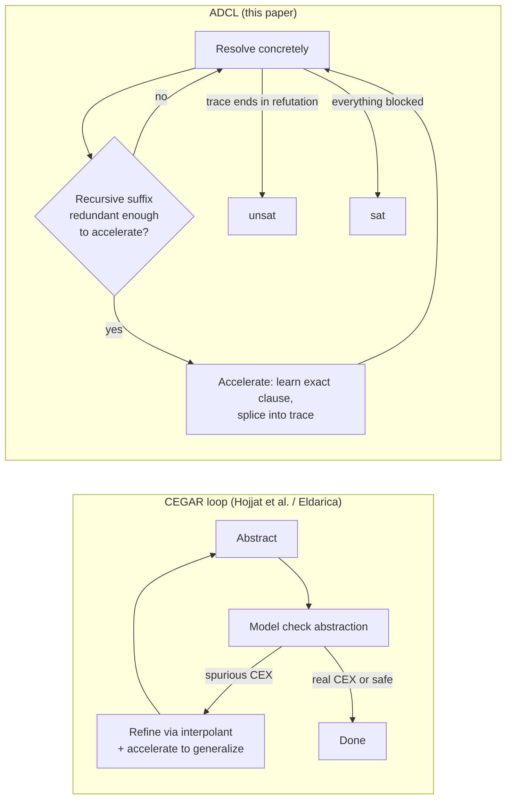

[[book-guidelines|↩ Back to guidelines]]

## Why a related-work section earns its own article here

Every CHC-SAT technique has to answer the same underlying question: *how do you deal with the fact that a recursive clause represents unboundedly many resolution steps?* [[The-ADCL-Calculus]] answers it by learning an exact closed form via [[Loop-Acceleration]] and slotting it directly into a resolution proof. But that is one point in a design space other tools have explored very differently — mainly by **abstracting** the loop instead of **accelerating** it exactly. Understanding those alternatives is what makes ADCL's specific bet legible: every other approach in this section trades away either exactness, generality, or resolution-compatibility, and ADCL is explicit about which of those three it refuses to give up (exactness — see [[Loop-Acceleration]]'s emphasis on `accel` never over-approximating).

The throughline worth holding onto while reading this section: **CEGAR-style tools search over abstractions and refine them when a spurious counterexample appears; ADCL never abstracts at all — it stays in the concrete semantics and instead makes the concrete proof shorter.** That's a genuinely different axis of attack, not just an implementation detail.

## Accelerating interpolants and CEGAR: the closest relative

The most directly comparable prior work (Hojjat et al., cited as [33]) also combines acceleration with CHC-SAT, but plugs it into a **CEGAR (Counterexample-Guided Abstraction Refinement) loop** in two distinct ways:

1. **Acceleration as preprocessing** — compute accelerated clauses for the recursive rules *once, up front*, before any proof search begins, and then hand the enriched clause set to an ordinary CHC-SAT solver.
2. **Acceleration to generalize interpolants inside a CEGAR loop** — when the abstraction-refinement loop produces a spurious counterexample, use acceleration to generalize the resulting Craig interpolant into something that rules out an entire *family* of similar spurious paths at once, not just the one path found.

The paper draws three sharp contrasts against ADCL:

- **"On the fly" vs. up-front.** ADCL only accelerates a resolvent when its proof search actually reaches a point where doing so is useful (see [[The-ADCL-Calculus]]'s Accelerate rule, triggered mid-derivation). Preprocessing accelerates everything recursive, whether or not the eventual refutation ever needs it — cheaper to reason about, but wasted work when a loop is irrelevant to the counterexample.
- **No abstraction, so learned clauses are directly reusable in resolution.** CEGAR's interpolant-generalization approach (2) still lives inside an abstract/refine cycle; its generalized interpolants describe an *abstraction* of reachable states, not a clause that resolution can use exactly as-is. ADCL's accelerated clauses, by construction (exact ground-instance equality, per [[Loop-Acceleration]]), slot into a resolution proof with no semantic gap to bridge.
- **Conjunctive-only vs. arbitrary clauses.** [33] only accelerates conjunctive clauses; ADCL accelerates the *conjunctive variant* (via syntactic implicant projection, see [[Syntactic-Implicants-and-Redundancy]]) of **arbitrary** clauses — disjunctive ones included. This is precisely why ADCL applies acceleration more often, which the paper explicitly ties to finding long counterexamples: a disjunctive loop guard that [33] simply can't accelerate is exactly the kind of loop a deep, hard-to-find bug might hide inside.

The paper is careful to call this relationship **orthogonal rather than strictly superior**: [33]'s CEGAR loop can still analyze recursive CHCs it never manages to accelerate (by refining the abstraction instead), a fallback ADCL doesn't have — ADCL's proof search relies solely on acceleration to handle recursion, so if acceleration systematically fails, there's no separate abstraction mechanism catching the slack. Both preprocessing and CEGAR-interpolant-generalization are implemented in **Eldarica**, but per the authors' own account, generalization (2) is only supported for plain transition systems, not for CHCs in general — which is why the empirical comparison in [[Empirical-Evaluation]] only benchmarks against Eldarica's preprocessing mode ("Eld. Acc.").

## Transition Power Abstraction: exponential reach, over-approximate

**Transition Power Abstraction (TPA)** computes a sequence of over-approximations of a transition system, where the $n$-th element in the sequence captures $2^n$ steps of the transition relation rather than just $n$. This gives TPA the same headline benefit as acceleration — finding refutations that need many iterations, quickly, because you're covering steps exponentially instead of linearly — but by a completely different mechanism: **over-approximation of reachable states**, not an exact closed form.

The distinction matters for what each technique can prove. An over-approximation can quickly confirm *unreachability* claims are false (a real counterexample surviving in the over-approximation is still a real counterexample) but an over-approximating technique alone cannot, in general, certify that an over-approximate "safe" result reflects the concrete system's real safety — that's exactly the gap CEGAR's refinement step exists to close. ADCL sidesteps this gap entirely by staying exact: there is no over-approximation to validate or refine, because `accel`'s contract (per [[Loop-Acceleration]]) guarantees the learned clause has *precisely* the same ground instances as the unrolled original, no more and no less.

## IC3-family abstraction refinement: Spacer, GPDR

**IC3** (for plain transition systems) and its CHC-lifted descendants — **GPDR** and, most prominently, **Spacer** (the CHC-SAT engine bundled with Z3, and one of ADCL's benchmark competitors in [[Empirical-Evaluation]]) — take yet another route: compute a sequence of *abstractions of reachable states*, searching for one abstraction level that is **inductive** with respect to the transition relation and that implies the safety property. Where CEGAR alternates "abstract, then refine on failure," IC3-style algorithms incrementally strengthen a frame sequence until inductiveness is found or a genuine counterexample trace is extracted.

This is a fundamentally different proof strategy from resolution-with-acceleration: IC3/Spacer's central object is an **inductive invariant candidate**, refined frame by frame, while ADCL's central object is a **resolution trace**, extended and occasionally compressed by acceleration. Both ultimately want the same certificate (a refutation, or an inductive invariant proving safety), but IC3-family algorithms never need to unroll a loop at all if they can guess the right inductive strengthening directly — their weak point is exactly the case where no small inductive invariant exists and a genuinely deep counterexample is required, which is the paper's own stated wheelhouse.

The paper also notes, more briefly, that other CHC-SAT approaches exist based on **interpolation**, **CEGAR with predicate abstraction**, **automata-based techniques**, **machine learning**, and **bounded model checking (BMC)** — a reminder that CHC-SAT is a genuinely diverse algorithmic landscape, and ADCL's contribution is a specific new point in it (direct acceleration inside resolution), not a replacement for all of the above.

## Flat acceleration and flattable transition systems

Two more directly comparable techniques target **transition systems** rather than CHCs, but the paper draws the acceleration-methodology comparison explicitly because ADCL's semantic core is a transition-system idea repurposed for resolution:

- **Flat acceleration** ([5]) analyzes a *sequence of flattenings* of a transition system — successive under-approximations that remove nested-loop structure — searching each flattening for a counterexample or a fixpoint. Like ADCL, this does **not terminate in general**. It does terminate, however, for a syntactically identifiable class called **flattable systems**. The paper flags, as an open question, whether ADCL also terminates on flattable systems — a natural conjecture given the structural similarity, but one the authors explicitly leave unresolved. The key limitation the paper calls out in [5]: **no notion of learning or redundancy**, meaning the same sub-computation can be redone across multiple flattenings — exactly the waste that ADCL's blocking-clause/redundancy machinery (see [[Syntactic-Implicants-and-Redundancy]]) is designed to eliminate.
- The related technique of [10] also lifts acceleration to transition systems but sidesteps non-termination differently: it uses **approximative** acceleration in the presence of disjunctions (rather than ADCL's exact syntactic-implicant decomposition), and it learns new transitions only when they are non-redundant — structurally close to ADCL's own Accelerate-then-block discipline, but it accelerates **all syntactic self-loops eagerly**, whereas ADCL only accelerates loops actually reached while exploring the state space from facts outward. The paper notes this technique closely resembles LoAT's own earlier (pre-ADCL) approach to proving non-termination, and cites separate work showing ADCL now supersedes it for that purpose.
- A further technique ([39]) enriches a C program's control-flow graph with under-approximating accelerated edges specifically to help an **external model checker** find "deep counterexamples" (long refutations) faster. Contrasted with ADCL: it delegates the actual counterexample search to an external tool rather than integrating acceleration into the proof search itself, and again has no redundancy notion, so the external model checker may waste effort re-exploring paths that use original (non-accelerated) edges when an accelerated shortcut was available.

## Acceleration for arrays and Boolean variables

Two more specialized threads round out the survey, both relevant to what a CHC-SAT tool must do once real program verification benchmarks (not toy integer loops) are in scope — foreshadowing exactly the complication [[Empirical-Evaluation]] reports LoAT running into with the CHC Competition's benchmark set.

- **Booleans:** the only prior acceleration technique for Boolean variables the authors are aware of ([46]) is explicitly **over-approximating**. As established in [[Loop-Acceleration]], this rules it out for direct use inside ADCL, since `accel`'s soundness requires exact ground-instance equality — an over-approximating Boolean technique would silently make the calculus unsound if plugged in as-is. This is *why* LoAT had to implement its own "simplistic" exact Boolean-acceleration technique rather than reusing [46].
- **Arrays:** two acceleration techniques are cited — one ([15]) that extends a first-order-theorem-prover-based framework with specialized handling for array accesses whose indices move monotonically (increasing or decreasing), and one ([31]) that uses quantifier elimination to accelerate loops whose arrays can be partitioned into read-only and write-only arrays. Both are examples of the same general pattern seen throughout this section: **a decidable/exact acceleration technique exists only for a syntactically restricted sub-case** — monotonic array-index traversal, or read/write-separated arrays — rather than for arrays in full generality.

## Where this leads

This survey exists to calibrate exactly how novel ADCL's central move is: **every other technique surveyed here either abstracts (CEGAR, IC3/Spacer/GPDR, TPA), restricts acceleration to conjunctive clauses only, or lacks a redundancy/learning notion (flat acceleration and its relatives)** — ADCL is the first to combine exact, on-the-fly acceleration of arbitrary (not just conjunctive) clauses with an explicit redundancy-driven learning discipline, directly inside a resolution calculus. [[Empirical-Evaluation]] is where this comparative story gets a quantitative payoff: Spacer, Eldarica (in its preprocessing "Eld. Acc." mode), Golem, and Z3 BMC are benchmarked head-to-head against LoAT, and the refutation-length gap reported there is the concrete evidence for the architectural claims made in this section.

For the standing project: this section is a map of the design space your CSP-kernel and abstract-interpretation components sit inside (`sat-smt-csp`, `static-analysis`). CEGAR and predicate abstraction are named threads in the workbench's own learning goals — seeing them contrasted this explicitly against an acceleration-based alternative is useful precisely because it shows *when* abstraction-refinement is the wrong tool: whenever a genuinely deep counterexample exists and no small inductive invariant does, which is exactly the failure mode a bug-finding CSP kernel (proving presence, not just absence) needs to handle well.
