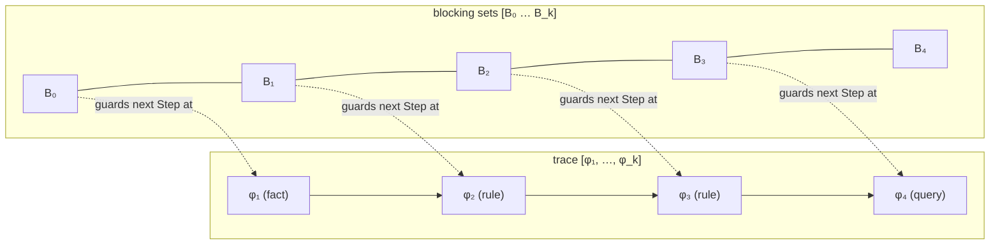

[[book-guidelines|↩ Back to guidelines]]

## The problem: acceleration wants conjunctions, reality gives you disjunctions

[[Loop-Acceleration]] only knows how to accelerate a **conjunctive** CHC — one whose constraint $\psi$ is a plain conjunction of literals, no disjunctions. But real verification conditions are full of disjunctions: a loop body with an `if`/`else` produces a rule whose constraint is naturally "(branch-1-condition $\wedge$ effect-1) $\vee$ (branch-2-condition $\wedge$ effect-2)." If ADCL refused to touch anything but already-conjunctive clauses, it would be useless on any program with a conditional inside a loop.

What breaks without a fix here: you'd either have to (a) never accelerate real programs, or (b) explode every non-conjunctive CHC into its disjuncts *up front*, which for a formula with $k$ independent disjunctions costs you $2^k$ clauses before you've even started proof search — most of which will turn out to be irrelevant to any particular resolution proof. Section 3.1 exists to give ADCL a way to extract *just the one disjunct that resolution actually needs, right when it needs it* — never materializing the exponential blowup.

## Syntactic implicant projection: picking out "the branch that was taken"

**Definition 6 (Syntactic Implicant Projection).** For a quantifier-free constraint $\psi$ in negation normal form and a model $\sigma \models_A \psi$:

$$\mathrm{sip}(\psi,\sigma) := \bigwedge \{\ell \text{ is a literal of } \psi \mid \sigma \models_A \ell\}$$
$$\mathrm{sip}(\psi) := \{\mathrm{sip}(\psi,\sigma) \mid \sigma \models_A \psi\}, \qquad \mathrm{sip}(\varphi) := \{\varphi|_{\psi} \mid \psi \in \mathrm{sip}(\mathrm{cond}(\varphi))\}$$

In words: given a concrete model $\sigma$ that satisfies $\psi$, $\mathrm{sip}(\psi,\sigma)$ is the conjunction of exactly those *literals occurring syntactically in $\psi$* that $\sigma$ happens to make true. Do this for every possible model and you get $\mathrm{sip}(\psi)$, a *finite* set of conjunctive formulas whose disjunction is equivalent to $\psi$ ($\psi \equiv_A \bigvee \mathrm{sip}(\psi)$). Lifted to a CHC $\varphi$, $\mathrm{sip}(\varphi)$ replaces $\varphi$'s condition with each of these conjunctive pieces in turn — literally producing the set of "this CHC, restricted to one branch" clauses.

The word **syntactic** is load-bearing, and the book is careful to give a counterexample showing why: for $\psi := (X>0 \wedge X>1)$, the model set for $X>1$ semantically *entails* $\psi$ (every model of $X>1$ also satisfies $X>0$), but $X>1$ is **not** itself a syntactic implicant, because $\mathrm{sip}(\psi) = \{\psi\}$ — the only implicant is the conjunction of literals actually appearing in $\psi$, since that's what makes the set finite. A genuine semantic-implicant operator would need to search over an infinite space of logically-sufficient formulas; restricting to *syntactically occurring* literals caps that at $2^{|\text{literals}|}$, finite and enumerable.

**What breaks without the "syntactic" restriction:** finiteness. The whole point of $\mathrm{sip}$ is that $\mathrm{sip}(\Phi)$ (the disjunct-free "conjunctified" version of an entire CHC problem, $\Phi \equiv_A \mathrm{sip}(\Phi)$) is something ADCL can enumerate and resolve over as if it were an ordinary flat CHC problem — you need a *guaranteed-finite* replacement for disjunction, and "closed under semantic entailment" doesn't give you that; "closed under syntactic sub-formula" does.

If you've built a DPLL(T)-style SMT solver, or worked with BDD/CNF preprocessing, this move should feel familiar: it's projecting a full Boolean structure down to the *one satisfying cube* a particular model picked, which is exactly the "conflict clause" / "decision cube" idea in CDCL, just running the other direction (extracting the cube that's *true*, not the one that's *false*).

## Computing implicants on the fly, instead of upfront

Here's the catch the paper is explicit about: $\mathrm{sip}(\varphi)$ is **worst-case exponential** in the size of $\mathrm{cond}(\varphi)$ (every literal could independently be "in" or "out" of a given cube). Materializing it eagerly for every clause in the problem would defeat the entire purpose of the exercise — you'd be back to the $2^k$ blowup Section 3.1 was invented to avoid.

The paper's actual implementation strategy is lazier and considerably smarter: **never construct $\mathrm{sip}(\varphi)$ as a set at all.** Instead, when resolving a trace $\vec\varphi$ against a new clause $\varphi$:

1. Conjoin $\mathrm{cond}(\varphi)$ onto the growing resolvent's condition as-is (the *unprojected*, possibly-disjunctive constraint).
2. Search for **one model** $\sigma$ of the combined condition $\mathrm{cond}(\vec\varphi :: \varphi)$ via an SMT solver.
3. *Then*, retroactively replace $\mathrm{cond}(\varphi)$ in the resolvent by $\mathrm{sip}(\mathrm{cond}(\varphi), \sigma)$ — the single conjunctive cube that this particular $\sigma$ picked out.

The result is provably equivalent to having resolved with the conjunctive clause $\varphi|_{\mathrm{sip}(\mathrm{cond}(\varphi),\sigma)}$ directly, but you never had to enumerate the other cubes you didn't need. This is the paper's "on the fly" construction, and it's the single biggest practical idea in this section: **let the SMT solver's model do disjunction elimination for you, one branch at a time, driven by whichever branch the current proof search actually walked into.** [[Implementing-ADCL-in-LoAT]] covers how this interacts with incremental SMT solving in more depth — here it's enough to see *why* the laziness matters.

A Python sketch of the shape (illustrative only — the real system never enumerates full implicant sets, so this is deliberately the "obvious" version Section 3.1 argues against building):

```python
def sip_on_the_fly(trace_condition, new_clause, smt_solver):
    combined = trace_condition & new_clause.cond          # full disjunctive conjunction, unprojected
    model = smt_solver.find_model(combined)                # one SMT call, one witness
    if model is None:
        return None                                        # resolvent would be unsatisfiable — clause is inactive
    cube = conjunction_of_literals_satisfied_by(new_clause.cond, model)  # the sip(cond, sigma) cube
    return new_clause.with_condition(cube)
```

## The redundancy relation: comparing clauses by what they *prove*, not how they're written

**Definition 8 (Redundancy Relation).** For CHCs $\varphi, \pi$:

$$\varphi \sqsubseteq \pi \iff \mathrm{grnd}(\varphi) \subseteq \mathrm{grnd}(\pi), \qquad \varphi \sqsubset \pi \iff \mathrm{grnd}(\varphi) \subset \mathrm{grnd}(\pi)$$

and lifted to a set $\Pi$: $\varphi \sqsubseteq \Pi$ if $\varphi \sqsubseteq \pi$ for some $\pi \in \Pi$. This is the direct payoff of grounding-as-semantics from [[Constrained-Horn-Clauses-(CHCs)]]: redundancy is defined purely in terms of ground-instance containment, never syntactic comparison, so a hand-written original clause and a machine-learned accelerated clause can be compared on equal footing.

Why this matters specifically *because* ADCL learns clauses: an accelerated clause $\varphi^+$ subsumes — is a strict superset of — the ground instances of the ordinary rule it was derived from ($\mathrm{grnd}(\varphi_r) \subset \mathrm{grnd}(\varphi^+_1)$ in the running example, since $\varphi^+_1$ covers *every* $N \ge 1$ repetition, while $\varphi_r$ alone only covers one step at a time). Once you've learned the general clause, re-deriving the same ground facts via the specific one is pure waste. Redundancy is the formal handle ADCL uses to say "don't bother re-deriving what a more general clause already covers" — and, symmetrically, it's also the mechanism that stops ADCL from looping: once a part of the search space is *provably* subsumed, the calculus can discard it for good and never come back.

**What breaks without redundancy as ground-instance containment specifically:** a purely syntactic notion of "have I seen this clause before" would be blind to the fact that $\varphi^+_1$ (learned) and ten million individually-derived instances of $\varphi_r$ describe overlapping — indeed, nested — sets of concrete facts. Proof search would keep re-exploring territory the accelerated clause had already closed off, defeating the entire acceleration idea from the inside.

## Blocking clauses: redundancy operationalized as a search-space pruner

Redundancy on its own is just a relation; **blocking clauses** are how ADCL turns it into an actual pruning mechanism during proof search. Each state carries a sequence $[B_i]_{i=0}^{k}$ of blocking-clause sets, one slot per position in the trace $[\varphi_i]_{i=1}^{k}$ (plus one extra slot for facts, hence $|\vec B| = |\vec\varphi| + 1$). The rule is simple: **a clause $\varphi$ with $\varphi \sqsubseteq B_i$ may not be used for the $(i{+}1)^\text{th}$ resolution step** — i.e., "blocked" clauses are excluded from being the next step in the trace at that position.

A clause becomes blocked in one of two situations (this is where Section 3.1's redundancy machinery directly *becomes* the guard conditions of the calculus proper — see [[The-ADCL-Calculus]] for the full rule definitions of Covered and Backtrack):

- **After exhausting a continuation:** ADCL proves that adding $\varphi$ to the current trace can never lead to $\bot$ (unsat), so there's no point ever trying $\varphi$ again at this position — block it and backtrack.
- **After finding a more general alternative:** the current trace ends in a redundant suffix $\vec\varphi'$ — one where $\vec\varphi' \sqsubseteq \vec\pi$ for some other, shorter-or-equal trace $\vec\pi$ — so continuing down this specific path can't discover anything a more general path (through $\vec\pi$) couldn't already discover. Block the suffix's last clause and try something else.

A structural picture of the trace/blocking-set bookkeeping:



**What breaks without blocking clauses:** without a record of "already-explored-and-exhausted" positions, backtracking search (which is what ADCL fundamentally is — a resolution-proof search with backtracking, not unlike DPLL's clause-learning-driven backjumping) would be free to re-derive the exact same dead-end resolvents indefinitely. Blocking clauses are the CHC-resolution analogue of a SAT solver's learned conflict clauses: both exist to convert "we already know this path fails" into a syntactic object the search procedure can consult cheaply, rather than re-deriving the failure from scratch every time. The one subtlety the book flags explicitly (and that [[The-ADCL-Calculus]] treats carefully): you must *not* block a trace suffix of length exactly 1 under mere weak redundancy ($\sqsubseteq$ rather than $\sqsubset$), or the calculus could block the very last clause it just stepped with and falsely conclude satisfiability — this asymmetry between single-clause and multi-clause suffixes is a genuine soundness-critical detail, not an incidental implementation choice.

## Where this leads

This section supplies two of the three moving parts [[The-ADCL-Calculus]] needs to actually run: $\mathrm{sip}$, computed lazily via one SMT query per resolution step, is what lets ADCL apply resolution and acceleration to arbitrary (non-conjunctive) CHCs without ever materializing an exponential case split; and the redundancy relation $\sqsubseteq$, operationalized through blocking-clause sets, is what makes the calculus's backtracking well-founded rather than an infinite re-exploration of already-closed territory. Both ideas resurface, made concrete, in [[Implementing-ADCL-in-LoAT]] — where "search for a model $\sigma$" becomes a specific incremental-SMT encoding, and "$\varphi \sqsubseteq \Pi$" becomes a finite-automaton language-inclusion check rather than an idealized oracle.

For the standing project (`sat-smt-csp`, `automated-reasoning`): this is a clean worked example of **on-demand disjunction elimination driven by a decision procedure's model**, which generalizes directly to a CSP kernel that needs to reason about branchy verification conditions without paying for full case-split enumeration up front — and the blocking-clause mechanism is a direct, implementable pattern for subsumption-based pruning in any clause-learning or resolution-style proof-search engine, the same way CDCL's learned clauses prune the SAT search tree.
