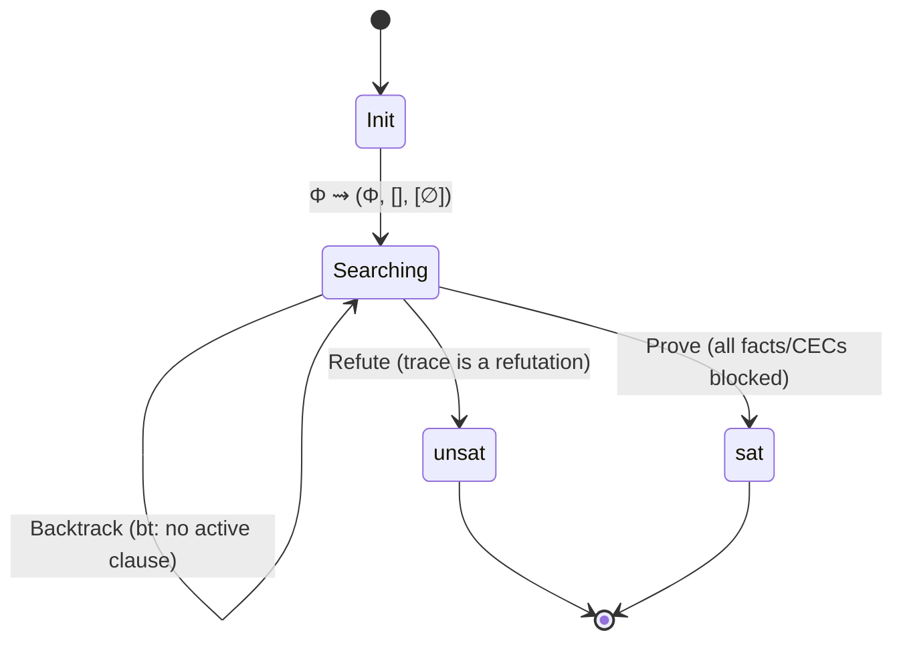

[[book-guidelines|↩ Back to guidelines]]

## Why a proof search needs its own state machine

[[Resolution-for-CHCs]] gives you a single operation — combine two clauses into a resolvent. [[Loop-Acceleration]] gives you another — collapse a recursive clause into its $N$-fold closure. Neither, on its own, tells you *when* to apply which, *what to remember* about the search so far, or *how to know you're done*. That's the gap ADCL itself fills: it's not a new inference rule, it's the **control structure** wrapping resolution and acceleration into a genuine decision procedure (albeit a non-terminating one in general) for CHC-SAT.

What breaks without an explicit state and explicit rules: a naive "keep resolving until you hit $\bot$" loop has no way to prune revisited search space (you'd resolve the same rule against itself forever on a satisfiable problem), no way to decide *when* acceleration is legal versus premature, and no terminal condition for reporting "satisfiable" rather than just failing to find a refutation. ADCL's contribution is precisely this bookkeeping, formalized as a small transition system over an explicit state.

If you've built a SAT solver's CDCL loop, or a Prolog-style resolution engine with backtracking, this will feel structurally familiar: a **trail** (here, the resolution trace), a mechanism for **learning** something from a dead end so you don't repeat it (here, blocking clauses — a close cousin of CDCL's learned clauses, but blocking *search states* rather than *assignments*), and a handful of named transition rules that together define exactly when the search stops.

## The state: a triple, not just a trace

**Definition 9 (State).** A state is a triple

$$(\Pi,\; [\varphi_i]_{i=1}^k,\; [B_i]_{i=0}^k)$$

- $\Pi \supseteq \Phi$ — the **CHC problem**, starting as the original problem $\Phi$ and growing as acceleration *learns* new clauses. Every clause the calculus derives — original or learned — must satisfy $\Pi \supseteq \Phi$; nothing is ever removed.
- $[\varphi_i]_{i=1}^k \in \mathrm{sip}(\Pi)^*$ — the **trace**, a sequence of *syntactic implicants* (see [[Syntactic-Implicants-and-Redundancy]]) representing a partial resolution proof under construction. Note it's drawn from $\mathrm{sip}(\Pi)$, not $\Pi$ directly — the calculus only ever resolves against conjunctive projections, never against a clause with a disjunctive condition.
- $[B_i]_{i=0}^k$ — a **blocking-clause sequence**, one set per trace position (note there's always exactly one more $B$ than there are trace elements: $|B| = |\vec\varphi| + 1$). $B_i$ records clauses that must *not* be reused as the $(i{+}1)$-th resolution step, because that continuation has already been explored and found unproductive.

Clauses in $\mathrm{sip}(\Phi)$ (the original problem, syntactically projected) are **original clauses**; everything in $\mathrm{sip}(\Pi)\setminus\mathrm{sip}(\Phi)$ is a **learned clause** — the accelerated clauses collapsing recursive derivations. A clause $\varphi$ is **blocked** if $\varphi \sqsubseteq B_k$ (redundant with respect to the last blocking set) and **active** if it is not blocked *and* extending the trace with it keeps the accumulated condition satisfiable. Only active clauses are legal next steps.

Here's the state as a Rust struct — the point of writing it this way is that the invariant "$|B| = |\vec\varphi|+1$" and "every clause drawn from $\mathrm{sip}(\Pi)$" become things a constructor can actually enforce, rather than side conditions you have to remember to check by hand every time you mutate the search:

```rust
struct AdclState {
    problem: ChcProblem,             // Π ⊇ Φ, grows via Accelerate
    trace: Vec<Chc>,                 // [φ_1, …, φ_k], each ∈ sip(Π)
    blocking: Vec<BlockingSet>,      // [B_0, …, B_k] — always trace.len() + 1 entries
}

impl AdclState {
    fn is_blocked(&self, phi: &Chc) -> bool {
        let last = self.blocking.last().unwrap();
        last.iter().any(|b| phi.redundant_wrt(b))   // φ ⊑ B_k
    }
    fn is_active(&self, phi: &Chc) -> bool {
        !self.is_blocked(phi) && self.trace_extended_with(phi).condition_satisfiable()
    }
}
```

## The backtrack function

Several rules below share a single primitive: drop the last trace element and fold it into the blocking set immediately below it, so that continuation is never explored again the same way.

$$\mathrm{bt}(\Pi, [\varphi_i]_{i=1}^k, [B_0,\dots,B_k]) := (\Pi, [\varphi_i]_{i=1}^{k-1}, [B_0,\dots,B_{k-1}\cup\{\varphi_k\}])$$

This is exactly a CDCL-style "pop the trail, record what you learned about why this branch failed, don't take it again." The learned fact here isn't a new clause (that's what Accelerate does) — it's "$\varphi_k$ specifically, in this context, is a dead end," folded into $B_{k-1}$.

## The seven rules



**Init** — $\Phi \leadsto (\Phi, [], [\varnothing])$. Every derivation starts here: the original problem, an empty trace, one empty blocking set.

**Step** — if $\varphi \in \mathrm{sip}(\Pi)$ is active, extend the trace: $(\Pi,\vec\varphi,\vec B) \leadsto (\Pi, \vec\varphi{::}\varphi, \vec B{::}\varnothing)$. This is ordinary resolution, one clause at a time — the thing acceleration exists to *avoid* doing thousands of times in a row.

**Accelerate** — if the trace has a recursive suffix $\vec\varphi^\circlearrowleft$ (i.e. $\mathrm{res}(\vec\varphi^\circlearrowleft)$ is a recursive clause) matched one-to-one by blocking sets $B^\circlearrowleft$, replace the whole suffix by the single accelerated clause $\varphi = \mathrm{accel}(\vec\varphi^\circlearrowleft)$, and — crucially — **collapse** the entire corresponding blocking-set suffix down to $\{\varphi\}$:

$$(\Pi, \vec\varphi{::}\vec\varphi^\circlearrowleft, \vec B{::}B^\circlearrowleft) \leadsto (\Pi\cup\{\varphi\}, \vec\varphi{::}\varphi, \vec B{::}\{\varphi\})$$

Add $\varphi$ to $\Pi$ (it's now a learned clause, permanently available for reuse elsewhere) and let it replace the whole unrolled suffix in the trace. The collapse to $\{\varphi\}$ rather than preserving the old per-step blocking history is licensed by $\mathrm{res}(\varphi,\varphi) \sqsubseteq \varphi$ for learned clauses: applying an accelerated clause twice in a row is always subsumed by applying it once (an accelerated clause already covers "any positive number of repetitions"), so blocking it against itself is the only bookkeeping ever needed going forward. **What breaks without the collapse:** if you tried to preserve the old, much longer blocking history verbatim, you'd be carrying dead weight forward that no longer corresponds to anything reachable in the collapsed trace — and worse, you'd have no principled way to know it's safe to discard, since the whole point of that history was to block continuations of a suffix that no longer exists.

**Covered** — if a trace suffix $\vec\varphi'$ is redundant with respect to $\mathrm{sip}(\Pi)$ (strictly redundant, $\vec\varphi' \sqsubset \mathrm{sip}(\Pi)$, or weakly redundant *and longer than one clause*), backtrack: $\mathrm{bt}$ removes the last element and blocks it, but leaves the rest of $\vec\varphi'$ in place so the search can continue differently from there.

The **strict-or-length-$>1$ condition is not a stylistic detail — it's load-bearing for soundness.** If a single clause that is merely weakly redundant ($\varphi \sqsubseteq \pi$ for some $\pi \in \mathrm{sip}(\Pi)$, not strictly) triggered Covered, then Covered could fire immediately after *every* Step or Accelerate — any freshly-added clause is trivially $\sqsubseteq$ itself in $\mathrm{sip}(\Pi)$ — and the search would blithely backtrack every branch, eventually reaching an empty trace with everything "blocked," at which point Prove would fire and falsely certify **satisfiable** on an actually-unsatisfiable problem. The asymmetry (single clauses need *strict* redundancy; longer suffixes only need *weak* redundancy) is exactly what prevents that false-positive path while still letting the search prune genuinely-already-explored multi-step continuations.

**Backtrack** — if every rule and query in $\mathrm{sip}(\Pi)$ is inactive (and the last trace element isn't itself a query awaiting refutation), $\mathrm{bt}$ pops and blocks the last element, same mechanism as Covered but triggered by "nothing more to try" rather than "this path is provably redundant."

**Refute** — if the trace $\vec\varphi$ is itself a refutation (its resolvent is a conditional empty clause with a *satisfiable* condition), the derivation terminates: $\Phi$ is unsatisfiable.

**Prove** — if all facts and conditional empty clauses in $\mathrm{sip}(\Pi)$ are inactive (blocked), the derivation terminates: $\Phi$ is satisfiable, because the entire reachable search space — every possible starting point for a refutation — has been exhausted without success.

## Worked trace (the running example, now as calculus steps)

Recall Example 1's $\Phi = \{\varphi_f, \varphi_r, \varphi_q\}$ from [[Constrained-Horn-Clauses-(CHCs)]]. ADCL's derivation:

$$
\begin{aligned}
\Phi &\overset{I}{\leadsto} (\Phi, [], [\varnothing]) \\
&\overset{S}{\leadsto} (\Phi, [\varphi_f], [\varnothing,\varnothing]) \\
&\overset{S}{\leadsto} (\Phi, [\varphi_f, \varphi_r|_{\psi_1}], [\varnothing,\varnothing,\varnothing]) \\
&\overset{A}{\leadsto} (\Pi_1, [\varphi_f, \varphi_1^+], [\varnothing,\varnothing,\{\varphi_1^+\}]) \\
&\overset{S}{\leadsto} (\Pi_1, [\varphi_f, \varphi_1^+, \varphi_r|_{\psi_2}], [\varnothing,\varnothing,\{\varphi_1^+\},\varnothing]) \\
&\overset{A}{\leadsto} (\Pi_2, [\varphi_f, \varphi_1^+, \varphi_2^+], [\varnothing,\varnothing,\{\varphi_1^+\},\{\varphi_2^+\}]) \\
&\overset{S}{\leadsto} (\Pi_2, [\varphi_f, \varphi_1^+, \varphi_2^+, \varphi_q], [\varnothing,\varnothing,\{\varphi_1^+\},\{\varphi_2^+\},\varnothing]) \\
&\overset{R}{\leadsto} \mathrm{unsat}
\end{aligned}
$$

Seven $\leadsto$-steps total, versus the 10001 ordinary resolution steps this replaces — exactly two Accelerate applications do the work that would otherwise be two separate 5000-iteration unrollings. The Init/Step/Accelerate/Step/Accelerate/Step/Refute shape is worth memorizing: it's the calculus's answer to "explore one branch, learn a closure when you find a self-loop, keep going."

A matching **Covered** example: if you Step twice through $\varphi_r|_{\psi_1}$ before accelerating, the resulting trace $[\varphi_r|_{\psi_1}, \varphi_1^+]$ turns out to be redundant with respect to $\varphi_1^+$ alone ($[\varphi_r|_{\psi_1},\varphi_1^+] \sqsubset \varphi_1^+$, since $\varphi_1^+$ already subsumes any number of $\varphi_r|_{\psi_1}$-steps), triggering two successive Covered backtracks that unwind back to a state equivalent to the direct route above — a concrete illustration of the calculus "self-correcting" an inefficient exploration order without changing the eventual outcome.

And on the **satisfiable side**: replace $\varphi_q$ with a query whose condition $\varphi_1^+$ and $\varphi_2^+$ can never jointly satisfy (e.g. requiring $X_2 \ne 10000$ when the accelerated invariant forces exactly $X_2 = 10000$). The derivation then runs three successive Backtrack steps — unwinding $\varphi_2^+$, then $\varphi_1^+$, then $\varphi_f$ itself, blocking each — until the trace is empty and the sole fact $\varphi_f$ is blocked, at which point **Prove** fires. This is the calculus's only way to conclude satisfiability: by demonstrating, constructively, that every avenue from every fact has been exhausted.

## Forward vs. backward reasoning

As presented, ADCL performs **forward reasoning**: it starts from a fact and resolves toward a query, mirroring "run the program forward and see if it reaches an error state." The paper notes this could just as easily run **backward** (start from a query, resolve toward a fact — the classic logic-programming/Prolog direction) with no change to any other part of the calculus. The tradeoff is purely about *where the interesting non-determinism lives* in a given problem: a rule chain like $F \Rightarrow G$, $G \Rightarrow H$, $G \Rightarrow \bot$ with $H$ heading into a large but ultimately satisfiable sub-problem wastes forward search exploring $H$'s branch, while backward search from $\bot$ finds the two-step refutation through $G$ immediately. Empirically the paper's benchmark suite didn't reward switching, so they kept forward reasoning — but the symmetry is worth noting since it's exactly the same forward/backward tension you'd see choosing between top-down and bottom-up proof search strategies in a resolution theorem prover.

## Reasonable strategies: ruling out pathological derivations

The bare calculus is far too permissive — nothing stops a derivation from Step-ing through a recursive clause 10001 times instead of accelerating it once, which is correct but defeats the entire point. **Definition 14 (Reasonable Strategy)** adds four conditions, none of which changes soundness or completeness, all of which rule out obviously-wasteful derivations:

1. **Covered is mandatory when applicable** to a suffix $\vec\varphi'$ that formed *without any new learning happening in the meantime* — i.e., $\Pi$ was unchanged while $\vec\varphi'$ was being built. (This carve-out matters: after an Accelerate, a trace can temporarily look redundant against the newly-learned clause even though it wasn't redundant when it was originally constructed — forcing Covered in that specific case could, in principle, threaten refutational completeness under non-termination, so the mandate applies only when nothing new was learned.)
2. **Accelerate outranks Step** whenever both are legal — never unroll one more iteration by hand when you could collapse the whole recursive tail at once.
3. **Accelerate targets the shortest non-redundant recursive suffix.** This has two jobs: it blocks learning an already-redundant clause outright, and — more subtly — accelerating short suffixes first produces *more general* learned clauses than accelerating long ones, because $\mathrm{grnd}(\mathrm{accel}(\vec\varphi_2{::}\vec\varphi_3)) \subseteq \mathrm{grnd}(\mathrm{accel}(\vec\varphi_2{::}\mathrm{accel}(\vec\varphi_3)))$ holds but not the reverse — accelerating the inner recursive loop first and then the outer one captures strictly more ground instances than accelerating the whole combined suffix in one shot.
4. **Step from an empty trace only starts with a fact or conditional empty clause** — a structural necessity, since Refute needs a query at the end and a fact at the start, while Prove needs facts to eventually reach the trace (via Step) so they *can* become blocked.

Despite these restrictions, refutational completeness survives (Theorem 15, see [[Metatheoretic-Properties-of-ADCL]]) — the proof strategy is to show that any refutation can be replayed by a reasonable-strategy derivation, always picking the Step that advances "as far as possible" along the target refutation and is maximal with respect to $\sqsubset$, so Covered is never forced to interrupt it.

## Where this leads

This calculus is the synthesis point for [[Constrained-Horn-Clauses-(CHCs)]] (the clause vocabulary the state is built from), [[Resolution-for-CHCs]] (Step's underlying mechanism), [[Syntactic-Implicants-and-Redundancy]] (the $\mathrm{sip}$ and $\sqsubseteq$ machinery every rule's precondition is stated in terms of), and [[Loop-Acceleration]] (what Accelerate actually computes). Everything proven about ADCL afterward — soundness, absence of stuck states, refutational completeness, non-termination — is a property of *this exact transition system*, covered in [[Metatheoretic-Properties-of-ADCL]]. And [[Implementing-ADCL-in-LoAT]] is entirely about how to realize the oracles this calculus assumes (redundancy, satisfiability, acceleration) with real, incomplete, SMT- and automata-based procedures.

For the standing project, this is arguably the single most directly transferable artifact in the whole book (`sat-smt-csp`, `automated-reasoning`): it's a complete, formally justified blueprint for a **clause-learning search loop** — state = (problem, trail, blocking-history), with an explicit backtrack primitive and an explicit "collapse what you just learned" step — that maps almost mechanically onto the CSP kernel's own search-with-learning requirements (searching for counterexamples that break refinement-type invariants is structurally the same problem: extend a partial assignment/derivation, detect when a whole class of continuations is subsumed by something already learned, backtrack and record that fact so it's never re-explored). The blocking-clause mechanism in particular is a direct analogue of conflict-driven clause learning's no-good recording, just phrased over CHC redundancy instead of Boolean assignments.
