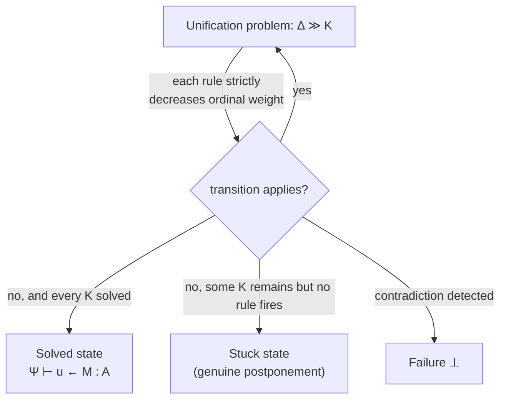
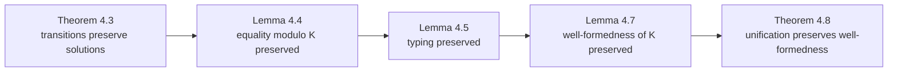

[[book-guidelines|↩ Back to guidelines]]

## Why an algorithm needs a correctness *theorem*, not just a correctness *hope*

Every one of the previous chapters built a machine: a constraint set $\Delta \gg K$, a pile of local rewrite rules (decompose a pair, η-contract a substitution, lower a meta-variable, prune a bad variable, flatten a $\Sigma$-type, solve). None of that machinery is worth anything to a real type checker unless three separate promises hold:

1. **It stops.** A unifier embedded in a compiler's elaboration loop that might spin forever on some input is not a unifier, it's a hang bug waiting to happen.
2. **It doesn't lie.** Every rewrite step has to leave the *set of solutions* untouched — it can't accidentally accept a substitution that doesn't actually satisfy the original equation, and it can't accidentally reject one that does.
3. **It doesn't corrupt the term.** Every intermediate constraint set has to stay well-typed (modulo the constraints themselves), or the "solution" it eventually produces might not even type-check.

This is exactly the gap between "an algorithm that seems to work in the test suite" and "an algorithm you can put in a trusted kernel." Chapter 4 is where Abel and Pientka close that gap for the extended pattern-unification calculus built in Chapter 3. If you are building an elaborator whose unifier feeds a small trusted core (a Lean-style kernel, or a Rust type-checker core that everything else has to answer to), this chapter is the part of the paper that tells you *why* you're allowed to trust the unifier's output at all — not merely that it happens to work on your test cases.

The three promises map directly onto three theorems:

| Promise | Formal statement | Where |
|---|---|---|
| It stops | Theorem 4.1 (Termination) | §4 opening |
| It doesn't lie | Theorem 4.3 (Transitions preserve solutions) | §4.1 |
| It doesn't corrupt the term | Theorem 4.8 (Unification preserves well-formedness) | §4.2 |

We'll take these in order, because each one leans on machinery introduced by the one before it — termination needs a measure over the *whole* problem state; solution-preservation needs to talk about what a "solution" even is; and well-typedness-preservation needs solution-preservation as a lemma (that's the one genuinely surprising dependency, and we'll get to why).

---

## 1. Termination: what breaks without an ordinal-valued measure

### The naive approach fails immediately

The obvious first instinct for proving termination is: define a natural-number size on terms, show every rewrite rule strictly decreases it, done — this is exactly how you'd prove termination of, say, a simple arithmetic-expression evaluator by induction on expression size. Try that here and it breaks on the very first non-trivial rule: **lowering**.

Lowering takes a meta-variable $u$ of function type $\Pi x{:}A.B$ and replaces it with a *fresh* meta-variable $v$ of the (smaller) codomain type $B$, plus a solved assignment $u \leftarrow \lambda x.v$. The *term* $v$ is smaller than $u$'s original type in some sense — but you've just added a whole new active meta-variable to the meta-context $\Delta$. If your only measure is "total size of pending constraints," nothing stops you from lowering the same meta-variable's descendant over and over as flattening interacts with lowering — you need the measure to account for the *entire configuration* ($\Delta$'s active meta-variables, each weighted by the size of its type, plus the outstanding constraints $K$), and you need enough "room" in the number system to make a change that grows one part of the state (new meta-variables) provably still be a net decrease.

### The actual measure

The paper's fix is to work in the **ordinals**, specifically using $\omega$ (the first infinite ordinal) as a multiplier that lets a *finite* decrease in one component dominate an *unbounded* increase in another. Concretely:

- **Term size** $|M|$: the usual node/leaf count of $M$'s tree, **except $\lambda$-nodes are counted twice**. This is a deliberate rigging: it makes an η-expansion step (rewriting a bare $u[\sigma]$ that should be a function into $\lambda x. u[\sigma]\,x$, i.e. introducing a $\lambda$ around it) still a strict decrease in total size, because $|\lambda x.M| + |R| > |M| + |R\,x|$ once you double-count the $\lambda$. Without this trick, η-expansion — which is essential to get some non-pattern constraints into the pattern fragment in the first place — would look like it's *growing* the problem, and no naive measure could ever certify it as progress.
- **Type-in-context size** $|A[\Phi]|$: recursively, $|P[\Phi]| = 1 + \sum_{A \in \Phi} |A[]|$ for an atomic type $P$, $|(\Pi x{:}A.B)[\Phi]| = 1 + |B[\Phi, x{:}A]|$, and — this is the load-bearing case — $|(\Sigma x{:}A.B)[\Phi]| = 1 + |A[\Phi]| + |B[\Phi]|$. A $\Sigma$-type is charged **the sum of both components' full sizes**, deliberately inflated relative to a $\Pi$-type of comparable "shape." This is what "pays for" flattening: when a meta-variable's context gets a $\Sigma$-type split into two separate variables (turning one meta-variable of a record-containing context into a bigger meta-context with no $\Sigma$ in it), the *number* of active meta-variables can go up, but the fat weight that $\Sigma$-types were charged is exactly what licenses that trade.
- **Constraint weight**: a solved constraint weighs $0$. A term-equality constraint weighs $(|M| + |M'|)^\omega + |\Psi|$ if a decomposition step still applies to it, or just $|\Psi|$ otherwise (i.e. once nothing more can be decomposed off a constraint, its residual "stuckness" cost is just the size of its context). Evaluation-context equality constraints get the analogous formula with $|E| + |E'|$.
- **Total problem weight**: $|\Delta \gg K| = \sum_{u:A[\Phi] \in \Delta \text{ active}} |A[\Phi]|^{\omega^2} + \sum_{K \in K} |K|$.

Notice the tower: constraint weights live at the $\omega^1$ scale, but each *active meta-variable's* contribution is raised to $\omega^2$. That's two full "orders of infinity" of headroom: a step that solves or removes one meta-variable can absorb an unboundedly large but *finite* increase in the number and size of remaining constraints, and a step that grows the constraint set (like decomposing a pair into two smaller equalities) can absorb term-size blowup without ever touching the meta-variable tier. **Theorem 4.1** then just asserts: every transition rule in the inference system, by direct inspection, strictly decreases this ordinal. Since ordinals are well-founded (there's no infinite strictly-decreasing sequence of ordinals — this is the entire point of using them instead of naturals, whose only advantage would be familiarity), termination follows immediately, landing in exactly one of three final states: **solved** (every remaining fact is a meta-variable assignment $u \leftarrow M$), **stuck** (no rule applies but it isn't solved — e.g. a genuine non-pattern constraint that has to be postponed), or **failure** ($\bot$).

### What breaks without this

If you skip the ordinal measure and try to bound the algorithm with, say, "the number of meta-variables can only decrease" — false, lowering and flattening both *increase* it. If you try "total term size decreases" — false, η-expansion increases naive term size (that's precisely why $\lambda$-nodes get double-counted). Only a measure that can charge a *type* for the future flattening cost it will incur, and that treats "one meta-variable disappearing" as worth more than any finite number of new small ones appearing, survives contact with the actual rule set. This is the same shape of problem you hit any time you write a proof-search or rewriting engine whose "progress" isn't literally monotone in any single naive counter — you'll recognize the pattern if you've ever had to justify termination of a Gröbner-basis-style completion procedure or a saturation-based prover.



---

## 2. Transitions preserve solutions: soundness and completeness, stated as one theorem

### What counts as "a solution" in the first place

Before "preserves solutions" means anything, you need a crisp definition of *solution*. The paper's: a **solution** to $\Delta \gg K$ is a meta-substitution $\theta$ (an assignment of a closed term to every meta-variable in $\Delta$, well-typed against $\Delta$, written $\Delta' \vdash \theta \Leftarrow \Delta$) such that:

1. for every already-solved fact $\Psi \vdash u \leftarrow M : A$ recorded in $K$, $\theta$ actually assigns $u$ the value $\widehat\Psi.M$;
2. for every still-pending equation $\Psi \vdash M = N : A$ in $K$, applying $\theta$ makes the two sides *literally equal*: $\llbracket\theta\rrbracket M = \llbracket\theta\rrbracket N$.

A **ground** solution additionally closes off any remaining free meta-variables not mentioned in $K$ at all, via a second grounding substitution — this is what lets you talk about "does this whole problem have *any* answer," independent of which sub-parts happen to already be pinned down. Write $\theta \in \mathrm{Sol}(\Delta \gg K)$.

This definition matters because it's exactly the interface a caller (the type-checker's elaborator) needs: it doesn't care about the intermediate rewrite steps, it cares whether, at the end, there's a substitution that makes the original constraints hold. Everything downstream is about proving the rewrite system computes exactly the set of things satisfying *this* definition — no more, no less.

### The two directions, and why both are needed separately

**Lemma 4.2** first nails down a technical prerequisite: whenever $\Delta_0 \gg K_0 \mapsto \Delta_1 \gg K_1$ (one transition step), there's always a meta-substitution $\theta$ relating the old meta-context to the new one, $\Delta_1 \vdash_{K_1} \theta \Leftarrow \Delta_0$ — you never "lose" the old meta-variables' meaning when you introduce new ones (lowering, flattening, and pruning all *add* meta-variables, never silently discard information about existing ones).

**Theorem 4.3 (Transitions preserve solutions)** then states two directions that look superficially similar but are logically independent and must be proved by separate case analyses:

- **Part 1, forward closure ("nothing is lost")**: if $\theta_0$ solves the *old* problem $\Delta_0 \gg K_0$, then there's a solution $\theta_1$ of the *new* problem $\Delta_1 \gg K_1$ that **agrees with** $\theta_0$ after composing through the connecting substitution ($\llbracket\theta_1\rrbracket\theta = \theta_0$). In plain terms: rewriting never throws away a valid answer you already had.
- **Part 2, backward closure ("nothing is invented")**: if $\theta_1$ solves the *new* problem, then $\llbracket\theta_1\rrbracket \mathrm{wk}_{\Delta_0}$ (that composition restricted back down to the old meta-context) solves the *old* problem too. In plain terms: rewriting never accepts a solution that wasn't already implicit in the original constraint.

The paper is explicit that part 2 is "obvious" once Lemma 4.2 is in hand (compose $\theta_1$ with the connecting $\theta$ and you're done), but part 1 needs real work, case by case on which transition rule fired:

- **Decomposition** — trivial for most cases since $\Delta_0$ doesn't even change; the only interesting sub-case is [[Type-Isomorphisms-for-Dependent-Records#Eliminating projections|eliminating projections]] via the $\Sigma\text{-}\Pi$ isomorphism, handled by a substitution lemma (meta-substitution and ordinary variable substitution commute).
- **Lowering** — this is the case that earns its keep. Given $u : (\Pi x{:}A.B)[\Phi]$ and a solution $\theta_0$ assigning $u$ some closed $\lambda x.N$, *typing inversion* on that assignment is what produces exactly the right value for the freshly-introduced meta-variable $v$: the body $N$ underneath the $\lambda$. This is the crux of why lowering is sound at all — you're not inventing a value for $v$, you're *extracting* it from whatever value $u$ was already going to have to take.
- **Flattening** — again a substitution-lemma argument.
- **Pruning** — leans on the pruning soundness lemma from Chapter 3 (Lemma 3.8): pruning produces a substitution $\theta_p$ from the new meta-context to the old one, and any old solution factors through it.
- **Same meta-variable** ($u[\rho] = u[\xi] \rightsquigarrow$ intersect $\rho,\xi$) — the free-variable argument from Chapter 3 (§3.5) is replayed at the semantic level: since $[\rho]M = [\xi]M$ for whatever value $M$ the solution assigns, $M$'s free variables must live entirely inside the sub-context $\Phi'$ where $\rho$ and $\xi$ agree — which is exactly the new, smaller meta-variable's context.
- **Solving** — uses *completeness of inverse substitution* (Chapter 3, §3.3): the assigned value can be recovered as $[\rho/\Phi]^{-1}$ applied to the right-hand side, and inverse substitution is shown to commute with meta-substitution, so the recovered value really is what the old solution already assigned.

Notice the throughline: **every single case reaches back into a lemma proved for a completely different purpose in Chapter 3** (typing inversion, the substitution lemma, pruning soundness, intersection's free-variable characterization, inverse-substitution completeness). The correctness proof isn't a separate argument bolted onto the algorithm after the fact — it's a *forced consequence* of the algorithm having been designed, rule by rule in Chapter 3, so that each rule's soundness lemma was already sitting there waiting to be invoked.

### Why the split matters operationally

If you only proved forward closure, you'd know your unifier never rejects a genuinely correct program (no false negatives) — but you could still have a *broken* unifier that accepts extra, spurious "solutions" that don't actually satisfy the original constraint (false positives), which is far more dangerous in a type checker: it would let ill-typed programs through. If you only proved backward closure, you'd know it never over-accepts, but it might reject a well-typed program because some genuinely valid substitution got lost along the way. **Both together are exactly soundness and completeness of the constraint-rewriting system relative to the semantic definition of "solution."** This is the same soundness/completeness pairing you'd demand of any decision procedure you plug into a trusted kernel — a SAT solver's "UNSAT" answer is only trustworthy if the encoding is both directions sound, not just one.

---

## 3. Transitions preserve typing: why you need Lemma 4.4 before you can prove Lemma 4.5

### The dependency that isn't obvious in advance

The final promise is that the algorithm never derives an ill-typed intermediate state from a well-typed one — remember from Chapter 3 that constraints are checked **modulo the constraint set itself** ($\vdash_K$, "typing modulo"), precisely so that postponed, not-yet-decomposed constraints don't block otherwise-legitimate progress. That relaxation is powerful, but it means "preserves typing" now has to include "preserves typing *modulo K*" — and $K$ itself is changing on every step. This is where **Lemma 4.4 (Equality modulo is preserved by transitions)** comes in as a genuinely necessary stepping stone, not just tidiness:

> If $\Delta_0 \gg K_0 \mapsto \Delta_1 \gg K_1$ and $A =_{K_0} B$, then $A =_{K_1} B$.

The proof is almost embarrassingly short *given* Theorem 4.3: take any solution $\theta$ of $K_0$; since $A =_{K_0} B$ means $\llbracket\theta\rrbracket A = \llbracket\theta\rrbracket B$ for every ground solution, and Theorem 4.3 already told us $\theta$ (composed appropriately) is *also* a solution of $K_1$, the same equation must hold under $K_1$'s notion of equality too. **This is the payoff of having proved solution-preservation first**: type equality modulo constraints is defined semantically (quantifying over ground solutions), so anything that preserves the solution set automatically preserves any semantic fact quantified over that set. Lemma 4.5 (transitions preserve typing proper — if $\Delta_0; \Psi \vdash_{K_0} M \Leftarrow A$ then $\Delta_1; \llbracket\theta\rrbracket\Psi \vdash_{K_1} \llbracket\theta\rrbracket M \Leftarrow \llbracket\theta\rrbracket A$) then goes through by induction on the typing derivation, and the one genuinely interesting case — transitioning between the normal-term and neutral-term typing judgments, i.e. checking vs. inferring — is exactly where you need to already know that equality-modulo-$K$ is transition-stable, which is Lemma 4.4.

So the dependency chain is: **Theorem 4.3 (solutions) $\Rightarrow$ Lemma 4.4 (equality modulo) $\Rightarrow$ Lemma 4.5 (typing) $\Rightarrow$ Lemma 4.7 (well-formedness of the whole equation set) $\Rightarrow$ Theorem 4.8 (the top-level guarantee)**. Semantic preservation has to come first because syntactic typing is *defined in terms of* semantic equality-modulo-constraints, not the other way around.



**Theorem 4.8** is then the chapter's final deliverable, proved by case analysis mirroring Theorem 4.3's structure: for decomposition on pairs, typing inversion on $(M_1,M_2) \Leftarrow \Sigma x{:}A.B$ and $(N_1,N_2) \Leftarrow \Sigma x{:}A.B$ hands you exactly the two smaller well-typed obligations $M_1 = N_1 : A$ and $M_2 = N_2 : [M_1/x]B$ that the rule produces; for pruning and intersection, the soundness lemmas from Chapter 3 (3.8, 3.9) are invoked directly to establish that the newly-introduced meta-variable's type is well-formed in its (possibly pruned or intersected) context.

---

## Grounding the shape of the argument

### In Rust — a state machine with a certified invariant, not just a loop that happens to halt

The three-theorem structure here is precisely what you'd want to *design in* if you were writing this unifier as the core of a Rust elaborator, rather than discover after the fact by fuzzing:

```rust
/// A unification "problem": the meta-variable context plus outstanding constraints.
struct Problem {
    metas: MetaContext,     // Δ — some active, some already solved
    constraints: ConstraintSet, // K
}

/// Every transition rule is a method that consumes a Problem and produces
/// either a strictly "lighter" Problem, or a terminal Outcome.
enum Outcome {
    Solved(Substitution),
    Stuck(Problem),   // genuine postponement — not every non-pattern is a bug
    Failed,
}

impl Problem {
    /// Corresponds to Theorem 4.1: the ordinal weight function.
    /// A real implementation can't compute with actual ordinals, but it CAN
    /// structure the measure as a lexicographic tuple that simulates one:
    /// (meta_count_weighted_by_type_size, constraint_size_sum).
    fn weight(&self) -> (u64, u64) { /* ... */ unimplemented!() }

    /// Each transition is only legal to apply if it provably decreases `weight()`.
    /// Encoding this as a debug_assert! in every rule turns Theorem 4.1 from a
    /// paper proof into an executable invariant check during development.
    fn step(self) -> Outcome { /* dispatch to decompose / lower / flatten / prune / solve */ unimplemented!() }
}
```

The genuinely load-bearing translation is the *lexicographic tuple* standing in for the ordinal $\sum |A[\Phi]|^{\omega^2} + \sum |K|$: Rust (or any real machine) can't represent $\omega^2$-scaled quantities, but a `(usize, usize)` compared lexicographically — meta-variable-tier first, constraint-tier second — is exactly the finite analogue of "two orders of infinity of headroom," and it's a pattern worth recognizing any time you see an ordinal-valued termination argument in a paper: it almost always compiles down to a lexicographic tuple of bounded-but-large naturals in an implementation. The `Stuck` variant matters as much as `Solved` and `Failed`: a real elaborator has to be able to say "I can't decide this *yet*, put it back on the constraint queue" (the dynamic pattern fragment from Chapter 1) rather than being forced into a binary accept/reject.

### In Lean — this is what `isDefEq`'s own correctness argument looks like

This chapter is the closest thing in the whole paper to a direct blueprint for Lean's kernel unifier, `isDefEq`. Lean's `isDefEq` is also a rewrite/decomposition procedure over terms up to definitional equality, and it is also expected to satisfy exactly this trio: it terminates (Lean's kernel uses fuel/reducibility settings and structural descent on WHNF reduction to guarantee this rather than an explicit ordinal, but the *obligation* is identical), it is sound (never reports two terms defeq unless a real proof-relevant sense in which they compute to the same normal form exists — this is Theorem 4.3's analogue), and any metavariable assignment it commits to during elaboration must keep the ambient local context well-typed (Theorem 4.8's analogue — Lean's elaborator likewise cannot let a metavariable assignment escape its declared local context, which is exactly what "typing preserved" is guarding against here). The paper's "typing modulo constraints" ($\vdash_K$) is the formal cousin of the fact that Lean's elaborator routinely checks terms against types that mention *not-yet-resolved* metavariables — postponement is not a hack bolted onto a "real" type theory, it's a first-class judgment form the moment you write real elaboration, and this chapter is one of the few places in the literature that actually proves such a judgment behaves well under rewriting rather than asserting it.

```lean
-- Illustrative sketch, not literal Lean 4 kernel code:
-- the shape of "typing is preserved by a definitional-equality step"
-- that Lemma 4.5 makes precise for this paper's calculus.
theorem isDefEq_step_preserves_typing
    (ctx : LocalContext) (a b : Expr) (ty : Expr)
    (h_step : DefEqStep a b)              -- one rewrite/whnf step, à la a transition Δ₀≫K₀ ↦ Δ₁≫K₁
    (h_ty : ctx.HasType a ty) :
    ctx.HasType b ty :=
  -- proved, in the kernel's meta-theory, by exactly the same
  -- "induction on the typing derivation, appeal to equality-preservation
  -- first" shape as Lemma 4.5 here.
  sorry
```

---

## Where this leads

Chapter 4 is the paper's structural keystone: it's the reason the rewrite rules built in Chapter 3, and the further rules added for the unit/singleton extension in Chapter 5, can be trusted at all rather than merely trusted to *usually* work. Every subsequent extension in the paper (singleton types in Chapter 5) has to be checked against this same three-theorem bar — indeed Chapter 5's whole complication (η-equality no longer preserving free variables) is precisely a case where a *naive* extension would silently violate the invariants this chapter established, which is exactly why the singleton extension needs its own type-directed machinery rather than just adding a rule and hoping.

**For the elaborator project this vault is building toward** (Focus Area: `automated-reasoning`, with a direct load-bearing connection to `type-theory`'s trusted-kernel concerns): this chapter is the template for how to *argue*, not just implement, that a Miller-pattern-style metavariable unifier is safe to sit underneath a bidirectional elaborator whose output a small trusted kernel has to accept unchecked. The specific pattern worth carrying over directly — semantic preservation (Theorem 4.3) proved *before*, and used to derive, syntactic preservation (Lemma 4.5, Theorem 4.8) — is a reusable proof architecture, not a fact specific to this calculus: any time your own compiler's unifier or constraint solver defines equality/satisfiability semantically (quantifying over solutions or models, exactly as `Sol(Δ≫K)` does here), the cheapest path to "the solver preserves typing" runs *through* "the solver preserves the solution set" rather than around it. That's the one idea from this chapter worth remembering even after the ordinal arithmetic fades: **prove your rewrite system sound and complete against its semantics first; typing-preservation and trusted-kernel safety fall out as corollaries, not as a second independent proof effort.**
