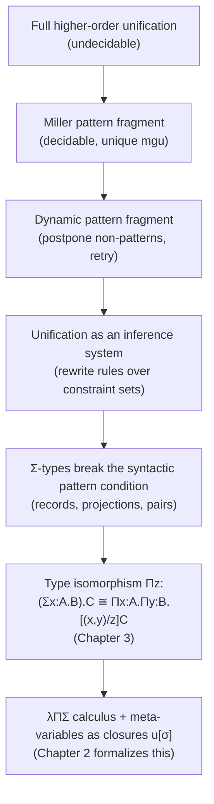

# Higher-Order Pattern Unification

[[book-guidelines|↩ Back to guidelines]]

## Why unification needs a decidable fragment at all

Start from the problem a type-checker (or an elaborator, or a logic-programming interpreter) actually has to solve: it has produced two terms that are *supposed* to be equal, and one or both of them contain holes — placeholders for information the surrounding context hasn't pinned down yet. In an elaborator these holes are implicit arguments, or the return type of a function you haven't finished inferring; in a resolution-based prover they're the logic variables a clause gets instantiated with; in a logical framework like Twelf or Beluga they're the metavariables standing for a derivation you're still constructing. Solving the equation means finding substitutions for the holes that make both sides identical (up to whatever notion of equality the calculus uses). That's **unification**.

First-order unification — no holes standing for functions, only for individual terms — is old, decidable, and has a unique most general solution (syntactic unification, Robinson's algorithm). The moment your language has binders and functions as first-class values, and a hole is allowed to stand for a *function* (equivalently, to be applied to arguments), you're doing **higher-order unification**. And higher-order unification, in full generality, is **undecidable** (Goldfarb, 1981). There is no algorithm that, given two terms possibly containing meta-variables applied to arbitrary arguments, always decides whether they can be made equal. If you're building a type-checker whose termination you want to prove, "in general it's undecidable" is not an option you get to shrug off — you either restrict what kinds of unification problems you generate, or you accept that your checker can loop forever on some inputs.

**What breaks without a restriction:** consider a meta-variable applied to a *non-variable* term, e.g. $X\,(\mathrm{suc}\,y) \stackrel{?}{=} \mathrm{suc}\,y$. This has more than one solution — $X = \lambda z.\,z$ and $X = \lambda z.\,\mathrm{suc}\,y$ both work (the latter simply ignoring its argument) — and worse, there's no single "most general" one that subsumes the others in this calculus. Once most-general unifiers stop existing, you either enumerate a search space (expensive, possibly infinite) or you need extra machinery to pick a canonical answer. Miller's insight was to find a large, practically useful sub-class of problems where this ambiguity provably never arises.

## The Miller pattern fragment

**Definition (pattern).** A unification problem is a *pattern* if every meta-variable occurring in it is applied only to a list of **pairwise-distinct bound variables**.

Concretely: $\lambda x\, y\, z.\; X\, x\, y \stackrel{?}{=} \lambda x\, y\, z.\; x\,(\mathrm{suc}\,y)$ is a pattern, because the only meta-variable, $X$, is applied to $x$ and $y$ — two distinct bound variables, nothing else. And it has an obvious, unique solution: match the binder structure directly and read off $X = \lambda x\, y.\; x\,(\mathrm{suc}\,y)$.

Miller (1991) proved that the pattern fragment is **decidable** and that every solvable pattern problem has a **most general unifier**, computable by a syntax-directed algorithm — the higher-order analogue of Robinson's algorithm, restricted to exactly the cases where the ambiguity above can't occur. The reason this works is intuitive once you see it: because $X$'s arguments are *distinct bound variables*, the correspondence between $X$'s arguments and the positions in its eventual definition is unambiguous — there's no aliasing (the same variable showing up twice, which would force two different sub-terms to be equal) and no "argument is itself a compound expression" case, which is exactly what created the multiple-solutions problem above.

**Non-pattern examples**, each violating the definition in a different way — these are exactly the deviations the paper's introduction (p. 1) uses to delimit the fragment:

| Problem | Violation |
|---|---|
| $\lambda x\,y\,z.\;X\,x\,x\,y \stackrel{?}{=} \dots$ | $X$ applied to $x$ **twice** — not pairwise-distinct (non-linear) |
| $\lambda x\,y\,z.\;X\,(Y\,x)\,y \stackrel{?}{=} \dots$ | $X$ applied to **another meta-variable's application**, not a bare variable |
| $\lambda x\,y\,z.\;X\,x\,(\mathrm{suc}\,y) \stackrel{?}{=} \dots$ | $X$ applied to a **non-variable term** ($\mathrm{suc}\,y$) |

Each of these reopens the ambiguity that patterns close off. In the non-linear case, for instance, $X$'s two occurrences of $x$ could resolve into a solution that treats them uniformly or one that only pretends to (by ignoring one occurrence's provenance), and there's no longer a canonical choice.

*What breaks without the restriction, concretely:* if your elaborator generates a non-pattern constraint and you naively try to solve it as if it were a pattern, you either produce a **wrong** (non-most-general, or outright unsound) substitution, or you have to fall back to a search procedure with no termination guarantee — precisely the undecidable general case you were trying to avoid.

## The dynamic pattern fragment: postponement instead of rejection

Here's the practical wrinkle. If a real type-checker only ever *accepted* pattern problems and *rejected* everything else outright, it would reject constraints that are perfectly solvable — just not yet, because not enough information has accumulated. Consider a constraint that currently looks like $X\,(Y\,x) \stackrel{?}{=} \dots$ (a non-pattern, since $X$ is applied to $Y\,x$, not a bare variable). If $Y$ later gets solved to something like $\lambda z.\,z$, the constraint simplifies to $X\,x \stackrel{?}{=} \dots$, which *is* a pattern. Rejecting the constraint the moment it's created throws away a solvable problem.

Systems like Agda, Beluga, λProlog, and Twelf handle this by **postponing** non-pattern constraints: solve everything that's currently in the pattern fragment, and delay the rest, hoping further solving simplifies a delayed constraint back into the fragment. This is the **dynamic pattern fragment** (Michaylov and Pfenning, 1992) — "dynamic" because membership in the fragment is re-evaluated as solving proceeds, not decided once and for all at constraint-creation time.

This has a structural consequence for how you *architect* the unifier: it can no longer be a single recursive function that either succeeds or fails outright. It has to be described as an **inference system** — a set of small, individually-justified rewrite rules over a *constraint set*, applied non-deterministically until either an inconsistency ($\bot$) surfaces or no more rules apply (a solved state, or a "stuck" set of still-postponed constraints). This reframing — unification as constraint-set rewriting rather than a single-shot algorithm — is the paper's chosen presentation style for everything that follows in later chapters (decomposition, η-contraction, lowering, pruning), and it's worth internalizing now because every later chapter is just "here's one more rewrite rule for this system."

## Why dependent record types force a further extension

The pattern fragment as stated above is about the pure $\lambda\Pi$-calculus (dependent functions only). The moment you add dependent pair ($\Sigma$) types — used in Beluga and Twelf to group assumptions, and appearing as records with η-equality in Agda — the fragment as literally stated becomes too narrow for terms that are, semantically, perfectly pattern-like. The paper's example (p. 3): the following three terms should be considered equivalent —

$$
\text{(1) } \lambda y_1.\lambda y_2.\; X\,(y_1, y_2) \qquad
\text{(2) } \lambda y.\; X\,(\mathrm{fst}\,y)\,(\mathrm{snd}\,y) \qquad
\text{(3) } \lambda y_1.\lambda y_2.\; X\,y_1\,y_2
$$

Only term (3) is literally a Miller pattern — $X$ applied to two distinct bound variables. Term (1) applies $X$ to a *pair* $(y_1, y_2)$, not to bare variables; term (2) applies $X$ to two *projections* out of $y$, not to $y$ itself. Both are "morally" patterns — they carry exactly the same information as (3) — but neither satisfies the syntactic definition.

The paper's resolution is the idea the entire rest of the book builds on: exploit a **type isomorphism**. A function into a $\Sigma$-type is isomorphic to a pair of functions:

$$
\Pi z\!:\!(\Sigma x\!:\!A.\,B).\,C \;\cong\; \Pi x\!:\!A.\,\Pi y\!:\!B.\,[(x,y)/z]\,C
$$

Read this as: "a function that takes one argument of pair-type $\Sigma x{:}A.B$ is the same information as a function that takes the two components of the pair as separate arguments, in curried form." Applied to a meta-variable, this lets you rewrite $X$ at $\Pi x{:}A.\Sigma y{:}B.C$ into two meta-variables $X_1 : \Pi x{:}A.B$ and $X_2 : \Pi x{:}A.[X_1\,x/y]C$ — mechanically translating term (1) into the shape of term (3), and (with an analogous unfolding of the *variable* $y$ into a fresh pair $(y_1, y_2)$) term (2) as well. This is the paper's central technical device, previewed here and developed fully once $\Sigma$-types and the isomorphism are formalized (Chapter 3's topic). The introduction is explicit that this — not merely "add a rule for pairs" — is what makes the extension work: rewriting the *problem* into the pure pattern fragment, rather than inventing a separate unification theory for records from scratch.

One more architectural choice flagged here that matters for everything downstream: meta-variables are represented as **closures**, $u[\sigma]$ — a meta-variable paired with a *suspended explicit substitution* $\sigma$ for its context — rather than as a bare higher-order variable that gets directly applied to arguments. Instead of writing $X\,x\,y$ for a meta-variable at $\Pi\vec x{:}\vec A.B$, you write $u[x,y]$, where $u : B[x{:}A,y{:}B]$ carries its own local context explicitly. This is "contextual objects" in the sense of Nanevski, Pfenning, and Pientka: the meta-variable knows the context it will eventually be checked against, and substitution into it is a first-class, delayed operation rather than something you re-derive every time. The paper flags two payoffs: no need to synthesize explicit λ-prefixes when a metavariable is finally instantiated, and — crucially for the pruning operation of Chapter 5 — a clean way to state "which bound variables might this metavariable's eventual solution depend on," which the closure's substitution domain answers directly.

## Grounding the idea in code

**Rust — modeling the constraint-set inference system.** The move from "one function that unifies two terms" to "an inference system on a constraint set" is exactly the shift you make when you go from a naive recursive-descent unifier to a worklist-based one — the shape any real Rust elaborator ends up in. A first sketch of the *state* this algorithm manipulates:

```rust
enum Term {
    Neutral(Head, Vec<Elim>),           // E[H] or E[u[substitution]]
    Lambda(Box<Term>),
    Pair(Box<Term>, Box<Term>),
}

enum Head {
    Const(ConstId),
    Var(usize),          // de Bruijn index
    Meta(MetaId, Substitution),
}

enum Elim { App(Term), Fst, Snd }        // the "evaluation context" E, spine-style

struct Substitution(Vec<Term>);          // σ: what each context var maps to

enum Constraint {
    Trivial,                              // ⊤
    Inconsistent,                         // ⊥
    TermEq { ctx: Ctx, lhs: Term, rhs: Term, ty: Term },
    Postponed(Box<Constraint>),           // outside the pattern fragment, for now
}

struct Solver {
    constraints: Vec<Constraint>,
    metas: HashMap<MetaId, MetaState>,    // Unsolved(Ctx, Type) | Solved(Term)
}
```

The solver's main loop is not "solve(lhs, rhs) -> Result<Subst, Error>" — it's "repeatedly find a constraint you can *rewrite*, apply that rewrite, and re-check whether previously-postponed constraints have become patterns now." That's the dynamic-pattern-fragment discipline made concrete: `Postponed` constraints get periodically re-examined, exactly the way this section describes real systems behaving. A pattern check is a small, decidable predicate over `Substitution`:

```rust
fn is_pattern_meta(head: &Head, args: &[Elim]) -> bool {
    match head {
        Head::Meta(_, sigma) => {
            let mut seen = HashSet::new();
            sigma.0.iter().all(|t| match t {
                Term::Neutral(Head::Var(i), elims) if elims.is_empty() => seen.insert(*i),
                _ => false,   // not a bare variable, or a repeat -> not a pattern
            })
        }
        _ => true,
    }
}
```

This is a direct transcription of the definition: every argument must be a bare (elims-empty) variable, and `seen.insert` returning `false` on a repeat catches non-linearity for free.

**Lean — this is what `isDefEq` is doing.** Because this topic is squarely about elaboration and unification, Lean's own kernel/elaborator is the most literal cross-check available, not just an analogy. When Lean's elaborator hits a goal like `?m x y =?= f x (g y)` during implicit-argument inference, it is running exactly this algorithm: check whether `?m`'s arguments are distinct free/bound variables (a pattern check — Lean calls a solvable, pattern-shaped metavariable assignment "an assignable pattern unification problem" internally), and if so, assign `?m := fun x y => f x (g y)` directly; if not — say the elaborator produces `?m (g y) =?= e` — the constraint gets **postponed** (Lean's `isDefEq` literally defers such constraints onto a queue) until later unification of `g y` or of the metavariable in `g`'s position resolves it into pattern shape. You can state the correspondence precisely:

```
Miller pattern fragment          ↔  Lean: a metavariable applied to distinct fvars/bvars
dynamic pattern / postponement   ↔  Lean: isDefEq postpones and retries via `synthetic opaque` /
                                       delayed-assignment metavariables
most general unifier exists      ↔  Lean: assignment is by direct abstraction, no search
```

A minimal Lean snippet capturing the *shape* of a pattern-solvable goal (not Lean's actual elaborator internals, but a faithful miniature of the check-then-assign step):

```lean
-- ?m is a metavariable standing for a function of x y; if the constraint is
-- `?m x y =?= x + y` with x y distinct local variables, assignment is immediate:
example (x y : Nat) : Nat := by
  -- elaborating `?m x y =?= x + y` here is pattern unification in miniature:
  -- Lean reads off `?m := fun x y => x + y` directly, no search performed.
  exact (fun (x y : Nat) => x + y) x y
```

**Python — a five-line pattern check, for contrast.** Where Rust's ownership ceremony would obscure the one-line point:

```python
def is_pattern(args):                 # args: list of variable names the meta is applied to
    return len(args) == len(set(args)) and all(isinstance(a, str) for a in args)
```

That's the entire syntactic content of "pattern" once you strip away the calculus: distinct, and bare variables. Everything else in this chapter — postponement, the $\Sigma$-isomorphism, closures — is machinery built *around* preserving the ability to run this one-line check as often and as late as possible.

## Where this leads

Structurally, this chapter is the argument for the whole book's method:



Chapter 2 immediately formalizes the closure representation ($u[\sigma]$, contextual objects) and the rigid/flexible/strongly-rigid vocabulary this chapter only gestures at; Chapter 3 is where the type isomorphism sketched above becomes a real rewrite rule (Σ-flattening) inside the inference system this chapter names but doesn't yet define in full; Chapter 4's termination and correctness proofs are only meaningful *because* the algorithm was committed here to the "small rewrite steps on constraint sets" architecture rather than a monolithic procedure.

For the standing goal of building a Rust elaborator with a Miller-style metavariable unifier: this chapter is the specification of the *tractable core* your unifier must implement correctly before you add anything else — the pattern check above, done right, is the load-bearing decidability boundary your whole implicit-argument-resolution pipeline depends on (`automated-reasoning`: this *is* the metavariable unifier the standing project names explicitly). The postponement discipline is equally load-bearing for `automated-reasoning`'s proof-reconstruction angle: a trusted kernel that defers rather than rejects non-pattern constraints is what lets elaboration succeed on realistic dependently-typed programs at all, and it's the same postpone-and-retry discipline your CSP/constraint-propagation kernel will need when a constraint isn't immediately decidable but becomes so after further propagation.
