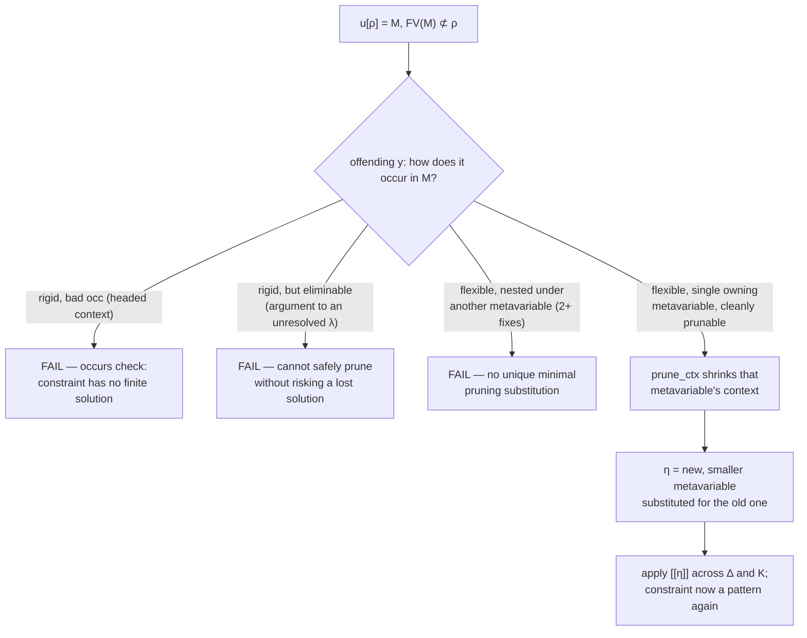

[[book-guidelines|↩ Back to guidelines]]

## Why unification needs a scalpel, not just a hammer

A first-order unifier's occurs check is a yes/no gate: does the variable you're about to bind appear in the term you're binding it to? If yes, refuse (you'd build an infinite term); if no, bind and move on. Higher-order pattern unification inherits that gate, but it also inherits a much sharper problem that first-order unification never has to face: a metavariable in this calculus isn't just a name, it's a name *paired with an explicit context of the bound variables it's allowed to depend on*. Miller's original insight was that when a metavariable $u$ is applied only to a list of *distinct* bound variables — a "pattern" — you can read off a most general solution instantly, because that list literally *is* $u$'s allowed dependency set.

But real constraint solving doesn't hand you clean patterns from the start. It hands you things like

$$u[x] = \mathrm{suc}\,(v[x,y])$$

where $v$ is a *nested* metavariable whose own applied variables include one, $y$, that $u$'s side of the equation never mentions. This isn't malformed — it's an entirely ordinary intermediate state that shows up constantly once you allow constraint postponement (which you must, for practical dependent type reconstruction — see the "typing modulo" discussion in §3.1). The question this section answers is: when a metavariable's instantiation *would* need to mention a variable that some other part of the constraint says it isn't allowed to depend on, can you still solve the problem by cutting that variable out of the offending metavariable's scope — or must you give up?

That cutting operation is **pruning**. Its safety net — the case where cutting isn't enough and the constraint is provably unsolvable — is the **occurs check**, generalized far beyond "does $u$ appear in $M$" to "does $u$ appear in $M$ in a way that could *only* be undone by an infinite term."

**What breaks without pruning.** If the algorithm only ever attempted the top-level Miller check (all-distinct-bound-variables) and bailed the moment it saw a nested metavariable like $v[x,y]$ where $y$ escapes $u$'s scope, it would reject constraints that are perfectly solvable — the second half of the example above, $v[x,\mathrm{zero}] = f(x,\mathrm{zero})$, tells you outright that $v$ never actually uses its second argument. Refusing to look would throw away a real, unique solution. Conversely, if the algorithm *always* assumed such variables could be silently dropped, it would unsoundly accept constraints that have no solution at all, like $u[x] = \mathrm{suc}\,y$ with $y$ occurring free and unconstrained. Pruning plus the occurs check is the machinery that tells these two situations apart correctly, every time — that's the entire correctness burden of this section.

## The escaping-variable problem, formally

The paper states the underlying invariant plainly (p. 13): if a constraint $u[\sigma] = M$ has a solution $\theta$, then substituting through gives $[\![\theta]\!]M = [\![[\![\theta]\!]\sigma]\!]\,\theta(u)$, and since $\theta$ is a *closed* (ground) solution, free variables can only shrink as you substitute, never grow:

$$\mathrm{FV}(\sigma) \supseteq \mathrm{FV}([\![\theta]\!]\sigma) \supseteq \mathrm{FV}([\![[\![\theta]\!]\sigma]\!]\,\theta(u)) \supseteq \mathrm{FV}([\![\theta]\!]M).$$

In words: **whatever free variables survive on the right-hand side after full instantiation must already have been available through $\sigma$.** So if you observe $\mathrm{FV}(M) \not\subseteq \mathrm{FV}(\sigma)$ *before* solving — some variable in $M$ that $\sigma$ doesn't mention — that's not automatically a contradiction (a later substitution could still erase that variable, e.g. [[The-lambda-Pi-Sigma-Calculus-with-Meta-Variables#Hereditary substitution|hereditary substitution]] can delete a case-branch that never gets taken), but it does mean you cannot solve $u[\sigma] = M$ *as it stands*. You need a most general **meta-substitution** $\eta$ that prunes exactly the offending variables out of $M$, so that $\mathrm{FV}([\![\eta]\!]M) \subseteq \mathrm{FV}(\sigma)$ — restoring the pattern shape the top-level algorithm needs.

This is exactly the compiler-writer's occurs check, generalized: instead of asking "is this one variable free in this one term," you're asking "is the *entire escaping set* eliminable, and if so, what's the *unique weakest* rewrite of every metavariable involved that eliminates it."

```rust
// A sketch of the invariant being checked, not the full algorithm yet.
// `sigma_scope`: the variables u is contextually allowed to depend on.
// `rhs_free_vars`: free variables actually occurring in M.
fn scope_violation(sigma_scope: &VarSet, rhs_free_vars: &VarSet) -> VarSet {
    // Every variable here is a candidate for pruning (or a proof of failure).
    rhs_free_vars.difference(sigma_scope).cloned().collect()
}
```

## Three ways pruning can fail

The paper is careful to enumerate exactly which escaping occurrences can be pruned away and which can't (p. 14), because getting this wrong in either direction breaks soundness or completeness:

**1. Bad (non-eliminable) rigid occurrences.** In $u[x] = c\,y\,v[x,y]$, the offending variable $y$ occurs *rigidly* — directly under the constant $c$, not hidden inside any metavariable's suspended substitution. No future instantiation of any metavariable can make that occurrence of $y$ disappear; $c\,y\,\ldots$ will always mention $y$. This constraint is simply unsolvable — this is the occurs-check failure case.

**2. Flexible occurrences buried under another metavariable, with no unique minimal fix.** In $u[x] = v[x, w[x,y]]$, the offending $y$ sits inside $w$'s argument list — flexibly, not rigidly. There are *two* independent, incomparable ways to make the escaping variable go away: prune $v$'s second slot ($\eta_1 = \overline{x,y}.\,v'[x]/v$), or prune $w$'s dependency on $y$ ($\eta_2 = \overline{x,y}.\,w'[x]/w$). Neither is more general than the other, so committing to either one can silently lose solutions. The algorithm as presented here does *not* attempt to resolve this ambiguity (the paper notes Reed's more ambitious, but non-terminating, proposal handles it via placeholder variables instead).

**3. Rigid, but eliminable.** This is the subtle one, and the paper works a full example: take $u : C[x{:}A]$, $v : C[z{:}(A\to A\to A) \to A]$, and the constraint

$$x{:}A,\, y{:}A \;\vdash\; u[x] = v[\lambda k.\,k\,x\,y] : C.$$

Here $y$ occurs *rigidly* — under no metavariable — inside the term passed to $v$. Naively you might treat "rigid" as synonymous with "bad." But suppose $v$'s eventual solution is $\theta(v) = \overline{z}.\,z\,(\lambda x\,\lambda y.\,x)$: substituting that in, $\lambda k.\,k\,x\,y$ becomes $(\lambda x\lambda y.\,x)\,x\,y$, which $\beta$-reduces straight down to $x$ — the rigid occurrence of $y$ vanishes entirely once you know $v$'s actual solution, even though it never disappears if you only look at the syntax available *now*. Pruning $v$'s dependence on $z$ prematurely would throw this solution away. So "rigid" alone isn't the right criterion for "unprunable" — you need something stronger.

That something stronger is the **bad occurrence** judgment, $\mathrm{bad\,occ}_x\,M$: an occurrence that is rigid *and* cannot be placed into a context, by any future metavariable instantiation, that would reduce it away. Its rules (Fig. 5) are compositional over evaluation contexts and binders:

$$
\frac{}{\mathrm{bad\,occ}_x\,E[x]}
\qquad
\frac{\mathrm{bad\,occ}_x\,M \quad x\neq y}{\mathrm{bad\,occ}_x\,\lambda y.\,M}
\qquad
\frac{\mathrm{bad\,occ}_x\,M_1 \quad \mathrm{bad\,occ}_x\,M_2}{\mathrm{bad\,occ}_x\,(M_1,M_2)}
$$

Note what's conspicuously *absent*: there's no rule letting you conclude $\mathrm{bad\,occ}_x$ from $x$ sitting as an *argument* inside an application spine ($E[R\,x]$, as opposed to $E[x]$ itself being headed at $x$) — because an argument position is exactly where a future $\lambda$-abstraction, once substituted in for the head, could bind that argument away or discard it, as happened with $\lambda k.\,k\,x\,y$ above. "Bad" specifically means: this variable is the *head* of a strict evaluation context, so no amount of further instantiation upstream can ever touch it.

## The pruning judgments

Pruning is deliberately restricted in scope: the paper only defines it for $u[\rho] = M$ where $\rho$ is already a *variable* substitution (not an arbitrary term substitution), because pruning is explicitly a preparatory step for the next stage — inverting $\rho$ on $M$ — and substitution inversion is only meaningful for variable substitutions. It's also **not partial**: pruning a metavariable's context either succeeds in stripping every offending entry from that particular occurrence, or it fails outright; it never leaves a half-pruned residual dependency lying around for later.

Two mutually recursive judgments do the work (Fig. 5):

- $\Delta \vdash \mathrm{prune}_\rho\, M \Rightarrow \Delta'; \eta$ — prune term $M$ so that $\mathrm{FV}([\![\eta]\!]M) \subseteq \rho$, producing an updated metavariable signature $\Delta'$ and the meta-substitution $\eta$ that performed the surgery.
- $\mathrm{prune\_ctx}_\rho(\tau / \Psi_1) \Rightarrow \Psi_2$ — given a metavariable occurrence $v[\tau]$ whose substitution $\tau$ has domain $\Psi_1$, compute the *sub-context* $\Psi_2 \subseteq \Psi_1$ of entries that survive pruning.

The context-pruning judgment walks $\tau$ entry by entry: for each $x{:}A$ in $\Psi_1$ with corresponding term $N$ in $\tau$, if $N$ contains a bad occurrence of some $y \notin \rho$, that entry is *dropped*; if $N$'s free variables are already all inside $\rho$, the entry is *kept* — but only after checking that $A$ itself can still be well-formed in the shrunken context (computed by inverting the weakening substitution, $A' = [\mathrm{wk}_{\Psi_2}/\hat\Psi_2]^{-1}A$). If $N$ has a *flexible* (metavariable-guarded) or an *eliminable rigid* occurrence of an offending $y$ — the ambiguous case 2 or the subtle case 3 above — pruning simply **fails**; it doesn't guess.

The term-pruning judgment $\mathrm{prune}_\rho\,M$ then propagates this structurally through $M$: constants and variables already in $\rho$ are trivially fine; a metavariable occurrence $v[\tau]$ either needs $\tau$'s context shrunk (spawning a fresh, smaller metavariable $v'$ and recording $\eta = \hat\Psi_1.\,v'[\mathrm{wk}_{\Psi_2}]/v$) or is already clean; applications, projections, abstractions, and pairs recurse compositionally, threading the accumulated $\eta$ through each subterm in turn. Lemma 3.8 proves this is both *sound* (whatever it produces really does confine free variables to $\rho$) and *complete* (it never prunes away variables a genuine solution would have needed) — the two properties that let the rest of the algorithm treat pruning as a safe, fully automatic simplification step rather than a heuristic.



## Occurs check and solving

Pruning handles metavariables nested *inside* $M$. The occurs check handles the case where the metavariable $u$ being solved for shows up **in its own right-hand side** — the classical occurs-check scenario, but split by the paper into two precise sub-cases (this is the "Occurs check and Solving" material closing §3.2, working together with §3.4):

$$
\frac{\mathrm{FV}_{\mathrm{rig}}(M) \not\subseteq \rho}{\Delta \mid K \wedge \Psi \vdash u[\rho] = M : C \;\longmapsto\; \bot}
\qquad
\frac{M = M_0\{u[\xi]\}_{\mathrm{srig}} \neq u[\xi]}{\Delta \mid K \wedge \Psi \vdash u[\rho] = M : C \;\longmapsto\; \bot}
$$

The first rule is the residual failure case *after* pruning has already been tried and failed: if $M$'s *rigid* free variables aren't all covered by $\rho$ (and pruning couldn't fix it), there's no finite term that can witness the equation — fail immediately.

The second rule is the genuine occurs check on $u$ itself: if $M$ contains $u[\xi]$ as a **strongly rigid** proper subterm (written $M_0\{u[\xi]\}_{\mathrm{srig}}$, meaning $M$ decomposes as some context $M_0$ with $u[\xi]$ plugged into a strongly-rigid hole, and $M$ isn't literally just $u[\xi]$ on its own), the constraint is unsolvable. "Strongly rigid" here does real work — recall from Chapter 2 that an occurrence is rigid if it's outside any metavariable's suspended substitution, and *strongly* rigid if it's additionally not itself sitting inside the argument spine of a free variable's application. The paper's worked example makes the distinction concrete (p. 12):

$$u[x,y,x] = \mathrm{suc}\, u[x,y,y]$$

Here $u$ occurs strongly rigidly on the right — directly under $\mathrm{suc}$, nowhere near being an eliminable argument. Instantiating $[z/x, z/y]$ collapses this to $u[z,z,z] = \mathrm{suc}\,u[z,z,z]$, whose only possible solution is the infinite term $\mathrm{suc}(\mathrm{suc}(\cdots))$. Since the algorithm only accepts *finite* solutions, this fails — correctly.

Contrast with the merely *rigid* (not strongly rigid) self-reference the paper contrasts it against:

$$f{:}\mathrm{nat}\to\mathrm{nat} \;\vdash\; u[f] = \mathrm{suc}\,(f\,(u[\lambda x.\,\mathrm{zero}])) $$

$u$ occurs rigidly here too (under $\mathrm{suc}$, syntactically), but it's nested as the *argument* to the free variable $f$ — so it is only strongly rigid if $f$ itself were somehow further inside another rigid position, which it isn't at top level; the occurrence is rigid but not strongly rigid because it sits in $f$'s argument spine, a position a future instantiation of $f$ could route away from actually forcing an infinite unfolding. And indeed this constraint *does* have a perfectly good finite solution: $u[f] = \mathrm{suc}(f(\mathrm{suc}\,\mathrm{zero}))$ — one unfolding, then stop, because nothing forces $f$ to apply $u$ to itself recursively. This is precisely why the occurs check must be stated in terms of *strongly rigid* occurrences rather than plain rigid ones: a plain rigid occurs check would reject a solvable constraint.

There's a third case the rules deliberately leave open: if $u$ occurs only **flexibly** in its own definition, e.g. $u[x] = v[u[x]]$, the algorithm doesn't fail — it can't yet tell, because everything hinges on what $v$ turns out to be. It waits: other constraints might prune $v$'s dependency down to nothing (giving $u[x] = v[\,]$, trivially solvable) or pin down $v$ directly, at which point the constraint on $u$ is revisited. The occurs check is thus a *conservative* refusal only in the strongly-rigid case — everywhere else, it defers rather than guessing wrong in either direction.

Once pruning has cleared the way and the occurs check has passed, **solving** is just substitution inversion (§3.3, covered in the companion pruning/inversion machinery): a constraint $u[\rho] = M$ with $\rho$ a variable substitution, $u \notin \mathrm{FMV}(M)$ (no flexible self-occurrence left to worry about), is solved by computing $M' = [\rho/\hat\Phi]^{-1}M$ — literally running $\rho$ backwards over $M$ — and recording $u \leftarrow M'$, provided $M'$ actually type-checks at $u$'s declared type. The paper notes (p. 16) that a real implementation fuses all three passes into a single traversal: pruning, inverse substitution, and the occurs check walk the same term $M$ once, rather than as three separate scans.

## Non-linearity and the intersection case

A closely related failure mode — non-linear patterns — shows why pruning alone isn't the whole story once a metavariable is applied to a *repeated* variable, as in $u[x,x,z] = \mathrm{suc}\,z$. Here $x$ is non-linear in $u$'s substitution, but since $x$ doesn't occur free on the right, the repetition is harmless: $u$ can be solved directly by $u[x,y,z] = \mathrm{suc}\,z$ (any distinct renaming). But swap in a *dependent* type, $u : (P\,z)[\Phi]$ with $\Phi = (x{:}A,\, y{:}P\,x,\, z{:}A)$ and constraint $x{:}A, y{:}P\,x \vdash u[x,y,x] = y : P\,x$ — now the naive solution $u \leftarrow y$ is *ill-typed*, because even though the non-linear variable $x$ doesn't appear in the *term* $y$, it appears in $y$'s *type* $P\,x$. The paper leaves such constraints unsolved rather than risk unsoundness (in a system like Agda you could imagine rescuing it with a type cast, but this calculus doesn't attempt that).

The genuinely productive non-linear case is when the metavariable **appears identically applied on both sides**, $u[\rho] = u[\xi]$ (§3.5, the "same meta-variable" rule) — this is where **intersection of substitutions** comes in, and it's the mechanism the Topic List groups alongside pruning because it's solving structurally the same problem: figuring out the largest sub-context a metavariable can safely still depend on. Any solution $N$ for $u$ must satisfy $[\rho]N = [\xi]N$, which forces $[\rho]x = [\xi]x$ for every $x \in \mathrm{FV}(N)$ — so $u$ can only depend on the variables where $\rho$ and $\xi$ *agree*. The intersection judgment $\rho \cap \xi : \Phi \Rightarrow \Phi'$ computes exactly that sub-context:

$$
\frac{}{\cdot \cap \cdot : \cdot \Rightarrow \cdot}
\qquad
\frac{\rho \cap \xi : \Phi \Rightarrow \Phi'}{(\rho,y) \cap (\xi,y) : (\Phi,x{:}A) \Rightarrow (\Phi',x{:}A)}
\qquad
\frac{\rho \cap \xi : \Phi \Rightarrow \Phi' \quad z \neq y}{(\rho,z) \cap (\xi,y) : (\Phi,x{:}A) \Rightarrow \Phi'}
$$

$u$ is then replaced by a strictly smaller metavariable $v : A[\Phi']$, with $u \leftarrow v[\mathrm{wk}_{\Phi'}]$. The paper is explicit that this only works cleanly for *variable* substitutions — intersection can't be extended to arbitrary term substitutions in general, because a general substitution needn't be injective: $[\sigma]M = [\tau]M$ can hold even where $\sigma(x) \neq \tau(x)$, so there's no way to characterize "the positions where $\sigma$ and $\tau$ agree" purely structurally the way you can for plain variable renamings.

## First-principles view: pruning as a Rust/Lean mechanism

Structurally, pruning is a decorated tree-walk with early-exit failure — exactly the shape of a compiler pass, and it maps naturally onto Rust's `Result`-threading style:

```rust
#[derive(Clone)]
enum Occurrence {
    Fine,                 // no offending variable found
    Bad(VarId),           // headed, non-eliminable — occurs-check failure
    Eliminable(VarId),    // rigid, but under an unresolved application head
    Ambiguous(VarId),     // flexible, under >1 candidate metavariable
}

// Mirrors bad_occ_x M and its complement, over a normal-form term.
fn classify_occurrence(x: VarId, m: &Term, ctx: &EvalContext) -> Occurrence {
    match m {
        Term::Neutral(head, spine) if *head == x && spine.is_head_position() => {
            Occurrence::Bad(x) // E[x]: x is the *head*, no future subst. saves it
        }
        Term::Neutral(head, spine) if spine.contains_as_argument(x) => {
            Occurrence::Eliminable(x) // x is an argument to a free head: E[R x]
        }
        Term::MetaApp(_, sigma) if sigma.free_vars().contains(&x) => {
            Occurrence::Ambiguous(x) // flexible occurrence, deferred
        }
        _ => Occurrence::Fine,
    }
}

// prune_rho : Δ ⊢ prune_ρ M ⇒ Δ'; η
fn prune(delta: &mut MetaSig, rho: &VarSet, m: &Term) -> Result<MetaSubst, UnifyError> {
    match classify_free_vars(rho, m) {
        Occurrence::Bad(_) => Err(UnifyError::OccursCheckFailed),
        Occurrence::Ambiguous(_) => Err(UnifyError::NonUniqueMinimalPrune),
        // Eliminable rigid occurrences must NOT be pruned away speculatively —
        // leave the constraint stuck and let another metavariable resolve it.
        Occurrence::Eliminable(_) => Err(UnifyError::Stuck),
        Occurrence::Fine => shrink_meta_contexts(delta, rho, m), // structural recursion
    }
}
```

The place to reach for Lean rather than Rust is the *meaning* of this check, not its shape: this is the same job Lean's elaborator does every time it assigns a metavariable during `isDefEq` — before binding `?m := e`, the kernel-adjacent metavariable-assignment code must confirm `?m`'s local context actually contains every free variable of `e` (Lean's version of $\mathrm{FV}(M) \subseteq \mathrm{FV}(\sigma)$), and it must confirm `?m` doesn't occur in `e` itself (Lean's occurs check, guarding against exactly the infinite-term trap the strongly-rigid rule above rules out). Lean's elaborator is more permissive about *how* it responds to a context mismatch — it will sometimes try to abstract free variables out via `mkLambdaFVars` rather than failing outright — but the underlying soundness obligation is identical: an assignment for a metavariable is only acceptable if the resulting term can be well-typed back in the metavariable's own declared context. Pruning, in this light, is what you get when you refuse to give up the moment that check fails and instead ask "is there a smaller, still-general metavariable whose context this term *does* fit in" — which is exactly the freedom a batch elaborator has that a naive occurs-check-and-fail unifier doesn't.

## Where this leads

Pruning and the occurs check are the load-bearing safety mechanism underneath everything the paper does with nested metavariables: Chapter 4's correctness proof needs pruning transitions to strictly decrease the ordinal-valued termination measure (a pruned metavariable context is smaller, by construction) and needs Lemma 3.8's soundness/completeness result to justify that pruning transitions preserve exactly the same solution set going forward *and* backward (Theorem 4.3). Chapter 5's extension to singleton types has to *re-derive* a version of this section from scratch, because singleton types break the assumption that $\eta$-equality preserves free variables — a subterm of singleton type can vanish under $\eta$-contraction, which means the occurs check and pruning both need a type-directed refinement to avoid being fooled by a "free variable" that's actually forced to be the unique inhabitant of its type.

For the **automated-reasoning** focus area this note is tagged under: this is Miller's pattern-unification fragment doing exactly the job a metavariable unifier must do inside any bidirectional elaborator — resolving implicit arguments and postponed constraints without ever producing an unsound assignment. The occurs check here is the generalized, dependently-typed analogue of the same check any first-order unification-based proof search or clause-resolution engine relies on to guarantee termination and soundness of substitution; and the fact that a *failed* occurs check here means "provably no finite solution exists" (rather than merely "the naive algorithm gave up") is precisely the kind of completeness guarantee a trusted kernel's proof-term reconstruction needs before it can treat a unifier's failure as authoritative rather than advisory.
