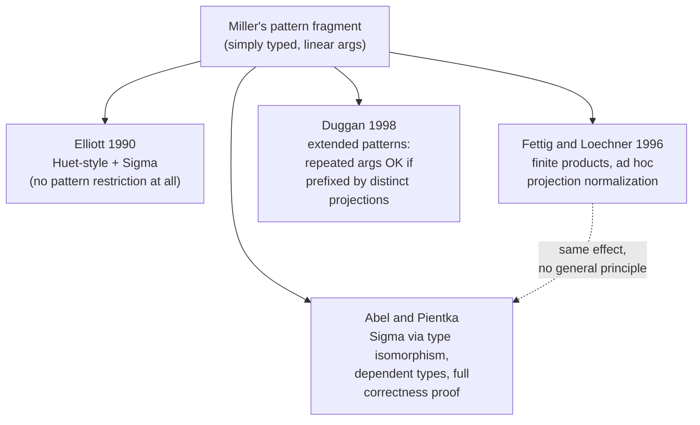

[[book-guidelines|↩ Back to guidelines]]

## Why a "related work" section earns its own article

It's tempting to skim a paper's related-work section as boilerplate — a list of citations you're obligated to write, not read. But Abel and Pientka's Chapter 6 is doing real technical work: it's the paragraph where they have to justify, precisely, *what is actually new* about translating $\Sigma$-type unification problems into $\Pi$-type ones via isomorphism, as opposed to the three other things people had already tried that look superficially similar. If you can't state that difference crisply, you haven't actually understood the isomorphism trick from the earlier chapters — you've just watched it work on an example.

Chapter 7 (the conclusion) then does the second thing a paper like this needs to do: it cashes out the correctness proof into "so what." A provably-correct-but-never-used unifier is a curiosity; a provably-correct unifier that got dropped into Beluga's context-block handling and Agda's record unification is evidence the formalism actually models something real. Both chapters together answer the question a compiler engineer should always ask about a piece of theory: *is this genuinely the state of the art, and has anyone actually shipped it?*

## Three prior attempts at unifying products, and what's different about this one

Before Abel and Pientka, at least three lines of work had already tried to extend Miller's decidable pattern fragment to handle product/record-like types. The book is careful to distinguish itself from each on a specific technical axis, not just "we did it better."

**Elliott (1990) — Huet-style unification with $\Sigma$-types.** Elliott's PhD thesis extended the older, non-terminating Huet unification procedure (the general higher-order unification search, not the *pattern* restriction) with product types. This is the least directly comparable of the three: it isn't trying to stay inside a decidable fragment at all, so it doesn't face the termination and correctness burden this paper is built around. It's cited mainly to establish that "products in higher-order unification" is an old idea — the *pattern-restricted, terminating, dependently-typed* version of it is what's new here.

**Fettig and Löchner (1996) — finite-product pattern unification, simply typed.** This is the closest relative. Their algorithm also handles product types inside the (simply-typed) pattern fragment, and it also has to deal with meta-variables applied to projections. But their mechanism is *ad hoc normalization* of projection-headed abstractions, not a general type-level isomorphism. The book's own example:
$$
\lambda x.\,\mathrm{fst}\,x \;\longrightarrow\; \lambda(x_1,x_2).\,\mathrm{fst}\,(x_1,x_2) \;\longrightarrow\; \lambda(x_1,x_2).\,x_1
$$
Read this as: take an abstraction whose body projects out of its bound variable, split the bound variable into a fresh pair `(x1, x2)` substituted in, then let ordinary reduction simplify `fst (x1, x2)` down to `x1`. It's a *rewrite rule that happens to have the right effect*, discovered and applied case-by-case (functions of $\Sigma$-type, meta-variables of $\Sigma$-type, and so on, each needing its own version of the trick).

Contrast that with what Abel and Pientka do: they name the isomorphism once —
$$
\Pi z{:}(\Sigma x{:}A.B).C \;\cong\; \Pi x{:}A.\Pi y{:}B.[(x,y)/z]C
$$
— and then every place a $\Sigma$-type would otherwise complicate the algorithm (flattening a meta-variable's context, eliminating a projection, lowering a meta-variable of pair type) is just *one instance of applying this one isomorphism*, rather than a family of separately-justified rewrite steps. This is the actual content of the paper's claim to be more systematic: Fettig and Löchner's rules and Abel/Pientka's rules often produce the *same* transformed term, but one approach needed a handful of special-cased rewrite rules and the other needed one type-theoretic fact, applied uniformly. That's also *why* the correctness proof in Chapter 4 (termination, solution-preservation, type-preservation) is tractable here in a way it plausibly wouldn't be for a rule-by-rule treatment: proving one isomorphism sound once is cheaper than proving several rewrite rules sound separately and then proving they compose correctly.

**Duggan (1998) — extended patterns via projection sequences.** Duggan attacks a related but distinct restriction of Miller's condition. Recall the pattern condition requires every argument to a meta-variable to be a *distinct* bound variable — no repeats. Duggan's extended patterns relax this: a meta-variable may be applied to the *same* bound variable more than once, provided each occurrence is prefixed by a *different* sequence of projections. Informally, $u\,(\mathrm{fst}\,x)\,(\mathrm{snd}\,x)$ is allowed even though $x$ "appears twice," because the two occurrences are disambiguated by which component they project. This is a different generalization axis than Abel and Pientka's: Duggan is relaxing *linearity* (repeated arguments), simply-typed; Abel and Pientka are extending the *type system* (dependent $\Pi$/$\Sigma$/unit), keeping strict linearity. The two ideas are complementary, not competing — the book doesn't claim to subsume Duggan's relaxation, only to note it as an alternative direction inside a related design space.



The one-sentence version, which is also the Key Question the guidelines flag for this chapter: Fettig and Löchner *normalize projection-headed terms* rule by rule; Abel and Pientka *translate the whole unification problem* through a type isomorphism, once, and let the existing pure-$\Pi$-type pattern algorithm do the rest. Systematicity, not just coverage, is the contribution.

## What breaks without the isomorphism framing

Suppose you tried to extend the pattern algorithm to $\Sigma$-types the Fettig–Löchner way, but in the *dependent* setting this paper targets. Every place a projection or a pair shows up — decomposition, lowering, pruning, flattening a meta-variable's context — would need its own dependently-typed rewrite rule, and each one would need its own soundness argument threading through dependent typing (where, unlike the simply-typed case, a term's type can depend on an earlier term, so a naive rewrite can silently produce an ill-typed intermediate state). You'd be re-deriving the same isomorphism implicitly, over and over, in each rule's soundness proof, without ever writing it down as a single reusable fact. That's the concrete cost the related-work comparison is pointing at: not "it wouldn't work," but "it wouldn't scale to a clean, machine-checkable correctness argument" — which is precisely the property Chapter 4 needed and precisely the property real deployments (below) end up depending on.

## From proof to production: Beluga and Agda

Chapter 7 closes by naming the two places these exact rules stopped being theory and became code. This matters for the same reason a compiler engineer cares whether a type system has been implemented at scale, not just proved sound on paper.

**Beluga's context-block flattening.** In LF-based proof/programming systems — Beluga, Twelf, Delphin — a limited form of $\Sigma$-type shows up as a *context block*: a way of introducing several related assumptions at once (think: a block of hypotheses bundled together rather than threaded individually). Pientka (one of this paper's authors) implemented *flattening* of these context blocks in Beluga using exactly the $\Sigma$/$\Pi$ isomorphism machinery from this paper, and the book reports it "works well in type reconstruction." This is a direct, first-party confirmation that the algorithm survives contact with a real elaborator's implicit-argument-resolution loop — not just the toy examples in the paper.

**Agda's record/$\Sigma$-type unification.** Agda supports genuine dependent record types, and prior to this work, unification implementations in such systems "traditionally not supported records" — meaning the unifier would get stuck or behave incompletely whenever a metavariable's solution needed to reason through a projection. McBride's example, cited directly:
$$
T\,(\mathrm{fst}\,\gamma)\,(\mathrm{snd}\,\gamma) \;=\; T'\,\gamma
$$
is exactly the shape of constraint that needs the isomorphism: the left side has been "unpacked" into its two projected components while the right side still holds the packed pair $\gamma$, and a unifier that can't see these as the same information (via the $\Sigma$/$\Pi$ isomorphism) will fail on a problem that a human can solve by inspection. Abel used the techniques of this paper to extend Agda's actual unification algorithm to solve this class of problem. So both authors independently confirm the algorithm in production compilers, on both sides of the LF/full-dependently-typed spectrum.

## The one place the theory admits it doesn't scale

The conclusion is refreshingly honest about a limitation, and it's worth internalizing precisely *because* it's a limitation your own elaborator design will eventually hit. The correctness proof for this algorithm rests on **typing modulo constraints** (from Chapter 3): intermediate, possibly-ill-typed states are tolerated because [[The-lambda-Pi-Sigma-Calculus-with-Meta-Variables#Hereditary substitution|hereditary substitution]] — the normalization procedure this calculus relies on — is defined *by recursion on types*, and that recursion terminates even when the term being normalized is ill-typed, as long as there's no unification *on the type level itself*. $\lambda\Pi\Sigma$ satisfies this: types here don't themselves get unified against each other in ways that could loop.

Agda does not satisfy this. Agda has **large eliminations** (functions that compute a *type* by pattern-matching on a value) and does unification *at the type level*. In that setting, an ill-typed intermediate term is no longer guaranteed to normalize at all — the recursion-on-types argument that made typing-modulo work in this paper's calculus can diverge. Norell's alternative, adopted in Agda 2, sidesteps the problem structurally rather than proving it away: **block normalization on unsolved constraints**. Rather than tolerating an ill-typed intermediate state and hoping normalization still terminates, Agda simply refuses to reduce past a point that depends on an unresolved metavariable, guaranteeing termination by construction instead of by a typing-modulo correctness proof. The Σ-type extension from this paper was layered on top of that blocking strategy in Agda 2, not on top of typing-modulo.

## Grounding: two unifiers, two termination stories

This is squarely unification/elaboration-shaped, so Lean is the primary grounding here, with a Rust sketch for the mechanism you'd actually implement.

**Lean's angle.** Lean's kernel and elaborator face exactly this fork. `isDefEq` (definitional equality checking, which subsumes unification for metavariables in Lean's elaborator) has to decide when to unfold a definition or reduce a term that might mention an unresolved metavariable. Lean, like Agda, generally *postpones* or blocks reduction steps that would require guessing a metavariable's value rather than eagerly normalizing through an ill-typed or under-determined intermediate — the same structural choice Norell made for Agda, for the same reason: once you have type-level computation depending on metavariables (which dependent pattern matching and type-class resolution both create), a "reduce first, hope it terminates" strategy is no longer safe. Reading Abel–Pientka's closing paragraph is, in effect, reading the theoretical justification for *why* Lean's elaborator has to be this careful about when it reduces.

**Rust angle — the isomorphism as a compiler pass, not a special case.** The practical lesson to carry into your own elaborator is architectural: implement the $\Sigma$/$\Pi$ isomorphism as a single normalization/translation pass that runs *before* your core pattern-unifier ever sees a constraint, rather than teaching the unifier's match arms about pairs and projections directly.

```rust
enum Ty {
    Pi(Box<Ty>, Box<Ty>),   // Π x:A. B
    Sigma(Box<Ty>, Box<Ty>),// Σ x:A. B
    Base(String),
}

/// Rewrites Π z:(Σ x:A.B). C  into  Π x:A. Π y:B. C[(x,y)/z]
/// This is the ONE place Sigma/Pi knowledge lives — the unifier
/// downstream never has to special-case projections again.
fn flatten_sigma_in_domain(ty: &Ty) -> Ty {
    match ty {
        Ty::Pi(dom, cod) => {
            if let Ty::Sigma(a, b) = dom.as_ref() {
                // Π x:A. Π y:B. C   (with the codomain's z substituted by (x,y))
                Ty::Pi(a.clone(), Box::new(Ty::Pi(b.clone(), cod.clone())))
            } else {
                Ty::Pi(dom.clone(), Box::new(flatten_sigma_in_domain(cod)))
            }
        }
        other => other.clone(),
    }
}
```

The point isn't the snippet's completeness (real flattening also has to substitute `(x, y)` for `z` inside `C`, per the isomorphism, and handle nested/dependent occurrences) — it's the *shape* of the design decision: Fettig–Löchner-style implementations bake product-handling into every unification rule; this paper's approach, and the Rust sketch above, bake it into one upstream pass so the core Miller-pattern unifier stays exactly the simply-structured algorithm from Chapter 1, unmodified. That separation of concerns is directly reusable in a refinement-type elaborator that also needs to unify through record/pair-shaped refinements without complicating its core metavariable-solving loop.

## Where this leads

This chapter is the paper looking outward in both directions: backward, to justify that the isomorphism-based translation is a genuinely different (and more systematic) idea than what Elliott, Fettig–Löchner, and Duggan had already tried; forward, to report that Beluga and Agda proved the idea out in production. For the **automated-reasoning** focus area specifically, the load-bearing takeaway is architectural, not just historical: a correctness-proof strategy (typing modulo constraints) is only as good as the invariant it leans on (no type-level unification), and knowing exactly where that invariant breaks — Agda's large eliminations — is what tells you, in advance, whether your own compiler's elaborator needs Reed/Abel/Pientka's typing-modulo style or Norell's blocking-normalization style. A refinement-type elaborator with dependent subtyping and Horn-clause-style verification conditions is much closer to Agda's territory than to this paper's, which means the blocking strategy — not typing modulo — is very likely the one your unifier will actually need.
