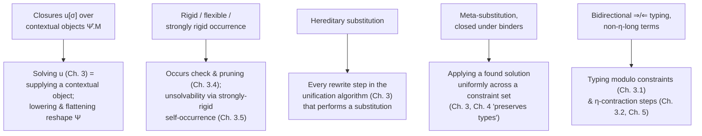

# The λΠΣ-Calculus with Meta-Variables

[[book-guidelines|↩ Back to guidelines]]

## Why a unification algorithm needs its own calculus first

Before Abel and Pientka can say anything about *how* to unify two terms containing meta-variables, they need a language in which "a term containing a meta-variable" is even a well-defined object — one where you can ask precise questions like "does this occurrence of $x$ ever have to reappear in the answer?" or "what does it mean to instantiate $u$ before we know the whole context $u$ lives in?"

This sounds like housekeeping, but it is exactly where most naive treatments of higher-order unification go wrong. Textbook higher-order unification usually represents a "logic variable" the way Prolog or an ML type-inferencer does: as a free variable $X$ that later gets *applied* to some arguments, $X\,x\,y$, and solving the problem means finding a closed term $t$ such that substituting $\lambda x\,y.\,t$ for $X$ makes the equation hold. Two things go wrong once you add dependent types and try to make this efficient:

1. **You keep having to invent binders.** Every time you solve a meta-variable, you must reconstruct the exact $\lambda$-prefix it needs, re-deriving from scratch which variables it depended on and in what order. This is bookkeeping that has nothing to do with the actual unification problem, and it is easy to get subtly wrong (wrong order, wrong dependencies) in a dependently typed setting where the *type* of a later argument can mention an earlier one.
2. **You keep having to renormalize.** Substituting into a term that already contains other pending substitutions creates new redexes, and if you naively substitute-then-normalize at every step, you redo work and again invite bugs into the one part of the system that must never be wrong.

The chapter's answer to problem (1) is to stop representing meta-variables as free variables awaiting application, and instead represent them as **closures over contextual objects** — a suspended substitution bundled with the meta-variable itself, so that "what $u$ depends on" is tracked as data rather than reconstructed from usage sites. Its answer to problem (2) is **hereditary substitution**, a substitution operation that resolves the redexes it creates as it goes, rather than requiring a separate normalization pass afterward.

Everything else in the chapter — the grammar, the notions of rigid/flexible/strongly-rigid occurrence, the bidirectional typing discipline — exists to make these two ideas precise enough to reason about formally. This is genuinely the *foundation* chapter: chapters 3 through 5 (constraint-based unification, correctness, and the unit/singleton extension) are all stated in the vocabulary fixed here. This is exactly why the book-level roadmap for this paper tags the chapter under **Type Theory**: everything downstream about *how* to unify is Automated Reasoning machinery bolted onto the representational choices made *here*.

## The grammar of λΠΣ

The calculus (Fig. 1 in the paper) is the dependently typed $\lambda\Pi$-calculus (a variant of LF — the Edinburgh Logical Framework, the ancestor of Twelf, Beluga, and much of Agda's and Lean's metatheoretic lineage), extended with $\Sigma$-types (dependent pairs) and with meta-variables:

$$
\begin{aligned}
\text{Atomic types} &\quad P, Q ::= a\,\vec M \\
\text{Types} &\quad A, B, C, D ::= P \mid \Pi x{:}A.B \mid \Sigma x{:}A.B \\
\text{(Rigid) heads} &\quad H ::= a \mid c \mid x \\
\text{Projections} &\quad \pi ::= \mathrm{fst} \mid \mathrm{snd} \\
\text{Evaluation contexts} &\quad E ::= \bullet \mid E\,N \mid \pi\,E \\
\text{Neutral terms} &\quad R ::= E[H] \mid E[u[\sigma]] \\
\text{Normal terms} &\quad M, N ::= R \mid \lambda x.M \mid (M, N) \\
\text{Substitutions} &\quad \sigma, \tau ::= \cdot \mid \sigma, M \\
\text{Variable substitutions} &\quad \rho, \xi ::= \cdot \mid \rho, x
\end{aligned}
$$

In words, before the symbols: a **type family** $a$ (like a type constructor — think `Vec`, `Eq`) can be applied to a vector of terms $\vec M$ to build an atomic type $P$; **types** are built from atomic types by two binders, $\Pi$ (a dependent function type — "for every $x{:}A$, a $B$ that may mention $x$") and $\Sigma$ (a dependent pair type — "an $x{:}A$ together with a $B$ that may mention that specific $x$"); a **neutral term** $R$ is anything whose "shape" is pinned down by a rigid head or a meta-variable sitting inside an **evaluation context** $E$ — a term-with-a-hole that generalizes function application and projection; and a **normal term** is either such a neutral, or a $\lambda$-abstraction, or a pair.

A few design choices here are load-bearing for everything that follows:

- **Only β-normal forms are considered.** Because $\lambda\Pi\Sigma$ is strongly normalizing, this loses no generality, and it means "term equality" during unification can (mostly) mean syntactic equality of normal forms rather than equality-up-to-reduction. Note that in this paper "β" is used broadly: it subsumes ordinary application reduction $(\lambda x.M)N =_\beta [N/x]M$ *and* the projection reductions $\mathrm{fst}(M,N) =_\beta M$, $\mathrm{snd}(M,N) =_\beta N$.
- **Neutral terms are exactly the terms that can appear in elimination (head) position.** A neutral term $R$ is either a rigid head $H$ (a type family $a$, a constructor $c$, or a bound variable $x$) sitting inside an evaluation context, or a meta-variable closure $u[\sigma]$ sitting inside one. This is a direct generalization of *spine notation* — instead of writing $H\,M_1 \dots M_n$, you write $E[H]$ where $E$ is a context built from applications *and* projections. The generalization to include $\pi E$ (projections) is precisely what a $\Sigma$-type calculus needs that a plain $\Pi$-calculus does not.
- **Meta-variables are graded by contexts, not by arity.** A meta-context $\Delta ::= \cdot \mid \Delta, u{:}A[\Psi]$ records that $u$ has type $A$ *relative to* a context $\Psi$ — this is what "contextual type" means, and it is the type-level counterpart of the closure representation discussed below.

**What breaks without evaluation contexts.** If you tried to keep plain spine notation $H\,M_1\dots M_n$ instead of generalizing to $E[H]$, you'd have no uniform way to talk about "the head of a term that also has a pending projection on it," e.g. $\mathrm{fst}(f\,x)\,y$. You would need a second, parallel notion of "projection spine" and a case split every time the algorithm needs to inspect a neutral term's head — exactly the kind of accidental complexity that a well-chosen grammar is supposed to prevent.

**Concrete illustration.** Suppose you are elaborating `λx y z. X x y` where the metavariable `X` has type $\Pi x{:}A.\Pi y{:}B.C$. In this calculus that term is represented as
$$
\lambda x\,y\,z.\ u[x, y]
$$
where $u$ has contextual type $C[x{:}A, y{:}B]$ and $[x,y]$ is a substitution whose domain is $x{:}A, y{:}B$ and whose range picks out (in this case) the *outer* variables $x, y$ — note the range is a list of terms drawn from the ambient context ($x,y,z$ here), not necessarily the same names as the domain. This single example is worth sitting with, because it is the concrete referent for every abstract claim in the rest of the section.

## Meta-variables as closures over contextual objects

This is the chapter's central representational choice, so it is worth restating precisely. A meta-variable never appears bare; it always appears as a **closure** $u[\sigma]$: the meta-variable $u$ paired with a *suspended explicit substitution* $\sigma$ that has not yet been pushed inside. Solving $u$ means finding a **contextual object** $\hat\Psi.M$ — a term $M$ together with a promise that $\mathrm{FV}(M) \subseteq \hat\Psi$, where $\hat\Psi$ is the variable-list ("erasure") of the context $\Psi$ that $u$'s contextual type is graded by.

Continuing the running example: $u$ of contextual type $C[x{:}A,y{:}B]$ could eventually be solved by the contextual object $x, y.\ x\,(\mathrm{suc}\,y)$ — i.e. $\hat\Psi = x,y$ and $M = x\,(\mathrm{suc}\,y)$.

Why does this avoid "crafting a $\lambda$-prefix"? In the naive free-variable representation, solving $X$ in $X\,x\,y = x\,(\mathrm{suc}\,y)$ means noticing that $X$ needs to become $\lambda x\,y.\,x\,(\mathrm{suc}\,y)$ — you have to *re-derive*, from the shape of the application, exactly which $\lambda$'s to wrap around the answer and in what order, and get it byte-for-byte right relative to however $X$ was originally applied at every one of its occurrences. In the contextual representation, that binder structure was *never lost*: it's sitting right there as $\Psi$ in $u$'s declaration $u{:}C[\Psi]$ in the meta-context $\Delta$. Solving $u$ is just supplying $M$; the prefix $\hat\Psi$ comes for free from the declaration, and (as the text notes) it can even be used to *rename* the free variables of $M$ if the surrounding context calls for it, without any risk of picking the wrong binder shape. This sidesteps the creation of "administrative" $\beta$-redexes that a naively reconstructed $\lambda$-prefix, applied back to its original arguments, would otherwise introduce.

The paper also introduces **weakening substitutions** $\mathrm{wk}_\Phi$ as the canonical variable substitution embedding a sub-context $\Phi$ into a larger context: $\mathrm{wk}_\cdot = (\cdot)$ and $\mathrm{wk}_{\Phi,x:A} = (\mathrm{wk}_\Phi, x)$. These will matter later (Chapter 3) whenever a meta-variable is "lowered" or has its context "flattened" — both operations reindex a meta-variable's suspended substitution against a shrunk or reshaped context, and $\mathrm{wk}_\Phi$ is the substitution that makes that reindexing type-correct: $\Psi \vdash \mathrm{wk}_\Phi : \Phi$ holds exactly when $\Phi$ is a sub-context of $\Psi$ up to $\eta$-equality.

**Grounding the idea — this is precisely what a Lean-style elaborator's metavariable context does.** This is one of the most direct correspondences in the whole chapter: Lean's kernel and elaborator do not represent a metavariable as a bare unification variable either. Every metavariable is registered in a `MetavarContext` with its own **local context** (Lean's `LCtx`, playing the role of $\Psi$) and target type, and every *occurrence* of that metavariable in a term carries an explicit list of the local-context entries it is instantiated against — Lean calls this the metavariable's "arguments," and it is exactly the paper's suspended substitution $\sigma$. Assigning a metavariable in Lean means calling `MVarId.assign` with a term whose free variables are checked to lie within that stored local context — which is precisely the paper's promise $\mathrm{FV}(M) \subseteq \hat\Psi$ for a contextual object. Nobody re-derives a $\lambda$-prefix at assignment time in Lean either, for exactly the reason the paper gives.

```lean
-- A schematic rendering of the correspondence (not literal Lean source,
-- but structurally faithful to Lean.Meta's MetavarContext / MetavarDecl).
structure MetaDecl where
  ctx : LocalContext   -- Ψ, the metavariable's own context
  ty  : Expr           -- A, well-typed in ctx

-- A metavariable *occurrence* u[σ]: the identifier plus the substitution
-- (the "local instances"/argument list) from ctx into the ambient scope.
structure MVarOccurrence where
  mvarId : MVarId       -- u
  args   : Array Expr   -- σ : the suspended substitution

-- Assigning u means giving a contextual object (ctx, body) — exactly
-- the paper's Ψ̂.M — and Lean checks FV(body) ⊆ ctx before accepting it.
structure Assignment where
  scope : LocalContext  -- Ψ̂ (erased to just the variable list conceptually)
  body  : Expr          -- M, with FV(M) ⊆ scope, checked at assignment time
```

**Rust — a metavariable is a handle into a store**, and applying it to a context produces a closure, never a "solve and re-derive the lambda" step. This is the shape you'd actually implement if you were building the elaborator's term representation from scratch:

```rust
struct MetaId(u32);

// A meta-variable's *contextual type*: declared relative to a context.
struct MetaDecl {
    ctx: Context,   // Ψ
    ty: Term,       // A, well-typed in Ψ
}

// A meta-variable *occurrence* is always a closure: the meta plus
// a suspended substitution from its declared context into the
// context where it's used.
enum Term {
    Neutral(Neutral),
    Lam(Box<Term>),
    Pair(Box<Term>, Box<Term>),
}

enum Neutral {
    Var(usize),
    App(Box<Neutral>, Box<Term>),
    Proj(Projection, Box<Neutral>),
    Meta(MetaId, Vec<Term>), // u[σ]: the suspended substitution σ
}

// Solving u means storing a contextual object (Ψ̂, M), not
// reconstructing a λ-prefix from occurrence sites.
struct Solution {
    scope: Vec<VarId>, // Ψ̂
    body: Term,         // M, with FV(M) ⊆ Ψ̂
}
```

**Python — a lightweight prototype sketch**, useful only for a throwaway toy unifier, not load-bearing:

```python
class MetaClosure:
    """u[sigma]: a meta-variable under a suspended substitution."""
    def __init__(self, meta_id, ctx, sigma):
        self.meta_id = meta_id
        self.ctx = ctx      # Ψ, the declaration context
        self.sigma = sigma  # σ, the suspended substitution

class Solution:
    """A contextual object Psi-hat.M solving some meta-variable."""
    def __init__(self, scope, body):
        self.scope = scope  # Ψ̂
        self.body = body    # M, with FV(M) ⊆ scope
```

## Rigid, flexible, and strongly rigid occurrences

The chapter then defines the vocabulary that every later correctness argument leans on: a three-way classification of *occurrences* of a variable (or subterm) inside a larger term.

- An occurrence is **rigid** if it is *not* inside a meta-variable's delayed substitution $\sigma$; otherwise it is **flexible**.
- A rigid occurrence is **strongly rigid** if, additionally, it does not sit inside the evaluation context applied to a free variable — i.e., it isn't "underneath" an application whose head is itself just a variable (which could later be instantiated to something that discards the argument).

The paper's worked example is worth reproducing exactly, because the terminology only becomes intuitive once you've traced through it:
$$
c\ (u[y_1])\ (x_1\,x_2)\ (\lambda z.\ z\,x_3\,v[y_2, w[y_3]])
$$
Here $x_1, x_2, x_3$ occur **rigidly** (none of them sit inside a meta-variable's suspended substitution), while $y_1, y_2, y_3$ occur **flexibly** (each is an argument inside some meta-variable's $[\cdot]$). Correspondingly, the meta-variables $u$ and $v$ themselves occur in rigid position (you can "see" them directly), while $w$ occurs in flexible position (it's nested inside $v$'s suspended substitution). Of the rigid occurrences, only $x_2$ fails to be *strongly* rigid — because $x_2$ sits as an argument to the free variable $x_1$ (i.e., inside the evaluation context $x_1\,\bullet$), and a future instantiation of $x_1$ could ignore that argument entirely.

Why maintain this three-way distinction rather than a binary rigid/flexible split? Because it answers a question the unification algorithm asks constantly: *can this occurrence of a variable ever be made to disappear, and by what means?*

- A **flexible** occurrence can vanish simply by instantiating the meta-variable it's buried in — e.g. $y_1$ vanishes under the substitution $u \mapsto y_1.\,c'$ (a solution for $u$ that just discards its argument).
- A **rigid but not strongly rigid** occurrence can still vanish, but only indirectly, via instantiation of *some other* free variable and subsequent normalization. In the example, $x_2$ disappears if we substitute $\lambda x_2.\,c'$ for $x_1$ — the surrounding application reduces away and takes $x_2$ with it.
- A **strongly rigid** occurrence can *only* vanish by being instantiated itself — no amount of cleverness with other variables' instantiations will ever make it go away through reduction.

This is exactly the distinction the paper needs later (Chapter 3's occurs check, and the unsolvability argument in Chapter 3.5) to decide when a self-referential constraint like $u[f] = \mathrm{suc}(f(u[\lambda x.\mathrm{zero}]))$ is genuinely unsolvable versus merely awkward: a *strongly rigid* recursive occurrence of $u$ in its own proposed solution can never be eliminated by any future refinement, so it forces failure; a merely rigid one might still be escapable.

**What breaks without the three-way split.** If a unifier only distinguished rigid from flexible, it would have to treat *every* rigid self-occurrence of $u$ inside a proposed solution for $u$ as an automatic occurs-check failure — including cases where the occurrence is actually escapable through some other variable's future instantiation. That's unsound in the "reject valid unifications" direction: real, solvable problems would be rejected. The strongly-rigid refinement is precisely what lets the algorithm distinguish "definitely stuck forever" from "rigid for now, but maybe not forever."

**Grounding — this is the metavariable-unification analogue of escape analysis / occurs-check logic, and it is exactly what a Lean-style `isDefEq` occurs-check must track**, not just a generic reachability question. Lean's unifier, when it tries to assign a metavariable `?m` to a term containing `?m` itself, cannot simply reject every syntactic self-mention: it needs to know whether that self-mention sits under something that could still reduce it away before deciding the assignment is genuinely circular. The rigid/strongly-rigid distinction is the formal apparatus for making that judgment call soundly instead of by ad hoc heuristics.

```python
def classify_occurrence(path_to_var):
    """path_to_var: list of context-frames from root to the occurrence,
    each either ('meta_subst', meta) or ('app_arg', head)."""
    if any(frame[0] == 'meta_subst' for frame in path_to_var):
        return 'flexible'
    # rigid: not under any meta-variable's suspended substitution
    if any(frame[0] == 'app_arg' and is_free_var(frame[1])
           for frame in path_to_var):
        return 'rigid'          # rigid but not strongly rigid
    return 'strongly_rigid'
```

```rust
// The Rust-side equivalent, as it would sit inside an occurs-check pass.
enum Occurrence { Flexible, Rigid, StronglyRigid }

fn classify(path: &[Frame]) -> Occurrence {
    if path.iter().any(|f| matches!(f, Frame::MetaSubst(_))) {
        return Occurrence::Flexible;
    }
    if path.iter().any(|f| matches!(f, Frame::AppArg(h) if is_free_var(h))) {
        return Occurrence::Rigid;
    }
    Occurrence::StronglyRigid
}
```

## Hereditary substitution

The paper defines, for a well-typed entity $\alpha$ in context $\Psi$ and a well-formed substitution $\Delta;\Phi \vdash \sigma : \Psi$, a simultaneous substitution operation $[\sigma]_\Psi\alpha$ that substitutes the terms of $\sigma$ for the variables of $\Psi$ throughout $\alpha$ and produces a **β-normal** result. This operation is guaranteed to exist for well-typed terms because $\lambda\Pi\Sigma$ is strongly normalizing — but *how* you compute it matters:

- A **naive implementation** substitutes first, then runs a separate normalization pass to clean up the redexes the substitution created.
- **Hereditary substitution** (Watkins et al., 2003) instead resolves each newly created redex *as it arises*, recursively, so the result is produced already in normal form, with no separate pass. The single-variable case $[N/x]_A\,\alpha$ is the special case of the simultaneous operation, defined by structural recursion using the type annotation $A$ and the context $\Psi$'s typing information — indices that are dropped from the notation when unambiguous, giving the more familiar $[\sigma]\alpha$ and $[N/x]\alpha$.

Why does this matter operationally rather than just being an implementation nicety? Substituting $N$ for $x$ inside a term that already contains, say, $E[u[\sigma]]$ or a projection $\pi(M,N')$ can immediately create a new $\beta$-redex — e.g. if $x$ was itself an applied head, $x\,M_1\dots M_n$, substituting a $\lambda$-abstraction for $x$ produces $(\lambda y.\dots)\,M_1\dots M_n$, an unreduced redex sitting right there. If the algorithm just walked past that, later steps that expect an invariant like "the term is in normal form" or "the head is rigid/flexible per the classification above" would silently see stale, non-normal structure. **What breaks without hereditary substitution:** every downstream rewrite rule in Chapter 3 pattern-matches directly on normal-form syntax (is the head a variable? a meta-variable? a $\lambda$?); a term with a leftover redex would simply fail to match any rule, or — worse — match the wrong one, silently corrupting the algorithm's invariants rather than failing loudly.

The paper notes both Agda and Beluga — and other logical-framework metatheory — use hereditary substitution for exactly this reason. This is also *precisely* the discipline behind Lean's kernel `whnf` (weak-head-normal-form reduction) as used inside `isDefEq`: Lean never substitutes into a term and then separately re-normalizes top-down; its reduction and definitional-equality checking are interleaved so that redexes exposed by a substitution are reduced immediately, on demand, rather than accumulated and cleaned up afterward. The paper's hereditary substitution is the "closed calculus" (LF, no unfolding of definitions) special case of the same underlying discipline that makes Lean's `isDefEq` behave efficiently and correctly under dependent substitution.

```lean
-- Schematic: Lean's whnf/isDefEq never leave a substitution-created
-- redex lying around; a new redex is reduced immediately, recursively.
-- This is the same discipline as hereditary substitution, generalized
-- to a calculus with unfoldable definitions.
partial def substHereditary (t : Expr) (x : FVarId) (n : Expr) : MetaM Expr := do
  match t with
  | .app f a =>
    let f' ← substHereditary f x n
    let a' ← substHereditary a x n
    match f' with
    | .lam _ _ body _ => substHereditary body x a'  -- new redex, resolved now
    | _ => return .app f' a'
  | _ => return t
```

```rust
// Naive: substitute everywhere, then normalize as a separate pass.
fn subst_naive(term: &Term, x: VarId, n: &Term) -> Term {
    normalize(&raw_subst(term, x, n))
}

// Hereditary: resolve redexes as they are created, recursively,
// so the result never needs a separate normalization pass.
fn subst_hereditary(term: &Term, x: VarId, n: &Term, ty_of_x: &Term) -> Term {
    match term {
        Term::Neutral(Neutral::App(head, arg)) => {
            let head2 = subst_hereditary_neutral(head, x, n, ty_of_x);
            let arg2 = subst_hereditary(arg, x, n, ty_of_x);
            match head2 {
                // A substitution just turned the head into a lambda:
                // resolve the fresh redex immediately, hereditarily,
                // instead of leaving it for a later pass.
                Neutral::AsLambda(body) => subst_hereditary(&body, /* bound var */ 0, &arg2, ty_of_x),
                _ => Term::Neutral(Neutral::App(Box::new(head2), Box::new(arg2))),
            }
        }
        // ... other cases, each resolving its own newly created redex
        _ => term.clone(),
    }
}
```

## Meta-substitution and the closed-under-binders property

Distinct from hereditary substitution (which replaces *ordinary variables*) is **meta-substitution**: replacing a *meta-variable* by a contextual object. Written $[\![\hat\Psi.M/u]\!]N$ for a single meta-variable, and $[\![\theta]\!]N$ for a simultaneous meta-substitution $\theta$, this operation also restores β-normality.

The interesting case is what happens when a meta-substitution reaches a closure $u[\sigma]$ headed by exactly the meta-variable being solved: applying $\hat\Psi.M/u$ to $u[\sigma]$ first substitutes $\hat\Psi.M$ for $u$ *inside $\sigma$ itself* (in case $\sigma$ contained other occurrences of $u$) to get $\sigma'$, and *then* applies $\sigma'$ to $M$ hereditarily to get the final normal result $M'$. So meta-substitution is defined in terms of ordinary hereditary substitution, applied at the point where a solved meta-variable's suspended substitution finally gets to act on its solution.

One property is emphasized because later chapters depend on it structurally: meta-substitutions are **closed with respect to LF (object-level) variables**, i.e. $\mathrm{FV}(\theta) = \emptyset$. Concretely, this means a meta-substitution can be pushed *underneath a binder unchanged*:
$$
[\![\theta]\!](\lambda x.N) = \lambda x.\, [\![\theta]\!]N
$$
There's no risk of variable capture to worry about, and no need to rename $x$ first, because $\theta$'s replacement terms never mention any object-level variable that could clash with $x$ in the first place. **[[Correctness-of-the-Unification-Algorithm#What breaks without this|What breaks without this]] property:** if a meta-substitution *could* mention an object-level variable, pushing it under a binder would require a full capture-avoiding rename at every single binder crossed — turning "apply this solution everywhere" from a single uniform structural recursion into an operation that has to thread fresh-name bookkeeping through the entire term. This is exactly the kind of plumbing the workbench's standing concern about "substitution, context management, and variable capture" is pointing at: it recurs identically here and in Hoare-logic soundness proofs, because it is the same underlying problem (a substitution's replacement terms interacting with a binder's scope) wearing two different hats.

This is what lets the unification algorithm in Chapter 3 apply a freshly found solution for one meta-variable everywhere in a constraint set — including under arbitrarily deep binders — as a single uniform, structurally recursive rewrite, without a separate capture-avoidance analysis at every binder it passes through. It is also, again, exactly what makes Lean's metavariable assignment cheap to propagate: once `?m` is assigned, every occurrence of `?m` throughout the elaboration state can be expanded in place by the same instantiation routine, with no risk that the assigned term captures a bound variable at the site of use.

## Bidirectional typing

Finally, the chapter fixes the typing discipline as **bidirectional**: neutral terms $R$ get an *inferred* (synthesized) type via a $\Rightarrow$ judgement, while normal terms $M$ are *checked* against a type supplied as input, via a $\Leftarrow$ judgement. This split is what makes type*checking* algorithmic in the first place — you're never asked to guess a type out of thin air, since every checking judgement receives its type as input, and every synthesizing judgement only ever runs on a neutral term whose head (a constant, a variable, or a meta-variable) has a type already on record.

This bidirectional discipline is complete for β-normal forms — exactly the forms the grammar restricts attention to — and, notably, it does *not* require terms to be η-long (fully η-expanded), unlike some other bidirectional presentations of LF (e.g. Harper and Licata, 2007). Equality of types modulo η, written $A =_\eta C$, is defined separately (rules omitted in this section) as the congruence generated by $R =_\eta \lambda x. R\,x$ (when $x \notin \mathrm{FV}(R)$) and $R =_\eta (\mathrm{fst}\,R, \mathrm{snd}\,R)$ — the η-laws for functions and pairs, respectively. Allowing terms to be non-η-long while still having a decidable bidirectional discipline is precisely what buys the flexibility the unification algorithm needs to η-*contract* meta-variable substitutions opportunistically (a move central to Chapter 3), rather than being forced to carry every term around in a canonical η-expanded shape.

**Grounding — this is the same inference/checking split underlying every real bidirectional elaborator**, Lean's included: Lean's elaborator has separate `elabTerm` (checking mode — you already know the expected type) and `inferType`/synthesis paths, and the neutral/normal distinction here is the type-theoretic ancestor of "is this expression's type determined by its own shape, or does it need an expected type handed down from context." A judgment form that can be read *either* as "a type checker's typing rule" or "a proof checker's typing rule" is exactly the workbench's recurring thread here: this bidirectional presentation of λΠΣ is that shared ancestor made explicit.

```rust
// The Rust shape of the same split: two entry points, not one.
enum TypeResult { Inferred(Type), Checked }

fn infer(ctx: &Context, neutral: &Neutral) -> Type {
    // ⇒ : only ever called on neutral terms, whose head type is on record
    todo!()
}

fn check(ctx: &Context, normal: &Term, expected: &Type) -> bool {
    // ⇐ : the expected type is an input, never guessed
    todo!()
}
```

## Where this leads



Every one of the paper's later technical devices is, in a precise sense, just this chapter's vocabulary put to work: pruning (Chapter 3.4) is stated in terms of rigid-but-not-strongly-rigid vs. strongly rigid occurrences; lowering and Σ-flattening (Chapter 3.2) are operations on a meta-variable's declared context $\Psi$, made meaningful only because $u$ carries that context as part of its *closure* representation rather than needing it inferred from usage; and the correctness proofs of Chapter 4 (termination, preservation of solutions, preservation of typing) are proofs about the hereditary- and meta-substitution operations defined here behaving well under the constraint-rewriting steps.

For the **Type Theory** focus area specifically, this chapter is where several of the "required conceptual connections" first become concrete rather than abstract: *metavariables* are given a representation (closures over contexts, not bare applied variables) that decides how cheaply the rest of the algorithm can manipulate them; *bidirectional typing* is fixed as the discipline that will later host "typing modulo constraints"; and the calculus's own $\Pi$- and $\Sigma$-types are exactly what Chapter 3's Sigma-Pi isomorphism will exploit to reduce record unification to pattern unification. If the eventual goal is a Rust-based elaborator with a Miller-pattern-style metavariable unifier, this chapter is the part that decides the *data representation* your unifier is built on: whether metavariables are closures-over-contexts (as here, and as in Lean) or bare applied variables determines how much of the rest of the algorithm — occurs checking, solution propagation, capture-avoidance — you get for free versus have to re-derive by hand.
