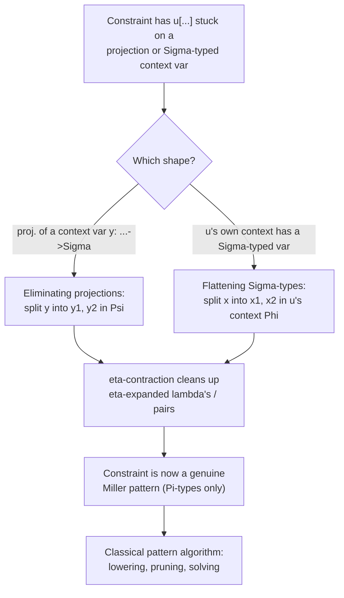

[[book-guidelines|↩ Back to guidelines]]

## The problem: patterns are syntactically fragile

Miller's pattern fragment is a beautifully narrow decidable corner of higher-order unification: a constraint is a pattern if every meta-variable in it is applied only to a list of **pairwise-distinct bound variables**. When that holds, a most general unifier always exists and is computed by simple abstraction. The moment a meta-variable is applied to something else — a repeated variable, another meta-variable, or a compound term — the pattern condition breaks and you fall into full higher-order unification, which is *undecidable*.

Here's the uncomfortable fact this topic exists to fix: the pattern condition is a **syntactic** one, but the terms that violate it are frequently *semantically* patterns in disguise. The paper's motivating triple (p. 2) makes this vivid. Consider these three terms, all "morally" the same function:

$$
\begin{aligned}
&\text{(1)}\quad \lambda y_1.\lambda y_2.\ X\,(y_1, y_2) \\
&\text{(2)}\quad \lambda y.\ X\,(\mathrm{fst}\,y)\,(\mathrm{snd}\,y) \\
&\text{(3)}\quad \lambda y_1.\lambda y_2.\ X\,y_1\,y_2
\end{aligned}
$$

Only (3) is a literal Miller pattern — $X$ applied to two distinct bound variables. In (1), $X$ is applied to a *pair* $(y_1, y_2)$, not to variables. In (2), $X$ is applied to *projections* $\mathrm{fst}\,y$ and $\mathrm{snd}\,y$, not to $y$ itself. A naive pattern checker rejects both (1) and (2) outright and falls back to full (undecidable, non-unique) higher-order unification — even though nothing about the underlying problem is actually harder than (3). The information needed to see that (1) and (2) *are* patterns is hiding in the **type** of $y$ (or of whatever $X$ is applied to): if that type is a dependent pair (Σ-type), then a pair-argument or a pair-of-projections is exactly what you'd expect an eta-long, syntactically pattern-shaped application to look like. [[Correctness-of-the-Unification-Algorithm#What breaks without this|What breaks without this]] insight is that any system with Σ-types or dependent records (Beluga's context blocks, Agda's records, Twelf's assumption-grouping) would reject a huge fraction of unification problems arising from ordinary elaboration, forcing them either into much slower general higher-order unification or into ad-hoc special-casing.

## The core idea: a type isomorphism, not a special case

The paper's answer is not to special-case "meta-variable applied to a pair" as a new pattern shape. It's to observe that **Σ-types and Π-types are related by a genuine type isomorphism**, and to use that isomorphism to *rewrite the problem itself* into a shape the existing pattern algorithm already handles. The isomorphism, stated on p. 3, is:

$$
\Pi z:(\Sigma x{:}A.\,B).\,C \;\cong\; \Pi x{:}A.\,\Pi y{:}B.\,[(x,y)/z]\,C
$$

In words: a function that takes one argument of a dependent-pair type is the same thing, up to isomorphism, as a function that takes the pair's two components as two *separate* arguments — with the rest of the return type ($C$) substituted to talk about the reconstructed pair $(x, y)$ instead of the original bound variable $z$. This is exactly currying, generalized to the dependent setting: $\Sigma x{:}A.B$ is a dependent pair type, so "splitting" a $\Sigma$-typed argument $z$ into two components $x, y$ is the dependent analogue of turning a function `f: (A, B) -> C` into a curried `f: A -> B -> C`.

Concretely, this means a function $f : \Pi x{:}A.\, \Sigma y{:}B.\, C$ (a function returning a dependent pair — think of it as returning a "record" whose second field's type can mention the first) can always be split into **two** ordinary functions:

$$
f_1 : \Pi x{:}A.\,B \qquad\qquad f_2 : \Pi x{:}A.\,[f_1\,x/y]\,C
$$

where $f_1$ computes the first component and $f_2$ — whose result type is specialized using $f_1$'s output — computes the second. No information is lost; $f$ is recovered as $\lambda x.\,(f_1\,x,\, f_2\,x)$. This is the "translating a record-typed function into a pair of functions" item from the Topic List: it's the semantic content of the isomorphism, independent of unification, and it's what licenses everything that follows.

Why does this help unification specifically? Because a meta-variable is, in this framework, nothing but an unknown function (a contextual object closed over a context of assumptions — see the companion topic on meta-variables). If a meta-variable's *context* or a meta-variable's *argument* has a $\Sigma$-type, the isomorphism lets the algorithm mechanically rewrite that Σ-type out of existence — replacing one function/argument of pair type with two functions/arguments of the component types — landing back in pure $\Pi$-only territory where the classical Miller pattern check applies unchanged. The paper does not need a new unification theory for records; it needs one isomorphism, applied systematically.

## Two rewrite rules that operationalize the isomorphism

Section 3.2 turns this idea into two of the inference system's rewrite rules (Fig. 3 and Fig. 4 in the source). Both are *unconditional, sound rewrites* — they replace a constraint (or a meta-variable's context) with an isomorphic one, never losing or gaining solutions.

### Eliminating projections

This rule fires when we're stuck decomposing a meta-variable's substitution because it contains a *projection* out of a variable — a syntactic shape like (2) above:

$$
\Psi_1,\, x:\Pi\vec y{:}\vec A.\,\Sigma z{:}B.\,C,\, \Psi_2 \;\vdash\; u[\sigma\{\pi\,(x\,\vec M)\}] = N : D
\;\;\longmapsto_p\;\;
\Psi_1,\, x_1:\Pi\vec y{:}\vec A.\,B,\; x_2:\Pi\vec y{:}\vec A.\,[(x_1\,\vec y)/z]C,\, \Psi_2 \;\vdash\; u[[\tau]\sigma] = [\tau]N : [\tau]D
$$

where $\tau = [\lambda \vec y.\,(x_1\,\vec y,\, x_2\,\vec y)/x]$. Read operationally: somewhere in the ambient context $\Psi$ there's a variable $x$ whose type ends in a $\Sigma$ ($x$ is a function returning a record), and the constraint projects out of an application of $x$. The rule **replaces $x$ in the context by two variables** $x_1, x_2$ — exactly $f_1, f_2$ from the isomorphism above — and substitutes $\tau$ (which reassembles $x_1, x_2$ back into a pair, to stand in for $x$) everywhere $x$ was used. After this rewrite, the offending projection $\pi\,(x\,\vec M)$ normalizes away into a direct application of $x_1$ or $x_2$, which is a legitimate pattern shape again.

### Flattening Σ-types

This rule targets the same problem from the other end: when a meta-variable $u$'s *own declared context* $\Phi$ contains a variable of $\Sigma$-type, split that context variable in $u$'s home context, not just at a particular use site:

$$
\Phi = \Phi_1,\, x:\Pi\vec y{:}\vec A.\,\Sigma z{:}B.\,C,\, \Phi_2
\quad\longmapsto\quad
\Phi' = \Phi_1,\, x_1:\Pi\vec y{:}\vec A.\,B,\; x_2:\Pi\vec y{:}\vec A.\,[x_1\,\vec y/z]C,\, \Phi_2
$$

with $u$ replaced by a fresh meta-variable $v : ([\sigma^{-1}]A)[\Phi']$ where $\sigma^{-1} = [\lambda\vec y.\,(x_1\,\vec y, x_2\,\vec y)/x]$ reconstructs $x$ from $x_1, x_2$, and its inverse $\sigma = [\lambda\vec y.\,\mathrm{fst}(x\,\vec y)/x_1,\ \lambda\vec y.\,\mathrm{snd}(x\,\vec y)/x_2]$ goes the other way. This is the "flattening" from the Topic List: it's what lets an entire meta-variable be re-hosted in a context with no $\Sigma$-types left at all, which matters because pattern-hood is ultimately a property of the *whole* substitution a meta-variable carries — a single un-flattened $\Sigma$ anywhere in its context can block the pattern check even if no individual constraint currently mentions it.

### A worked example (paper, p. 10–11)

The paper's own illustration ties both rules together. Given $y : \Pi x{:}A.\,\Sigma z{:}B.\,C$ and the stuck constraint

$$
u[\lambda x.\ \mathrm{fst}\,(y\,x)] = M,
$$

applying $\tau = [\lambda x.\,(y_1\,x,\, y_2\,x)/y]$ (eliminating projections) turns this into

$$
y_1 : \Pi x{:}A.\,B,\ y_2 : \Pi x{:}A.\,[y_1\,x/z]C \;\vdash\; u[\lambda x.\, y_1\,x] = [\tau]M,
$$

and since $\lambda x.\,y_1\,x$ is an eta-expanded $y_1$, a separate rule (**η-contraction**) collapses it to $u[y_1] = [\tau]M$ — now a genuine pattern equation, solvable provided $y_2$ doesn't escape into the solution. Notice the division of labor: the Σ-Π isomorphism rule does the *type-level* surgery (splitting the function), while η-contraction does routine cleanup on the *term-level* result. Neither rule alone would get you to a pattern; together, in a small number of deterministic rewrite steps, they do.

## Grounding: seeing the isomorphism in code

### Rust: currying a struct-returning function

The clearest non-dependent analogue is the difference between a function returning a `struct` and a curried pair of functions computing its fields. In ordinary Rust, these are already isomorphic — you can always go back and forth mechanically:

```rust
struct Pair<A, B> { fst: A, snd: B }

// f : A -> Sigma(B, C)      ~ "f produces a record"
fn f(x: A) -> Pair<B, C> {
    let b = compute_b(&x);
    let c = compute_c(&x, &b);   // C may depend on the value of B — this is the "dependent" part
    Pair { fst: b, snd: c }
}

// The isomorphic split: f1 : A -> B,  f2 : A -> C (specialized via f1)
fn f1(x: &A) -> B { compute_b(x) }
fn f2(x: &A) -> C { compute_c(x, &f1(x)) }

// f is recoverable exactly:
fn f_via_split(x: A) -> Pair<B, C> {
    let b = f1(&x);
    let c = f2(&x);
    Pair { fst: b, snd: c }
}
```

Rust's type system can't literally express `C` depending on the *value* of `f1(x)` (that needs a dependent type, not a generic), but the shape of the transformation is exactly the paper's isomorphism: replacing one function into a product with two functions into the factors, one of which the other's output type depends on. The "eliminating projections" rewrite is the unifier doing this refactor automatically, on the fly, to a *variable* `y` in scope rather than to a named top-level function — everywhere the algorithm sees `y.fst`/`y.snd` used as an unknown's argument, it substitutes in the split form and lets ordinary pattern-checking proceed.

### Lean: this is definitional unfolding of a structure, done for you by the elaborator

Lean's dependent pair type `Sigma` (or a single-constructor `structure`) has *definitional eta*: for `p : Σ x : A, B x`, the term `p` is definitionally equal to `⟨p.1, p.2⟩`. This is precisely the $R = (\mathrm{fst}\,R,\mathrm{snd}\,R)$ eta-law the paper's η-contraction rule relies on, and it means Lean's kernel already treats a bare variable of Sigma type and its reconstructed pair as `rfl`-interchangeable:

```lean
example (p : Σ _ : Nat, Bool) : p = ⟨p.1, p.2⟩ := rfl
```

The Abel–Pientka isomorphism is the *elaborator-facing* generalization of this fact to functions: if `y : (x : A) → Σ _ : B, C`, then unifying a metavariable applied to `y.1` / `y.2` is, up to this same eta-law, unifying it against a variable applied argument-wise once you view `y` as the pair `⟨y1, y2⟩` of its two projections-as-functions. When Lean's own elaborator resolves an implicit argument whose expected type or context involves a structure, it performs exactly this kind of eta-expansion/projection-elimination internally — `isDefEq` will happily unify `y.1` against a metavariable application because the kernel's normalizer treats projections out of eta-expanded records as transparent. The paper's contribution, relative to "just let the kernel normalize," is turning this into an explicit, *terminating*, provably-sound rewrite step usable *before* full normal forms are available — which matters for a unifier that must work incrementally on partially-solved constraint sets, not just check finished terms for defeq.

## How this fits into the algorithm as a whole



Both rules are pure preprocessing: they never solve anything by themselves, they only remove Σ-types from the picture so that the machinery built for the pure pattern fragment — lowering, pruning, the occurs check, solving — can take over. This is also why the paper can afford to treat them as unconditional rewrites in the *local simplification* system (Fig. 3/4, marked $\mapsto_d$/$\mapsto_p$) rather than needing a separate correctness argument specific to records: once a Σ is gone, everything downstream is the already-correct Π-only algorithm.

## Where this leads

Flattening and projection-elimination are prerequisites, not endpoints: once a constraint is Σ-free, it feeds directly into the constraint-based inference system's other transitions — lowering, [[Pruning-and-the-Occurs-Check|pruning and the occurs check]] (Section 3.4), and same-meta-variable unification (Section 3.5) — which is where solutions are actually produced. The extensional unit type and singleton types (Chapter 5) reuse this same "isomorphism, then reduce to the already-solved case" strategy one level further: a unit-typed subterm is eta-equal to its unique inhabitant the same way a Σ-typed variable is eta-equal to its pair of projections.

For the **type-theory** focus area this is a direct hit: this is the mechanism an elaborator needs whenever a metavariable's expected type or ambient context involves a structure/record — exactly the case a Rust-hosted dependent/refinement-type elaborator will face resolving implicit arguments against structured (record-shaped) contexts. It is also the clearest possible illustration, from primary source material, of *type isomorphism as a proof-search/unification technique* rather than a purely classificatory device — a technique worth remembering whenever a later stage of the same project needs to canonicalize a constraint before handing it to a solver: don't special-case the awkward shape, look for the isomorphism that removes it.
