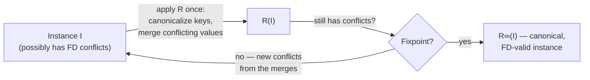

[[book-guidelines|↩ Back to guidelines]]

## The problem: equality is a relation you can't just query away

Suppose you're building a database, and two rows turn out to represent the same thing. Node `3` and node `5` in a graph get merged. Two arithmetic expressions `2 * (x + 3)` and `6 + 2 * x` are proven equal. What do you do with the *old* rows?

The naive answer — "just add a fact `equal(3, 5)` to a relation and join against it whenever you need to compare things" — is where this article's whole subject starts, because that naive answer is expensive and, worse, it's *contagious*. If `3` and `5` are the same node, then every row anywhere in the database that mentions `3` needs to behave as if it also mentions `5`, including rows that were inserted **before** the merge happened and had no way to know about it. A `path(1, 3)` fact and a `path(1, 5)` fact are now the same fact, but nothing forces the database to notice unless every single query pays for an extra equality-join. This is what the paper calls **[[Case-Study-Unification-Based-Points-to-Analysis#Join modulo equivalence|join modulo equivalence]]**, and [[Case-Study-Unification-Based-Points-to-Analysis|the Steensgaard points-to case study]] shows it degrading a Datalog encoding to worse-than-quadratic behavior in practice.

egglog's answer is to refuse to let equivalence be "just another relation." Instead it bakes equivalence in as a first-class part of the database's own structure, and it does the expensive work *once*, eagerly, right after new facts are asserted — so that by the time a query runs, there is no separate equivalence relation left to join against. Everything this article covers is the machinery for making that promise true: **union-find** for representing equivalence cheaply, **canonicalization** for picking one name per equivalence class, and a **rebuilding** procedure that keeps the whole database honest whenever new equalities show up. This triad is also exactly what an e-graph's "rebuilding" step already does in equality-saturation tools like egg — which is the payoff: it turns out Datalog's union-find pointer-analysis trick and EqSat's e-graph congruence maintenance are *the same algorithm* wearing two hats.

## Union-find as the backing structure for sorts

egglog lets you declare an **uninterpreted sort** — a type whose values are opaque integer ids, with no built-in meaning (unlike `i64` or `String`, which are *interpreted* — an `i64` value's identity *is* its numeric value, so two different numbers are never equal). A sort is a set of these ids plus an **equivalence relation** over them, and that equivalence relation is implemented directly with a **union-find** data structure (Tarjan 1975).

If you've built a union-find before — for Kruskal's MST, or for tracking connected components — this is the same structure, doing the same job: `union(a, b)` merges two ids into one equivalence class, and `find(a)` (here called **canonicalization**, written $\lambda_\equiv$) walks up to whichever id currently represents that class. Two ids are equivalent **iff they canonicalize to the same id**.

```rust
// A minimal sketch of what backs an egglog sort.
struct UnionFind {
    parent: Vec<usize>,
}

impl UnionFind {
    fn find(&mut self, mut x: usize) -> usize {
        while self.parent[x] != x {
            // path halving: point x at its grandparent, then advance
            self.parent[x] = self.parent[self.parent[x]];
            x = self.parent[x];
        }
        x
    }

    fn union(&mut self, a: usize, b: usize) -> usize {
        let (ra, rb) = (self.find(a), self.find(b));
        if ra != rb {
            self.parent[ra] = rb; // rb becomes canonical for both classes
        }
        self.find(a)
    }
}
```

What's specific to egglog is *what the ids stand for*. In Datalog with lattices (Flix, Ascent), a function's return type can be a lattice value that gets `join`-ed on conflict — useful for shortest paths (`min`), reachability (`or`), and similar monotone accumulations. egglog's sorts generalize this one step further: the ids aren't just accumulator values, they're **e-class ids** — each one can stand for a whole equivalence class of terms. Section 3.3's `Node` sort example makes this concrete: `mk` constructs fresh node ids, and after `(union (mk 3) (mk 5))`, nodes 3 and 5 are "essentially indistinguishable to egglog" — any pattern variable bound to one could equally have been bound to the other.

**What breaks without this:** without a canonicalizing union-find, "nodes 3 and 5 are the same" would have to live as a fact in an ordinary relation, `equal(3, 5)`. Every rule that queries node identity would need an extra join against that relation (and against its transitive/symmetric closure!) just to avoid missing matches — precisely the join-modulo-equivalence tax the introduction described.

## Canonical representatives and canonicalization functions

Formally (§4.2), given a total order `<` over the universe of ids and constants, the canonicalization function is:

$$\lambda_\equiv(t) = \min\{t' : t' \equiv t\}$$

— "the smallest element in `t`'s equivalence class," lifted pointwise to work over sets and over whole database instances. This is just a formal way of saying `find(t)`, with "smallest by some fixed order" standing in for "whatever the union-find's root pointer currently is."

The crucial invariant egglog maintains is: **every id appearing anywhere in the database is canonical.** Not "canonical if you bother to call `find` on it" — actually, physically, canonical, at all times between rounds of evaluation. This is what makes queries cheap: a query never needs to canonicalize its own answer on the way out, and it never needs to canonicalize the rows it's scanning on the way in, because those rows are *already* canonical by construction. The database *is* the union-find's canonical view, not a separate structure sitting next to it.

```lean
-- The invariant, stated as a proposition about a well-formed egglog instance.
-- (Illustrative, not literal Lean source from the paper.)
structure Instance (N C : Type) where
  DB : Set (Entry N C)
  equiv : N → N → Prop
  [equivalence : Equivalence equiv]

def isCanonical (equiv : N → N → Prop) (canon : N → N) (n : N) : Prop :=
  canon n = n  -- n is its own class representative

def wellFormed (I : Instance N C) (canon : N → N) : Prop :=
  ∀ e ∈ I.DB, ∀ n ∈ e.ids, isCanonical I.equiv canon n
```

This is the same discipline a `isDefEq`-style definitional-equality checker in a dependently typed elaborator relies on: you don't want to re-derive that two metavariable solutions are equal every time you compare types, so you normalize (canonicalize) eagerly and compare the normal forms structurally. egglog's `λ_≡` is doing the identical job at the level of a whole database instead of a single term.

## Congruence closure via functional-dependency conflicts

Here's the part that makes canonicalization *hard to keep true*, rather than a one-time setup step: canonicalizing one id can **break** the functional-dependency invariant on functions, which in turn forces more canonicalization, which can break more functions. This cascade is exactly congruence closure, arrived at from a completely different direction than the usual "congruence axiom" presentation.

Concretely (§3.4): every egglog function is backed by a map enforcing "each input tuple maps to a unique output" ([[The-egglog-Language-Model|see the egglog language model article]] for how `:merge` resolves this in general). Suppose the `Add` function currently holds two entries:

$$\{(a, b) \mapsto c,\ (a, d) \mapsto e\}$$

Now suppose some rule unions $b$ and $d$, and $b$ comes out canonical. Nothing about that `union` call touched `Add`'s table directly — but once you canonicalize `Add`'s *keys*, both entries become $(a, b) \mapsto c$ and $(a, b) \mapsto e$. Same input, two different outputs: a fresh functional-dependency violation, discovered purely as a side effect of an unrelated equality. To repair it, egglog invokes `Add`'s `:merge` expression on $\{c, e\}$ — which, for a term-constructor function like `Add`, defaults to `union` — so $c$ and $e$ themselves get unioned.

That last step is the whole trick. **A function whose `:merge` behavior is "union the conflicting outputs" is, by construction, enforcing congruence**: if $\text{Add}(a,b) = c$ and $\text{Add}(a,b) = e$ are forced to be the same input, then $c$ and $e$ are forced to be the same output — which is precisely the congruence axiom "if $x \equiv y$ then $f(x) \equiv f(y)$" (here applied backward: same $f$-inputs up to equivalence force same $f$-outputs up to equivalence, closing the loop into a genuine congruence relation on top of an ordinary equivalence relation). The paper states this plainly: "the built-in equivalence relation is also a congruence relation with respect to these functions."

```rust
// Conceptually, the conflict egglog discovers and resolves.
// `Add` maps (arg1, arg2) -> result, with FD enforced by the map.
let mut add_table: HashMap<(NodeId, NodeId), NodeId> = HashMap::new();
add_table.insert((a, b), c);
add_table.insert((a, d), e);

// After union(b, d) makes `b` canonical:
// canonicalizing keys turns both entries into (a, b) -> _
// => conflict between c and e => merge expression (here: union) fires
union_find.union(c, e);
```

## The rebuilding procedure and its relation to e-graph rebuilding

The paper names this whole repair loop the **rebuilding procedure**, and is explicit that it's a direct generalization of the rebuilding algorithm from `egg` (Willsey et al. 2021), which is itself derived from classical congruence-closure algorithms (Downey et al. 1980). Formally (§4.2), one step of rebuilding on an instance $I = (\mathrm{DB}, \equiv)$ produces $R(I) = (\mathrm{DB}_R, \equiv_R)$ by:

1. **Extending the equivalence relation** with every functional-dependency conflict found by canonicalizing keys — i.e. wherever $f(v_1,\dots,v_k) \mapsto n_1$ and $f(v_1,\dots,v_k) \mapsto n_2$ both appear (after key-canonicalization), add $(n_1, n_2)$ to the relation and take its closure.
2. **Recomputing the database** as $\mathrm{DB}_R = \lambda_{\equiv_R}\{f(v_1,\dots,v_k) \mapsto \mathrm{merge}_{f,\equiv}(K) \mid K = \{v : f(v_1,\dots,v_k)\mapsto v \in \mathrm{DB}\},\ K \neq \emptyset\}$ — canonicalize every key, and where multiple entries collapsed onto the same canonical key, fold their values together with the `merge` function (`min` after canonicalizing, if the output is an id-sort; the lattice-join $\bigsqcup$, if the output is an interpreted constant).

The paper is careful to distinguish this from a plain e-class-analysis propagation step: **for functions whose `:merge` is `union`, rebuilding is exactly congruence closure**; for other `:merge` expressions (like a lattice `min` or `max`), it's "more akin to the e-class analysis propagation algorithm" from `egg` — data flowing bottom-up from children e-classes to parents and getting joined. The two cases share one mechanism because they're the same operation instantiated at two different `:merge` functions. That unification is a large part of why egglog needed only one rebuilding procedure to subsume both roles that `egg` and Datalog-with-lattices previously played separately.

## Iterating rebuilding to a fixpoint

Step 2 above has a subtlety worth sitting with: **recomputing $\mathrm{DB}_R$ can itself invalidate the invariant again.** Canonicalizing keys can create *new* conflicts that weren't visible before — merging two outputs can trigger a `union` that makes some *other* function's keys collide, and so on. So a single call to $R$ is not enough; the paper defines the **complete rebuilding function** $R^\infty$ as $R$ applied repeatedly until it reaches a fixpoint:

$$R^\infty = R \circ R \circ R \circ \cdots \quad \text{(until no more conflicts arise)}$$

Termination is guaranteed for a pleasingly simple reason: **each round of rebuilding only ever merges ids together, never splits them apart, and the database is finite** — so the number of distinct canonical ids strictly shrinks (or stays the same) each round, giving a decreasing measure bounded below by 1. This is the same argument that guarantees plain union-find operations terminate; rebuilding just layers "this can trigger more unions" on top without breaking the monotone-shrinking structure.



One full round of egglog evaluation is then defined as $F_P = R^\infty \circ T_P^\uparrow$: apply the (inflationary) immediate consequence operator once — see [[Formal-Semantics-of-egglog|the formal semantics article]] for why it's inflationary rather than the textbook monotone Datalog operator — and then rebuild to a fixpoint before the next round begins. Rebuilding never runs "a little"; it always runs all the way to a clean, canonical database, which is what lets every subsequent query treat the database as ground truth without hedging.

## Avoiding joins modulo equivalence through active canonicalization

Tie the threads together and the payoff is exactly the one promised in the opening section. Because rebuilding runs to a fixpoint **before** the query engine ever looks at the database again, every row the query engine sees already has canonical ids in every column. A query pattern like `(= (path x y) len)` can be answered with ordinary equality tests on stored values — no extra join against an `equal(_, _)` relation, no runtime check of "are these two ids secretly the same." [[Query-Evaluation-and-E-Matching|Relational e-matching]] gets to reduce e-graph pattern matching to a plain database query precisely because this invariant holds going in.

The [[Case-Study-Unification-Based-Points-to-Analysis|Steensgaard points-to case study]] is the sharpest illustration of why this matters operationally, not just aesthetically. Souffle's `eqrel` relation type *also* backs a relation with union-find internally — but Souffle still requires other relations that reference those ids to be explicitly joined against `eqrel` to resolve equivalence, because `eqrel` is bolted on as one relation among many rather than woven into how *every* function's keys are stored. egglog's canonicalization is active and universal: it isn't a data structure you can choose to query against, it's a property every table in the database is kept in continuously. That's the concrete difference between "having a union-find somewhere in your system" and "having your whole database live inside one."

**What breaks without active canonicalization:** if egglog instead stored ids un-canonicalized and left equivalence-checking to query time, the cost that `join modulo equivalence` describes — an extra relational join, on every query, against a relation whose size grows with the number of unions performed — would show up everywhere `path`, `Add`, or any other function result gets compared for equality, not just in a few obviously equivalence-heavy queries. Given how often rules re-query facts they or other rules just asserted, this cost compounds across rounds rather than staying flat.

## Where this leads

The rebuilding machinery here is [[Fixpoint-Reasoning-Frameworks#The mechanism|the mechanism]] [[Formal-Semantics-of-egglog|the formal semantics article]] formalizes as part of $F_P$'s fixpoint, the reason [[Incremental-Evaluation|semi-naïve evaluation]] needs to track rebuilt deltas rather than just rule-application deltas, and the exact lever [[Case-Study-Unification-Based-Points-to-Analysis|the Steensgaard case study]] pulls to eliminate join-modulo-equivalence from a real points-to analysis — this is also load-bearing for the `automated-reasoning` focus area's unification thread: a rebuilding-style congruence closure is the classical backend that makes syntactic unification decidable and efficient in the first place, so the same "canonicalize, detect conflict, merge, repeat to a fixpoint" loop reappears wherever a unifier needs to know whether two terms are secretly equal.
