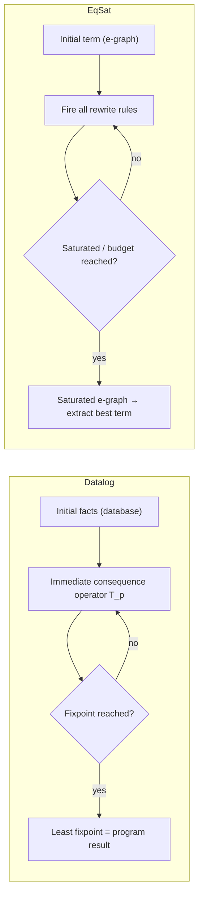

[[book-guidelines|↩ Back to guidelines]]

## The problem both paradigms are secretly solving

Suppose you want to compute something by repeatedly deriving new facts from old ones until nothing new comes out. That's it — that's the entire idea underneath both Datalog and equality saturation (EqSat). The two fields arrived at this idea from completely different directions — Datalog from database theory, EqSat from term rewriting — and for a long time didn't notice they were doing the same thing. This article is about the shared machinery underneath, because it's what egglog (the subject of the rest of this book) ends up unifying.

Both frameworks share the same operational shape: **the user supplies rules and an initial set of facts (a term for EqSat, a database for Datalog), and the system derives more and more facts until it stops changing.** That stopping point — the fixpoint — *is* the answer. Nothing about this shape is unique to either field; it's just "repeatedly apply a monotone-ish function until it stabilizes," which is also how you'd describe abstract interpretation's worklist algorithms or a constraint propagator grinding toward a fixpoint. If you've worked with any of those, the rhythm here will feel immediately familiar.

## Datalog: fixpoints over relations

### What breaks without a declarative fixpoint operator

Imagine writing a graph reachability analysis by hand in an imperative language: you'd maintain a worklist, pop an edge, check if it extends a known path, push new paths, repeat until the worklist empties. This is correct but it conflates *what* you're computing (transitive closure) with *how* you're computing it (worklist scheduling, deduplication, termination checks). Datalog's whole pitch is to let you write only the "what" — the *rules* — and have the engine handle the "how."

### The mechanism

A Datalog program operates over **relations**: named sets of tuples, all tuples in a relation sharing the same arity. A rule looks like a conjunctive query:

$$Q(\mathbf{x}) \;\text{:-}\; R_1(\mathbf{x}_1), R_2(\mathbf{x}_2), \ldots, R_n(\mathbf{x}_n)$$

The left side, $Q(\mathbf{x})$, is the **head**; the right side is the **body**. Running the rule means: find every substitution $\sigma$ (a binding of variables to constants) such that every body atom $R_i(\mathbf{x}_i[\sigma])$ is already a fact in the database, then add $Q(\mathbf{x}[\sigma])$ as a new fact for each such $\sigma$. Concretely — transitive closure:

```
E(1, 2).
E(2, 3).
E(3, 4).

TC(x, y) :- E(x, y).
TC(x, y) :- TC(x, z), E(z, y).
```

The first rule seeds `TC` from the base edges; the second rule says "if there's a path from `x` to `z`, and an edge from `z` to `y`, then there's a path from `x` to `y`." Run both rules repeatedly and `TC` grows: `{(1,2),(2,3),(3,4)}` after round one, then `{(1,3),(2,4)}` get added, then `{(1,4)}`, and then nothing more — the fixpoint.

Each individual rule $r$ can be viewed as a function $T_r$ from a database to a (larger) database — the union of the old facts with whatever the rule derives. The whole program $p$'s effect is the union of every rule's effect:

$$T_p(DB) = \bigcup_{r \in p} T_r(DB)$$

This $T_p$ is the **immediate consequence operator (ICO)**. Running the program means starting from the empty database and iterating $T_p$ until the database stops changing — i.e. finding a fixpoint of $T_p$. The foundational theorem of Datalog (Abiteboul et al. 1995) is that this process always *terminates*, and that the result is the program's **least fixpoint**: the smallest database that already contains every fact any rule could derive from it. Because $T_p$ only ever adds facts (it's monotone with respect to set inclusion, and the domain is finite for a fixed set of constants), the classical Knaster–Tarski argument applies directly — repeated application from the bottom ($\emptyset$) converges to the unique least fixpoint.

If you've done any Rust compiler work, this is precisely a Kildall-style dataflow worklist algorithm, except the "lattice" is just the powerset-of-tuples lattice and the "transfer function" is $T_p$. The engine's actual implementation (semi-naïve evaluation, covered in [[Incremental-Evaluation]]) is the efficient version of what a naive worklist loop does by hand.

```rust
// A conjunctive-query rule, roughly: T_r as an explicit closure.
// `Database` is conceptually HashMap<RelationName, HashSet<Tuple>>.
type Substitution = HashMap<Var, Const>;

fn apply_rule(rule: &Rule, db: &Database) -> HashSet<Fact> {
    // Find every substitution that satisfies every body atom against `db`,
    // then instantiate the head under each substitution.
    matches_for_body(&rule.body, db)
        .into_iter()
        .map(|sigma| instantiate(&rule.head, &sigma))
        .collect()
}

fn immediate_consequence(program: &[Rule], db: &Database) -> Database {
    let mut next = db.clone();
    for rule in program {
        next.extend(apply_rule(rule, db));
    }
    next
}

fn least_fixpoint(program: &[Rule]) -> Database {
    let mut db = Database::empty();
    loop {
        let next = immediate_consequence(program, &db);
        if next == db { return db; }
        db = next;
    }
}
```

Datalog later grew a **lattice extension**: instead of a relation being a plain set of tuples, it's generalized to a *function* from tuples to values in a semilattice, and a rule's head value becomes the supremum ($\sqcup$, the lattice join) over every value the body can produce. This is exactly how you'd encode, say, "shortest path so far" (lattice = numbers ordered by $\leq$, join = min) or dataflow-analysis facts (lattice = abstract values, join = the analysis's join operator) directly inside Datalog rules rather than bolting them on externally. This detail matters a great deal later — egglog's `:merge` mechanism (see [[The-egglog-Language-Model]]) is a direct generalization of this lattice join, and it's the single idea that lets egglog subsume both Datalog-with-lattices and EqSat's e-class analyses.

## Equality saturation: fixpoints over terms

### What breaks without keeping every rewrite around

Term rewriting's classic failure mode is the **phase-ordering problem**: applying one rewrite can foreclose a better rewrite later, and there's no good way to know in advance which order is best. The canonical example: rewriting $(a \times 2)/2$ locally to $(a \ll 1)/2$ (multiplication-by-2 replaced by a left-shift, a sensible strength reduction) is *individually* a good move, but it destroys the $2/2$ cancellation opportunity that was sitting right there. A greedy, destructive-replacement rewriter has already thrown away the version of the term where that cancellation was still visible.

Equality saturation's answer is not "try to order rewrites more cleverly" — it's "stop throwing anything away." Every iteration, fire *all* applicable rules, and instead of replacing terms, remember that the old and new terms are *equivalent*. The data structure that makes this affordable is the **e-graph**: a compact structure representing an exponentially large set of equivalent terms.

An e-graph is a set of **e-classes**, and each e-class is a set of equivalent **e-nodes**. An e-node is a function symbol paired with *e-class* children (not term children directly) — that indirection through e-classes is precisely what makes the sharing compact. A term $t$ is represented by an e-graph if some e-class contains some e-node that represents $t$, recursively.

```
      /                    /                        /              *
      *                    *   <<        →          *    <<        /
   a     2               a    2   1               a    2   1
(a×2)/2          after x×2 → x<<1          after (x×y)/z → x×(y/z)
```
*(egg-style e-graph: a solid box is an e-node, a dotted box is an e-class. Applying a rewrite adds a new e-node into an existing e-class rather than replacing anything — the old $(a\times2)/2$ shape is still fully present after both rewrites fire.)*

Crucially, the equivalence relation an e-graph induces is **congruent**: if the e-graph already shows $a_i \equiv b_i$ for every child, then it can also show $f(a_1,\ldots,a_n) \equiv f(b_1,\ldots,b_n)$. This congruence closure is what turns "these two leaves happen to be equal" into "therefore everything built on top of them is equal too" — automatically, without a separate rewrite rule for every possible context. If you've implemented union-find for a compiler's type-equality checker, congruence closure is union-find plus this one propagation rule layered on top; [[Equivalence-and-Canonicalization]] works through exactly how.

Applying a rewrite rule $\ell \to r$ proceeds in two steps: **e-matching** (pattern matching modulo the e-graph's equivalence — find substitutions $\sigma$ such that $\ell[\sigma]$ is represented somewhere in the e-graph) and then merging $r[\sigma]$ into the e-class that $\ell[\sigma]$ matched. Nothing is deleted; the e-class just grows a new e-node.

```python
# Sketch, not load-bearing code: what "no destructive replacement" looks like.
def apply_rewrite(egraph, lhs_pattern, rhs_pattern):
    for subst, matched_eclass in ematch(egraph, lhs_pattern):
        new_node = instantiate(rhs_pattern, subst)
        # merge, not replace: matched_eclass keeps every e-node it already had
        egraph.union(matched_eclass, egraph.add(new_node))
```

Two extensions matter for understanding what egglog will later generalize:

- **E-class analyses** attach a semi-lattice value (a semantic abstraction — e.g. a numeric lower bound) to every e-class, propagated bottom-up from children to parents and merged via lattice join whenever e-classes merge. This is EqSat's independently-invented analogue of Datalog's lattice extension — notice the shape is identical (semilattice value, join on merge), just arrived at from the opposite direction. In `egg`, the most popular EqSat toolchain, this mechanism is limited: only *one* analysis per e-graph, propagation only flows upward, and writing one requires dropping into host-language (Rust) code — [[The-E-Graph-Data-Structure]] covers exactly why those limits bite in practice.
- **Multi-patterns** let e-matching match several patterns *simultaneously* against a shared substitution — needed, for example, by tensor-graph optimizers that want to recognize two related `matmul` calls at once and share their computation. Ordinary single-pattern e-matching can't express this.

A recent technique, **relational e-matching**, speeds up matching (including multi-patterns) by reducing it to a database query — a first hint of the Datalog connection. But it suffers from a **"dual representation" problem**: the engine has to keep flipping between an e-graph representation and a relational database representation, and that translation overhead eats into the speedup. This is the precise itch egglog scratches: instead of *translating between* an e-graph and a database, make the database representation the *only* representation, so there's no translation tax to pay. [[Query-Evaluation-and-E-Matching]] is where this payoff gets worked out concretely.

## Same shape, different vocabulary

Both frameworks now line up almost term-for-term:



| Datalog | Equality saturation |
|---|---|
| Relation (set of tuples) | E-class (set of equivalent e-nodes) |
| Rule body/head | Rewrite rule LHS/RHS |
| Immediate consequence operator $T_p$ | "Fire all rules this round" |
| Least fixpoint | Saturated e-graph |
| Lattice-valued relation, $\sqcup$-join | E-class analysis, lattice merge |
| — (no analogue; sets don't need congruence) | Congruence closure over e-classes |

That last row is the interesting asymmetry, and it's exactly the gap egglog's central innovation closes. Datalog has no native concept of "these two facts are actually the same thing" — its relations are just sets, and set membership doesn't need congruence propagation. EqSat's entire value proposition, by contrast, is congruence-preserving equational reasoning. Naively bolting equality onto Datalog (the ad-hoc union-find and "[[Case-Study-Unification-Based-Points-to-Analysis#Join modulo equivalence|join modulo equivalence]]" pathologies covered in [[Case-Study-Unification-Based-Points-to-Analysis]]) or bolting rich composable analyses onto EqSat (the interval/not-equals story in [[Case-Study-Sound-Floating-Point-Rewriting]]) are both real, load-bearing workarounds people ship in production systems — and both are symptoms of the same missing piece. egglog's answer, previewed here and unpacked fully in [[The-egglog-Language-Model]], is to make equality a **first-class, extensible relation** inside a Datalog engine, with a **merge expression** generalizing both the lattice join above and e-graph congruence into one mechanism.

## Where this leads

This shared "rules + initial facts → iterate to a fixpoint" scaffold is the frame the entire rest of the paper builds inside. [[The-E-Graph-Data-Structure]] and [[The-egglog-Language-Model]] show how egglog's functions-with-merge subsume both the lattice join here and e-class analyses; [[Formal-Semantics-of-egglog]] makes the "iterate $T_p$ to a fixpoint" story precise for a language that also has equality, where the naive ICO stops being monotone and has to be patched with an explicit rebuilding step. If you're tracking this against the compiler project: this chapter is the ancestor of both your invariant-generation fixpoints (abstract interpretation is this same Knaster–Tarski least-fixpoint pattern with a different lattice) and your unifier's equational closure (congruence closure here is the mechanism your elaborator's `isDefEq`-style checks are implicitly relying on) — the rest of the book is essentially the story of noticing these are one mechanism, not two.
