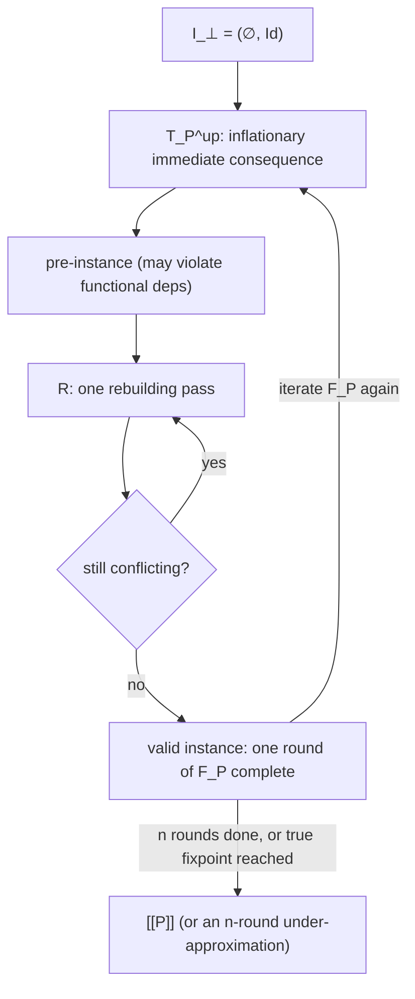

[[book-guidelines|↩ Back to guidelines]]

## Why egglog needs its own semantics, not Datalog's

[[Fixpoint-Reasoning-Frameworks]] set up the informal picture: Datalog's evaluation is "apply the immediate consequence operator $T_p$ until it stops changing," and that story works cleanly because $T_p$ is *monotone* — it only ever adds facts, never removes or changes existing ones, so Knaster–Tarski hands you a least fixpoint for free. [[The-egglog-Language-Model]] then showed egglog rules can have a `:merge` expression, and one of the most natural `:merge` behaviors is to *combine* an old value with a new one — e.g. `lo(e)` tracking the lower bound of an expression `e`, merged by taking the max of the old and new bound.

That single feature quietly breaks monotonicity. If `lo(e)` can go from `3` to `5` when a rule fires, then the set of *ground facts* the database contains has changed in a way that isn't just "we learned something new" — the fact `lo(e) ↦→ 3` is gone, replaced by `lo(e) ↦→ 5`. Standard Datalog's immediate consequence operator, which is defined as *only* the newly derived facts (no union with the old database — monotonicity makes that union redundant anyway), doesn't have a story for this. Rule application in egglog is not monotone in general, so this chapter's job is to build a fixpoint semantics that still converges to a well-defined answer despite that.

There's a second wrinkle, orthogonal to non-monotonicity: egglog has a first-class notion of *equality between things that used to look different*. Once you allow `union`, the database can end up with a function mapping the same input to two different outputs — a **functional-dependency violation** — purely because two of its inputs turned out to be equivalent. Plain Datalog relations, being sets of tuples with no notion of "this constant equals that constant," never have this problem. So on top of "what replaces $T_p$ when merge isn't monotone," the semantics also needs "what restores functional-dependency validity after each round, and how do we know that process terminates."

## Syntax: a small core language

The chapter works with a deliberately minimal core fragment of egglog — no `union` sugar, single-atom rule heads, `:merge` restricted to plain union-on-ids or a semilattice join. This is the usual move for a semantics paper: strip the surface sugar from [[The-egglog-Language-Model]] down to the fragment that actually carries the interesting behavior, prove things about that, and treat the sugar as syntactic shorthand that desugars into it.

$$
\begin{aligned}
\text{Program} \quad P &::= R_1, \ldots, R_n \\
\text{Rule} \quad R &::= A \;\text{:-}\; A_1, \ldots, A_m. \\
\text{Atom} \quad A &::= f(p_1,\ldots,p_k) \mapsto o \;\mid\; f(p_1,\ldots,p_k) \\
\text{Pattern} \quad p &::= f(p_1,\ldots,p_k) \;\mid\; o \\
\text{Term} \quad t &::= f(t_1,\ldots,t_k) \;\mid\; v \\
\text{Base pattern} \quad o &::= v \;\mid\; x \\
\text{Constant} \quad v &::= c \;\mid\; n \\
\text{Interpreted Constant} \quad &c \in C \\
\text{Uninterpreted Constant} \quad &n \in N
\end{aligned}
$$

Two kinds of constant matter, and the distinction is the load-bearing part of this grammar. **Interpreted constants** $C$ are things like integers and strings — values whose identity is fixed and external, exactly two are equal iff they're literally the same value. **Uninterpreted constants** $N$ are the formal stand-in for what [[The-E-Graph-Data-Structure]] calls e-class ids: opaque handles with no meaning beyond "this identifies some equivalence class of terms." The paper is explicit that a *well-formed* egglog program never mentions a specific uninterpreted constant directly — you can't write `n_47` in source code — but the semantics still needs them in its vocabulary, because that's what a `Sort`-typed function ends up returning once you evaluate it.

If you've built a compiler, this is a familiar move: $N$ plays the role of **fresh metavariables** or **fresh SSA temporaries** — names the *system* invents to name intermediate results, never names the *user* writes down. A `Rust` analogy: `N` is like an internal `NodeId` newtype your compiler hands out from a counter; user syntax never contains one directly, but your IR is full of them.

## Instances: a database plus an equivalence relation

The semantics is built around one central object.

> An **instance** of a schema $S$ is a pair $I = (DB, {\equiv})$, where $DB$ is a set of function entries $f(v_1,\ldots,v_k) \mapsto v$ consistent with $S$, and ${\equiv}$ is an equivalence relation over $N \cup C$ such that $\forall c_1, c_2 \in C.\, c_1 \equiv c_2 \to c_1 = c_2$ (interpreted constants are only ever equivalent to themselves).

That last condition is worth sitting with: it says equivalence is a phenomenon that only happens to the *opaque* ids, never to the concrete data. Two integers `3` and `3` were already equal; egglog's `union` mechanism has nothing to add there. It's e-class-id-like things — terms whose "value" is really "which bucket of equivalent terms it's in" — that can be discovered equivalent over the course of evaluation. This is exactly the same discipline egg's e-graph enforces implicitly: you union e-class ids, you never claim two distinct literal integers are "the same."

Given a total order $<$ over $N \cup C$ (any fixed order will do — think "pick the lexicographically-smallest representative"), define the **canonicalization function**:

$$\lambda_{\equiv}(t) = \min\{t' : t' \equiv t\}$$

i.e. replace anything with the smallest thing it's equivalent to. This is lifted pointwise to sets and to whole database instances — canonicalizing a database means canonicalizing every constant appearing in every entry. If you've implemented union-find, $\lambda_{\equiv}$ is precisely `find` with a fixed canonical-representative policy (smallest id wins) instead of the usual "whatever `find` happens to return after path compression." [[Equivalence-and-Canonicalization]] works through the union-find machinery that actually computes this; this chapter treats $\lambda_\equiv$ as a black box and asks what a semantics built on top of it should mean.

Two judgments about ground atoms (atoms with no variables) set up everything that follows: $I \vdash A$ means "$A$ is derivable from $I$'s current contents," built inductively — a nested term $f(t_1,\ldots,t_k)$ is derivable at value $v$ if each child $t_i$ is derivable at some $v_i$ and the flat entry $f(v_1,\ldots,v_k)\mapsto v$ is literally in $DB$. A helper function `flatten` (Fig. 6 in the paper) takes a possibly-nested ground atom like `f(g(x)) ↦ y` and produces the *set* of flat entries it implies — `g(x) ↦ v'` for some fresh or existing `v'`, plus `f(v') ↦ y` — because the database itself only ever stores flat, single-level function entries. This is the same flattening every term-representation scheme needs: an e-graph's e-nodes store e-class-id children, never nested terms directly, for exactly the reason [[The-E-Graph-Data-Structure]] gave — indirection through ids is what makes structure sharing compact.

## The immediate consequence operator, made inflationary

Here is the first genuine departure from standard Datalog. Define $T_P(I) = (DB', {\equiv})$ where

$$DB' = \bigcup_{(A \,:\text{-}\, A_1,\ldots,A_m) \in P} \left\{\, \text{flatten}_I(A[\sigma]) \;\middle|\; \forall_{i=1,\ldots,m}\; I \vdash A_i[\sigma] \,\right\}$$

— this part is the ordinary "apply every rule under every satisfying substitution" story. But then the **actual** immediate consequence operator used is:

$$T_P^{\uparrow}(I) = DB \cup T_P(I)$$

explicitly unioned with the *old* database. Standard Datalog never bothers with this union, because $T_P$ is monotone there — anything $DB$ already had, $T_P(I)$ would re-derive anyway (a fact stays derivable once derived), so the union is a no-op. In egglog it is not a no-op, and the footnote in the paper gives the concrete failure case: a rule `Q(e) :- lo(e) ↦→ 5`, where `lo` tracks a lower bound merged by max. As `lo(e)`'s value increases over successive rounds, a fact that held for a smaller `lo(e)` value can stop holding for a larger one — $T_P$ without the union could *lose* facts round over round. Making the operator **inflationary** (always includes everything from before) is the fix: it guarantees the database only ever grows, restoring the monotonicity Datalog's convergence argument depends on, even though the underlying rule semantics ($:merge$, in particular) is not itself monotone.

**What breaks without this:** drop the $DB \cup {-}$ and the "lo" example above can genuinely thrash — a downstream rule that fired once (because `lo(e) ↦ 5` was momentarily visible) could later find that fact gone, and now you have a system whose behavior depends on iteration order and can even fail to have a sensible fixpoint at all. Inflationary-ness is a small syntactic change that buys back exactly the convergence guarantee the rest of the semantics needs.

```rust
// T_P^up, sketched. `Database` maps flat function entries.
// The "inflationary" part is just `next.extend(old)` — never discard prior facts.
fn immediate_consequence_up(program: &[Rule], instance: &Instance) -> PreInstance {
    let mut next = apply_all_rules(program, instance); // T_P(I): freshly derived entries
    next.extend(instance.db.clone());                  // union with DB: the inflationary part
    PreInstance { db: next, equiv: instance.equiv.clone() }
}
```

## Pre-instances and the rebuilding operator

$T_P^\uparrow(I)$ can violate the one invariant an *instance* is required to satisfy: that each function maps a given input to a single output. Two derivations can populate $f(v_1,\ldots,v_k)$ with two different values $v$ and $v'$ — maybe because a rule legitimately derived a new fact, maybe because $v_1$ and some $v_1'$ used to be *distinct* keys and just got unioned, silently colliding two previously-separate entries. The paper calls the result of $T_P^\uparrow$ a **pre-instance**: syntactically a `(DB, ≡)` pair, but not (yet) a valid one.

The **rebuilding operator** $R$ repairs this:

$$
(\equiv_R) = \text{equivalence closure of}\;\Big({\equiv}\; \cup \; \{(n_1, n_2) \mid f(v_1,\ldots,v_k)\mapsto n_1 \in DB,\; f(v_1,\ldots,v_k) \mapsto n_2 \in DB,\; n_1, n_2 \in N\}\Big)
$$

$$
DB_R = \Big\{\, \lambda_{\equiv_R}\big(f(v_1,\ldots,v_k)\big) \mapsto \mathrm{merge}_{f,\equiv}(K) \;\Big|\; K = \{v : f(v_1,\ldots,v_k)\mapsto v \in DB\},\; K \neq \emptyset \,\Big\}
$$

$$
\mathrm{merge}_{f,\equiv}(K) = \begin{cases} \min(\lambda_{\equiv}(K)) & \text{if } f\text{'s output type is } N \\ \bigsqcup K & \text{if } f\text{'s output type is } C \end{cases}
$$

Read this in two passes, because it's doing two things at once. First, $\equiv_R$ *discovers new equivalences*: whenever the same key maps to two different uninterpreted-constant outputs, those two outputs must actually be the same thing (this is exactly **congruence** — same function, same canonical inputs, so same output) — fold that equivalence in. Second, $DB_R$ *resolves conflicting entries* using each function's own `:merge` policy: for `Sort`-valued functions, take the smallest representative (this is the union-find "pick a canonical id" behavior egg's rebuilding does); for lattice-valued functions, take the join $\bigsqcup$ (this is the max-of-bounds, or min-of-costs, behavior [[The-egglog-Language-Model]] introduced as `:merge`). Every entry in $DB_R$ is canonicalized with respect to the *newly* discovered $\equiv_R$, not the old $\equiv$ — that's what $\lambda_{\equiv_R}$ signals.

Here's the subtlety the paper flags explicitly: canonicalizing with $\lambda_{\equiv_R}$ can itself create *new* conflicts. Two keys that were syntactically different before rebuilding might canonicalize to the *same* key after — because some of their arguments just got unioned — and now you have a fresh functional-dependency violation to resolve. So $R$ alone isn't enough; the paper defines $R^\infty$ as **iterated application of $R$ until it reaches a fixpoint**. This always terminates, because each round of $R$ either leaves the database the same size or strictly shrinks it (conflicting entries get merged into fewer canonical entries), and a database can't shrink forever.

```rust
// R^∞: iterate rebuilding until the instance stops changing.
// Terminates because each round can only shrink (or leave unchanged) the database.
fn rebuild_to_fixpoint(mut instance: PreInstance) -> Instance {
    loop {
        let rebuilt = rebuild_once(&instance); // R: one congruence-closure + merge pass
        if rebuilt == instance { return rebuilt.into_instance(); }
        instance = rebuilt;
    }
}
```

If this feels familiar from egg: it should. egglog's rebuilding is explicitly inherited from egg's rebuilding procedure, which is itself the Downey–Sattley–Maier congruence-closure algorithm. What's new here is stating it as an explicit, self-contained fixpoint operator over an abstract $(DB, {\equiv})$ pair rather than as an imperative procedure over a concrete e-graph data structure — which is exactly what lets the rest of the chapter reason about it algebraically.

## One evaluation round, and the ordering that makes it converge

One full round of evaluating an egglog program is defined as:

$$F_P = R^\infty \circ T_P^\uparrow$$

— derive everything the rules license (inflationary immediate consequence), then restore validity (rebuild to fixpoint). Intuitively $F_P$ makes a database "know more": more facts, more equivalences, never fewer of either. To make that intuition precise enough to prove a fixpoint exists, the paper defines an **expanded database** $E_{\equiv}(DB)$ — the "meaning" of a database once you interpret every entry up to canonicalization and, for lattice outputs, up to $\sqsubseteq$:

$$f(v_1,\ldots,v_k)\mapsto n \in E_{\equiv}(DB) \iff f(\lambda_{\equiv}(v_1),\ldots,\lambda_{\equiv}(v_k)) \mapsto \lambda_{\equiv}(n) \in DB$$
$$f(v_1,\ldots,v_k)\mapsto c \in E_{\equiv}(DB) \iff \exists c'.\, f(\lambda_{\equiv}(v_1),\ldots,\lambda_{\equiv}(v_k)) \mapsto c' \in DB \;\wedge\; c \sqsubseteq c'$$

and an ordering between instances: $(DB_1, {\equiv_1}) \sqsubseteq_I (DB_2, {\equiv_2})$ iff $E_{\equiv_1}(DB_1) \subseteq E_{\equiv_2}(DB_2)$ and ${\equiv_1} \subseteq {\equiv_2}$ — "database 2 knows at least everything database 1 knew, both in facts and in equalities." This is precisely the $\sqsubseteq_I$ ordering [[Fixpoint-Reasoning-Frameworks]] used informally to say EqSat and Datalog fixpoints "grow." Here it's given a real definition, one that accounts for both axes egglog can grow along that plain Datalog can't: lattice refinement ($c \sqsubseteq c'$) and equivalence growth (${\equiv_1}\subseteq{\equiv_2}$).

With that ordering in hand, the key theorem: although $F_P$ is **not monotone in general** (a single `:merge` can decrease what a lattice entry "looks like" pointwise even while it's semantically refining), the *sequence of iterated applications starting from the bottom instance* is always monotonically increasing:

$$I_\bot \sqsubseteq_I F_P(I_\bot) \sqsubseteq_I F_P(F_P(I_\bot)) \sqsubseteq_I F_P(F_P(F_P(I_\bot))) \sqsubseteq_I \cdots$$

where $I_\bot = (\emptyset, \mathrm{Id}_{N\cup C})$ is the empty database with only the identity equivalences. This is the crucial move: you don't need $F_P$ to be a monotone *function* for Knaster–Tarski-style reasoning to apply — you only need *this particular orbit*, starting from the bottom, to be increasing. That's a strictly weaker and easier-to-establish property, and it's exactly what's needed to guarantee the existence of a fixpoint.

**Key definition — the inductive fixpoint as program meaning:**

$$[\![P]\!] = F_P^{\infty}(I_\bot)$$

This is what an egglog program *means*: the limit of repeatedly applying "derive, then rebuild" starting from nothing. Note the honesty in the next line of the paper — for many real programs $[\![P]\!]$ is genuinely infinite (think of a program that can keep generating fresh terms forever, like unbounded recursive datatype construction), so in practice the system computes only a finite **under-approximation**, $(R^\infty \circ T_P^\uparrow)^n(I_\bot)$ for some fixed iteration budget $n$. This is the same "give up completeness, keep soundness" move every practical fixpoint-based system makes — widening in abstract interpretation, bounded model checking's depth bound, or simply capping EqSat's iteration count before extraction.



## Semi-naïve evaluation: the same answer, without repeated work

The naïve algorithm above — literally iterate $F_P$ from scratch each round — has the obvious inefficiency every from-scratch fixpoint computation has: round $i+1$ re-derives almost everything round $i$ already found, just to notice it's already there. **Semi-naïve evaluation** fixes this the standard Datalog way: track a **differential database** $\Delta DB_i$, containing only what's new or changed at round $i$, and restrict rule evaluation to substitutions that use at least one atom from $\Delta DB_i$.

Concretely, each ordinary rule $A \;\text{:-}\; A_1,\ldots,A_m$ expands into $m$ **delta rules**:

$$\{\, A \;\text{:-}\; A_1,\ldots,A_{j-1}, \Delta A_j, A_{j+1},\ldots,A_m \mid j \in 1\ldots m \,\}$$

— one delta rule per body position, each one requiring *that specific* atom to come from the delta while the rest can come from the full accumulated database. This is exactly the standard semi-naïve trick from Datalog engines, adapted here to also interact correctly with rebuilding:

```
procedure F_P^SN(P, n):
    I_0 ← I_⊥;  ΔDB_0 ← ∅
    for i = 1 … n:
        (DB_i, ≡_i) ← R^∞(I_{i-1} ∪ T_P^SN(I_{i-1}, ΔDB_{i-1}))
        ΔDB_i ← DB_i − DB_{i-1}
        I_i ← (DB_i, ≡_i)
    return I_n
```

**Theorem 4.1 / B.1.** *The semi-naïve evaluation of an egglog program produces the same database as the naïve evaluation.*

The proof (Appendix B) is a clean induction, and it's worth walking through because it isolates exactly which properties of $T_P$ and $R^\infty$ make the optimization safe. Write $I_i^{SN}$ and $I_i^N$ for the semi-naïve and naïve instances at round $i$; the goal is $I_i^{SN} = I_i^N$ for all $i$, by induction on $i$ (base case $i=0,1$ is immediate from the definitions). The inductive step leans on exactly two facts:

1. **Monotonicity of $T_P$ with respect to $\subseteq$.** Because $\Delta DB_i = DB_i^{SN} - DB_{i-1}^{SN} = DB_i^N - DB_{i-1}^N$ by definition, one gets $DB_{i-1}^N \supseteq DB_i^N - \Delta DB_i$, and — because $T_P$ is monotone — $T_P(I_{i-1}^N) \supseteq T_P(I_i^N - \Delta DB_i)$. Chasing this through the definition of $T_P^{SN}$ (which, by construction, only fires rules that use at least one $\Delta DB_i$ atom) shows $T_P(I_{i-1}^N) \cup T_P^{SN}(I_i^N, \Delta DB_i) \supseteq T_P(I_i^N)$ — the union of "what the full naïve step derives from the previous instance" and "what the semi-naïve delta rules derive" already covers everything the naïve $T_P$ would derive at this round.
2. **An idempotence-like identity for rebuilding:** $R^\infty(R^\infty(I) \cup DB) = R^\infty(I \cup DB)$ — rebuilding an already-rebuilt instance union a new chunk of database gives the same fixpoint as rebuilding the un-rebuilt union directly. This says $R^\infty$'s output doesn't carry any "memory" that a second, redundant rebuild could have found but a direct rebuild couldn't — rebuilding is confluent enough that you can freely interleave partial rebuilds with new derivations without changing the eventual fixpoint.

Chaining these two facts through the definitions of $I_{i+1}^{SN}$ and $I_{i+1}^N$ collapses both sides to the same expression, giving $I_{i+1}^{SN} = I_{i+1}^N$. Notice precisely where each hypothesis is load-bearing: monotonicity of the *underlying* $T_P$ (not the inflationary $T_P^\uparrow$, and not $F_P$ as a whole, both of which can fail to be monotone) is what licenses discarding "old" derivations in favor of delta-only ones without losing any facts; if $T_P$ itself could shrink, the delta rules could miss a derivation whose non-delta ingredients had themselves changed. The rebuilding identity is what licenses treating "rebuild partial result, then union in new facts, then rebuild again" as equivalent to "union everything, then rebuild once" — without it, semi-naïve's habit of rebuilding incrementally round-by-round could diverge from naïve's rebuild-the-whole-thing-each-time behavior.

**What this buys, concretely:** [[Incremental-Evaluation]] picks up from here and shows the same $\Delta DB_i$ machinery that makes rule evaluation incremental also makes **e-matching** incremental for free — a query re-execution against only the new facts is exactly relational pattern matching restricted to newly-added or newly-equated terms, which is precisely the "find only the new rewrite opportunities" behavior an EqSat engine wants on every iteration.

## Where this leads

This chapter is the mathematical spine the rest of the paper's "egglog is sound and does what you'd expect" claims lean on. The Implementation chapter (Section 5) describes the ~4,200-line Rust system that realizes $T_P^\uparrow$, $R$, and $F_P^{SN}$ concretely — its database is functional precisely so that the get-or-default term evaluation this semantics assumes (via `flatten` and the default-value clause in $\mathrm{aux}$) is cheap, and its rebuilding procedure is a direct implementation of the $R$ operator defined here. If you're tracking this against the compiler/elaborator project: $F_P$'s "derive, then restore an invariant, then repeat" shape is the same discipline your kernel's `isDefEq` needs when unification can retroactively unify two previously-distinct metavariables — the operational semantics here is exactly the general theory of "keep deriving facts under a growing equivalence relation until it settles," which is what definitional equality checking *is*, just specialized to one query instead of a whole database's worth of them.
