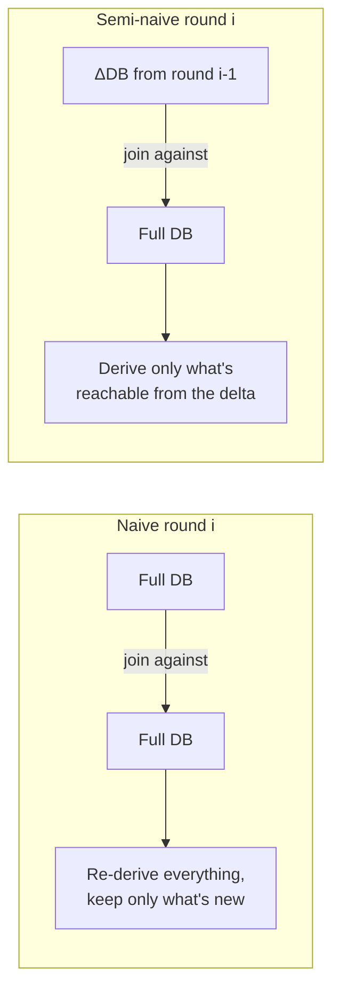

[[book-guidelines|↩ Back to guidelines]]

## What breaks without incrementality

Recall from [[Formal-Semantics-of-egglog|Formal Semantics of egglog]] how an egglog program gets evaluated: repeatedly apply the immediate consequence operator $T_P^\uparrow$, rebuild to fixpoint with $R^\infty$, and iterate $F_P = R^\infty \circ T_P^\uparrow$ until the database stops changing (or you hit an iteration budget). Read literally, that means *every single round re-runs every rule against the entire database from scratch* — including all the facts that were already there in the previous round and haven't changed.

That's enormously wasteful. Consider the transitive-closure rule from [[Fixpoint-Reasoning-Frameworks|Fixpoint Reasoning Frameworks]]:

```
TC(x, y) :- TC(x, z), E(z, y).
```

By round 10 of a large graph, `TC` might hold a million tuples, and only a few thousand of them are new since round 9. Naïve evaluation re-joins the *entire* million-tuple `TC` against `E` every round, re-deriving the same 990,000+ facts it already knew about, over and over, until the fixpoint. The waste compounds: each round's work grows with the *total* database size, not with the *new* information, so the total cost across all rounds is roughly quadratic in the final database size for something that's fundamentally linear-ish work.

This is a solved problem in the Datalog literature — the fix is called **semi-naïve evaluation** — but the paper's contribution here is showing that a completely generic, no-special-casing form of it survives egglog's added machinery (rebuilding, `union`, functional dependencies) essentially for free, *because* egglog's database is Datalog-native rather than an e-graph wrapped in a compatibility shim.

## The core idea: only join against what's new

The insight behind semi-naïve evaluation is almost embarrassingly simple once stated: **a newly derived fact can only come from a rule instantiation that uses at least one fact discovered in the *previous* round.** If every atom in a rule's body was already true two rounds ago, the rule already fired on that combination and produced nothing new — running it again is pure waste.

So instead of joining the whole database against itself every round, semi-naïve evaluation maintains a **differential database** $\Delta DB_i$ — just the tuples that are new or updated in round $i$ — and, for each rule, only considers instantiations where *at least one* body atom is drawn from that delta. Concretely, given an ordinary rule

$$A \;\text{:-}\; A_1, \ldots, A_m$$

the semi-naïve operator $T_P^{SN}$ expands it into $m$ **delta rules**, one per body position:

$$\{\, A \;\text{:-}\; A_1, \ldots, A_{j-1}, \Delta A_j, A_{j+1}, \ldots, A_m \mid j \in 1 \ldots m \,\}$$

Each delta rule replaces exactly one body atom with its delta-database counterpart, leaving the rest matched against the full (already-known) database. For transitive closure, `TC(x, y) :- TC(x, z), E(z, y)` becomes two delta rules — `E` is static here so only the first matters in practice:

```
TC(x, y) :- ΔTC(x, z), E(z, y).      -- new TC joined against all of E
TC(x, y) :- TC(x, z), ΔE(z, y).      -- all of TC joined against new E
```

If `TC` gained a thousand new tuples last round out of a million total, the delta rule only has to consider those thousand as the "outer" side of the join — the cost tracks the *new* information, not the accumulated total. Run enough rounds and the total work across the whole evaluation collapses from roughly quadratic back down to roughly linear in the size of the final result.



## How this fits into egglog's evaluation loop

Section 4.3's Algorithm 1 folds this directly into the fixpoint iteration already defined in [[Formal-Semantics-of-egglog|Formal Semantics of egglog]]:

$$
\begin{aligned}
I_0 &\leftarrow I_\bot; \quad \Delta DB_0 \leftarrow \emptyset \\
\text{for } i &= 1 \ldots n: \\
&(DB_i, {\equiv}_i) \leftarrow R^\infty\bigl(I_{i-1} \cup T_P^{SN}(I_{i-1}, \Delta DB_{i-1})\bigr) \\
&\Delta DB_i \leftarrow DB_i - DB_{i-1} \\
&I_i \leftarrow (DB_i, {\equiv}_i)
\end{aligned}
$$

Notice what *doesn't* change from the naïve version: rebuilding, $R^\infty$, still runs to fixpoint every round, over the *entire* updated instance, not just the delta. This is important and easy to miss — semi-naïve evaluation only economizes the *rule-application* step ($T_P^{SN}$ instead of $T_P^\uparrow$), not the *canonicalization* step. Rebuilding still has to re-check the whole database for functional-dependency conflicts after each round, because a single `union` deep in the delta can force canonicalization changes anywhere equalities propagate. The paper doesn't claim an incremental rebuilding procedure here — only incremental *rule matching*.

## Why semi-naïve and naïve evaluation agree (Theorem 4.1 / B.1)

Restricting which body atom must come from the delta is a very aggressive-looking optimization — it's not obvious on first glance that you don't lose any facts by insisting every derivation touch "something new." The paper proves this formally in Appendix B, and the structure of the proof is worth walking through because it's a template you'll see again in any incremental fixpoint algorithm (this is the same shape as incremental dataflow analysis or incremental abstract interpretation, if you've encountered those).

The proof is by induction on the round index $i$, showing $I_i^{SN} = I_i^N$ (semi-naïve instance equals naïve instance) at every round. The base case ($i = 0, 1$) is immediate. The inductive step leans on exactly two facts:

1. **Monotonicity of $T_P$ with respect to $\subseteq$.** If $\Delta DB_i = DB_i^N - DB_{i-1}^N$ captures precisely what's new, then $DB_{i-1}^N \supseteq DB_i^N - \Delta DB_i$ — trivially, since removing the delta from the current database gets you back something at least as small as the previous database. Applying $T_P$ (monotone) to both sides preserves the $\supseteq$, and combining that with what $T_P^{SN}$ computes directly (matching the delta against everything else) recovers all of $T_P(I_i^N)$ — nothing is lost by only requiring one atom from the delta, because monotonicity guarantees the "old" instantiations were already accounted for in a previous round.
2. **An idempotence-like identity for rebuilding:** $R^\infty(R^\infty(I) \cup DB) = R^\infty(I \cup DB)$. Rebuilding a partially-rebuilt instance unioned with more facts gives the same fixpoint as rebuilding the whole union from scratch in one go. This is what licenses splitting the "rebuild to fixpoint" step across rounds without changing the final answer — rebuilding is confluent enough that doing it incrementally in stages never gets stuck at a *different* fixpoint than doing it all at once.

Chaining these two facts through the definitions of $I_{i+1}^{SN}$ and $I_{i+1}^N$ collapses both sides to the same expression, closing the induction. **Theorem 4.1 / B.1**: semi-naïve evaluation produces exactly the same result as naïve evaluation, round for round — the speedup is free in the sense that costs nothing in the shape of the answer, only in redundant recomputation.

The proof leans critically on $T_P$ itself being monotone — note this is the *rule-application* operator $T_P$, distinct from the *inflationary* wrapper $T_P^\uparrow = DB \cup T_P(I)$ from Section 4.2, which is non-monotone in general (that's exactly why it needed the inflationary union in the first place — see [[Formal-Semantics-of-egglog|Formal Semantics of egglog]]). The induction only needs monotonicity of the underlying $T_P$; the union-with-old-database bookkeeping is handled separately in the algorithm's structure. If $T_P$ itself failed to be monotone — say, a hypothetical construct where a rule's applicability could be *revoked* by new facts rather than only extended — step (2) of the proof above would break: you could no longer guarantee that $T_P(I_{i-1}^N) \supseteq T_P(I_i^N - \Delta DB_i)$, because shrinking the database wouldn't be guaranteed to shrink (or leave unchanged) what the rule derives.

## A byproduct: incremental e-matching for free

Here's where the case for unifying Datalog and equality saturation gets its sharpest edge. In classical EqSat systems like egg, e-matching a rewrite rule against the e-graph is normally re-run from scratch every saturation round — matching is treated as "run this pattern-matching pass over the whole e-graph," full stop. Relational e-matching (the technique [[Query-Evaluation-and-E-Matching|Query Evaluation and E-Matching]] covers) already sped this up by treating e-matching as a database query, but the systems built on that technique still re-copied the whole e-graph into a fresh database and re-ran matching from scratch each round, because the e-graph and the relational database were two separate data structures kept in sync by hand (this is the "dual-representation problem," discussed further in [[The-E-Graph-Data-Structure|The E-Graph Data Structure]]).

egglog sidesteps that entirely: because the e-graph *is* the database (there's no second copy to synchronize), and because the database is Datalog-native, semi-naïve evaluation — a completely standard, decades-old Datalog optimization — applies to e-matching *without any special-casing for equality saturation at all*. Rewrite-rule matching just is rule matching in this system, and it inherits the delta-rule treatment automatically. Section 5.1 makes this point explicitly as one of the benefits of egglog's "database-native" approach over Zhang et al.'s prior relational e-matching: the earlier system's e-graph-to-database copying overhead on every round made incremental matching much harder to exploit, whereas egglog gets it "for free" as a consequence of the architecture, not as a bespoke feature.

The empirical payoff is visible in Figure 7 of the paper (Section 5.3): running egglog against egg on a shared equality-saturation math benchmark, the non-incremental variant (`egglogNI`, semi-naïve disabled) already beats egg by 3.34× purely from relational query optimization, but full egglog with semi-naïve evaluation reaches a 9.27× speedup — and explores a *larger* program space than either baseline in the same wall-clock budget, precisely because it isn't wasting cycles re-deriving equalities it already found in an earlier round.

## Where this leads

Incremental evaluation is [[Fixpoint-Reasoning-Frameworks#The mechanism|the mechanism]] that makes egglog's unification credible as more than a theoretical curiosity — it's the concrete place where "equality saturation is just Datalog" pays off in engine performance, not just in expressiveness. It sets up [[Query-Evaluation-and-E-Matching|Query Evaluation and E-Matching]]'s discussion of why a *language-native* database (rather than an e-graph with a bolted-on relational view) is what makes this optimization exploitable at all, and it's part of what the [[Case-Study-Unification-Based-Points-to-Analysis|points-to analysis]] and [[Case-Study-Sound-Floating-Point-Rewriting|floating-point rewriting]] case studies benchmark against their respective baselines. If you're building anything with an incremental fixpoint core — an incremental type-checker re-running only affected constraints, or an abstract interpreter re-analyzing only a changed call graph slice — this section's delta-rule construction and its correctness proof are close to a direct template: identify what's monotone, define the delta precisely as "new since last round," and prove the two-fact induction (monotonicity + idempotent convergence of whatever your "rebuilding" step is) to get incrementality for free.
