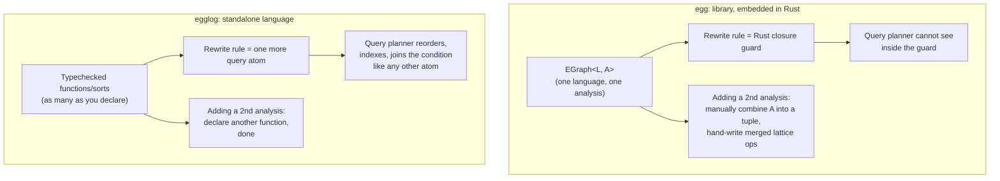

[[book-guidelines|↩ Back to guidelines]]

## The choice nobody talks about: library or language?

Every system that needs "rewrite this term, subject to some side condition" faces a fork in the road that has nothing to do with algorithms and everything to do with *where the conditions live*. You can embed your rewrite engine as a library inside a host language — Rust, OCaml, whatever — and let users write arbitrary host-language code for the parts the engine itself can't express. Or you can make the rewrite engine itself a full programming language, with its own parser, typechecker, and compiler, and force everything — including the conditions — to be expressed *in* that language.

egg, the equality-saturation library that egglog's authors built and then partly abandoned, took the first path. egglog takes the second. Section 5.2 of the paper is where they explain why that's not a stylistic footnote — it's a structural decision with real technical consequences, some of which the paper had already been building toward every time it mentioned "static typechecking" or "multiple datatypes" earlier in the write-up ([[The-egglog-Language-Model|The egglog Language Model]], [[Formal-Semantics-of-egglog|Formal Semantics of egglog]]).

## What breaks without this: opaque guards

Start with the concrete pain point the paper names first: **conditional rewrites**. Suppose you're rewriting floating-point expressions (this is literally what Herbie does — see [[Case-Study-Sound-Floating-Point-Rewriting|the Herbie case study]]) and you want a rule like

$$
\frac{x}{x} \rightarrow 1 \quad \text{provided } x \neq 0
$$

In egg, "provided $x \neq 0$" is a *guard* — an arbitrary closure written in Rust, attached to the rewrite. egg's matching engine runs its query (find all `(/ x x)` subterms), and for every match, it calls out to the guard closure to decide whether to actually apply the rewrite.

The failure mode here isn't that this doesn't work — it does. The failure mode is that **the guard is invisible to the query engine**. Rust closures are opaque blobs of bytecode from the point of view of anything trying to reason about the program: no optimizer, no typechecker, no query planner can look inside one and ask "what does this condition depend on, and can I push part of it earlier?" The engine has no choice but to match everything the base pattern allows and then throw work away downstream, one guard-check at a time. Every condition is a wall between what the compiler can see and what the programmer actually meant.

```rust
// egg-style: the condition is a black box to the matcher.
// The engine can match (/ x x) everywhere, but has no way
// to know that this closure is really "x != 0" until it runs it.
let rule: Rewrite<Math, ()> = rewrite!(
    "div-self";
    "(/ ?x ?x)" => "1"
    if |egraph: &mut EGraph<Math, ()>, _, subst| {
        // arbitrary Rust — opaque to the query planner
        !is_zero(egraph, subst["?x"])
    }
);
```

## egglog's answer: put the condition in the query

egglog dissolves this problem rather than solving it: it **removes the category "condition" entirely**. Recall from [[The-egglog-Language-Model|The egglog Language Model]] that an egglog rule is `(rule (query...) (actions...))` — a list of atoms to match, followed by a list of actions to run. There's no separate slot for "guard." If you want $x \neq 0$ as a precondition, you write it as one more atom in the query:

```lisp
(rule ((= e (/ x x))
       (not-equal-zero x))     ; just another query atom
      ((union e one)))
```

`not-equal-zero` here is an ordinary egglog relation — maybe maintained by a separate interval-analysis ruleset (again, this is exactly Herbie's structure). Because it's a relation living in the same functional database as everything else, the query engine can join against it using the same [[Query-Evaluation-and-E-Matching|Generic Join machinery]] it uses for every other atom. There is no longer a "run the match, then call an opaque check" phase split — the condition *is* part of the join, and the query optimizer gets to see it, reorder around it, and index into it like any other predicate. "Unrestricted conditional rewrites" (the paper's phrase) really just means: conditions stopped being a special case.

This is the same move, at a smaller scale, that unions and merge expressions make at the level of equality itself (see [[Equivalence-and-Canonicalization|Equivalence and Canonicalization]]): take something the host language used to handle out-of-band, and pull it back inside the language the engine can actually reason about.

## Typechecked rules vs. "hope it runs"

The second consequence is more mundane but arguably more valuable day-to-day: **egg's rewrite rules are not typechecked**. A rule like `"(/ ?x ?x)" => "1"` is just a pair of strings, parsed into pattern ASTs at rule-construction time; if you typo a symbol, reference a function with the wrong arity, or produce a term whose sort doesn't match what the rest of the e-graph expects, you find out at runtime, potentially deep into a saturation run, potentially as a silent wrong answer rather than a crash.

egglog rejects that risk before evaluation even starts. Because programs are written in egglog's own syntax and go through egglog's own parser and typechecker (Section 3's `(sort ...)`, `(function ...)`, and `(datatype ...)` declarations — see [[The-egglog-Language-Model|The egglog Language Model]] — are exactly the type signatures this typechecker checks against), a rule that applies a two-argument function to one argument, or unions two terms of different sorts, is rejected at compile time. This is the ordinary "catch it at compile time instead of runtime" argument every statically typed language makes — the interesting part is *why* egg couldn't have this for free. egg's rules are embedded as literal Rust values (or parsed pattern strings interpreted at runtime); there's no egg-specific type discipline layered on top of Rust's own type system for the *content* of the patterns, because that content is data, not code, from Rust's point of view. Making rules first-class, typechecked citizens requires the tool itself to be the language.

## One type, one analysis: egg's structural ceiling

The deepest of the three consequences is the one that's easy to miss because it looks like a Rust implementation detail rather than a design philosophy: **egg is, in practice, limited to a single term type and a single e-class analysis per e-graph.**

Recall from [[The-E-Graph-Data-Structure|The E-Graph Data Structure]] that an e-class analysis attaches a semi-lattice-valued piece of extra information to every e-class, propagated bottom-up as the e-graph grows — interval bounds, constant values, whatever the application needs. egg's `EGraph<L, A>` is generic over a language `L` (the enum of node constructors) and a single analysis `A`. Nothing in principle forbids writing `EGraph<Math, (IntervalAnalysis, NotEqualAnalysis)>` and manually threading a tuple through — but doing so pushes real complexity onto the user: they'd have to hand-write the merge logic for the combined lattice, keep the two component analyses' `make`/`merge` functions in sync, and thread a growing generic-type tuple through every place the analysis type appears in egg's Rust API. The paper is blunt about the cost: "allowing for multiplicity would significantly complicate the generic types in egg's Rust implementation." It's not impossible, it's just expensive enough in practice that real egg applications settle for one type and one analysis.

This is exactly the limitation [[Case-Study-Sound-Floating-Point-Rewriting|the Herbie case study]] runs headlong into: Herbie needs *both* an interval analysis (for soundness of division rewrites) *and* a not-equals analysis built compositionally on top of it, and egg's single-analysis ceiling is a structural reason (not just a convenience issue) that the original Herbie architecture couldn't combine them cleanly.

egglog sidesteps the whole problem because "analysis" was never a privileged concept to begin with. A function `(lo (Div a b)) -> f64` computing an interval lower bound is a function, exactly like every other function `(datatype ...)` declares in [[The-egglog-Language-Model|The egglog Language Model]] — it gets a `:merge` expression like any other function, participates in queries like any other function, and you can declare as many of them as you want because there's no generic type parameter being asked to enumerate them all. "Multiple datatypes and multiple analyses" isn't a feature egglog bolted on; it falls out for free once analyses stop being a special-cased extension point and become ordinary user-defined functions in the language.



## The cost side of the ledger

None of this is free. Being a language rather than a library means egglog users give up the ability to call arbitrary host-language code from inside a rule — the same opacity that made egg's guards unreasonable to a query planner also made them *maximally expressive*: an egg guard can do anything Rust can do. egglog's rules are confined to what egglog itself can typecheck and query, which means genuinely exotic conditions (ones that don't reduce to relations and functions egglog can represent) either need to be encoded as auxiliary egglog machinery or can't be expressed at all without dropping to the Rust library interface egglog also exposes. The trade is the ordinary DSL trade: less raw expressiveness, in exchange for everything that expressiveness was hiding from the compiler.

## Where this leads

This section is where the paper's structural thesis pays off concretely: every earlier design choice — functions as maps with `:merge` ([[The-egglog-Language-Model|The egglog Language Model]]), the functional database avoiding e-graph/database duplication ([[Query-Evaluation-and-E-Matching|Query Evaluation and E-Matching]]) — only becomes *usable* because egglog is a typechecked language rather than an embedded library; that's what lets a query planner see and exploit all of it. The same "put it in the language, not in host code" move reappears at a much larger scale in [[Case-Study-Unification-Based-Points-to-Analysis|the points-to analysis case study]] and the Herbie case study, where a single soundness bug hiding in opaque host code is exactly the failure mode language-level typechecking is designed to catch. If you're building anything with a trusted kernel or a proof-reconstruction pipeline (the `automated-reasoning` connection this topic is tagged against), this is the same argument for why proof terms and rewrite steps belong inside a checkable representation rather than behind an opaque procedure call — a trusted kernel that can't inspect *why* a step was taken can't verify it either.
