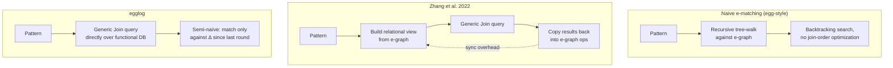

# Query Evaluation and E-Matching

[[book-guidelines|↩ Back to guidelines]]

## The problem: matching is search, and search needs a plan

Every rewrite-based system — a term rewriter, an EqSat engine, a Datalog interpreter — spends most of its time doing the same thing: given a pattern like `(+ ?x (* ?y ?z))`, find every place in the current data structure where that pattern occurs, and bind `?x`, `?y`, `?z` accordingly. In a plain term rewriter this is a simple tree walk. But [[The-E-Graph-Data-Structure|e-graphs]] don't store a tree — they store a congruence-closed graph of e-classes, where the same pattern can occur through combinatorially many congruent alignments. Naive e-matching in `egg`-style systems recursively walks the pattern against the e-graph, trying each e-class's e-nodes as candidates, backtracking on failure. This is exactly the same computational shape as evaluating a join query with nested-loop joins: for each candidate binding of the first variable, enumerate candidates for the second, and so on — an algorithm whose worst-case cost is far higher than necessary for the actual number of matches that exist.

**What breaks without a real query planner:** for patterns with several variables shared across multiple subpatterns (a "multi-pattern," e.g. matching both `(+ ?x ?y)` and `(* ?x ?y)` against the same `?x, ?y`), naive backtracking search can degenerate badly — it explores join orders that produce large numbers of intermediate results only to discard them, when a differently-ordered search could have pruned early. This is a well-studied problem in database query optimization, and it turns out e-matching *is* a database query problem in disguise.

## Relational e-matching: pattern matching as a database query

The key move — due to Zhang et al. [2022], and the foundation egglog builds directly on — is to stop thinking of e-matching as a graph search and start thinking of it as *relational query evaluation*. An e-graph can be viewed as a set of relations: for each function symbol $f$ of arity $k$, a relation $R_f \subseteq C^{k+1}$ where each tuple $(c_1, \ldots, c_k, c)$ means "the e-node $f(c_1, \ldots, c_k)$ lives in e-class $c$." A pattern like `(+ ?x (* ?y ?z))` becomes a conjunctive query:
$$
R_+(x, w, \text{out}) \wedge R_*(y, z, w)
$$
Finding all matches of the pattern is exactly finding all solutions to this query — the same operation a relational database performs when it evaluates a `JOIN`. Once this reduction is made, the entire machinery of decades of database query-optimization research becomes available for free: join ordering, indexing, cost-based planning.

This is genuinely the same reframing that [[Formal-Semantics-of-egglog|Datalog's rule bodies]] already are: a rule body $A_1, \ldots, A_m$ *is* a conjunctive query over the database, and firing the rule means finding all satisfying variable bindings and applying the head for each. Relational e-matching says: e-matching against an e-graph is the *same kind of query*, just phrased over relations derived from e-node/e-class membership instead of ordinary application facts. That equivalence is what egglog exploits structurally — not as an implementation trick applied on top of an e-graph, but as the organizing idea for the entire system, as covered in [[The-egglog-Language-Model]].

## Worst-case optimal joins: beating pairwise join plans

A traditional relational query optimizer evaluates a multi-way join by picking an order and performing a sequence of *pairwise* joins — join $R_1$ with $R_2$ to get an intermediate relation, then join that with $R_3$, and so on. This strategy has a known theoretical weakness: for certain queries (the classic example is the "triangle query" $R(x,y) \wedge S(y,z) \wedge T(z,x)$), every pairwise join order can produce an intermediate result that is asymptotically *larger* than the final answer, even when the final answer is small. No amount of clever ordering fixes this — the problem is structural to binary joins.

**Generic Join** [Ngo et al. 2018] avoids this pathology. Rather than joining relations two at a time, it binds variables one at a time across *all* relations that mention that variable simultaneously, intersecting the candidate sets from each relevant relation before moving to the next variable. This produces a *worst-case optimal* algorithm: its running time is bounded by the theoretical worst case of *any* algorithm for that query (up to a polylogarithmic factor) — it can never blow up an intermediate result beyond what the query's own structure demands. egglog's query engine is built directly on Generic Join, inheriting this guarantee for every rule body and every rewrite pattern in an egglog program.

```rust
// Sketch: Generic Join's variable-at-a-time binding, contrasted with
// pairwise join's relation-at-a-time binding.
//
// Query: R_add(x, w, out) ∧ R_mul(y, z, w)   — shared variable: w
//
// Pairwise join (naive e-matching's implicit strategy):
//   for out_add in R_add.rows() {
//       for out_mul in R_mul.rows() {
//           if out_add.w == out_mul.w { emit(out_add, out_mul) }
//       }
//   }
//   // materializes R_add × R_mul before filtering — can be huge.

// Generic Join (egglog's strategy, conceptually):
fn generic_join_step(
    relations_touching_var: &[&Relation],
    partial_binding: &Binding,
) -> Vec<Value> {
    // Intersect each relation's candidate values for the *next* variable,
    // given the binding so far — never materializes a full cross product.
    relations_touching_var
        .iter()
        .map(|r| r.candidates_for_next_var(partial_binding))
        .reduce(|a, b| a.intersect(&b))
        .unwrap_or_default()
}
```

In Lean terms, this is the difference between eagerly computing an intermediate `List (A × B)` and then filtering it, versus computing a decision procedure that only ever produces witnesses satisfying *all* constraints simultaneously — the Generic Join analogue of a well-chosen `Decidable` instance that never allocates work it doesn't need.

## The dual-representation problem, and why egglog removes it

Zhang et al. [2022]'s relational e-matching was a genuine advance — orders of magnitude faster matching — but it left a structural seam in place: the system still maintained an e-graph as its primary data structure, and *built a relational representation from it on demand* whenever a query needed to run. This is the **dual representation problem**: two copies of essentially the same information (which e-nodes exist, which e-classes they belong to) that must be kept synchronized. Every mutation to the e-graph — every `union`, every new e-node — has to eventually be reflected into the relational side before the next query, and that reflection is itself extra bookkeeping.

egglog's answer is to **not have two representations in the first place**. As established in [[The-egglog-Language-Model]] and [[Equivalence-and-Canonicalization]], egglog's database *is* the e-graph — each function is backed by a map from argument e-classes to a result e-class, which is simultaneously (a) the functional database Datalog evaluation runs queries against, and (b) the congruence-closed structure that represents the term space. There is no copying step, because there was never a second structure to copy into. The paper's own footnote on this point is direct: *"Zhang et al. [2022]'s implementation still uses an e-graph data structure; it creates a database from the e-graph whenever it needs to e-match. egglog avoids this copying overhead since it is already a database."*

This single design decision — functional-database-as-e-graph rather than e-graph-with-a-database-view — is what makes the next payoff possible.

## The payoff: incremental e-matching for free

Because egglog's e-matching *is* ordinary Datalog query evaluation over the functional database, egglog inherits [[Incremental-Evaluation|semi-naïve evaluation]] without needing to invent anything e-graph-specific. Semi-naïve evaluation is a decades-old Datalog technique: instead of re-running every query against the *entire* database on every iteration, track only the *new* facts (a differential database, $\Delta \text{DB}$) since the last round, and evaluate delta rules that only need to match against what actually changed. Because e-matching in egglog is literally query evaluation over the same relations, this incrementality applies to pattern matching automatically — matching a rewrite pattern against only the newly-added e-nodes each round, rather than re-scanning the whole e-graph.

Contrast this with Zhang et al. [2022]'s system: since e-matching there ran over a *freshly rebuilt* relational snapshot each time, there was no natural notion of "what's new since last round" to exploit — the paper explicitly notes that Zhang et al. only *conjectured* this problem could be solved via classical incremental view maintenance, without a concrete implementation. egglog's database-native design turns that conjecture into a direct consequence of its architecture.

The measured effect (§5.3, Fig. 7) is substantial: egglog's non-incremental variant (`egglogNI`, semi-naïve disabled) already beats `egg` by 3.34× on a math-rewriting benchmark purely from relational query planning; enabling semi-naïve evaluation pushes the speedup to 9.27×, because incremental e-matching avoids redundant re-discovery of matches against unchanged parts of the e-graph on every one of the 100 iterations.



## Synthesis: where this fits and where it leads

Query evaluation and e-matching is the point where egglog's two parent lineages — Datalog and equality saturation — become *literally the same code path* rather than two systems glued together. A rewrite rule's left-hand side, a Datalog rule's body, and an e-matching pattern are all, underneath, the same object: a conjunctive query over a functional database, evaluated with a worst-case-optimal join algorithm and incrementalized via semi-naïve evaluation. This is the technical payload behind the paper's title.

This connects directly to two Focus Areas worth naming explicitly. For **`automated-reasoning`**, Generic Join's variable-at-a-time binding is a concrete instance of constraint propagation via intersection — structurally close to how a unification procedure narrows candidate substitutions by intersecting constraints from multiple equations rather than trying one equation's solutions against another's wholesale. For **`static-analysis`**, semi-naïve e-matching is the same "compute only the delta, not the whole fixpoint again" idea that powers incremental dataflow analysis and incremental abstract interpretation — the [[Incremental-Evaluation|Incremental Evaluation]] article develops this connection further on the database side; this article is its query-engine counterpart.

Downstream, this machinery is what makes the [[Case-Study-Unification-Based-Points-to-Analysis|points-to analysis case study]] fast in practice — Datalog engines like Soufflé already use worst-case-optimal joins internally, so egglog's points-to analysis is competitive not despite adding equivalence-class reasoning but *because* that reasoning rides on the same query engine, rather than bolting an e-graph on top of a separately-optimized Datalog evaluator.
