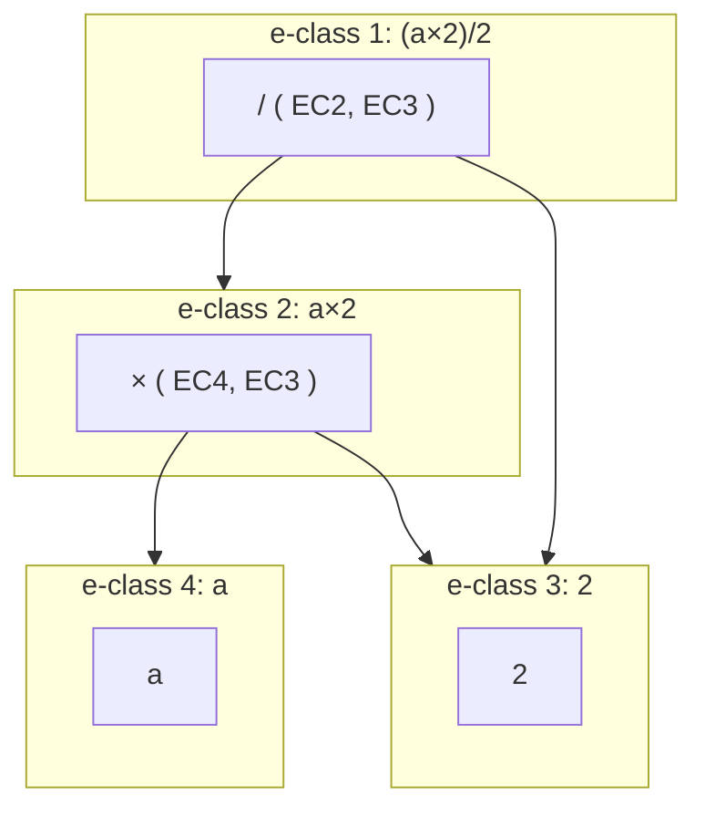
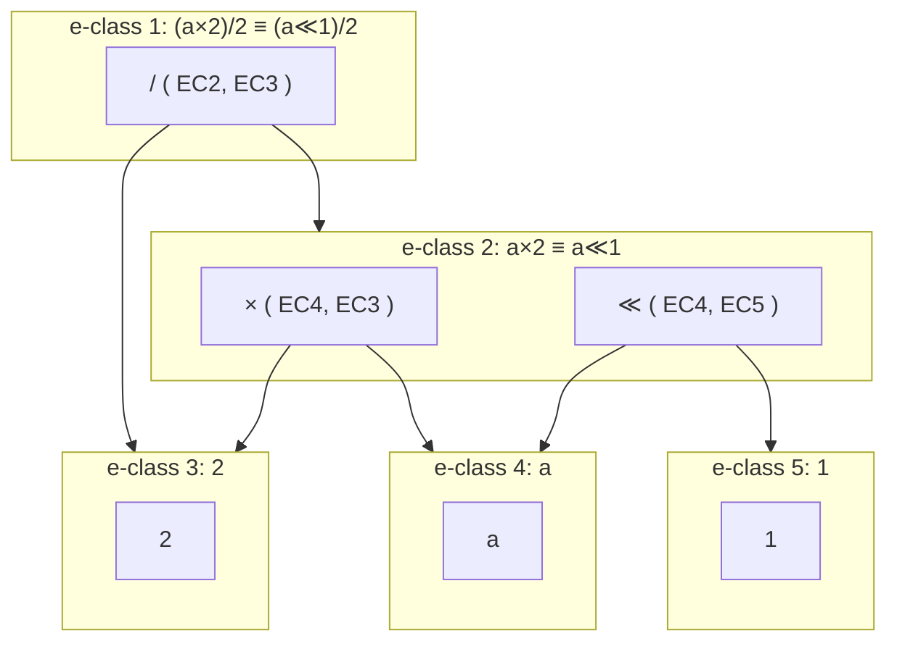

[[book-guidelines|↩ Back to guidelines]]

## The problem: rewriting destroys information

Suppose you're optimizing the arithmetic expression $(a \times 2) / 2$. You know the identity $x \times 2 \to x \ll 1$ (multiplication by two is a left-shift), so you rewrite:

$$(a \times 2)/2 \;\longrightarrow\; (a \ll 1)/2$$

This is locally a good move — a shift is cheaper than a multiply. But now look at what you've lost. The original term also admitted a *different* good rewrite: $(x \times y)/z \to x \times (y/z)$, which would have let you cancel the $2/2$ into $1$ and erase the division entirely. By committing to the shift rewrite first and throwing away $(a \times 2)/2$, you've permanently closed off the cancellation. This is the **phase-ordering problem**: term rewriting normally applies one rule at a time and *forgets the input term*, so which rules you happen to fire first silently determines which optimizations remain reachable. There's no way to "undo" and try the other branch without redoing the search from scratch, and in general you don't know in advance which ordering is best.

If Rust's borrow checker forced you to `Clone` before every mutation just so you could keep exploring alternate mutation histories, you'd eventually build a data structure that tracks *all* the histories at once instead of cloning defensively forever. That is exactly what **equality saturation (EqSat)** does: rather than committing to one rewrite and discarding the rest, it fires *all* applicable rules on *every* iteration and keeps both the original and the rewritten terms simultaneously, all sharing one structure. The data structure that makes "keep every version of every term, without keeping literally every version of every term" tractable is the **e-graph**.

## What breaks without sharing: naive term-set explosion

The naive way to "remember everything" would be to keep a set of full terms and add a new one every time a rule fires. This explodes immediately — rewriting a subterm 20 different ways inside a term that has that subterm nested inside three other operators means you're re-copying and re-storing the whole surrounding structure 20 times over, and the sets of equivalent terms you'd want to query ("what are all the things equivalent to `x`?") are scattered across thousands of near-duplicate trees. The e-graph solves this the same way structural sharing solves it in any persistent data structure: instead of storing whole terms, store terms as trees over shared, deduplicated sub-pieces, and track *equivalence classes* of those pieces rather than equivalence classes of full terms.

## E-nodes and e-classes

An e-graph is built from two intertwined structures:

- An **e-node** is a function symbol together with a tuple of **e-class** children (not e-node children — this indirection is the whole trick).
- An **e-class** is a set of e-nodes considered *equivalent* to one another.

So where an ordinary term tree has nodes pointing directly at other nodes, an e-graph's nodes point at *equivalence classes*, and each equivalence class contains a set of alternative nodes for "how to compute this same value." This is structurally close to a Rust enum whose variants can themselves each be one of several interchangeable representations, except the interchangeable set is discovered incrementally at runtime rather than fixed at compile time:

```rust
// Conceptual shape only — real e-graph implementations (e.g. `egg`)
// use interned integer ids, not raw pointers, for performance.
type EClassId = usize;

struct ENode {
    op: Symbol,                  // e.g. "×", "/", "a" (a leaf/constant)
    children: Vec<EClassId>,     // point at e-classes, not e-nodes
}

struct EClass {
    nodes: Vec<ENode>,           // alternative equivalent ways to build this value
}

struct EGraph {
    classes: Vec<EClass>,
}
```

**Representation, formally.** An e-graph represents a term $t$ if some e-class in it represents $t$; an e-class represents $t$ if some e-node in it represents $t$; and an e-node $f(c_1, \dots, c_n)$ represents a term $f(t_1, \dots, t_n)$ if each child e-class $c_i$ represents $t_i$. Notice the recursion bottoms out through e-classes at every level — this is precisely what buys the exponential compression: an e-class with $k$ alternative e-nodes, each of whose children e-classes also has multiple alternatives, represents the *product* of all those choices as distinct terms, while the e-graph itself only stores the sum of the parts once.

Take the running example, $(a \times 2)/2$:



After firing $x \times 2 \to x \ll 1$, the e-graph doesn't *replace* the `×` e-node — it **adds** a new e-node `≪(a, 1)` into e-class 2, alongside the existing `×(a, 2)`. Both representations of "$a \times 2$" now coexist in the same e-class:



Nothing was thrown away. If you later apply $(x \times y)/z \to x \times (y/z)$ to the *original* `×` e-node, you can still reach the cancellation — the phase-ordering problem is gone because ordering no longer forecloses anything; it only adds more equivalent alternatives into the shared structure.

**Applying a rewrite, mechanically.** The paper spells out the loop precisely: given a rule $\ell \to r$,

1. search the e-graph for e-classes that match the left-hand pattern $\ell$ (**e-matching**, discussed below) — this produces substitutions, e.g. $\{x \mapsto a\}$;
2. apply that substitution to the right-hand pattern $r$, producing a new term (e.g. $a \ll 1$);
3. **merge** the e-class this new term ends up in with the e-class that the left-hand pattern originally matched.

That merge step is the union operation that keeps equivalent-but-differently-shaped terms living in one e-class instead of two.

## Congruence: equality that propagates upward through structure

An e-graph doesn't just track the equivalences you explicitly assert — it also derives new ones for free, via **congruence**. If the e-graph represents two terms $a = f(a_1, \dots, a_n)$ and $b = f(b_1, \dots, b_n)$, and the e-graph already shows $a_i \equiv b_i$ for every $i$, then the e-graph can *also* conclude $a \equiv b$, i.e. it can merge $a$'s e-class with $b$'s e-class, even though nothing ever explicitly rewrote $a$ into $b$.

Think of congruence as the e-graph's analogue of Rust's `PartialEq` derived structurally: two `Add(x, y)` values are equal iff their `x`s are equal and their `y`s are equal, recursively. The difference is that in an e-graph "equal" doesn't mean "syntactically identical" — it means "lives in the same e-class right now" — and that relation can grow over the course of the algorithm as more rewrites fire. Congruence is what makes that growth *sound to propagate*: whenever two e-nodes share a function symbol and all of their respective children e-classes have already been unified, the parents must be unified too.

In implementations that canonicalize e-nodes (rewriting each e-node's children to their current canonical e-class representative before comparing), congruence reduces to plain deduplication: two e-nodes that canonicalize to an identical `(symbol, children)` tuple *are* the same fact and get folded into one, and the parent e-classes housing them get merged as a side effect. This detail matters later — [[Equivalence-and-Canonicalization]] shows that "keep e-nodes canonical" is exactly the invariant that egglog's rebuilding procedure exists to restore after every batch of unions, and it is the same mechanism this paper uses to explain *why* congruence closure is really a database consistency problem in disguise.

## E-matching: pattern matching modulo equality

Ordinary pattern matching asks "does this syntax tree have this shape?" **E-matching** asks the harder question: "does this e-graph contain *some* term with this shape, where 'this shape' is allowed to route through any of the equivalent alternatives an e-class offers?" Concretely, e-matching searches an e-graph for all substitutions $\sigma$ such that the pattern $p[\sigma]$ is represented somewhere in the e-graph — the match can freely pick different e-nodes out of different e-classes to complete the pattern, and it can even match a pattern variable to an e-class that has many other representations the matcher never looks at.

This is genuinely more expressive than matching over a single tree: because e-classes bundle up exponentially many concrete terms behind one shared structure, one e-matching query implicitly searches all of them at once. The tradeoff — and it's the tradeoff this whole paper (and later, [[Query-Evaluation-and-E-Matching]]) is built around — is that a naive e-matching implementation has to walk the e-graph's ad-hoc pointer structure by hand, which turns out to duplicate a lot of machinery that relational databases already solved for free.

## Multi-patterns: matching several terms at once

Standard e-matching finds substitutions for a *single* pattern. A **multi-pattern** is a *set* of patterns that must all be matched **simultaneously**, under one shared substitution for variables that appear in more than one of them. The paper's example is TenSat, a tensor-graph optimizer for machine learning workloads: it wants to find two e-classes $e_1 = \texttt{matmul}(M_1, M_2)$ and $e_2 = \texttt{matmul}(M_1, M_3)$ that share the *same* left operand $M_1$, so it can rewrite both into a single fused operation $e_3 = \texttt{matmul}(M_1,\, \texttt{concat}(M_2, M_3))$ and then union $e_1$ with $\texttt{split}_1(e_3)$ and $e_2$ with $\texttt{split}_2(e_3)$. A single-pattern matcher has no vocabulary for "two matches that must agree on a shared variable" — you'd need to run two separate searches and then manually intersect their bindings. Prior work built bespoke algorithms for this (the paper cites de Moura & Bjørner 2007 and Yang et al. 2021), but describes them as suboptimal and complex — a signal, again, of machinery being reinvented that a real query engine already has (a multi-pattern is, after all, just a join over several queries sharing a variable).

## E-class analyses: attaching semantics to e-classes

Plain e-graphs are purely syntactic — they track "what's equal to what," not "what does this term *mean*." That's a real limitation: the rewrite $\sqrt{x^2} \to x$ is only sound when $x \geq 0$, and nothing about syntactic equivalence can tell you that. **E-class analyses** (Willsey et al. 2021) patch this by attaching a semi-lattice value to every e-class — a semantic abstraction of everything that e-class represents (e.g., a numeric interval tracking possible lower/upper bounds). As the EqSat loop runs, analysis data is propagated **bottom-up**, from children e-classes to parent e-classes, and whenever an e-class merge brings two different analysis values together, they're combined via the lattice's join operator. This is precisely the same "abstract interpretation" idea a compiler engineer already knows from constant-folding or interval analysis — the e-class analysis just runs it *inside* the e-graph, using the shared structure as the abstract-interpretation domain's graph.

### Where `egg`'s e-class analyses fall short

The paper is explicit that in `egg` (the most widely used EqSat toolchain), e-class analyses have three specific limitations, each of which becomes a motivating gap that the rest of the paper (and egglog's design) is built to close:

1. **Single analysis only** — an e-graph can carry exactly one e-class analysis at a time. Want interval bounds *and* a not-equals fact *and* a sign analysis simultaneously? You have to hand-fuse them into one monolithic analysis type yourself.
2. **Upward-only propagation** — information only flows from children to parents. There's no built-in way for a fact discovered about a parent to refine what's known about its children, which rules out a large class of useful analyses (anything resembling backward/demand-driven reasoning).
3. **Host-language escape hatch required** — writing an e-class analysis means writing low-level Rust code against `egg`'s internals; it isn't something you can express *in* the rewrite language itself, so it's unchecked by any type system beyond Rust's own and isn't portable across implementations.

These three bullets are the direct setup for [[Case-Study-Sound-Floating-Point-Rewriting]] (multiple *composable* analyses replacing one fused monolith) and for [[The-egglog-Language-Model]]'s central move: making functions with `:merge` and `:default` a general-purpose, typechecked, *in-language* mechanism that can express what a bespoke e-class analysis used to require Rust code for.

## Where this leads

The e-graph — e-nodes as symbols over e-classes, congruence, e-matching, multi-patterns, and e-class analyses — is the vocabulary half of this paper's central unification; [[Fixpoint-Reasoning-Frameworks]] lays out the Datalog vocabulary it's unified with. The paper's core technical move, developed in [[The-egglog-Language-Model]] and made precise in [[Equivalence-and-Canonicalization]], is to notice that an e-graph is nothing more than a relational database (functions from tuples to ids) paired with a union-find over ids — which means e-matching is just a database query ([[Query-Evaluation-and-E-Matching]]), and the "single, upward-only, Rust-coded" limitations of `egg`'s e-class analyses dissolve once analyses are just ordinary egglog functions with `:merge` expressions, checked and composed like any other part of the language.
