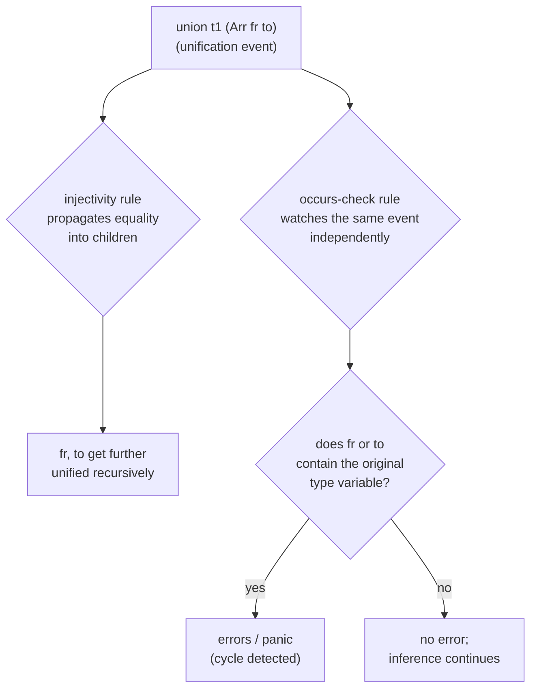

[[book-guidelines|↩ Back to guidelines]]

## The problem: bottom-up evaluation can't ask "what if?"

Datalog is a bottom-up language. You start from the facts you have and you fire rules forward until nothing new derives. That's exactly what makes it terminate reliably and scale to huge relations — but it also means Datalog has no native way to represent "I don't know this value yet, but I will." If you want to compute something that's naturally *top-down* — the size of one specific tree, the type of one specific expression — a purely bottom-up engine wants to compute the answer for every possible input, because that's the only direction it knows how to run.

Concretely: suppose you want `tree_size` for one tree, in a language like Soufflé. A naive bottom-up rule computes `tree_size(t, size)` for *all* trees `t`, which is an infinite relation over an infinite set of possible trees — the evaluation never terminates. Soufflé programmers solve this with **demand transformation**: you manually add a second relation, `tree_size_demand`, seeded with the one tree you actually care about, and every other rule is rewritten to fire only for trees that are already in the demand set. It works, but you're now maintaining two parallel relations by hand — the "real" computation and a shadow bookkeeping structure whose entire job is to simulate the top-down control flow Datalog doesn't have.

egglog sidesteps this without demand relations at all, and [[Fixpoint-Reasoning-Frameworks#The mechanism|the mechanism]] it uses — fresh ids as placeholders for unknown values — is also the same mechanism that gives it a working, if restricted, notion of unification and type inference "for free." This article covers three things that are really one idea wearing different hats: fresh ids as logic variables, the single injectivity rule that makes Hindley-Milner type inference fall out of ordinary egglog rules, and where this leaves egglog relative to Prolog and SMT solvers, its closest logic-programming relatives.

## Fresh ids as logic variables

Recall from [[Equivalence-and-Canonicalization|Equivalence and Canonicalization]] that every egglog **sort** is a domain of opaque ids managed by a union-find, and every **function** is a map with a functional-dependency invariant: given the same arguments, it returns the same id (`get-or-make`, if the entry doesn't exist yet — see [[The-egglog-Language-Model|The egglog Language Model]]). That "make if absent" behavior is the whole trick. When you write the query atom `(tree_size t)` for a tree `t` you haven't computed the size of before, egglog doesn't fail or block — it invents a **fresh id** to stand in for "whatever `tree_size` of `t` turns out to be," inserts it into the function's table, and hands that id back to you as a normal value you can build further terms with. Nothing else in the system needs to know the id doesn't have a concrete meaning yet.

That's precisely the discipline of a **logic variable** in Prolog or miniKanren: a placeholder that represents unknown information, which further unification steps can pin down later. Concretely for `tree_size`:

```lisp
(datatype Expr (Add Expr Expr) (Num i64))
(function tree_size (Tree) Expr)

;; compute tree size symbolically
(rewrite (tree_size (Node t1 t2))
    (Add (tree_size t1) (tree_size t2)))

;; evaluate the symbolic expression
(rewrite (Add (Num n) (Num m))
    (Num (+ n m)))
(union (tree_size (Leaf)) (Num 1))
```

Query `(tree_size t)` for a specific tree `t`: egglog creates a fresh id in the `Expr` sort for the answer, and then the ordinary rewrite rules — running bottom-up, exactly as in any other egglog program — fill in that hole with a concrete `Num` by the time saturation reaches a fixpoint. There's no second demand relation. The "unknown" is just an id sitting in an e-class, and rewriting narrows what that e-class can be equal to, the same way rewriting narrows any other e-class.

**What breaks without this:** if egglog required every function value to be known before the atom mentioning it could be asserted, you'd be back to demand transformation by hand, or you'd have to run the "obvious" fully bottom-up version and hope the relation you're computing happens to be finite in practice. Fresh ids let the engine *ask for* a value it doesn't have and *continue reasoning* with the placeholder — that's the entire difference between "simulate top-down control flow with a shadow relation" and "just write the rules and let unification do the plumbing."

A useful frame, since the source paper draws it explicitly: this is a form of the classic **magic-set transformation**, the standard database-theory technique for simulating demand-driven, top-down-style evaluation inside a bottom-up language. Magic sets do it by literally constructing demand relations, mechanically, from the query. egglog gets a similar effect implicitly, because the id itself *is* the demand — no separate relation needs to be synthesized.

```rust
// Rust intuition: a fresh id is like a not-yet-resolved slot in a union-find
// arena. Insertion doesn't require the value; it requires only a *name*
// for the value, which later merges (rewrite → union) can narrow.
struct FreshSlot { id: EClassId }

fn tree_size(t: Tree, table: &mut FunctionTable) -> EClassId {
    // get_or_make: if `t` isn't in the table yet, allocate a fresh id
    // and register it — no value is known, only a placeholder exists.
    table.get_or_make(t)
}
```

## Injectivity: unification in one rule

Fresh ids explain *how* egglog can represent an unknown. The next question is how egglog gets actual **unification** — deciding two symbolic structures are equal by recursively equating their pieces — without hand-writing a Robinson-style unification algorithm.

The answer is a single rule pattern the paper calls the **injectivity rule**. For a constructor like `Arr` (function-type arrows: `Arr from to`), injectivity says: if two `Arr` terms are already known to be equal (i.e. they landed in the same e-class, however that happened), then their corresponding arguments must also be equal.

```lisp
(rule ((= (Arr fr1 to1) (Arr fr2 to2)))
      ((union fr1 fr2)
       (union to1 to2)))
```

Read the left-hand side carefully: `(= (Arr fr1 to1) (Arr fr2 to2))` doesn't mean "these two literal terms are syntactically identical" — it means the *e-classes* containing an `Arr fr1 to1`-shaped term and an `Arr fr2 to2`-shaped term have already been unioned (by congruence, by an explicit `union`, by anything). The rule's job is purely to propagate that fact one level down: once the parents are equal, the children get unioned too. Because `union` is exactly the action from [[Equivalence-and-Canonicalization|Equivalence and Canonicalization]]'s congruence-closure machinery, calling `union` on `(Arr (TVar x) (Int))` and `(Arr (Bool) (TVar y))` propagates through this rule to unify `x` with `Int` and `y` with `Bool` — no separate algorithm, just ordinary rule firing plus congruence closure doing the rest.

This is the whole mechanism a Hindley-Milner-style type-inference implementation (à la Algorithm W) needs, minus the part that's usually the most fiddly to implement by hand: tracking an explicit substitution or "alias graph" of type variables and mutating it carefully as unifications accumulate. In an imperative implementation, unifying two type variables means finding their representatives and re-pointing one at the other, and getting that logic exactly right (path compression, occurs checking, avoiding stale references) is a classic source of bugs. In egglog, the union-find backing every sort (see [[Equivalence-and-Canonicalization|Equivalence and Canonicalization]]) already *is* that alias-graph machinery — union-find was built for exactly this — so type-variable unification is just `union`, and injectivity is just one ordinary rule that happens to walk one constructor level per firing.

**What breaks without this:** without a way to reduce "these compound terms are equal" to "these arguments are equal," a Datalog-style engine has no path to expressing unification at all — it would need every possible instantiation of every type expression represented explicitly, the same infinite-relation problem `tree_size` had. The injectivity rule is the load-bearing piece that turns "equate two arrow types" into "walk into their pieces and equate those," recursively, using nothing but ordinary rule firing.

### Hindley-Milner inference, concretely

With injectivity as the unification primitive, a chunk of real Hindley-Milner inference becomes a handful of straightforward rules. Consider `let f = \x. x in (f 1, f True)` — not typeable in simple types (it would need `f : Int → Int` *and* `f : Bool → Bool` simultaneously), but typeable under Hindley-Milner via the type scheme $\forall\alpha.\,\alpha\to\alpha$, instantiated fresh at each call site.

```lisp
;; Inferring types for lambda abstractions
(rule ((= t (typeof ctx (Abs x e))))
      ((define fresh-tv (TVar (Fresh x)))
       (define scheme (Forall (empty) fresh-tv))
       (define new-ctx (Cons x scheme ctx))
       (define t1 (typeof new-ctx e))
       (union t (Arr fresh-tv t1))))

;; Inferring types for function applications
(rule ((= t (typeof ctx (App f e))))
      ((define t1 (typeof ctx f))
       (define t2 (typeof ctx e))
       (union t1 (TArr t2 t))))
```

Look at what the application rule buys, compared to the simply-typed version from [[The-egglog-Language-Model|The egglog Language Model]]-adjacent material: instead of two separate rules (one deriving `f`'s arrow type from context, one combining it with the argument's type), injectivity lets you write a *single* rule that just asserts `t1` (the type of `f`) is equal to `TArr t2 t` (an arrow from the argument's type to the result) — and injectivity's propagation, plus ordinary congruence closure, handles unifying whatever `t1` already was against that arrow shape. Every piece of unification bookkeeping an Algorithm W implementation writes by hand collapses into "state the equation with `union`, let the rules do the walking."

### The occurs check, decoupled

Hindley-Milner inference has one well-known hazard: unifying a type variable with a type that contains that same variable produces an infinite type like $\alpha \to \alpha \to \cdots$, which is virtually never what anyone intends. Standard implementations bake an **occurs check** directly into the unification step — before you commit to unifying `x` with some type `T`, you first walk `T` looking for `x`.

egglog doesn't need to bake this in. Because `union` is just an action and injectivity is just a rule, the occurs check can be written as an *entirely separate, modular* relation that watches for the dangerous pattern independently:

```lisp
(relation occurs-check (Ident Type))
(relation errors (Ident))

(rule ((= (TVar x) (Arr fr to)))
      ((occurs-check x fr)
       (occurs-check x to)))
(rule ((occurs-check x (Arr fr to)))
      ((occurs-check x fr)
       (occurs-check x to)))
(rule ((occurs-check x (TVar x)))
      ((errors x)
       (panic "occurs check failed")))
```

The first rule fires whenever a type variable `x` gets unified with an arrow type — that's the moment worth watching, so it seeds `occurs-check x` on both branches of the arrow. The second rule recursively walks further arrows. The third rule is the actual check: if `occurs-check` ever reaches a `TVar` that's the *same* identifier `x` it started with, that's the cycle, and it fires `errors`/`panic`.

Nothing about unification's implementation had to change to add this. That's the concrete payoff of a rule-based, compositional substrate: a safety property that's usually welded into the core algorithm can instead be bolted on as an independent watcher over the same data, exactly the same way [[Case-Study-Sound-Floating-Point-Rewriting|Sound Floating-Point Rewriting]]'s interval and not-equals analyses compose without either one needing to know about the other.



## Where this leaves egglog relative to Prolog and SMT

The paper is explicit that egglog is best understood as sitting *between* three established traditions, borrowing selectively from each rather than reimplementing any of them wholesale.

**Versus Prolog.** Prolog's logic variables and egglog's fresh ids play the same conceptual role — both represent "unknown, to be resolved later." And the paper notes congruence closure (what egglog's rebuilding does — see [[Equivalence-and-Canonicalization|Equivalence and Canonicalization]]) can be viewed as a *dual* procedure to unification: unification asks "what substitution makes two terms equal," congruence closure asks "given some things are already equal, what else must be equal as a consequence." egglog leans on the congruence-closure side, computed bottom-up, rather than Prolog's search-based unification computed top-down.

The sharpest divergence is **backtracking**. Prolog resolves a goal by trying alternatives and backtracking on failure — which requires that its unification bindings (and hence its union-find-like structures) be *undoable*, i.e. backtrackable or persistent. egglog never backtracks: once a `union` happens, it's permanent, and rules only ever add information monotonically (see [[Fixpoint-Reasoning-Frameworks|Fixpoint Reasoning Frameworks]] for why monotonic growth toward a fixpoint is the foundation the whole system rests on). That single design choice is what lets egglog's union-find stay a plain, non-backtrackable, highly efficient structure — exactly the kind of structure that makes equality saturation and points-to analysis (see [[Case-Study-Unification-Based-Points-to-Analysis|Case Study: Unification-Based Points-to Analysis]]) fast. The price is that egglog has no direct analog of Prolog's `cut` (there are no choice points to cut away), though it keeps other imperative-flavored controls inherited from EqSat, like rule scheduling.

**Versus SMT solvers.** SMT solvers decide satisfiability over rich combinations of theories, and many of egglog's rewrite rules could in principle be expressed as SMT axioms — SMT is a strictly richer language, with disjunction and built-in theories egglog doesn't have. The key structural difference is what the two systems are *for*: an SMT solver's output is a satisfying model (or "unsat"), not a canonical representative of a term. egglog's output is **minimal** — in database terms, *universal* — which is precisely what [[The-E-Graph-Data-Structure|the e-graph data structure]]'s extraction step needs to pick a best term out of an equivalence class. You can repurpose an SMT solver as an EqSat engine, but the paper is blunt that doing so is "arcane and not officially supported" — it's fighting the tool's native shape. egglog's union-find-backed approach trades away SMT's theory generality for cheap extraction and predictable, efficient equational reasoning.

**Where egglog actually sits:** a bottom-up evaluation strategy borrowed from Datalog, combined with a unification mechanism borrowed from Prolog, with backtracking deliberately removed to keep the core data structure fast — a hybrid that isn't quite either ancestor, tuned specifically for program analysis and optimization workloads where monotonicity, not backtracking search, is the natural fit.

## Where this leads

This closes the loop on the whole book's central claim: the same union-find-and-congruence machinery that makes [[Equivalence-and-Canonicalization|equivalence and canonicalization]] cheap is also, from a different angle, a unification engine — and a single injectivity rule is enough to turn that engine into working Hindley-Milner type inference, occurs check included, with no bespoke algorithm required. For the **Type Theory** focus area, this is a direct, working instance of the metavariable unifier and definitional-equality machinery an elaborator needs — `union` here is doing the same job `isDefEq`-driven unification does in a dependently typed kernel, just specialized to Hindley-Milner's simpler unification problem. For **Automated Reasoning**, this is the clearest illustration in the book of unification and congruence closure as dual views of the same underlying computation, and of how a trusted, minimal core (no backtracking, monotone growth) can still express the control-flow patterns — demand-driven, top-down-looking computation — that normally require search.
