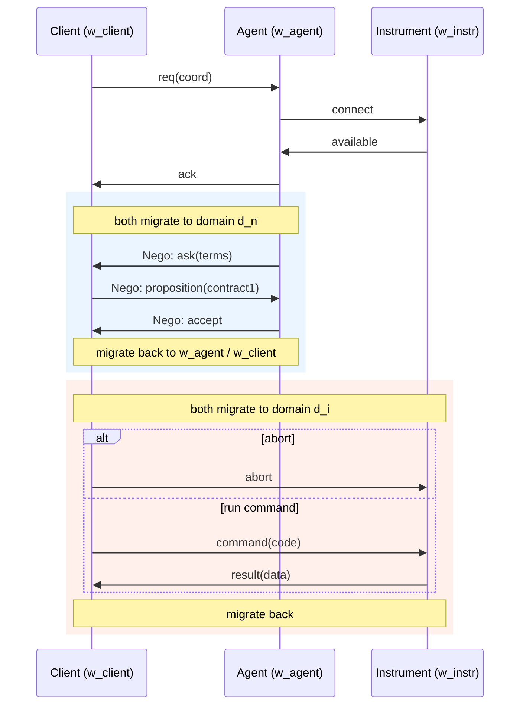
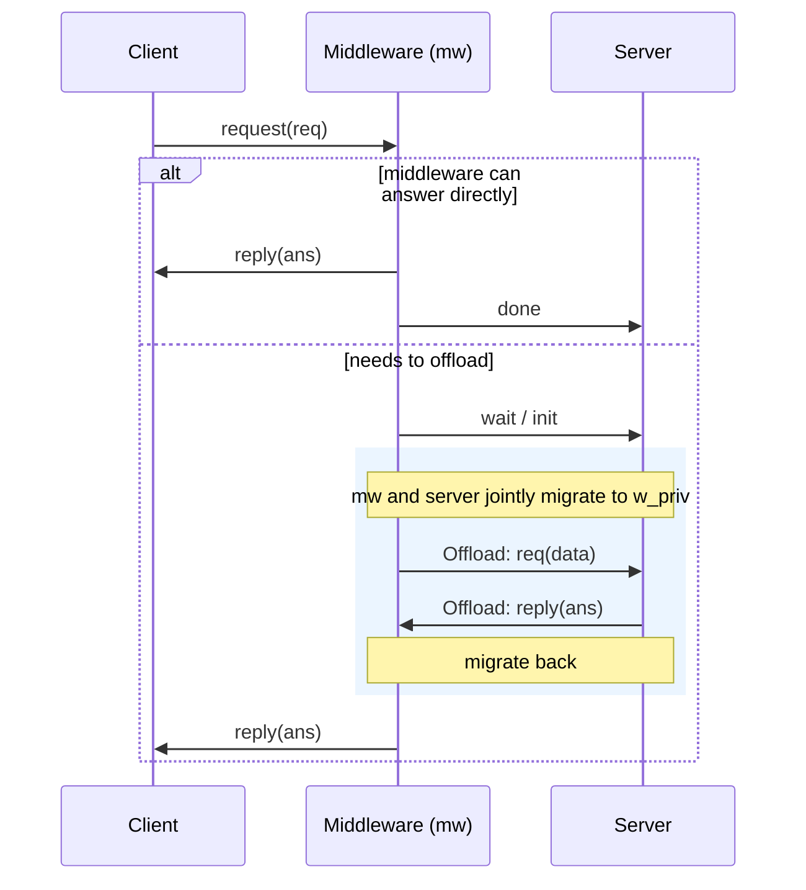
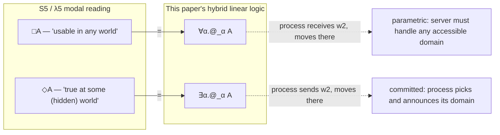

# Applications and Worked Examples

[[book-guidelines|↩ Back to guidelines]]

Every earlier section of this paper builds machinery: hybrid connectives, an
accessibility judgment, [[Medium-Processes|medium processes]], characterization theorems. None of
that machinery is worth anything unless it changes what you can actually
express and enforce. This article's job is not to reintroduce that machinery
— sibling articles cover the hybrid logic (§2), the process calculus (§3),
multiparty types (§6), and mediums (§7) in depth — but to watch it do work
on four concrete scenarios, drawn straight from Appendix B and Appendix C:

1. A **negotiation procedure** where two of three participants must jointly
   enter a trusted sub-domain before they're even *allowed* to talk.
2. A **middleware offload protocol** where privilege escalation is a
   first-class, type-checked domain move rather than an implicit side effect.
3. A **secure communication domain** excerpt showing that domain movement
   gates *who can interact with whom*, not merely what gets said.
4. The **web-store payment example revisited** with quantified payment
   domains, plus an encoding of modal logic S5 ($\lambda 5$) that resolves a
   known defect in prior work.

The throughline across all four: in ordinary session types, a domain
requirement like "must escalate to a secure zone first" or "must jointly
enter domain $d_n$ to negotiate" is either unenforceable or has to be bolted
on outside the type system, as a comment or a runtime check. Here it's a
typing obligation, checked the same way a channel's payload type is checked.
That's the entire pitch of the paper, made concrete.

---

## 1. Negotiation with a trusted sub-domain

### The problem a plain global type can't express

Three participants — a **client**, an **agent**, and an **instrument** —
each start in their own domain. The client wants to use some instrument; to
agree on terms, the client and the agent need to run a small negotiation
sub-protocol. But this negotiation is *sensitive*: it shouldn't be
observable or interruptible by an arbitrary third party, and it genuinely
only makes sense if both negotiating parties are co-located in some shared,
trusted context. A vanilla multiparty global type has no way to say "these
two parties must first arrive somewhere together" — it can only describe
*message order*, not a precondition on *where* the conversation happens.

### The negotiation sub-protocol

The paper first defines the reusable negotiation global type between two
generic roles $p,q$ (adapted from Demangeon–Honda):

$$
\mathrm{Nego}_{p,q} \;\triangleq\; p\to q:\{\mathsf{ask}\langle\mathsf{terms}\rangle.\;
q\to p:\{\mathsf{proposition}\langle\mathsf{contract}_1\rangle.\;
p\to q:\{\mathsf{accept}.\,\mathsf{end},\;
\mathsf{counter}\langle\mathsf{contract}_1\rangle.\;q\to p:\{\mathsf{accept}.\,\mathsf{end}\}\}\}\}
$$

Read it as a plain conversation first: $p$ asks for terms, $q$ proposes a
contract, $p$ either accepts or counters (and here the counter-offer is
simply accepted to keep the example short). Nothing domain-specific yet —
this is an ordinary branching global type.

### The main protocol: negotiation is gated behind a migration

The full protocol embeds $\mathrm{Nego}$ inside a domain-scoped sub-protocol
using the paper's `moves ... to ... for ...` construct (§6):

$$
\begin{aligned}
\mathrm{client}\to\mathrm{agent}&:\{\mathsf{req}\langle\mathsf{coord}\rangle.\;
\mathrm{agent}\to\mathrm{instr}:\{\mathsf{connect}.\;
\mathrm{instr}\to\mathrm{agent}:\{\mathsf{available}.\;
\mathrm{agent}\to\mathrm{client}:\{\mathsf{ack}.\\
&\quad \mathrm{agent}\ \mathbf{moves}\ \mathrm{client}\ \mathbf{to}\ d_n\ \mathbf{for}\ \mathrm{Nego}_{\mathrm{agent},\mathrm{client}};\\
&\quad \mathrm{client}\ \mathbf{moves}\ \mathrm{instr}\ \mathbf{to}\ d_i\ \mathbf{for}\
\mathrm{client}\to\mathrm{instr}:\{\mathsf{abort}.\,\mathsf{end},\\
&\qquad\quad \mathsf{command}\langle\mathsf{code}\rangle.\,
\mathrm{instr}\to\mathrm{client}:\{\mathsf{result}\langle\mathsf{data}\rangle.\,\mathsf{end}\}\}
\}\}\}\};\;\mathsf{end}
\end{aligned}
$$

Two migrations, back to back, each solving a different correctness problem:

- `agent moves client to dn for Nego` — the agent and client *jointly* leave
  their home domains and arrive at a shared domain $d_n$ before a single
  negotiation message is exchanged. The type system will refuse to typecheck
  any attempt to run the $\mathsf{ask}/\mathsf{proposition}/\mathsf{accept}$
  exchange without that migration happening first, because the session
  handles for $\mathrm{Nego}$ only exist at domain $d_n$.
- `client moves instr to di for ...` — separately, the client and the
  instrument migrate to a *different* shared domain $d_i$ to run the
  command/result exchange, entirely independent of the negotiation domain.

This is the concrete answer to Appendix B's Key Question: **if the agent
tried to run the negotiation sub-protocol with the client without both
first migrating to $d_n$**, there is simply no well-typed derivation for
it — the local types projected from this global type require session
handles $y_{\mathrm{agent}}, y_{\mathrm{client}}$ that only exist *after*
the migration step, per the projection rule for `moves` (Def. 4.5, which
produces $\downarrow\beta.(\exists/\forall\alpha.@_\alpha G_1{\upharpoonright}r)\circ @_\beta G_2{\upharpoonright}r$
for participants of the migration). You cannot forge a session-typed
handle at a domain you haven't reached.



### The medium makes the migration mechanical, not magical

The paper doesn't just assert the migration is enforced — it exhibits the
**medium process** (§7's machinery, applied) that actually orchestrates it.
Structurally, the medium for this global type does four things in sequence
at the migration point:

1. The agent sends the fresh domain identifier $d_n$ to the medium.
2. The medium forwards $d_n$ to the client.
3. The medium receives back *from both* participants a session handle
   located at $d_n$: $y_{\mathrm{agent}}$ and $y_{\mathrm{client}}$.
4. Only now does the medium run $M_{d_n}\llbracket\mathrm{Nego}\rrbracket(y_{\mathrm{agent}}, y_{\mathrm{client}})$ — the negotiation sub-medium, instantiated at $d_n$ — and *fuse* ($\circ$) its continuation with the medium for what comes after (the migration back and the client/instrument leg).

This is exactly the point Appendix B's second Key Definition ("data-flow
capture via mediums") is making: even where two parties (say, client and
some later bank-like party) never interact directly, the medium's
specification is precise enough to capture every data flow between
mutually inaccessible participants. Nothing here is "the implementation
happens to enforce this" — the enforcement is a theorem (Theorem 4.11)
about the typing of the medium itself.

---

## 2. Domain-aware middleware: escalation as a typed move, not a side effect

This is the paper's own running example from the introduction, spelled out
fully here with its medium. It is the cleanest illustration of "what
domain-awareness buys you that plain delegation doesn't."

### The offload sub-protocol

$$
\mathrm{Offload}_{p,q} \;\triangleq\; p\to q:\{\mathsf{req}\langle\mathsf{data}\rangle.\;q\to p:\{\mathsf{reply}\langle\mathsf{ans}\rangle.\,\mathsf{end}\}\}
$$

### The full protocol

$$
\begin{aligned}
\mathrm{client}\to\mathrm{mw}&:\{\mathsf{request}\langle\mathsf{req}\rangle.\\
\mathrm{mw}\to\mathrm{client}&:\{\;\mathsf{reply}\langle\mathsf{ans}\rangle.\,\mathrm{mw}\to\mathrm{server}:\{\mathsf{done}.\,\mathsf{end}\},\\
&\quad \mathsf{wait}.\,\mathrm{mw}\to\mathrm{server}:\{\mathsf{init}.\;
\mathrm{mw}\ \mathbf{moves}\ \mathrm{server}\ \mathbf{to}\ w_{\mathrm{priv}}\ \mathbf{for}\ \mathrm{Offload}_{\mathrm{mw},\mathrm{server}};\\
&\qquad\quad \mathrm{mw}\to\mathrm{client}:\{\mathsf{reply}\langle\mathsf{ans}\rangle.\,0\}\}\}\}
\end{aligned}
$$

Two branches after the middleware answers the client: either it already
knows the answer (`reply` immediately, and tells the server it's `done`),
or it needs help — it tells the server `wait`/`init`, then **migrates
together with the server to a privileged domain $w_{\mathrm{priv}}$** to run
$\mathrm{Offload}$, before coming back to reply to the client.



### Why this is more than delegation

Ordinary session delegation lets $\mathrm{mw}$ hand a channel to $\mathrm{server}$
and let it act on the middleware's behalf — but delegation says nothing
about *where* that interaction is allowed to happen, and nothing forces the
server-side computation to occur in a domain with different privileges than
the client-facing one. Here, the type of the `moves` construct requires
$\mathrm{mw}$ and $\mathrm{server}$ to actually **arrive** at $w_{\mathrm{priv}}$
— a domain presumably reachable only via some accessibility edge modeling an
authentication or privilege-escalation step — before the $\mathrm{Offload}$
session handles even exist. If $w_{\mathrm{priv}}$ is not accessible from the
server's ambient domain, there is no derivation; the protocol is rejected at
typing time, not discovered broken at runtime. This is the answer to
Appendix B's Key Question about the introduction's example: domain-aware
migration guarantees that escalation actually happened — structurally, in
the type — where a non-domain-aware delegation would just be an unqualified
handoff of a channel with no enforced precondition on where it executes.

The paper also flags a subtler invariant, visible directly in the medium: in
`cmw.wait : cmw.init : ... cmw(w_priv).cserver⟨w_priv⟩. cmw(y_mw@w_priv).cserver(y_server@w_priv). M^{w_priv}⟦Offload⟧(y_mw,y_server) ∘ (y_mw(z_mw@w_mw).y_server(z_server@w_server)....)`,
**the client's own domain never appears** in the migration step at all —
"the client's domain remains fixed throughout the entire interaction,
regardless of whether or not the middleware chooses to interact with the
server." Domain-awareness is local to the parties that need it; it doesn't
leak scope requirements onto participants who aren't involved.

### A Rust sketch of the same shape

Rust can't check domain accessibility for you (that's exactly the
extra judgment this paper adds to linear logic), but a typestate-style
sketch makes the *shape* of the enforced discipline vivid: escalation is a
state transition that must happen before you're allowed to hold a
"privileged offload" handle at all.

```rust
struct Public;
struct Privileged;

struct Middleware<State> {
    _state: std::marker::PhantomData<State>,
}

impl Middleware<Public> {
    // Escalation is the only way to obtain a handle typed at the
    // privileged domain — mirrors "mw moves server to w_priv".
    fn escalate(self, server: Server<Public>) -> (Middleware<Privileged>, Server<Privileged>) {
        (Middleware { _state: std::marker::PhantomData },
         Server    { _state: std::marker::PhantomData })
    }
}

struct Server<State> {
    _state: std::marker::PhantomData<State>,
}

impl Middleware<Privileged> {
    // Offload_{mw,server} is only callable once both parties are
    // Privileged — there is no constructor for this type otherwise.
    fn offload(&self, server: &Server<Privileged>, data: Data) -> Answer {
        server.handle(data)
    }
}
```

The point of the sketch is narrow but exact: `offload` is simply
*inexpressible* on `Middleware<Public>` — there's no overload, no missing
runtime check, the method doesn't exist for that type. That's the same
flavor of guarantee the paper gets from `@_{w_{\mathrm{priv}}}\mathrm{Offload}$: you
cannot even *name* the session at the privileged domain without having
migrated there first.

---

## 3. Domain movement gates *who*, not just *what*

The third Appendix B example is deliberately minimal, and it isolates a
distinct point from the first two. Consider:

$$
\mathrm{client}\to\mathrm{store}:\{\mathsf{purchase}:\ \mathrm{store}\ \mathbf{moves}\ \mathrm{bank}\ \mathbf{to}\ \mathrm{sec}\ \mathbf{for}\ \mathrm{SecurePay};\
\mathrm{store}\to\mathrm{client}:\{\mathsf{success}\langle\mathsf{receipt}\rangle.\,\mathsf{end},\,\mathsf{fail}.\,\mathsf{end}\}\}
$$

Here client, store, and bank all sit in genuinely distinct domains, and
critically: **only the store's domain can access the bank's domain.** The
client's domain cannot. This is not a claim about message content (nobody
claims the client would try to read the payment payload) — it's a claim
about *reachability*. Because the accessibility relation $\Omega$ has no
edge from the client's domain to the bank's, there is no well-typed process
at the client's domain that could stand in a session with the bank at all,
regardless of what protocol it tried to run. The type system doesn't need a
separate "confidentiality" mechanism bolted onto session types to get this:
it falls straight out of the accessibility judgment $\Omega \vdash \omega_1
\prec^* \omega_2$ that every session assignment in the linear context must
already satisfy (the well-formedness invariant from §3). The *entirety* of
the client–bank data flow is still captured — by the medium, which
faithfully mediates between store and bank on the client's behalf — but the
client process itself has no route to interact with the bank directly. That
distinction — "the data flow is fully specified, but direct interaction is
statically excluded" — is the paper's answer to what domain-awareness adds
beyond ordinary confidentiality-by-convention: it's enforced by the same
judgment that checks your channel types, not by a side policy.

---

## 4. The web store, quantified

### Recap of the concrete (hardwired) version

Section 3's example fixes the payment domain in the type:

$$
\mathrm{WStore}_{\mathrm{sec}} \;\triangleq\; \mathsf{addCart} \multimap \&\{\mathsf{buy} : @_{\mathrm{sec}}\,\mathrm{Payment},\ \mathsf{quit} : 1\}
$$
$$
\mathrm{Payment} \;\triangleq\; \mathsf{CCNumber} \multimap \oplus\{\mathsf{ok} : (@_{\mathrm{bnk}}\,\mathrm{Receipt})\otimes 1,\ \mathsf{nok} : 1\}
$$
$$
\mathrm{Bank} \;\triangleq\; \mathsf{CCNumber} \multimap \oplus\{\mathsf{ok} : \mathrm{Receipt}\otimes 1,\ \mathsf{nok} : 1\}
$$

The bank process typing, with $\mathrm{ws}$ the store's home domain:

$$
\mathrm{ws} \prec \mathrm{bnk};\ \cdot\ ;\ \cdot \;\vdash\; B :: @_{\mathrm{bnk}}\,\mathrm{Bank}[\mathrm{ws}]
$$

and the store's use of it:

$$
\cdot\ ;\ \cdot\ ;\ b{:}@_{\mathrm{bnk}}\,\mathrm{Bank}[\mathrm{ws}] \;\vdash\; \mathrm{Store} :: z{:}\mathrm{WStore}_{\mathrm{sec}}[\mathrm{ws}]
$$

The load-bearing sentence from the text is worth quoting precisely: to
*produce* an output of the form $@_{\mathrm{bnk}}\,\mathrm{Payment}$, the
store's process must first have interacted with the bank domain, because
producing that output requires knowing $\mathrm{ws}\prec\mathrm{bnk}$ — and
that fact is only established, in the typing derivation, after the bank
interaction. So a well-typed client that has bought something is typed
against the residual $\mathrm{Payment}$ obligation sitting *inside* the
secure domain:

$$
c \prec \mathrm{ws};\ \cdot\ ;\ x{:}@_{\mathrm{sec}}\,\mathrm{Payment}[\mathrm{ws}] \;\vdash\; \mathrm{Client} :: z{:}@_{\mathrm{sec}}\,1[c]
$$

and — this is the theorem the whole example is built to demonstrate — **no
typing derivation exists** for

$$
c \prec \mathrm{ws};\ \cdot\ ;\ \mathrm{Payment}[\mathrm{sec}] \;\vdash\; \mathrm{Client} :: z{:}@_{\mathrm{sec}}\,1[c]
$$

because it is not the case that $c \prec^* \mathrm{sec}$ (Theorem 3.6,
domain preservation). A client typed at its own public domain simply cannot
be assigned a session that lives at $\mathrm{sec}$; the well-formedness
invariant would be violated bottom-up in every rule of the derivation. That
non-existence is precisely "a client cannot exploit the payment platform by
accessing the trusted domain in unforeseen ways" — stated as a fact about
the absence of a proof, not as an operational claim you'd have to test for.

The client only ever gets legitimate access to $\mathrm{Payment}[\mathrm{sec}]$
once the store's migration has actually widened the accessibility context:

$$
c \prec \mathrm{ws},\ \mathrm{ws} \prec \mathrm{sec};\ \cdot\ ;\ x'{:}\mathrm{Payment}[\mathrm{sec}] \;\vdash\; \mathrm{Client}' :: z'{:}1[\mathrm{sec}]
$$
$$
\text{where}\quad \mathrm{Client} \;\triangleq\; x(x'@\mathrm{sec}).\,z\langle z'@\mathrm{sec}\rangle.\,\mathrm{Client}'
$$

### Removing the hardwired domain: WStore∃ and WStore∀

Hardwiring $\mathrm{sec}$ into the type is "inconvenient and potentially
error-prone" — it couples the store's interface to one specific
implementation domain. Two quantified alternatives fix this, and they are
*not* interchangeable — they hand control to different parties:

$$
\mathrm{WStore}_\exists \;\triangleq\; \mathsf{addCart} \multimap \&\{\mathsf{buy} : \exists\alpha.\,@_\alpha\,\mathrm{Payment},\ \mathsf{quit} : 1\}
$$

The **server** picks $\alpha$ (existential = "I commit to some accessible
domain, and I'm telling you which one"). As long as accessibility is
irreflexive and antisymmetric, whatever payment domain the server-provided
$\alpha$ resolves to still can't leak back and interact with the initial
public domain except exactly as $\mathrm{Payment}$ specifies.

$$
\mathrm{WStore}_\forall \;\triangleq\; \mathsf{addCart} \multimap \&\{\mathsf{buy} : \forall\alpha.\,@_\alpha\,\mathrm{Payment},\ \mathsf{quit} : 1\}
$$

The **client** picks $\alpha$ (universal = "you must be prepared to run
this at whatever accessible domain I choose"). Compliant server code must
be genuinely parametric in $\alpha$ — it cannot smuggle in domain-specific
behavior, because a $\forall\alpha$-typed process has to work for every
domain the type-checker might substitute in, which is exactly what forces
the server implementation to be domain-agnostic at the point of writing it.

| | who commits to the domain | reading | server obligation |
|---|---|---|---|
| $@_\omega A$ | fixed at definition time | "usable at this specific domain" | none — domain is baked in |
| $\exists\alpha.@_\alpha A$ (`WStore∃`) | the **offering** party (server) | "usable at *some* domain I name" | pick one concrete accessible domain and honor it |
| $\forall\alpha.@_\alpha A$ (`WStore∀`) | the **using** party (client) | "usable at *whichever* domain you name" | be parametric — work uniformly for every accessible domain |

This existential/universal asymmetry is exactly the same asymmetry that
shows up in Section 6's projection rule for the multiparty `moves`
construct — the leader of a migration projects to $\exists\alpha$ (it picks
the domain) while a follower projects to $\forall\alpha$ (it must be
prepared to go wherever the leader picked). Seeing it here, in the simpler
binary setting, is what makes that asymmetry legible before meeting it in
the multiparty projection rules.

---

## 5. $\lambda 5$, S5, and fixing "action at a distance"

### The prior art and its defect

Murphy et al.'s $\lambda 5$ gave a Curry-Howard reading of the modal logic
S5 as a model of distributed computation: propositions live at *worlds*,
accessibility between worlds is reflexive, transitive, and symmetric
(because, on their reading, any host on a network should reach any other).
But the computational content was sequential, and worse: the elimination
rule for disjunction required what the authors called **action at a
distance** — an effect that happens at another world with no explicit
communication step witnessing it in the calculus. It's a soundness-adjacent
wart: the logic says something happens "over there," but nothing in the
term language shows you the message that made it happen.

### Why domain-aware session types fix this for free

This paper's session calculus requires **every** domain move to be an
explicit process action — a migration prefix, a domain send/receive. There
is no way to affect another domain's state without a term that performs the
move. So when the paper reconstructs $\lambda 5$'s modal operators inside
its own hybrid linear logic, the action-at-a-distance problem simply cannot
recur — it's excluded by construction, not patched after the fact. The
encoding:

$$
\Box A \;=\; \forall\alpha.\,@_\alpha A \qquad\qquad \Diamond A \;=\; \exists\alpha.\,@_\alpha A
$$

Read operationally, per the paper: a process $P :: c{:}\Box A[w_1]$ will
*receive*, along $c$, some world $w_2$ accessible from $w_1$, and then move
to $w_2$ to offer $A$ there — "usable in any accessible domain," because the
offering process must be prepared to go wherever it's asked. Dually, a
process $P :: c{:}\Diamond A[w_1]$ will *send* a world $w_2$ along $c$ and
move there itself — "offered in some (hidden) domain" that the process
itself picks, exactly mirroring the $\exists$/server-commits reading from
$\mathrm{WStore}_\exists$ above.



### The S5 axioms as processes

The paper doesn't just claim the correspondence — it exhibits process
*realizations* of three characteristic S5 axioms, each relying on a
specific structural property of the accessibility relation. This is the
cleanest evidence in the whole appendix that the encoding is not just
notational sugar.

**$K\Diamond$**: $z:(A\multimap B)\multimap \Diamond A \multimap \Diamond B\ [w_0]$

$$
K\Diamond \;\triangleq\; z(x).z(y).y(\alpha).y(c_1@\alpha).x\langle\alpha\rangle.x(c_2@\alpha).\,c_2\langle v\rangle.([c_1\leftrightarrow v]\mid z\langle\alpha\rangle.z\langle c_3@\alpha\rangle.[c_2\leftrightarrow c_3])
$$

Intuition: $A$ is offered at some domain $\alpha$ accessible from $w_0$
(received via $y$); the transformer $A\multimap B$ (received via $x$) is
*moved to that same domain $\alpha$* and applied there, producing $B$ at
$\alpha$, which is exactly what $\Diamond B[w_0]$ means. A session
transformer usable "anywhere" ($\Box$-like) combines with a session offered
somewhere hidden ($\Diamond$) to produce a result still hidden at that same
place. This only needs $w_0 \prec \alpha$ — reflexivity/transitivity/symmetry
aren't separately invoked here.

**$T$**: $z : A \multimap A\ [w_0]$ — needs **reflexivity**

$$
T \;\triangleq\; z(x).\,x\langle w_0\rangle.\,x(c_1@w_0).\,[c_1\leftrightarrow z]
$$

Given a session offering $\Box A$ (well, here directly $A$ that must
migrate), you can always instantiate the quantifier at $w_0$ itself —
"anywhere" always includes "here" — precisely because $w_0 \prec w_0$
holds. This is the operational content of reflexivity: no motion is
required to exercise a $\Box$-typed offer at your own domain.

**$5$**: $z : \Diamond A \multimap \Diamond A\ [w_0]$ — needs accessibility
to be a full **equivalence relation**

$$
5 \;\triangleq\; z(x).\,z(\alpha).\,z\langle c_1@\alpha\rangle.\,x(\beta).\,x(c_2@\beta).\,c_1\langle\beta\rangle.\,c_1\langle c_3@\beta\rangle.\,[c_2\leftrightarrow c_3]
$$

This is the subtlest of the three, and it directly answers Appendix C's
first Key Question. The process receives *some other* domain $\alpha$ along
$z$ (an arbitrary domain the caller wants linked in), and must connect it
to $\beta$ — the hidden domain at which $x$'s $A$-behavior actually lives.
For the forwarding $[c_2\leftrightarrow c_3]$ at the end to be well-typed at
domain $\beta$, reachable *from $\alpha$*, you need $\alpha \prec \beta$ —
but all you were originally given was $w_0 \prec \alpha$ (accessibility
from the base world to the caller-chosen world) and $w_0 \prec \beta$
(accessibility from the base world to the behavior's hidden world). Getting
from those two to $\alpha \prec \beta$ requires **symmetry** (to flip
$w_0\prec\alpha$ into $\alpha\prec w_0$) composed with **transitivity**
(to chain $\alpha\prec w_0\prec\beta$) — i.e., exactly the closure
properties of an equivalence relation, and nothing less. Reflexivity and
transitivity alone (a preorder) would not license linking two domains that
are both merely reachable from a common third domain; you need the
symmetry step to turn "reachable from" into "mutually reachable," which is
precisely what the "5" axiom asserts at the logical level ($\Diamond A
\to \Box\Diamond A$, informally: what's possible somewhere is necessarily
possible everywhere accessible). The process term's reliance on
$[c_2\leftrightarrow c_3]$ being typeable at $\beta$-via-$\alpha$ is where
that logical requirement becomes a literal typing side-condition.

### A brief Lean framing

Since this corner of the appendix is explicitly a modal-logic encoding, it's
worth naming the correspondence in more familiar type-theoretic terms. If
you've seen a Lean-style Kripke encoding of S5 necessity/possibility over a
type of worlds `W` with an accessibility relation `R : W → W → Prop`:

```lean
def Box (A : W → Prop) (w : W) : Prop := ∀ w', R w w' → A w'
def Dia (A : W → Prop) (w : W) : Prop := ∃ w', R w w' ∧ A w'
```

the paper's $\forall\alpha.@_\alpha A$ and $\exists\alpha.@_\alpha A$ are
literally this shape, specialized to session types: `A` becomes a session
type indexed by the domain it inhabits, `R` becomes the accessibility
judgment $\Omega\vdash\omega_1\prec\omega_2$, and — the actual novelty here
— the quantifiers are not merely *propositions to prove* but *session
types with process-level realizers*. Where the Lean encoding above gives
you `Box A w → ∀ w', R w w' → A w'` as a term of a `Prop`, the session-typed
version gives you an actual $\pi$-calculus *process* that performs the
$w \to w'$ move and then behaves as $A$'s protocol — a genuine
computational (not just propositional) reading of $\Box/\Diamond$, which is
exactly the sense in which this generalizes $\lambda 5$ from sequential
proof terms to concurrent, communicating processes.

---

## Where this leads

None of these four examples introduces new theory — that's the point. They
are a checklist against which the machinery from Sections 3, 4, and 6/7
gets tested:

- **Accessibility as access control** (secure communication domain, §3
  above): the same $\Omega\vdash\omega_1\prec^*\omega_2$ judgment that
  threads through every typing rule in §3 of the paper is, without any
  extra apparatus, a static confidentiality mechanism.
- **Migration as enforced privilege escalation** (middleware offload): the
  `moves` construct from §6, instantiated concretely, shows that "you must
  authenticate before touching this resource" is a typing precondition, not
  a runtime assertion.
- **Existential vs. universal quantification as "who commits to the
  domain"** ($\mathrm{WStore}_\exists$/$\mathrm{WStore}_\forall$): this
  binary-session distinction is the direct ancestor of the
  leader-gets-$\exists$/follower-gets-$\forall$ asymmetry in the multiparty
  projection rule for `moves` — Appendix C's binary example is, in effect,
  a worked pre-image of a rule that's harder to parse the first time you
  meet it in the general multiparty setting.
- **Explicit communication as a soundness fix** ($\lambda 5$/S5): the
  requirement that *every* domain move be a visible process action isn't
  incidental flavor — it's precisely what closes the gap that made
  $\lambda 5$'s disjunction elimination unsound-feeling in the first place.

Taken together, these four scenarios are the paper's evidence that hybrid
linear logic's extra judgment — accessibility between worlds — is not
decoration on top of session types. It is the mechanism doing the real
enforcement work in every scenario where "a distributed system must reach
somewhere trusted before doing something sensitive" shows up, which is to
say, in most real distributed protocols worth type-checking at all.
