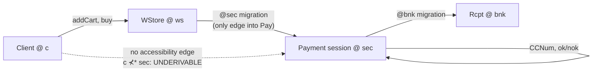

[[book-guidelines|↩ Back to guidelines]]

## The problem: session types can't say *where*

Ordinary (binary, Curry–Howard) session types, à la Caires–Pfenning, give you a
beautiful correspondence: propositions of intuitionistic linear logic are
session protocols, proofs are typing derivations, and cut-elimination steps
are literally the communication events of a process. If you've internalized
that correspondence, you already know how to read a type like

$$
\mathrm{WStore} \triangleq \mathrm{addCart} \multimap \&\{\mathrm{buy}: \mathrm{Pay},\ \mathrm{quit}: 1\}
\qquad
\mathrm{Pay} \triangleq \mathrm{CCNum} \multimap \oplus\{\mathrm{ok}: \mathrm{Rcpt}\otimes 1,\ \mathrm{nok}: 1\}
$$

as: "receive a cart, then offer a choice between buying (after which you'll
receive a credit-card number and eventually select ok/nok) or quitting."
That's a perfectly good *protocol* description. What it cannot say is
*where* any of this is allowed to happen. Nothing in $\mathrm{WStore}$ stops
a client from sending `CCNum` before any notion of "we're now talking to a
PCI-compliant payment endpoint" has been established. The type is
topology-blind: every session lives in one undifferentiated space, and the
only thing the type system verifies is protocol shape, never placement.

That's a real gap, because almost every practical protocol you'd actually
want to certify has an implicit domain requirement baked into it: "don't ask
for the credit card number until the connection has escalated to the secure
subdomain," "don't let the shipper see payment data," "the negotiation phase
must happen inside a domain both parties jointly trust." Prior session-type
systems — even the elegant Curry–Howard ones — have no vocabulary for any of
this. You could try to bolt it on as a side-condition checked outside the
type system, but then it's exactly the kind of thing that erodes under
refactoring, because nothing forces the discipline to be preserved.

**What breaks without this:** without a type-level notion of location, the
type system cannot distinguish "the client can request a receipt" from "the
client can request a receipt *only after* migrating into the bank's trusted
domain." Both would type-check as $\mathrm{Rcpt}$-producing continuations.
The vulnerability that domain-awareness exists to close — a client
short-circuiting a trust boundary because payment logic and quoting logic
share an untyped credential — is invisible to the checker until this
machinery exists.

The paper's fix is not to bolt domain-checking onto session types as
metadata. It's to notice that **hybrid logic already has the exact structure
needed**, and reinterpret it.

## Hybrid logic's move: making the accessibility relation a first-class citizen of the syntax

Standard modal logic ($\Box A$, $\Diamond A$) quantifies over "possible
worlds" implicitly — the worlds live only in the *semantics* (Kripke
structures), never in the object language itself. You can't write a formula
that names a specific world or asks "is world $w_1$ related to world
$w_2$?" **Hybrid logic's contribution, going back to Prior, is to promote
worlds to syntactic citizens**: you get nominal terms denoting worlds, an
"at $w$" operator $@_w A$ meaning "$A$ holds at world $w$" regardless of
where you currently are, and quantifiers ranging over worlds themselves.

The paper's central idea is a one-line but load-bearing re-reading:

> reinterpret *worlds* as *domains* — locations, administrative
> principals, security levels, or any other unit of "who/where you're
> currently talking to" — and let the accessibility relation between worlds
> become the type-checker's model of *which domains can currently
> communicate with which*.

This single move is why the system stays a *conservative extension* of
plain session types rather than a bolted-on side system: hybrid logic
already has cut elimination, already has a well-understood proof theory, and
already comes with the machinery (nominal terms for worlds, `@`, quantifiers)
needed to talk about domains formally. The Curry–Howard correspondence just
gets carried across unchanged — propositions are still session types, proofs
are still typing derivations, proof reduction is still process
communication — except now propositions can *mention domains*, and
reduction is *constrained by domain accessibility*.

If your intuition runs toward abstract interpretation or program analysis:
this should feel structurally familiar. An accessibility relation over a set
of domains behaves exactly like a **pre-order/lattice-like relation over
abstract locations** — "can flow to," "can be observed from," "is more
permissive than." The (static-analysis) payoff of this article is precisely
that a Kripke accessibility relation is a general pattern for *statically
constraining which pieces of a system may interact*, independent of whether
the "worlds" are modal-logic possible-worlds, session domains, or abstract
security levels in an information-flow lattice. We'll come back to this.

## The type syntax

Definition 3.1 of the paper gives the full grammar of domain-aware session
types:

$$
A, B, C ::= 1 \;\mid\; A \multimap B \;\mid\; A \otimes B \;\mid\; \&\{l_i : A_i\}_{i\in I} \;\mid\; \oplus\{l_i : A_i\}_{i \in I} \;\mid\; {!}A
\;\mid\; @_\omega A \;\mid\; \forall\alpha.A \;\mid\; \exists\alpha.A \;\mid\; \downarrow\!\alpha.A
$$

The first line is exactly ordinary (linear-logic) session types: $1$ is
"nothing left to do," $A \multimap B$ is "receive a session of type $A$,
then continue as $B$," $A \otimes B$ is "send a fresh session of type $A$,
then continue as $B$," $\&\{l_i:A_i\}$ is n-ary external choice (offer a
menu, the *other side* picks), $\oplus\{l_i:A_i\}$ is n-ary internal choice
(the *offering* side picks and announces), and ${!}A$ is a replicated
(server-style, non-linear) service repeatedly offering behavior $A$.

The second line is the actual novelty, and it's small by design — four
connectives:

- $@_\omega A$ — "$A$, but only after migrating to domain $\omega$." This is
  the domain-migration connective and does the primary work of the paper.
- $\forall\alpha.A$ — "a session parametric in an as-yet-unnamed but
  directly accessible domain $\alpha$" (domain-level universal
  quantification).
- $\exists\alpha.A$ — "a session committing to some specific, existentially
  witnessed accessible domain $\alpha$" (domain-level existential
  quantification).
- $\downarrow\!\alpha.A$ — the "here" operator: binds the *current* domain
  of the session itself to $\alpha$ inside $A$, with **zero process-level
  effect** (no message is sent or received — it's a pure type-level naming
  device).

If you're coming from a Rust or dependent-type-theory background, resist the
temptation to read $\forall\alpha.A$/$\exists\alpha.A$ as generics over
*types*. They're generics over *locations* — the domain is a first-class
index carried alongside the session type, closer to a lifetime parameter or
a region variable than to a type parameter. That's the right analogy to
carry forward: $\omega$ behaves like Rust's `'a` in `&'a T` — it doesn't
change what value flows through the channel, it changes *where the flow is
allowed to happen*.

**What breaks without $@_\omega$:** without it, you can express "here's a
channel with type $\mathrm{Pay}$" but never "here's a channel with type
$\mathrm{Pay}$ available *only after* an explicit domain transition." Any
security policy phrased as "X must happen inside domain D" degenerates to a
comment, because the type itself carries no domain obligation.

## The two judgments

Every domain-aware typing derivation is built from two mutually-supporting
judgments — this is the crux of the "judgments and contexts" theme that
recurs across type theory generally, and it's worth being precise about
what each one is *for*.

**(i) The accessibility judgment**

$$
\Omega \vdash \omega_1 \prec \omega_2
$$

read: "under the hypotheses in $\Omega$, domain $\omega_2$ is directly
accessible from $\omega_1$." $\Omega$ is a flat set of accessibility
hypotheses $\omega_1 \prec \omega_2$ — think of it as edges of a directed
graph over domain names, with the single base rule

$$
(\text{whyp}) \quad \Omega, \omega_1 \prec \omega_2 \vdash \omega_1 \prec \omega_2
$$

being the *only* thing needed to define the relation in its most minimal
form: an assumption is derivable exactly when it's literally in $\Omega$.
Write $\prec^*$ for the reflexive-transitive closure of $\prec$ — this is
what lets domain access "chain": if $c \prec ws$ and $ws \prec sec$, then
$c \prec^* sec$ even though $c \not\prec sec$ directly.

Crucially, $\Omega$ is a **parameter of the whole framework**, not a fixed
structure. Want plain reachability? Use only `(whyp)`. Want an equivalence
relation (domains form clusters that can all see each other, as in modal
logic S5)? Add reflexivity, transitivity, and symmetry rules to the
judgment. Nothing else in the type system needs to change — every other
typing rule is stated purely in terms of $\vdash \omega_1 \prec \omega_2$ or
$\vdash \omega_1 \prec^* \omega_2$ as an oracle. This is exactly the
Kripke-frame-as-parameter idea from modal logic, and it's also exactly the
shape of an **abstract lattice with a chosen partial order** in abstract
interpretation: the type system doesn't care what the concrete order is, only
that some fixed, monotone-respecting order exists that every rule can query.

**(ii) The process typing judgment**

$$
\Omega; \Gamma; \Delta \vdash P :: z{:}A[\omega]
$$

read: process $P$ offers session behavior $A$ on channel $z$, and this
session currently resides at domain $\omega$, under accessibility
hypotheses $\Omega$, using unrestricted (shareable, non-linear) resources in
$\Gamma$ and linear (exactly-once, no weakening/contraction) resources in
$\Delta$.

The linear/unrestricted split ($\Delta$ vs. $\Gamma$) is the standard
substructural-logic story — $\Delta$ tracks session endpoints that must be
used exactly once (they represent live, in-progress protocol state; you
can't duplicate or drop a session mid-protocol without breaking fidelity),
while $\Gamma$ tracks server-style shareable resources (services that can be
invoked zero, one, or many times — ${!}A$-typed things live here). What's
new relative to non-hybrid session types is that **every single hypothesis,
in both $\Gamma$ and $\Delta$, carries a domain tag**: $x{:}A[\omega]$, not
just $x{:}A$. Domain information is threaded through the *entire* context,
not attached only to the type being checked.

## The well-formedness invariant — the actual enforcement mechanism

This is the part that does the real work, and it's easy to skim past
because it's phrased as a side-condition rather than a rule of its own.

> **Definition (well-formed sequent).** A sequent
> $\Omega;\Gamma;\Delta \vdash P :: z{:}C[\omega_1]$ is *well-formed* iff
> $\Omega \vdash \omega_1 \prec^* \omega_2$ for every $x{:}A[\omega_2] \in
> \Delta$ — abbreviated $\Omega \vdash \omega_1 \prec^* \Delta$.

In words: **every linear resource a process is currently holding must be
transitively reachable from the domain the process itself is offering its
session at.** No domain requirement of this kind is imposed on $\Gamma$.

The asymmetry between $\Delta$ and $\Gamma$ here is not an oversight — it's
load-bearing, and it's Key Question 4 from the guidelines, so let's actually
answer it. $\Delta$ holds *live, currently-owned* linear sessions: if
$x{:}A[\omega_2]$ is in $\Delta$, the process genuinely has an obligation to
use that session, right now, and using it means synchronizing with whatever
is on the other end — which can only happen if $\omega_2$ is (transitively)
reachable from where the process currently stands ($\omega_1$). $\Gamma$, by
contrast, holds *shareable, potentially-never-invoked* services: a service
sitting in $\Gamma$ at an inaccessible domain is inert — you *can't* invoke
it (the `(copy)` rule, below, restores an accessibility check exactly at the
point of use), but merely having it recorded in the environment is harmless,
since nothing is forced to happen with it. Requiring $\Omega \vdash
\omega_1 \prec^* \Gamma$ up front would be needlessly restrictive: it would
reject perfectly safe processes that carry around a reference to an
unreachable server without ever calling it. The type system defers the
check to the moment of actual use (`(copy)`) rather than the moment of mere
possession.

The invariant is preserved **bottom-up** by construction: the paper proves
(Theorem 3.6, discussed below) that if an end sequent is well-formed, every
sequent above it in the derivation is too. Most rules preserve this "for
free" — only `(cut)`, `(copy)`, `(@R)`, `(∀L)`, and `(∃R)` need to make an
explicit accessibility check, precisely because those are the rules that
either introduce a new domain reference into the context or shift which
domain a session lives in.

If you want the compiler-engineer framing: this invariant is a **type-system
invariant maintained across a derivation the same way a borrow-checker
region invariant is maintained across a control-flow graph** — every rule
that could introduce a new "region" (domain) reference has to prove it's
still reachable from the current point, and every other rule inherits the
proof for free because it doesn't touch the domain-carrying part of the
context.

## The hybrid typing rules, one at a time

### Domain migration: $@_\omega A$

$$
(@R)\ \dfrac{\Omega \vdash \omega_1 \prec \omega_2 \quad \Omega \vdash \omega_2 \prec^* \Delta \quad \Omega;\Gamma;\Delta \vdash P :: y{:}A[\omega_2]}
{\Omega;\Gamma;\Delta \vdash z\langle y@\omega_2\rangle.P :: z{:}@_{\omega_2}A[\omega_1]}
\qquad
(@L)\ \dfrac{\Omega,\omega_2\prec\omega_3;\Gamma;\Delta,y{:}A[\omega_3] \vdash P :: z{:}C[\omega_1]}
{\Omega;\Gamma;\Delta,x{:}@_{\omega_3}A[\omega_2] \vdash x(y@\omega_3).P :: z{:}C[\omega_1]}
$$

Read $(@R)$ bottom-up, i.e. as "what must be true to *offer* $@_{\omega_2}A$
at $\omega_1$": the process must (1) be prepared to actually migrate — it
sends a fresh session name $y$ tagged with the target domain, via the
process-level prefix $z\langle y@\omega_2\rangle.P$ — (2) show $\omega_2$ is
*directly* accessible from $\omega_1$ ($\Omega \vdash \omega_1 \prec
\omega_2$), and (3) — this is the check people miss — re-verify
well-formedness *at the new domain*: every session still held in $\Delta$
must remain accessible from $\omega_2$, not just from $\omega_1$. That's Key
Question 1 from the guidelines: why check *all* of $\Delta$ against
$\omega_2$, not just check $\omega_1 \prec \omega_2$? Because after the
migration, the *continuation* process $P$ is now offering its session
*at* $\omega_2$ — the well-formedness invariant says every linear resource
of a process must be reachable from wherever *that process* currently
stands. If some $x{:}A[\omega_4] \in \Delta$ were not reachable from
$\omega_2$, the continuation $P$ would be an ill-formed sequent the moment
it starts running at $\omega_2$, even though the migration step itself
looked locally fine. The check at $(@R)$ is exactly what keeps the
well-formedness invariant a true *induction*, preserved at every step rather
than just at the top.

$(@L)$ is the client side: to *use* a service $x{:}@_{\omega_3}A[\omega_2]$,
you receive the migrated session (bound to $y$, now available at $\omega_3$)
and you get to *add* the fact $\omega_2 \prec \omega_3$ to $\Omega$ for the
rest of the derivation — this is sound because the very existence of a
correctly-typed $@_{\omega_3}A$ value is itself a proof that the migration
edge exists.

### Domain quantification: $\forall\alpha.A$ and $\exists\alpha.A$

$$
(\forall R)\ \dfrac{\Omega,\omega_1\prec\alpha;\Gamma;\Delta \vdash P :: z{:}A[\omega_1] \quad \alpha \notin \Omega,\Gamma,\Delta,\omega_1}
{\Omega;\Gamma;\Delta \vdash z(\alpha).P :: z{:}\forall\alpha.A[\omega_1]}
\qquad
(\forall L)\ \dfrac{\Omega \vdash \omega_2\prec\omega_3 \quad \Omega;\Gamma;\Delta,x{:}A\{\omega_3/\alpha\}[\omega_2] \vdash Q :: z{:}C[\omega_1]}
{\Omega;\Gamma;\Delta,x{:}\forall\alpha.A[\omega_2] \vdash x\langle\omega_3\rangle.Q :: z{:}C[\omega_1]}
$$

$\forall\alpha.A$ types a service that must work for **any** domain the
caller picks, so long as it's directly accessible — the process-level
counterpart is literally "receive a domain name" ($z(\alpha).P$), and the
freshness side-condition $\alpha \notin \Omega,\Gamma,\Delta,\omega_1$ is
ordinary universal-generalization hygiene (don't let the bound variable
accidentally capture something already in scope) — the exact same
discipline as a fresh type variable in polymorphic type inference, or a
fresh universe/eigenvariable in a sequent-calculus $\forall$-right rule.
$(\forall L)$, dually, is client-side instantiation: pick a concrete
$\omega_3$ (directly accessible from $\omega_2$), substitute it for
$\alpha$ throughout $A$, and send it as a value ($x\langle\omega_3\rangle$).

$\exists\alpha.A$/$\downarrow\!\alpha.A$'s existential/universal pairing is
the exact mirror image (a proof-theorist should recognize this immediately:
$\exists$ on the right behaves like $\forall$ on the left and vice versa —
the same left/right role-swap that makes $\forall$/$\exists$ De Morgan
duals in first-order logic). $(\exists R)$ commits to a witness domain up
front (the *offering* side picks); $(\exists L)$ receives whatever domain
the offering side chose, binding it fresh. The practical reading:
$\forall\alpha.A$ is "usable at any domain the client names" (client
picks); $\exists\alpha.A$ is "the server has committed to some domain, not
necessarily disclosed structurally in the type" (server picks, possibly
hiding the witness).

### The "here" operator: $\downarrow\!\alpha.A$

$$
(\downarrow R)\ \dfrac{\Omega;\Gamma;\Delta \vdash P :: z{:}A\{\omega/\alpha\}[\omega]}{\Omega;\Gamma;\Delta \vdash P :: z{:}\downarrow\!\alpha.A[\omega]}
\qquad
(\downarrow L)\ \dfrac{\Omega;\Gamma;\Delta,x{:}A\{\omega/\alpha\}[\omega] \vdash P :: z{:}C}{\Omega;\Gamma;\Delta,x{:}\downarrow\!\alpha.A[\omega] \vdash P :: z{:}C}
$$

Notice: **the process $P$ is literally identical on both sides of the
rule.** No prefix, no message, nothing changes at the process level — the
rule purely instantiates the domain variable $\alpha$ with whatever the
*current* domain $\omega$ happens to be, in either direction. That answers
Key Question 3 head-on: what does $\downarrow\!\alpha.A$ add, given it has
zero operational content? The answer is: it lets a type *refer reflexively
to wherever it happens to be evaluated*, which is exactly what you need to
write a type schema once and have it correctly track "my current location"
across a chain of migrations, rather than hardwiring a specific domain name
into the type. The paper is explicit that this connective earns its keep
later — in Section 4, projecting a multiparty global type with a migration
step onto a local type produces exactly a $\downarrow\!\beta.(\ldots)$ shape,
because the projected participant needs to remember "the domain I was at
before I migrated" to correctly resume afterward. Here it looks like a
free-standing curiosity; it's actually setup for compositional projection.

If you know modal logic, $\downarrow$ is precisely hybrid logic's *binder*
operator, imported unchanged — its entire reason for existing in the
original hybrid-logic literature is to let a formula name "the world I'm
being evaluated at," and that's exactly what's needed here too.

### Structural rules that also touch accessibility: `(copy)` and `(cut)`

$$
(\text{copy})\ \dfrac{\Omega \vdash \omega_1 \prec^* \omega_2 \quad \Omega;\Gamma,u{:}A[\omega_2];\Delta,y{:}A[\omega_2] \vdash P :: z{:}C[\omega_1]}
{\Omega;\Gamma,u{:}A[\omega_2];\Delta \vdash u\langle y\rangle.P :: z{:}C[\omega_1]}
$$

This is exactly the delayed check on $\Gamma$ mentioned above: a shared
service $u{:}A[\omega_2]$ can sit unreached in $\Gamma$ forever, but the
moment you actually *invoke* it ($u\langle y \rangle.P$), you must show
$\omega_1 \prec^* \omega_2$ — reachability is enforced at the point of use,
not the point of possession.

$$
(\text{cut})\ \dfrac{\Omega \vdash \omega_1 \prec^* \omega_2 \quad \Omega \vdash \omega_1 \prec^* \Delta_1 \quad \Omega;\Gamma;\Delta_1 \vdash P :: x{:}A[\omega_2] \quad \Omega;\Gamma;\Delta_2,x{:}A[\omega_2] \vdash Q :: z{:}C[\omega_1]}
{\Omega;\Gamma;\Delta_1,\Delta_2 \vdash (\nu x)(P \mid Q) :: z{:}C[\omega_1]}
$$

`(cut)` is process composition — $P$ (offering $x{:}A[\omega_2]$) is
composed in parallel with $Q$ (which uses $x$), bound together by a fresh
restriction $(\nu x)$. The two side-conditions are exactly the
well-formedness invariant, checked at the seam: $\omega_1 \prec^* \omega_2$
(the composed session must be reachable from the result's own domain) and
$\omega_1 \prec^* \Delta_1$ (everything $P$ depends on must *also* be
reachable from $\omega_1$ — which is where the transitivity of $\prec^*$
earns its keep, chaining through the intermediary $\omega_2$).

## Worked example: `WStore` with a secure payment domain

Now the payoff. Recall the domain-blind types from the introduction:

$$
\mathrm{WStore} \triangleq \mathrm{addCart} \multimap \&\{\mathrm{buy}: \mathrm{Pay},\ \mathrm{quit}: 1\}
\qquad
\mathrm{Pay} \triangleq \mathrm{CCNum} \multimap \oplus\{\mathrm{ok}: \mathrm{Rcpt}\otimes 1,\ \mathrm{nok}: 1\}
$$

Refine them with $@_\omega$:

$$
\mathrm{WStore}_{sec} \triangleq \mathrm{addCart} \multimap \&\{\mathrm{buy}: @_{sec}\,\mathrm{Pay}_{bnk},\ \mathrm{quit}: 1\}
\qquad
\mathrm{Pay}_{bnk} \triangleq \mathrm{CCNum} \multimap \oplus\{\mathrm{ok}: (@_{bnk}\,\mathrm{Rcpt})\otimes 1,\ \mathrm{nok}: 1\}
$$

Now the type itself *demands* a domain transition before `CCNum` can ever be
sent — $\mathrm{Pay}_{bnk}$ is only reachable by first offering
$@_{sec}\mathrm{Pay}_{bnk}$, i.e. migrating to $sec$. And the receipt is
pinned to originate specifically from domain $bnk$, closing off "the store
itself fabricates a receipt without involving the bank."

The paper walks the client through a checkout, reaching an intermediate
typing state

$$
c \prec ws;\ \cdot;\ x{:}@_{sec}\mathrm{Pay}_{bnk}[ws] \vdash \mathrm{Client} :: z{:}@_{sec}1[c]
$$

— client at domain $c$, store session at $ws$, with $c \prec ws$ as the only
accessibility fact in scope. The crucial negative result: **no derivation of
the shape**

$$
c \prec ws;\ \cdot;\ \mathrm{Pay}_{bnk}[sec] \vdash \mathrm{Client}' :: z{:}T[c]
$$

**exists**, because $c \not\prec^* sec$ — there is simply no accessibility
path from $c$ to $sec$ in scope. This is Key Question 2 from the guidelines,
answered concretely: the type system doesn't merely fail to *encourage* the
client to skip the migration — it makes the ill-behaved derivation
*syntactically underivable*. There is no proof term, hence no process, that
type-checks as reaching the payment behavior without first crossing into
$sec$. That's the real-world guarantee this formalizes: a client cannot
access the trusted payment behavior by any typed path that bypasses the
security boundary — not "shouldn't," but "there is no well-typed program
that does."

Only once the web store itself has migrated — extending $\Omega$ with $ws
\prec sec$ — does the state become typable:

$$
c \prec ws,\ ws \prec sec;\ \cdot;\ x'{:}\mathrm{Pay}_{bnk}[sec] \vdash \mathrm{Client}' :: z'{:}1[sec]
$$

Now $c \prec^* sec$ holds transitively, and the derivation goes through. The
type system is not preventing communication in general — it's forcing the
*order of operations* (migrate, then transact) to be the only order that
type-checks, which is precisely the invariant a hand-written side-condition
could never guarantee to survive refactoring.

## The safety theorems, at the level this article needs

The four theorems the paper proves for this system are the subject of a
separate article, so only the shape each one has — and why the machinery
above is precisely what's needed to state them — belongs here:

- **Type Preservation (Thm 3.3)** — if $\Omega;\Gamma;\Delta \vdash P ::
  z{:}A[\omega]$ and $P \to Q$, then $\Omega;\Gamma;\Delta \vdash Q ::
  z{:}A[\omega]$. This is session fidelity: reduction never leaves the type
  discipline. It leans on **Domain Substitution (Lemma 3.2)** —
  substituting an accessible domain for a bound domain variable preserves
  typing — which is exactly what makes communicating a domain value
  (`(∀L)`/`(∃R)`'s $x\langle\omega_3\rangle$ actions) type-safe: the
  substitution lemma is the semantic content of "sending a location is
  safe because the receiving context's accessibility facts survive the
  substitution."
- **Global Progress (Thm 3.4)** — a live, well-typed process with empty
  contexts can always take a step; this is deadlock-freedom.
- **Termination (Thm 3.5)** — every well-typed process terminates, proved
  via linear logical relations (no infinite reduction path exists).
- **Domain Preservation (Thms 3.6–3.7)** — well-formedness is an inductive
  invariant of *every* sub-derivation (3.6), and as a corollary, reduction
  only ever moves a session to a domain transitively accessible from where
  it was before (3.7). This is the theorem that turns "the invariant holds
  syntactically" into "the invariant holds dynamically, across arbitrarily
  long executions" — it's the soundness argument that lets you trust the
  static check as a runtime guarantee.

## Conservativity: this is an extension, not a replacement

The paper is explicit that the whole system is **conservative** over the
non-hybrid Curry–Howard session types of Caires–Pfenning: the
non-hybrid system is recovered exactly as the special case where every
session resides at the *same* domain. Set $\Omega$ to hold nothing
interesting (or every domain equal to a single point) and the domain tags
and accessibility checks become vacuous — you're left with ordinary linear
session types. Symmetrically, erasing all process terms and domain
annotations from the hybrid typing rules recovers exactly the sequent
calculus for the underlying (now non-hybrid) linear logic. Nothing about
the hybrid extension changes what was already provable; it strictly adds
expressiveness by giving previously-inexpressible domain constraints a home
in the type syntax.

This conservativity claim is also a comparison point against the paper's
related work: Balzer, Toninho, and Pfenning's "shared session types with
worlds" system encodes something structurally similar (accessibility as a
partial order over shared sessions, aimed at deadlock-freedom) but is *not*
conservative over the linear-logic reading — it's a genuinely different,
non-logical extension. This system's conservativity is presented as a
distinguishing strength: you get the new expressiveness "for free," without
disturbing the logical foundations that made the original correspondence
trustworthy.

## Where the machinery generalizes: modal $S5$ as a special case

One elegant fact worth flagging (developed fully in the paper's Appendix
C.2, out of scope for depth here but relevant to why this typing machinery
is *general* rather than bespoke to session types): if you set $\Omega$'s
accessibility rules to make $\prec^*$ an **equivalence relation**
(reflexive + transitive + symmetric), the encoding

$$
\Box A \triangleq \forall\alpha.@_\alpha A \qquad \Diamond A \triangleq \exists\alpha.@_\alpha A
$$

recovers modal logic S5 (Murphy et al.'s $\lambda 5$) as a special case,
with the four connectives introduced above doing *all* the work. This is a
strong signal that $@_\omega$/$\forall\alpha$/$\exists\alpha$/$\downarrow\!\alpha$
are not an ad hoc bag of session-type tricks but a faithful, general
Curry–Howard reading of hybrid modal logic — the accessibility judgment
really is playing the role of a Kripke frame, parametrically.

## Synthesis: how this fits the larger picture

**What this section depends on:** the base Curry–Howard session-type
correspondence from Section 2/the paper's prior work (propositions as
protocols, proofs as processes) — this article's whole framework is that
correspondence *lifted* to hybrid logic, not a new correspondence built from
scratch.

**What depends on this:** everything downstream in the paper. Section 3's
typing judgments are exactly the typing discipline used, unchanged, for the
$\pi$-calculus process syntax of Section 2 — this article deliberately
stopped short of the deep theorem proofs (preservation, progress,
termination, domain preservation), which get their own dedicated treatment,
but every one of those theorems is stated over the exact judgment forms
introduced here. Section 4's multiparty extension reuses these same hybrid
local types directly (global-type projection produces types built from
$\forall$/$\exists$/$@$/$\downarrow$), and the $\downarrow\!\alpha.A$
connective in particular — inert here — becomes essential there for
tracking "the domain a participant was at before a `moves...to...for`
sub-protocol," a fact projection needs to reconstruct correctly.

**Connections to the Focus Areas this topic is tagged under:**

- **Type Theory (`type-theory`):** this section is a clean illustration of
  *judgments and contexts done right* — two separate judgment forms
  ($\prec$ and process typing), each with its own well-formedness
  invariant, composed via a shared parameter ($\Omega$). The domain
  variables $\alpha, \omega$ behave like a lightweight dependent index on
  types (a type $@_\omega A$ genuinely depends on a term-like domain name),
  which is the same shape of dependency — "the type depends on a value in
  scope" — that shows up in full dependent type theory's $\Pi$/$\Sigma$
  types, just restricted to a much smaller universe (domains, not arbitrary
  terms). If you're building an elaborator, the domain-substitution lemma
  (Lemma 3.2) is a small, self-contained example of exactly the kind of
  substitution-preserves-typing lemma every substitution-heavy calculus
  needs to prove, and is worth internalizing at this scale before tackling
  it for a full dependent type theory.
- **Automated Reasoning (`automated-reasoning`):** the entire system is
  linear logic with a hybridized accessibility judgment layered on top —
  this is a genuine example of extending a focused/sequent proof system
  with a side judgment that must be threaded through every rule
  (structurally identical to how a resolution or tableau prover threads a
  Skolemization/eigenvariable context through a derivation). The
  bottom-up-preserved well-formedness invariant is a small, concrete
  instance of the "invariant maintained across a derivation" pattern that
  recurs in proof-search soundness arguments generally.
- **Static Analysis (`static-analysis`):** the accessibility relation
  $\prec$ (and its closure $\prec^*$) is exactly a Kripke/lattice-like
  structure over abstract locations, checked at type-checking time to
  statically exclude a whole class of unwanted interactions (cross-domain
  communication) — the same shape of reasoning that underlies
  information-flow lattices and Galois-connection-based abstract
  interpretation, where a partial order over abstract values licenses or
  forbids certain flows. The paper itself flags the family resemblance to
  information-flow control while noting the accessibility relation, as
  given, lacks the *directionality* an information-flow lattice would need
  — a precise, useful distinction if you're evaluating whether this
  machinery could double as a lattice-based static analysis: it can supply
  the *frame*, but not for free the *ordering discipline* (e.g., "high can
  flow to low but not vice versa") that information-flow analysis actually
  needs.

## Where this leads

The type/judgment machinery built here — domains, the accessibility
judgment, the well-formedness invariant, and the four hybrid connectives —
is exactly what Section 4's multiparty extension reuses to define local
types and merge-based projection (the $\downarrow\!\alpha.A$ connective
becomes load-bearing there), and it's exactly the object language over
which the (separately covered) type-safety theorems — preservation,
progress, termination, and domain preservation — are stated and proved.
