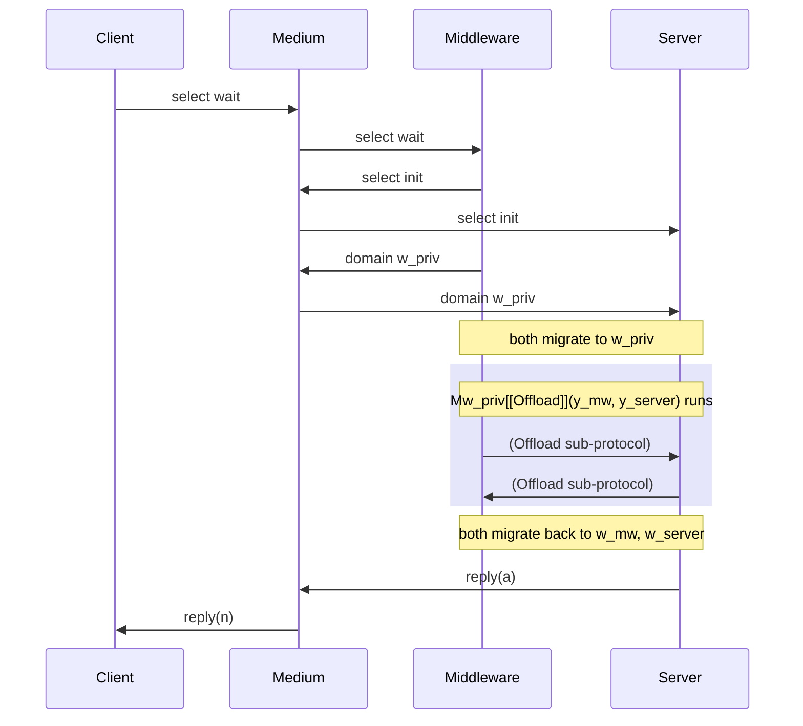

# Medium Processes

[[book-guidelines|↩ Back to guidelines]]

## Why global types need an operational witness

[[Multiparty-Session-Types|Multiparty Session Types]] gave you the type-level half of Section 4: a global type $G$ describes a choreography from a bird's-eye view, and merge-based projection $G{\upharpoonright}r$ derives what participant $r$ individually must do. But a projection is just a type. It tells you what a compliant implementation of $r$ *looks like*; it says nothing about who actually makes sure $p$'s selected label reaches $q$, or that a group of participants really does migrate together to domain $\omega$ and back. Global types, on their own, are choreography *specifications* with no execution model behind them.

The paper is explicit about not wanting to solve this by inventing a second type system — a bespoke multiparty typing judgment, proved sound and complete from scratch, duplicating everything already established in [[Typing-Judgments-and-Rules|Section 3]] (session fidelity, global progress, termination, domain preservation). That would be enormous and redundant work, and every one of those four theorems would need to be re-proved for a different calculus.

Instead: build one extra, well-typed *process* — from the ordinary [[The-Domain-Aware-Session-Pi-Calculus|domain-aware π-calculus]] of Section 2, typed in the ordinary Section 3 system — whose entire job is to sit in the middle of the interaction and faithfully relay it. This is the **medium process**, $M^{\tilde\omega}\llbracket G \rrbracket(\tilde c)$. If you can show that (a) every well-formed $G$ has such a medium, correctly typed with *binary* session types, and (b) that typing is compositional (it says nothing about the medium except that it depends on the participants and offers nothing of its own), then multiparty correctness for free — you inherit session fidelity, progress, termination, and domain preservation from Section 3's theorems, applied to the composed system, with zero new proof machinery about "multiparty processes." That's the entire point of this section, and it's the payoff of the whole paper's architecture: two type theories (Sections 3 and 4) but only one operational semantics and one soundness argument underneath them.

**What breaks without this reduction strategy:** if global types had their own bespoke operational semantics unrelated to the binary calculus, you'd need independent progress/preservation/termination proofs for the multiparty system, and any future extension to Section 3 (a new connective, a stronger domain discipline) would need to be re-derived for multiparty protocols by hand instead of falling out automatically. Building the multiparty story as a *reduction* to the binary theory is what makes the whole framework's correctness guarantees transfer without extra proof effort — this is genuinely the architectural thesis of the paper, not an implementation convenience.

## The worked example: middleware offload

Carry the running example from the paper's introduction, spelled out fully in Section 4: a `client` (`cl`) talks to a `middleware` (`mw`), which either replies directly or — needing elevated privilege — migrates with a `server` to a private domain $w_{priv}$ to run an `Offload` sub-protocol, then migrates back and relays the server's answer to the client.

$$
G_{\text{offload}} = \mathrm{cl} \to \mathrm{mw} : \Big\{\ \mathrm{request}\langle v \rangle.\ \mathrm{mw}\to\mathrm{cl}:\{\mathrm{reply}\langle n\rangle.\mathrm{end}\},\ \ \mathrm{wait}.\ \mathrm{mw}\ \mathsf{moves}\ \mathrm{server}\ \mathsf{to}\ w_{priv}\ \mathsf{for}\ G_{\mathrm{Offload}}\ ;\ (\dots)\ \Big\}
$$

where the client first chooses whether the middleware should answer immediately (`request`/`reply`) or escalate (`wait`, followed by the middleware migrating with the server into $w_{priv}$ to run `Offload`, then relaying `reply` back once it returns). Hold this example through the rest of the article — every definition below is illustrated by a fragment of its medium.

## Fusion of processes (Def 4.7)

Before the medium can be defined, the paper needs a process-level operator mirroring [[Multiparty-Session-Types#Local type fusion (Def 4.4)|local type fusion]] $T_1 \circ T_2$: a way to append one process's continuation after another's. This is **fusion of processes**, written $P \circ Q$, a **partial** operator on well-typed processes:

$$
\begin{aligned}
x\langle y\rangle.([u \leftrightarrow y] \mid P) \circ Q &= x\langle y\rangle.([u \leftrightarrow y] \mid (P \circ Q)) \\
0 \circ Q &= Q \\
x \triangleright \{l_i : P_i\}_{i\in I} \circ Q &= x \triangleright \{l_i : (P_i \circ Q)\}_{i \in I} \\
(\pi.P) \circ Q &= \pi.(P \circ Q) \qquad \text{for } \pi \in \{c(y),\ c\langle\omega\rangle,\ c(\alpha),\ c\langle y@\omega\rangle,\ c(y@\omega),\ c\triangleleft l\}
\end{aligned}
$$

and undefined otherwise. Read it exactly the way you'd read `end ◦ T = T` for local types: this is structural recursion down every leaf. Every ordinary prefix ($\pi.P$) and every offer branch just pass the fusion through to their continuation; the base case $0 \circ Q = Q$ is fusion's identity, replacing an inert leaf with $Q$'s behavior — the direct process-level mirror of `end ◦ T = T`. The one non-obvious clause is the first: it says fusion also passes through a *send-then-forward* idiom (a name is sent and immediately forwarded via `[u ↔ y]`) — this is exactly the shape a medium takes right after it relays a payload, so fusion needs to see through it to keep recursing.

**Why this operator has to be partial, not total.** Fusion is only defined on processes whose *shape* is "a sequence of prefixes and offers terminating in $0$" — precisely the shape a medium process has, by construction (Def 4.8, next). It is not a general operator you'd apply to arbitrary π-calculus terms; the paper doesn't need it to be, because it is only ever invoked on mediums or medium-shaped continuations. If you tried to fuse two arbitrary processes — say, two processes each containing parallel composition or restriction in a position other than a passthrough — the definition simply doesn't cover the case, and that's intentional: fusion's soundness (established via Proposition A.8, below) depends on this restricted shape.

## The medium process itself (Def 4.8)

Now the main definition. Fix indexed names: given a base name $c$ and participant $p$, $c_p$ names the channel along which $p$'s session behavior is made observable (distinct participants get distinct indexed names, $p \neq q \implies c_p \neq c_q$). The medium of $G$, written $M^{\tilde\omega}\llbracket G \rrbracket(\tilde c)$, is defined by induction on $G$:

$$
M^{\tilde\omega}\llbracket G \rrbracket(\tilde c) =
\begin{cases}
0 & G = \mathrm{end} \\[6pt]
c_p \triangleright \{l_i : c_p(u).c_q \triangleleft l_i;\, c_q\langle v\rangle.([u \leftrightarrow v] \mid M^{\tilde\omega}\llbracket G_i \rrbracket(\tilde c))\}_{i \in I} & G = p \to q:\{l_i\langle U_i\rangle.G_i\}_{i\in I} \\[10pt]
\begin{aligned}
&c_p(\alpha).c_{q_1}\langle\alpha\rangle.\dots.c_{q_n}\langle\alpha\rangle.\\
&c_p(y_p@\alpha).c_{q_1}(y_{q_1}@\alpha).\dots.c_{q_n}(y_{q_n}@\alpha).\\
&\quad M^{\tilde\omega\{\alpha/\omega_p,\dots,\alpha/\omega_{q_n}\}}\llbracket G_1 \rrbracket(\tilde y)\ \circ \\
&\quad\Big(y_p(m_p@\omega_p).y_{q_1}(m_{q_1}@\omega_{q_1}).\dots.y_{q_n}(m_{q_n}@\omega_{q_n}).\ M^{\tilde\omega}\llbracket G_2 \rrbracket(\tilde m)\Big)
\end{aligned}
& G = p\ \mathsf{moves}\ q_1,\dots,q_n\ \mathsf{to}\ \omega\ \mathsf{for}\ G_1; G_2
\end{cases}
$$

Read each case the way you'd read a compiler's code-generation pass over an AST, because that's exactly what this is: each global-type constructor compiles to a fixed fragment of orchestrator process.

**The choice case, $p \to q : \{l_i\langle U_i\rangle.G_i\}_{i \in I}$**, uses four prefixes on two indexed names to relay a single interaction step:
1. $c_p \triangleright \{\dots\}$ — the medium *offers* the same branch menu $p$ would offer, i.e. it lets $p$ pick a label.
2. $c_p(u)$ — once a branch is picked, it receives $p$'s payload $u$ on that same name.
3. $c_q \triangleleft l_i$ — it *re-selects* the same label toward $q$ — propagating $p$'s choice onward.
4. $c_q\langle v\rangle.([u \leftrightarrow v] \mid \dots)$ — it sends a fresh name $v$ to $q$ and immediately forwards $u$ into $v$, so that whatever $p$ sent arrives, unmodified, as what $q$ receives.

The medium never inspects or uses the payload — it relays a label and forwards a name via the copycat process $[u \leftrightarrow y]$ from the base calculus, exactly the "collapse an indirection" behavior [[The-Domain-Aware-Session-Pi-Calculus|forwarding]] gives you. This is what lets Def 4.7's fusion see through it: the medium for the continuation $G_i$ sits right behind the forward, ready to be spliced onto.

**The migration case, $p\ \mathsf{moves}\ q_1,\dots,q_n\ \mathsf{to}\ \omega\ \mathsf{for}\ G_1;G_2$**, is the paper's headline example of the medium framework's expressiveness, and is worth walking through operationally, step by step, matching each line of the definition:
1. $c_p(\alpha)$: the medium receives a domain identifier $\alpha$ from $p$ — this is $p$ generating (or picking) the fresh domain to migrate to.
2. $c_{q_1}\langle\alpha\rangle.\dots.c_{q_n}\langle\alpha\rangle$: the medium forwards that same $\alpha$ to every follower — everyone learns the destination from the medium, not directly from $p$.
3. $c_p(y_p@\alpha).\dots.c_{q_n}(y_{q_n}@\alpha)$: the medium receives *migration signals* from $p$ and every $q_i$, each carrying a fresh session name $y_{(\cdot)}$ tagged with the destination domain $\alpha$ — this is the process-level realization of "$p$ and $\tilde q$ migrate to $\omega$."
4. $M^{\tilde\omega\{\alpha/\omega_p,\dots\}}\llbracket G_1\rrbracket(\tilde y)$: the medium for the sub-protocol $G_1$ now runs, using the *new* names $\tilde y$ and with the domain environment updated so that $p$'s and every $q_i$'s domain is now $\alpha$ — this is what "run $G_1$ at $\omega$" means concretely: the recursive sub-medium is instantiated at the migrated names and domains.
5. Fused after it via $\circ$: a *second* migration-back step, $y_p(m_p@\omega_p).\dots.y_{q_n}(m_{q_n}@\omega_{q_n})$ — everyone migrates back to their *original* domains $\omega_p,\dots,\omega_{q_n}$ (bound back from before step 1) — followed by $M^{\tilde\omega}\llbracket G_2\rrbracket(\tilde m)$, the medium for the continuation, now running with the original domain environment $\tilde\omega$ restored.

The fusion $\circ$ is doing real structural work here, not just concatenation: $M[\![G_1]\!]$ is a tree of prefixes and offers terminating in $0$ wherever $G_1$'s protocol completes (possibly multiple `end` leaves if $G_1$ branches), and fusion grafts "migrate back, then run $M[\![G_2]\!]$" onto *every one* of those leaves — exactly mirroring $\mathrm{end} \circ T = T$ at the type level, applied everywhere a leaf occurs rather than once.

### Why $y_p, y_{q_1}, \dots$ thread through both halves — Key Question 2

The migrated participants' fresh session names $y_p, y_{q_1},\dots,y_{q_n}$ appear as the argument to the $G_1$-medium *and* are exactly the names the migrate-back prefixes ($y_p(m_p@\omega_p)$, etc.) act on. This isn't incidental plumbing — it's the mechanism by which "the same participants who migrated in are the ones who migrate back" is enforced structurally rather than by convention. There is no separate bookkeeping structure tracking "who's currently in domain $\alpha$"; the fact that $y_p$ is bound by the migration-in prefix and consumed by the migration-out prefix *is* the invariant, visible directly in the process term. If the migrate-back prefixes used fresh, unrelated names instead of $y_p,\dots,y_{q_n}$, nothing would force the process actually running $G_1$ at domain $\alpha$ to be the one that eventually leaves — you could construct a medium-shaped term that "forgets" a migrated participant, or migrates the wrong name back, and no static or dynamic mechanism would catch it. Naming discipline plus fusion at the exact leaf where $G_1$'s protocol completes is what keeps "the group that went in is the group that comes out" true by construction.

### Medium for the offload example

Assembling the pieces for $G_{\text{offload}}$ gives (writing the offer over `request`/`wait`, with the second branch doing the migration):

$$
\begin{aligned}
M[\![G_{\text{offload}}]\!](\tilde c) = c_{cl} \triangleright \Big\{ \\
&\mathrm{request} : c_{cl}(r).c_{mw}\triangleleft\mathrm{request};\, c_{mw}\langle v\rangle.([r\leftrightarrow v] \mid \\
&\qquad c_{mw} \triangleright\{\mathrm{reply}: c_{mw}(a).c_{cl}\triangleleft\mathrm{reply};\, c_{cl}\langle n\rangle.([a\leftrightarrow n] \mid 0)\}),\\
&\mathrm{wait} : c_{cl}\triangleleft\mathrm{wait};\, c_{mw}\triangleright\{\mathrm{init} : c_{server}\triangleleft\mathrm{init};\ c_{mw}(w_{priv}).c_{server}\langle w_{priv}\rangle. \\
&\qquad c_{mw}(y_{mw}@w_{priv}).c_{server}(y_{server}@w_{priv}).\, M^{w_{priv}}[\![\mathrm{Offload}]\!](y_{mw}, y_{server})\ \circ \\
&\qquad\qquad \big(y_{mw}(z_{mw}@\omega_{mw}).y_{server}(z_{server}@\omega_{server}).\ z_{mw}\triangleright\{\mathrm{reply}: z_{mw}(a).c_{cl}\triangleleft\mathrm{reply};\,c_{cl}\langle n\rangle.([a\leftrightarrow n] \mid 0)\}\big) \Big\}
\end{aligned}
$$

Note what this medium *guarantees purely by its shape*, independent of any typing argument: the client's own domain never changes throughout — the client only ever interacts on $c_{cl}$, and nothing in the medium ever issues a migration prefix in the client's name. Whether or not the middleware ends up escalating to the server, the client's position in the domain hierarchy is untouched. This is exactly the property the paper's introduction promises informally ("moving to $w_{priv}$ guarantees the client stays put") — here you can see it holding at the level of the orchestrator's syntax, before typing even enters the picture.

## Compositional typing (Def 4.9)

The medium is a process; it needs to be typed. The paper doesn't just want *some* typing derivation for $M^{\tilde\omega}\llbracket G \rrbracket(\tilde c)$ — it wants a very specific *shape* of derivation, one that guarantees the medium is exactly the orchestrator it claims to be and nothing more. A typing

$$
\Omega;\Gamma;\Delta \vdash M^{\tilde\omega}\llbracket G\rrbracket(\tilde c) :: z : C
$$

is a **compositional typing** if:
1. it is a valid typing derivation (in the Section 3 system);
2. $\mathrm{npart}(G) \subseteq \mathrm{dom}(\Delta)$ — the medium's linear context contains (at least) an entry for every participant's indexed name;
3. $C = 1$ — the medium *offers* only the trivial, terminated session type $1$.

### Why $C = 1$ is load-bearing — Key Question 1

Condition (iii) is easy to skim past, but it's the single condition doing the most conceptual work in the whole definition. It says: whatever else is true, the medium contributes **no observable behavior of its own** — it doesn't offer a session that some external client could interact with beyond what's already captured by relaying $p_1,\dots,p_n$'s interactions. All of the medium's "business" is entirely internal, visible only through the sessions $c_{p_1},\dots,c_{p_n}$ it depends on.

**What would break if a medium were allowed to offer $C \neq 1$:** if the medium itself provided a nontrivial session $z{:}C$ to some further client, you'd have smuggled in an *extra*, unaccounted-for participant in the protocol — one that interacts with the medium directly rather than through one of the $p_i$'s local types. The compositional-typing statement (and the two characterization theorems built on it) crucially reasons about *exactly* the set of participants $\mathrm{part}(G)$; a medium that offers additional behavior would mean the composed system's correctness properties (session fidelity, progress) depend on an interaction the global type $G$ never described, defeating the entire purpose of using $G$ as the single source of truth. Forcing $C = 1$ is precisely what makes "the medium is pure orchestration, transparent to the choreography it implements" a *type-level*, checkable statement rather than an informal design intention.

This is also, not coincidentally, exactly the same condition that made [[Multiparty-Session-Types#Fusion of processes (Def 4.7)|process fusion]]'s base case ($0 \circ Q = Q$) the right one: a medium reaching $0$ at a leaf is a medium that has finished contributing behavior at that point — consistent with $C=1$ throughout the whole term, not just at the top.

## From local types to binary types: the erasure map (Def 4.10)

To actually *state* a typing for the medium, the paper needs to connect **local types** $T$ (Def 4.1, participant-indexed) to the plain **binary session types** $A$ of Def 3.1 (the ones Section 3's typing system checks against) — because the medium, viewed from any one indexed channel $c_p$, is just an ordinary binary process endpoint. The map $\langle\!\langle\cdot\rangle\!\rangle : T \to A$ erases participant names entirely:

$$
\begin{aligned}
\langle\!\langle \mathrm{end} \rangle\!\rangle &= 1 \qquad \langle\!\langle B \rangle\!\rangle = 1 \text{ (base types)}\\
\langle\!\langle p!\{l_i\langle U_i\rangle.T_i\}_{i\in I} \rangle\!\rangle &= \oplus\{l_i : \langle\!\langle U_i \rangle\!\rangle \otimes \langle\!\langle T_i \rangle\!\rangle\}_{i\in I} \\
\langle\!\langle p?\{l_i\langle U_i\rangle.T_i\}_{i\in I} \rangle\!\rangle &= \&\{l_i : \langle\!\langle U_i \rangle\!\rangle \multimap \langle\!\langle T_i \rangle\!\rangle\}_{i\in I} \\
\langle\!\langle @_\omega T \rangle\!\rangle &= @_\omega \langle\!\langle T \rangle\!\rangle \qquad
\langle\!\langle \forall\alpha.T \rangle\!\rangle = \forall\alpha.\langle\!\langle T \rangle\!\rangle \qquad
\langle\!\langle \exists\alpha.T \rangle\!\rangle = \exists\alpha.\langle\!\langle T \rangle\!\rangle \qquad
\langle\!\langle \downarrow\!\alpha.T \rangle\!\rangle = \downarrow\!\alpha.\langle\!\langle T \rangle\!\rangle
\end{aligned}
$$

This is a purely structural, homomorphic map — every hybrid connective goes to itself, and *only* the two participant-tagged constructors ($p!\{\dots\}$, $p?\{\dots\}$) actually change shape, becoming the ordinary internal/external choice connectives $\oplus$/$\&$ of Section 3's linear logic, tensored/impliciated with the payload as you'd expect from Curry–Howard for session types. This confirms, formally, the observation already made in [[Multiparty-Session-Types|Multiparty Session Types]]: local types were never a new type theory — they're binary hybrid types with a participant label glued onto the choice constructors, and $\langle\!\langle\cdot\rangle\!\rangle$ is the function that peels that label back off.

If you're used to thinking in terms of erasure passes in a compiler (e.g. erasing implicit/proof-irrelevant arguments before code generation, or erasing effect annotations before running a lower IR), this is the exact same shape: a structure-preserving map that deletes exactly the extra decoration (participant identity) needed for the higher-level presentation, leaving the underlying computational content — the *session discipline* — completely intact.

## Theorem 4.11 — Global Types → Typed Mediums

$$
\text{If } G \text{ is WF with } \mathrm{part}(G) = \{p_1,\dots,p_n\} \text{ then } \Omega;\Gamma; c_{p_1}{:}\langle\!\langle G{\upharpoonright}p_1\rangle\!\rangle[\omega_1], \dots, c_{p_n}{:}\langle\!\langle G{\upharpoonright}p_n\rangle\!\rangle[\omega_n] \vdash M^{\tilde\omega}\llbracket G\rrbracket(\tilde c) :: z:1[\omega_m]
$$

is a compositional typing, for some $\Omega,\Gamma$, assuming every $\omega_i \prec \omega_m$ (the medium's domain is accessible from everywhere) and pairwise-distinct $\omega_i$.

This is **soundness**: every well-formed global type yields an actual, well-typed orchestrator, typed using exactly the erased projections $\langle\!\langle G{\upharpoonright}p_i \rangle\!\rangle$ as the types for each participant's indexed channel. It's the theorem that licenses the whole "type-check participants independently against their local type, compose via the medium, get a correct multiparty system" workflow.

### Proof structure — induction on $G$, via Proposition A.8

The proof (Appendix A.6) goes by structural induction on $G$, and the three cases track the three medium constructors exactly:

- **$G = \mathrm{end}$**: trivial — $M[\![\mathrm{end}]\!] = 0$, and there are no participants to type.
- **$G = p \to q:\{l_i\langle U_i\rangle.G_i\}_{i\in I}$**: builds the typing bottom-up using exactly the linear-logic rules you'd expect from the erasure map — $(\otimes L)$, then $(\&L_1)/(\&L_2)$ to peel off the chosen branch on $q$'s side, then $(\oplus L)$ to case-split on $p$'s side, closing each branch with the induction hypothesis applied to $G_i$. Where it gets genuinely nontrivial: because merge-based well-formedness (not syntactic identity) is what makes $G$ well-formed, the sub-derivations for $G_1$ and $G_2$ may leave *different-looking but mergeable* residual contexts $\Delta_1,\Delta_2$ for the bystander participants. The proof handles this by an inner induction on the size of these contexts, using the merge relation itself to show the two branches' leftover types can be made syntactically identical via the (silent) rule $(\&L_2)$ — literally padding one branch's offer with the labels the other branch has, which is always sound because $(\&L_2)$ only ever *weakens* an offer type by adding an unused alternative.
- **$G = p\ \mathsf{moves}\ \tilde q\ \mathsf{to}\ \omega\ \mathsf{for}\ G_1;G_2$**: this is where **Proposition A.8** — the fusion lemma — becomes indispensable rather than a convenience. The medium for this case is, by Def 4.8, literally $M[\![G_1]\!] \circ (\text{migrate-back}).M[\![G_2]\!]$ — two syntactically fused processes. You cannot type this with a single, monolithic derivation the way you type a plain choice, because the two halves are typed under genuinely different domain environments ($G_1$'s medium runs with everyone's domain rebound to $\alpha$; $G_2$'s runs with the original $\tilde\omega$ restored) and because $\Delta_1$ (from typing $M[\![G_1]\!]$) and $\Delta_2$ (from typing the migrate-back-then-$G_2$ continuation) don't share a context in any straightforward way — $\Delta_2$'s domain properly *includes* $\Delta_1$'s (participants in $G_2$ but not $G_1$ show up only in $\Delta_2$). Proposition A.8 is exactly the lemma that says: given a compositional typing for $M[\![G_1]\!]$ ending (at every leaf) in the trivial sequent $\Omega;\Gamma; y_p{:}1[\omega_p],\dots \vdash 0 :: z{:}1[\omega_m]$, and a compositional typing for the migrate-back-continuation starting from exactly those same names, you can *stack* the second derivation directly onto every occurrence of that trivial leaf sequent in the first, and the result is a valid compositional typing for the fused process — with the context-combination operator $\Delta_1 \circ \Delta_2$ making precise, at the level of typing contexts, exactly the same leaf-splicing operation Def 4.4 and Def 4.7 already do at the level of types and processes respectively. Concretely: it takes the induction hypothesis's two separately-obtained typings for $G_1$ and $G_2$ and produces, in one lemma application, the fused typing — after which four applications of the hybrid rules $(@L)$, $(\forall L)$, $(\exists L)$, $(\downarrow\!L)$ (matching, in reverse, exactly the four constructs in $G{\upharpoonright}p$ and $G{\upharpoonright}q$) close out the derivation.

The reason this needs a dedicated lemma rather than "just do induction" is structural: induction alone gives you two *separate* typings (one per sub-global-type), but the medium is one *single* fused process, and a fused process needs a fused *derivation* — you can't get that by simply juxtaposing two independently-built proof trees; you need to know exactly *where* in the first derivation the second one attaches, and that "where" is precisely the set of trivial leaf sequents Proposition A.8 identifies. This is the answer to Appendix A's first Key Question.

## Theorem 4.12 — Well-Typed Mediums → Global Types

$$
\text{If } \Omega;\Gamma;c_{p_1}{:}A_1[\omega_1],\dots,c_{p_n}{:}A_n[\omega_n] \vdash M^{\tilde\omega}\llbracket G\rrbracket(\tilde c) :: z:1[\omega_m] \text{ is a compositional typing then } \exists T_1,\dots,T_n \text{ s.t. } G{\upharpoonright}p_j \sqsupset_\downarrow T_j \text{ and } \langle\!\langle T_j\rangle\!\rangle = A_j \text{ for all } p_j \in \mathrm{part}(G).
$$

This is the converse — **completeness**, in the loose sense that binary typability of a medium precisely delineates the interactions of some well-formed global type; it's not an arbitrary process that happens to be well-typed, it's *specifically* an orchestrator whose typed shape reconstructs $G$'s own projections, up to a controlled notion of "up to."

### Why "up to $\sqsupset_\downarrow$" and not exact equality — Appendix A's second Key Question

If Theorem 4.12 claimed $A_j = \langle\!\langle G{\upharpoonright}p_j\rangle\!\rangle$ *exactly*, it would be false, for a subtle but structural reason: some of Section 3's typing rules are **silent** — they change the type without corresponding to any observable process action. Two specifically matter here:

- **$(\&L_2)$** — the rule used inside Theorem 4.11's own proof to pad one branch's offer type with an alternative present only in the other branch (see above). This rule can introduce, in the medium's derived type, branch alternatives that don't literally appear in the syntactic local type $G{\upharpoonright}p_j$ — they're artifacts of how the typing derivation was *built*, particularly around merge, not artifacts of the protocol itself.
- **$(\downarrow\!L)$** — the rule that eliminates $\downarrow\alpha.A$ on the left of a sequent, binding $\alpha$ to the current domain. Nothing in the *process term* forces a $\downarrow\alpha$ to appear or disappear at any particular syntactic position; a valid derivation can insert or consume "here" annotations at points where the projected local type $G{\upharpoonright}p_j$ may or may not literally have written $\downarrow\!\beta$.

Because of these two silent rules, a medium's derived binary type $A_j$ can differ *syntactically* from $\langle\!\langle G{\upharpoonright}p_j\rangle\!\rangle$ while still describing the exact same session discipline. The paper's fix (Appendix A.5) is **Definition A.7**, the pre-congruence $\sqsupset_\downarrow$ on local types — the least pre-congruence such that:

$$
T_1 \sqcup T_2 = T \implies T_1 \sqsupset_\downarrow T \qquad\qquad
T_1 \sqsupset_\downarrow T_2 \implies\ \downarrow\!\alpha.T_1 \sqsupset_\downarrow T_2\{\omega/\alpha\} \qquad\qquad
T \sqsupset_\downarrow\ \downarrow\!\alpha.T \text{ if } \alpha \notin T
$$

Read these three clauses as exactly canceling the two silent rules above:
1. **First clause** cancels $(\&L_2)$'s effect: if $T$ is a legitimate merge of $T_1$ and something else, then $T_1$ is related to $T$ — i.e. a type that's *one summand* of a merge is allowed to relate to the fully-merged (padded) result, exactly capturing "padding with $(\&L_2)$ doesn't change what protocol is really being followed."
2. **Second clause** cancels a "spurious/required $\downarrow$" mismatch in one direction: a $\downarrow\alpha.T_1$ that binds $\alpha$ and then instantiates it to a concrete domain $\omega$ relates to the plain instantiated type $T_2\{\omega/\alpha\}$ — i.e. it's fine for the derivation to have already substituted where the local type still shows the binder.
3. **Third clause** cancels it in the other direction: a plain $T$ (with $\alpha$ not occurring in it) relates to $\downarrow\alpha.T$ — a spuriously-introduced, unused "here" binder doesn't change anything, since nothing in $T$ actually reads $\alpha$.

So $\sqsupset_\downarrow$ is exactly "these two local types are the same protocol, differing only by artifacts $(\&L_2)$ and $(\downarrow\!L)$ can silently introduce" — a *proof-irrelevance* relation for local types, in the same spirit as identifying two derivations that differ only by weakening or by an unused hypothesis. Without it, Theorem 4.12 would be either false (if stated with syntactic equality) or would have to be weakened to something much less informative; $\sqsupset_\downarrow$ is precisely calibrated to absorb exactly the two sources of derivation-level noise and no more.

### Proof structure

Appendix A.6 proves Theorem 4.12 by the same induction-on-$G$ pattern as 4.11, "following the lines of" that proof and using typing *inversion* (rather than typing *construction*) at each step — since here you're given a typing derivation for the medium and must reconstruct the global type's projections from it:
- $G = \mathrm{end}$: vacuous — $M[\![\mathrm{end}]\!] = 0$, and $(1L)$ can introduce spurious $\downarrow\alpha$'s on a $1$-typed name, absorbed by $\sqsupset_\downarrow$.
- $G = p \to q:\{\dots\}$: inversion on the same derivation shape used in 4.11's proof; the only correction needed is using $\sqsupset_\downarrow$'s first clause to prune/relate branch alternatives that $(\&L_2)$ silently added during typing.
- $G = p\ \mathsf{moves}\ \tilde q\ \mathsf{to}\ \omega\ \mathsf{for}\ G_1;G_2$: inversion on the fused-typing derivation from 4.11's third case; here it's specifically $(\downarrow\!L)$'s silent domain-instantiation behavior that $\sqsupset_\downarrow$'s second and third clauses absorb.

## Where this leads

Step back and look at what these two theorems jointly buy the paper. Section 3 built, from hybrid linear logic, a binary session-typed calculus with four hard-won correctness theorems: session fidelity, global progress, termination, domain preservation. Section 4 (via [[Multiparty-Session-Types|global/local types and projection]]) wanted a *multiparty* choreography language with the same guarantees, extended with domain-aware sub-protocol migration. Rather than re-deriving all four theorems for a new multiparty operational semantics, this article's machinery shows that the multiparty layer is *entirely* reducible to the binary one: Theorem 4.11 turns any well-formed choreography into an actual well-typed binary process (the medium), and Theorem 4.12 confirms that binary typability of a medium-shaped process couldn't have arisen from anything *other* than some well-formed choreography. Together they establish that "well-formed multiparty protocol" and "compositionally-typed medium, typed in the ordinary binary system" are (up to $\sqsupset_\downarrow$) the same object viewed two ways — which is exactly the sense in which the whole multiparty apparatus of Section 4 is conservative over, and inherits every guarantee from, the binary theory of Section 3. That's the paper's central architectural payoff, and the reason it invested in Sections 2–3's process calculus and type theory before ever mentioning a global type.

### Connection to compositional static analysis (`static-analysis`)

This topic is tagged only against the `static-analysis` Focus Area, and the connection worth keeping is genuinely about compositionality rather than a forced type-theory analogy. Def 4.9's compositional typing is structurally the same idea as a **compositional (modular) static analysis**: you analyze a component (here, a medium) using only a *summary* of each of its dependencies' interfaces (here, each participant's projected local type, erased to a binary type) — not by re-analyzing the dependency's implementation. The medium's typing derivation never looks inside participant $p_i$'s actual process; it only needs $p_i$'s *type*, $\langle\!\langle G{\upharpoonright}p_i\rangle\!\rangle$, exactly the way a modular interprocedural analysis discharges a call to function $f$ using $f$'s previously-computed summary (its abstract pre/post-condition) instead of re-inlining and re-analyzing $f$'s body at every call site. Condition (iii), $C=1$ — the medium offers nothing of its own — is the analogue of a summary function having no unaccounted-for side effect: if the "component" being summarized could silently do something beyond what its documented interface says, compositional reasoning about the whole system would be unsound, exactly as an unsound function summary poisons every caller's analysis. The two characterization theorems, in this light, are a soundness-and-completeness pair for treating the global type itself as a *specification* that the compositional analysis (typing the medium against erased local types) is guaranteed to correctly witness — a payoff you'd want from any compositional-analysis framework: local, per-component summaries that provably compose into whole-system correctness without whole-program re-analysis.
