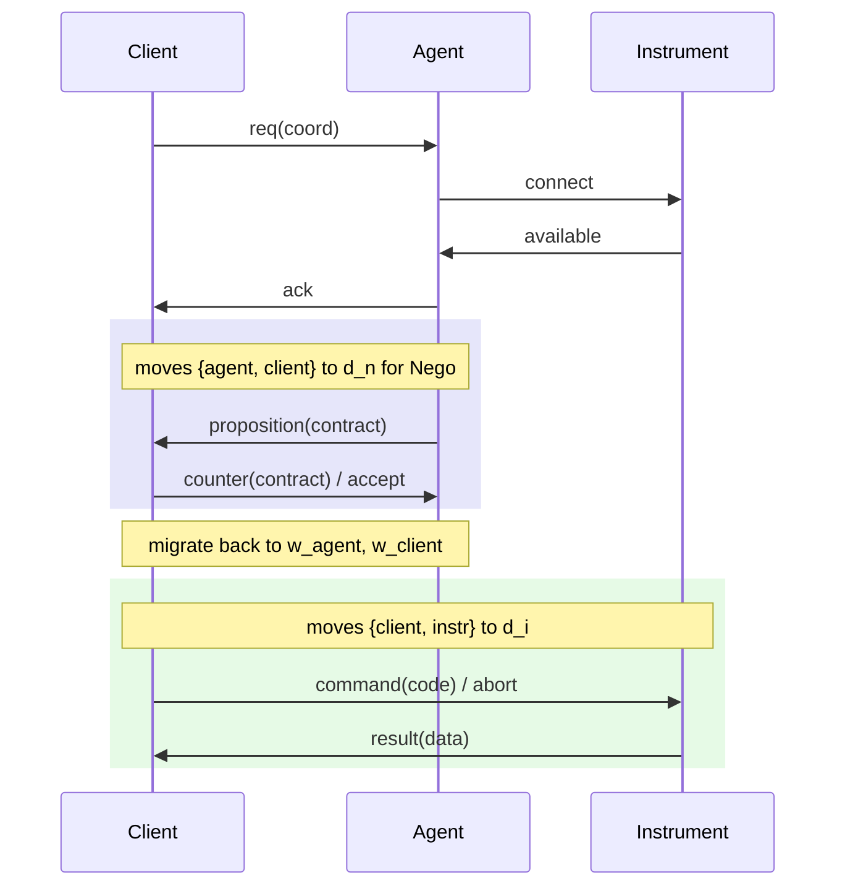
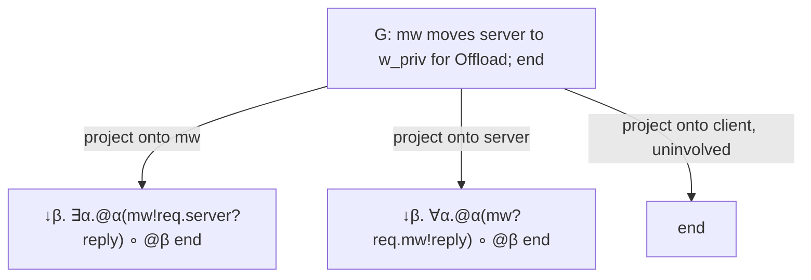

# Multiparty Session Types

[[book-guidelines|↩ Back to guidelines]]

## Why a binary theory isn't enough

Everything up to this point in the paper — hybrid linear logic, the accessibility judgment, the four safety theorems — is a theory of **binary** sessions: exactly two participants, one channel, one type describing both ends of the conversation from complementary perspectives. That's already enough to make "this payment must happen inside a secure domain" statically checkable for a two-party interaction. But most real protocols aren't two-party. A checkout flow involves a client, a store, and a bank. An offloading pattern involves a client, a middleware, and a server. As soon as you have three or more participants coordinating, you run into a design fork familiar from any distributed-systems formalism: do you specify the protocol from a **global**, third-person point of view ("the client sends `request` to the middleware, which either replies or forwards to the server") and then derive what each participant individually does? Or do you specify each participant's local behavior directly and hope they compose correctly?

Multiparty session types (MPST), going back to Honda–Yoshida–Carbone, take the first route: write one **global type** describing the whole choreography, then mechanically **project** it onto each participant to get that participant's **local type** — the type that actually gets used to check their implementation. This section extends that standard apparatus with the paper's own contribution: a *domain-aware* global-type construct, `p moves q̃ to ω for G1;G2`, that lets a choreography say not just who talks to whom, but *where* — which administrative/security domain a subgroup of participants must jointly enter to run a sub-protocol, and that they return afterward.

The reason this section exists exactly here, after three sections of binary machinery, is that the authors deliberately avoid inventing a second type system for the multiparty case. Instead (previewed here, executed in the next article, **Medium Processes**) they reduce multiparty typing to binary typing via an orchestrating process called a *medium*. This article covers the type-level half of that story: what global and local types look like, and how projection — the function that turns one into the other — is defined so that it is *total* on a well-behaved class of global types.

## Global types and local types (Def 4.1)

Here is the definition, verbatim in spirit:

$$
\begin{aligned}
U &::= \mathrm{bool} \mid \mathrm{nat} \mid \mathrm{str} \mid \dots \mid T \\
G &::= \mathrm{end} \;\mid\; p \to q : \{l_i\langle U_i\rangle. G_i\}_{i \in I} \;\mid\; p\ \mathsf{moves}\ \tilde q\ \mathsf{to}\ \omega\ \mathsf{for}\ G_1; G_2 \\
T &::= \mathrm{end} \;\mid\; p?\{l_i\langle U_i\rangle.T_i\}_{i\in I} \;\mid\; p!\{l_i\langle U_i\rangle.T_i\}_{i\in I} \;\mid\; \forall\alpha.T \;\mid\; \exists\alpha.T \;\mid\; @_\alpha T \;\mid\; \downarrow\!\alpha.T
\end{aligned}
$$

Read each piece in words before you read it as symbols:

- **$U$** is the type of a payload — a base type, or (recursively) another local type $T$, which is exactly how *delegation* works: you can send someone "a session" as a value.
- **$\mathrm{end}$** is the completed protocol — no more interaction, for anyone.
- **$p \to q : \{l_i\langle U_i\rangle.G_i\}_{i\in I}$** is ordinary labeled multiparty choice: participant $p$ picks one label $l_i$ from a finite, pairwise-distinct set, sends $q$ a payload of type $U_i$, and the whole protocol continues as $G_i$. The paper requires $p \neq q$ — no participant talks to itself, so every interaction is genuinely between two distinct roles.
- **$p\ \mathsf{moves}\ \tilde q\ \mathsf{to}\ \omega\ \mathsf{for}\ G_1; G_2$** — the new construct, discussed below in detail.
- The **local types** $T$ mirror the global vocabulary from a single participant's point of view: $p?\{\dots\}$ is *receiving* one of a set of offered branches from $p$ (an external/offer choice), $p!\{\dots\}$ is *sending* — choosing one branch to commit to. The last four local-type formers — $\forall\alpha.T$, $\exists\alpha.T$, $@_\alpha T$, $\downarrow\!\alpha.T$ — are not new inventions for the multiparty setting; they're the exact hybrid connectives from Def. 3.1 in the binary theory (universal/existential domain quantification, migration to a domain, and "here" — binding the current domain to a variable). This is the paper's central architectural move for this section: local types are just binary hybrid session types, decorated with a participant name at the input/output positions. Multiparty locality is a thin skin over binary machinery that's already been proven safe.

Note also what's *absent*: no recursion. The paper restricts global types to be recursion-free "to streamline the presentation" — a real simplification (no need for a `μ`-binder or unfolding rule in $G$ or $T$), and one you should keep in mind before assuming any given global type describes an unbounded protocol.

**Participants of a global type (Def 4.2)** is exactly the recursive-collection function you'd expect: $\mathrm{part}(\mathrm{end}) = \emptyset$, $\mathrm{part}(p\to q:\{\dots\}) = \{p,q\} \cup \bigcup_i \mathrm{part}(G_i)$, and $\mathrm{part}(p\ \mathsf{moves}\ \tilde q\ \mathsf{to}\ \omega\ \mathsf{for}\ G_1;G_2) = \{p\}\cup\tilde q\cup \mathrm{part}(G_1)\cup\mathrm{part}(G_2)$.

### What breaks without a clean global/local separation

If you tried to type-check each participant's implementation directly against some ad hoc, per-participant protocol description with no single source of truth, you'd have no way to *guarantee* the participants' individual behaviors actually compose into the intended global interaction — two participants' local specs could each look locally sensible and still deadlock or mismatch labels when put together. The global type is the single artifact whose well-formedness (Def 4.6, below) is checked once; local types are *derived*, not independently authored, so consistency is projection's job rather than the programmer's.

## The migration construct: `p moves q̃ to ω for G1; G2`

In words: participants $p$ (the *leader*) and $\tilde q = q_1,\dots,q_n$ (the *followers*) all migrate to domain $\omega$ in order to run sub-protocol $G_1$ there; once $G_1$ finishes, all of $p,\tilde q$ migrate back to their respective original domains and the protocol continues as $G_2$.

Two side conditions the paper assumes whenever it writes this construct:

1. **Exact participant match**: the participants of $G_1$ are exactly $\{p\}\cup\tilde q$ — nobody migrates who doesn't participate in the sub-protocol, and nobody in the sub-protocol was left behind.
2. **Reachability**: $\omega$ must be accessible (via $\prec$, the accessibility relation from Section 3) from all of $p,\tilde q$'s domains within $G_1$ — you can't migrate somewhere the accessibility relation forbids.

Crucially, $G_1$ and $G_2$ can involve **different sets of participants**. This is what makes the construct genuinely useful: a subgroup peels off, does something in a shared trusted domain, and rejoins a possibly larger protocol.

### Migration vs. delegation — Key Question 1

The paper is explicit that this is "a different idiom altogether" from session delegation, and it's worth being precise about *why*, because on the surface both look like "pass control of interaction to someone else temporarily."

**Delegation** (already expressible via payload types $U$ that are themselves local types $T$) is: participant $p$ sends participant $q$ an entire session-in-progress as a *value*. Once sent, $p$ no longer has access to that session — the session's continuation belongs to whoever received it. There's no built-in notion of the session coming back, and no domain semantics attached to the handoff; it's a value-level transfer.

**Migration** ( `moves...for` ) is structurally different in three ways:
- It doesn't transfer ownership of a session between participants — it moves a *group* of participants (who each keep their own role) into a shared domain to run a sub-protocol together, as peers.
- It has an explicit **return**: after $G_1$, everyone comes back to their original domain and the *same* set of participants (or a superset, via $G_2$) continues interacting.
- It's inherently **domain-scoped**: the entire point is to model that the sub-protocol $G_1$ requires being co-located in some particular accessible domain (e.g., a private negotiation channel, a payment enclave) — something delegation has no mechanism to express, since delegation says nothing about domains at all.

Concretely (from Appendix B): a negotiation between a client and an agent, embedded in a larger three-party protocol also involving an instrument, is written `agent moves client to dn for Nego_agent,client`. Both agent and client jointly leave their home domains, negotiate in the shared trusted domain $d_n$, and both return — the instrument is untouched by this migration and simply continues waiting. Delegating the negotiation session to one party wouldn't capture "these two must be co-present in a domain neither owns individually to negotiate as equals," and it wouldn't guarantee either of them comes back to resume the outer protocol.



## The merge operator (Def 4.3)

Before projection can be defined, the paper needs a way to say when two *different-looking* local behaviors are actually safe to treat as one. This is the merge operator $T_1 \sqcup T_2$, a **commutative, partial** operator:

$$
\begin{aligned}
&\text{1. } T \sqcup T = T \quad \text{for } T \in \{\mathrm{end},\ p!\{\dots\},\ @_\omega T',\ \forall\alpha.T',\ \exists\alpha.T'\} \\
&\text{2. } p?\{l_k\langle U_k\rangle.T_k\}_{k\in K} \sqcup p?\{l_j'\langle U_j'\rangle.T_j'\}_{j\in J} = \\
&\qquad p?\Big(\{l_k\langle U_k\rangle.T_k\}_{k\in K\setminus J} \cup \{l_j'\langle U_j'\rangle.T_j'\}_{j\in J\setminus K} \cup \{l_l\langle U_l \sqcup U_l'\rangle.(T_l \sqcup T_l')\}_{l \in K\cap J}\Big)
\end{aligned}
$$

and undefined otherwise. Read the two clauses in words:

- **Clause 1**: for everything *except* offer/branch types, merge only succeeds if the two sides are *identical* — sending, `end`, and all the hybrid connectives require exact agreement.
- **Clause 2**: for *offers* ($p?\{\dots\}$ — receiving one of several branches), merge is much more permissive. The two branch sets need not be identical: labels only present on one side simply survive into the merged type (a branch $q$ never learns to distinguish, but $r$ observing from outside doesn't need to distinguish it either — see below); labels present on *both* sides must have mergeable payload types and mergeable continuations, recursively.

### Why offers merge structurally but selections don't — and why that's the point of Key Question 3

This asymmetry is the load-bearing idea in the whole section, so it's worth being explicit about the failure mode it prevents and the flexibility it buys.

Projection produces, for a bystander participant $r$ not involved in a given branch of a choice $p \to q:\{l_i\langle U_i\rangle.G_i\}_{i\in I}$, the type $\bigsqcup_{i\in I} G_i{\upharpoonright}r$ — the merge of $r$'s projected behavior across *every* branch $i$, because $r$ has no visibility into which branch $p$ and $q$ actually took. If $r$'s behavior in branch 1 is "receive `success` from $p$, end" and in branch 2 is "receive `success` from $p$, end" — identical — a naive projection scheme requiring *syntactic identity across all branches* would accept this, but it would reject the moment branch 2 instead reads "receive `success` or `retry` from $p$." Yet semantically, $r$'s obligation in both cases is perfectly consistent: no matter which branch was taken, $r$ ends up needing to be ready to receive from $p$, possibly with more options available in one branch than another. The merge operator's clause 2 makes this well-defined: $r$'s post-merge local type offers exactly the union of branches it might need to handle, since being asked to handle a strict superset of cases is always safe for the *receiver* of a choice.

**What this operator cannot do — and shouldn't**: merge two different *selections* ($p!\{\dots\}$). If $r$ itself is the one choosing between different sets of options across the two branches of an outer choice, there's no coherent way to give $r$ a single local type describing "what $r$ decides to do" without $r$ first knowing which outer branch occurred — that would require $r$ to make a choice with knowledge it structurally cannot have. So clause 1 forces $r$'s own outgoing choices to be *identical* across merged branches: an active decision-maker can't be given ambiguous instructions, but a passive listener can safely be given a superset of things it might be asked to react to. This is exactly the asymmetry Key Question 2 (below) generalizes when discussing $\exists$ vs. $\forall$ in the migration construct — an existential is "I get to pick," a universal is "I must handle whatever's picked."

**What breaks without merge entirely**: projection would only be defined when every branch of every choice produces byte-for-byte identical continuations for every uninvolved participant. That's an absurdly restrictive global-type language — almost any protocol with more than trivial branching and more than two participants would fail to project for *someone*, making the whole multiparty framework nearly useless in practice. Merge is precisely what makes projection total on a realistic class of protocols (Key Question 3's core point) rather than only on a degenerate one.

## Local type fusion (Def 4.4)

Fusion, $T_1 \circ T_2$, is a different operation from merge: instead of *combining alternatives*, it *sequences* two specifications — appending $T_2$'s behavior after $T_1$'s completes.

$$
\begin{aligned}
p!\{l_i\langle U_i\rangle.T_i\}_{i\in I} \circ T &= p!\{l_i\langle U_i\rangle.(T_i \circ T)\}_{i\in I} & \mathrm{end} \circ T &= T \\
p?\{l_i\langle U_i\rangle.T_i\}_{i\in I} \circ T &= p?\{l_i\langle U_i\rangle.(T_i \circ T)\}_{i\in I} & (\exists\alpha.T_1) \circ T &= \exists\alpha.(T_1 \circ T) \\
(\forall\alpha.T_1) \circ T &= \forall\alpha.(T_1 \circ T) & (@_\alpha T_1) \circ T &= @_\alpha(T_1 \circ T) \\
(\downarrow\!\alpha.T_1) \circ T &= \downarrow\!\alpha.(T_1 \circ T)
\end{aligned}
$$

This is exactly what you'd write as a structural-recursion function over an AST: walk $T_1$'s tree down to every `end` leaf, and graft $T_2$ there instead — every other constructor is a pass-through that recurses into its continuation. The paper's own example: if $T_1 = \exists\alpha.@_\alpha\, p?\{l_1\langle\mathrm{Int}\rangle.\mathrm{end}, l_2\langle\mathrm{Bool}\rangle.\mathrm{end}\}$ and $T_2 = @_\omega\, q!\{l\langle\mathrm{Str}\rangle.\mathrm{end}\}$, then

$$T_1 \circ T_2 = \exists\alpha.@_\alpha\, p?\{l_1\langle\mathrm{Int}\rangle.@_\omega\, q!\{l\langle\mathrm{Str}\rangle.\mathrm{end}\},\ l_2\langle\mathrm{Bool}\rangle.@_\omega\, q!\{l\langle\mathrm{Str}\rangle.\mathrm{end}\}\}.$$

Notice $T_2$ got copied into *both* branches — fusion doesn't merge alternatives, it distributes the "what happens next" over every leaf of the first type. Fusion is what will let the paper splice "the behavior during $G_1$" and "the behavior during $G_2$" into one local type for a participant who's active in both, and (in the next article) splice the corresponding medium *processes* together the same way.

## Merge-based projection (Def 4.5)

This is the payoff: the function $G{\upharpoonright}r$ that computes participant $r$'s local view of global type $G$.

$$
\mathrm{end}{\upharpoonright}r = \mathrm{end}
$$

$$
(p\to q:\{l_i\langle U_i\rangle.G_i\}_{i\in I}){\upharpoonright}r =
\begin{cases}
p!\{l_i\langle U_i\rangle.(G_i{\upharpoonright}r)\}_{i\in I} & r = p \\
p?\{l_i\langle U_i\rangle.(G_i{\upharpoonright}r)\}_{i\in I} & r = q \\
\bigsqcup_{i\in I}(G_i{\upharpoonright}r) & \text{otherwise}
\end{cases}
$$

$$
(p\ \mathsf{moves}\ \tilde q\ \mathsf{to}\ \omega\ \mathsf{for}\ G_1;G_2){\upharpoonright}r =
\begin{cases}
\downarrow\!\beta.(\exists\alpha.@_\alpha\, G_1{\upharpoonright}r) \circ @_\beta\, G_2{\upharpoonright}r & r = p \\
\downarrow\!\beta.(\forall\alpha.@_\alpha\, G_1{\upharpoonright}r) \circ @_\beta\, G_2{\upharpoonright}r & r \in \tilde q \\
G_2{\upharpoonright}r & \text{otherwise}
\end{cases}
$$

with the whole map undefined whenever a side condition (a required merge, in particular) fails.

Read the plain-choice case first, since it's the more familiar one: if $r$ is the sender, $r$'s local type is a *selection* ($p!$); if $r$ is the receiver, an *offer* ($p?$); if $r$ is neither, $r$ can't observe which branch occurred, so its type is the *merge* across all branches — this is exactly where Def 4.3 gets used, and exactly why merge needed to exist before projection could be stated.

### Why leader projects with $\exists$ and followers project with $\forall$ — Key Question 2

This is the sharpest piece of design in the whole section, and it directly mirrors the asymmetry already established for merge (active chooser vs. passive receiver), just lifted to the level of *which domain gets chosen*.

The domain $\omega$ that everyone migrates to is not global-type-level data known in advance to all participants uniformly — someone has to actually pick it (or it has to be freshly generated) and communicate it. The construct says $p$ *leads* the migration. Correspondingly:

- $p$'s projected type binds $\exists\alpha.@_\alpha\, G_1{\upharpoonright}p$: "**I get to choose** some accessible domain $\alpha$, and then act at $\alpha$." Existential quantification in this hybrid-logic-flavored type system is exactly "I commit to a particular instantiation" — the same reading as $\exists$ in the binary theory (Section 3), where the process offering an $\exists$-typed session is the one that picks the witness.
- Each $q_i \in \tilde q$'s projected type binds $\forall\alpha.@_\alpha\, G_1{\upharpoonright}q_i$: "**whatever** accessible domain $\alpha$ turns out to be (as communicated to me), I must be prepared to act at $\alpha$." Universal quantification is the dual reading — the process is *given* a domain (any domain satisfying the constraints) and must behave correctly for that one, not for one of its own choosing.

This isn't cosmetic: it's the type-level encoding of "$p$ generates/selects the fresh domain identifier and broadcasts it; the $q_i$'s receive it." A follower's local type quantifying existentially over $\alpha$ would be nonsensical — it would claim the follower gets to *pick* the domain, when operationally (as the medium process in the next article makes precise) it's the leader who inputs a domain and forwards it outward. The $\exists$/$\forall$ split is projection faithfully reflecting an operational asymmetry that already exists in the construct's informal description ("led by $p$"), the same way a function's return type is existentially quantified over an implementation detail the *caller* doesn't get to pick, while a universally-quantified parameter type is something the *callee* must handle for every instantiation the caller could supply.

Both projections additionally open with $\downarrow\!\beta$, binding the participant's *own current domain* to $\beta$ — needed because after running $G_1$ at $\omega$, everyone has to know how to get back, and "back" means "wherever I was, i.e., $\beta$," not any domain hardwired into the type.

For the "otherwise" participants — those with no role in $G_1$ at all — projection simply skips straight to $G_2{\upharpoonright}r$: they were never part of the migrating group, so from their point of view, $G_1$ contributes nothing observable, and their local type only reflects what happens in $G_2$.

### Worked example: a tiny migration protocol

Take a stripped-down version of the offloading protocol from the introduction (Appendix B.2): a `client`, a `middleware` (`mw`), and a `server`, where the middleware sometimes must escalate privileges into a private domain $w_{priv}$ to talk to the server.

$$
G = \mathrm{mw}\ \mathsf{moves}\ \mathrm{server}\ \mathsf{to}\ w_{priv}\ \mathsf{for}\ (\mathrm{mw}\to\mathrm{server}:\{\mathrm{req}\langle\mathrm{data}\rangle.\ \mathrm{server}\to\mathrm{mw}:\{\mathrm{reply}\langle\mathrm{ans}\rangle.\mathrm{end}\}\}) ;\ \mathrm{end}
$$

Here $p = \mathrm{mw}$, $\tilde q = \{\mathrm{server}\}$, $G_1$ is the two-message `Offload` exchange, and $G_2 = \mathrm{end}$ (no continuation after migrating back).

- $G{\upharpoonright}\mathrm{mw} = \downarrow\!\beta.(\exists\alpha.@_\alpha(\mathrm{server}!\{\mathrm{req}\langle\mathrm{data}\rangle.\mathrm{server}?\{\mathrm{reply}\langle\mathrm{ans}\rangle.\mathrm{end}\}\})) \circ @_\beta\,\mathrm{end}$ — the middleware records its own domain as $\beta$, picks (existentially) an accessible private domain $\alpha$, migrates, sends `req` and awaits `reply` there, then migrates back to $\beta$ and the protocol ends. Since $\mathrm{end}\circ T = T$ for the outer fusion's identity behavior and the inner fusion target here is `end`, the tail is trivial — this is a case where $G_2 = \mathrm{end}$ makes fusion's contribution invisible except for the `@_β end` bookkeeping.
- $G{\upharpoonright}\mathrm{server} = \downarrow\!\beta.(\forall\alpha.@_\alpha(\mathrm{mw}?\{\mathrm{req}\langle\mathrm{data}\rangle.\mathrm{mw}!\{\mathrm{reply}\langle\mathrm{ans}\rangle.\mathrm{end}\}\})) \circ @_\beta\,\mathrm{end}$ — the server records its own domain, accepts *whatever* domain it's told to migrate to, and there offers to receive `req` and send back `reply`.
- $\mathrm{client}$ is untouched by $G_1$ at all: $G{\upharpoonright}\mathrm{client} = G_2{\upharpoonright}\mathrm{client} = \mathrm{end}$ — from the client's perspective, this fragment of the protocol contributes nothing observable (consistent with the "otherwise" clause).



## Well-formed global types (Def 4.6)

$$
G \text{ is well-formed (WF) iff } G{\upharpoonright}r \text{ is defined for all } r \in \mathrm{part}(G).
$$

That's the entire definition — deliberately minimal. Well-formedness is not some separate syntactic side condition checked independently of projection; it *is* "projection succeeds everywhere it needs to." This is worth dwelling on because it reframes everything above as machinery in service of a single totality question.

### A Lean-flavored framing: projection as a partial function, well-formedness as its domain of definition

If you think of $\upharpoonright\!\cdot : \mathrm{GlobalType} \times \mathrm{Participant} \rightharpoonup \mathrm{LocalType}$ as a genuinely **partial** function (note the harpoon), Def 4.6 says: $G$ is well-formed exactly when this partial function is total when restricted to $\mathrm{part}(G) \times \{G\}$. This is precisely the shape of a soundness-preserving static check you'd formalize in Lean as an `Option`- or `Except`-returning recursive function, where "the analysis succeeds" is a *decidable proposition about a function's domain*, not a separately-stated invariant you'd have to prove consistent with the function by hand. Every place projection can fail — a required merge in the "otherwise" branch of ordinary choice, or in the follower/leader branches of migration whenever the recursive sub-projections $G_1{\upharpoonright}r$ fail — is a concrete, syntactically located obstruction, exactly the way a dataflow analysis over a CFG "fails to converge" or "hits an unhandled case" at an identifiable program point rather than failing abstractly.

### Static-analysis framing (this topic's tagged Focus Area)

It's worth being explicit about why this counts as `static-analysis`-relevant machinery rather than pure process-calculus bookkeeping, since that's the one Focus Area this topic is tagged against. Merge-based projection behaves like a **may-analysis over branch sets**: for an uninvolved participant $r$, $\bigsqcup_i G_i{\upharpoonright}r$ is computing the *join* of $r$'s obligations across all reachable branches of a choice point — structurally the same operation a dataflow analysis performs when merging abstract states at a control-flow join point, where an offer-type's branch set plays the role of an abstract domain element and $\sqcup$ plays the role of the join/least-upper-bound operator. The asymmetry between offers (join succeeds, permissively) and selections (join only succeeds on syntactic equality) is the type-level analogue of the general distributive-lattice intuition that *join is always safe for information you only ever consume*, but unsafe for information that determines a choice you are responsible for actively making — the same asymmetry shows up whenever an analysis must decide whether to over-approximate a *value read* (safe to widen) versus a *control decision* (unsafe to widen without losing precision). Well-formedness, correspondingly, is the totality/soundness statement of this "analysis": it succeeds exactly on the class of global types where every join point's obligations are consistently mergeable for every observer, which is the multiparty-protocol analogue of an abstract-interpretation pass being well-defined (terminating with a sound answer) on its entire input language rather than getting stuck on some inputs.

### What breaks without well-formedness as a gate

If a language allowed *any* syntactically well-formed global type (in the grammar sense) to be used directly, without first checking Def 4.6, you could write down a global type whose medium/implementation obligations are simply incoherent for some participant — e.g., an uninvolved bystander in a choice whose two branches offer non-mergeable selections it would somehow need a single type for. Theorem 4.11 (previewed here, proved in the next article) only applies to *well-formed* $G$; well-formedness is precisely the hypothesis that rules out global types for which "give me a compositional medium typing" is not even a coherent request to make.

## Where this leads

This article covered the **type-level** half of Section 4: what a domain-aware choreography looks like (Def 4.1), how its per-participant view is derived via merge (Def 4.3) and fusion (Def 4.4), the concrete projection algorithm (Def 4.5), and the well-formedness gate that makes projection meaningful (Def 4.6). Two things are deliberately left open here, each picked up next:

- **[[Medium-Processes|Medium Processes]]** gives the *operational* meaning that the migration construct's prose description ("participants migrate, run $G_1$, migrate back, run $G_2$") only gestures at here: the medium process $M^{\tilde\omega}\llbracket G\rrbracket(\tilde c)$, its own fusion operator on processes (Def 4.7, the process-level mirror of Def 4.4), and the two characterization theorems (4.11, 4.12) connecting well-formed global types, typed mediums, and independently-typed participant implementations.
- **[[Applications-and-Worked-Examples|Applications and Worked Examples]]** (the paper's Section 8 / Appendix B material) works through the negotiation procedure, the middleware offload protocol, and the secure-communication-domain example in full, showing the migration construct and merge-based projection doing real work end to end — this article's worked example above is a minimal sketch of that same shape, kept deliberately light since the full treatment belongs there.

## Grounding: projection as a recursive AST transform

The Rust shape practically writes itself from Def 4.1 and Def 4.5 — global and local types are recursive enums, and projection is a total-match recursive function over the global-type enum that returns an `Option<LocalType>` (or a `Result` carrying *why* it failed, which is strictly more useful for diagnostics than a bare `None`):

```rust
enum GlobalType {
    End,
    Choice { from: Participant, to: Participant, branches: Vec<(Label, PayloadTy, GlobalType)> },
    Moves { leader: Participant, followers: Vec<Participant>, domain: DomainVar, g1: Box<GlobalType>, g2: Box<GlobalType> },
}

enum LocalType {
    End,
    Offer { from: Participant, branches: Vec<(Label, PayloadTy, LocalType)> },
    Select { to: Participant, branches: Vec<(Label, PayloadTy, LocalType)> },
    Forall(DomainVar, Box<LocalType>),
    Exists(DomainVar, Box<LocalType>),
    At(DomainVar, Box<LocalType>),
    Here(DomainVar, Box<LocalType>),
}

fn project(g: &GlobalType, r: &Participant) -> Result<LocalType, ProjectionError> {
    match g {
        GlobalType::End => Ok(LocalType::End),
        GlobalType::Choice { from, to, branches } if r == from => {
            Ok(LocalType::Select { to: to.clone(), branches: project_branches(branches, r)? })
        }
        GlobalType::Choice { from, to, branches } if r == to => {
            Ok(LocalType::Offer { from: from.clone(), branches: project_branches(branches, r)? })
        }
        GlobalType::Choice { branches, .. } => {
            branches.iter()
                .map(|(_, _, gi)| project(gi, r))
                .try_fold(None, |acc, ti| merge_opt(acc, ti?))?
                .ok_or(ProjectionError::EmptyBranchSet)
        }
        GlobalType::Moves { leader, followers, g1, g2, .. } if r == leader => {
            fuse(quantify_exists(project(g1, r)?), project(g2, r)?)
        }
        GlobalType::Moves { followers, g1, g2, .. } if followers.contains(r) => {
            fuse(quantify_forall(project(g1, r)?), project(g2, r)?)
        }
        GlobalType::Moves { g2, .. } => project(g2, r),
    }
}

fn well_formed(g: &GlobalType) -> Result<(), ProjectionError> {
    for r in participants(g) {
        project(g, &r)?;   // well-formedness IS "every projection succeeds"
    }
    Ok(())
}
```

`merge_opt`/`merge` implements Def 4.3's pattern match (identity on most constructors, structural recursion on `Offer`, `None`/error on mismatched `Select`); `fuse` implements Def 4.4's leaf-substitution recursion. Note how directly `well_formed` reads off Def 4.6: it isn't separate logic, it's just "does `project` return `Ok` for every participant" — which is exactly the point made above about well-formedness being projection's domain of definition rather than an independent check.

The Lean-flavored reading is the same function viewed as a partial function's totality proof obligation: `project : GlobalType → Participant → Option LocalType`, and `WellFormed g := ∀ r ∈ g.participants, (project g r).isSome` — a one-line totality statement over a structurally recursive definition, exactly the shape of proof obligations that show up when formalizing "this elaboration/checking pass is defined on all well-formed inputs" in a kernel.
