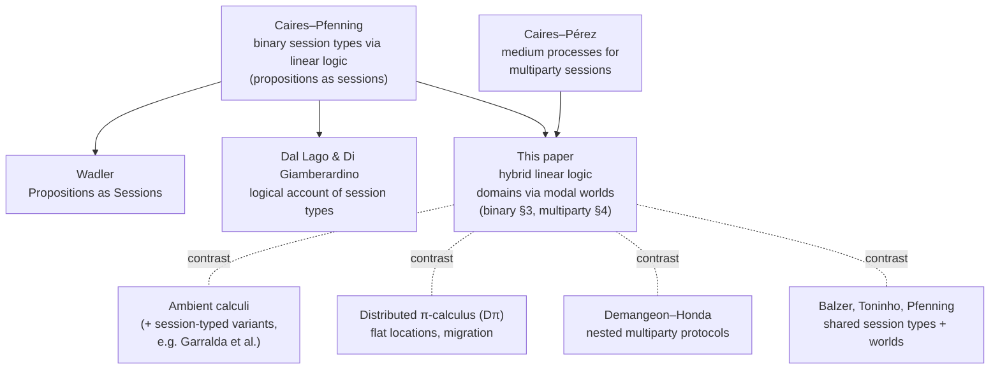

# Related Work and Positioning

[[book-guidelines|↩ Back to guidelines]]

## Why this section exists, and why it's short

Section 5 is a positioning section, not a technical one: it doesn't introduce new
definitions or theorems, it tells you what the paper's actual novelty *is* by
subtracting out everything nearby that could be mistaken for it. That's a
different kind of writing than Sections 2–4, and it earns its keep only by
being precise about boundaries — one sentence can do the job a whole
paragraph of motivation could not. The source material here really is thin:
about a page and a half of dense prose citing roughly a dozen papers, plus
a half-page conclusion. There is no new formalism to unpack, so this article
stays proportionally short rather than padding a page-and-a-half of
comparative claims into something that pretends to be deeper than it is.

The throughline worth holding onto: every comparison in Section 5 is really
answering one question — *what exactly do you get from combining hybrid
modal logic with linear logic, that you would not get from doing something
that merely looks similar?* Each related work either (a) shares the logical
lineage but doesn't have domains, (b) shares the idea of "places processes
move between" but doesn't have structured, session-typed interaction, or
(c) shares session types but sacrifices the property the paper cares about
most — being a genuine, non-disruptive extension of the base theory.

## The lineage: what this paper is a Curry–Howard descendant of

Before contrasting with things it *isn't*, it's worth being explicit about
what it *is* an extension of. Section 5 opens by placing the paper in "a
rich history of works on the logical foundations of concurrency," name-checking
the general propositions-as-processes tradition, then narrowing to session-based
concurrency specifically via Wadler's *Propositions as Sessions* and Dal Lago
and Di Giamberardino's logical account of session types. Medium-based analyses
of *multiparty* sessions — the technique this paper's own §4 [[Medium-Processes|medium processes]]
generalize — were developed by Caires and Pérez, and reused in an account of
multiparty sessions grounded in extended classical linear logic.

This matters because it tells you where the "conservativity" obligation comes
from (see below): this paper isn't proposing a new theory of concurrency from
scratch, it's proposing a *specific, minimal extension* to an existing,
well-regarded one. That framing sets the bar for every comparison that
follows — the question for each related system is never just "does it also
have domains/locations/worlds," but "does it get there by extending the same
base theory conservatively, or by doing something structurally different?"

## Ambient calculi: mobility without structured interaction

The Ambient calculus models processes moving across *ambients* — an
abstraction of administrative domains, roughly boxes that can be opened,
dissolved, or moved into one another. Type systems built for Ambient calculi
enforce security and communication-oriented properties phrased in terms of
*ambient movement*: which ambients may enter which, which capabilities a
process needs to move. Garralda et al. go further and integrate binary
session types into an Ambient calculus, specifically to guarantee that
session protocols survive ambient mobility undisturbed.

Here is the differentiator the paper insists on, stated in its own terms:
these systems "do not cover issues of structured interaction, central in our
work." Ambient type systems are fundamentally about *where a process is
allowed to be* — they answer questions about the movement graph itself. What
they do not give you is a guarantee about the *shape of the conversation*
that happens once a process arrives: session fidelity (this channel really
does carry the messages its type says it does) and global progress
(the protocol never deadlocks) are properties about communication structure,
not about mobility. Garralda et al.'s hybrid gets you sessions *and* mobility,
but as two systems bolted together, each independently sound; the paper's own
claim is to be the first in this setting where migration and communication are
governed by the *same* typing discipline, jointly, and where global progress
holds across both — "session protocols never jeopardize migration and
vice-versa."

**What would this paper look like if it had instead followed the Ambient-calculus
approach?** You'd get a type system with two layers: an ambient-movement
sublanguage checking "is this migration permitted," bolted onto an
independently-checked session sublanguage verifying "is this channel used
according to its protocol." The two checks would compose only in the weak
sense that neither one breaks *while the other one runs* — there would be no
single well-formedness invariant, like this paper's $\Omega \vdash \omega_1
\prec^* \Delta$ (Section 3), tying a session's location to the domains of
every other session it's allowed to interact with. Global progress would need
to be proven twice, separately, or not proven jointly at all — the paper's own
point is that jointly is exactly the guarantee Ambient-based systems, even the
session-typed ones, do not offer.

## The distributed π-calculus: flat locations vs. a domain hierarchy

The distributed π-calculus (D$\pi$) extends the π-calculus with *flat
locations*: named places where processes reside, local (location-scoped)
communication, and explicit process migration between locations. On the
surface this looks close to domains-as-locations, and the paper concedes as
much — "domains in our model may be read as locations, this is just one
specific interpretation." But two things distinguish the paper's domains from
D$\pi$'s locations. First, domains admit *other* readings entirely —
administrative domains, security levels — precisely because the type system
never commits to what a domain "physically" is; it only commits to the
accessibility relation between them. Second, and more structurally, D$\pi$'s
locations are flat: there is no hierarchy, no partial-order or preorder
structure organizing which locations can reach which. This paper's domains
come with exactly that: a Kripke-style accessibility relation $\prec$ (Section
3) that can be instantiated as a strict hierarchy, a lattice of security
levels, an equivalence relation (recovering S5-style symmetric access, cf.
Appendix C), or anything satisfying the minimal structure the type system
requires. D$\pi$ gives you *places*; this paper gives you *a partially
observable graph of reachability between places*, and makes that graph itself
part of the typing discipline (a domain communication prefix can send or
receive a domain identifier, and the type system tracks what's reachable from
what without ever requiring global knowledge of the whole domain structure).

## Nested multiparty protocols (Demangeon–Honda): structurally close, semantically different

This is the closest syntactic cousin in Section 5. Demangeon and Honda's
[[Multiparty-Session-Types|multiparty session types]] include a nesting construct that looks a lot like
this paper's own `p moves q̃ to ω for G1;G2` (Section 4) — both introduce a
sub-protocol that runs, then returns control to a continuation. The paper is
candid about the resemblance and equally candid about the difference: "the
focus in [Demangeon–Honda] is on modularity in choreographic programming;
domains nor domain migration are not addressed." Their nesting is a
*structuring* device for global types — a way to factor a large protocol into
reusable pieces — not a way to say anything about where participants are or
what they're permitted to access while nested. Two further capabilities of
Demangeon–Honda's construct that this paper's does not (yet) have: their
nested protocols can involve *local participants* (participants scoped only
to the nested sub-protocol, invisible outside it) and can be *parameterized on
data* from prior protocol actions. The paper explicitly flags both as future
directions rather than gaps it has already closed — it conjectures local
participants can be accommodated similarly, and suggests data parameterization
could be recovered via existing work on dependent session types, with
asynchrony and recursion likewise importable from the broader logical
session-types literature.

So the two systems are almost dual: Demangeon–Honda nests protocols to modularize
*structure*, this paper nests protocols (`moves ... to ω for ...`) to scope
*access* — the sub-protocol's participants are required to be jointly present
in a specific, accessible domain, and the whole point of the construct is the
domain constraint, not the modularity.

## Balzer, Toninho, Pfenning: worlds and accessibility, but not conservative

This is the comparison Section 5's Key Questions push hardest on, and it's
worth being precise rather than gesturing at "similar but different." Balzer
et al. overlay a notion of *world* and an *accessibility* relation onto a
system of *shared* (not purely linear) session types, with the specific goal
of proving deadlock-freedom. On the surface — worlds, accessibility, a
correctness property about processes not getting stuck — this looks like the
closest possible relative. The paper names three concrete structural
differences:

1. **Accessibility is instantiated differently.** Balzer et al. fix
   accessibility to be a *partial order*. This paper's accessibility relation
   $\prec$ is a parameter of the framework — the base theory only assumes
   reflexivity/transitivity-style closure properties as needed per
   application (recall $\prec^*$, the reflexive-transitive closure used in
   the well-formedness invariant), and specific readings (e.g., the S5 encoding
   in Appendix C) can strengthen it to an equivalence relation. The paper's
   relation is a *parameter*, not a fixed order.
2. **Sessions carry multiple worlds.** In Balzer et al.'s system a shared
   session can be associated with more than one world; this paper's typing
   judgment assigns each session a single domain ($x{:}A[\omega]$, Section 3),
   with movement between domains handled explicitly by the $@_\omega A$
   connective and its typing rules, never by a session silently belonging to
   several places simultaneously.
3. **They are not conservative with respect to linear logic.** This is the
   deepest difference, and the one the paper states most bluntly: "[Balzer et
   al.] are not conservative wrt linear logic, being closer to
   partial-order-based typings for deadlock-freedom."

**What does "conservative" mean here, precisely?** Recall from Section 2 of
this book's guidelines (topic 2, "Conservativity over non-hybrid session
types") that this paper's own hybrid extension is built so that when you
strip away the hybrid connectives ($@_\omega A$, $\forall\alpha.A$,
$\exists\alpha.A$, $\downarrow\alpha.A$) and collapse the accessibility
relation to the trivial one-domain case, you recover *exactly* Caires–Pfenning's
original binary session type theory — same typing rules for the multiplicative,
additive, and exponential connectives, same theorems, no reinterpretation of
what a session or a typing judgment *means*. Conservativity is a purity
property: the extension adds new proof rules and a new judgment
($\Omega \vdash \omega_1 \prec \omega_2$) alongside the old ones, but it never
changes what the old rules do or forces existing proofs/processes to be
reinterpreted. This is exactly the sense in which the base binary theory is a
strict subset of the extended one — every non-domain-aware session-typed
process and its correctness proof is untouched by the extension.

Balzer et al. cannot make this claim, and structurally cannot, because their
accessibility discipline doesn't sit as an additional judgment layered on top
of an unmodified linear-logic core — it is baked into a fundamentally
different structural assumption (shared, not purely linear, sessions;
sessions with multiple simultaneous world-memberships; a fixed partial order
rather than a parametric relation). Their system is a good, purpose-built tool
for one job — proving deadlock-freedom, which they do share with this paper —
but it isn't answerable to the "does this reduce to plain linear logic when
you turn the new feature off" test, because there's no clean subtraction that
gets you back to an untouched linear-logic base. The paper places it instead
alongside other partial-order-based typings for deadlock-freedom — a sibling
technique with an overlapping goal, not a shared logical foundation.

**What would this paper look like if it had instead followed the Balzer et
al. approach?** You would not have Section 3's clean well-formedness invariant
sitting *on top of* an otherwise-standard linear sequent calculus. Domains
would need to be threaded through the session type itself as a multi-world
annotation rather than expressed via a single new connective ($@_\omega A$)
whose left/right rules slot into the existing proof-rule schema. The
accessibility relation would be fixed as a partial order from the start rather
than left parametric — closing off the S5/equivalence-relation instantiation
that Appendix C uses to recover Murphy et al.'s $\lambda 5$ modal logic as a
special case. And critically, every one of Section 3's safety theorems (type
preservation, global progress, termination) would need to be proved for the
combined worlds-plus-sharing system directly, rather than inherited for free
on the "domain-free fragment" by conservativity — there would be no fragment
you could point to and say "this part is just linear logic, already known to
be sound."

## Concluding Remarks (Section 6): the paper's own self-summary

Section 6 is short enough to summarize faithfully in full. The paper recaps
its contribution in one sentence — a Curry–Howard interpretation of hybrid
linear logic as domain-aware session types — and emphasizes two things about
it: domain-awareness lives in *both* processes and types (not bolted on as an
external annotation), which lets it handle scenarios where the actual domain
is only determined at runtime (this is exactly the payoff of
$\forall\alpha.A$/$\exists\alpha.A$ domain quantification from Section 3, and
the $\exists\alpha$/$\forall\alpha$ asymmetry in the multiparty migration
projection from Section 4); and the accessibility relation is what lets the
system additionally rule out communication with domains that were never meant
to be reachable — a guarantee the paper says goes "beyond the scope of
previous works," which is the section-5 comparisons in one clause.

The multiparty extension is framed as *the* application demonstrating the
framework generalizes cleanly: medium processes let the correctness
properties proved for the binary theory transfer to the multiparty setting
"for free," rather than requiring a second, independent safety proof — the
same conservativity instinct that shaped the comparison with Balzer et al.
appears again here as an architectural choice, not just a comparative talking
point.

### Future work, and why accessibility isn't quite information flow

Two directions are sketched:

**Contract-enforcing mediums.** Since a medium process already sits between
all participants of a multiparty session and mediates every interaction
(Section 4, Def. 4.8), it's a natural place to add runtime monitoring:
a medium that doesn't just relay messages according to the global type but
actively checks them against a richer specification (a *contract*), building
on prior work on runtime monitoring for session-based systems. This is a
fairly conservative extension of an idea already present in the paper —
the medium already *is* a trusted intermediary; contract enforcement asks it
to do a bit more work at each relay step.

**The information-flow connection, and its precise limit.** The paper notices
that "enforcement of communication across accessible domains suggests high-level
similarities with information flow analyses in multiparty sessions" —
unsurprising, since both are about controlling which principals can learn or
affect which data. But it names the limit exactly: accessibility "does not
capture the directionality needed to model such analyses outright." What does
that mean concretely? Accessibility ($\omega_1 \prec \omega_2$) answers "can a
process at $\omega_1$ reach/use a session located at $\omega_2$" — a
reachability question, symmetric enough in structure that it doesn't
distinguish *sources* from *sinks*. Information-flow control needs more: a
notion of data flowing *from* a lower-security domain *to* a higher one (or
vice versa, depending on the policy), where reachability in one direction is
permitted and in the other is exactly the violation you want to statically
rule out (e.g., "public data may flow into a secure domain, but secure data
must never flow back out"). The paper's accessibility relation has no built-in
asymmetry between "can read from" and "can write to" — extending it with that
directionality, rather than reusing it as-is, is left as the open question.

## Comparative summary

| System | Core mechanism | Structured session interaction? | Domain/location structure | Conservative over binary linear logic? | Primary correctness goal |
|---|---|---|---|---|---|
| **This paper** | Hybrid linear logic; domains as modal worlds; $@_\omega A$, $\forall/\exists\alpha$, $\downarrow\alpha$ | Yes — full session typing (fidelity, progress) | Parametric Kripke accessibility $\prec$ (hierarchy, lattice, equivalence, etc.) | Yes, by construction | Session fidelity + global progress + termination + domain preservation |
| **Ambient calculi** (+ session-typed variants) | Ambients as movable administrative boxes; capability-based movement typing | Only in hybrids like Garralda et al., as a bolted-on second layer | Ambient nesting/movement graph | N/A (different base calculus) | Safe mobility; sessions undisturbed by movement (in hybrids) |
| **Distributed π-calculus (Dπ)** | Flat named locations; local communication; migration | No session discipline | Flat (no hierarchy) | N/A (untyped/differently-typed base) | Migration correctness, not session fidelity |
| **Demangeon–Honda nested multiparty** | Nesting construct for global types | Yes, but nesting is for modularity, not access control | None — no domains or migration | N/A (extends multiparty session types, not linear logic directly) | Modularity in choreographic programming |
| **Balzer, Toninho, Pfenning (worlds)** | Worlds + accessibility over *shared* session types | Yes | Fixed partial order; sessions may have multiple worlds | **No** — not conservative wrt linear logic | Deadlock-freedom |

## Where this leads

Section 5's comparisons aren't decoration — they retroactively justify design
choices already visible in Sections 2–4. Conservativity over the base binary
theory wasn't an afterthought used only to win a related-work argument
against Balzer et al.; it's why $@_\omega A$ was added as one more connective
slotting into the existing linear sequent calculus (Section 3) rather than as
a structural change to what a session or a typing context *is* — and it's why
the multiparty extension (Section 4) is built on medium processes that reduce
to ordinary binary typability (Theorems 4.11–4.12) instead of requiring an
independent multiparty safety proof. The Ambient-calculus comparison
retroactively explains why the paper insists on proving global progress
*jointly* for migration and communication in Section 3, rather than as two
separate properties — that joint guarantee is precisely the thing Ambient-based
session hybrids don't offer. And the paper's own honesty about where it stops
— accessibility lacking the directionality information-flow control would
need — is a fitting note to end the whole paper on: it names the exact
structural feature (asymmetric flow, not just reachability) that the next
extension of this line of work would have to add, rather than overclaiming
that domain accessibility already solves a problem it visibly doesn't.
